# SparkFun RedBoard Artemis 的连接指南

> 原文：<https://learn.sparkfun.com/tutorials/hookup-guide-for-the-sparkfun-redboard-artemis>

## 介绍

[SparkFun RedBoard Artemis](https://www.sparkfun.com/products/15444) 囊括了我们多年来在原始 Arduino Uno 上改进的所有经验，同时添加了强大的 Artemis 模块，以便您可以轻松使用 Cortex-M4F。让我们开始吧！

[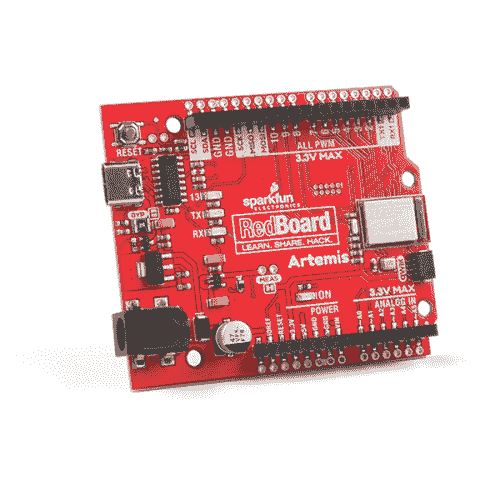](https://www.sparkfun.com/products/15444) 

将**添加到您的[购物车](https://www.sparkfun.com/cart)中！**

 **### [SparkFun RedBoard Artemis](https://www.sparkfun.com/products/15444)

[In stock](https://learn.sparkfun.com/static/bubbles/ "in stock") DEV-15444

RedBoard Artemis 采用 SparkFun 的功能强大的 Artemis 模块，并将其包装在一个易于使用和熟悉的环境中…

$21.509[Favorited Favorite](# "Add to favorites") 32[Wish List](# "Add to wish list")** **[https://www.youtube.com/embed/-fJuLcr0CT8/?autohide=1&border=0&wmode=opaque&enablejsapi=1](https://www.youtube.com/embed/-fJuLcr0CT8/?autohide=1&border=0&wmode=opaque&enablejsapi=1)

[https://www.youtube.com/embed/sthuUZOTQ-U/?autohide=1&border=0&wmode=opaque&enablejsapi=1](https://www.youtube.com/embed/sthuUZOTQ-U/?autohide=1&border=0&wmode=opaque&enablejsapi=1)

### 所需材料

你需要一个 RedBoard Artemis 和一根 USB C 线。任何 USB C 线都可以，包括你手机充电器附带的那根。如果你没有电缆，你可以在这里买一根 3 英尺长的或者在这里买一根别致的可翻转的。

 

将**添加到您的[购物车](https://www.sparkfun.com/cart)中！**

 **### [SparkFun RedBoard Artemis](https://www.sparkfun.com/products/15444)

[In stock](https://learn.sparkfun.com/static/bubbles/ "in stock") DEV-15444

RedBoard Artemis 采用 SparkFun 的功能强大的 Artemis 模块，并将其包装在一个易于使用和熟悉的环境中…

$21.509[Favorited Favorite](# "Add to favorites") 32[Wish List](# "Add to wish list")**** 

将**添加到您的[购物车](https://www.sparkfun.com/cart)中！**

 **### [可逆 USB A 转 C 线- 2m](https://www.sparkfun.com/products/15424)

[18 available](https://learn.sparkfun.com/static/bubbles/ "18 available") CAB-15424

这些 2 米长的电缆稍加修改后，就可以插入其端口，而不用考虑其在 U…

$8.951[Favorited Favorite](# "Add to favorites") 4[Wish List](# "Add to wish list")**** ****### 推荐阅读

如果你不熟悉 Qwiic 系统，我们推荐你在这里阅读[以获得一个概述](https://www.sparkfun.com/qwiic)。

|  |
| *[Qwiic 连接系统](https://www.sparkfun.com/qwiic)* |

[https://www.youtube.com/embed/NKyA5y44-0E/?autohide=1&border=0&wmode=opaque&enablejsapi=1](https://www.youtube.com/embed/NKyA5y44-0E/?autohide=1&border=0&wmode=opaque&enablejsapi=1)

我们还建议在继续之前查看这些教程:

 [### I2C](https://learn.sparkfun.com/tutorials/i2c) An introduction to I2C, one of the main embedded communications protocols in use today.[Favorited Favorite](# "Add to favorites") 128 [### RedBoard Qwiic 连接指南](https://learn.sparkfun.com/tutorials/redboard-qwiic-hookup-guide) This tutorial covers the basic functionality of the RedBoard Qwiic. This tutorial also covers how to get started blinking an LED and using the Qwiic system.[Favorited Favorite](# "Add to favorites") 5 [### 将 SparkFun Edge 板与 Ambiq Apollo3 SDK 配合使用](https://learn.sparkfun.com/tutorials/using-sparkfun-edge-board-with-ambiq-apollo3-sdk) We will demonstrate how to get started with your SparkFun Edge Board by setting up the toolchain on your computer, examining an example program, and using the serial uploader tool to flash the chip.[Favorited Favorite](# "Add to favorites") 7 [### 用 SparkFun Artemis 设计](https://learn.sparkfun.com/tutorials/designing-with-the-sparkfun-artemis) Let's chat about layout and design considerations when using the Artemis module.[Favorited Favorite](# "Add to favorites") 4 [### 用 Arduino 开发 Artemis](https://learn.sparkfun.com/tutorials/artemis-development-with-arduino) Get our powerful Artemis based boards (Artemis Nano, BlackBoard Artemis, and BlackBoard Artemis ATP) blinking in less than 5 minutes using the SparkFun Artemis Arduino Core 6

## 硬件概述

如果你以前用过 Arduino Uno，你应该非常熟悉各种母插头和筒状插孔电源。如果你是 Arduino 板的新手，请查看 [SparkFun RedBoard Qwiic 教程](https://learn.sparkfun.com/tutorials/redboard-qwiic-hookup-guide)，了解更多关于你将在 Artemis RedBoard 上看到的许多基本板功能的信息。在本教程中，我们将涵盖红板阿尔特弥斯的独特方面。

[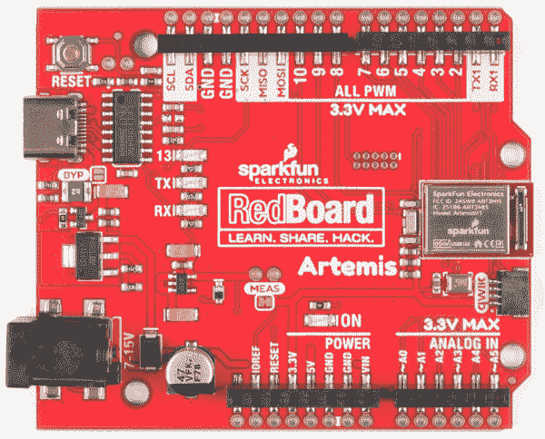](https://cdn.sparkfun.com/assets/learn_tutorials/9/2/5/15444-SparkFun_RedBoard_HighResFront.jpg)⚡ **Warning:** All pins are **3.3V**. DO NOT expose the pins to 5V.

The ADC on the Artemis is **0-2V**. Exposing an ADC pin to 3.3V will not harm the device but the ADC will saturate returning 16,383 (14-bit) for voltages greater than 2V.

### GPIO

查看 Artemis RedBoard 的正面，您会注意到母接头旁边是电镀通孔。我们发现，虽然我们享受使用接头的便利，但有时我们只想将直接焊接到我们的电路板上。为此，我们添加了 PTH 导轨。请注意，这些并不都是接地引脚-这些引脚具有其母接头附件旁边标注的任何功能。

[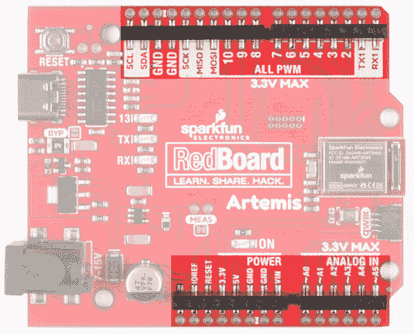](https://cdn.sparkfun.com/assets/learn_tutorials/9/2/5/15444-SparkFun-RedBoard-Artemis-GPIO.jpg)

### 串行和 JTAG 编程

RedBoard Artemis 有两种编程方法。最常见的是 USB C 连接器，作为 USB 到串行桥。只需按下 Arduino IDE 中的“上传”或 SDK 中的“启动加载”, Artemis 上的固件就会更新。

*USB-C and JTAG footprints*

我们在 RedBoard Artemis 上使用 CH340C。该驱动程序应该会自动安装在大多数操作系统上。然而，有各种各样的操作系统。第一次将芯片连接到计算机的 USB 端口时，或者有操作系统更新时，您可能需要安装驱动程序。更多信息，请查看我们的[如何安装 CH340 驱动教程](https://www.sparkfun.com/ch340)。

 [### 如何安装 CH340 驱动程序

#### 2019 年 8 月 6 日](https://learn.sparkfun.com/tutorials/how-to-install-ch340-drivers) How to install CH340 drivers (if you need them) on Windows, Mac OS X, and Linux.[Favorited Favorite](# "Add to favorites") 9

第二种方法是 JTAG 编程。需要断点级别调试的高级用户可以使用未填充的 JTAG 足迹。我们建议检查我们的 [JTAG 部分](https://www.sparkfun.com/categories/tags/jtag)的兼容公头和兼容的 JTAG 编程器和调试器。

### Mic 和 RTC

Artemis 在低功耗语音识别方面表现出色。为此，我们在板上集成了一个 PDM MEMS 麦克风。此外，Artemis 模块可以在给定外部 32kHz 晶振的情况下操作 RTC，因此我们已经包括了这一点。

### Qwiic 和 I2C

Artemis 上的 I ² C 引脚标有 SDA 和 SCL。它们在 Arduino IDE 中使用`Wire.begin()`、`Wire.read()`等进行控制。相同的 SDA/SCL 引脚连接到 Qwiic 连接器，这样你就可以使用 SparkFun 的 [Qwiic 生态系统](https://www.sparkfun.com/qwiic)(每周有 50 多块电路板，甚至更多！).

[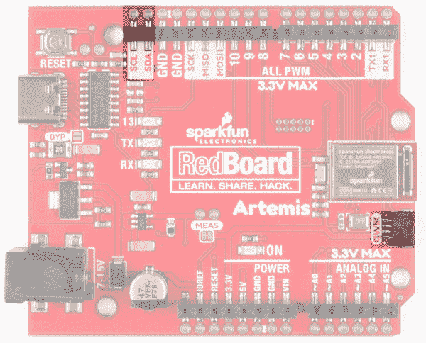](https://cdn.sparkfun.com/assets/learn_tutorials/9/2/5/15444-SparkFun-RedBoard-Artemis-Qwiic-I2C-Connectors.jpg)**Note:** The standard Arduino Uno has SDA/SCL additionally connected to A4/A5\. A4/A5 on the Artemis are not I²C related, they are only Analog. SDA/SCL are digital pins 14/15 respectively. A4/A5 can be used as digital pins 20/21 respectively.

### Serial0、AREF 和 USB 接口

在 RedBoard 的背面有一些高级功能。通常，AREF 引脚位于 SDA 和 GND 引脚之间。Artemis 模块没有对应的 pin，因此我们将该 pin 转换为 GND。如果你有一个利用 AREF 引脚的屏蔽，或者只是想释放它，你可以切断 AREF 跳线，位于 SDA 和 GND 之间的标签“GND”将保持断开。

在 Artemis 上，TX0/RX0 用于将新代码和 Serial.println()语句引导加载到计算机的终端窗口。CH340C 负责串行到 USB 的转换。但是，如果您需要使用这些 pin，它们是可用的。TX0/RX0 可用作 GPIO 和特殊功能，但对于大多数应用，这些引脚保留为串行引脚，用于引导加载。

对于将 RedBoard Artemis 嵌入外壳的用户来说，USB 焊盘是外露的，因此外部 USB 连接器可以位于外壳的边缘，并连接回 USB 焊盘。

[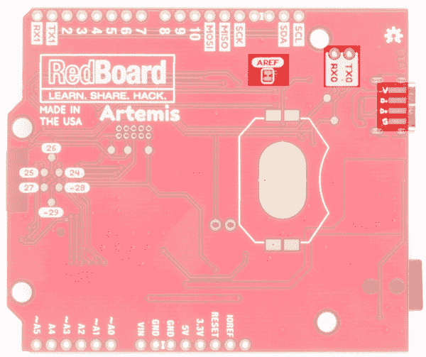](https://cdn.sparkfun.com/assets/learn_tutorials/9/2/5/15444-SparkFun-RedBoard-Artemis-AREF-TX0-RX0-USBConnectorPads.jpg)

### 总线主控垫

Artemis 的一个令人惊讶的方面是有大量的 SPI 和 I ² C 总线可用。我们 SparkFun 决定，最好将更多的 PWM 和 ADC 引脚连接到电路板正面的母接头，而不是额外的 I ² C 和 SPI 引脚。但是我们就是忍不住！用户可以通过电路板底部的 SMD 焊盘使用 Wire1/SPI1 和 Wire3/SPI3。如果需要，这些引脚可以用作 GPIO，引脚 28/29 也支持 PWM。

**Advanced Trick:** Do you just need a 2nd I²C port? The pins 12/13 can be reconfigured from SPI to be Wire0.**Note:** A 'bus master' is a series of pins that can be either an SPI bus or an I²C bus. For example, pins 8/9 can be SCL1/SDA1 or pins 8/9/10 can be SCK1/MISO1/MOSI1\.[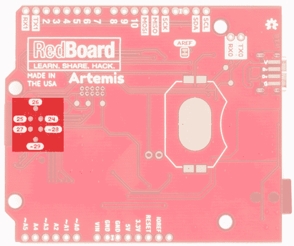](https://cdn.sparkfun.com/assets/learn_tutorials/9/2/5/15444-SparkFun-RedBoard-Artemis-BusMasterPads.jpg)

### 电流测量跳线

Artemis 可以低至 6μA/MHz 运行，这意味着该模块可以在不到半毫安的情况下以 48MHz 的速度运行。为了实现测量和隔离耗电设备(如 LM317 稳压器)，我们增加了一个 NC(常闭)跳线。通过切断跳线，模块的 VDD 迹线被中断。将阳跳线或电线焊接到相应的孔中，可以插入电流表并精确监控应用消耗的电流。

[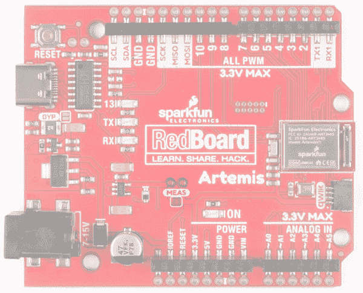](https://cdn.sparkfun.com/assets/learn_tutorials/9/2/5/15444-SparkFun-RedBoard-Artemis-CurrentMeasurementJumper.jpg)

对于绝大多数项目，可以使用墙壁适配器或 USB 电源。但是当正确隔离时，阿耳特弥斯可以用硬币电池运行几个星期！因此，我们设计了一个 20 毫米的 SMD 硬币电池，以便用户可以通过标准 CR2032 为 Artemis 供电。您可以在此选择兼容的硬币盒支架[。](https://www.sparkfun.com/products/11892)

[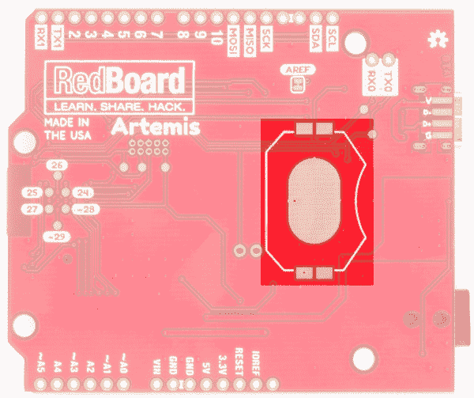](https://cdn.sparkfun.com/assets/learn_tutorials/9/2/5/15444-SparkFun-RedBoard-Artemis-CoinCellBatteryPads.jpg)

### 旁路跳线

USB C 很棒。它是可逆的，可以在 5 伏下提供高达 2 安培的电流，无需任何功率传输(PD)协商。我们在 Artemis 上包含了一个 2A 自复位保险丝(通常称为 *PTC* )作为安全功能，以防您的项目决定消耗过多的电力(并可能开始产生火花和起火)。那很有趣，不是吗？明白了吗？SparkFun？).如果 RedBoard 开始从 USB 源获得超过 2 安培的电流，自复位保险丝将自动触发，并断开主板与计算机或电源的连接。这应该可以保护你的电源和你的 RedBoard 上的痕迹。

然而，除了 2A，还有很多合法的项目需要更多。我们设计的电源走线可以承受 10C 温度上升的 2A。如果你的电源可以提供足够的电力，并且你知道你在做什么，你可以关闭 BYP 跳线绕过自复保险丝。

[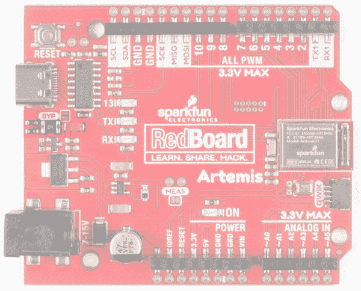](https://cdn.sparkfun.com/assets/learn_tutorials/9/2/5/15444-SparkFun-RedBoard-Artemis-BypassJumper.jpg)

## 软件设置

RedBoard Artemis 运行 Arduino 和更高级的 Ambiq HAL/SDK。检查这些教程，让你在 5 分钟内起床并眨眼！

 [### 用 Arduino 开发 Artemis

#### 2019 年 6 月 20 日](https://learn.sparkfun.com/tutorials/artemis-development-with-arduino) Get our powerful Artemis based boards (Artemis Nano, BlackBoard Artemis, and BlackBoard Artemis ATP) blinking in less than 5 minutes using the SparkFun Artemis Arduino Core 6 [### 将 SparkFun Edge 板与 Ambiq Apollo3 SDK 配合使用

#### 2019 年 3 月 28 日](https://learn.sparkfun.com/tutorials/using-sparkfun-edge-board-with-ambiq-apollo3-sdk) We will demonstrate how to get started with your SparkFun Edge Board by setting up the toolchain on your computer, examining an example program, and using the serial uploader tool to flash the chip.[Favorited Favorite](# "Add to favorites") 7

## 解决纷争

**Need help?**

If your product is not working as you expected or you need technical assistance or information, head on over to the [SparkFun Technical Assistance](https://www.sparkfun.com/technical_assistance) page for some initial troubleshooting.

If you don't find what you need there, the [SparkFun Forums](https://forum.sparkfun.com/index.php) are a great place to find and ask for help. If this is your first visit, you'll need to [create a Forum Account](https://forum.sparkfun.com/ucp.php?mode=register) to search product forums and post questions.

[**SparkFun Artemis Forums**](https://forum.sparkfun.com/viewforum.php?f=167)

## 资源和更进一步

你知道你可以用红纸板阿耳忒弥斯作为你自己的阿耳忒弥斯产品的起点吗？从我们的 repo [这里](https://github.com/sparkfun/RedBoard_Artemis)获取设计文件，并使用 Eagle PCB 编辑它们！

有关 RedBoard Artemis 和 Artemis 模块本身的更多信息，请查看以下链接:

*   [示意图(PDF)](https://cdn.sparkfun.com/assets/4/5/a/3/e/RedBoardArtemisSchematic.pdf)
*   [老鹰文件(ZIP)](https://cdn.sparkfun.com/assets/3/d/8/a/3/RedBoardArtemisEagleFiles.zip)
*   [RedBoard Artemis 图形数据表(PDF)](https://cdn.sparkfun.com/assets/learn_tutorials/9/2/5/RedBoardArtemis.pdf)
*   [Artemis 模块图形数据表(PDF)](https://cdn.sparkfun.com/assets/learn_tutorials/9/1/2/ArtemisModulev2.pdf)
*   [Arduino 核心](https://github.com/sparkfun/Arduino_Apollo3)
*   [蒿属植物信息页](https://www.sparkfun.com/artemis)
*   [GitHub 硬件回购](https://github.com/sparkfun/RedBoard_Artemis)
*   [阿波罗 3 数据表(PDF)](https://cdn.sparkfun.com/assets/1/5/c/6/7/Apollo3-Blue-MCU-Datasheet_v0_15_0.pdf)
*   [Ambiq](https://ambiq.com/)
*   [CH340E USB 转串行 IC 驱动器](https://www.sparkfun.com/ch340)

你现在已经探索了棋盘，让我们开始用 Arduino 闪烁吧！或者您可能想了解更多关于 Artemis 模块本身的信息。查看这些教程！

 [### 用 SparkFun Artemis 设计](https://learn.sparkfun.com/tutorials/designing-with-the-sparkfun-artemis) Let's chat about layout and design considerations when using the Artemis module.[Favorited Favorite](# "Add to favorites") 4 [### 用 Arduino 开发 Artemis](https://learn.sparkfun.com/tutorials/artemis-development-with-arduino) Get our powerful Artemis based boards (Artemis Nano, BlackBoard Artemis, and BlackBoard Artemis ATP) blinking in less than 5 minutes using the SparkFun Artemis Arduino Core 6

你知道 Artemis 和我们的 Qwiic 系列兼容吗？检查这些产品，只需插入和工作！

 

### [SparkFun 树莓 Pi 4 基础套装- 4GB](https://www.sparkfun.com/products/16384)

[Out of stock](https://learn.sparkfun.com/static/bubbles/ "out of stock") KIT-16384

Raspberry Pi 4 基本套件包括启动和运行 Raspberry Pi 4 4GB 所需的一切。

6[Favorited Favorite](# "Add to favorites") 21[Wish List](# "Add to wish list") 

将**添加到您的[购物车](https://www.sparkfun.com/cart)中！**

 **### [spark fun Top pHAT for Raspberry Pi](https://www.sparkfun.com/products/16653)

[In stock](https://learn.sparkfun.com/static/bubbles/ "in stock") DEV-16653

SparkFun Top pHAT 是 Raspberry Pi 或任何 2x20 GPIO SBC 的基础机器学习插件！

$49.95[Favorited Favorite](# "Add to favorites") 20[Wish List](# "Add to wish list")****[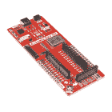](https://www.sparkfun.com/products/16828) 

将**添加到您的[购物车](https://www.sparkfun.com/cart)中！**

 **### [SparkFun Artemis 开发套件](https://www.sparkfun.com/products/16828)

[In stock](https://learn.sparkfun.com/static/bubbles/ "in stock") DEV-16828

Artemis 开发套件基于 SparkFun Artemis 模块，突出软件开发功能，如 Arm Mbed…

$48.50[Favorited Favorite](# "Add to favorites") 2[Wish List](# "Add to wish list")****[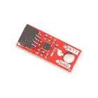](https://www.sparkfun.com/products/21207) 

将**添加到您的[购物车](https://www.sparkfun.com/cart)中！**

 **### [【spark fun 微型三轴加速度计 Breakout - BMA400 (Qwiic)](https://www.sparkfun.com/products/21207)

[In stock](https://learn.sparkfun.com/static/bubbles/ "in stock") SEN-21207

SparkFun Qwiic BMA400 微型三轴加速度计突破提供了一个 3 轴加速度传感器完美的超低…

$9.95[Favorited Favorite](# "Add to favorites") 0[Wish List](# "Add to wish list")****** ******[https://www.youtube.com/embed/NKyA5y44-0E/?autohide=1&border=0&wmode=opaque&enablejsapi=1](https://www.youtube.com/embed/NKyA5y44-0E/?autohide=1&border=0&wmode=opaque&enablejsapi=1)

或者看看这篇博文，了解更多使用 RedBoard Artemis 的想法。

 [### 回流多士炉烤箱 Qwiic 黑客！

June 25, 2020](https://www.sparkfun.com/news/3319 "June 25, 2020: Grab some parts, strap a servo on it, and you'll be reflowing solder in no time!")[Favorited Favorite](# "Add to favorites") 2************