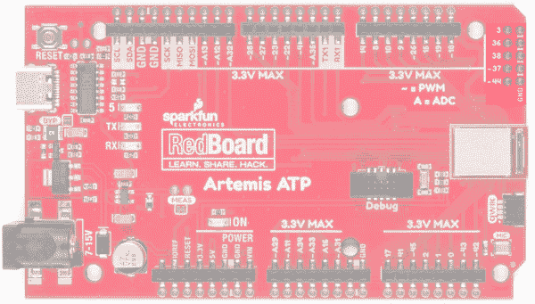

# SparkFun RedBoard Artemis ATP 的连接指南

> 原文：<https://learn.sparkfun.com/tutorials/hookup-guide-for-the-sparkfun-redboard-artemis-atp>

## 介绍

我们亲切地称[雷德博德阿尔特弥斯 ATP](https://www.sparkfun.com/products/15442) 为“所有的图钉！”板，因为它将 Artemis 模块的 48 个 GPIO 引脚中的每一个都分解成一个熟悉的巨型外形。除了 RedBoard 改进的电源调节和 USB 转串行外，我们还增加了一系列功能，帮助您充分利用 Artemis 模块的独特功能。让我们来看看！！

 

将**添加到您的[购物车](https://www.sparkfun.com/cart)中！**

 **### [spark fun RedBoard Artemis ATP](https://www.sparkfun.com/products/15442)

[32 available](https://learn.sparkfun.com/static/bubbles/ "32 available") DEV-15442

RedBoard Artemis ATP 有 48 个 GPIO，该板以 Arduino Mega 格式将它们全部分开。

$26.951[Favorited Favorite](# "Add to favorites") 17[Wish List](# "Add to wish list")** **[https://www.youtube.com/embed/-fJuLcr0CT8/?autohide=1&border=0&wmode=opaque&enablejsapi=1](https://www.youtube.com/embed/-fJuLcr0CT8/?autohide=1&border=0&wmode=opaque&enablejsapi=1)

[https://www.youtube.com/embed/sthuUZOTQ-U/?autohide=1&border=0&wmode=opaque&enablejsapi=1](https://www.youtube.com/embed/sthuUZOTQ-U/?autohide=1&border=0&wmode=opaque&enablejsapi=1)

### 所需材料

你需要一个 RedBoard Artemis ATP 和一根 USB C 线。任何 USB C 线都可以，包括你手机充电器附带的那根。

 

将**添加到您的[购物车](https://www.sparkfun.com/cart)中！**

 **### [spark fun RedBoard Artemis ATP](https://www.sparkfun.com/products/15442)

[32 available](https://learn.sparkfun.com/static/bubbles/ "32 available") DEV-15442

RedBoard Artemis ATP 有 48 个 GPIO，该板以 Arduino Mega 格式将它们全部分开。

$26.951[Favorited Favorite](# "Add to favorites") 17[Wish List](# "Add to wish list")**** 

### [USB 2.0 线 A 到 C - 3 脚](https://www.sparkfun.com/products/retired/15092)

[Retired](https://learn.sparkfun.com/static/bubbles/ "Retired") CAB-15092

USB C 棒极了。但是，在我们将所有的集线器、充电器和端口转换为 USB C 之前，这是您要使用的电缆…

**Retired**[Favorited Favorite](# "Add to favorites") 8[Wish List](# "Add to wish list")** **### 推荐阅读

如果你不熟悉 Qwiic 系统，我们推荐你在这里阅读[以获得一个概述](https://www.sparkfun.com/qwiic)。

|  |
| *[Qwiic 连接系统](https://www.sparkfun.com/qwiic)* |

[https://www.youtube.com/embed/NKyA5y44-0E/?autohide=1&border=0&wmode=opaque&enablejsapi=1](https://www.youtube.com/embed/NKyA5y44-0E/?autohide=1&border=0&wmode=opaque&enablejsapi=1)

我们还建议在继续之前查看这些教程:

 [### I2C](https://learn.sparkfun.com/tutorials/i2c) An introduction to I2C, one of the main embedded communications protocols in use today.[Favorited Favorite](# "Add to favorites") 128 [### RedBoard Qwiic 连接指南](https://learn.sparkfun.com/tutorials/redboard-qwiic-hookup-guide) This tutorial covers the basic functionality of the RedBoard Qwiic. This tutorial also covers how to get started blinking an LED and using the Qwiic system.[Favorited Favorite](# "Add to favorites") 5 [### 将 SparkFun Edge 板与 Ambiq Apollo3 SDK 配合使用](https://learn.sparkfun.com/tutorials/using-sparkfun-edge-board-with-ambiq-apollo3-sdk) We will demonstrate how to get started with your SparkFun Edge Board by setting up the toolchain on your computer, examining an example program, and using the serial uploader tool to flash the chip.[Favorited Favorite](# "Add to favorites") 7 [### 用 SparkFun Artemis 设计](https://learn.sparkfun.com/tutorials/designing-with-the-sparkfun-artemis) Let's chat about layout and design considerations when using the Artemis module.[Favorited Favorite](# "Add to favorites") 4 [### 用 Arduino 开发 Artemis](https://learn.sparkfun.com/tutorials/artemis-development-with-arduino) Get our powerful Artemis based boards (Artemis Nano, BlackBoard Artemis, and BlackBoard Artemis ATP) blinking in less than 5 minutes using the SparkFun Artemis Arduino Core 6

## 硬件概述

如果你以前用过 Arduino Mega，你应该对各种母插头和桶形插孔电源非常熟悉。在本教程中，我们将涵盖 RedBoard Artemis ATP 的独特方面。

⚡ **Warning:** All pins are **3.3V**. DO NOT expose the pins to 5V.

The ADC on the Artemis is **0-2V**. Exposing an ADC pin to 3.3V will not harm the device but the ADC will saturate returning 16,383 (14-bit) for voltages greater than 2V.

### GPIO

还记得我们的“所有的大头针！”外号？嗯，我们是认真的。在 RedBoard Artemis ATP 上，我们不仅将所有主要引脚拆分为母接头，还在它们旁边添加了一个电镀通孔辅助轨，让您可以选择即插即用或直接焊接到板上。

在电路板一侧，我们增加了一系列接地引脚，而不是将引脚数量增加一倍，以便于使用。

*Click on the image for a closer look*

### 串行和 JTAG 编程

RedBoard Artemis ATP 有两种编程方法。最常见的是 USB C 连接器，作为 USB 到串行桥。只需按下 Arduino IDE 中的“上传”或 SDK 中的“启动加载”, Artemis 上的固件就会更新。

我们使用 RedBoard Artemis ATP 上的 CH340C。该驱动程序应该会自动安装在大多数操作系统上。然而，有各种各样的操作系统。第一次将芯片连接到计算机的 USB 端口时，或者有操作系统更新时，您可能需要安装驱动程序。更多信息，请查看我们的[如何安装 CH340 驱动教程](https://www.sparkfun.com/ch340)。

 [### 如何安装 CH340 驱动程序

#### 2019 年 8 月 6 日](https://learn.sparkfun.com/tutorials/how-to-install-ch340-drivers) How to install CH340 drivers (if you need them) on Windows, Mac OS X, and Linux.[Favorited Favorite](# "Add to favorites") 9

第二种方法是 JTAG 编程。我们为需要断点级别调试的更高级用户填充了 JTAG 足迹。我们建议检查我们的 [JTAG 部分](https://www.sparkfun.com/categories/tags/jtag)的兼容 JTAG 编程器和调试器。

*USB-C and JTAG footprints*

### Mic 和 RTC

Artemis 擅长低功耗语音识别。为此，我们在板上集成了一个 PDM MEMS 麦克风。此外，Artemis 模块可以在给定外部 32kHz 晶振的情况下操作 RTC，因此我们已经包括了这一点。

引脚 36 和 37 连接到板载 PDM MEMS 麦克风，并在 ATP 板的右上侧断开。您可以将第二个 PDM 麦克风连接到引脚 36/37，或者您可以将 PDM 固件加载到 Artemis 模块上，并观察来自麦克风的 PDM 流量。注意引脚 36 和 37 旁边的接地引脚！

*Click on the image for a closer look*

如果您不打算使用板载麦克风，可以切断电路板背面的跳线，将引脚 36 和 37 用作 GPIO。

### Qwiic 和 I2C

Artemis 上的 I ² C 引脚标有 SDA 和 SCL。它们在 Arduino IDE 中使用`Wire.begin()`、`Wire.read()`等进行控制。相同的 SDA/SCL 引脚连接到 Qwiic 连接器，这样你就可以使用 SparkFun 的 [Qwiic 生态系统](https://www.sparkfun.com/qwiic)(每周有 50 多块电路板，甚至更多！).

**Note:** The standard Arduino has SDA/SCL additionally connected to A4/A5\. A4/A5 on the Artemis are not I²C related, they are only Analog. SDA/SCL are digital pins 14/15 respectively. A4/A5 can be used as digital pins 20/21 respectively.

### Serial0、AREF 和 USB 接口

在 RedBoard ATP 的背面有一些高级功能。通常，AREF 引脚位于 SDA 引脚和 GND 引脚之间。Artemis 模块没有对应的 pin，因此我们将该 pin 转换为 GND。如果你有一个利用 AREF 引脚的屏蔽，或者只是想释放它，你可以切断 AREF 跳线，位于 SDA 和 GND 之间的标签“GND”将保持断开。

在 Artemis 上，TX0/RX0 用于将新代码和 Serial.println()语句引导加载到计算机的终端窗口。CH340C 负责串行到 USB 的转换。但是，如果您需要使用这些引脚，它们是可用的。TX0/RX0 可用作 GPIO 和特殊功能，但对于大多数应用，这些引脚保留为串行引脚，用于引导加载。

对于将 RedBoard Artemis ATP 嵌入外壳的用户，USB 焊盘是外露的，因此外部 USB 连接器可以位于外壳边缘，并通过导线连接回 USB 焊盘。

### 电流测量跳线

Artemis 可以低至 6μA/MHz 运行，这意味着该模块可以在不到半毫安的情况下以 48MHz 的速度运行。为了实现测量和隔离耗电设备(如 LM317 稳压器)，我们增加了一个 NC(常闭)跳线。通过切断跳线，模块的 VDD 迹线被中断。将阳跳线或电线焊接到相应的孔中，可以插入电流表并精确监控应用消耗的电流。

对于绝大多数项目，可以使用墙壁适配器或 USB 电源。但是当正确隔离时，阿耳特弥斯可以用硬币电池运行几个星期！因此，我们设计了一个 20 毫米的 SMD 硬币电池，以便用户可以通过标准 CR2032 为 Artemis 供电。您可以在此选择兼容的硬币盒支架[。焊接时要小心，coincell 丝印垫比平时稍大。](https://www.sparkfun.com/products/11892)

*Click the image for a closer look**Click the image for a closer look*

### 旁路跳线

USB C 很棒。它是可逆的，可以在 5 伏下提供高达 2 安培的电流，无需任何功率传输(PD)协商。我们在 Artemis 上包含了一个 2A 自复位保险丝(通常称为 *PTC* )作为安全功能，以防您的项目决定消耗过多的电力(并可能开始产生火花和起火)。那很有趣，不是吗？明白了吗？SparkFun？).如果 RedBoard 开始从 USB 源获得超过 2 安培的电流，自复位保险丝将自动触发，并断开主板与计算机或电源的连接。这应该可以保护你的电源和你的 RedBoard 上的痕迹。

然而，除了 2A，还有很多合法的项目需要更多。我们设计的电源走线可以承受 10C 温度上升的 2A。如果您的电源可以提供足够的电力，并且您知道您在做什么，您可以关闭 BYP 跳线，从而绕过自复保险丝。

### 输入/输出主机

RedBoard Artemis ATP 最多可以有 6 个 I ² C 或 SPI 主机，这些引脚分布在整个电路板上。请务必查看 Artemis Arduino 内核中内置的优秀示例，了解如何轻松启用更多端口。

此外，我们在下面列出了每个主机及其相关的引脚。查看 [Apollo3 引脚图](https://cdn.sparkfun.com/assets/8/2/3/3/c/Apollo3_Pad_Mapping.pdf)了解更多信息。

| 掌握 | SCK/SCL | MISO/SDA | MOSI |
| **M0** | five | six | seven |
| **M1** | eight | nine | Ten |
| **M2** | Twenty-seven | Twenty-five | Twenty-eight |
| **M3** | forty-two | Forty-three | Thirty-eight |
| **M4** | Thirty-nine | Forty | forty-four |
| **M5** | Forty-eight | forty-nine | Forty-seven |

## 软件设置

RedBoard Artemis ATP 运行 Arduino 和更高级的 [Ambiq](https://ambiq.com/) HAL/SDK。检查这些教程，让你在 5 分钟内起床并眨眼！

 [### 用 Arduino 开发 Artemis

#### 2019 年 6 月 20 日](https://learn.sparkfun.com/tutorials/artemis-development-with-arduino) Get our powerful Artemis based boards (Artemis Nano, BlackBoard Artemis, and BlackBoard Artemis ATP) blinking in less than 5 minutes using the SparkFun Artemis Arduino Core 6 [### 将 SparkFun Edge 板与 Ambiq Apollo3 SDK 配合使用

#### 2019 年 3 月 28 日](https://learn.sparkfun.com/tutorials/using-sparkfun-edge-board-with-ambiq-apollo3-sdk) We will demonstrate how to get started with your SparkFun Edge Board by setting up the toolchain on your computer, examining an example program, and using the serial uploader tool to flash the chip.[Favorited Favorite](# "Add to favorites") 7

## 解决纷争

**Need help?**

If your product is not working as you expected or you need technical assistance or information, head on over to the [SparkFun Technical Assistance](https://www.sparkfun.com/technical_assistance) page for some initial troubleshooting.

If you don't find what you need there, the [SparkFun Forums](https://forum.sparkfun.com/index.php) are a great place to find and ask for help. If this is your first visit, you'll need to [create a Forum Account](https://forum.sparkfun.com/ucp.php?mode=register) to search product forums and post questions.

[**SparkFun Artemis Forums**](https://forum.sparkfun.com/viewforum.php?f=167)

## 资源和更进一步

你知道你可以使用 RedBoard Artemis ATP 作为你自己的 Artemis 产品的起点吗？从我们的 repo [这里](https://github.com/sparkfun/RedBoard_Artemis_ATP)获取设计文件，并使用 Eagle PCB 编辑它们！

有关 RedBoard Artemis 和 Artemis 模块本身的更多信息，请查看以下链接:

*   [示意图(PDF)](https://cdn.sparkfun.com/assets/a/8/c/1/e/RedBoard-Artemis-ATP.pdf)
*   [老鹰文件(ZIP)](https://cdn.sparkfun.com/assets/f/0/7/9/5/RedBoardArtemisATP.zip)
*   [用 SparkFun Artemis 设计](https://learn.sparkfun.com/tutorials/designing-with-the-sparkfun-artemis)
*   [使用 Arduino 开发 Artemis】](https://learn.sparkfun.com/tutorials/artemis-development-with-arduino)
*   [Arduino 核心](https://github.com/sparkfun/Arduino_Apollo3)
*   [阿波罗 3 引脚图](https://cdn.sparkfun.com/assets/8/2/3/3/c/Apollo3_Pad_Mapping.pdf)
*   [阿波罗 3 数据表(PDF)](https://cdn.sparkfun.com/assets/1/5/c/6/7/Apollo3-Blue-MCU-Datasheet_v0_15_0.pdf)
*   [Ambiq](https://ambiq.com/)
*   [蒿属植物信息页](https://www.sparkfun.com/artemis)
*   [GitHub 硬件回购](https://github.com/sparkfun/RedBoard_Artemis_ATP)
*   [CH340E USB 转串行 IC 驱动器](https://www.sparkfun.com/ch340)

你现在已经探索了棋盘，让我们开始用 Arduino 闪烁吧！或者您可能想了解更多关于 Artemis 模块本身的信息。查看这些教程！

 [### 用 SparkFun Artemis 设计](https://learn.sparkfun.com/tutorials/designing-with-the-sparkfun-artemis) Let's chat about layout and design considerations when using the Artemis module.[Favorited Favorite](# "Add to favorites") 4 [### 用 Arduino 开发 Artemis](https://learn.sparkfun.com/tutorials/artemis-development-with-arduino) Get our powerful Artemis based boards (Artemis Nano, BlackBoard Artemis, and BlackBoard Artemis ATP) blinking in less than 5 minutes using the SparkFun Artemis Arduino Core 6 [### SparkFun RedBoard Artemis Nano 的连接指南](https://learn.sparkfun.com/tutorials/hookup-guide-for-the-sparkfun-redboard-artemis-nano) Get started with the powerful RedBoard Artemis Nano[Favorited Favorite](# "Add to favorites") 2

你知道 Artemis 和我们的 Qwiic 系列兼容吗？检查这些产品，只需插入和工作！

 

将**添加到您的[购物车](https://www.sparkfun.com/cart)中！**

 **### [【spark fun 微有机发光二极管突围(Qwiic)](https://www.sparkfun.com/products/14532)

[In stock](https://learn.sparkfun.com/static/bubbles/ "in stock") LCD-14532

SparkFun Qwiic 微型有机发光二极管突破是 Qwiic 启用版本的流行微视图和微型有机发光二极管显示器！

$18.506[Favorited Favorite](# "Add to favorites") 45[Wish List](# "Add to wish list")**** 

将**添加到您的[购物车](https://www.sparkfun.com/cart)中！**

 **### [SparkFun RFID Qwiic 阅读器](https://www.sparkfun.com/products/15191)

[Only 6 left!](https://learn.sparkfun.com/static/bubbles/ "only 6 left!") SEN-15191

SparkFun RFID Qwiic 阅读器是一款基于 I2C 的简单 RFID 分线板，适用于 ID-3LA、ID-12LA 和 ID-20LA 阅读器。

$21.50[Favorited Favorite](# "Add to favorites") 15[Wish List](# "Add to wish list")**** 

将**添加到您的[购物车](https://www.sparkfun.com/cart)中！**

 **### [【spark fun GPS Breakout-NEO-M9N，U.FL (Qwiic)](https://www.sparkfun.com/products/15712)

[In stock](https://learn.sparkfun.com/static/bubbles/ "in stock") GPS-15712

SparkFun NEO-M9N GPS Breakout 是一款高质量的 GPS 板，具有同样令人印象深刻的配置选项。

$69.954[Favorited Favorite](# "Add to favorites") 12[Wish List](# "Add to wish list")**** 

将**添加到您的[购物车](https://www.sparkfun.com/cart)中！**

 **### [SparkFun MicroMod ATP 载板](https://www.sparkfun.com/products/16885)

[In stock](https://learn.sparkfun.com/static/bubbles/ "in stock") DEV-16885

如果您需要“大量”带有简单 to 编程、准备上市模块的 GPIO，ATP 是您需要的解决方案。

$19.951[Favorited Favorite](# "Add to favorites") 13[Wish List](# "Add to wish list")******** ********[https://www.youtube.com/embed/NKyA5y44-0E/?autohide=1&border=0&wmode=opaque&enablejsapi=1](https://www.youtube.com/embed/NKyA5y44-0E/?autohide=1&border=0&wmode=opaque&enablejsapi=1)************