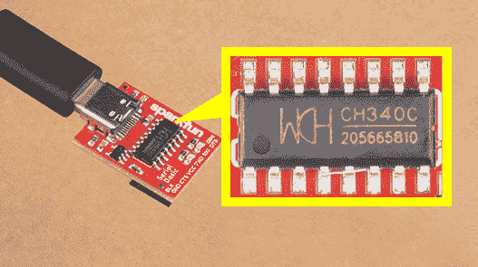

# 如何安装 CH340 驱动程序

> 原文：<https://learn.sparkfun.com/tutorials/how-to-install-ch340-drivers>

## 介绍

在本教程中，我们将向您展示如何在多个操作系统上安装 CH340 驱动程序，如果您需要的话。该驱动程序应该会自动安装在大多数操作系统上。然而，有各种各样的操作系统。第一次将芯片连接到计算机的 USB 端口时，或者有操作系统更新时，您可能需要安装驱动程序。

[](https://cdn.sparkfun.com/assets/learn_tutorials/9/0/8/USB-to-serial_converter_CH340-closeup.jpg)

[https://www.youtube.com/embed/MM9Fj6bwHLk/?autohide=1&border=0&wmode=opaque&enablejsapi=1](https://www.youtube.com/embed/MM9Fj6bwHLk/?autohide=1&border=0&wmode=opaque&enablejsapi=1)

### 所需材料

根据您的应用，CH340 可能安装在分线板或开发板上。这里有几块电路板使用这种特殊的 USB 转串行转换器。

[](https://www.sparkfun.com/products/15123) 

将**添加到您的[购物车](https://www.sparkfun.com/cart)中！**

### [spark fun RedBoard Qwiic](https://www.sparkfun.com/products/15123)

[In stock](https://learn.sparkfun.com/static/bubbles/ "in stock") DEV-15123

SparkFun RedBoard Qwiic 是一款 Arduino 兼容开发板，内置 Qwiic 连接器，无需…

$21.5014[Favorited Favorite](# "Add to favorites") 49[Wish List](# "Add to wish list")****[](https://www.sparkfun.com/products/15096) 

将**添加到您的[购物车](https://www.sparkfun.com/cart)中！**

### [SparkFun 系列基本突破- CH340C 和 USB-C](https://www.sparkfun.com/products/15096)

[In stock](https://learn.sparkfun.com/static/bubbles/ "in stock") DEV-15096

这款 SparkFun Serial Basic Breakout 是一款基于 CH340G 的易于使用的 USB 转串行适配器，利用了 ha…

$9.957[Favorited Favorite](# "Add to favorites") 30[Wish List](# "Add to wish list")****[](https://www.sparkfun.com/products/14050) 

将**添加到您的[购物车](https://www.sparkfun.com/cart)中！**

### [SparkFun 连载基础突围- CH340G](https://www.sparkfun.com/products/14050)

[In stock](https://learn.sparkfun.com/static/bubbles/ "in stock") DEV-14050

SparkFun Serial Basic Breakout 是一款易于使用的 USB 转串行适配器，基于 WCH 的 CH340G IC。

$8.957[Favorited Favorite](# "Add to favorites") 23[Wish List](# "Add to wish list")****[](https://www.sparkfun.com/products/15443) 

将**添加到您的[购物车](https://www.sparkfun.com/cart)中！**

### [SparkFun RedBoard Artemis Nano](https://www.sparkfun.com/products/15443)

[In stock](https://learn.sparkfun.com/static/bubbles/ "in stock") DEV-15443

RedBoard Artemis Nano 是 Artemis 模块的一个微型的多功能实现。

$16.506[Favorited Favorite](# "Add to favorites") 50[Wish List](# "Add to wish list")****[](https://www.sparkfun.com/products/15444) 

将**添加到您的[购物车](https://www.sparkfun.com/cart)中！**

### [SparkFun RedBoard Artemis](https://www.sparkfun.com/products/15444)

[In stock](https://learn.sparkfun.com/static/bubbles/ "in stock") DEV-15444

RedBoard Artemis 采用 SparkFun 的功能强大的 Artemis 模块，并将其包装在一个易于使用和熟悉的环境中…

$21.509[Favorited Favorite](# "Add to favorites") 32[Wish List](# "Add to wish list")****[](https://www.sparkfun.com/products/15442) 

将**添加到您的[购物车](https://www.sparkfun.com/cart)中！**

### [spark fun RedBoard Artemis ATP](https://www.sparkfun.com/products/15442)

[32 available](https://learn.sparkfun.com/static/bubbles/ "32 available") DEV-15442

RedBoard Artemis ATP 有 48 个 GPIO，该板以 Arduino Mega 格式将它们全部分开。

$26.951[Favorited Favorite](# "Add to favorites") 17[Wish List](# "Add to wish list")****[](https://www.sparkfun.com/products/15316) 

将**添加到您的[购物车](https://www.sparkfun.com/cart)中！**

### [树莓派的 SparkFun 伺服 pHAT](https://www.sparkfun.com/products/15316)

[In stock](https://learn.sparkfun.com/static/bubbles/ "in stock") DEV-15316

树莓皮的 SparkFun 伺服 pHAT 允许您的树莓皮控制多达 16 个伺服电机在一个简单的方式…

$11.954[Favorited Favorite](# "Add to favorites") 27[Wish List](# "Add to wish list")************** ************### 配件

您还需要正确的 USB 电缆将主板连接到计算机。您可能需要跳线和试验板来制作原型。

[](https://www.sparkfun.com/products/8431) 

将**添加到您的[购物车](https://www.sparkfun.com/cart)中！**

### [跳线高级 6 "米/米装 10 根](https://www.sparkfun.com/products/8431)

[In stock](https://learn.sparkfun.com/static/bubbles/ "in stock") PRT-08431

这是一个 SparkFun 独家！这些是 155 毫米长、26 AWG 跳线，两端都有公接头。用这些来跳离…

$4.502[Favorited Favorite](# "Add to favorites") 11[Wish List](# "Add to wish list")****[](https://www.sparkfun.com/products/14743) 

将**添加到您的[购物车](https://www.sparkfun.com/cart)中！**

### [USB 3.1 线 A 到 C - 3 脚](https://www.sparkfun.com/products/14743)

[In stock](https://learn.sparkfun.com/static/bubbles/ "in stock") CAB-14743

USB C 棒极了。但是，在我们将所有的集线器、充电器和端口转换为 USB C 之前，这是您要使用的电缆…

$5.504[Favorited Favorite](# "Add to favorites") 9[Wish List](# "Add to wish list")****[](https://www.sparkfun.com/products/retired/14741) 

### [spark fun Traveler microB Cable-1m](https://www.sparkfun.com/products/retired/14741)

[Retired](https://learn.sparkfun.com/static/bubbles/ "Retired") CAB-14741

你是旅行者吗？你会从你的装备上去掉每一盎司多余的重量吗？SparkFun 1 米旅行者微型电缆是 d…

**Retired**[Favorited Favorite](# "Add to favorites") 0[Wish List](# "Add to wish list")**** ****### 推荐阅读

在开始本教程之前，您的计算机上应该已经安装了 Arduino IDE。查看我们的[安装 Arduino](https://learn.sparkfun.com/tutorials/installing-arduino) 教程，获得一步一步的指导。

[](https://learn.sparkfun.com/tutorials/serial-communication) [### 串行通信](https://learn.sparkfun.com/tutorials/serial-communication) Asynchronous serial communication concepts: packets, signal levels, baud rates, UARTs and more 100[](https://learn.sparkfun.com/tutorials/connector-basics) [### 连接器基础](https://learn.sparkfun.com/tutorials/connector-basics) Connectors are a major source of confusion for people just beginning electronics. The number of different options, terms, and names of connectors can make selecting one, or finding the one you need, daunting. This article will help you get a jump on the world of connectors.[Favorited Favorite](# "Add to favorites") 62[](https://learn.sparkfun.com/tutorials/what-is-an-arduino) [### 什么是 Arduino？](https://learn.sparkfun.com/tutorials/what-is-an-arduino) What is this 'Arduino' thing anyway? This tutorials dives into what an Arduino is and along with Arduino projects and widgets.[Favorited Favorite](# "Add to favorites") 50[](https://learn.sparkfun.com/tutorials/logic-levels) [### 逻辑电平](https://learn.sparkfun.com/tutorials/logic-levels) Learn the difference between 3.3V and 5V devices and logic levels.[Favorited Favorite](# "Add to favorites") 82[](https://learn.sparkfun.com/tutorials/terminal-basics) [### 串行终端基础知识](https://learn.sparkfun.com/tutorials/terminal-basics) This tutorial will show you how to communicate with your serial devices using a variety of terminal emulator applications.[Favorited Favorite](# "Add to favorites") 46

好了，我们开始工作吧！您可以访问下一部分，了解有关 CH340 的更多信息以及您需要这些驱动程序的原因，或者直接跳到您选择的操作系统！

## 认识 CH340

CH340 有几个变种。CH340 **G** 需要一个外部晶体振荡器才能工作，而 CH340 **C** 包括一个内置晶体振荡器。然而，两者的功能是相同的——它们将 USB 数据转换为串行 UART，反之亦然！

| [](https://cdn.sparkfun.com/assets/learn_tutorials/9/0/8/14050-SparkFun-UART-to-Serial-CH340G.jpg) | [](https://cdn.sparkfun.com/assets/learn_tutorials/9/0/8/15096-SparkFun_UART-to-Serial_Basic_Breakout_CH340C.jpg) |
| *CH340G* | *CH340C* |

CH340 也安装在开发板上，如 [RedBoard Qwiic](https://www.sparkfun.com/products/15123) 以使用 Arduino IDE 上传代码。

[](https://cdn.sparkfun.com/assets/learn_tutorials/9/0/8/15123-SparkFun_RedBoard_Qwiic-04-CH340.jpg)

## 驱动程序(如果需要的话)

CH340 已经过以下测试:

*   Windows 7/10
*   mac os x
    *   v10.10.5(约塞米蒂)
    *   10.11.6 版(埃尔卡皮坦)
    *   v10.13.0(高塞拉)
    *   10.14.5 版(莫哈韦)
*   Linux 操作系统
    *   raspbian Stretch(2018 年 11 月 13 日发布),用于覆盆子酱
    *   Raspbian Buster (2019-07-10 发布)树莓 Pi
    *   64 位 Ubuntu v18.04.2

这些操作系统预装了 CDC 驱动程序，这意味着您不需要安装任何额外的软件。然而，有各种各样的操作系统，所以如果你遇到驱动程序问题，你可以得到下面链接的存档驱动程序:

*   [Windows (EXE)](https://cdn.sparkfun.com/assets/learn_tutorials/8/4/4/CH341SER.EXE) -驱动程序可执行文件
*   [Windows (ZIP)](https://cdn.sparkfun.com/assets/learn_tutorials/5/9/7/Windows-CH340-Driver.zip) :驱动 3.4 版(2016-09-27)
*   [Mac (ZIP)](https://cdn.sparkfun.com/assets/learn_tutorials/8/4/4/CH341SER_MAC.ZIP) :驱动 1.5 版(2018-07-04)
*   [Linux (ZIP)](https://cdn.sparkfun.com/assets/learn_tutorials/8/4/4/CH341SER_LINUX.ZIP) :驱动 1.5 版(2018-03-18)

CH340 是 WCH 制造的。你可以在他们的[英文翻译网站](http://www.wch-ic.com/downloads/CH341SER_ZIP.html)找到他们最新版本的驱动。

[WCH: CH340 Drivers (English Page)](http://www.wch-ic.com/downloads/CH341SER_ZIP.html)**Note:** At the time of writing, you were only able to find the latest version of their drivers from their [website in Mandarin](http://www.wch.cn/download/CH341SER_ZIP.html). If you use a Chrome web browser, you had the option to have the web page translated. However, you now have the option of browsing the WCH website in either language. For those interested in heading to the Mandirin side, you can click on the button below.

[WCH: CH340 Drivers (Mandirin page)](http://www.wch.cn/downloads/CH341SER_ZIP.html)

### 更新驱动程序

如果您安装了较旧的 CH340 驱动程序，您可能需要更新它们。在接下来的部分中，是在每个被测试的操作系统上这样做的说明。

## Windows 7/10

**Note for Educators:** You will need to obtain administrative privileges from your network or IT administrator in order to install these drivers. Make sure to test the drivers before class and set aside some time with students in the classroom when installing the drivers.

[下载](https://cdn.sparkfun.com/assets/learn_tutorials/8/4/4/CH341SER.EXE)并运行可执行文件。

[CH341SER (EXE)](https://cdn.sparkfun.com/assets/learn_tutorials/8/4/4/CH341SER.EXE)

首先单击“卸载”按钮。然后点击“安装”按钮。

[](https://cdn.sparkfun.com/assets/learn_tutorials/8/4/4/CH340-Win10_Uninstall-Install.PNG)
*Windows CH340 Driver Installation*

* * *

### 用于 Windows 的驱动程序验证

 要验证您的驱动程序是否正常工作，您应该会在将 CH340 插入 USB 端口后看到下图中的差异。

#### 设备管理器

要检查 CH340 是否枚举到 COM 端口，您可以打开设备管理器。你可以点击**开始**或者`⊞` ( **Windows** )按钮，输入*设备管理器*快速搜索应用。

[](https://cdn.sparkfun.com/assets/learn_tutorials/9/0/8/Windows-Searching_for_device_manager.jpg)*Using the search on Windows 10 to look for the device manager.***Note:** On Windows 10, the quick search function is picky on the spelling of the application you are searching for. For example, you may get results using "*devi*" and none for "*device*".

打开设备管理器后，你需要打开**端口(COM & LPT)** 树。CH340 应该显示为 **USB 串行 CH340 (COM##)** 。根据您的计算机，COM 端口可能会显示为不同的号码。

[](https://cdn.sparkfun.com/assets/learn_tutorials/9/0/8/Windows_Device-Manager-COM-Port-CH340.jpg)*Screenshot of Window 10 Device Manager with a CH340 displayed on COM123\. Click to enlarge.*

#### Arduino IDE

或者，如果您安装了[Arduino IDE](https://learn.sparkfun.com/tutorials/installing-arduino-ide)，您还应该看到可用 COM 端口数量的变化(您可能需要重启 Arduino IDE，以便主板进行填充)。在没有将 CH340 连接到计算机的情况下，点击**工具** > **端口**。注意可用的**串行端口**。

[](https://cdn.sparkfun.com/assets/learn_tutorials/9/0/8/Arduino-IDE-Serial-COM-Ports.jpg)

将 CH340 连接到计算机的 USB 端口。点击屏幕上的其他地方，菜单会自动刷新。然后点击**工具**T4**港口**返回菜单。应该会弹出一个新的 COM 端口。通过排除过程，CH340 应该已经枚举到新的 COM 端口！随意点击 COM 端口，选择是否将代码上传到微控制器。根据您的计算机，COM 端口可能会显示不同的数字。

[](https://cdn.sparkfun.com/assets/learn_tutorials/9/0/8/Arduino-IDE-Serial-COM-Ports-CH340.jpg)

#### 串行环回测试

您还可以通过进行串行环回测试或[回声测试](https://learn.sparkfun.com/tutorials/terminal-basics/connecting-to-your-device)来验证 USB 转串行转换器是否工作。如果您使用分线板，您可以在 Tx 和 Rx 之间添加一个跳线，以尝试回应终端程序中的字符。欲了解更多信息，请尝试查看串行基本连接指南的[硬件测试。](https://learn.sparkfun.com/tutorials/sparkfun-serial-basic-ch340c-hookup-guide#hardware-test)

[](https://learn.sparkfun.com/tutorials/sparkfun-serial-basic-ch340c-hookup-guide#hardware-test)*[Serial Loop Back Test with a Jumper Wire](https://learn.sparkfun.com/tutorials/sparkfun-serial-basic-ch340c-hookup-guide#hardware-test)*

## mac os x

**Note for Educators:** You will need to obtain administrative privileges from your network or IT administrator in order to install these drivers. Make sure to test the drivers before class and set aside some time with students in the classroom when installing the drivers.**Warning:** If you have a **Mac OS X v10.12+ (i.e. High Sierra, Mojave)**, your computer may restart as soon as you insert the CH340 to your computer. We recommend that you uninstall the old drivers first and follow these directions below before connecting the CH340 to your COM port. If you observe this issue, you will need to unplug the CH340 from your USB port, restart the computer, and follow the steps below to reinstall the latest drivers.

通过选择 **Go** > **应用**打开[终端](https://learn.sparkfun.com/tutorials/terminal-basics/command-line-windows-mac-linux)程序。

[](https://cdn.sparkfun.com/assets/learn_tutorials/9/0/8/Apple_Mac-OSX_Applications.jpeg)

选择并打开**应用** > **实用程序** > **终端**下的终端程序。

[](https://cdn.sparkfun.com/assets/learn_tutorials/9/0/8/Apple-Mac-OSX-Terminal-Program.jpg)**Note:** You can also search with Spotlight by pressing `⌘` (**Command**) + `space bar` (**Space Bar**). Then type "Terminal" and double-click the search result.

If you are still unsure of how to access the Terminal, [watch this video](https://www.youtube.com/watch?v=zw7Nd67_aFw) or read this [Apple support article](https://support.apple.com/guide/terminal/open-or-quit-terminal-apd5265185d-f365-44cb-8b09-71a064a42125/mac).

你需要移动到 ***所在的目录。kext** 文件被存储。

*   对于 [Mac OSX v10.9+](https://simple.wikipedia.org/wiki/MacOS#Versions) ，您将需要使用以下命令:

    ```
    language:bash
    cd /Library/Extensions 
    ```

*   对于 [Mac OSX v10.8 及以下版本](https://simple.wikipedia.org/wiki/MacOS#Versions)，您将需要使用以下命令:

    ```
    language:bash
    cd /System/Library/Extensions 
    ```

在这种情况下，我们将使用 Mac OSX v10.13，所以我们将需要使用第一个命令。

[](https://cdn.sparkfun.com/assets/learn_tutorials/9/0/8/Change-Directory-Mac-OSX-Command-Line-CH340.jpg)

要检查 CH340 驱动程序是否在正确的路径中，请使用以下命令列出文件夹的内容。

```
language:bash
ls 
```

要在路径中查找 CH340 驱动程序文件(即 **usb.kext** 或 **usbserial.kext** )，您可以使用以下命令。

```
language:bash
ls | grep usb 
```

使用这些命令后，您应该会看到类似下面的输出。

[](https://cdn.sparkfun.com/assets/learn_tutorials/9/0/8/Change-Directory-Mac-OSX-Command-Line-CH340-List-kext.jpeg)

如果您在路径中找到了该文件，您将需要在 CLI/终端中运行以下每个命令来删除旧的 CH340 驱动程序。在这种情况下，只有 **usbserial.kext** 文件，但是运行这两个命令并没有坏处。确保拥有管理权限，以确保驱动程序被删除。

```
language:bash
sudo rm -rf /Library/Extensions/usb.kext
sudo rm -rf /Library/Extensions/usbserial.kext 
```

在您各自的操作系统版本中使用`ls`命令，检查旧驱动程序是否已从路径中删除。你会注意到 ***。kext** 文件被从各自的路径中删除。在这种情况下， **usbserial.kext** 被从麦克 OSX 高地删除。

```
language:bash
ls 
```

[](https://cdn.sparkfun.com/assets/learn_tutorials/9/0/8/Change-Directory-Mac-OSX-Command-Line-CH340-List-kext-removed.jpg)

[下载](https://cdn.sparkfun.com/assets/learn_tutorials/8/4/4/CH341SER_MAC.ZIP)并解压文件夹。

[CH341SER_MAC (PKG)](https://cdn.sparkfun.com/assets/learn_tutorials/8/4/4/CH341SER_MAC.ZIP)

然后，打开 ***。pkg** 文件，并按照说明进行操作。要使更改生效，您需要重新启动计算机。

[](https://cdn.sparkfun.com/assets/learn_tutorials/8/4/4/CH340-MacOSX_pkg_Install.png)

*Mac OSX CH340 驱动安装文件*

**Heads up!** Depending on your settings, you may need to adjust your **Security & Privacy** settings to allow the CH340 drivers to function. A window may pop up indicating that the drivers have been block as shown in the image below.

[](https://cdn.sparkfun.com/assets/learn_tutorials/9/0/8/Apple-Mac-OSX-System-Extension-Blocked-Ch340.jpeg)

*Click on image for a closer look.*
If you receive a window that indicates that the system extension is blocked, you'll need to open a search with Spotlight by pressing `⌘` (**Command**) + `space bar` (**Space Bar**). Type **Security & Privacy** and click on the "**Allow**" button to enable the CH340 drivers.

[](https://cdn.sparkfun.com/assets/learn_tutorials/9/0/8/Apple-Mac-OSX-allow-install-ch340-drivers-security-privacy.jpeg)

* * *

### MAC 的驱动程序验证

 要验证您的驱动程序是否正常工作，您应该会在将 CH340 插入 USB 端口后看到下图中的差异。

#### 命令行

如果程序尚未打开，则通过转至**应用程序** > **实用程序** > **终端**打开终端。

[](https://cdn.sparkfun.com/assets/learn_tutorials/9/0/8/Apple-Mac-OSX-Terminal-Program.jpg)**Note:** Press `⌘` (**Command**) + `space bar` (**Space Bar**) to launch Spotlight and type "Terminal," then double-click the search result as explained above.

If you are still unsure of how to access the Terminal, [watch this video](https://www.youtube.com/watch?v=zw7Nd67_aFw) or read this [Apple support article](https://support.apple.com/guide/terminal/open-or-quit-terminal-apd5265185d-f365-44cb-8b09-71a064a42125/mac).

然后运行以下命令:

```
language:bash
ls /dev/cu* 
```

结果将显示连接到 Mac COM 端口的设备列表。假设 CH340 没有连接到您的计算机，您应该会看到类似下图的内容。

[](https://cdn.sparkfun.com/assets/learn_tutorials/9/0/8/Apple-Mac-OSX-Terminal-COM.jpg)

将 CH340 连接到 Mac 的一个 COM 端口。检查以下更改(您的主板可能会以不同的设备名称显示)。CH340 应该显示为**/dev/Cu . wchusbserial * * * * ***。根据您的计算机，COM 端口可能会显示为不同的号码。

[](https://cdn.sparkfun.com/assets/learn_tutorials/9/0/8/Apple-Mac-OSX-Terminal-COM-CH340.jpg)*Screenshot of Mac OSX terminal with CH340 on cu.wchusbserialfd1410\. Click to enlarge.*

#### Arduino IDE

或者，如果您安装了[Arduino IDE](https://learn.sparkfun.com/tutorials/installing-arduino-ide)，您还应该看到可用 COM 端口数量的变化(您可能需要重启 Arduino IDE，以便主板进行填充)。在没有将 CH340 连接到计算机的情况下，点击**工具** > **端口**。注意可用的**串行端口**。

[](https://cdn.sparkfun.com/assets/learn_tutorials/9/0/8/Apple_Mac-OSX-Arduino_IDE_COM_Ports.jpeg)

将 CH340 连接到计算机的 USB 端口。点击屏幕上的其他地方，菜单会自动刷新。然后点击**工具**T4**港口**返回菜单。应该会弹出一个新的 COM 端口。通过排除过程，CH340 应该已经枚举到新的 COM 端口！随意点击 COM 端口，选择是否将代码上传到微控制器。根据您的计算机，COM 端口可能会显示不同的数字。

[](https://cdn.sparkfun.com/assets/learn_tutorials/9/0/8/Apple_Mac-OSX-Arduino_IDE_COM_Ports_CH340.jpeg)

#### 串行环回测试

您还可以通过进行串行环回测试或[回声测试](https://learn.sparkfun.com/tutorials/terminal-basics/connecting-to-your-device)来验证 USB 转串行转换器是否工作。如果您使用分线板，您可以在 Tx 和 Rx 之间添加一个跳线，以尝试回应终端程序中的字符。欲了解更多信息，请尝试查看串行基本连接指南的[硬件测试。](https://learn.sparkfun.com/tutorials/sparkfun-serial-basic-ch340c-hookup-guide#hardware-test)

[](https://learn.sparkfun.com/tutorials/sparkfun-serial-basic-ch340c-hookup-guide#hardware-test)*[Serial Loop Back Test with a Jumper Wire](https://learn.sparkfun.com/tutorials/sparkfun-serial-basic-ch340c-hookup-guide#hardware-test)*

## Linux 操作系统

**Note for Educators:** You will need to obtain administrative privileges from your network or IT administrator in order to install these drivers. Make sure to test the drivers before class and set aside some time with students in the classroom when installing the drivers.

### Raspbian 为树莓派

在 Raspberry Pi 上使用 Raspbian 时，在 CLI/终端中运行以下命令。更新后应该安装最新的 CH340！

```
language:bash
sudo apt-get update
sudo apt-get upgrade 
```

### 其他 Linux 发行版

这里有一个可下载的 [***。Linux 标准 CH340 驱动程序**](https://cdn.sparkfun.com/assets/learn_tutorials/8/4/4/CH341SER_LINUX.ZIP)的压缩文件。

[Download CH340 Drivers for Linux (ZIP)](https://cdn.sparkfun.com/assets/learn_tutorials/8/4/4/CH341SER_LINUX.ZIP)

在 Linux 中使用工厂驱动程序时，有一些串行通信失败的报告案例。如果你遇到这个问题，你可以试着安装补丁驱动[，如这个论坛帖子](https://forum.sparkfun.com/viewtopic.php?p=204408#p204408)中所解释的。以下是步骤(在命令行中运行):

*   从 USB 端口插入和拔出 CH340 设备
*   键入`dmesg`查看发生了什么
    *   在最近的日志中，预期的输出(显示“ch341”)应该包含以下内容:

```
[  xxx] ch341-uart ttyUSB0: ch341-uart converter now disconnected from ttyUSB0
[  xxx] ch341 3-2:1.0: device disconnected
```

*   下载[补丁驱动库](https://github.com/juliagoda/CH341SER)并解压文件

    [GitHub Linux 补丁 CH340 驱动](https://github.com/juliagoda/CH341SER)

*   `cd`放入保存文件的目录
*   `make clean`
*   `make`
*   `sudo make load`
*   `sudo rmmod ch341`卸载损坏的驱动程序
*   `lsmod | grep ch34`列出当前安装的模块
*   在 USB 端口上再次插入和拔出 CH340 设备
*   `dmesg`
    *   预期输出(现在应该显示“ch34x”):

```
[  xxx] ch34x ttyUSB0: ch34x converter now disconnected from ttyUSB0
[  xxx] ch34x 3-2:1.0: device disconnected
```

根据您的 root 权限，您可能需要使用以下两个命令来配置串行端口。确保根据当前登录的用户 ID 调整`$username`。

```
language:bash
sudo usermod -a -G dialout $username 
sudo chmod a+rw /dev/ttyUSB0 
```

**Heads up!** Depending on how the CH340 enumerated on your computer, the `/dev/ttyUSB0` may be different. Try using `ls` command as explained in the Driver Verification if you have issues configuring the serial port settings and adjusting the port as necessary.

* * *

### Linux 的驱动程序验证

 #### 命令行

将 CH340 插回计算机的 USB 端口。然后在任何 Linux 发行版上的 CLI/终端中运行以下命令。检查以下更改(您的主板可能会以不同的设备名称显示)。

```
language:bash
ls /dev/ttyUSB* 
```

结果应该会弹出 CH340 所连接的串行端口。

[](https://cdn.sparkfun.com/r/500-500/assets/learn_tutorials/8/4/4/Raspbian_Stretch_Device_Check.png)
*Screenshot of Raspberry Pi CLI with the CH340 on ttyUSB0\. Click to enlarge*

#### Arduino IDE

或者，如果您安装了[Arduino IDE](https://learn.sparkfun.com/tutorials/installing-arduino-ide)，您还应该看到可用 COM 端口数量的变化(您可能需要重启 Arduino IDE，以便主板进行填充)。在没有将 CH340 连接到电脑的情况下，点击**工具** > **端口**。根据您使用的 Linux 版本，**端口**可能不会打开以显示任何串行端口。注意**串行端口**打开时可用。

[](https://cdn.sparkfun.com/assets/learn_tutorials/9/0/8/Linux_Ubuntu_Arduino_IDE_COM-ports.png)

将 CH340 连接到计算机的 USB 端口。点击屏幕上的其他地方，菜单会自动刷新。然后点击**工具**T4**港口**返回菜单。应该会弹出一个新的 COM 端口。通过排除过程，CH340 应该已经枚举到新的 COM 端口！随意点击 COM 端口，选择是否将代码上传到微控制器。根据您的计算机，COM 端口可能会显示不同的数字。

[](https://cdn.sparkfun.com/assets/learn_tutorials/9/0/8/Linux_Ubuntu_Arduino_IDE_COM-ports-CH340.png)

#### 串行环回测试

您还可以通过进行串行环回测试或[回声测试](https://learn.sparkfun.com/tutorials/terminal-basics/connecting-to-your-device)来验证 USB 转串行转换器是否工作。如果您使用分线板，您可以在 Tx 和 Rx 之间添加一个跳线，以尝试回应终端程序中的字符。欲了解更多信息，请尝试查看串行基本连接指南的[硬件测试。](https://learn.sparkfun.com/tutorials/sparkfun-serial-basic-ch340c-hookup-guide#hardware-test)

[](https://learn.sparkfun.com/tutorials/sparkfun-serial-basic-ch340c-hookup-guide#hardware-test)*[Serial Loop Back Test with a Jumper Wire](https://learn.sparkfun.com/tutorials/sparkfun-serial-basic-ch340c-hookup-guide#hardware-test)*

## 解决纷争

### COM 端口没有显示为 CH340 Windows

我们有一些关于 Windows 10 的报告，其中驱动程序将自动安装，主板将在新的 COM 端口下显示为 **USB-Serial CH340** ，但具有不同的设备名称。但是，无法在 Arduino IDE 上访问该板。其他人遇到了安装过程挂起的问题。

根据客户经验，这可能是特定于制造商的，通常是孤立的情况。用户似乎最终能够通过给计算机时间来完成安装(*接近 20 分钟*)、多次插回主板、重新安装驱动程序和/或多次重置计算机(*重复这两个步骤*)的组合来使主板得到识别。

### COM 端口不可用 Windows、Mac 和 Linux

如果您在计算机上安装了 CH340 的驱动程序，但在通过串行终端连接或使用 Arduino IDE 上传代码时出现问题，则可能是您的用户设置有问题，导致您无法使用 CH340。您可能会收到一个类似于下图所示输出的`avrdude: ser_open(): can't open device`错误。

```
language:bash
avrdude: ser_open(): can't open device "/dev/ttyUSB0": No such file or directory 
```

在这种情况下，由于没有安装驱动程序和 root 权限，当试图上传代码时，错误出现在 Linux 上。

[](https://cdn.sparkfun.com/assets/learn_tutorials/9/0/8/Linux_Failed_Arduino-IDE_Upload_CH340.jpg)

确保检查您的配置设置，并确保您的操作系统启用了 CH340 的串行端口。您可能还需要为您的操作系统重新安装驱动程序。

### USB 线 Windows、Mac 和 Linux

某些 USB 电缆仅用于供电，可能没有数据线。尝试检查您的 USB 电缆，确保数据线完好无损。

### 以快速波特率上传的问题

如果您上传到某些板，如具有快速波特率的 Artemis 开发板上的 Apollo3，在某些平台(Linux 版本)上，标准 CH340 USB 转串行驱动程序在高于 **115200** 的速度下无法正常运行。所以如果你遇到上传问题，考虑降低上传速度。关于上传问题的更多信息，请看[这个论坛的帖子](https://forum.sparkfun.com/viewtopic.php?f=153&t=49585&start=30)并考虑用[升级这些 Mac OSX 的驱动](https://github.com/adrianmihalko/ch340g-ch34g-ch34x-mac-os-x-driver)或[这些 Linux 的驱动](https://github.com/juliagoda/CH341SER)。

## 资源和更进一步

现在，您已经成功启动并运行了 CH340，是时候将它整合到您自己的项目中了！

*   [WCH: CH340 驱动程序](http://www.wch-ic.com/downloads/CH341SER_ZIP.html) -最新的驱动程序可以从制造商处下载。
    *   [Windows (EXE)](https://cdn.sparkfun.com/assets/learn_tutorials/8/4/4/CH341SER.EXE) -驱动程序可执行文件
    *   [Windows (ZIP)](https://cdn.sparkfun.com/assets/learn_tutorials/5/9/7/Windows-CH340-Driver.zip) -驱动程序 v3.4 (2016-09-27)
    *   [Mac (ZIP)](https://cdn.sparkfun.com/assets/learn_tutorials/8/4/4/CH341SER_MAC.ZIP) -驱动程序 v1.5 (2018-07-04)
    *   [Linux (ZIP)](https://cdn.sparkfun.com/assets/learn_tutorials/8/4/4/CH341SER_LINUX.ZIP) -驱动 1.5 版(2018-03-18)

CH340 等 USB 转串行转换器非常适合向微控制器上传代码或在串行终端上查看 GPS 数据。查看这些教程，更深入地了解微控制器的世界，或者用 GPS 向您的计算机发送串行数据！

[](https://learn.sparkfun.com/tutorials/terminal-basics) [### 串行终端基础知识](https://learn.sparkfun.com/tutorials/terminal-basics) This tutorial will show you how to communicate with your serial devices using a variety of terminal emulator applications.[Favorited Favorite](# "Add to favorites") 46[](https://learn.sparkfun.com/tutorials/headless-raspberry-pi-setup) [### 无头 Raspberry Pi 设置](https://learn.sparkfun.com/tutorials/headless-raspberry-pi-setup) Configure a Raspberry Pi without a keyboard, mouse, or monitor.[Favorited Favorite](# "Add to favorites") 16[](https://learn.sparkfun.com/tutorials/gps-rtk-hookup-guide) [### GPS-RTK 连接指南](https://learn.sparkfun.com/tutorials/gps-rtk-hookup-guide) Find out where you are! Use this easy hook-up guide to get up and running with the SparkFun high precision GPS-RTK NEO-M8P-2 breakout board.[Favorited Favorite](# "Add to favorites") 5[](https://learn.sparkfun.com/tutorials/redboard-qwiic-hookup-guide) [### RedBoard Qwiic 连接指南](https://learn.sparkfun.com/tutorials/redboard-qwiic-hookup-guide) This tutorial covers the basic functionality of the RedBoard Qwiic. This tutorial also covers how to get started blinking an LED and using the Qwiic system.[Favorited Favorite](# "Add to favorites") 5[](https://learn.sparkfun.com/tutorials/sparkfun-inventors-kit-experiment-guide---v41) [### SparkFun 发明家套件实验指南-4.1 版](https://learn.sparkfun.com/tutorials/sparkfun-inventors-kit-experiment-guide---v41) The SparkFun Inventor's Kit (SIK) Experiment Guide contains all of the information needed to build all five projects, encompassing 16 circuits, in the latest version of the kit, v4.1\.[Favorited Favorite](# "Add to favorites") 10

或者看看这些博客帖子。

[](https://www.sparkfun.com/news/2332 "March 15, 2017: Let's learn about udev and how we can lock down our USB device nodes!") [### 硬件驼峰日:Raspberry Pi 上的 USB 设备规则

March 15, 2017](https://www.sparkfun.com/news/2332 "March 15, 2017: Let's learn about udev and how we can lock down our USB device nodes!")[Favorited Favorite](# "Add to favorites") 0[](https://www.sparkfun.com/news/2451 "September 14, 2017: SparkFun offers several options in the USB-Serial arena. Today we'll attempt to demystify the differences between them.") [### Enginursday:探索不同的 USB 串行板

September 14, 2017](https://www.sparkfun.com/news/2451 "September 14, 2017: SparkFun offers several options in the USB-Serial arena. Today we'll attempt to demystify the differences between them.")[Favorited Favorite](# "Add to favorites") 4[](https://www.sparkfun.com/news/2979 "August 14, 2019: USB-to-serial UART bridges like the CH340 make it easier to upload code to an Arduino and pass serial data to/from your computer. Make sure to install the respective drivers before getting started.") [### 是什么驱动着你的 SparkFun 发明家套件？

August 14, 2019](https://www.sparkfun.com/news/2979 "August 14, 2019: USB-to-serial UART bridges like the CH340 make it easier to upload code to an Arduino and pass serial data to/from your computer. Make sure to install the respective drivers before getting started.")[Favorited Favorite](# "Add to favorites") 0****************