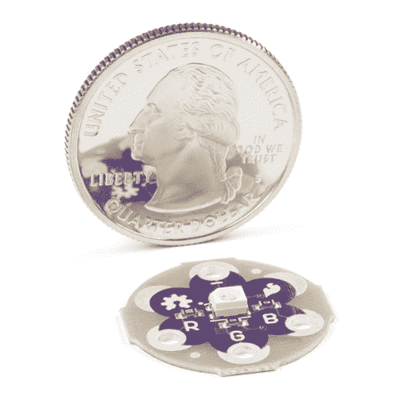

# LilyPad RGB LED 连接指南

> 原文：<https://learn.sparkfun.com/tutorials/lilypad-rgb-led-hookup-guide>

## 介绍

**Heads up!** This tutorial was written for the LilyPad RGB LED with common cathode. If you are using the LilyPad Tri-Color LED with common anode, please refer to the [LilyPad Tri-Color LED Hookup Guide](https://learn.sparkfun.com/tutorials/lilypad-tri-color-led-hookup-guide).

[LilyPad RGB LED](https://www.sparkfun.com/products/13735) 是一种可以产生多种颜色的专用板。板上有一个 RGB(红绿蓝)LED，由三个微小的 LED 连接在一起组成。RGB LED 中的每种颜色都与电路板上标有 R、G 和 b 的 sew 标签相连。

 

将**添加到您的[购物车](https://www.sparkfun.com/cart)中！**

### [LilyPad RGB LED](https://www.sparkfun.com/products/13735)

[In stock](https://learn.sparkfun.com/static/bubbles/ "in stock") DEV-13735

眨你需要的任何颜色！

$4.50[Favorited Favorite](# "Add to favorites") 8[Wish List](# "Add to wish list")** **### 所需材料

为了遵循代码示例，我们建议:**