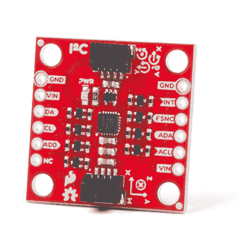

# SparkFun 9DoF IMU (ICM-20948)分线连接指南

> 原文：<https://learn.sparkfun.com/tutorials/sparkfun-9dof-imu-icm-20948-breakout-hookup-guide>

## 介绍

[SparkFun 9DoF IMU 分线点](https://www.sparkfun.com/products/15335)将 Invensense ICM-20948 的所有令人惊叹的功能整合到一个支持 Qwiic 的分线板中，该分线板配有逻辑移位和断开的 GPIO 引脚，可满足您的所有运动感测需求。ICM-20948 本身是一款功耗极低的 I ² C 和 SPI 支持的 9 轴运动跟踪设备，非常适合智能手机、平板电脑、可穿戴传感器和物联网应用。它配备了一个具有四个可选范围的三轴陀螺仪、一个同样具有四个可选范围的三轴加速度计、一个具有高达 4900 T 的宽范围的三轴指南针和一个机载数字运动处理器，这个小突破甚至可以检测隐形衣的运动。不完全是。只是想看看你是否还在我身边。但是它*是*相当惊人。看看这个:

 

将**添加到您的[购物车](https://www.sparkfun.com/cart)中！**

 **### [【spark fun 9 DOF IMU Breakout-ICM-20948(Qwiic)](https://www.sparkfun.com/products/15335)

[In stock](https://learn.sparkfun.com/static/bubbles/ "in stock") SEN-15335

SparkFun 9DoF IMU 分线板将 ICM-20948 的所有令人惊叹的功能集成到一个支持 Qwiic 的分线板中。

$18.505[Favorited Favorite](# "Add to favorites") 32[Wish List](# "Add to wish list")** **[https://www.youtube.com/embed/jC9NowQmyBo/?autohide=1&border=0&wmode=opaque&enablejsapi=1](https://www.youtube.com/embed/jC9NowQmyBo/?autohide=1&border=0&wmode=opaque&enablejsapi=1)

在本连接指南中，我们将把传感器连接到我们的 [Esp32 Thing Plus](https://www.sparkfun.com/products/14689) 微控制器，并运行一个 quick (Qwiic)示例，让您使用这个神奇的电路板！

### 所需材料

要跟随本教程，您将需要以下材料。你可能不需要所有的东西，这取决于你拥有什么。将它添加到您的购物车，通读指南，并根据需要调整购物车。**