# 用 SparkFun Artemis 设计

> 原文：<https://learn.sparkfun.com/tutorials/designing-with-the-sparkfun-artemis>

## 介绍

[Artemis 模块](https://www.sparkfun.com/products/15484)是全球首款开源硬件射频模块，支持语音识别和 BLE。10x15mm 毫米可以容纳惊人的电量！本教程将带您了解 SparkFun Artemis 模块的可用功能，以及将 Artemis 整合到您自己的项目中的基础知识！

 

将**添加到您的[购物车](https://www.sparkfun.com/cart)中！**

### [SparkFun Artemis 模块-低功耗机器学习 BLE Cortex-M4F](https://www.sparkfun.com/products/15484)

[In stock](https://learn.sparkfun.com/static/bubbles/ "in stock") WRL-15484

SparkFun 的 Artemis 模块是第一款经 FCC 认证的开源 Cortex-M4F，支持 BLE 5.0，运行频率高达 96MHz，并具有…

$9.95[Favorited Favorite](# "Add to favorites") 17[Wish List](# "Add to wish list")** **[https://www.youtube.com/embed/sthuUZOTQ-U/?autohide=1&border=0&wmode=opaque&enablejsapi=1](https://www.youtube.com/embed/sthuUZOTQ-U/?autohide=1&border=0&wmode=opaque&enablejsapi=1)

### 推荐阅读

如果您不熟悉以下概念，我们建议您在继续之前查看这些教程。

 [### PCB 基础知识](https://learn.sparkfun.com/tutorials/pcb-basics) What exactly IS a PCB? This tutorial will breakdown what makes up a PCB and some of the common terms used in the PCB world.[Favorited Favorite](# "Add to favorites") 50 [### 使用 EAGLE:纸板布局](https://learn.sparkfun.com/tutorials/using-eagle-board-layout) Part 2 of the Using Eagle tutorials, this one covers how to lay out a board after designing a schematic.[Favorited Favorite](# "Add to favorites") 37 [### 蓝牙基础知识](https://learn.sparkfun.com/tutorials/bluetooth-basics) An overview of the Bluetooth wireless technology.[Favorited Favorite](# "Add to favorites") 42 [### ARM 编程](https://learn.sparkfun.com/tutorials/arm-programming) How to program SAMD21 or SAMD51 boards (or other ARM processors).[Favorited Favorite](# "Add to favorites") 10

## 硬件概述

本节涵盖了 Artemis 的技术细节，包括占地面积和电气特性。如果你已经有一个安装了 Artemis 模块的开发板，你可以跳过这一节，直接进入[独特功能](https://learn.sparkfun.com/tutorials/designing-with-the-sparkfun-artemis#unique-features)。也就是说，你最后一次真正看到这些模块的内部是什么时候？

[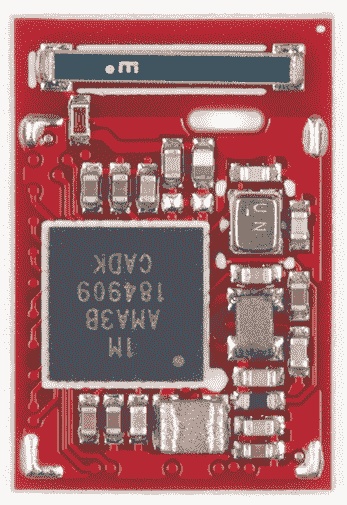](https://cdn.sparkfun.com/assets/learn_tutorials/9/0/9/Artemis.jpg)*RF shield removed showing the internals of the Artemis module*

### 阿波罗 3 号

Artemis 模块的核心是由 [Ambiq](https://ambiq.com/) 生产的 Apollo3。这是一款 ARM Cortex-M4F (F 表示硬件浮点运算)，具有 1M 闪存和 384k RAM。数据表可在[这里](https://cdn.sparkfun.com/assets/1/5/c/6/7/Apollo3-Blue-MCU-Datasheet_v0_15_0.pdf)获得。

[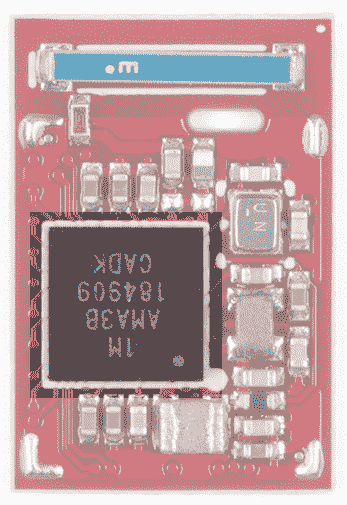](https://cdn.sparkfun.com/assets/learn_tutorials/9/0/9/Artemis-Apollo3.jpg)

### BLE 天线

Apollo3 内置蓝牙 5.0 无线电，该模块内置 2.4GHz 天线，增益为 2dBi。

[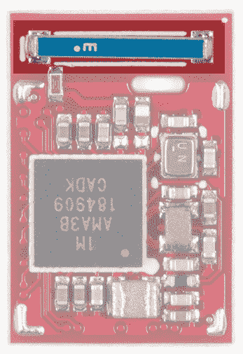](https://cdn.sparkfun.com/assets/learn_tutorials/9/0/9/Artemis-Antenna.jpg)

### 在 DC 巴克号上

Apollo3 可以在从 **3.6 到 1.8V** 的范围内运行。为了允许如此大的窗口，Apollo3 有两个内置的 DC 降压电路，以 80%的效率将输入 VCC 调节到核心电压。Artemis 模块包括两个电感，以实现最低功耗。

[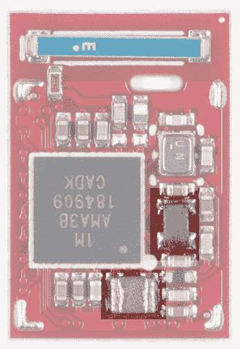](https://cdn.sparkfun.com/assets/learn_tutorials/9/0/9/Artemis-Inductors.jpg)

### 规模

该模块的尺寸为 15.5 x 10.5 x 2.3mm 毫米，重量为 0.6 克。

[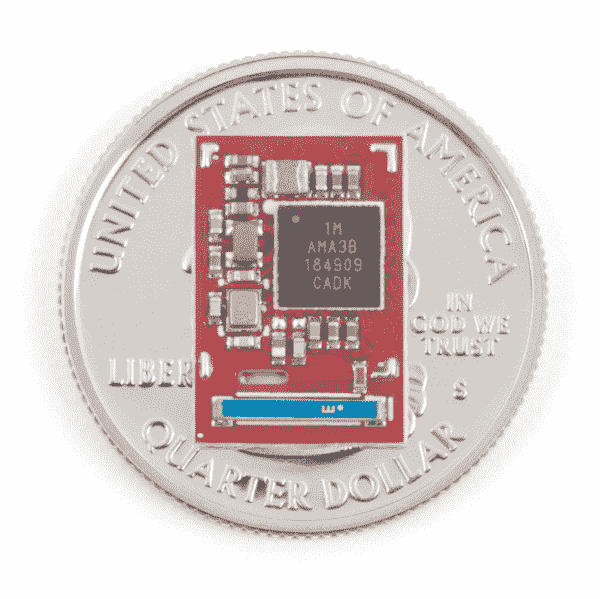](https://cdn.sparkfun.com/assets/learn_tutorials/9/0/9/SparkFun_Artemis_Module_on_a_Quarter.jpg)

### 推荐占地面积

该模块的推荐 PCB 布局如下所示:

[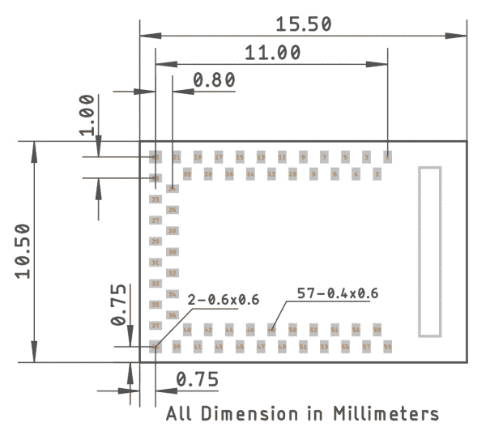](https://cdn.sparkfun.com/assets/learn_tutorials/9/0/9/Artemis-Footprint.jpg)*Recommended SMD footprint for Artemis module. Top view.*

请务必查阅 [Artemis 集成指南](https://cdn.sparkfun.com/assets/learn_tutorials/9/0/9/Artemis_Integration_Guide.pdf)了解具体尺寸和注意事项。如果您使用 EAGLE PCB 进行设计，只需克隆一个我们利用 Artemis ( [RedBoard Artemis](https://github.com/sparkfun/RedBoard_Artemis) 、 [RedBoard Artemis Nano](https://github.com/sparkfun/RedBoard_Artemis_Nano) 和 [RedBoard Artemis ATP](https://github.com/sparkfun/RedBoard_Artemis_ATP) )的开源硬件设计，并开始布局您的电路板！

[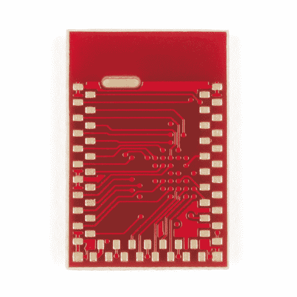](https://cdn.sparkfun.com//assets/parts/1/3/9/2/5/15376-SparkFun_Artemis_Module_-_Engineering_Version-04.jpg)*Rear view of the Artemis module*

Apollo3 是一款功能强大的 IC，但其 0.5 毫米 BGA 封装需要一个 4 层 PCB，带有埋入式环氧树脂填充过孔。这使得多氯联苯昂贵且难以生产。我们设计了阿耳忒弥斯来消除你的这些顾虑。

[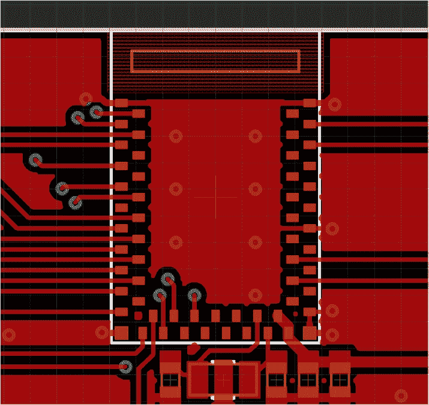](https://cdn.sparkfun.com/assets/learn_tutorials/9/0/9/Artemis-Example_Layout.jpg)

使用 Artemis 的 PCB 布局可以在 8 密耳走线/间距的 2 层 PCB 上完成。允许在模块下布线。保持所有地线远离天线区域。如果机械暴露允许，天线可以延伸到 PCB 边缘，以增强接收效果。

## 独特的功能

阿耳忒弥斯中包含了许多精彩的功能。我们将在这里给出一个概述，但请务必查看 Arduino 核心以及 Ambiq SDK 中包含的示例，以了解更多关于它们的信息。

### 引脚灵活性

Artemis 模块有 48 个支持中断的 GPIO 焊盘和一系列其他外设。2 个硬件 UARTs 可以重新映射到一些不同的 pad，并且有 16 个完全独立的 PWM 输出。一个先进的高速 14 位 ADC 连接到 10 个焊盘。使用 6 组焊盘上可用的 SPI 或 I ² C 主机。

这还远远不够——PDM、SSC 和 DMA 也可以使用 HAL。查看[引脚功能图](https://cdn.sparkfun.com/assets/learn_tutorials/9/0/9/Apollo3_Pad_Mapping.pdf)、 [Apollo3 数据表](https://cdn.sparkfun.com/assets/d/e/8/b/4/Apollo3_Blue_MCU_Data_Sheet_v0_12_1_rZ9Akgo.pdf)和 [Ambiq SDK/HAL](https://ambiq.com/apollo3-blue/) 了解更多信息。但是不要不知所措，我们有很多例子来展示如何使用所有不同的端口和引脚。

### 皮质-M4F

Artemis 使用来自 [Ambiq](https://ambiq.com/) 的 Apollo3 作为其核心 IC。该 IC 则使用运行频率为 48MHz 的 ARM Cortex-M4F 和可选的 96MHz 突发模式。强大的核心可以用 GCC 以及 Keil、IAR 编程，可以用各种现代 [JTAG 工具](https://www.sparkfun.com/categories/tags/jtag)调试。

### brotherhood of locomotive engineers 火车司机兄弟会

Artemis 有一个内置的蓝牙 5.0 无线电，能够传输高达 4dBm，应该可以达到大约 70 米的传输距离。我们已经看到在 200 英尺以上成功的 RSSI 检查。

### 脉宽调制（pulse-width modulating 的缩写）

48 个管脚中有 31 个是 PWM 使能的，你应该被覆盖了！务必检查[图形数据表](https://cdn.sparkfun.com/assets/learn_tutorials/9/0/9/ArtemisModule.pdf)和引脚映射，查看哪些引脚具有 PWM 功能。

### 中断

每个引脚都可以配置为中断，将处理器从深度睡眠中唤醒。此外，所有引脚(20 除外)都有一个软件使能的内部上拉电阻。

### 14 位模数转换器

最初的 Uno 有一个 10 位转换器，而 Artemis 有一个 14 位 ADC，这意味着读数精度从 0 到 1023 到 0 到 16，383。这将使模拟弯曲、光和声音等传感器的读数更加精确。但是，请注意，ADC 的电压为 **0V 至 2V** 。因此，如果传感器输出电压范围为 0 至 3.3V，这是安全的，但会使 ADC 在 2V 以上饱和。使用`.setResolution`功能将读数的分辨率从默认值 10 更改为 14 或之间的任何值。此外，ADC 比 T4 快得多(高达 1.2 毫秒/秒)，允许聚合更多数据。

### 小功率

Apollo3 的制造商 Ambiq 对他们所谓的亚阈值功率优化技术(SPOT)进行了多年的研究。这是对一种省电技术的巧妙描述，这种技术通过降低指示 1 或 0 所需的逻辑电平电压来工作。通过在硅层面上这样做，Ambiq 已经成功地使一个 48MHz 的处理器运行在不到半毫安的电流下。无需 BLE 或互联网连接，语音命令的“始终在线”监控大约需要 6μA/MHz。

### 成组方式

有时候 48MHz 不够用。处理器能够进入 96MHz 突发模式，内部计算和监控只需一半时间即可完成。

**Note:** External pin operations are limited to 48MHz.

### JTAG

现代电源需要现代调试工具。Artemis 基于 Cortex-M4F，它有一个专用于调试的 JTAG 端口。有了 [JTAG 调试器](https://www.sparkfun.com/categories/tags/jtag)，你可以设置断点、检查寄存器并查看正在执行什么汇编和 C 指令。这是一个你不经常需要的工具，但是当你需要它的时候，它是你的救命稻草。

### 脉冲[增量]调制（同 Pulse Delta Modulation）

Artemis 的一个突出用途是“永远在线”的语音识别。数字 MEMS 麦克风比模拟麦克风更灵敏、更易于使用。Artemis 有一个内置 PDM 端口，允许最多 2 个 MEMS 麦克风用作双通道或波束成形应用。

### 内部上拉

每个引脚都有一个软件使能的内部弱上拉电阻。此外，配置为 I ² C 端口的引脚具有软件可选上拉电阻(1.5k、6k、12k、24kΩ)，无需外部 SDA 和 SCL 上拉电阻。

### 销驱动强度

Artemis 更独特的功能之一是它能够在所有 GPIO 上选择驱动强度。给定引脚上的最大电流可以选择 2、4、8 或 12mA。此外，焊盘 3 和 36 具有可选的高端功率开关晶体管，可为 VDDH 提供约 1ω的开关。焊盘 37 和 41 具有可选的低端功率开关晶体管，可为 VSS 提供约 1ω的开关。

### 安全性

Artemis 内部的 Cortex-M4F 包含多个安全层，包括安全引导、OTA、密钥存储以及外部闪存(如 SD 卡)的内嵌加密/解密。

## 编程；编排

[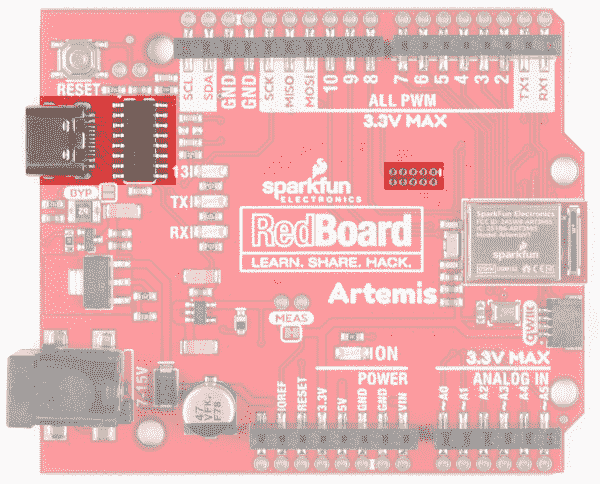](https://cdn.sparkfun.com/assets/learn_tutorials/9/2/5/15444-SparkFun-RedBoard-Artemis-USBC-SerialProgramming-JTAG-Ports.jpg)

可以使用标准 JTAG 接口或串行引导程序对 Artemis 进行编程。在 SparkFun 的各种开发板上，您可以找到用于 CH340 串行引导加载的 USB 连接器或用于更高级编程和调试的 JTAG 足迹。关于 ARM 编程的更多信息，包括 JTAG 接口，请查看我们的 [ARM 编程教程](https://learn.sparkfun.com/tutorials/arm-programming)。

### SparkFun 引导程序

我们设计了一个波特率灵活的引导加载程序，它可以在每次开机复位时运行。*波特率灵活*到底是什么意思？计算机和引导加载程序以 9600bps 的速率启动通信，然后同意以更快的波特率传输大部分二进制数据。这使得上传速度高达 921600bps 显著减少上传时间。灵活的速率允许在较高速率下可能出现问题的计算机系统选择最有效的速率。这种引导加载程序是上传草图和用户代码的首选方法，需要快速可靠的方式将新代码加载到 Artemis 上。

[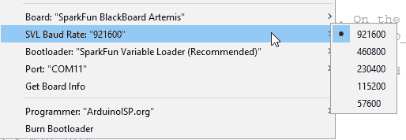](https://cdn.sparkfun.com/assets/learn_tutorials/9/0/9/SparkFun_Artemis_Core-Bootloading_Speed.jpg)

一旦选择了 Artemis 目标板，下次打开工具菜单时，将出现附加菜单选项。 **SVL 波特率**选项将允许您更改上传速度。921600bps 是推荐的速度，因为它更新新草图的速度非常快。然而，在一些平台(Linux 版本)上，标准的 CH340 USB 转串行驱动程序在高于 115200 的速度下不能很好地运行。所以如果你遇到上传问题，考虑降低上传速度。关于上传问题的更多信息，请看[这个论坛的帖子](https://forum.sparkfun.com/viewtopic.php?f=153&t=49585&start=30)并考虑用[升级这些 Mac OSX 的驱动](https://github.com/adrianmihalko/ch340g-ch34g-ch34x-mac-os-x-driver)或[这些 Linux 的驱动](https://github.com/juliagoda/CH341SER)。

就像经典的 Arduino Uno，Arduino Mega 等一样，通过重置主板来激活引导加载程序。DTR 和复位之间只需一个 0.1uF 的电容，就能使 Artemis 复位并进入引导加载模式。如果在短时间内(50 毫秒)没有检测到新固件，则运行用户代码。

如果你对 bootloader 之类的东西感兴趣，你可以在这里阅读更多关于 Artemis bootloader 的内容。

### 工厂引导程序

除了 SparkFun Artemis 引导加载程序，我们还使用 Ambiq 工厂安全引导加载程序(SBL)对每个 Artemis 进行编程。这个引导加载程序最适合用于需要安全来源的设备的低级更新。如果引脚 47 为高电平，引导加载程序在复位时被激活，并在 115200 通信。然后，引导装载程序将无限期等待新的二进制数据。我们提供了一个 python 工具和一个可执行文件来与这个引导装载程序通信。

[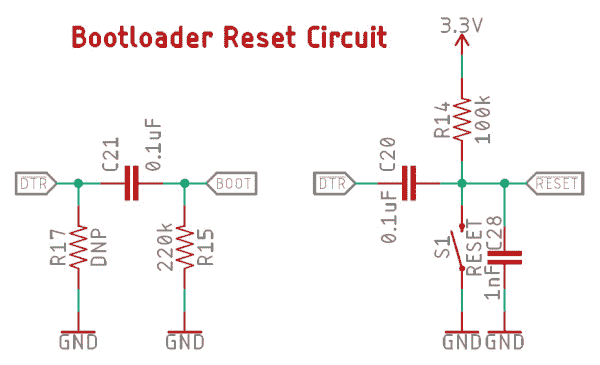](https://cdn.sparkfun.com/assets/learn_tutorials/9/0/9/Artemis-Bootload-Circuit-rev2.jpg)

这种引导加载方式与您可能习惯的引导加载程序略有不同。在大多数基于 ATmega328 的 Arduinos 上运行的 STK500 引导程序在复位时自动运行，然后超时并运行用户代码。Artemis bootloader 类似，但需要一个额外的引脚(Bootload 引脚)保持高电平。为了使 Artemis 的使用尽可能便宜和简单，我们设计了一个简单的 RC 电路，可以在您的设计中使用 USB 转串行 IC 实现，只需最少的控制引脚(CH340E 只有 RTS ),并且仍然允许工厂引导加载程序激活。如果您怀疑您将需要修改 SparkFun Artemis 引导加载程序(如上所述),或者如果您需要使用安全引导加载工具链，上面的电路可用于使用单个 pin 引导加载(支持 DTR 或 RTS)。这种单引脚复位和引导加载解决方案非常适合任何暴露控制引脚的 USB 转串行实施(CH340、CP210x、FT232 等)。

**Heads up!** You will never damage or brick the Artemis but using the Ambiq Secure Bootloader tools will overwrite the SparkFun bootloader removing the faster upload abilities. We don't recommend using the Ambiq Secure Bootloader for general Arduino programming.[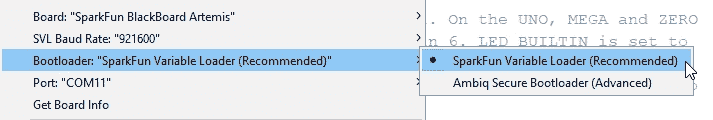](https://cdn.sparkfun.com/assets/learn_tutorials/9/0/9/SparkFun_Artemis_Core-Bootloading_Type.jpg)*Don't select Ambiq Secure Bootloader unless you know what you're doing*

要使用 Ambiq bootloader 工具链将新代码加载到 Artemis 模块上，在 Arduino Tools- > Bootloader 菜单中选择 *Ambiq Secure Bootloader* 选项。这些工具将修改您的二进制文件，并用各种安全头将它们打包。代码将以 115200bps 的速度加载，可能会失败。如果过程失败，请再次点击上传。

#### 单引脚 RC 电路的工作原理

通过拉低 DTR(或 RTS ),模块复位。10 毫秒后，DTR 在软件方面被推高。这导致 bootload 引脚为高电平达 100 毫秒，允许引导加载程序运行。打开串行端口会导致 DTR 变为低电平，从而导致模块复位，但是因为 DTR 在正常串行操作期间保持低电平，所以模块不会进入 SBL，而是继续运行 SparkFun Artemis 引导加载程序。

我们修改了 Ambiq python 引导加载工具，这样 DTR 和 RTS 可以同时以相同的方式被驱动，所以你可以使用 RTS 或者 DTR 来引导加载 Artemis。我们的 [Ambiq SBL 工具](https://github.com/sparkfun/Arduino_Apollo3/tree/master/tools/ambiq)然后将 DTR/RTS 驱动到高电平，进入工厂引导加载程序。

如果你愿意，bootload 引脚可以分解成一个按钮。当用户按住按钮并重置电路板时，Artemis 将进入引导加载模式，并一直保持到引导加载周期完成或发生重置。这种方法效果很好，但是每次需要加载新代码时都需要用户的交互。

## 解决纷争

**Need help?**

If your product is not working as you expected or you need technical assistance or information, head on over to the [SparkFun Technical Assistance](https://www.sparkfun.com/technical_assistance) page for some initial troubleshooting.

If you don't find what you need there, the [SparkFun Forums](https://forum.sparkfun.com/index.php) are a great place to find and ask for help. If this is your first visit, you'll need to [create a Forum Account](https://forum.sparkfun.com/ucp.php?mode=register) to search product forums and post questions.

[**SparkFun Artemis Forums**](https://forum.sparkfun.com/viewforum.php?f=163)

### 我不小心用了 Ambiq bootloader。现在 SparkFun 变量加载器不工作了。我该怎么办？

*Don't select Ambiq Secure Bootloader unless you know what you're doing*

你就是控制不住自己，用 Ambiq 引导程序加载代码。没关系！要使用 SparkFun SVL 引导程序重新加载您的模块，请遵循以下步骤:

**第一步:**在 Arduino 中选择合适的板卡和 COM 口。

[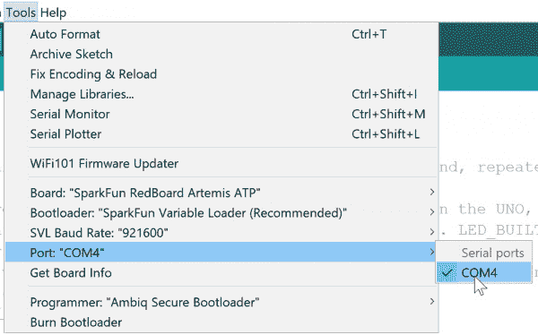](https://cdn.sparkfun.com/assets/learn_tutorials/9/0/9/SparkFun-Artemis-BurnBootloader2.jpg)

仔细检查您是否在工具菜单上选择了正确的板和 COM 端口。COM 4 在上图中显示，但您的 COM 端口可能不同。

**步骤 2:** 从工具菜单中选择刻录引导程序

[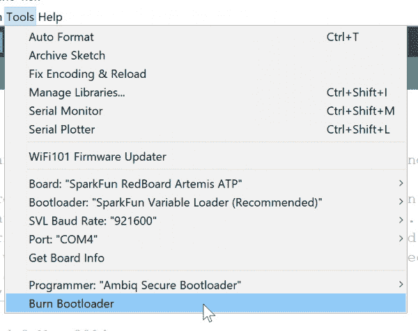](https://cdn.sparkfun.com/assets/learn_tutorials/9/0/9/SparkFun-Artemis-BurnBootloader3.jpg)

这将导致 Arduino 使用 Ambiq 工厂引导加载程序通过串行重新加载 SparkFun 变量加载程序。

第三步:把你的引导工具改成 SVL

我们不要再做那件事了，好吗？将引导程序改回 SVL。现在你所有的草图都会上传得更快。

*Be sure to use the SparkFun Variable Loader from now on*

## 资源和更进一步

以下是本教程中提供的资源的快速链接列表:

*   [阿耳忒弥斯集成指南](https://cdn.sparkfun.com/assets/learn_tutorials/9/0/9/Artemis_Integration_Guide.pdf)
*   [阿波罗 3 数据表(PDF)](https://cdn.sparkfun.com/assets/1/5/c/6/7/Apollo3-Blue-MCU-Datasheet_v0_15_0.pdf)
*   [引脚功能图](https://cdn.sparkfun.com/assets/learn_tutorials/9/0/9/Apollo3_Pad_Mapping.pdf)
*   [Ambiq SDK/HAL](https://ambiqmicro.com/mcu/)
*   [JTAG 工具](https://www.sparkfun.com/categories/tags/jtag)
*   [阿尔忒弥斯引导程序 GitHub](https://github.com/sparkfun/SparkFun_Artemis/tree/master/Bootloader)
*   [spark fun Arduino Apollo 3 GitHub](https://github.com/sparkfun/Arduino_Apollo3/tree/master/tools/ambiq)
*   [ARM 编程教程](https://learn.sparkfun.com/tutorials/arm-programming)
*   [Ambiq](https://ambiq.com/)

准备好在 Arduino 内部使用 Artemis 了吗？查看使用 Arduino 开发 Artemis 的教程。

你更喜欢 make 文件和 IDE 吗？查看如何设置 Ambiq Apollo3 SDK 的教程。

最后，Artemis 已经过设计，并被证明可以与我们所有的 [50+ Qwiic 板](https://www.sparkfun.com/qwiic)配合使用。请务必检查并通过插入传感器和输出获得灵感，您需要构建一些令人惊叹的东西！

[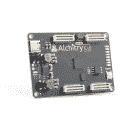](https://www.sparkfun.com/products/16526) 

将**添加到您的[购物车](https://www.sparkfun.com/cart)中！**

### [Alchitry Cu FPGA 开发板(格子 iCE40 HX)](https://www.sparkfun.com/products/16526)

[In stock](https://learn.sparkfun.com/static/bubbles/ "in stock") DEV-16526

如果您不需要大量的电源来开始您的 FPGA 冒险，或者正在寻找一个更经济的选择，Alchitry…

$53.503[Favorited Favorite](# "Add to favorites") 7[Wish List](# "Add to wish list")****[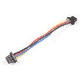](https://www.sparkfun.com/products/17260) 

将**添加到您的[购物车](https://www.sparkfun.com/cart)中！**

### [柔性 Qwiic 线缆- 50mm](https://www.sparkfun.com/products/17260)

[Out of stock](https://learn.sparkfun.com/static/bubbles/ "out of stock") PRT-17260

这种极化 I2C 电缆绝缘是由硅制成的，比我们原来的 Qwiic 电缆更灵活，特别是在

$1.05[Favorited Favorite](# "Add to favorites") 8[Wish List](# "Add to wish list")**** 

### [SparkFun 烤面包机烤箱回流控制板](https://www.sparkfun.com/products/18007)

[Out of stock](https://learn.sparkfun.com/static/bubbles/ "out of stock") WIG-18007

专为 SparkFun 的[按菜单点菜](https://alc.sparkfun.com/)定制电路板设计器设计，烤面包机烤箱回流…

[Favorited Favorite](# "Add to favorites") 4[Wish List](# "Add to wish list")[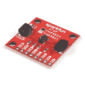](https://www.sparkfun.com/products/19037) 

将**添加到您的[购物车](https://www.sparkfun.com/cart)中！**

### [SparkFun Qwiic dToF 成像仪- TMF8821](https://www.sparkfun.com/products/19037)

[In stock](https://learn.sparkfun.com/static/bubbles/ "in stock") SEN-19037

SparkFun Qwiic dToF TMF8821 成像仪是一款直接飞行时间传感器，包括一个带有相关组件的模块化封装。

$20.951[Favorited Favorite](# "Add to favorites") 5[Wish List](# "Add to wish list")****** ******查看一些与 Artemis/Apollo3 相关的电路板和教程:

 [### 用 Arduino 开发 Artemis](https://learn.sparkfun.com/tutorials/artemis-development-with-arduino) Get our powerful Artemis based boards (Artemis Nano, BlackBoard Artemis, and BlackBoard Artemis ATP) blinking in less than 5 minutes using the SparkFun Artemis Arduino Core 6 [### MicroMod Artemis 处理器板连接指南](https://learn.sparkfun.com/tutorials/micromod-artemis-processor-board-hookup-guide) Get started with the Artemis MicroMod Processor Board in this tutorial 0 [### 用 Arduino IDE 开发 Artemis](https://learn.sparkfun.com/tutorials/artemis-development-with-the-arduino-ide) This is an in-depth guide on developing in the Arduino IDE for the Artemis module and any Artemis microcontroller development board. Inside, users will find setup instructions and simple examples from blinking an LED and taking ADC measurements; to more complex features like BLE and I2C.[Favorited Favorite](# "Add to favorites") 3 [### Qwiic ToF 成像仪- VL53L5CX 连接指南](https://learn.sparkfun.com/tutorials/qwiic-tof-imager---vl53l5cx-hookup-guide) Hookup Guide for the Qwiic ToF Imager - VL53L5CX[Favorited Favorite](# "Add to favorites") 1

或者看看这些博客帖子。

 [### 创造阿尔忒弥斯

November 13, 2019](https://www.sparkfun.com/news/3122 "November 13, 2019: Learn how we created our own SMD module using PCB tips and tricks for blind and buried vias.")[Favorited Favorite](# "Add to favorites") 2 [### 创建一个射频屏蔽

November 26, 2019](https://www.sparkfun.com/news/3123 "November 26, 2019: Any FCC certified module needs a tin can to protect and prevent RF emissions. Check out how we did it for Artemis!")[Favorited Favorite](# "Add to favorites") 1 [### 获得模块 FCC 认证

December 3, 2019](https://www.sparkfun.com/news/3124 "December 3, 2019: The costs and time required to get the world's first open source BLE module certified with the FCC.")[Favorited Favorite](# "Add to favorites") 3********