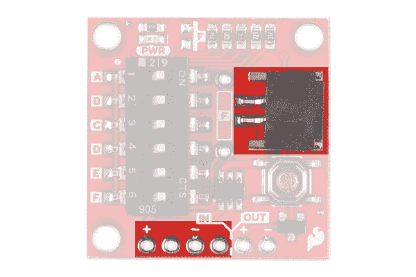
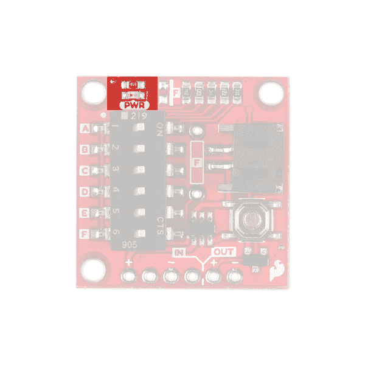
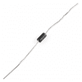
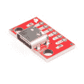
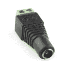

# TPL5110 纳米功率定时器连接指南

> 原文：<https://learn.sparkfun.com/tutorials/tpl5110-nano-power-timer-hookup-guide>

## 介绍

[TPL5110 纳米功率定时器](https://www.sparkfun.com/products/15353)非常适合需要低功率的应用，尤其是那些使用脂电池的项目。Nano Power Timer 将在设定的时间后持续开启您的项目，很可能是一个微控制器。当你的微控制器完成了任何需要做的事情，比如对空气质量进行采样，它就可以向 Nano Power Timer 发出信号将其关闭。当项目关闭时，Nano Power 计时器将只消耗 35nA 的功率，直到计时器再次打开项目。在本教程中，我们将讨论如何使用板载 DIP 开关设置时间，并使用微控制器在任务完成时将其关闭。

[](https://www.sparkfun.com/products/15353) 

将**添加到您的[购物车](https://www.sparkfun.com/cart)中！**

 **### [SparkFun 纳米电源定时器- TPL5110](https://www.sparkfun.com/products/15353)

[Out of stock](https://learn.sparkfun.com/static/bubbles/ "out of stock") PRT-15353

SparkFun 纳米功率定时器将运行，同时只消耗最少的电力(约 35nA ),并在以下时间后打开您的项目…

$6.951[Favorited Favorite](# "Add to favorites") 24[Wish List](# "Add to wish list")** **[https://www.youtube.com/embed/zfcodsKgS4M/?autohide=1&border=0&wmode=opaque&enablejsapi=1](https://www.youtube.com/embed/zfcodsKgS4M/?autohide=1&border=0&wmode=opaque&enablejsapi=1)

### 所需材料

要跟随本教程，您将需要以下材料。你可能不需要所有的东西，这取决于你拥有什么。例如，我选择 RedBoard 作为简单的演示，但您可以使用任何微控制器。将它添加到您的购物车，通读指南，并根据需要调整购物车。

[](https://www.sparkfun.com/products/13851) 

将**添加到您的[购物车](https://www.sparkfun.com/cart)中！**

 **### [锂离子电池- 400mAh](https://www.sparkfun.com/products/13851)

[In stock](https://learn.sparkfun.com/static/bubbles/ "in stock") PRT-13851

这是一种基于锂离子化学的非常小、非常轻的电池，具有目前最高的能量密度…

$5.5010[Favorited Favorite](# "Add to favorites") 41[Wish List](# "Add to wish list")****[](https://www.sparkfun.com/products/116) 

将**添加到您的[购物车](https://www.sparkfun.com/cart)中！**

 **### [破开头球——直击](https://www.sparkfun.com/products/116)

[In stock](https://learn.sparkfun.com/static/bubbles/ "in stock") PRT-00116

一排标题-打破适应。40 个引脚，可切割成任何尺寸。用于定制 PCB 或通用定制接头。

$1.7520[Favorited Favorite](# "Add to favorites") 133[Wish List](# "Add to wish list")****[](https://www.sparkfun.com/products/14812) 

将**添加到您的[购物车](https://www.sparkfun.com/cart)中！**

 **### [spark fun red Board Turbo-samd 21 开发板](https://www.sparkfun.com/products/14812)

[In stock](https://learn.sparkfun.com/static/bubbles/ "in stock") DEV-14812

如果你准备从旧的 8 位/16MHz 微控制器升级你的 Arduino 游戏，SparkFun RedBoard Turbo 是一种形式…

$26.958[Favorited Favorite](# "Add to favorites") 27[Wish List](# "Add to wish list")****[](https://www.sparkfun.com/products/12795) 

将**添加到您的[购物车](https://www.sparkfun.com/cart)中！**

 **### [【跳线-连接 6”(米/米，20 个装)](https://www.sparkfun.com/products/12795)

[In stock](https://learn.sparkfun.com/static/bubbles/ "in stock") PRT-12795

这些是 6 英寸长的跳线，两端都有插头。使用这些从任何板上的任何母接头跳线到…

$2.102[Favorited Favorite](# "Add to favorites") 28[Wish List](# "Add to wish list")****[](https://www.sparkfun.com/products/12043) 

将**添加到您的[购物车](https://www.sparkfun.com/cart)中！**

 **### [【试验板-迷你模块化(白色)](https://www.sparkfun.com/products/12043)

[In stock](https://learn.sparkfun.com/static/bubbles/ "in stock") PRT-12043

这个白色迷你试验板是你的小项目原型的好方法！有了 170 个并列点，就有足够的空间…

$4.50[Favorited Favorite](# "Add to favorites") 27[Wish List](# "Add to wish list")****[](https://www.sparkfun.com/products/retired/14741) 

### [spark fun Traveler microB Cable-1m](https://www.sparkfun.com/products/retired/14741)

[Retired](https://learn.sparkfun.com/static/bubbles/ "Retired") CAB-14741

你是旅行者吗？你会从你的装备上去掉每一盎司多余的重量吗？SparkFun 1 米旅行者微型电缆是 d…

**Retired**[Favorited Favorite](# "Add to favorites") 0[Wish List](# "Add to wish list")********** **********### 工具

你需要一个烙铁、焊料、[通用焊接附件](https://www.sparkfun.com/categories/49)和一把斜切刀。

[](https://www.sparkfun.com/products/14456) 

将**添加到您的[购物车](https://www.sparkfun.com/cart)中！**

 **### [【烙铁- 60W(可调温度)](https://www.sparkfun.com/products/14456)

[In stock](https://learn.sparkfun.com/static/bubbles/ "in stock") TOL-14456

当你不想倾家荡产，但又需要一个可靠的烙铁时，这个可调节温度的烙铁是一个很好的工具…

$16.5016[Favorited Favorite](# "Add to favorites") 43[Wish List](# "Add to wish list")****[](https://www.sparkfun.com/products/9163) 

将**添加到您的[购物车](https://www.sparkfun.com/cart)中！**

 **### [无铅焊料- 15 克管](https://www.sparkfun.com/products/9163)

[In stock](https://learn.sparkfun.com/static/bubbles/ "in stock") TOL-09163

这是你的无铅焊料的基本管，带有不干净的水溶性树脂芯。0.031 英寸规格，15 克

$3.954[Favorited Favorite](# "Add to favorites") 14[Wish List](# "Add to wish list")**** ****### 推荐阅读

如果您不熟悉以下概念，我们建议您在继续之前查看这些教程。

[](https://learn.sparkfun.com/tutorials/pull-up-resistors) [### 上拉电阻](https://learn.sparkfun.com/tutorials/pull-up-resistors) A quick introduction to pull-up resistors - whey they're important, and how/when to use them.[Favorited Favorite](# "Add to favorites") 65[](https://learn.sparkfun.com/tutorials/how-to-solder-through-hole-soldering) [### 如何焊接:通孔焊接](https://learn.sparkfun.com/tutorials/how-to-solder-through-hole-soldering) This tutorial covers everything you need to know about through-hole soldering.[Favorited Favorite](# "Add to favorites") 70[](https://learn.sparkfun.com/tutorials/how-to-power-a-project) [### 如何为项目提供动力](https://learn.sparkfun.com/tutorials/how-to-power-a-project) A tutorial to help figure out the power requirements of your project.[Favorited Favorite](# "Add to favorites") 67[](https://learn.sparkfun.com/tutorials/button-and-switch-basics) [### 按钮和开关基础知识](https://learn.sparkfun.com/tutorials/button-and-switch-basics) A tutorial on electronics' most overlooked and underappreciated component: the switch! Here we explain the difference between momentary and maintained switches and what all those acronyms (NO, NC, SPDT, SPST, ...) stand for.[Favorited Favorite](# "Add to favorites") 53

## 硬件概述

### 动力和脂肪电池

纳米功率定时器可以处理 **1.8V - 5.5V** 之间的电压和高达 **1.1 安培**的电流。将电源连接到 Nano Power Timer 时，有两种选择。第一个也是最明显的选择是板载 LiPo 电池连接器。第二个是`IN`标签下的五针接头上的`VDD`和`GND`针(是**输入**的简称)。您提供给**输入端**的功率将从**输出端**流出，为您的微控制器或项目供电。如果您使用 LiPo 电池，则**不要**将另一个电源连接到这些引脚。

| [](https://cdn.sparkfun.com/assets/learn_tutorials/9/0/1/TPL5110_Power_Options_Top_Side.jpg) | [](https://cdn.sparkfun.com/assets/learn_tutorials/9/0/1/TPL5110_Power_IN_Bottom.jpg) |
| **榜首** | **底部** |

`OUT` ( **输出**功率标为`VDD_OUT`和`GND`。这些引脚将连接到您正在供电的电路板或项目。

| [](https://cdn.sparkfun.com/assets/learn_tutorials/9/0/1/TPL5110_Power_Out.jpg) | [](https://cdn.sparkfun.com/assets/learn_tutorials/9/0/1/TPL5110_Power_Out_Bottom.jpg) |
| **榜首** | **底部** |

### 定时器和延时开关

**Note:** As reported in the datasheet, the resistance corresponding to the given time has a certain margin of error. The example given in the datasheet is a desired 600 second time which would require a resistance that falls in the window: 56.96k&ohm;-57.44k&ohm;. The resistor values on the board have a 1% tolerance as well. The tolerance of the resistors and margin of error makes it imprudent to try and use this product for **HIGH** precision applications.

Nano Power Timer 的主要功能是在设定的时间量后持续打开您的微控制器*开启*。该板有一个 DIP 开关，通过改变 IC 上 timer 引脚的电阻来控制时间。在交换机的左侧，有五个字母标记每个交换机。在板的下面是这些字母和当相应的开关被翻转时设置的时间量。

| [](https://cdn.sparkfun.com/assets/learn_tutorials/9/0/1/TPL5110_Timer_Switch_Options.jpg) | [](https://cdn.sparkfun.com/assets/learn_tutorials/9/0/1/TPL5110_Timer_Switch_Options_Bottom.jpg) |
| **榜首** | **底部** |

这个时间是**设置**当板卡**加电**时，所以在你选择你的时间后循环加电。查看下表，找到适合您项目的时间。

| 计时器 | 转换 | 抵抗 |
| 30 多岁 | A | 16.2 k &ohm; |
| 1 分钟 | B | 22 k &ohm; |
| 30 分钟 | C | 93.1 千&ohm; |
| 1 小时 | D | 124 k &ohm; |
| 2 小时 | E | 169 k &ohm; |
| 习俗 | F | 习俗 |

如果您的时间没有列出，那么我们已经为自定义时间留下了两个额外的垫:一个 SMD 和另一个 PTH。这两个空格在产品上标有`F`，它们对应的开关也标有相同的标签。如果你决定同时使用它们，它们的电阻是并联的，所以确保[相应地计算](https://www.allaboutcircuits.com/tools/parallel-resistance-calculator/)。

[](https://cdn.sparkfun.com/assets/learn_tutorials/9/0/1/TPL5110_Custom_Timer.jpg)**Note:** Regardless of how long your application takes to complete what it needs to do, the Nano Power Timer will *always* turn the board on at the chosen interval. For example, a two second blink of an LED will not delay a 10 second interval by two seconds (making the delay 12 seconds). Instead the LED will turn back on after 8 seconds because the two second delay cuts into the 10 second interval.

### 更多定时器选项

你并不局限于丝绸上所描绘的时代。忽略`Custom`开关选项，除了印刷在电路板上的五个开关之外，还有 **26 种可能的开关组合**，产生的时间从三秒到 15 分钟不等。下图给出了**对**电阻的组合、它们的组合电阻以及它们的大致时间。一些多余的电阻被忽略了。

| 计时器 | 切换组合 | 抵抗 |
| 2-3 秒 | A+B+C+D+E | 7.579 k &ohm; |
| 3-4 岁 | A+B+C+D | 7.933 k &ohm; |
| 4 s | A+B+C | 8.470 k &ohm; |
| 5 s | A+B+E | 8.844 k &ohm; |
| 6 s | A+B | 9.329 k &ohm; |
| 10 秒 | A+C+D+E | 11.563 k &ohm; |
| 约 12 秒 | A+C+D | 12.407 k &ohm; |
| 约 13 秒 | A+C+E | 12.742 k &ohm; |
| 大约 15 秒 | A+D+E | 13.225 k &ohm; |
| 大约 18 岁 | A+C | 13.774 k &ohm; |
| 大约 19 岁 | B+C+D+E | 14.243 k &ohm; |
| 20 多岁 | A+D | 14.341 k &ohm; |
| 大约 22 岁 | A+E | 14.790 k &ohm; |
| 大约 25 岁 | B+C+D | 15.546 k &ohm; |
| 大约 28 岁 | B+C+E | 16.075 千&ohm; |
| 32 秒 | B+D+E | 16.852 k &ohm; |
| 35 岁 | B+C | 17.754 k &ohm; |
| 40 多岁 | B+D | 18.707 k &ohm; |
| 大约 45 岁 | B+E | 19.479 k &ohm; |
| 大约 5 分钟 | C+D+E | 40.400 k &ohm; |
| 8 分钟 | C+D | 52.995 千&ohm; |
| 大约 12 分钟 | C+E | 59.694 k &ohm; |
| 15 分钟 | D+E | 72.033 k &ohm; |

其中一些时间是近似值，但是我在下面的参考资料中提供了一个 Python 脚本来帮助您计算您的确切时间。由于电阻的容差，每块电路板的差异会很小。

### 数据手册中的其他定时器选项

下面是数据表中的可用时间列表，这些时间不包括在上面的图表中。值得注意的是毫秒范围内的定时器选项。您可以利用 Nano Power Timer 上的两个空电阻片来获取这些时间。

| 计时器 | 抵抗 |
| 100 毫秒 | 500 &ohm; |
| 200 毫秒 | 1000 &ohm; |
| 300 毫秒 | 第 1500 章&ohm; |
| 400 毫秒 | 2000 年&ohm; |
| 500 毫秒 | 2500 &ohm; |
| 600 毫秒 | 3000 &ohm; |
| 700 毫秒 | 3500 &ohm; |
| 800 毫秒 | 4000 &ohm; |
| 900 毫秒 | 4500 &ohm; |
| 1 秒 | 5.20 千&ohm; |
| 2 s | 6.79 k &ohm; |
| 7 s | 9.71 k &ohm; |
| 8 s | 10.18 k &ohm; |
| 9 s | 10.68 千&ohm; |
| 30 多岁 | 16.78 k &ohm; |
| 50 多岁 | 20.047 千&ohm; |
| 2 分钟 | 29.35 k &ohm; |
| 3 分钟 | 34.73 千&ohm; |
| 4 分钟 | 39.11 k &ohm; |
| 5 分钟 | 42.90 千&ohm; |
| 6 分钟 | 46.29 千&ohm; |
| 7 分钟 | 49.38 千&ohm; |
| 9 分钟 | 54.92 千&ohm; |
| 十分钟 | 57.44 k &ohm; |
| 20 分钟 | 77.57 千&ohm; |
| 40 分钟 | 104.67 千&ohm; |
| 50 分钟 | 115.33 k &ohm; |
| 1 先生 30 分钟 | 149.39 k &ohm; |

### 按钮

产品上的按钮将手动启动计时器。这允许你测试定时器和你的项目，它应该发送一个**关闭**信号到`Done`引脚。

[](https://cdn.sparkfun.com/assets/learn_tutorials/9/0/1/TPL5110_Push_Button.jpg)

### 发光二极管

产品顶部有一个红色的电源 LED，表示正在向`OUT`引脚供电。如果您想断开该 LED，只需切断标有`LED`的电路板下侧跳线之间的走线。

| [](https://cdn.sparkfun.com/assets/learn_tutorials/9/0/1/Power_LED.jpg) | [](https://cdn.sparkfun.com/assets/learn_tutorials/9/0/1/LED_Jumper.jpg) |
| **电源 LED** | **电源 LED 跳线** |

### 页眉

在`GND`旁边是`DONE`引脚，它告诉产品关闭你的微控制器或项目。为此，您的微控制器或项目需要向该引脚发送一个从**低电平**到**高电平**的数字信号。最后，`DRV`引脚为高电平有效，当引脚接收到一个**高电平**信号时，将启动项目的定时器。这与车载按钮的功能相同。没有多少人会想附加一个不同的按钮，但如果你想，这将是地方。

[](https://cdn.sparkfun.com/assets/learn_tutorials/9/0/1/TPL5110_DONE_DRIVE_Pins.jpg)

### 我如何检查准确的时间？！

我在下面提供了一个简单的 Arduino 草图来计算计时器设置的准确时间。将 VOUT 引脚连接到微控制器上的一个数字 I/O 引脚，电源高时草图将启动定时器，电源低时结束定时器。

[Nano Power Timer Checker (INO)](https://cdn.sparkfun.com/assets/learn_tutorials/9/0/1/nano_power_timer_checker.ino)

## 硬件连接

⚡ **Warning!** When powering a microcontroller to the Arduino via USB, you will need to disconnect the TPL5110 from the Arduino's power input. The conflicting power sources will damage the TPL5100\. You may want to consider adding a [Schottky diode](https://www.sparkfun.com/products/10926) betwen the TPL5110's output voltage and the microcontroller's voltage input.

[](https://www.sparkfun.com/products/10926) 

将**添加到您的[购物车](https://www.sparkfun.com/cart)中！**

 **### [肖特基二极管](https://www.sparkfun.com/products/10926)

[In stock](https://learn.sparkfun.com/static/bubbles/ "in stock") COM-10926

肖特基二极管以其低正向压降和极快的开关动作而闻名。这个 1A 40V 肖特基二极管是…

$0.251[Favorited Favorite](# "Add to favorites") 12[Wish List](# "Add to wish list")******Note:** Depending on your microcontroller, you may need to add a pull-down resistor on the Done pin. We found that the SAMD21 and SAMD51 boards required a [pull-down resistor](https://learn.sparkfun.com/tutorials/pull-up-resistors/all#what-is-a-pull-up-resistor) to trigger the TPL5110's Done pin reliably.

[](https://www.sparkfun.com/products/14491) 

将**添加到您的[购物车](https://www.sparkfun.com/cart)中！**

 **### [电阻器 10K 欧姆 1/4 瓦 PTH - 20 包(粗引线)](https://www.sparkfun.com/products/14491)

[In stock](https://learn.sparkfun.com/static/bubbles/ "in stock") PRT-14491

这些是普通的 1/4 瓦、+/- 5%容差 PTH 电阻。通常用于试验板和其他原型制作…

$1.25[Favorited Favorite](# "Add to favorites") 12[Wish List](# "Add to wish list")** **我们将使用 3.7V LiPo 电池为 RedBoard Turbo 供电，并将其设置为 14 秒延迟。默认情况下，电路板上的每个开关都被拨到位置的**，这是一个 3 秒钟的计时器。为了将计时器设置为 14 秒，我们将把一些开关转到*开*的位置，而把另外一些开关转到*关*的位置。我用镊子，因为开关对我的手来说太小了。**

[](https://cdn.sparkfun.com/assets/learn_tutorials/9/0/1/Flipping_Switchs.jpg)

为了获得 14 秒的延迟，必须将开关‘A’+‘D’+‘E’扳到**开**，并且将*其他*开关扳到**关**。接下来焊接一个你选择的 6 针接头到 Nano Power 定时器上。六针接头[焊接](https://learn.sparkfun.com/tutorials/how-to-solder-through-hole-soldering)到纳米功率定时器后，按如下方式将三根电线插入母接头:

[](https://cdn.sparkfun.com/assets/learn_tutorials/9/0/1/TPL5110_Nano_Power_Timer_Fritzing_bb.jpg)

在制作原型和上传代码时，当 RedBoard Turbo 连接到计算机时，我们将使用肖特基二极管来保护 TPL5110。此外，我们将在 Done 引脚上添加一个下拉电阻。根据你的微控制器，你可能不需要电阻。将电路连接在一起后，在没有连接电池的情况下，您可能会看到类似下图的东西。

[](https://cdn.sparkfun.com/assets/learn_tutorials/9/0/1/TPL5110_Nano_Power_Timer_Hookup.jpg)

让我们来看看代码。

**Note:** If you are looking to reduce the number of components used with the TPL5110 and a microcontroller, you could solder wire directly to the PTH pins, remove the pull-down resistor, and Schottky diode. Just make sure to disconnect the VOUT pin whenever you are connecting a USB cable to your microcontroller to upload.

[](https://cdn.sparkfun.com/assets/learn_tutorials/9/0/1/No_Diode_TPL5110_Nano_Power_Timer_Fritzing_bb.jpg)

## 简单的例子

**Note:** If this is your first time using Arduino, please review our tutorial on [installing the Arduino IDE.](https://learn.sparkfun.com/tutorials/installing-arduino-ide) If you've never connected an SAMD21 device to your computer before, you will need to install the board add-on and may need to install drivers. Check out our section on [UF2 Bootloader and Drivers](https://learn.sparkfun.com/tutorials/redboard-turbo-hookup-guide/all#uf2-bootloader-and-drivers) and [Setting Up Arduino](https://learn.sparkfun.com/tutorials/redboard-turbo-hookup-guide/all#setting-up-arduino) for help with the installation.

通过这个例子，我们将展示 Nano Power Timer 的基本工作原理。复制代码并粘贴到 Arduino IDE 中。选择您的主板(在本例中为 **RedBoard Turbo** )、COM 端口，并点击上传按钮上传至 Arduino IDE。

Nano Power Timer 由 LiPo 电池供电，每隔 14 秒就会打开一个 RedBoard Turbo。RedBoard Turbo 将闪烁其蓝色 LED，然后向 Nano Power Timer 发送一个 *done* 信号，这将关闭 RedBoard Turbo。

Regardless of how long your application takes to complete what it needs to do, the Nano Power Timer will *always* turn the board on at the chosen interval. For this simple example, the one second blink of the LED does **NOT** impact the 14 second interval.

```
language:c
/*
TPL5110_Blink_Demo_example.ino

  Simple Example Code for the TPL5110 Nano Power Timer Hookup Guide. This code
  simply blinks the pin 13 LED and writes pin 4 (donePin pin) high. This shift from
  LOW to HIGH of the donePin pin, signals to the Nano Power Timer to turn off the
  microcontroller.
  SparkFun Electronics
  Date: May, 2019
  Author: Elias Santistevan
*/

int led = 13; // Pin 13 LED
int donePin = 4; // Done pin - can be any pin.  

void setup(){

  pinMode(led, OUTPUT); 
  pinMode(donePin, OUTPUT); 

}

void loop(){
  // Blink. 
  digitalWrite(led, HIGH); 
  delay(1000); 
  digitalWrite(led, LOW); 
  delay(1000); 

  // We're done!
  // It's important that the donePin is written LOW and THEN HIGH. This shift
  // from low to HIGH is how the Nano Power Timer knows to turn off the
  // microcontroller. 
  digitalWrite(donePin, LOW); 
  digitalWrite(donePin, HIGH); 
  delay(10);
} 
```

上传此代码后，将 LiPo 电池插入*纳米功率定时器*，RedBoard Turbo 将闪烁一次，由纳米功率定时器关闭，然后在 12 秒后再次打开(草图中的 14 秒定时器- 2 秒延迟)。

Note that the Power LED on the Nano Power Timer turns on when it provides power to your microcontroller.[](https://cdn.sparkfun.com/assets/learn_tutorials/9/0/1/TPL5110_Nano_Power_Timer_Hookup_Action.jpg)

这款纳米功率定时器在你用电池进行远程项目，并且需要最大限度地延长电池寿命时大放异彩！在代码中，你能做的深度睡眠只有这么多，没有什么能与 Nano Power Timer 关闭状态下消耗的 35nA 功率相比。你只需要一个额外的 GPIO 或一些发送数字信号的方法，该信号可以从**低**到**高**，以向纳米功率定时器发送信号**关断**。

**Note:** Don't forget! We've also broken out **INPUT** power pins, so you're not limited to just a LiPo battery. Check out the list below for other power connectors for additional power options (not a complete list)!

[](https://www.sparkfun.com/products/15100) 

将**添加到您的[购物车](https://www.sparkfun.com/cart)中！**

 **### [SparkFun USB-C 突破](https://www.sparkfun.com/products/15100)

[In stock](https://learn.sparkfun.com/static/bubbles/ "in stock") BOB-15100

SparkFun USB-C 分线板在断开连接上的每个引脚时，提供的功率是以前 USB 板的 3 倍…

$4.955[Favorited Favorite](# "Add to favorites") 33[Wish List](# "Add to wish list")****[](https://www.sparkfun.com/products/114) 

将**添加到您的[购物车](https://www.sparkfun.com/cart)中！**

 **### [SparkFun 面包板电源 5V/3.3V](https://www.sparkfun.com/products/114)

[In stock](https://learn.sparkfun.com/static/bubbles/ "in stock") PRT-00114

这是一个非常简单的试验板电源套件，从 DC 壁式电源插座获取电源，并输出可选的 5V 或 3.3V 电源

$11.9516[Favorited Favorite](# "Add to favorites") 60[Wish List](# "Add to wish list")****[](https://www.sparkfun.com/products/12035) 

将**添加到您的[购物车](https://www.sparkfun.com/cart)中！**

 **### [SparkFun 微博 USB 突围](https://www.sparkfun.com/products/12035)

[In stock](https://learn.sparkfun.com/static/bubbles/ "in stock") BOB-12035

这个简单的电路板将 micro-B USB 连接器的 VCC、GND、ID、D-和 D+引脚连接到 0.1 英寸间距的接头上。如果你想广告…

$2.9512[Favorited Favorite](# "Add to favorites") 38[Wish List](# "Add to wish list")****[](https://www.sparkfun.com/products/10288) 

将**添加到您的[购物车](https://www.sparkfun.com/cart)中！**

 **### [DC 筒式千斤顶适配器——母](https://www.sparkfun.com/products/10288)

[In stock](https://learn.sparkfun.com/static/bubbles/ "in stock") PRT-10288

此适配器允许您将筒式插孔连接器连接到裸线。一端有螺丝端子，另一端有一个 5.5…

$3.501[Favorited Favorite](# "Add to favorites") 24[Wish List](# "Add to wish list")****[](https://www.sparkfun.com/products/8432) 

将**添加到您的[购物车](https://www.sparkfun.com/cart)中！**

 **### [](https://www.sparkfun.com/products/8432)螺丝端子 5mm 间距(2 针)

[In stock](https://learn.sparkfun.com/static/bubbles/ "in stock") PRT-08432

带 5 毫米节距销的螺钉端子。有 2 个或 3 个位置，有滑动锁在一起的非常酷的功能…

$1.051[Favorited Favorite](# "Add to favorites") 14[Wish List](# "Add to wish list")********** **********## 资源和更进一步

现在您已经成功启动并运行了 TPL5110 Nano Power Timer，是时候将它整合到您自己的项目中了！有关更多信息，请查看以下资源:

*   [示意图(PDF)](https://cdn.sparkfun.com/assets/a/8/0/9/1/SparkFun_TPL5110_Nano_Power_Switch.pdf)
*   [老鹰文件(ZIP)](https://cdn.sparkfun.com/assets/0/e/2/3/f/TPL5110_Nano_Power_Switch.zip)
*   [数据表(PDF)](https://cdn.sparkfun.com/assets/learn_tutorials/9/0/1/tpl5110.pdf)
*   [GitHub 回购](https://github.com/sparkfun/SparkFun_TPL5110_Nano_Power_Timer)
    *   /固件/Arduino
        *   [纳米功率定时器检查器草图](https://cdn.sparkfun.com/assets/learn_tutorials/9/0/1/nano_power_timer_checker.ino)
        *   [TPL5110 眨眼完成示例草图](https://cdn.sparkfun.com/assets/learn_tutorials/9/0/1/TPL5110_Blink_Done_Example.ino)
    *   /固件/Python
        *   [电阻组合计算器](https://github.com/sparkfun/Resistance_Combinator_Calculator)
*   [SFE 产品展示区](https://youtu.be/zfcodsKgS4M)

你的下一个项目需要一些灵感吗？查看一些相关教程:

[](https://learn.sparkfun.com/tutorials/reaction-timer) [### 反应速度测量器](https://learn.sparkfun.com/tutorials/reaction-timer) Demonstrate mental chronometry with this simple reaction timer 11[](https://learn.sparkfun.com/tutorials/sunny-buddy-solar-charger-v13-hookup-guide-) [### 阳光伙伴太阳能充电器 V13 连接指南](https://learn.sparkfun.com/tutorials/sunny-buddy-solar-charger-v13-hookup-guide-) How to hookup the Sunny Buddy: a solar-powered, MPPT (peak-power tracking), LiPo battery charger.[Favorited Favorite](# "Add to favorites") 14[](https://learn.sparkfun.com/tutorials/sparkfun-inventors-kit-for-photon-experiment-guide) [### 光子实验指南](https://learn.sparkfun.com/tutorials/sparkfun-inventors-kit-for-photon-experiment-guide) Dive into the world of the Internet of Things with the SparkFun Inventor's Kit for Photon.[Favorited Favorite](# "Add to favorites") 14[](https://learn.sparkfun.com/tutorials/adding-a-timed-button-to-a-project) [### 将定时按钮添加到项目](https://learn.sparkfun.com/tutorials/adding-a-timed-button-to-a-project) This tutorial will walk you through making a timed power controller for interactive projects. You will learn how to add an on button that will provide power to your project for an amount of time and then turn off again.[Favorited Favorite](# "Add to favorites") 6******************************