# 电容式触摸滑块(CAP1203)连接指南

> 原文：<https://learn.sparkfun.com/tutorials/capacitive-touch-slider-cap1203-hookup-guide>

## 介绍

你想把你的艺术项目或科学实验上的滑块或按钮换成更有趣的界面吗？SparkFun [电容式触摸滑块- CAP1203 (Qwiic)](https://www.sparkfun.com/products/15344) 是一种将电容式触摸添加到您的下一个项目的 Qwiic 和简单方法。借助主板内置的触摸板，您可以立即开始使用三个独特的触摸输入或滑块触摸功能。您还可以启用触摸输入作为电源按钮，自定义您自己的触摸板的灵敏度，并使用中断警报 LED。由于传感器支持 I ² C，我们增加了一个 qw ICC 连接器，便于集成到 qw ICC 环境中。我们还为电容式触摸输入添加了分线引脚，因此您可以连接到自己的触摸板。

[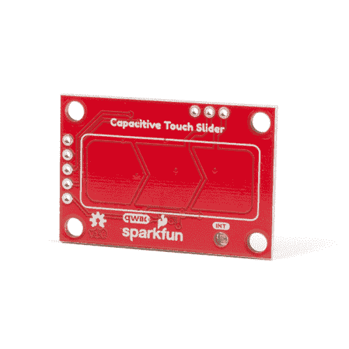](https://www.sparkfun.com/products/15344) 

将**添加到您的[购物车](https://www.sparkfun.com/cart)中！**

### [【spark fun 电容式触摸滑盖- CAP1203 (Qwiic)](https://www.sparkfun.com/products/15344)

[In stock](https://learn.sparkfun.com/static/bubbles/ "in stock") SEN-15344

使用 Qwiic 将电容式触摸添加到您的下一个项目中，这样您就可以开始将触摸功能作为三种独特的触摸方式来玩了

$6.50[Favorited Favorite](# "Add to favorites") 26[Wish List](# "Add to wish list")** **[https://www.youtube.com/embed/m0z9WJECjkU/?autohide=1&border=0&wmode=opaque&enablejsapi=1](https://www.youtube.com/embed/m0z9WJECjkU/?autohide=1&border=0&wmode=opaque&enablejsapi=1)

### 所需材料

为了理解本教程中使用的示例代码，您还需要以下材料。你可能不需要所有的东西，这取决于你拥有什么。将它添加到您的购物车，通读指南，并根据需要调整购物车。

 

将**添加到您的[购物车](https://www.sparkfun.com/cart)中！**

### [spark fun RedBoard Qwiic](https://www.sparkfun.com/products/15123)

[In stock](https://learn.sparkfun.com/static/bubbles/ "in stock") DEV-15123

SparkFun RedBoard Qwiic 是一款 Arduino 兼容开发板，内置 Qwiic 连接器，无需…

$21.5014[Favorited Favorite](# "Add to favorites") 49[Wish List](# "Add to wish list")**** 

将**添加到您的[购物车](https://www.sparkfun.com/cart)中！**

### [USB micro-B 线- 6 脚](https://www.sparkfun.com/products/10215)

[In stock](https://learn.sparkfun.com/static/bubbles/ "in stock") CAB-10215

USB 2.0 型到微型 USB 5 针。这是一种新的、更小的 USB 设备连接器。微型 USB 连接器大约是…

$5.5014[Favorited Favorite](# "Add to favorites") 21[Wish List](# "Add to wish list")**** 

将**添加到您的[购物车](https://www.sparkfun.com/cart)中！**

### [Qwiic 线缆- 50mm](https://www.sparkfun.com/products/14426)

[In stock](https://learn.sparkfun.com/static/bubbles/ "in stock") PRT-14426

这是一根 50 毫米长的 4 芯电缆，带有 1 毫米 JST 端接。它旨在将支持 Qwiic 的组件连接在一起…

$0.95[Favorited Favorite](# "Add to favorites") 29[Wish List](# "Add to wish list")**************Heads up!** If you are using the [RedBoard **without** a Qwiic connector](https://www.sparkfun.com/products/13975), we recommend getting the Qwiic Shield for Arduino.

 

将**添加到您的[购物车](https://www.sparkfun.com/cart)中！**

### [ArduinoT3 的 SparkFun Qwiic 盾](https://www.sparkfun.com/products/14352)

[In stock](https://learn.sparkfun.com/static/bubbles/ "in stock") DEV-14352

SparkFun Qwiic Shield 是一种易于组装的板，它提供了一种简单的方法来将 Qwiic Connect 系统与

$7.508[Favorited Favorite](# "Add to favorites") 39[Wish List](# "Add to wish list")** **如果您需要不同尺寸的 Qwiic 线缆，我们提供包含多种尺寸的套件，但我们也会单独携带。

 

将**添加到您的[购物车](https://www.sparkfun.com/cart)中！**

### [SparkFun Qwiic 线缆套件](https://www.sparkfun.com/products/15081)

[In stock](https://learn.sparkfun.com/static/bubbles/ "in stock") KIT-15081

为了更容易上手，我们用 50 毫米到 500 毫米的各种 Qwiic 电缆组装了 Qwiic 电缆套件…

$8.9516[Favorited Favorite](# "Add to favorites") 58[Wish List](# "Add to wish list")**** 

将**添加到您的[购物车](https://www.sparkfun.com/cart)中！**

### [Qwiic 线缆- 100mm](https://www.sparkfun.com/products/14427)

[In stock](https://learn.sparkfun.com/static/bubbles/ "in stock") PRT-14427

这是一条 100 毫米长的 4 芯电缆，带有 1 毫米 JST 端接。它旨在将支持 Qwiic 的组件连接在一起…

$1.50[Favorited Favorite](# "Add to favorites") 32[Wish List](# "Add to wish list")**** 

将**添加到您的[购物车](https://www.sparkfun.com/cart)中！**

### [Qwiic 线缆- 500mm](https://www.sparkfun.com/products/14429)

[In stock](https://learn.sparkfun.com/static/bubbles/ "in stock") PRT-14429

这是一根 500mm 长的 4 芯电缆，带有 1mm JST 端接。它旨在将支持 Qwiic 的组件连接在一起…

$1.951[Favorited Favorite](# "Add to favorites") 25[Wish List](# "Add to wish list")**** 

将**添加到您的[购物车](https://www.sparkfun.com/cart)中！**

### [Qwiic 电缆-试验板跳线(4 针)](https://www.sparkfun.com/products/14425)

[In stock](https://learn.sparkfun.com/static/bubbles/ "in stock") PRT-14425

这是一根跳线适配器电缆，一端带有一个 Qwiic JST 母接头，另一端带有一个试验板连接…

$1.50[Favorited Favorite](# "Add to favorites") 34[Wish List](# "Add to wish list")******** ********### 推荐阅读

如果你不熟悉 Qwiic 系统，我们推荐你在这里阅读[以获得一个概述](https://www.sparkfun.com/qwiic)。

|  |
| *[Qwiic 连接系统](https://www.sparkfun.com/qwiic)* |

如果你不熟悉下面的教程，我们也建议你看一看。

 [### 按钮和开关基础知识](https://learn.sparkfun.com/tutorials/button-and-switch-basics) A tutorial on electronics' most overlooked and underappreciated component: the switch! Here we explain the difference between momentary and maintained switches and what all those acronyms (NO, NC, SPDT, SPST, ...) stand for.[Favorited Favorite](# "Add to favorites") 53 [### 电容器](https://learn.sparkfun.com/tutorials/capacitors) Learn about all things capacitors. How they're made. How they work. How they look. Types of capacitors. Series/parallel capacitors. Capacitor applications.[Favorited Favorite](# "Add to favorites") 84 [### I2C](https://learn.sparkfun.com/tutorials/i2c) An introduction to I2C, one of the main embedded communications protocols in use today.[Favorited Favorite](# "Add to favorites") 128 [### 如何使用跳线焊盘和 PCB 走线](https://learn.sparkfun.com/tutorials/how-to-work-with-jumper-pads-and-pcb-traces) Handling PCB jumper pads and traces is an essential skill. Learn how to cut a PCB trace, add a solder jumper between pads to reroute connections, and repair a trace with the green wire method if a trace is damaged.[Favorited Favorite](# "Add to favorites") 11 [### RedBoard Qwiic 连接指南](https://learn.sparkfun.com/tutorials/redboard-qwiic-hookup-guide) This tutorial covers the basic functionality of the RedBoard Qwiic. This tutorial also covers how to get started blinking an LED and using the Qwiic system.[Favorited Favorite](# "Add to favorites") 5

## 硬件概述

**Note:** If you want to do anything outside of what is covered in this tutorial or the example code, please refer to the [CAP1203 datasheet](https://cdn.sparkfun.com/assets/c/9/f/2/c/CAP1203_Data_Sheet.pdf) for exact details on the sensor functionality.

### 力量

您可以通过板上的极化 Qwiic 连接器或通孔接头上的`3V3`标记引脚提供 **3.3V** 。Qwiic 系统打算使用 **3.3V** ，所以在使用 Qwiic 系统时，请确保您是**而不是**使用另一个电压。正确接通主板电源后，红色电源指示灯将会亮起。

[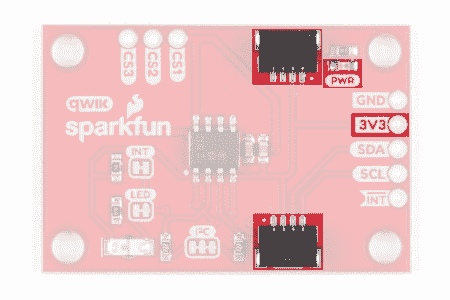](https://cdn.sparkfun.com/assets/learn_tutorials/8/9/8/power-a.png)*Power LED, Breakout Pin, and Qwiic Connectors*

### Qwiic 连接器或 I ² C 引脚

电路板背面有两个 Qwiic 连接器，可以轻松地将传感器连接到 I ² C。如果您更喜欢传统的连接 I ² C 的方法，我们还在电路板侧面提供了四个分线引脚。

[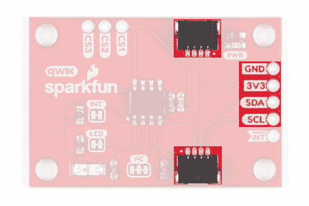](https://cdn.sparkfun.com/assets/learn_tutorials/8/9/8/I2C.png)*Qwiic Connectors and I²C Breakout Pins*

### 中断引脚和 LED

中断引脚是一个低电平有效输出，每次触摸传感器板时都会触发。如果您想检查中断发生的时间，可以连接到此引脚。在主板正面，右下角的绿色 LED 也会在发生中断时发出信号。

[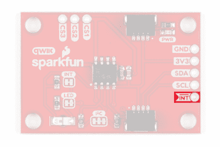](https://cdn.sparkfun.com/assets/learn_tutorials/8/9/8/int-pin.png)*Interrupt Breakout Pin*[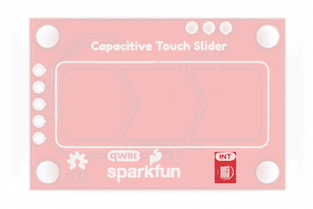](https://cdn.sparkfun.com/assets/learn_tutorials/8/9/8/int-led.png)*Interrupt LED*

### 电容式触摸板和触针

在主板的正面，有一个箭头形状，其中包含三个独立的电容式触摸板。为了知道哪一个是哪一个，用箭头指向正确的方向来定位板。在整个指南和代码中，我们将这些电容式触摸板称为左触摸板、中触摸板和右触摸板。我们还将电容式触摸传感器线路分成电路板顶部的电镀通孔。您可以使用这些引脚连接到自己的电容式触摸板。CS1 引脚连接到左焊盘，CS2 引脚连接到中间焊盘，CS3 引脚连接到右焊盘。

[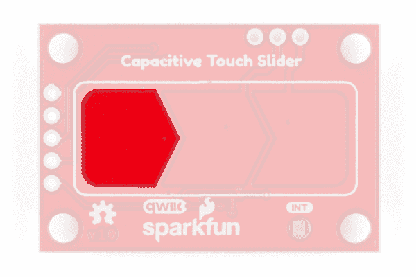](https://cdn.sparkfun.com/assets/learn_tutorials/8/9/8/left-pad.png)[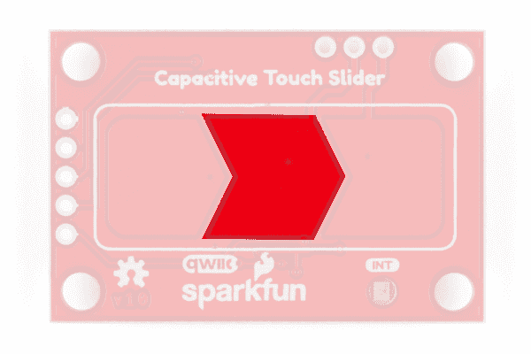](https://cdn.sparkfun.com/assets/learn_tutorials/8/9/8/middle-pad.png)[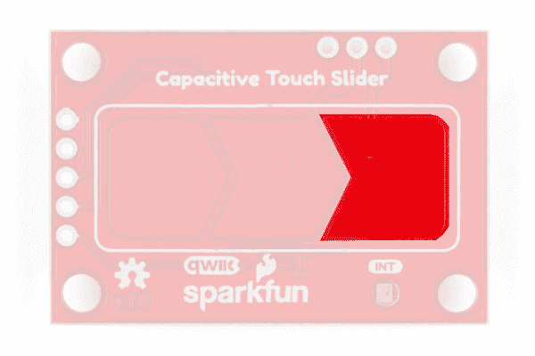](https://cdn.sparkfun.com/assets/learn_tutorials/8/9/8/right-pad.png)*Left, Middle, and Right Touch Pads*[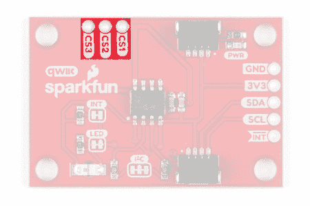](https://cdn.sparkfun.com/assets/learn_tutorials/8/9/8/cap-touch-pins.png)*Capacitive Touch Pad Breakout Pins*

### 针织套衫

电路板背面有 3 个跳线垫，每个都标有其功能。首先，在电路板的左上侧，有一个标记为`INT`的双向跳线，连接到 10k &欧姆；中断数据线上的上拉电阻。如果你切断这个跳线，它将断开 10kk &欧姆；来自中断数据线的上拉电阻。接下来，在电路板的左下方，有一个标记为`LED`的双向跳线，连接到绿色中断 led。如果您切断此跳线，它将断开 LED 与中断线路的连接，有效地禁用绿色 LED 的功能。最后，在电路板的下半部分，有一个标记为`I²C`的三路跳线，连接两个 2.2kk &欧姆；I ² C 数据线的上拉电阻。如果你的 I ² C 数据线上有多个器件，那么你可以考虑切断这个跳线。不知道怎么剪跳线？[看这里！](https://learn.sparkfun.com/tutorials/how-to-work-w-jumper-pads-and-pcb-traces/cutting-a-trace-between-jumper-pads)

[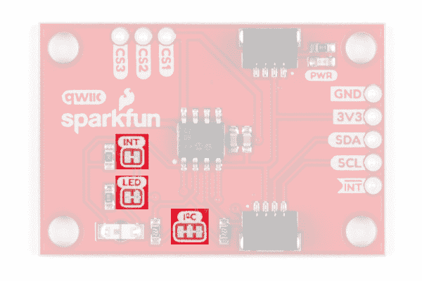](https://cdn.sparkfun.com/assets/learn_tutorials/8/9/8/jumper-pads-a.png)*Jumper pads for the INT pin pull-up, LED disable, and I²C pullup*

### 电路板测量

SparkFun 电容式触摸的尺寸为 1 英寸×1.5 英寸。

[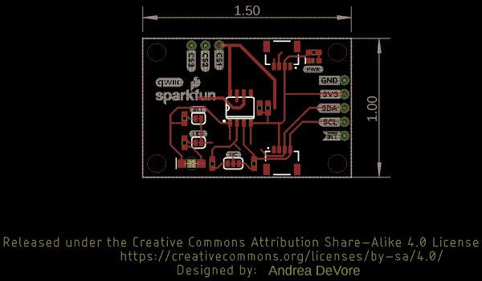](https://cdn.sparkfun.com/assets/learn_tutorials/8/9/8/SparkFun_Capacitive_Touch_Board_Measurements.png)

## 硬件装配

有了 Qwiic 连接器系统，组装硬件变得很容易。在本教程中，我们使用了 [SparkFun RedBoard Qwiic](https://www.sparkfun.com/products/15123) 、一根[关联 USB 线](https://www.sparkfun.com/products/10215)和一根 [Qwiic 线](https://www.sparkfun.com/products/14427)。将 qw IC 电缆插在 RedBoard Qwiic 和电容式触摸滑块之间。然后，通过 USB 电缆将微控制器连接到您的计算机。和...就是这样！您已经准备好开始上传代码了。否则，如果你要焊接，然后连接电线从电源，接地，和 I ² C 数据线分线引脚到你选择的微控制器。使用 CS1、CS2 和 CS3 电镀通孔引脚，您还可以将容性触摸线连接到自己的容性触摸板。

*Qwiic Hardware Assembly*

## Arduino 图书馆

**Note:** This example assumes you are using the latest version of the Arduino IDE on your desktop. If this is your first time using Arduino, please review our tutorial on [installing the Arduino IDE.](https://learn.sparkfun.com/tutorials/installing-arduino-ide) If you have not previously installed an Arduino library, please check out our [installation guide.](https://learn.sparkfun.com/tutorials/installing-an-arduino-library)

我们提供了一个库来帮助您轻松控制和配置电容式触摸滑块。您可以通过在 Arduino library manager 中搜索“ **SparkFun Qwiic 电容式触摸滑块**”来下载该库。一些功能包括当触摸板被触摸时进行读取，检测左右滑动，启用电源按钮，以及设置自己触摸板的灵敏度。你也可以通过点击下面的按钮从 [GitHub 库](https://github.com/sparkfun/Qwiic_Capacitive_Touch_Slider_Arduino_Library)中获取这个库来手动安装这个库。我们提供了七种不同的草图示例来帮助您开始。

[SparkFun Capacitive Touch Slider Arduino Library (ZIP)](https://github.com/sparkfun/Qwiic_Capacitive_Touch_Slider_Arduino_Library/archive/main.zip)

### 库函数

Arduino 库是注释的，函数应该是自解释的。然而，下面是可用库函数的详细列表。

**Note:** It is recommended that users begin with the examples in the following section before diving head first into the library functions. The library examples demonstrate how to setup the more basic features of the Capacitive Touch Slider without having to dig through the datasheet. Once users have become familiar with the basic setups and have gone through the [datasheet](https://cdn.sparkfun.com/assets/c/9/f/2/c/CAP1203_Data_Sheet.pdf) thoroughly, it should be easier to follow the [library functions](https://github.com/sparkfun/Qwiic_Capacitive_Touch_Slider_Arduino_Library) below.

**初始化设置:**我们使用这些来设置和初始化电路板。

`.begin()` -初始化传感器，如果设置正确，返回 true

`.isConnected()` -检查 I ² C 的连接，如果连接正确则返回 true

**灵敏度设置:**这些功能允许您更改触摸板的灵敏度设置。注意，对于 SparkFun 电容式触摸滑板，默认灵敏度设置为`.begin()`功能中的`SENSITIVITY_2X`。我们只建议在您使用自己的触摸板时更改灵敏度设置。

`.setSensitivity(sensitivity)` -设置触摸板的灵敏度乘数可能的`sensitivity`参数值:
`SENSITIVITY_128X` -最灵敏
`SENSITIVITY_64X`
`SENSITIVITY_32X`
`SENSITIVITY_16X`
`SENSITIVITY_8X`
`SENSITIVITY_4X`
`SENSITIVITY_2X``SENSITIVITY_1X`-最不灵敏 

`.getSensitivity()` -返回当前灵敏度设置的灵敏度乘数，以整数值形式返回

**电源按钮设置:**这些功能允许您启用或禁用特定面板上的电源按钮。在检测到指定键盘上的触摸之前，电源按钮需要较长时间的触摸。请注意，当启用电源按钮时，指定的 pad 将仅充当电源按钮。

`.setPowerButtonPad(pad)` -设置一个按钮作为电源按钮，如果正确设置了可能的`pad`参数值:
`PAD_LEFT` -左侧焊盘和 CS1 引线
`PAD_MIDDLE` -中间焊盘和 CS2 引线
`PAD_RIGHT` -右侧焊盘和 CS3 引线

`.getPowerButtonPad()` -返回当前设置为电源按钮的焊盘，以整数值返回返回值:
`1` -左焊盘和 CS1 引出脚
`2` -中焊盘和 CS2 引出脚
`3` -右焊盘和 CS3 引出脚

`.setPowerButtonTime(time)` -设置电源按钮触摸时间，如果正确设置则返回 true`time`可能的参数值:
`PWR_TIME_280_MS`
`PWR_TIME_560_MS`
`PWR_TIME_1120_MS`
`PWR_TIME_2240_MS`

`.getPowerButtonTime()` -返回电源按钮必须指示触摸的时间长度(ms)，返回整数值

`.setPowerButtonEnabled()` -启用电源按钮功能
`.setPowerButtonDisabled()` -禁用电源按钮功能 

`isPowerButtonEnabled()` -如果当前启用了电源按钮功能，则返回 true

**中断设置:**这些功能允许您控制是否启用中断引脚。启用时，绿色中断 led 将在任何板检测到触摸时打开。注意，中断在`.begin()`功能中默认启用。

`.setInterruptDisabled()` -禁用中断引脚
`.setInterruptEnabled()` -启用中断引脚

`.isInterruptEnabled()` -如果中断引脚当前已启用，则返回真

**检查电容式触摸板或分线针是否被触摸:**这些功能允许您检查电容式触摸板或分线针何时被触摸。

`.isLeftTouched()` -如果左焊盘或 CS1 引脚检测到触摸
`.isMiddleTouched()`则返回真-如果中间焊盘或 CS2 引脚检测到触摸
`.isRightTouched()`则返回真-如果右焊盘或 CS3 引脚检测到触摸
`.isTouched()`则返回真-如果任何焊盘或分线引脚检测到触摸
`.isPowerButtonTouched()`则返回真-如果指定的电源按钮焊盘或引脚保持指定的时间

**检查是否发生了滑动:**滑动的方向相对于板上指向正确方向的箭头。对于 pin，右扫首先是 CS1，然后是 CS2，最后是 CS3，左扫首先是 CS3，然后是 CS2，最后是 CS1。请注意，这些函数会占用大部分可用资源。为了实现最佳刷卡识别，我们强烈建议在使用这两个功能时不要实现其他功能。

`.isRightSwipePulled()` -如果棋盘检测到右击
`.isLeftSwipePulled()`则返回真-如果棋盘检测到左击则返回真

## 示例代码

**Note:** This section is an example of using the Capacitive Touch Slider - CAP1203 (Qwiic) and the RedBoard Qwiic with the Arduino IDE. It is not intended to be a guide for using I²C devices with the Arduino IDE.

Please use the following links and the Internet for a better understanding of I²C and how it works in the Arduino IDE:

*   一个关于 I ² C 的[教程。](https://learn.sparkfun.com/tutorials/i2c/all)
*   [线【I ² C】库](https://www.arduino.cc/en/reference/wire)的[深度概述](https://playground.arduino.cc/Main/WireLibraryDetailedReference)。

### 例 1:基础阅读

*example 01 _ basic reading . ino*草图使用电容式触摸滑块的基本功能，并传输 pad 检测到的触摸。打开示例，以便跟进。首先，我们包括 CAP1203 库，并初始化传感器的一个实例。然后，在设置功能中，我们检查以确保传感器连接正确。既然传感器已经设置好，我们可以开始使用`.isLeftTouched()`、`.isMiddleTouched()`和`.isRightTouched()`功能检查主回路中哪些焊盘已经被触摸。一旦你上传了代码，你就可以打开你的[串行终端](https://learn.sparkfun.com/tutorials/terminal-basics/arduino-serial-monitor-windows-mac-linux)来查看一个小键盘何时被触摸。确保你的串行终端的波特率设置为 **9600 波特**，否则你将看不到正确的输出。

[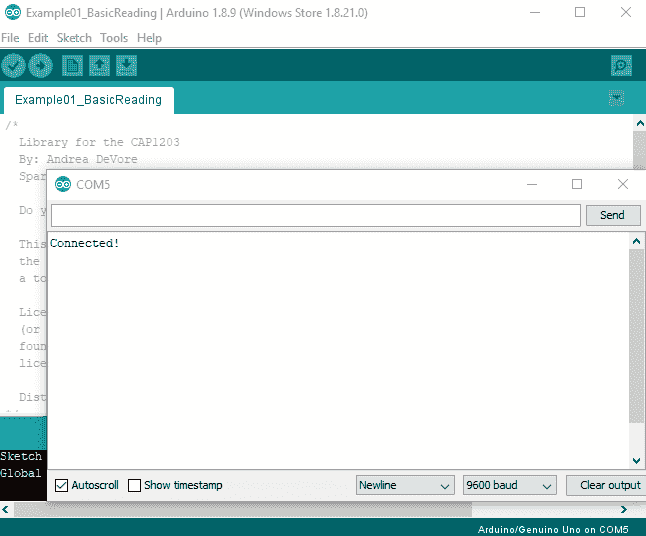](https://cdn.sparkfun.com/assets/learn_tutorials/8/9/8/example1.gif)*Example 1 Output*

### 示例 2:检测任何触摸

*Example 02 _ detectany touch . ino*草图的设置与示例 1 类似，除了当任何板使用`.isTouched()`功能检测到触摸时它会流动。

[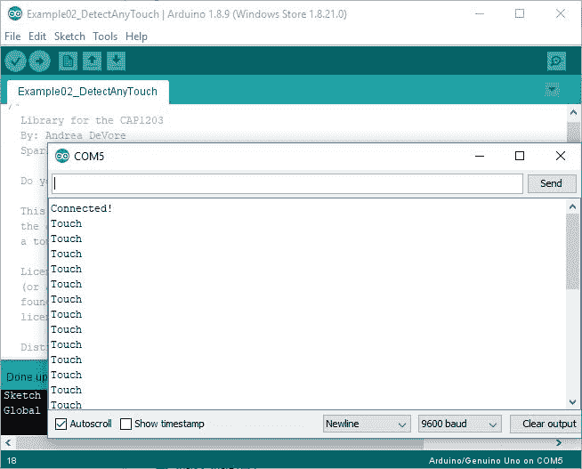](https://cdn.sparkfun.com/assets/learn_tutorials/8/9/8/example2a.JPG)*Example 2 Output*

### 示例 3:检测滑动

*Example 03 _ detect swipe . ino*sketch 的设置与示例 1 类似，除了它在电路板使用`.isRightSwipePulled()`和`.isLeftSwipePulled()`功能检测到滑动时进行流式处理。滑动的方向相对于板上指向正确方向的箭头。请注意，这些函数会占用大部分可用资源。为了实现最佳刷卡识别，我们强烈建议在使用这两个功能时不要实现其他功能。

[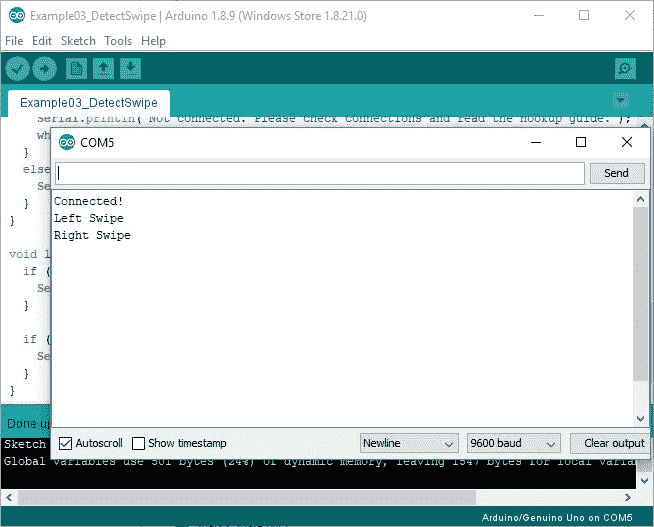](https://cdn.sparkfun.com/assets/learn_tutorials/8/9/8/example3a.JPG)*Example 3 Output*

### 示例 4:电源按钮

*example 04 _ power button . ino*草图允许您启用或禁用特定面板上的电源按钮功能。在检测到指定键盘上的触摸之前，电源按钮需要较长时间的触摸。请注意，当启用电源按钮时，指定的 pad 将仅充当电源按钮。配置和启用电源按钮功能需要一些额外的设置。

在草图中，我们使用`.setPowerButtonPad()`和`.setPowerButtonTime()`功能来设置哪个键盘将作为电源按钮，以及指定的键盘必须指示触摸的时间长度。我们还实现了`.getPowerButtonPad()`和`.getPowerButtonTime()`函数来检查我们用前两个函数设置了哪个面板和时间。然后，我们使用`.setPowerButtonEnabled()`功能启用电源按钮，并使用`.isPowerButtonEnabled()`功能检查电源按钮是否已正确启用。最后，我们使用`.isPowerButtonTouched()`功能检查指定的电源按钮板何时被保持指定的时间。串行端口在记录到电源按钮触摸时会打印`Power Button`。

[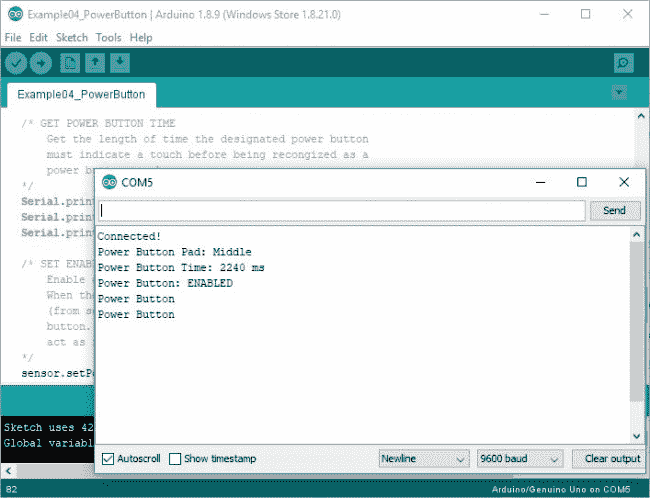](https://cdn.sparkfun.com/assets/learn_tutorials/8/9/8/example4a.JPG)*Example 4 Output*

### 示例 5:检测当前触摸

*示例 05_DetectCurrentTouch.ino* 草图使用与示例 1 相同的功能和设置。然而，示例 5 仅通知您当前的触摸，而不是示例 1 中的恒定触摸数据流。为此，我们在每个条件语句中添加了一个 while 循环。比如:`while (sensor.isLeftTouched() == true)`。

[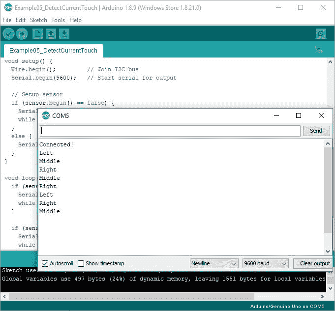](https://cdn.sparkfun.com/assets/learn_tutorials/8/9/8/example5.JPG)*Example 5 Output*

### 示例 6:禁用中断

*example 06 _ disable interrupt . ino*草图允许你编程调整中断设置。禁用时，绿色中断 led 将不会在触摸焊盘时亮起。我们使用`.setInterruptDisabled()`功能禁用中断，使用`.isInterruptEnabled()`功能检查当前的中断设置。在主循环中，我们像示例 2 一样实现`.isTouched()`功能，以检查我们的电路板是否仍然记录了触摸，即使中断 LED 不再打开。

[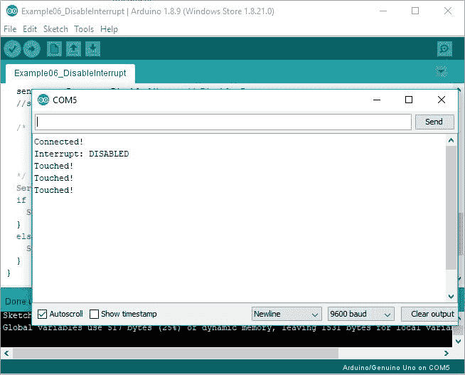](https://cdn.sparkfun.com/assets/learn_tutorials/8/9/8/example6.JPG)*Example 6 Output*

### 示例 7:设置灵敏度

*example 07 _ set sensitivity . ino*草图允许您以编程方式调整电容式触摸板的灵敏度设置。请注意，我们只建议在您使用自己的触摸板时更改灵敏度设置。当前的灵敏度设置已针对板垫上的 SparkFun 电容式触摸滑块进行了校准。在我们的例子中，我们使用`.setSensitivity()`功能来改变灵敏度，使用`.getSensitivity()`来检查我们当前的灵敏度设置。在主循环中，我们像示例 2 一样实现`.isTouched()`功能，以检查传感器何时被新的灵敏度设置所触动。

[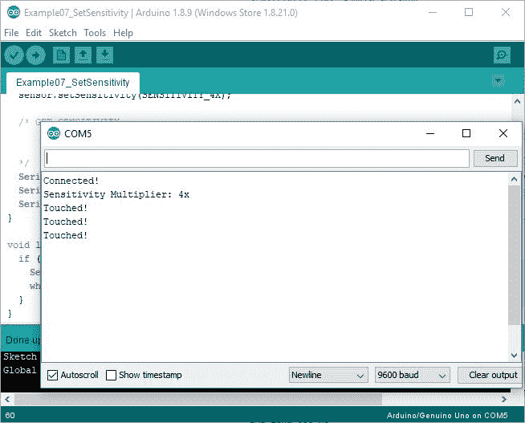](https://cdn.sparkfun.com/assets/learn_tutorials/8/9/8/example7.JPG)*Example 7 Output*

## 解决纷争

不知道你的板是否正常工作？要检查您的电路板是否正确连接，首先连接您的电容式触摸滑块，并将第一个示例草图上传到您的微控制器。然后，当您触摸其中一个触摸板时，如 GIF 中所示，右下角的绿色中断 LED 应在每次感应到触摸时亮起。(注意，如果您尚未上传代码，当您首次连接到微控制器时，中断 LED 将会亮起。上传示例 1 代码后，LED 将关闭。)主板背面的红色电源 LED，您可以在 GIF 中的桌面上看到它的倒影，当主板正确通电时，它也会亮起。

[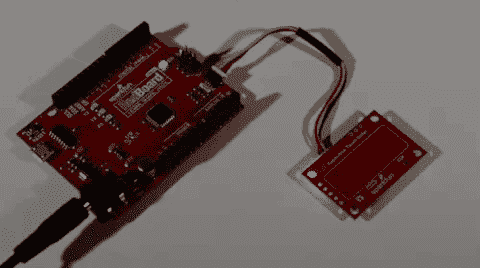](https://cdn.sparkfun.com/assets/learn_tutorials/8/9/8/int-led.gif)
*Demo of Interrupt LED*

## 资源和更进一步

更多关于电容式触摸滑块- CAP1203 (Qwiic)的信息，请点击下面的链接。

*   [示意图(PDF)](https://cdn.sparkfun.com/assets/6/8/c/6/9/SparkFun_Capacitive_Touch_Slider_Qwiic.pdf)
*   [老鹰文件(ZIP)](https://cdn.sparkfun.com/assets/d/4/f/c/a/SparkFun_Capacitive_Touch_Slider_EagleFiles.zip)
*   [数据表(PDF)](https://cdn.sparkfun.com/assets/c/9/f/2/c/CAP1203_Data_Sheet.pdf)
*   [Arduino 库](https://github.com/sparkfun/Qwiic_Capacitive_Touch_Slider_Arduino_Library)
*   [GitHub 产品回购](https://github.com/sparkfun/Qwiic_Capacitive_Touch_Slider_CAP1203)
*   [SFE 产品展示区](https://www.youtube.com/watch?v=m0z9WJECjkU)

你的下一个项目需要一些灵感吗？看看下面的电容触摸教程吧！

 [### 裸露导电音乐画](https://learn.sparkfun.com/tutorials/bare-conductive-musical-painting-) Learn how to make a musical painting using the Bare Conductive Touch Board and Conductive Paint.[Favorited Favorite](# "Add to favorites") 6 [### AT42QT101X 电容式触摸分线架连接指南](https://learn.sparkfun.com/tutorials/at42qt101x-capacitive-touch-breakout-hookup-guide) Learn how to use the simple SparkFun AT42QT1010 and AT42QT1011 capacitive touch breakout boards.[Favorited Favorite](# "Add to favorites") 3 [### Raspberry Pi 独立程序员](https://learn.sparkfun.com/tutorials/raspberry-pi-stand-alone-programmer) This tutorial will show you how to use a headless Raspberry Pi to flash hex files onto AVR microcontrollers as a stand-alone programmer. It also tells the story about production programming challenges, how SparkFun came to this solution, and all the lessons learned along the way.[Favorited Favorite](# "Add to favorites") 12 [### 互动 3D 打印 LED 钻石道具](https://learn.sparkfun.com/tutorials/interactive-3d-printed-led-diamond-prop) In this tutorial, we will learn about how to create an interactive theatrical prop for a performance by 3D printing a translucent diamond prop using a non-addressable RGB LED strip and AT42QT1011 capacitive touch sensing.[Favorited Favorite](# "Add to favorites") 5******************