# 覆盆子 Pi 连接指南的 Qwiic pHAT

> 原文：<https://learn.sparkfun.com/tutorials/qwiic-phat-for-raspberry-pi-hookup-guide>

## 介绍

树莓派的这款 Qwiic pHAT [ [v2.0](https://www.sparkfun.com/products/15945) 和 [v1.0](https://www.sparkfun.com/products/15351) 是基于 [Qwiic Hat](https://www.sparkfun.com/products/14459) 设计的。该板是利用 SparkFun 的 Qwiic 生态系统的最快和最简单的方式，同时还可以使用您已经了解并喜欢的树莓 Pi。这个 Qwiic pHAT 将您的 Raspberry Pi 上的 I ² C 总线(GND、3.3V、SDA 和 SCL)连接到 Qwiic 连接器阵列。由于 Qwiic 系统允许菊花链(只要您的设备在不同的地址)，您可以堆叠任意多的传感器，以创建一个感应电源塔！

[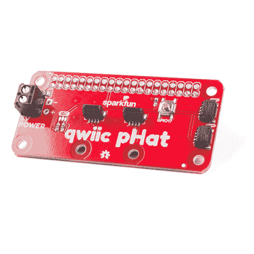](https://www.sparkfun.com/products/15945) 

将**添加到您的[购物车](https://www.sparkfun.com/cart)中！**

### [树莓派的 spark fun Qwiic pHAT v 2.0](https://www.sparkfun.com/products/15945)

[15 available](https://learn.sparkfun.com/static/bubbles/ "15 available") DEV-15945

树莓派的 SparkFun Qwiic pHAT V2 是进入 Qwiic 生态系统和 sti…

$6.952[Favorited Favorite](# "Add to favorites") 32[Wish List](# "Add to wish list")****[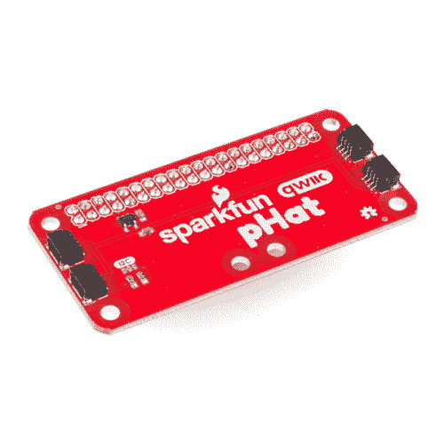](https://www.sparkfun.com/products/retired/15351) 

### [树莓派的 spark fun Qwiic pHAT](https://www.sparkfun.com/products/retired/15351)

[Retired](https://learn.sparkfun.com/static/bubbles/ "Retired") DEV-15351

树莓派的 SparkFun Qwiic pHAT 是进入 Qwiic 生态系统最快最简单的方法，而且…

**Retired**[Favorited Favorite](# "Add to favorites") 12[Wish List](# "Add to wish list")** **[https://www.youtube.com/embed/S28L-f74KBQ/?autohide=1&border=0&wmode=opaque&enablejsapi=1](https://www.youtube.com/embed/S28L-f74KBQ/?autohide=1&border=0&wmode=opaque&enablejsapi=1)

[https://www.youtube.com/embed/Ush3E32F8ew/?autohide=1&border=0&wmode=opaque&enablejsapi=1](https://www.youtube.com/embed/Ush3E32F8ew/?autohide=1&border=0&wmode=opaque&enablejsapi=1)

*Click on the video's full screen button for a closer view.*

### 所需材料

要跟随本教程，您将需要以下材料。你可能不需要所有的东西，这取决于你拥有什么。将它添加到您的购物车，通读指南，并根据需要调整购物车。

#### 单板计算机

你需要安装有 2x20 外螺纹接头的树莓皮。对于那些使用带有 Raspberry Pi 的机箱的用户，您可能需要两排 [1x20 可堆叠接头](https://www.sparkfun.com/products/14311)，以便将引脚伸出机箱。

[](https://www.sparkfun.com/products/16764) 

将**添加到您的[购物车](https://www.sparkfun.com/cart)中！**

### [扩展 GPIO 母头- 2x20 引脚(13.5 毫米/9.80 毫米)](https://www.sparkfun.com/products/16764)

[In stock](https://learn.sparkfun.com/static/bubbles/ "in stock") PRT-16764

这种 2x20 引脚母接头旨在允许您扩展任何具有标准 2x20 GPIO 引脚尺寸的电路板。

$2.25[Favorited Favorite](# "Add to favorites") 7[Wish List](# "Add to wish list")****[](https://www.sparkfun.com/products/14311) 

将**添加到您的[购物车](https://www.sparkfun.com/cart)中！**

### [【ESP32】东西可堆叠头组](https://www.sparkfun.com/products/14311)

[In stock](https://learn.sparkfun.com/static/bubbles/ "in stock") PRT-14311

这些接头是为了与 SparkFun ESP32 的东西连接到 ESP32 屏蔽板。

$1.75[Favorited Favorite](# "Add to favorites") 11[Wish List](# "Add to wish list")****[](https://www.sparkfun.com/products/14643) 

### [树莓派 3 B+](https://www.sparkfun.com/products/14643)

[Out of stock](https://learn.sparkfun.com/static/bubbles/ "out of stock") DEV-14643

Raspberry Pi 3 B+在这里为您提供与以前相同的 Pi，但现在具有千兆位和 PoE 能力的以太网！

35[Favorited Favorite](# "Add to favorites") 75[Wish List](# "Add to wish list")**** ****Pi Zero W 也可以，但是你需要确保[焊接](https://learn.sparkfun.com/tutorials/how-to-solder-through-hole-soldering)一些[插头](https://www.sparkfun.com/products/14275)到上面。

[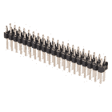](https://www.sparkfun.com/products/14275) 

将**添加到您的[购物车](https://www.sparkfun.com/cart)中！**

### [树莓 Pi GPIO 公头- 2x20](https://www.sparkfun.com/products/14275)

[In stock](https://learn.sparkfun.com/static/bubbles/ "in stock") PRT-14275

这种 2x20 公接头具有与树莓派相同的引脚数量和间距，但最好在与

$1.05[Favorited Favorite](# "Add to favorites") 18[Wish List](# "Add to wish list")****[](https://www.sparkfun.com/products/14277) 

### [树莓派零 W](https://www.sparkfun.com/products/14277)

[Out of stock](https://learn.sparkfun.com/static/bubbles/ "out of stock") DEV-14277

Raspberry Pi Zero W 仍然是你所知道和喜爱的 Pi，但尺寸大大缩小，只有 65 毫米长，30 毫米宽，而且…

44[Favorited Favorite](# "Add to favorites") 111[Wish List](# "Add to wish list")** **或者，您可以将其堆叠在任何采用 40 引脚 Raspberry Pi 接头封装的单板计算机上(如 NVIDIA Jetson Nano)。

[](https://www.sparkfun.com/products/retired/15297) 

### [NVIDIA Jetson Nano 开发者套件](https://www.sparkfun.com/products/retired/15297)

[Retired](https://learn.sparkfun.com/static/bubbles/ "Retired") DEV-15297

NVIDIA Jetson Nano 开发套件以小尺寸、低功耗提供运行现代人工智能工作负载的性能…

13 **Retired**[Favorited Favorite](# "Add to favorites") 24[Wish List](# "Add to wish list")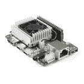 

### 谷歌珊瑚开发委员会

[Retired](https://learn.sparkfun.com/static/bubbles/ "Retired") DEV-15318

谷歌的机器学习开发板。

2 **Retired**

#### Qwiic 板

如果你没有任何 Qwiic 产品与之配合使用，你可能不会购买 Qwiic pHAT，对吗？如果你没有任何 Qwiic 产品，以下可能是一个不错的开始。

[](https://www.sparkfun.com/products/14348) 

### [【spark fun 环保组合 Breakout-CCS 811/BME 280(Qwiic)](https://www.sparkfun.com/products/14348)

[Out of stock](https://learn.sparkfun.com/static/bubbles/ "out of stock") SEN-14348

SparkFun CCS811/BME280 环境组合突破满足您所有的大气质量感测需求

20[Favorited Favorite](# "Add to favorites") 63[Wish List](# "Add to wish list")[](https://www.sparkfun.com/products/14495) 

将**添加到您的[购物车](https://www.sparkfun.com/cart)中！**

### [SparkFun Qwiic 适配器](https://www.sparkfun.com/products/14495)

[In stock](https://learn.sparkfun.com/static/bubbles/ "in stock") DEV-14495

SparkFun Qwiic 适配器提供了将任何旧 I ² C 板改造成支持 Qwiic 的板的完美方法。

$1.601[Favorited Favorite](# "Add to favorites") 53[Wish List](# "Add to wish list")****[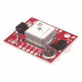](https://www.sparkfun.com/products/14414) 

将**添加到您的[购物车](https://www.sparkfun.com/cart)中！**

### [【spark fun GPS Breakout-xa 1110(Qwiic)](https://www.sparkfun.com/products/14414)

[In stock](https://learn.sparkfun.com/static/bubbles/ "in stock") GPS-14414

SparkFun XA1110 GPS Breakout 是一款 I2C 支持的小型模块，由于采用了 Qwiic Connect 系统，因此易于连接。电子邮件…

$34.955[Favorited Favorite](# "Add to favorites") 25[Wish List](# "Add to wish list")****[](https://www.sparkfun.com/products/14347) 

将**添加到您的[购物车](https://www.sparkfun.com/cart)中！**

### [【spark fun 光谱传感器分线点- AS7262 可见光(Qwiic)](https://www.sparkfun.com/products/14347)

[26 available](https://learn.sparkfun.com/static/bubbles/ "26 available") SEN-14347

SparkFun AS7262 可见光谱传感器突破将光谱学带到您的手掌上，比以往任何时候都更容易…

$27.952[Favorited Favorite](# "Add to favorites") 27[Wish List](# "Add to wish list")****** ******最后，您将需要我们方便的 Qwiic 电缆来轻松地将传感器连接到 Qwiic pHAT。以下是几个选项。

[](https://www.sparkfun.com/products/14427) 

将**添加到您的[购物车](https://www.sparkfun.com/cart)中！**

### [Qwiic 线缆- 100mm](https://www.sparkfun.com/products/14427)

[In stock](https://learn.sparkfun.com/static/bubbles/ "in stock") PRT-14427

这是一条 100 毫米长的 4 芯电缆，带有 1 毫米 JST 端接。它旨在将支持 Qwiic 的组件连接在一起…

$1.50[Favorited Favorite](# "Add to favorites") 32[Wish List](# "Add to wish list")****[](https://www.sparkfun.com/products/14429) 

将**添加到您的[购物车](https://www.sparkfun.com/cart)中！**

### [Qwiic 线缆- 500mm](https://www.sparkfun.com/products/14429)

[In stock](https://learn.sparkfun.com/static/bubbles/ "in stock") PRT-14429

这是一根 500mm 长的 4 芯电缆，带有 1mm JST 端接。它旨在将支持 Qwiic 的组件连接在一起…

$1.951[Favorited Favorite](# "Add to favorites") 25[Wish List](# "Add to wish list")****[](https://www.sparkfun.com/products/14426) 

将**添加到您的[购物车](https://www.sparkfun.com/cart)中！**

### [Qwiic 线缆- 50mm](https://www.sparkfun.com/products/14426)

[In stock](https://learn.sparkfun.com/static/bubbles/ "in stock") PRT-14426

这是一根 50 毫米长的 4 芯电缆，带有 1 毫米 JST 端接。它旨在将支持 Qwiic 的组件连接在一起…

$0.95[Favorited Favorite](# "Add to favorites") 29[Wish List](# "Add to wish list")****[](https://www.sparkfun.com/products/14428) 

### [Qwiic 线缆- 200mm](https://www.sparkfun.com/products/14428)

[Out of stock](https://learn.sparkfun.com/static/bubbles/ "out of stock") PRT-14428

这是一根 200 毫米长的 4 芯电缆，带有 1 毫米 JST 端接。它旨在将支持 Qwiic 的组件连接在一起…

[Favorited Favorite](# "Add to favorites") 21[Wish List](# "Add to wish list")****** ******### 必需的设置工具

作为台式机，这些设备是必需的:

*   USB 鼠标
*   USB 键盘
*   HDMI 监视器/电视/ [适配 VGA](https://www.sparkfun.com/products/12613)
*   [5V 电源](https://www.sparkfun.com/products/13831)

### 推荐阅读

如果你不熟悉 Qwiic 系统，我们推荐你在这里阅读[以获得一个概述](https://www.sparkfun.com/qwiic)。

| [](https://www.sparkfun.com/qwiic) |
| *[Qwiic 连接系统](https://www.sparkfun.com/qwiic)* |

如果你不熟悉下面的教程，我们也建议你看一看。

[](https://learn.sparkfun.com/tutorials/i2c) [### I2C](https://learn.sparkfun.com/tutorials/i2c) An introduction to I2C, one of the main embedded communications protocols in use today.[Favorited Favorite](# "Add to favorites") 128[](https://learn.sparkfun.com/tutorials/terminal-basics) [### 串行终端基础知识](https://learn.sparkfun.com/tutorials/terminal-basics) This tutorial will show you how to communicate with your serial devices using a variety of terminal emulator applications.[Favorited Favorite](# "Add to favorites") 46

## 硬件概述

在野外有两个 pHAT 版本！总的来说，它们的功能是一样的，可以将你的 I2C 设备连接到你的单板计算机上。然而，这两种板之间有一些小的不同。单击下面的图片之一，了解您各自的 Qwiic pHAT 的硬件。

| [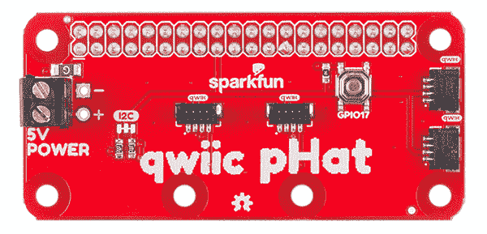](https://learn.sparkfun.com/tutorials/qwiic-phat-for-raspberry-pi-hookup-guide#v20) | [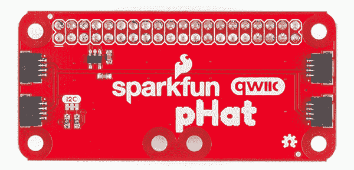](https://learn.sparkfun.com/tutorials/qwiic-phat-for-raspberry-pi-hookup-guide#v10) |
| *Qwiic pHAT v2.0* | *Qwiic pHAT v1.0* |

### [Qwiic pHAT v2.0](#v20)

#### I ² C 引脚

Qwiic pHAT 有 4 个 Qwiic 连接端口，都在同一 I ² C 总线上。中间有两个垂直 Qwiic 连接器，右侧有两个水平连接器。

[](https://cdn.sparkfun.com/assets/learn_tutorials/9/0/6/15945-SparkFun_Qwiic_pHAT_V3.0_for_Raspberry_Pi-04_Cropped.jpg)

#### 5V 电源

如果你需要为一个 5V 的设备供电，我们已经在侧面用螺丝端子断开了树莓 Pi 的 5V 和 GND 引脚。根据你的项目，你也可以[焊接到 PTH 焊盘](https://learn.sparkfun.com/tutorials/how-to-solder-through-hole-soldering)。

[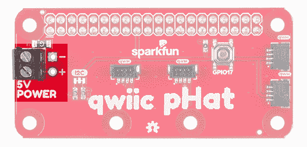](https://cdn.sparkfun.com/assets/learn_tutorials/9/0/6/SparkFun_Qwiic_pHAT_V3.0_Raspberry_Pi_5V.jpg)

#### 通用按钮

板上有一个连接到 GPIO17 的通用按钮。你可以随意使用这个按钮，但是我们发现用 Python 脚本关闭或重启 Raspberry Pi [非常有用。](https://learn.sparkfun.com/tutorials/raspberry-pi-safe-reboot-and-shutdown-button)

[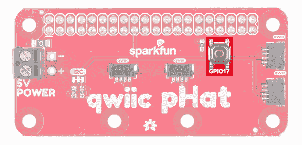](https://cdn.sparkfun.com/assets/learn_tutorials/9/0/6/SparkFun_Qwiic_pHAT_V3.0_Raspberry_Pi_General_Purpose_Button.jpg)

#### 针织套衫

板上有内置上拉电阻。如有必要，可以根据 I ² C 总线上连接的板卡数量[切迹](https://learn.sparkfun.com/tutorials/how-to-work-with-jumper-pads-and-pcb-traces/all)禁用。

[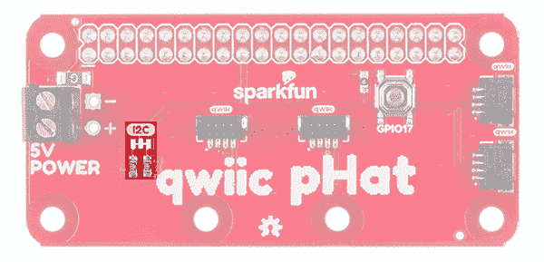](https://cdn.sparkfun.com/assets/learn_tutorials/9/0/6/SparkFun_Qwiic_pHAT_V3.0_Raspberry_Pi_Pull-Up_Resistor_Jumpers.jpg)

#### 电路板尺寸

该板约为 65.00 毫米 x 30.50mm 毫米。板上有六个安装孔。两对安装孔经过优化，可轻松安装配有标准 1.0 英寸 x1.0 英寸主板的 Qwiic 设备。

[](https://cdn.sparkfun.com/assets/6/1/a/7/a/SparkFun_Qwiic_pHAT_v20_Board_Dimensions.png)

### [Qwiic pHAT v1.0](#v10)

#### I ² C 引脚

Qwiic pHAT 有 4 个 Qwiic 连接端口，都在同一 I ² C 总线上。包括一个 **3.3V** 调节器，用于调节任何连接的 Qwiic 板的电压。

[](https://cdn.sparkfun.com/assets/learn_tutorials/9/0/6/15351-SparkFun_Qwiic_pHAT_for_Raspberry_Pi-04.jpg)

#### 针织套衫

板上有内置上拉电阻。如有必要，可以根据 I ² C 总线上连接的板卡数量[切迹](https://learn.sparkfun.com/tutorials/how-to-work-with-jumper-pads-and-pcb-traces/all)禁用。

[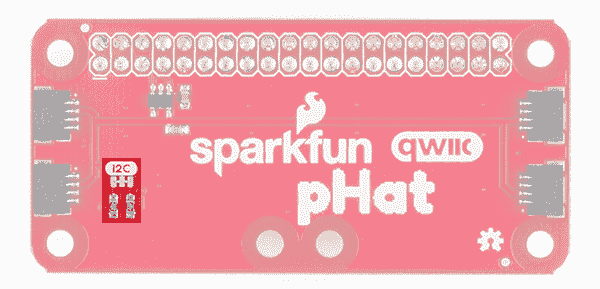](https://cdn.sparkfun.com/assets/learn_tutorials/9/0/6/Qwiic_pHAT_for_Raspberry_Pi_I2C_Pullup_Resistors.jpg)

#### 电路板尺寸

该板约为 65.00 毫米 x 30.50mm 毫米。板上有六个安装孔。

[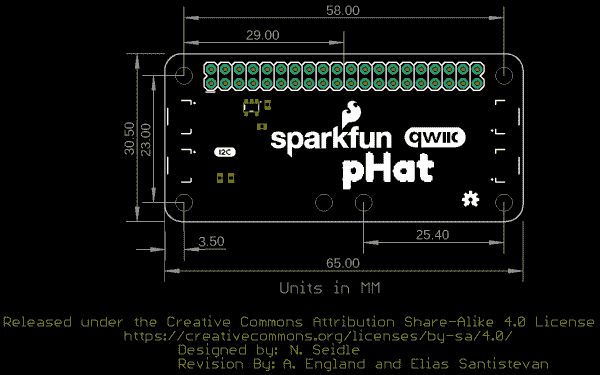](https://cdn.sparkfun.com/assets/f/1/3/d/c/SparkFun_Qwiic_pHAT_v10_Board_Dimensions.png)

## 硬件装配

要开始使用 Qwiic pHAT，只需将它插入树莓 Pi 上的标题，字母面向您。我们将使用下图中的 Qwiic pHAT v1.0 来连接 Qwiic 设备。

[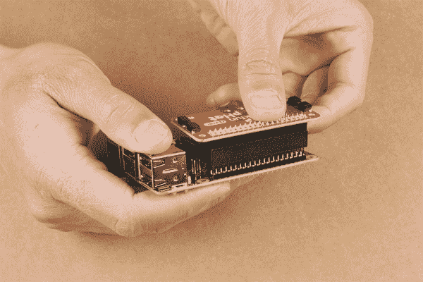](https://cdn.sparkfun.com/assets/learn_tutorials/9/0/6/Qwiic_pHat_Stacking_Raspberry_Pi_.jpg)

插入 pHAT 后，您就可以开始插入任何支持 Qwiic 的传感器了。

[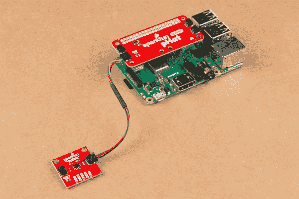](https://cdn.sparkfun.com/assets/learn_tutorials/9/0/6/Qwiic_pHat_Raspberry_Pi_Sensor.jpg)**Note:** The Qwiic pHat is also compatible with single board computers (like the [NVIDIA Jetson Nano](https://www.sparkfun.com/products/15297) or the [Google Coral](https://www.sparkfun.com/products/15318)) that utilize the 40-pin Raspberry Pi header footprint. Below are images of v2.0 and v1.0 stacked on the different single board computers.

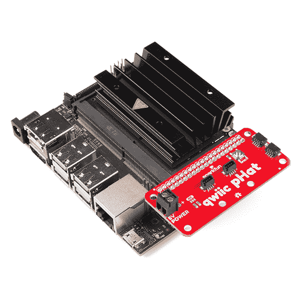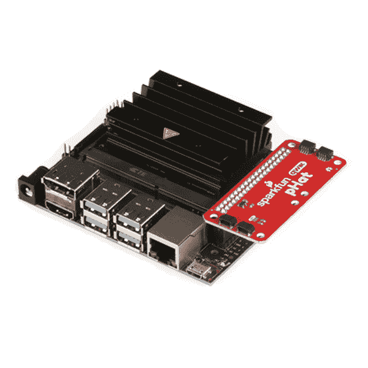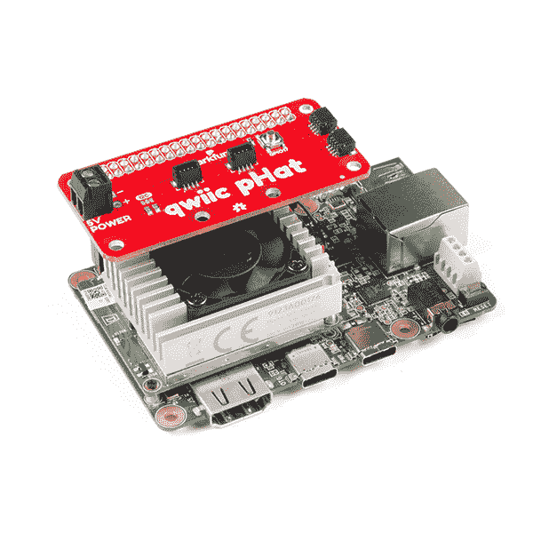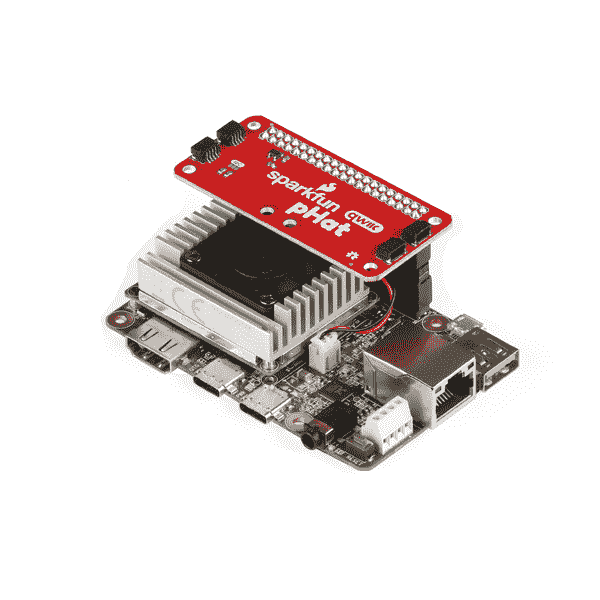[](#carousel-63c18d2ce7024)[](#carousel-63c18d2ce7024)

### 支座和安装孔

根据您的项目，您可以使用[支架](https://www.sparkfun.com/categories/257)在安装孔上安装支持 qwiic 的电路板。下面是两张图片，显示了安装在每个版本的 Qwiic pHAT 上的 Qwiic 设备。

| [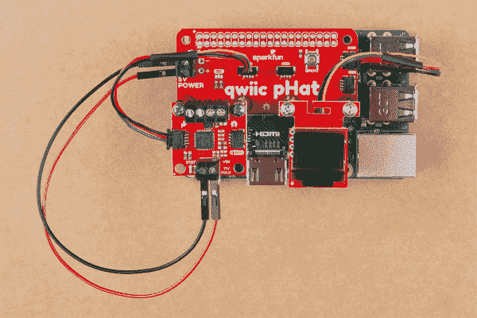](https://cdn.sparkfun.com/assets/learn_tutorials/9/0/6/Qwiic_Devices_pHAT_V2_0_Mounted.jpg) | [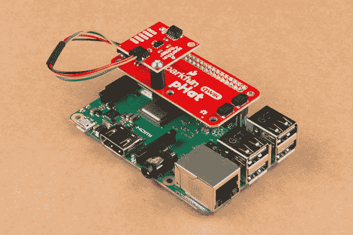](https://cdn.sparkfun.com/assets/learn_tutorials/9/0/6/Qwiic_pHat_Standoffs_Raspberry_Pi_Sensor.jpg) |
| *安装在 v2.0 上的 Qwiic 设备* | *安装在 1.0 版*上的 Qwiic 设备 |

### 可堆叠的集管

当将树莓 Pi 和 pHAT 放入外壳(如 Pi 罐)时，我们注意到 pHat 没有完全插入 Pi 的接头引脚。根据您的机箱，您将需要一对额外的[可堆叠接头](https://www.sparkfun.com/products/14311)来实现安全连接。否则，如果您需要在机箱中使用电路板，原装 [Qwiic HAT](https://www.sparkfun.com/products/14459) 会更好。

[](https://cdn.sparkfun.com/assets/learn_tutorials/9/0/6/Qwiic_pHAT_V2_0_Stackable_Header_Extension.jpg)

## 获得操作系统

我们建议查看 Raspberry Pi 4 连接指南，以[安装操作系统](https://learn.sparkfun.com/tutorials/raspberry-pi-4-kit-hookup-guide#getting-an-os)并将图像刷新到您的 microSD 卡，以获得详细说明。

[](https://learn.sparkfun.com/tutorials/raspberry-pi-4-kit-hookup-guide) [### Raspberry Pi 4 套件连接指南

#### 2020 年 3 月 14 日](https://learn.sparkfun.com/tutorials/raspberry-pi-4-kit-hookup-guide) Guide for hooking up your Raspberry Pi 4 Model B basic, desktop, or hardware starter kit together.[Favorited Favorite](# "Add to favorites") 2

如果你从一张空白的 microSD 卡开始，你需要安装 Raspbian。如果您已经有了一个可以工作的 Raspbian 系统，请跳到下一节。请耐心等待——根据 microSD 卡的速度，每个步骤都可能需要一段时间。

1.  **下载映像** —下载您最喜欢的 Linux 发行版。对于初学者，我们建议获取 [NOOBS](https://www.raspberrypi.org/downloads/noobs/) 图像。
2.  **闪烁图像** —按照 [Raspberry Pi 4 套件连接指南的说明闪烁您的 microSD 卡](https://learn.sparkfun.com/tutorials/raspberry-pi-4-kit-hookup-guide/getting-an-os)。你也可以按照官方的树莓派[安装说明](https://www.raspberrypi.org/documentation/installation/)进行操作。

## 配置 Pi

默认情况下，外设不开启。对于那些使用支持 Qwiic 的设备的用户，您需要启用 I2C 端口。有两种方法可以调整设置。这在我们的[树莓派 I2C 教程](https://learn.sparkfun.com/tutorials/raspberry-pi-spi-and-i2c-tutorial)中有所概述。

[](https://learn.sparkfun.com/tutorials/raspberry-pi-spi-and-i2c-tutorial) [### 树莓派 SPI 和 I2C 教程

#### 2015 . 10 . 29](https://learn.sparkfun.com/tutorials/raspberry-pi-spi-and-i2c-tutorial) Learn how to use serial I2C and SPI buses on your Raspberry Pi using the wiringPi I/O library for C/C++ and spidev/smbus for Python.[Favorited Favorite](# "Add to favorites") 24

我们已经包含了教程中的以下说明。要启用它，请按照以下步骤操作。

#### 通过桌面 GUI 进行 Raspberry Pi 配置

 您可以通过进入 **Pi 开始菜单** > **偏好设置** > **树莓 Pi 配置**来使用桌面 GUI。

[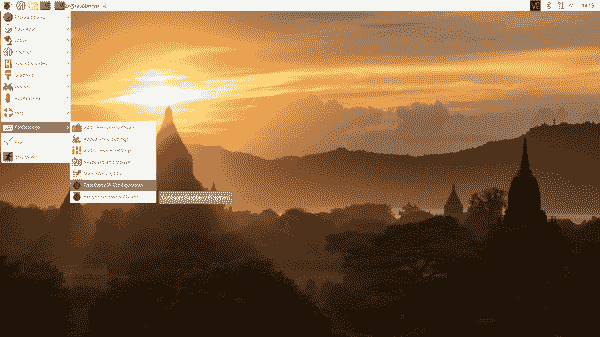](https://cdn.sparkfun.com/assets/learn_tutorials/4/4/9/Raspberry-Pi-Configuration-User-Settings-GUI.png)*Click on image for a closer view.*

将弹出一个带有不同选项卡的窗口来调整设置。我们感兴趣的是**界面**标签。点击选项卡，为 **I2C** 选择**使能**。此时，您可以根据项目需要启用其他接口。点击**确定**按钮，同样如此。

[](https://cdn.sparkfun.com/assets/learn_tutorials/4/4/9/Raspberry-Pi-Configuration-Enable-Interfaces.png)*Click on image for a closer view.*

我们建议重新启动您的 Pi 以确保更改生效。点击 **Pi 开始菜单** > **首选项** > **关机**。因为我们只需要重启，所以点击**重启**按钮。

|  | [](https://cdn.sparkfun.com/assets/learn_tutorials/4/4/9/Raspberry-Pi-Menu-Shutdown.png) |
| *关机* | *关机、重启、注销* |

*Click on images for a closer view.*

#### raspi-配置工具通过终端

同样，我们可以使用`raspi-config`来启用它。

1.  运行`sudo raspi-config`。
2.  使用向下箭头选择`5 Interfacing Options`
3.  向下箭头指向`P5 I2C`。
4.  当它要求您启用 I2C 时，选择`yes`
5.  如果询问是否自动加载内核模块，也选择`yes`。
6.  使用向右箭头选择`<Finish>`按钮。
7.  当它要求重启时，选择`yes`。

[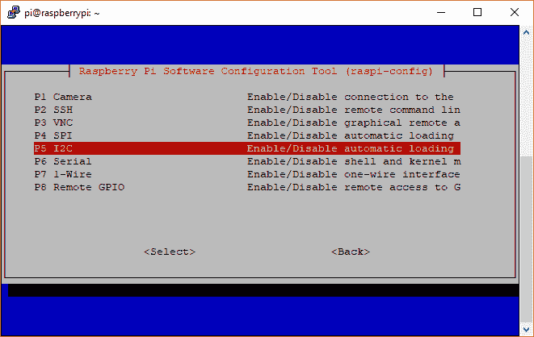](https://cdn.sparkfun.com/assets/learn_tutorials/4/4/9/i2c-menu2.png)*Raspi-config for I2C*

系统将重新启动。当它重新启动时，登录并输入以下命令

```
language:bash
ls /dev/*i2c* 
```

Pi 应该响应

```
language:bash
/dev/i2c-1 
```

它表示用户模式的 I2C 界面。

## 扫描 I2C 设备

最好的起点是扫描总线上的 I ² C 设备。

### 配置

与 SPI 外设一样，I2C 默认不开启。同样，我们可以使用`raspi-config`来启用它。

1.  运行`sudo raspi-config`。
2.  使用向下箭头选择`5 Interfacing Options`
3.  向下箭头指向`P5 I2C`。
4.  当它要求您启用 I2C 时，选择`yes`
5.  选择`OK`，然后选择`Finish`

返回终端后，输入以下命令:

```
language:bash
ls /dev/*i2c* 
```

Pi 应做出如下响应:

```
language:bash
/dev/i2c-1 
```

它表示用户模式的 I2C 界面。

### 公用事业

有一组命令行实用程序可以帮助 I ² C 接口工作。你可以通过 apt 包管理器得到它们。输入以下命令。

```
language:bash
sudo apt-get install -y i2c-tools 
```

特别是，`i2cdetect`程序将探测总线上的所有地址，并报告是否存在任何设备。在命令行中输入以下命令。`-y`标志将禁用交互模式，这样您就不必等待确认。`1`表示我们正在扫描 I ² C 总线 1 上的 I ² C 设备(如 i2c-1)。

```
language:bash
i2cdetect -y 1 
```

您将从您的 Raspberry Pi 获得类似于下面的输出。

```
language:bash
pi@raspberrypi:~/$ i2cdetect -y 1
     0  1  2  3  4  5  6  7  8  9  a  b  c  d  e  f
00:          -- -- -- -- -- -- -- -- -- -- -- -- --
10: -- -- -- -- -- -- -- -- -- -- -- -- -- -- -- --
20: -- -- -- -- -- -- -- -- -- -- -- -- -- -- -- --
30: -- -- -- -- -- -- -- -- -- -- -- -- -- -- -- --
40: -- -- -- -- -- -- -- -- -- -- -- -- -- -- -- --
50: -- -- -- -- -- -- -- -- -- -- -- -- -- -- -- --
60: 60 -- -- -- -- -- -- -- -- -- -- -- -- -- -- --
70: -- -- -- -- -- -- -- -- 
```

该图表明在地址 **0x60** 有一个外设。根据 I ² C 总线上连接的设备，您的地址可能会有所不同。对于高级用户，您可以尝试使用`i2cget`、`i2cset`和`i2cdump`命令来读写其寄存器。

## 资源和更进一步

有关更多信息，请查看以下资源:

*   Qwiic pHAT V2.0
    *   [示意图(PDF)](https://cdn.sparkfun.com/assets/a/4/b/9/1/Qwiic_pHat_for_Raspberry_Pi.pdf)
    *   [老鹰文件(ZIP)](https://cdn.sparkfun.com/assets/6/5/2/3/6/Qwiic_pHat_for_Raspberry_Pi.zip)
    *   [板尺寸(PNG)](https://cdn.sparkfun.com/assets/6/1/a/7/a/SparkFun_Qwiic_pHAT_v20_Board_Dimensions.png)
    *   [GitHub 回购](https://github.com/sparkfun/Qwiic_Hat_for_Raspberry_Pi/tree/v30)
    *   [SFE 产品展示区](https://youtu.be/S28L-f74KBQ)
*   Qwiic pHAT V1.0 版
    *   [示意图(PDF)](https://cdn.sparkfun.com/assets/9/c/4/8/6/Qwiic_pHat_for_Raspberry_Pi_v20.pdf)
    *   [老鹰文件(ZIP)](https://cdn.sparkfun.com/assets/4/0/8/4/1/Qwiic_pHat_for_Raspberry_Pi_v20.zip)
    *   [板尺寸(PNG)](https://cdn.sparkfun.com/assets/f/1/3/d/c/SparkFun_Qwiic_pHAT_v10_Board_Dimensions.png)
    *   [GitHub 回购](https://github.com/sparkfun/Qwiic_Hat_for_Raspberry_Pi/tree/v20)
    *   [SFE 产品展示区](https://youtu.be/Ush3E32F8ew)

既然您已经准备好了 Qwiic pHAT，是时候看看一些支持 Qwiic 的产品了。

[](https://www.sparkfun.com/products/16397) 

将**添加到您的[购物车](https://www.sparkfun.com/cart)中！**

### [kickfunk 16x2 心脏液晶屏- RGB 文本(qwiic)T3](https://www.sparkfun.com/products/16397)

[In stock](https://learn.sparkfun.com/static/bubbles/ "in stock") LCD-16397

SparkFun Qwiic SerLCD 是一款支持串行的 LCD，为在……上添加 16x2 RGB 提供了一个简单且经济高效的解决方案

$21.505[Favorited Favorite](# "Add to favorites") 12[Wish List](# "Add to wish list")****[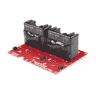](https://www.sparkfun.com/products/16810) 

将**添加到您的[购物车](https://www.sparkfun.com/cart)中！**

### [SparkFun Qwiic 双固态继电器](https://www.sparkfun.com/products/16810)

[In stock](https://learn.sparkfun.com/static/bubbles/ "in stock") COM-16810

SparkFun Qwiic 双固态继电器是一个功率传输板，允许用户从一个低功率开关两个交流负载…

$149.95 $94.951[Favorited Favorite](# "Add to favorites") 10[Wish List](# "Add to wish list")****[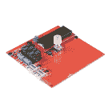](https://www.sparkfun.com/products/18007) 

### [SparkFun 烤面包机烤箱回流控制板](https://www.sparkfun.com/products/18007)

[Out of stock](https://learn.sparkfun.com/static/bubbles/ "out of stock") WIG-18007

专为 SparkFun 的[按菜单点菜](https://alc.sparkfun.com/)定制电路板设计器设计，烤面包机烤箱回流…

[Favorited Favorite](# "Add to favorites") 4[Wish List](# "Add to wish list")[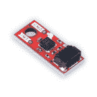](https://www.sparkfun.com/products/19921) 

将**添加到您的[购物车](https://www.sparkfun.com/cart)中！**

### [【spark fun 微型磁力仪- MMC5983MA (Qwiic)](https://www.sparkfun.com/products/19921)

[In stock](https://learn.sparkfun.com/static/bubbles/ "in stock") SEN-19921

SparkFun Qwiic Micro MMC5983MA 磁力计是一种微型 0.75 英寸乘 0.30 英寸传感器，采用高灵敏度的温度传感器

$15.95[Favorited Favorite](# "Add to favorites") 2[Wish List](# "Add to wish list")****** ******### 但是我已经有传感器了！

如果你已经有一把 SparkFun 传感器和零件？多年来，SparkFun 一直在我们所有的 I2C 板上安装我们的标准 GND/VCC/SDA/SCL 引脚排列。这使得它可以连接一个 Qwiic 适配器，将您的 SparkFun I ² C 传感器或执行器安装到 Qwiic 系统上。

以下是具有标准 I ² C 引脚排列并将与 [Qwiic 适配板](https://www.sparkfun.com/products/14495)配合使用的主板列表:

*   [9DoF Stick IMU - LSM9DS1](https://www.sparkfun.com/products/13944)
*   [9 自由度 IMU - MPU-9250](https://www.sparkfun.com/products/13762)
*   [6 自由度 IMU - LSM303C](https://www.sparkfun.com/products/13303)
*   [6 自由度 IMU - LSM6DS3](https://www.sparkfun.com/products/13339)
*   [三轴加速度计- LIS3DH](https://www.sparkfun.com/products/13963)
*   [三轴磁力仪- MAG3110](https://www.sparkfun.com/products/12670)
*   [三轴磁力仪- MLX90393](https://www.sparkfun.com/products/14160)
*   [罗盘模块- HMC6343](https://www.sparkfun.com/products/12916)
*   [大气传感器- BME280](https://www.sparkfun.com/products/13676)
*   [气压传感器- MS5803-14BA](https://www.sparkfun.com/products/12909)
*   [气压传感器- T5403](https://www.sparkfun.com/products/12039)
*   [湿度和温度传感器- Si7021](https://www.sparkfun.com/products/13763)
*   [数字温度传感器- TMP102](https://www.sparkfun.com/products/13314)
*   [粒子传感器- MAX30105](https://www.sparkfun.com/products/14045)
*   [空气质量传感器- CCS811](https://www.sparkfun.com/products/14181)
*   [ToF 测距仪- VL6180](https://www.sparkfun.com/products/12785)
*   [触觉电机驱动器- DRV2605L](https://www.sparkfun.com/products/14031)
*   [微型有机发光二极管显示器](https://www.sparkfun.com/products/13003)
*   [RGB 和手势传感器- APDS-9960](https://www.sparkfun.com/products/12787)
*   [RGB 光传感器- ISL29125](https://www.sparkfun.com/products/12829)
*   [LED 驱动器- LP55231](https://www.sparkfun.com/products/14031)
*   [DAC 分线点- MCP4725](https://www.sparkfun.com/products/12918)
*   [16 输出 I/O 扩展器- SX1509](https://www.sparkfun.com/products/13601)
*   [电池保姆- BQ24075](https://www.sparkfun.com/products/13777)

寻找灵感？查看相关教程，在 Raspberry Pi 上使用 I ² C 设备:

[](https://learn.sparkfun.com/tutorials/raspberry-pi-spi-and-i2c-tutorial) [### 树莓派 SPI 和 I2C 教程

#### 2015 . 10 . 29](https://learn.sparkfun.com/tutorials/raspberry-pi-spi-and-i2c-tutorial) Learn how to use serial I2C and SPI buses on your Raspberry Pi using the wiringPi I/O library for C/C++ and spidev/smbus for Python.[Favorited Favorite](# "Add to favorites") 24

或者尝试利用 Qwiic pHAT v2.0 上的通用按钮！

[](https://learn.sparkfun.com/tutorials/raspberry-pi-safe-reboot-and-shutdown-button) [### Raspberry Pi 安全重启和关机按钮

#### 2020 年 4 月 20 日](https://learn.sparkfun.com/tutorials/raspberry-pi-safe-reboot-and-shutdown-button) Safely reboot or shutdown your Raspberry Pi to avoid corrupting the microSD card using the built-in general purpose button on the Qwiic pHAT v2.0 5**************************