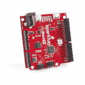
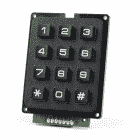

# 键盘快捷键，Qwiic 小键盘

> 原文：<https://learn.sparkfun.com/tutorials/keyboard-shortcut-qwiic-keypad>

## 介绍

你可能没有意识到，但是你可能经常使用[键盘快捷键](https://en.wikipedia.org/wiki/Keyboard_shortcut)来完成普通的任务，否则，这些任务在以前是极其单调的。这些快捷方式的一个完美的例子是[剪切、复制和粘贴](https://en.wikipedia.org/wiki/Cut,_copy,_and_paste)命令，它几乎普遍用于当今的每一个计算机应用程序。最初，人们习惯于手工剪切(用特殊的剪刀)和粘贴这些变化。

[https://www.youtube.com/embed/QPRrk0tHk08/?autohide=1&border=0&wmode=opaque&enablejsapi=1](https://www.youtube.com/embed/QPRrk0tHk08/?autohide=1&border=0&wmode=opaque&enablejsapi=1)

在本指南中，我们将介绍如何利用 [RedBoard Turbo](https://www.sparkfun.com/products/14812) 来模拟一个 HID 键盘，该键盘响应来自 [Qwiic 小键盘](https://www.sparkfun.com/products/15290)的输入，以创建您自己的自定义快捷键。这非常适合游戏热键、需要两个以上按钮组合的键盘快捷键，或者命令行/数据/文本输入。

[](https://cdn.sparkfun.com/assets/learn_tutorials/8/8/3/Stickers.jpg)

这将类似于 [Enginursday 的博文:按下我们的按钮](https://www.sparkfun.com/news/2412)，但是没有复杂的焊接。虽然没必要，但是回顾一下博文还是不错的。

Please be aware that the example code below is written to run explicitly on **Windows OS**. For Mac OS, you will need to modify the code for the appropriate Mac OS keycodes.

### 所需材料

对于这个项目，您将需要以下产品。你可能已经有一些这样的物品了，所以可以根据你的需要随意修改你的购物车。

[](https://www.sparkfun.com/products/14427) 

将**添加到您的[购物车](https://www.sparkfun.com/cart)中！**

 **### [Qwiic 线缆- 100mm](https://www.sparkfun.com/products/14427)

[In stock](https://learn.sparkfun.com/static/bubbles/ "in stock") PRT-14427

这是一条 100 毫米长的 4 芯电缆，带有 1 毫米 JST 端接。它旨在将支持 Qwiic 的组件连接在一起…

$1.50[Favorited Favorite](# "Add to favorites") 32[Wish List](# "Add to wish list")****[](https://www.sparkfun.com/products/14812) 

将**添加到您的[购物车](https://www.sparkfun.com/cart)中！**

 **### [spark fun red Board Turbo-samd 21 开发板](https://www.sparkfun.com/products/14812)

[In stock](https://learn.sparkfun.com/static/bubbles/ "in stock") DEV-14812

如果你准备从旧的 8 位/16MHz 微控制器升级你的 Arduino 游戏，SparkFun RedBoard Turbo 是一种形式…

$26.958[Favorited Favorite](# "Add to favorites") 27[Wish List](# "Add to wish list")****[](https://www.sparkfun.com/products/15290) 

将**添加到您的[购物车](https://www.sparkfun.com/cart)中！**

 **### [SparkFun Qwiic 键盘- 12 键](https://www.sparkfun.com/products/15290)

[In stock](https://learn.sparkfun.com/static/bubbles/ "in stock") COM-15290

SparkFun Qwiic 键盘完全组装，使添加 12 按钮键盘的开发过程变得简单。

$11.509[Favorited Favorite](# "Add to favorites") 45[Wish List](# "Add to wish list")****** ******### 推荐阅读

如果您还没有浏览这些器件的连接指南，我们强烈建议您从这里开始，了解每个板的基本功能:

[](https://learn.sparkfun.com/tutorials/qwiic-keypad-hookup-guide) [### Qwiic 键盘连接指南](https://learn.sparkfun.com/tutorials/qwiic-keypad-hookup-guide) If you are tired of taking up GPIO pins, wiring a bunch of pull up resistors, and using firmware that scans the keys taking up valuable processing time... check out the new Qwiic Keypad.[Favorited Favorite](# "Add to favorites") 0[](https://learn.sparkfun.com/tutorials/redboard-turbo-hookup-guide) [### RedBoard Turbo 连接指南](https://learn.sparkfun.com/tutorials/redboard-turbo-hookup-guide) An introduction to the RedBoard Turbo. Level up your Arduino-skills with the powerful SAMD21 ARM Cortex M0+ processor 2[](https://www.sparkfun.com/qwiic)

本项目利用 [Qwiic 连接系统](https://www.sparkfun.com/qwiic)。我们建议在使用之前熟悉一下**逻辑电平**和 **I ² C** 教程(如上)。点击上面的横幅，了解有关我们的 [Qwiic 产品](https://www.sparkfun.com/categories/399)的更多信息。

[https://www.youtube.com/embed/x0RDEHqFIF8/?autohide=1&border=0&wmode=opaque&enablejsapi=1](https://www.youtube.com/embed/x0RDEHqFIF8/?autohide=1&border=0&wmode=opaque&enablejsapi=1)

为了更好地理解示例代码是如何工作的，请查看您感兴趣的平台的以下参考资料:

*   CircuitPython 参考

    *   [电路 Python I ² C](https://learn.adafruit.com/circuitpython-essentials/circuitpython-i2c)
    *   [电路 Python HID 键盘/鼠标](https://learn.adafruit.com/circuitpython-essentials/circuitpython-hid-keyboard-and-mouse)
*   Arduino 参考

    *   [NicoHood HID-Project Wiki 页面](https://github.com/NicoHood/HID/wiki)
    *   [Arduino HID-项目库 GitHub Repository](https://github.com/NicoHood/HID)
    *   [Arduino 电线库参考页面](https://www.arduino.cc/en/reference/wire)
    *   [Arduino 电线库(深入)参考](https://playground.arduino.cc/Main/WireLibraryDetailedReference)

## 项目概述

在这个示例项目中，我们将关注对读者最有用的三种不同类型的快捷方式。

### 按钮组合

这些是需要按钮组合的快捷方式。这不仅仅局限于你可能经常使用的简单方法，比如`Ctrl` + `x`。通常在程序应用中，会有许多快捷按钮组合可供用户使用。这些快捷方式甚至可能使用+3 按钮的组合，或者可能不总是看起来直观。

Win10/Linux:

*   `Ctrl` + `Alt` + `F1`:用于虚拟桌面之间的切换。

强制退出应用程序

*   赢 10: `Ctrl` + `Alt` + `Esc`
*   麦克·OSX:`⌘`+`Option`+`Esc`

微软 Excel:

*   `Ctrl` + `Shift` + `U`:展开或折叠编辑栏
*   `Alt` + `F8`:创建、运行、编辑或删除宏
*   `Alt` + `F11`:打开 Microsoft Visual Basic For Applications 编辑器
*   `Alt` + `H` + `D` + `C`:删除列
*   `Alt` + `H` + `H`:选择一种填充颜色
*   `Alt` + `H` + `B`:添加边框

### 功能按钮

这些是现代键盘上可用的消费者功能或多媒体按钮。通常这些按钮有特殊的图标，可能位于正常键盘布局之外。(*如果在键盘布局内，它们可能需要像`Fn`这样的特殊按钮。*

示例功能:网页搜索，音量增大/减小 ，静音，计算器，或增加/降低屏幕亮度。

[](#carousel-63c18d327d2d8)[](#carousel-63c18d327d2d8)

### 文本字符串

文本字符串，这些可能是你每天都要写的东西。把它想象成一个快速输入或保存的剪贴板。本质上，这些按钮将自动为保存的文本字符串生成键盘输入。

例如，我负责编写教程和连接指南，并且经常需要创建如下所列的 HTML 功能。我已经记住了大部分，但还是要花几秒钟把所有的东西打出来。我们将使用 HTML 表格作为下面一个按钮代码的例子。

#### HTML 有序列表:

| 

##### Example:

 | 

##### Code:

 |
| 

1.  Shijia
2.  Thing b
3.  Shic

 | 

```
<ol>
    <li>Thing A</li>
    <li>Thing B</li>
    <li>Thing C</li>
</ol> 
```

 |

#### HTML 表格:

| 

##### Example:

 | 

##### Code:

 |
| +

&#124; A
B
C &#124; B &#124; C &#124;
&#124; 1 &#124; 2 &#124; 3 &#124;
&#124; * &#124; = &#124;

 | 

```
<table border="1">
    <tr style="padding:10px">
        <td width="25%" style="padding:10px">
            A<br>
            B<br>
            C
        </td>
        <td width="25%" style="padding:10px" valign="center">B</td>
        <td width="25%" style="padding:10px" valign="top">C</td>
    </tr>
    <tr>
        <td style="padding:1px">1</td>
        <td style="padding:10px">2</td>
        <td style="padding:5px">3</td>
    </tr>
    <tr>
        <td>*</td>
        <td>+</td>
        <td>=</td>
    </tr>
</table> 
```

 |

#### HTML 警报或井:

##### 示例:

**Heads up!** This is some kind of warning.

##### 代码:

```
<div class="alert alert-warning"><b>Heads up!</b> This is some kind of warning.</div> 
```

## 硬件装配

**Note:** Don't forget to [install the SAMD21 driver](https://learn.sparkfun.com/tutorials/samd21-minidev-breakout-hookup-guide/hardware-setup) for the RedBoard Turbo, if necessary.

有了 Qwiic 连接器系统，组装硬件变得简单。你所需要做的就是用一根 [Qwiic 线缆](https://www.sparkfun.com/products/14427)将你的 [Qwiic 键盘](https://www.sparkfun.com/products/15290)连接到一个 [RedBoard Turbo](https://www.sparkfun.com/products/14812) 上。

[](https://cdn.sparkfun.com/assets/learn_tutorials/8/8/3/Turbo.jpg)

如果您希望创建一个定制的外壳，这可以很容易地用激光切割机和或 3D 打印机来完成。对于自定义按钮面，您可以使用可打印的贴纸或一些纸和胶水。

[](https://cdn.sparkfun.com/assets/learn_tutorials/8/8/3/Hotkeys.png)
*Stickers*[](https://cdn.sparkfun.com/assets/learn_tutorials/8/8/3/Stickers.jpg)
*Stickers on keypad. (Click to enlarge)*

## Arduino 示例

**Note:** This tutorial assumes you are familiar with Arduino products and you are using the latest stable version of the Arduino IDE on your desktop. If this is your first time using Arduino, please review our tutorial on [installing the Arduino IDE.](https://learn.sparkfun.com/tutorials/installing-arduino-ide) If you have not previously installed an Arduino library, please check out our [installation guide.](https://learn.sparkfun.com/tutorials/installing-an-arduino-library)

### Arduino 图书馆

安装 Arduino 库最简单的方法是在 Arduino 库管理器中搜索 **SparkFun Qwiic 键盘**和 **HID-Project** 。要手动安装，请访问各自的 GitHub 库:

*   [SparkFun Qwiic 键盘库 GitHub 库](https://github.com/sparkfun/SparkFun_Qwiic_Keypad_Arduino_Library)
*   [HID-项目库 GitHub Repository](https://github.com/NicoHood/HID)

或者随意下载下面的库:

[SparkFun Qwiic Keypad Library (ZIP)](https://github.com/sparkfun/SparkFun_Qwiic_Keypad_Arduino_Library/archive/master.zip) [HID-Project Library (ZIP)](https://github.com/NicoHood/HID/archive/master.zip)

### 使用 Qwiic 键盘库

Qwiic 键盘库的功能非常简单。示例代码，主要来自 [`Example1_ReadButton.ino`草图](https://github.com/sparkfun/SparkFun_Qwiic_Keypad_Arduino_Library/blob/master/examples/Example1_ReadButton/Example1_ReadButton.ino)。下面是示例代码中使用的库函数的简要总结。

*   `keypad1.begin()` -用于连接 Qwiic 键盘。
*   `keypad1.updateFIFO()` -用于递增 FIFO。
*   `char button = keypad1.getButton()` -用于从 FIFO 中读取按钮按压，其值作为字符存储在变量*按钮*中。

### 使用 HID 项目库

由 [NicoHood](https://github.com/NicoHood) 构建的 [HID-Project 库](https://github.com/NicoHood/HID)的工作方式与 [Arduino 键盘库](http://arduino.cc/en/Reference/MouseKeyboard)类似。它也与[原始键定义](https://www.arduino.cc/en/Reference/KeyboardModifiers)兼容，只需确保使用名称，而不是编号。(*即* `Keyboard.write(0xB0)` *不起作用，用* `Keyboard.write(KEY_RETURN)` *代替。*)

#### 按钮组合

要使用按钮组合创建快捷方式，请找出快捷方式的按钮组合。这些应该列在您的程序或操作系统的用户手册中；否则，互联网是一个伟大的资源。在编程之前，请确保测试快捷方式是否有效。

要在 Arduino 中编码您的快捷键，请使用`Keyboard.press(*Define_Key*)`功能，指定单独的键。要同时按下多个键，请在指定每个键时再次调用该函数。然后使用`Keyboard.releaseAll()`一次释放所有按下的的*键。请参考 HID-Project 库中的[*improved key layouts . h*](https://github.com/NicoHood/HID/blob/master/src/KeyboardLayouts/ImprovedKeylayouts.h)头文件，了解每个键盘按键的命名约定(或键码)。*

例子:`Ctrl` + `Alt` + `F1`

代码:

```
language:c
Keyboard.press(KEY_CTRL);
Keyboard.press(KEY_F1);
Keyboard.press(KEY_ALT);
Keyboard.releaseAll(); 
```

#### 功能按钮

要在 Arduino 中创建功能快捷方式，使用`Consumer.write(*Define_Key*)`功能，指定要实现的功能键。请参考 HID-Project 库中的 [*ConsumerAPI.h*](https://github.com/NicoHood/HID/blob/master/src/HID-APIs/ConsumerAPI.h) 头文件，了解可用键的命名约定(或键码)。

示例:

代码:

```
language:c
Consumer.write(MEDIA_VOLUME_DOWN);
delay(50);
Keyboard.releaseAll(); 
```

#### 文本字符串

要在 Arduino 中键入一串文本，请使用`Keyboard.print("*Text*")`或`Keyboard.println("*Text*")`功能。

Example Text:

```
<table>
    <tr>
        <td></td>
        <td></td>
        <td></td>
    </tr>
    <tr>
        <td></td>
        <td></td>
        <td></td>
    </tr>
    <tr>
        <td></td>
        <td></td>
        <td></td>
    </tr>
</table> 
```

Code:

```
Keyboard.println("<table border=\"1\">");
Keyboard.println("    <tr style=\"padding:10px\">");
Keyboard.println("        <td style=\"padding:10px\" valign=\"center\"></td>");
Keyboard.println("        <td style=\"padding:10px\" valign=\"center\"></td>");
Keyboard.println("        <td style=\"padding:10px\" valign=\"center\"></td>");
Keyboard.println("    </tr>");
Keyboard.println("    <tr style=\"padding:10px\">");
Keyboard.println("        <td style=\"padding:10px\" valign=\"top\"></td>");
Keyboard.println("        <td style=\"padding:10px\"></td>");
Keyboard.println("        <td style=\"padding:10px\"></td>");
Keyboard.println("    </tr>");
Keyboard.println("    <tr style=\"padding:10px\">");
Keyboard.println("        <td></td>");
Keyboard.println("        <td></td>");
Keyboard.println("        <td></td>");
Keyboard.println("    </tr>");
Keyboard.println("</table>"); 
```

### 示例代码

在下面的示例代码中，我根据个人需要实现了特定的键盘快捷键。您还会注意到，在某些情况下，我组合了一系列不同的快捷键来实现更强大的功能。

[Download Example Arduino Code](https://cdn.sparkfun.com/assets/learn_tutorials/8/8/3/hotkeypad.ino)

```
language:c
/*
  Hot-Shortcut KeyPad
  By: Wes Furuya
  SparkFun Electronics
  Date: March 27th, 2019
  License: This code is public domain but you buy me a beer if you use this and we meet someday (Beerware license).

  Feel like supporting our work? Buy a board from SparkFun!
  https://www.sparkfun.com/products/14641
  https://www.sparkfun.com/products/14812

  This sketch allows the RedBoard Turbo to emulate a HID keyboard. The buttons on the Qwiic Keypad are set for
  specific keyboard entries. For more details, please refer to the project guide:
  https://learn.sparkfun.com/tutorials/keyboard-shortcut-qwiic-keypad

*/
//#include "Keyboard.h"
#include "HID-Project.h"
#include <Wire.h>

#include "SparkFun_Qwiic_Keypad_Arduino_Library.h" //Click here to get the library: http://librarymanager/All#SparkFun_keypad
KEYPAD keypad1; //Create instance of this object

void setup(void)
{
//  Initializes serial output
//  SerialUSB is used for debug messages to the serial monitor
  SerialUSB.begin(9600);
  delay(3000);
  SerialUSB.println("Qwiic KeyPad Example");

//  Connects Turbo to the Qwiic Keypad
  if (keypad1.begin() == false)   // Note, using begin() like this will use default I2C address, 0x4B. 
                  // You can pass begin() a different address like so: keypad1.begin(Wire, 0x4A).
  {
    SerialUSB.println("Keypad does not appear to be connected. Please check wiring. Freezing...");
    while (1);
  }
  SerialUSB.print("Initialized. Firmware Version: ");
  SerialUSB.println(keypad1.getVersion());
  SerialUSB.println("Press a button: * to do a space. # to go to next line.");

//  Initializes keyboard functions
  Keyboard.begin();
  Consumer.begin();
}

void loop(void)
{
//  Checks for next keypad press
  keypad1.updateFIFO();  // necessary for keypad to pull button from stack to readable register
  delay(50);
  char button = keypad1.getButton();

  if (button == -1)
  {
    SerialUSB.println("No keypad detected");
    delay(1000);
  }
  else if (button != 0)
  {
    SerialUSB.print(button);
    if (button == '1')
    {
      //Mute Button
      Consumer.write(MEDIA_VOLUME_MUTE);
      Keyboard.releaseAll();
    }
    else if (button == '2')
    {
      //Volume Down
      Consumer.write(MEDIA_VOLUME_DOWN);
      Keyboard.releaseAll();
    }
    else if (button == '3')
    {
      //Volume Up
      Consumer.write(MEDIA_VOLUME_UP);
      Keyboard.releaseAll();
    }
    else if (button == '4')
    {
      //Calculator
      Consumer.write(CONSUMER_CALCULATOR);
      Keyboard.releaseAll();
    }
    else if (button == '5')
    {
      //Used custom shortcut to launch Snipping tool
      //In shorcut properties, set to: Ctrl+Alt+Insert
      Keyboard.press(KEY_LEFT_CTRL);
      Keyboard.press(KEY_LEFT_ALT);
      Keyboard.press(KEY_INSERT);
      Keyboard.releaseAll();
    }
    else if (button == '6')
    {
      //Windows Button
      Keyboard.press(KEY_LEFT_WINDOWS);
      Keyboard.releaseAll();
      delay(50);

      //Enters "ter" into search
      Keyboard.println("ter");
      delay(50);

      //Presses enter button to select entry
      //On my computer, this is TeraTerm
      Keyboard.press(KEY_ENTER);
      Keyboard.releaseAll();
    }
    else if (button == '7')
    {
      //Cuts selected entry
      Keyboard.press(KEY_LEFT_CTRL);
      Keyboard.press(KEY_X);
      Keyboard.releaseAll();
      delay(50);

      //Types text
      Keyboard.print("<!-- product_big(");
      delay(50);

      //Pastes entry
      Keyboard.press(KEY_LEFT_CTRL);
      Keyboard.press(KEY_V);
      Keyboard.releaseAll();
      delay(50);

      //Types text
      Keyboard.println(") -->");
      Keyboard.print("<!-- products_by_id(");
      delay(50);

      //Pastes entry
      Keyboard.press(KEY_LEFT_CTRL);
      Keyboard.press(KEY_V);
      Keyboard.releaseAll();
      delay(50);

      //Types text
      Keyboard.println("ID1, ID2) -->");
      Keyboard.println("<div class=\"clearfix\"></div>");
    }
    else if (button == '8')
    {
      //Types text
      Keyboard.println("<table border=\"1\">");
      Keyboard.println("    <tr style=\"padding:10px\">");
      Keyboard.println("        <td style=\"padding:10px\" valign=\"center\"></td>");
      Keyboard.println("        <td style=\"padding:10px\" valign=\"center\"></td>");
      Keyboard.println("        <td style=\"padding:10px\" valign=\"center\"></td>");
      Keyboard.println("    </tr>");
      Keyboard.println("    <tr style=\"padding:10px\">");
      Keyboard.println("        <td style=\"padding:10px\" valign=\"top\"></td>");
      Keyboard.println("        <td style=\"padding:10px\"></td>");
      Keyboard.println("        <td style=\"padding:10px\"></td>");
      Keyboard.println("    </tr>");
      Keyboard.println("    <tr style=\"padding:10px\">");
      Keyboard.println("        <td></td>");
      Keyboard.println("        <td></td>");
      Keyboard.println("        <td></td>");
      Keyboard.println("    </tr>");
      Keyboard.println("</table>");
    }
    else if (button == '9')
    {
      //Cuts selected entry
      Keyboard.press(KEY_LEFT_CTRL);
      Keyboard.press(KEY_X);
      Keyboard.releaseAll();
      delay(50);

      //Types text
      Keyboard.print("<div class=\"alert alert-info\"><b>Note:</b>");
      delay(50);

      //Pastes entry
      Keyboard.press(KEY_LEFT_CTRL);
      Keyboard.press(KEY_V);
      Keyboard.releaseAll();
      delay(50);

      //Types text
      Keyboard.println("</div>");
    }
    else if (button == '*')
    {
      //Cuts selected entry
      Keyboard.press(KEY_LEFT_CTRL);
      Keyboard.press(KEY_X);
      Keyboard.releaseAll();
      delay(50);

      //Types text
      Keyboard.print("-> [;
      delay(50);

      //Pastes entry
      Keyboard.press(KEY_LEFT_CTRL);
      Keyboard.press(KEY_V);
      Keyboard.releaseAll();
      delay(50);

      //Types text
      Keyboard.print(")](");
      delay(50);

      //Pastes entry
      Keyboard.press(KEY_LEFT_CTRL);
      Keyboard.press(KEY_V);
      Keyboard.releaseAll();
      delay(50);

      //Types text
      Keyboard.println(") <-");
      Keyboard.println(" *Caption* ");
    }
    else if (button == '0')
    {
      //Cuts selected entry
      Keyboard.press(KEY_LEFT_CTRL);
      Keyboard.press(KEY_X);
      Keyboard.releaseAll();
      delay(50);

      //Types text
      Keyboard.print("<center><a href=\"");
      delay(50);

      //Pastes entry
      Keyboard.press(KEY_LEFT_CTRL);
      Keyboard.press(KEY_V);
      Keyboard.releaseAll();
      delay(50);

      //Types text
      Keyboard.print("\"></a></center>");
      Keyboard.println("<center><i>Caption</i></center>");
    }
    else if (button == '#')
    {
      //Cuts selected entry
      Keyboard.press(KEY_LEFT_CTRL);
      Keyboard.press(KEY_X);
      Keyboard.releaseAll();
      delay(50);

      //Types text
      Keyboard.print("<kbd>");
      delay(50);

      //Pastes entry
      Keyboard.press(KEY_LEFT_CTRL);
      Keyboard.press(KEY_V);
      Keyboard.releaseAll();
      delay(50);

      //Types text
      Keyboard.print("</kbd>");
    }
    else
    {
      Keyboard.println(button);      
    }    
  }

  //Do something else. Don't call your Keypad a ton otherwise you'll tie up the I2C bus
  delay(25); //25 is good, more is better
} 
```

## CircuitPython 示例

为了利用 RedBoard Turbo 的 CircuitPython 功能，我还包含了 CircuitPython 示例代码。当您将 RedBoard Turbo 插入电脑时，它应该显示为 USB 驱动器。如果没有，请查看下面的[故障排除](https://learn.sparkfun.com/tutorials/keyboard-shortcut-qwiic-keypad#troubleshooting)部分，了解如何重新安装 CircuitPython。要将代码上传到您的板，您必须将 python 文件保存在插入板时出现的驱动器上。

**Note:** This tutorial assumes you are familiar with Arduino products and CircuitPython. If you need help, please consult the [CircuitPython documentation](https://circuitpython.readthedocs.io/en/latest/docs/index.html).

### 导入 CircuitPython 库

#### 安装库

可能有比这些更好的指令，但这是我将 CircuitPython 库安装到 RedBoard Turbo 上所做的。您也可以使用下面的按钮直接下载该库。

1.  转到 GitHub 资源库的 [**版本**](https://github.com/adafruit/Adafruit_CircuitPython_Bundle/releases/tag/20190326) 标签。
2.  下载。名称中包含“ [*bundule-3.x-mpy*](https://github.com/adafruit/Adafruit_CircuitPython_Bundle/releases/download/20190326/adafruit-circuitpython-bundle-3.x-mpy-20190326.zip) 的 zip 文件或点击下面的按钮。
3.  解压文件。
4.  将 lib 文件夹从文件复制到板上。

[Download CircuitPython LIbrary](https://github.com/adafruit/Adafruit_CircuitPython_Bundle/releases/download/20190326/adafruit-circuitpython-bundle-3.x-mpy-20190326.zip)**Note:** The instructions for importing the CircuitPython libraries were confusing for me; I originally ended up downloading the *master* .zip file, instead of the *release* .zip file.

#### 利用图书馆

为了在你的代码中利用这些库，你需要 **`import`** 它们。下面是示例 python 代码中用于导入库的代码行。

```
language:python
import time
import board
import busio

from adafruit_hid.keyboard import Keyboard
from adafruit_hid.keyboard_layout_us import KeyboardLayoutUS
from adafruit_hid.keycode import Keycode
from adafruit_hid.consumer_control import ConsumerControl
from adafruit_hid.consumer_control_code import ConsumerControlCode 
```

### 实现 CircuitPython

#### 查询键盘

使用[qw IC 键盘连接指南](https://learn.sparkfun.com/tutorials/qwiic-keypad-hookup-guide#hardware-overview)中的 FIFO 操作说明，qw IC 键盘利用两个寄存器查询按钮按压。第一个是寄存器 **0x03** ，读取 FIFO(先进先出)*堆栈*中最旧的条目。第二个是 FIFO 递增命令寄存器 **0x06** ，用于用下一个按钮值更新寄存器 **0x03** 。

##### I ² C 的设置

要设置 I ² C 连接，您需要导入以下库。您还需要定义用于 I ² C 总线的引脚，该总线内置于 Turbo 上使用的 SAMD21 的`board`库中。最后，Qwiic 键盘的 I ² C 地址被存储为一个变量。

```
language:python
import time
import board
import busio

i2c = busio.I2C(board.SCL, board.SDA)
i2caddress = 75 #equals 0x4B in HEX 
```

##### 读取寄存器

以下代码用于从寄存器 **0x03** 的 FIFO *堆栈*中读取最旧按钮按压的值。

```
language:python
i2c.writeto(i2caddress, bytes([0x03]), start=0, end=8, stop=True)
time.sleep(.2)
i2c.readfrom_into(i2caddress, result2, start=0, end=1) 
```

##### 写入/设置寄存器

以下代码用于将 **0x01** 写入寄存器 **0x06** 以递增 FIFO *堆栈*，更新寄存器 **0x03** 中存储的值。

```
language:python
i2c.writeto(i2caddress, bytes([0x06,0x01]), start=0, end=16, stop=True) 
```

#### 创建快捷方式

##### 利用 HID 库

[CircuitPython HID 库](https://circuitpython.readthedocs.io/projects/hid/en/latest/api.html)的工作方式类似于上一节中使用的 Arduino 库。为了引用键码和命名约定，我使用了以下文档的组合:

*   [CircuitPython HID 库](https://circuitpython.readthedocs.io/projects/hid/en/latest/api.html)
*   [USB HID 键码使用表](https://usb.org/sites/default/files/documents/hut1_12v2.pdf)
*   【Arduino HID 项目库中的键盘键码
*   [来自 Arduino HID 项目库的消费者密钥代码](https://github.com/NicoHood/HID/blob/master/src/HID-APIs/ConsumerAPI.h)

#### 按钮组合

要使用按钮组合创建快捷方式，请找出快捷方式的按钮组合。这些应该列在您的程序或操作系统的用户手册中；否则，互联网是一个伟大的资源。在编程之前，请确保测试快捷方式是否有效。

要在 CircuitPython 中编写快捷键，使用`kbd.press(*Define_Key*)`函数，指定单独的键。要同时按下多个键，请在指定每个键时再次调用该函数。然后使用`kbd.release_all()`一次释放所有按下的的*键。请参考上面列出的文档，了解每个键盘按键的命名约定(或键码)。*

例子:`Ctrl` + `Alt` + `F1`

代码:

```
language:python
kbd.press(Keycode.CONTROL)
kbd.press(Keycode.ALT)
kbd.press(Keycode.INSERT)
kbd.release_all() 
```

#### 功能按钮

要在 CircuitPython 中创建一个功能快捷方式，使用`cc.send(*Define_Key*)`函数，指定要实现的功能键。请参考上面列出的文档，了解可用键的命名约定(或键码)。

示例:

代码:

```
language:python
cc.send(ConsumerControlCode.VOLUME_DECREMENT) 
```

#### 文本字符串

要在 CircuitPython 中输入一串文本，可以使用`layout.write('*Text*')`函数。

Example Text:

```
<table>
    <tr>
        <td></td>
        <td></td>
        <td></td>
    </tr>
    <tr>
        <td></td>
        <td></td>
        <td></td>
    </tr>
    <tr>
        <td></td>
        <td></td>
        <td></td>
    </tr>
</table> 
```

Code:

```
layout.write('<table border="1">\n')
layout.write('    <tr style="padding:10px">\n')
layout.write('        <td style="padding:10px" valign="center"></td>\n')
layout.write('        <td style="padding:10px" valign="center"></td>\n')
layout.write('        <td style="padding:10px" valign="center"></td>\n')
layout.write('    </tr>\n')
layout.write('    <tr style="padding:10px">\n')
layout.write('        <td style="padding:10px" valign="top"></td>\n')
layout.write('        <td style="padding:10px"></td>\n')
layout.write('        <td style="padding:10px"></td>\n')
layout.write('    </tr>\n')
layout.write('    <tr style="padding:10px">\n')
layout.write('        <td></td>\n')
layout.write('        <td></td>\n')
layout.write('        <td></td>\n')
layout.write('    </tr>\n')
layout.write('</table>\n') 
```

### 示例代码

在下面的示例代码中，我根据个人需要实现了特定的键盘快捷键。您还会注意到，在某些情况下，我组合了一系列不同的快捷键来实现更强大的功能。

[Download Example CircuitPython Code](https://cdn.sparkfun.com/assets/learn_tutorials/8/8/3/code.py)**Note:** Your code must be saved in a file named `code.py` on the drive that appears when the RedBoard Turbo is plugged into your computer.

```
language:python
"""   Hot-Shortcut KeyPad
By: Wes Furuya
SparkFun Electronics
Date: March 27th, 2019
License: This code is public domain but you buy me a beer if you use this and we meet someday (Beerware license).

Feel like supporting our work? Buy a board from SparkFun!
https://www.sparkfun.com/products/14641
https://www.sparkfun.com/products/14812

This sketch allows the RedBoard Turbo to emulate a HID keyboard. The buttons on the Qwiic Keypad are set for specific keyboard entries. For more details, please refer to the project guide:
https://learn.sparkfun.com/tutorials/keyboard-shortcut-qwiic-keypad """

import time

import board
import busio

# https:#github.com/adafruit/Adafruit_CircuitPython_Bundle/releases/tag/20190326
# 1\. Download "bundule-3.x":
#    https:#github.com/adafruit/Adafruit_CircuitPython_Bundle/releases/download/20190326/adafruit-circuitpython-bundle-3.x-mpy-20190326.zip
# 2\. Unzip
# 3\. Copy lib folder on to board

from adafruit_hid.keyboard import Keyboard
from adafruit_hid.keyboard_layout_us import KeyboardLayoutUS
from adafruit_hid.keycode import Keycode
from adafruit_hid.consumer_control import ConsumerControl
from adafruit_hid.consumer_control_code import ConsumerControlCode

cc = ConsumerControl()
kbd = Keyboard()
layout = KeyboardLayoutUS(kbd)

i2c = busio.I2C(board.SCL, board.SDA)
i2caddress = 75 #equals 0x4B in HEX
CALCULATOR = 402 #equals 0x192 in HEX

while not i2c.try_lock():
    pass

while True:
    result2 = bytearray(1)
    i2c.writeto(i2caddress, bytes([0x03]), start=0, end=8, stop=True)
    i2c.readfrom_into(i2caddress, result2, start=0, end=1)

    if result2 != bytes([0x00]):
        if result2 == b'1':
            cc.send(ConsumerControlCode.MUTE)
            print(result2)

        elif result2 == b'2':
            cc.send(ConsumerControlCode.VOLUME_DECREMENT)
            print(result2)

        elif result2 == b'3':
            cc.send(ConsumerControlCode.VOLUME_INCREMENT)
            print(result2)

        elif result2 == b'4':
            cc.send(CALCULATOR) #cc.send(402)
            print(result2)

        elif result2 == b'5':
            kbd.press(Keycode.CONTROL)
            kbd.press(Keycode.ALT)
            kbd.press(Keycode.INSERT)
            kbd.release_all()
            print(result2)

        elif result2 == b'6':
            kbd.send(227) #Windows Button
            time.sleep(.05)
            layout.write('ter')
            time.sleep(.1)
            kbd.send(Keycode.ENTER)
            print(result2)

        elif result2 == b'7':
            # Cuts selected entry
            kbd.press(Keycode.CONTROL)
            kbd.press(Keycode.X)
            kbd.release_all()
            time.sleep(.05)

            layout.write('<!-- product_big(')
            time.sleep(.05)

            #Pastes entry
            kbd.press(Keycode.CONTROL)
            kbd.press(Keycode.V)
            kbd.release_all()
            time.sleep(.05)

            #Types text
            layout.write(') -->\n')
            layout.write('<!-- products_by_id(')
            time.sleep(.05)

            #Pastes entry
            kbd.press(Keycode.CONTROL)
            kbd.press(Keycode.V)
            kbd.release_all()
            time.sleep(.05)

            #Types text
            layout.write('ID1, ID2) -->\n')
            layout.write('<div class="clearfix"></div>')

        elif result2 == b'8':
            #Types text
            layout.write('<table border="1">\n')
            layout.write('    <tr style="padding:10px">\n')
            layout.write('        <td style="padding:10px" valign="center"></td>\n')
            layout.write('        <td style="padding:10px" valign="center"></td>\n')
            layout.write('        <td style="padding:10px" valign="center"></td>\n')
            layout.write('    </tr>\n')
            layout.write('    <tr style="padding:10px">\n')
            layout.write('        <td style="padding:10px" valign="top"></td>\n')
            layout.write('        <td style="padding:10px"></td>\n')
            layout.write('        <td style="padding:10px"></td>\n')
            layout.write('    </tr>\n')
            layout.write('    <tr style="padding:10px">\n')
            layout.write('        <td></td>\n')
            layout.write('        <td></td>\n')
            layout.write('        <td></td>\n')
            layout.write('    </tr>\n')
            layout.write('</table>\n')

        elif result2 == b'9':
            #Cuts selected entry
            kbd.press(Keycode.CONTROL)
            kbd.press(Keycode.X)
            kbd.release_all()
            time.sleep(.05)

            #Types text
            layout.write('<div class="alert alert-info"><b>Note:</b>')
            time.sleep(.05)

            #Pastes entry
            kbd.press(Keycode.CONTROL)
            kbd.press(Keycode.V)
            kbd.release_all()
            time.sleep(.05)

            #Types text
            layout.write('</div>')

        elif result2 == b'*':
            #Cuts selected entry
            kbd.press(Keycode.CONTROL)
            kbd.press(Keycode.X)
            kbd.release_all()
            time.sleep(.05)

            #Types text
            layout.write('-> [
            time.sleep(.05)

            #Pastes entry
            kbd.press(Keycode.CONTROL)
            kbd.press(Keycode.V)
            kbd.release_all()
            time.sleep(.05)

            #Types text
            layout.write(')](')
            time.sleep(.05)

            #Pastes entry
            kbd.press(Keycode.CONTROL)
            kbd.press(Keycode.V)
            kbd.release_all()
            time.sleep(.05)

            #Types text
            layout.write(') <-')
            layout.write('<div class="center-block text-center"> *Caption* </div>')

        elif result2 == b'0':
            #Cuts selected entry
            kbd.press(Keycode.CONTROL)
            kbd.press(Keycode.X)
            kbd.release_all()
            time.sleep(.05)

            #Types text
            layout.write('<center><a href="')
            time.sleep(.05)

            #Pastes entry
            kbd.press(Keycode.CONTROL)
            kbd.press(Keycode.V)
            kbd.release_all()
            time.sleep(.05)

            #Types text
            layout.write('"></a></center>')
            layout.write('<center><i>Caption</i></center>')

        elif result2 == b'#':
            #Cuts selected entry
            kbd.press(Keycode.CONTROL)
            kbd.press(Keycode.X)
            kbd.release_all()
            time.sleep(.05)

            #Types text
            layout.write('<kbd>')
            time.sleep(.05)

            #Pastes entry
            kbd.press(Keycode.CONTROL)
            kbd.press(Keycode.V)
            kbd.release_all()
            time.sleep(.05)

            #Types text
            layout.write('</kbd>')

        else:
            print(result2)

    time.sleep(.05)
    i2c.writeto(i2caddress, bytes([0x06,0x01]), start=0, end=16, stop=True) 
```

## 解决纷争

### 司机

将主板插入计算机后，确保计算机上安装了 SAMD21 的驱动程序。对于 MAC OSX 和 Win 10 来说，一旦插上电路板，这应该会自动完成。我相信这也适用于更受欢迎的 Linux 版本。

如果需要，您可以使用下面的按钮下载 Windows 驱动程序。您可以在 [SAMD21 MiniDev 连接指南](https://learn.sparkfun.com/tutorials/samd21-minidev-breakout-hookup-guide/hardware-setup)中找到此过程的说明。

[Windows SAMD21 Driver](https://cdn.sparkfun.com/assets/learn_tutorials/4/5/4/SparkFun-SAMD21-Driver-111115.zip)Please be aware that the SparkFun SAMD21 driver is **NOT currently supported** on Windows OS prior to **Win 8**.

### 双击引导加载程序

bootloader 允许我们通过简单的 USB 接口加载代码。如果你已经用砖砌了你的板，试着从引导模式上传代码。要手动进入 bootloader 模式，**快速双击 reset 按钮**(按一次 reset 按钮后，您有大约半秒钟的时间再按一次)。主板将保持引导模式，直到重启(上传代码后自动发生)或再次按下复位按钮(一次)。

在 Turbo 上，有一些线索可以表明它是否处于引导加载程序模式:

*   RGB LED(在引脚 44 上)将会是**稳定的绿色**。
*   D13 LED 指示灯将呈稳定的蓝色(可能会有一点淡入淡出)。
*   充电指示灯 LED 将持续闪烁。
*   板将出现在不同的 COM 端口下。

### 双串行端口

需要注意的一个全局问题是，每个 SAMD21 板对您的计算机来说都表现为**两个 USB 设备**，您的计算机将为您的 SAMD21 板分配**两个不同的端口号**——一个用于引导程序，另一个用于草图。

*   验证您是否为板选择了可用的串行端口。
*   如果你的电脑没有注册主板，试着双击它进入引导模式。

### 串行端口没有出现在端口菜单中

如果你的 SAMD21 板插上了电源指示灯亮了，但是它没有出现在你的 Arduino 端口列表中，首先，确保你已经安装了[驱动程序](https://learn.sparkfun.com/tutorials/samd21-minidev-breakout-hookup-guide/hardware-setup#driver-install)(仅限 Windows 电脑)。然后按照以下步骤，看看是否可以恢复端口:

1.  关闭所有的 Arduino 窗口。(别忘了保存！)
2.  从计算机上拔下 SAMD21 板。
3.  等待几秒钟，等待设备被分离。
4.  插回 SAMD21 板。
5.  打开 Arduino 备份，再次检查端口菜单。

### 上传失败或冻结

如果草图上传花费的时间比平时长，或者完全失败，尝试将**重置到引导加载器**并直接上传到那里。如果 SAMD21 处于引导程序模式，您可能需要**重新选择您的端口** -这一次选择引导程序端口。

*   **上传前关闭串行监视器**也有助于更可靠的上传。

### 重新安装 CircuitPython

如果你在 Arduino 中进行开发，你会发现在上传你的第一张草图后，RedBoard Turbo 不再像以前那样像可移动 USB 设备一样弹出。那是可以预料的。在本节中，我们将通过几个简单的步骤将 CircuitPython 重新上传到您的 RedBoard Turbo 上。

1.  将主板重置为引导加载程序

    我们希望主板重置为 UF2 引导程序，这使主板能够像闪存驱动器一样工作。为此，我们将*双击*重置按钮。在你这么做之后不久，主板会弹出一个名为*涡轮引导*的 USB 驱动器。

2.  下载并拖动 CircuitPython 固件

    下载下面的 CircuitPython 固件(也可以在 [GitHub 产品库](https://github.com/sparkfun/RedBoard_Turbo/tree/master/Firmware)中找到)。将名为`turbo-boot_cp.uf2`的内容拖到您的*涡轮引导* USB 驱动器上，USB 驱动器应该会暂时消失，但会重新显示为 *CIRCUITPY* USB 驱动器。

    [CircuitPython Firmware (ZIP)](https://cdn.sparkfun.com/assets/learn_tutorials/8/5/1/turbo-boot_cp.zip)
3.  重新安装 CircuitPython 库(让示例代码工作)

    下载下面的 CircuitPython 库包，然后将 **lib** 文件夹拖到 RedBoard Turbo 的 USB 驱动器上。更多细节见上方的[说明。](https://learn.sparkfun.com/tutorials/keyboard-shortcut-qwiic-keypad#circuitpython-example)

    [Download CircuitPython LIbrary](https://github.com/adafruit/Adafruit_CircuitPython_Bundle/releases/download/20190326/adafruit-circuitpython-bundle-3.x-mpy-20190326.zip)

## 项目注释

这是项目文档的结尾，不包括下面链接的资源。以下是我在完成项目教程后的一些笔记。

### CircuitPython

不幸的是，这是我第一次使用 CircuitPython，在让一切正常工作时有点困惑。具体来说，我不确定我是否为 CircuitPython 正确地实现了 I ² C 功能(如预期的那样),但是它对于这个项目的目的是有效的。请随意在下面评论应该做出的任何更改。

在我第一次尝试运行 Qwiic 键盘时，我能够读取所有寄存器。然而，我无法使用`writeto`函数以类似的方式实现写操作来设置单个寄存器值。直到我用逻辑分析仪查看代码是如何运行的，我才意识到这些函数是在较低的层次上运行的。尽管能够读取整个寄存器块，但这些功能实际上是为了上面演示的读和写位操作。

```
language:python
try:
    #initial attempt
    result1 = bytearray(8)
    i2c.readfrom_into(i2caddress, result1, start=0, end=7)
    print(result1)
    time.sleep(3)

finally:
    i2c.unlock() 
```

### 使用宏走得更远

您是否有每天在计算机上执行的重复性任务，并且希望将其自动化？如果你更精通计算机，你可能已经使用或者已经创建了你自己的简单的[宏](https://en.wikipedia.org/wiki/Macro_(computer_science))来处理更复杂的任务，这些任务不能仅仅通过键盘快捷键或者热键来处理。虽然我们不会在本指南中介绍宏，但它们是简单而强大的工具。

#### 多么简单...

即使是小学生，也可以在 VBA 轻松地使用 Microsoft Excel 记录自定义宏。

#### 多么强大...

宏可以执行鼠标和键盘所能执行的几乎所有功能。如果你特别邪恶，这是一个恶作剧你朋友的简单方法...您可以轻松地创建和隐藏一个宏来引起鼠标移动或随机播放特定的音频文件。但是，请注意使用宏的安全风险(参见下面的注释)。

**Danger:** When enabled, macros, although useful, may open up your computer to security risks. In the past macros, have been [known to be exploited as security flaws](https://en.wikipedia.org/wiki/Macro_and_security) to access computers for private information. Please make sure to research the risks thoroughly before using or enabling macros on any computer.

## 资源和更进一步

有关更多信息，请查看以下资源:

*   [SFE 产品展示区](https://youtu.be/QPRrk0tHk08)
*   [Enginursday 博客文章:按下我们的按钮](https://www.sparkfun.com/news/2412)
    *   [Cherry MX 键盘 GitHub 库](https://github.com/awende/Cherry_MX_Keyboard)
*   [键盘快捷键表](https://en.wikipedia.org/wiki/Table_of_keyboard_shortcuts)
*   [USB HID 键码使用表](https://usb.org/sites/default/files/documents/hut1_12v2.pdf)
*   [Circuit Python 文档页面](https://circuitpython.readthedocs.io/en/latest/docs/index.html)
    *   [电路 Python I ² C](https://learn.adafruit.com/circuitpython-essentials/circuitpython-i2c)
    *   [电路 Python HID 键盘/鼠标](https://learn.adafruit.com/circuitpython-essentials/circuitpython-hid-keyboard-and-mouse)
*   [Arduino HID-项目库 GitHub Repository](https://github.com/NicoHood/HID)
    *   [NicoHood HID-Project Wiki 页面](https://github.com/NicoHood/HID/wiki)
    *   [键盘按钮列表](https://github.com/NicoHood/HID/blob/master/src/KeyboardLayouts/ImprovedKeylayouts.h)
    *   [消费按钮列表](https://github.com/NicoHood/HID/blob/master/src/HID-APIs/ConsumerAPI.h)

如果您还没有浏览过本项目中使用的元件的连接指南，我们强烈建议您从那里开始了解每个板的基本功能:

[](https://learn.sparkfun.com/tutorials/qwiic-keypad-hookup-guide) [### Qwiic 键盘连接指南](https://learn.sparkfun.com/tutorials/qwiic-keypad-hookup-guide) If you are tired of taking up GPIO pins, wiring a bunch of pull up resistors, and using firmware that scans the keys taking up valuable processing time... check out the new Qwiic Keypad.[Favorited Favorite](# "Add to favorites") 0[](https://learn.sparkfun.com/tutorials/redboard-turbo-hookup-guide) [### RedBoard Turbo 连接指南](https://learn.sparkfun.com/tutorials/redboard-turbo-hookup-guide) An introduction to the RedBoard Turbo. Level up your Arduino-skills with the powerful SAMD21 ARM Cortex M0+ processor 2

点击此处查看其他 Qwiic 产品和教程:

[](https://learn.sparkfun.com/tutorials/sparkfun-pro-nrf52840-mini-hookup-guide) [### SparkFun Pro nRF52840 迷你连接指南](https://learn.sparkfun.com/tutorials/sparkfun-pro-nrf52840-mini-hookup-guide) A hardware overview and hookup guide for the SparkFun Pro nRF52840 Mini -- a breakout for Nordic's impossibly cool Bluetooth/ARM Cortex M4 SoC.[Favorited Favorite](# "Add to favorites") 2[](https://learn.sparkfun.com/tutorials/sparkfun-micromod-input-and-display-carrier-board-hookup-guide) [### SparkFun MicroMod 输入和显示载板连接指南](https://learn.sparkfun.com/tutorials/sparkfun-micromod-input-and-display-carrier-board-hookup-guide) A short Hookup Guide to get started with the SparkFun MicroMod Input and Display Carrier Board[Favorited Favorite](# "Add to favorites") 3[](https://learn.sparkfun.com/tutorials/sparkfun-explorable-hookup-guide) [### SparkFun 可探索连接指南](https://learn.sparkfun.com/tutorials/sparkfun-explorable-hookup-guide) Check out our latest LoRaWAN development board with Bluetooth capabilities! With this guide, we'll get you passing data to The Things Network in no time.[Favorited Favorite](# "Add to favorites") 3[](https://learn.sparkfun.com/tutorials/qwiic-6dof-lsm6dso-breakout-hookup-guide) [### Qwiic 6DoF (LSM6DSO)分线连接指南](https://learn.sparkfun.com/tutorials/qwiic-6dof-lsm6dso-breakout-hookup-guide) A hookup guide for the Qwiic 6DoF (LSM6DSO), which features a 3-axis accelerometer, 3-axis gyroscope, temperature sensor, and FIFO buffer.[Favorited Favorite](# "Add to favorites") 1******