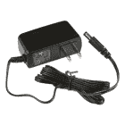
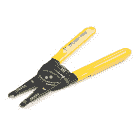

# LED 口香糖机

> 原文：<https://learn.sparkfun.com/tutorials/led-gumball-machine>

## 介绍

需要 LED 吗？答案永远是肯定的。但是如果你现在需要一个权利呢？给自己造一台 LED 口香糖机，再也不用跑了！

[](https://cdn.sparkfun.com/assets/learn_tutorials/8/9/0/LED_Gumball_Machine-06.jpg)*Approximately 3,000 red 5mm LEDs ready to blink*

这台机器是为科罗拉多大学博尔德分校的 BTU 实验室设计的，因为学生们总是需要 led，但装满零件箱似乎总是会发生 T2 公地悲剧。我们将 1000 个 led 灯放入垃圾箱，不到两周它们就会消失。

[](https://cdn.sparkfun.com/assets/learn_tutorials/8/9/0/LED_Gumball_Machine_Demo.gif)

有了 LED 口香糖分配器，LED 可以持续使用一个多学期。令人惊讶的是，15 秒钟的停顿会让人们三思而行。

### 推荐阅读

[](https://learn.sparkfun.com/tutorials/what-is-an-arduino) [### 什么是 Arduino？](https://learn.sparkfun.com/tutorials/what-is-an-arduino) What is this 'Arduino' thing anyway? This tutorials dives into what an Arduino is and along with Arduino projects and widgets.[Favorited Favorite](# "Add to favorites") 50[](https://learn.sparkfun.com/tutorials/pulse-width-modulation) [### 脉宽灯](https://learn.sparkfun.com/tutorials/pulse-width-modulation) An introduction to the concept of Pulse Width Modulation.[Favorited Favorite](# "Add to favorites") 46[](https://learn.sparkfun.com/tutorials/button-and-switch-basics) [### 按钮和开关基础知识](https://learn.sparkfun.com/tutorials/button-and-switch-basics) A tutorial on electronics' most overlooked and underappreciated component: the switch! Here we explain the difference between momentary and maintained switches and what all those acronyms (NO, NC, SPDT, SPST, ...) stand for.[Favorited Favorite](# "Add to favorites") 53[](https://learn.sparkfun.com/tutorials/hobby-servo-tutorial) [### 爱好伺服教程](https://learn.sparkfun.com/tutorials/hobby-servo-tutorial) Servos are motors that allow you to accurately control the rotation of the output shaft, opening up all kinds of possibilities for robotics and other projects.[Favorited Favorite](# "Add to favorites") 24[](https://learn.sparkfun.com/tutorials/sparkfun-inventors-kit-experiment-guide---v40) [### SparkFun 发明家套件实验指南-4.0 版](https://learn.sparkfun.com/tutorials/sparkfun-inventors-kit-experiment-guide---v40) The SparkFun Inventor's Kit (SIK) Experiment Guide contains all of the information needed to build all five projects, encompassing 16 circuits, in the latest version of the kit, v4.0a.[Favorited Favorite](# "Add to favorites") 8

如果你真的想成为极客，看看这个在[状态机](https://www.sparkfun.com/news/1801)上的帖子。状态机是在“等待用户按下按钮”到“忽略按钮，不要立即分配”状态之间转换的好方法。

## 硬件概述

以下是该项目的零件清单:

[](https://www.sparkfun.com/products/15123) 

将**添加到您的[购物车](https://www.sparkfun.com/cart)中！**

 **### [spark fun RedBoard Qwiic](https://www.sparkfun.com/products/15123)

[In stock](https://learn.sparkfun.com/static/bubbles/ "in stock") DEV-15123

SparkFun RedBoard Qwiic 是一款 Arduino 兼容开发板，内置 Qwiic 连接器，无需…

$21.5014[Favorited Favorite](# "Add to favorites") 49[Wish List](# "Add to wish list")****[](https://www.sparkfun.com/products/15312) 

将**添加到您的[购物车](https://www.sparkfun.com/cart)中！**

 **### [【墙上适配器电源- 5VDC，2A(桶形插孔)](https://www.sparkfun.com/products/15312)

[In stock](https://learn.sparkfun.com/static/bubbles/ "in stock") TOL-15312

这是一个高品质的开关“壁式电源”交流到 DC 5V 2000 毫安桶形插座壁式电源，专为…

$6.502[Favorited Favorite](# "Add to favorites") 13[Wish List](# "Add to wish list")****[](https://www.sparkfun.com/products/9347) 

将**添加到您的[购物车](https://www.sparkfun.com/cart)中！**

 **### [【伺服-通用高转矩连续旋转(标准尺寸)](https://www.sparkfun.com/products/9347)

[In stock](https://learn.sparkfun.com/static/bubbles/ "in stock") ROB-09347

这里，你所有的机电需求，是一个简单的，高品质的连续旋转伺服电机。这个伺服系统可以带 i…

$14.956[Favorited Favorite](# "Add to favorites") 32[Wish List](# "Add to wish list")****[](https://www.sparkfun.com/products/11966) 

将**添加到您的[购物车](https://www.sparkfun.com/cart)中！**

 **### [金属按钮-瞬间(16 毫米，红色)](https://www.sparkfun.com/products/11966)

[In stock](https://learn.sparkfun.com/static/bubbles/ "in stock") COM-11966

如果你需要一个重型按钮，这是一个完美的选择！这些金属按钮是一种非常坚固、小巧、轻便的工具

$6.507[Favorited Favorite](# "Add to favorites") 20[Wish List](# "Add to wish list")****[](https://www.sparkfun.com/products/13820) 

将**添加到您的[购物车](https://www.sparkfun.com/cart)中！**

 **### [SparkFun 原盾套装](https://www.sparkfun.com/products/13820)

[19 available](https://learn.sparkfun.com/static/bubbles/ "19 available") DEV-13820

SparkFun ProtoShield 套件让你使用你能想到的任何电路定制你自己的 Arduino 盾牌，然后…

$12.503[Favorited Favorite](# "Add to favorites") 17[Wish List](# "Add to wish list")********** **********一个[原型护盾](https://www.sparkfun.com/products/13820)非常好用。我们使用了一个[旧屏蔽](https://www.sparkfun.com/products/retired/9598)，但是你可以使用任何有几个 GPIO 的屏蔽，你可以焊接。

你当然需要一个口香糖贩卖机。我们还没有验证不同品牌的连续伺服工作，但我们很有信心这个[口香糖机](https://www.candymachines.com/Bubble-Machine-Single-Stand-P124.aspx)将与本教程。

### 工具

这个项目的工具非常普遍。您身边可能有也可能没有各种工具，所以请仔细检查您是否可以访问以下内容:

[](https://www.sparkfun.com/products/11367) 

将**添加到您的[购物车](https://www.sparkfun.com/cart)中！**

 **### [](https://www.sparkfun.com/products/11367)

[In stock](https://learn.sparkfun.com/static/bubbles/ "in stock") PRT-11367

各种颜色的电线:你知道这是一个美丽的东西。六种不同颜色的硬纸板实芯焊丝…

$21.5037[Favorited Favorite](# "Add to favorites") 86[Wish List](# "Add to wish list")****[](https://www.sparkfun.com/products/14228) 

### [威勒 WLC100 焊台](https://www.sparkfun.com/products/14228)

[Out of stock](https://learn.sparkfun.com/static/bubbles/ "out of stock") TOL-14228

Weller 的 WLC100 是一款多功能的 5 瓦至 40 瓦焊台，非常适合业余爱好者、DIY 爱好者和学生。…

2[Favorited Favorite](# "Add to favorites") 17[Wish List](# "Add to wish list")[](https://www.sparkfun.com/products/9325) 

将**添加到您的[购物车](https://www.sparkfun.com/cart)中！**

 **### [无铅焊料- 100 克线轴](https://www.sparkfun.com/products/9325)

[In stock](https://learn.sparkfun.com/static/bubbles/ "in stock") TOL-09325

这是带有水溶性树脂芯的无铅焊料的基本线轴。0.031 英寸规格，100 克。这是一个好主意…

$9.957[Favorited Favorite](# "Add to favorites") 33[Wish List](# "Add to wish list")****[](https://www.sparkfun.com/products/retired/14762) 

### [剥线钳- 22-30AWG](https://www.sparkfun.com/products/retired/14762)

[Retired](https://learn.sparkfun.com/static/bubbles/ "Retired") TOL-14762

这些是你的基本的，普通的剥线钳从 Techni-Tool 与舒适的抓地力，使他们成为一个负担得起的选择…

4 **Retired**[Favorited Favorite](# "Add to favorites") 8[Wish List](# "Add to wish list")**** ****### 连续旋转伺服

LED 口香糖机的神奇之处在于，一个连续旋转的伺服系统与机器内的分配齿轮完美匹配。

[](https://cdn.sparkfun.com/assets/learn_tutorials/8/9/0/LED_Gumball_Machine-02.jpg)

一个[高扭矩连续旋转伺服](https://www.sparkfun.com/products/9347)就是获得分配器机构电子控制的入场券。

大多数伺服系统都有各种各样的*控制喇叭*。这些是不同形状的塑料片，你把它们拧进伺服系统，把伺服系统连接到你的应用程序。在本教程中，我们需要星形控制喇叭(下面突出显示)。完全不走运的是，这个角和口香糖贩卖机的齿的间距大致相同。

[](https://cdn.sparkfun.com/assets/learn_tutorials/8/9/0/LED_Gumball_Machine_-_Continuous_Servo_Horns-2.jpg)

伺服有相当大的扭矩，我们希望应用到分配器机制。我们用拉链和热熔胶安装了伺服系统。首先，使用拉链大致安装伺服到位。一旦你得到了伺服头和分配器齿轮之间的对齐，使用热胶固化一切到位。这种组合产生了粗略对准和刚性的正确组合，使得尽可能多的来自伺服机构的扭矩被传递到分配器。

[](https://cdn.sparkfun.com/assets/learn_tutorials/8/9/0/LED_Gumball_Machine-04.jpg)

### 纽扣

我们选择了一个[瞬间点亮按钮](https://www.sparkfun.com/products/11966)。

[](https://cdn.sparkfun.com/assets/learn_tutorials/8/9/0/LED_Gumball_Machine-01.jpg)

这非常适合拧旋钮原来所在的现有孔。一旦安装好，就很容易弄清楚当按钮被按下时，哪些引脚点亮了 LED，哪些引脚短路了。

[](https://cdn.sparkfun.com/assets/learn_tutorials/8/9/0/LED_Gumball_Machine_-_Button_Wiring2.jpg)

### zedboard

为了把它们绑在一起，我们用了一个[红木板](https://www.sparkfun.com/products/15123)和一个旧的 [MIDI 盾](https://www.sparkfun.com/products/retired/9598)。MIDI 部分不重要。相反，电路板边缘的一排分线引脚可以很容易地将伺服系统和按钮上的少量导线焊接到电路板上，然后将屏蔽塞到 RedBoard 上。

[](https://cdn.sparkfun.com/assets/learn_tutorials/8/9/0/LED_Gumball_Machine-03.jpg)

这是一种比点焊到 RedBoard I/O 上的 SMD 焊盘更有弹性的连接方法。我们也可以使用一个 [Proto Shield](https://www.sparkfun.com/products/13820) 或者一个 [Arduino Pro Mini](https://www.sparkfun.com/products/11113) ，但是我们到处都有这些零件。

[](https://cdn.sparkfun.com/assets/learn_tutorials/8/9/0/LED_Gumball_Machine_-_RedBoard_Wiring2.jpg)

### 力量

伺服系统需要相当数量的 5V 电流，所以我们使用了 [5V 2A 壁式电源](https://www.sparkfun.com/products/12889)。电源线向上穿过基座柱和安装板，插入 Arduino。

### 口香糖贩卖机

显然你需要一台口香糖贩卖机。

[](https://cdn.sparkfun.com/assets/learn_tutorials/8/9/0/LED_Gumball_Machine-01.jpg)

这些令人惊叹的小机器设计精良，便于粗糙使用和维护。我们不为 led 收费，所以我们使用了存放电子产品的地方。

[](https://cdn.sparkfun.com/assets/learn_tutorials/8/9/0/LED_Gumball_Machine-04.jpg)

一定要买一台有金属底座和空心立柱的机器。金属底座使你的装置使用时间更长(学生对设备的要求比鬣狗稍低)，空心柱允许我们通过底座布线。我不得不扩大几个洞来”以便让 DC 枪管塞透。

## 软件

我们希望口香糖贩卖机在按钮被按下时发出发光二极管，这很简单。但是我们想避免分发所有的发光二极管。此外，我们不希望有人站在免费的机器前，不断地点击“给我”按钮。我们实现了 15 秒的超时，防止用户不断地激活伺服。你可以在这里得到软件。

[GitHub: LED Gumball Machine](https://github.com/sparkfun/LED_Gumball_Machine)

### 无需 PWM

几乎所有的伺服系统都是通过 [PWM](https://learn.sparkfun.com/tutorials/pulse-width-modulation) 来运行的。在我们的机器上安装连续伺服系统之前，我们发现伺服系统以下列方式响应:

*   `gumballServo.write(95);` -停止连续伺服的运动
*   `gumballServo.write(200);` -伺服快速逆时针转动
*   `gumballServo.write(10);` -伺服快速顺时针转动(但不使用)

我们的口香糖分配器被设计成顺时针运转，所以我们只能逆时针运转我们的伺服系统。

[](https://cdn.sparkfun.com/assets/learn_tutorials/8/9/0/LED_Gumball_Machine-06.jpg)

分配器显然是为口香糖球设计的，所以当分配发光二极管时，实际出来的发光二极管数量变化很大。一般来说，当伺服系统被激活 1 秒钟时，用户会得到 1 到 5 个 led。这个很好用。在 led 无法分发的最终情况下，用户只需等待 15 秒钟再试一次。因为我们不收取任何费用，这是一个可以接受的结果。

```
language:c
gumballServo.detach(); //Be sure the servo won't move 
```

分配后，我们脱离伺服。这将关闭流向伺服系统的 PWM 信号，确保伺服系统不会移动。我们注意到伺服抖动或移动非常缓慢，在 90(当它不应该移动)，所以这个额外的步骤确保了 LED 口香糖机不会慢慢吐出自己到地毯上过夜。

沿着同样的思路，我们注意到分配机制有时会捆绑起来，导致伺服机构在短时间内汲取更多的电流。这可能会导致电源关闭，从而导致 Arduino 复位。您将在安装开始时看到()

```
language:c
gumballServo.attach(GUMBALL_SERVO); //Be sure the servo won't move
gumballServo.write(95); //Stop movement on continous servo
gumballServo.detach(); //Be sure the servo won't move 
```

上面的代码是 Arduino 运行的第一件事，确保任何先前的伺服运动停止。这有助于防止出现奇怪的滚动复位情况，在这种情况下，伺服会导致掉电，当 Arduino 重新上线时，伺服会开始移动，从而导致掉电等...

### 按钮监控

按钮被按下时会短路接地，因此当按钮被按下*而不是*时，我们使用内部上拉电阻将按钮引脚拉高。

该按钮有一个内置的 LED，因此我们将按钮背面的+/-引脚直接连接到 PWM 使能引脚和地。该 LED 在 5V 时的测量值为 12mA，远低于 20mA 的最大值，因此我们不需要电阻。

```
language:c
//Check if we are allowed to dispense
else if (millis() - lastDispenseTime < minTimeBetweenPresses)
{
    Serial.println("Uh-huh Mr. Eager. Wait your turn.");
    while (digitalRead(BUTTON) == LOW) delay(10); //Wait for user to stop pressing button
    return; //No soup for you!
} 
```

在上面的代码中，我们检查从最后一次按下按钮到再次出售是否已经过了足够的时间。

```
language:c
unsigned long minTimeBetweenPresses = 15 * 1000; //Make users wait this amount of ms between dispenses 
```

我们发现 15 秒(15，000 毫秒)的间隔时间足以说服学生不要拿走所有的 led 灯。

## 资源和更进一步

我们希望您喜欢阅读我们的 LED 点胶机。如果你喜欢这个，还有很多！

[](https://learn.sparkfun.com/tutorials/alternating-current-ac-vs-direct-current-dc) [### 交流电与直流电(DC)](https://learn.sparkfun.com/tutorials/alternating-current-ac-vs-direct-current-dc) Learn the differences between AC and DC, the history, different ways to generate AC and DC, and examples of applications.[Favorited Favorite](# "Add to favorites") 53[](https://learn.sparkfun.com/tutorials/introduction-to-dmx) [### DMX 简介](https://learn.sparkfun.com/tutorials/introduction-to-dmx) DMX512 is an industry standard in lighting and stage design, whether it be controlling lights, motors, or lasers, DMX512 has many uses. In this tutorial we’ll cover DMX512 (Digital Multiplex with 512 pieces of information).[Favorited Favorite](# "Add to favorites") 10[](https://learn.sparkfun.com/tutorials/understanding-thermal-resistance) [### 了解热阻](https://learn.sparkfun.com/tutorials/understanding-thermal-resistance) Discussing what thermal resistance is, how it’s used for thermal management, and how to maximize the life of your project.[Favorited Favorite](# "Add to favorites") 4[](https://learn.sparkfun.com/tutorials/external-io-and-metastability) [### 外部 IO 和亚稳定性](https://learn.sparkfun.com/tutorials/external-io-and-metastability) Why external signals can cause metastability and how to use constraint files to manage this[Favorited Favorite](# "Add to favorites") 3[](https://learn.sparkfun.com/tutorials/experiment-guide-for-redbot-with-shadow-chassis) [### 带影子底盘的 RedBot 实验指南](https://learn.sparkfun.com/tutorials/experiment-guide-for-redbot-with-shadow-chassis) This Experiment Guide offers nine experiments to get you started with the SparkFun RedBot. This guide is designed for those who are familiar with our SparkFun Inventor's Kit and want to take their robotics knowledge to the next level.[Favorited Favorite](# "Add to favorites") 11[](https://learn.sparkfun.com/tutorials/rotary-dial-kit-assembly-guide) [### 旋转拨号套件装配指南](https://learn.sparkfun.com/tutorials/rotary-dial-kit-assembly-guide) Put together your Rotary Dial Kit and light it up with our Arduino example code 3[](https://learn.sparkfun.com/tutorials/artemis-global-tracker-hookup-guide) [### Artemis 全球追踪器连接指南](https://learn.sparkfun.com/tutorials/artemis-global-tracker-hookup-guide) The SparkFun Artemis Global Tracker combines the Artemis processor with an Iridium 9603N satellite transceiver, ZOE-M8Q GNSS transceiver, and MS8607 PHT sensor. With a clear view of the sky, this board allows you to send and receive short data messages from anywhere in the world including remote locations far beyond the reach of WiFi and GSM networks. Follow this guide to get started with the Artemis Global Tracker.[Favorited Favorite](# "Add to favorites") 3[](https://learn.sparkfun.com/tutorials/sending-sensor-data-over-lora) [### 通过 LoRa 发送传感器数据](https://learn.sparkfun.com/tutorials/sending-sensor-data-over-lora) This tutorial will show you how setup a simple peer-to-peer connection to send and receive sensor data using LoRa.[Favorited Favorite](# "Add to favorites") 4**************