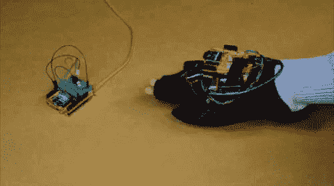

# 无线手套控制器

> 原文：<https://learn.sparkfun.com/tutorials/wireless-glove-controller>

## 介绍

在本教程中，我们将使用 Arduino 构建一个无线手套控制器，以使用 XBees 远程触发 LED！

### 所需材料

要跟随本教程，您将需要以下材料。你可能不需要所有的东西，这取决于你拥有什么。将它添加到您的购物车，通读指南，并根据需要调整购物车。