# Qwiic 秤连接指南

> 原文：<https://learn.sparkfun.com/tutorials/qwiic-scale-hookup-guide>

## 介绍

围绕物体重量的测量，有各种令人兴奋的项目。无论是测量鸡是否已经离开，蜜蜂是否已经在黎明离开，还是自动灌装液体；能够与秤进行数字接口是关键。 [Qwiic 秤](https://www.sparkfun.com/products/15242)是读取秤及其内部位[称重传感器](https://learn.sparkfun.com/tutorials/getting-started-with-load-cells)的极其简单的方法。

[](https://www.sparkfun.com/products/15242) 

将**添加到您的[购物车](https://www.sparkfun.com/cart)中！**

### [kickfunk qwiic 量表-精确 02](https://www.sparkfun.com/products/15242)

[In stock](https://learn.sparkfun.com/static/bubbles/ "in stock") SEN-15242

SparkFun Qwiic Scale - NAU7802 是 NAU7802 的一个小型分线板，可以让您轻松读取称重传感器来测量

$16.508[Favorited Favorite](# "Add to favorites") 37[Wish List](# "Add to wish list")** **[https://www.youtube.com/embed/6-bod9ndOtY/?autohide=1&border=0&wmode=opaque&enablejsapi=1](https://www.youtube.com/embed/6-bod9ndOtY/?autohide=1&border=0&wmode=opaque&enablejsapi=1)

我们设计的 Qwiic 秤几乎不需要焊接。我们甚至编写了一个 Arduino 库，这样获得一个物体的重量就像:

```
language:c
float weight = myScale.getWeight(); 
```

### 所需材料

如果你刚刚开始，我们建议你买一个电子秤，然后黑进去。这是因为正确地机械连接称重传感器是很棘手的。

[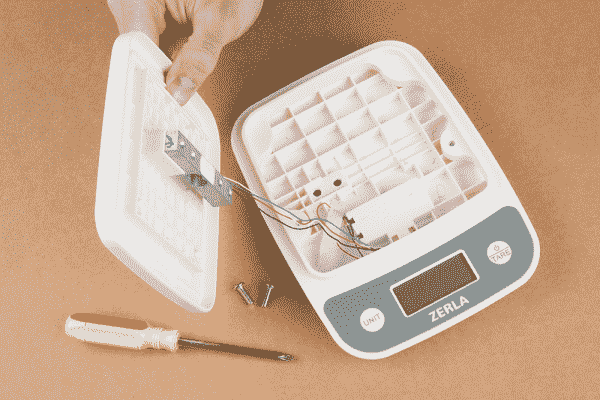](https://cdn.sparkfun.com/assets/learn_tutorials/8/8/0/SparkFun_Qwiic_Scale_-_NAU7802_Hookup_Guide-03.jpg)*This low-cost scale already has the load cell properly mounted. Ready to be modified to an I2C addressable one.*

或者，如果您有独特的应用，或者如果这不是您第一次测量重量，请查看我们提供的各种形状和容量的称重传感器，以创建您自己的解决方案。

我们假设你刚开始学音阶。我们建议您选择一台大致能够测量您想要的重量的秤。例如，浴室秤最擅长测量约 20 磅至约 300 磅的重量。如果你想测量几盎司，那就不要用浴室秤，而是用厨房食物秤。

此外，你需要一件已知重量的物品。这将用于校准您的 DIY 秤。根据您的项目所需的精确度，您可以使用任何物体(394 或 355.1g 的汽水罐、哑铃、一袋面粉等)，只要您知道重量或有一个额外的秤，您可以从中获得已知的重量。

[](https://cdn.sparkfun.com/assets/learn_tutorials/8/8/0/SparkFun_Qwiic_Scale_-_NAU7802_Hookup_Guide-04.jpg)*10 pound plate, 4lbs flour, Diet coke, 100g calibration weight*

#### 推荐阅读

如果你不熟悉称重传感器、跳线垫或 I ² C，请务必查阅一些基础教程。

[](https://learn.sparkfun.com/tutorials/analog-to-digital-conversion) [### 模数转换](https://learn.sparkfun.com/tutorials/analog-to-digital-conversion) The world is analog. Use analog to digital conversion to help digital devices interpret the world.[Favorited Favorite](# "Add to favorites") 58[](https://learn.sparkfun.com/tutorials/i2c) [### I2C](https://learn.sparkfun.com/tutorials/i2c) An introduction to I2C, one of the main embedded communications protocols in use today.[Favorited Favorite](# "Add to favorites") 128[](https://learn.sparkfun.com/tutorials/getting-started-with-load-cells) [### 称重传感器入门](https://learn.sparkfun.com/tutorials/getting-started-with-load-cells) A tutorial defining what a load cell is and how to use one.[Favorited Favorite](# "Add to favorites") 27[](https://learn.sparkfun.com/tutorials/how-to-work-with-jumper-pads-and-pcb-traces) [### 如何使用跳线焊盘和 PCB 走线](https://learn.sparkfun.com/tutorials/how-to-work-with-jumper-pads-and-pcb-traces) Handling PCB jumper pads and traces is an essential skill. Learn how to cut a PCB trace, add a solder jumper between pads to reroute connections, and repair a trace with the green wire method if a trace is damaged.[Favorited Favorite](# "Add to favorites") 11

如果你不熟悉 Qwiic 系统，我们推荐你在这里阅读[以获得一个概述](https://www.sparkfun.com/qwiic)。

| [](https://www.sparkfun.com/qwiic) |
| *[Qwiic 连接系统](https://www.sparkfun.com/qwiic)* |

## 硬件概述

Qwiic 秤采用 [NAU7802 IC](https://cdn.sparkfun.com/assets/learn_tutorials/8/8/0/NAU7802_Data_Sheet_V1.7.pdf) 设计。这款 24 位模数转换器极其精确，设计用于读取称重传感器或秤产生的极小电压变化。SparkFun 多年来一直在销售一款类似的产品，T2 hx 711 T3。NAU7802 的亮点在于它拥有 HX711 的所有强大功能，但使用了真正的 I ² C 接口，允许 Qwiic 秤与总线上的其他传感器和设备进行菊花链连接。

[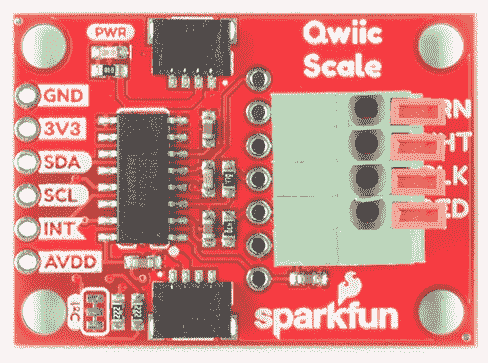](https://cdn.sparkfun.com/assets/learn_tutorials/8/8/0/SparkFun_Qwiic_Scale_-_NAU7802.jpg)

### I ² C 连接

正如我们前面提到的，两个 Qwiic 连接器可以轻松实现菊花链连接，但如果您更喜欢自己的 I ² C 连接，则可以在电路板边缘断开引脚。

[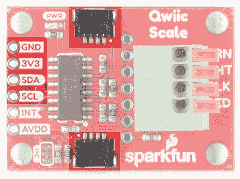](https://cdn.sparkfun.com/assets/learn_tutorials/8/8/0/SparkFun_Qwiic_Scale_-_NAU7802_-_I2C_Pins.jpg)

### 弹簧端子

提供一个弹簧端子，无需焊接即可连接到秤。这个终端是通过按压臂和插入电线来操作的。我们发现圆珠笔或小平头螺丝刀可以方便地一次按下一只手臂。该终端可以处理 20AWG 至 26AWG 规格的电线，几乎所有称重传感器上都有这种电线。

[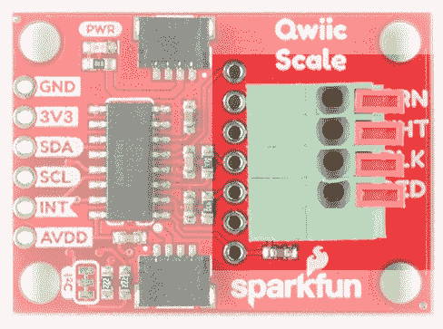](https://cdn.sparkfun.com/assets/learn_tutorials/8/8/0/SparkFun_Qwiic_Scale_-_NAU7802_-_Spring_Termina.jpg)

端子旁边有四个丝印指示器，显示哪种颜色的电线应该插入哪里。这些是“标准的”称重传感器电线颜色，但制造商之间可能略有不同。如果你有疑问，使用你最好的猜测，不要担心-你不能伤害你的称重传感器反向接线！

[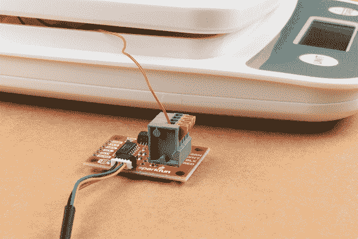](https://cdn.sparkfun.com/assets/learn_tutorials/8/8/0/SparkFun_Qwiic_Scale_-_NAU7802_Hookup_Guide-06.jpg)

如果在插入电线后，臂回到与端子平齐的位置，则弹簧正确地夹住了电线。如果臂看起来仍然被压着，稍微移开导线，直到端子夹住导线，而不是绝缘层。

### PTH 引脚

此外，我们还为高级用户设计了 ADC 和 PTH 屏蔽孔。如果您的称重传感器更复杂，并且电线周围有屏蔽层，这将很有帮助(不是必需的，但有助于减少 EMI)。

[](https://cdn.sparkfun.com/assets/learn_tutorials/8/8/0/SparkFun_Qwiic_Scale_-_NAU7802_-_Bottom_Pins.jpg)

引脚定义:

*   **红色/E+** -给惠斯通电桥供电的称重传感器的正电压。通常连接到称重传感器的红线上。
*   **黑色/E-** -称重传感器的负电压，通常连接至称重传感器的黑色电线。
*   **白色/A-** -惠斯通电桥的负极支路，通常连接到称重传感器的白色电线。
*   **绿色/A+** -惠斯通电桥的正极分支，通常连接到称重传感器的绿色电线。
*   **黄色/屏蔽** -用于更复杂称重传感器的屏蔽引脚，电线周围有屏蔽层。有时，代替黄线的是更大的黑线、箔或松散的线来屏蔽信号线以减少电磁干扰。这不是必需的，但有助于降低 EMI。
*   **B-** -在数据手册中称为 VIN2N。可选第二 ADC 通道，负输入。这将连接到第二个称重传感器，共享上述 E+/E 连接。
*   **B+** -在数据手册中称为 VIN2P。可选第二 ADC 通道，正输入。这将连接到第二个称重传感器，共享上述 E+/E 连接。

NAU7802 经过优化，可与差分对配合使用，即称重传感器和惠斯通电桥型设备。然而，可以在 **VIN1P** 和接地的 **VIN1N** 之间连接一个常规模拟信号。

根据数据手册:

> 该器件经过优化，可以接受差分输入信号，但也可以测量单端信号。测量相对于地的单端信号时，将负输入(VIN1N 或 VIN2N)连接到地，并将输入信号连接到正输入(VIN1P 或 VIN2P)。注意，当该器件以这种方式配置时，只使用转换器满量程范围的一半，因为只产生正数字输出码。

### 第二频道

NAU7802 有第二个可选 ADC 通道，其输入电容低得多(5pF 对 14pF)，但其他方面与第一个通道相同。默认情况下，该通道的输入端有一个 330pF 电容。这有助于降低第一频道的噪音。如果您想使用第二通道，我们建议通过切断**帽**跳线来移除电容器。不确定如何切割痕迹？阅读[了解更多信息](https://learn.sparkfun.com/tutorials/how-to-work-with-jumper-pads-and-pcb-traces)！

[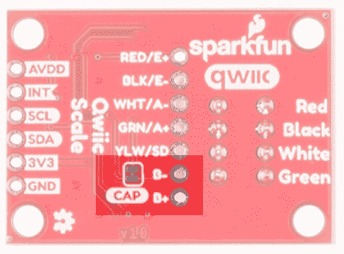](https://cdn.sparkfun.com/assets/learn_tutorials/8/8/0/SparkFun_Qwiic_Scale_-_NAU7802_-_2nd_Channel.jpg)

### 中断/数据就绪

默认情况下，NAU7802 有一个中断输出引脚，当转换完成且有新数据可供读取时，该引脚变为低电平。当有新数据可用时，该中断也可以配置为高电平。

[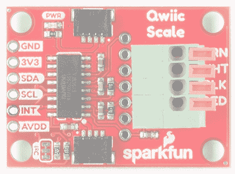](https://cdn.sparkfun.com/assets/learn_tutorials/8/8/0/SparkFun_Qwiic_Scale_-_NAU7802_-_Interrupt_Pin.jpg)

大多数应用不需要中断引脚。新数据的频率为 10、20、40、80 和 320Hz，因此我们可以定期轮询器件，而不是检查中断引脚，但它也可用于更高级的应用(例如极低功耗项目，其中主控制器在两次读取之间进入休眠状态)。

### AVDD Pin

NAU7802 内置稳压器，将输出 4.5V 至 2.4V 电压，用于偏置称重传感器。默认情况下，我们将 AVDD 设置为 **3.3V** ，但降低偏置电压有助于省电。如果用户希望使用该电压作为参考，则可以使用 **AVDD** 引脚；**AVDD**T6 不应用作电流源。注意，调节器只能向下调节；你不能用 3.3V 给电路板供电，而要求调节器输出 4.5V。

[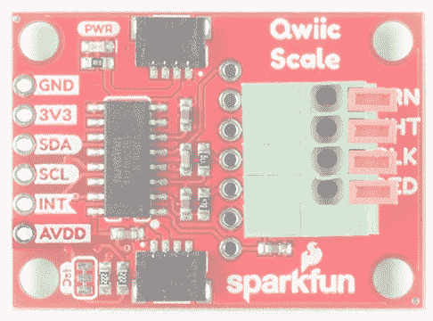](https://cdn.sparkfun.com/assets/learn_tutorials/8/8/0/SparkFun_Qwiic_Scale_-_NAU7802_-_AVDD_pin.jpg)

### I ² C 跳线

切断 **I ² C** 跳线将移除 2.2k &欧姆；来自 I ² C 总线的电阻。一般来说，你不应该需要搞乱这个跳线。但是，如果 I ² C 总线上有许多器件，可能需要通过切断焊盘之间的两条小走线来移除这些电阻。不知道怎么剪跳线？[看这里！](https://learn.sparkfun.com/tutorials/how-to-work-w-jumper-pads-and-pcb-traces/cutting-a-trace-between-jumper-pads)

[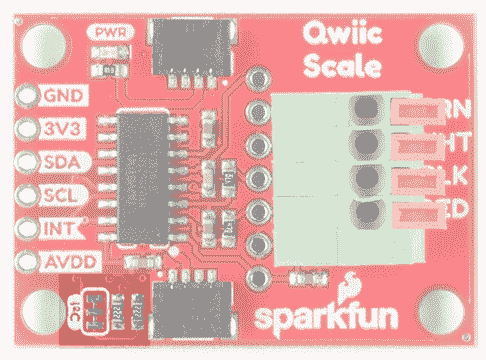](https://cdn.sparkfun.com/assets/learn_tutorials/8/8/0/SparkFun_Qwiic_Scale_-_NAU7802_-_I2C_Pullup_Jumper.jpg)

## 硬件装配

下面我们用一个普通称重传感器拆卸一个小型厨房秤，演示如何安装 Qwiic 秤。修改带有四个独立点称重传感器的浴室秤(用于更大的最大重量)是可能的，但需要布线更多的电线。我们为您的第一个 Qwiic 秤项目推荐一台带杆式称重传感器的秤(大多数厨房秤都有)。

[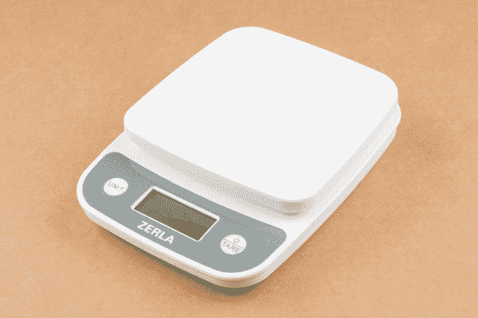](https://cdn.sparkfun.com/assets/learn_tutorials/8/8/0/SparkFun_Qwiic_Scale_-_NAU7802_Hookup_Guide-01.jpg)*A common 5kg max kitchen scale*

移除任何标签和盖子，以便接触到将杆式称重传感器固定到浮动平台的两个螺钉。

[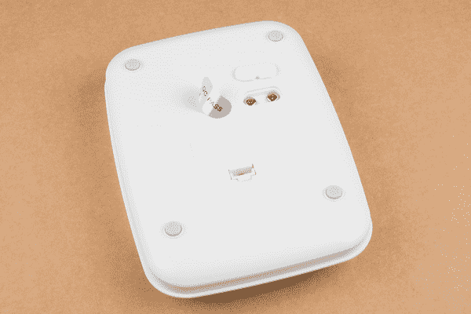](https://cdn.sparkfun.com/assets/learn_tutorials/8/8/0/SparkFun_Qwiic_Scale_-_NAU7802_Hookup_Guide-02.jpg)*Remove two screws to open the scale*

这将从底座上释放平台。请注意将称重传感器连接到电子设备前部的四根电线。

[](https://cdn.sparkfun.com/assets/learn_tutorials/8/8/0/SparkFun_Qwiic_Scale_-_NAU7802_Hookup_Guide-03.jpg)*This load cell has a blue wire instead of a green wire*

大多数称重传感器都有四根红色、黑色、白色和绿色的电线。如果您的称重传感器没有，也没关系！检查我们的故障排除部分，了解如何找出正确的连接。

[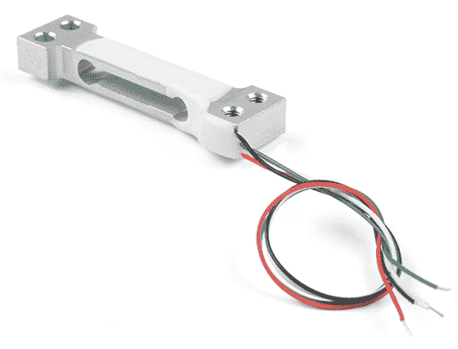](https://cdn.sparkfun.com/assets/learn_tutorials/8/8/0/Qwiic_Scale_-_Load_Cell.jpg)

你在黑进浴室秤吗？这些通常使用四个单独的传感器，需要组合成一个完整的称重传感器。我们创造了[称重传感器组合器](https://www.sparkfun.com/products/13878)来使这变得更加容易。一旦你有了你的组合器，你应该有四根线(红，黑，白，绿)从组合器出来，准备好连接到 Qwiic 秤。

[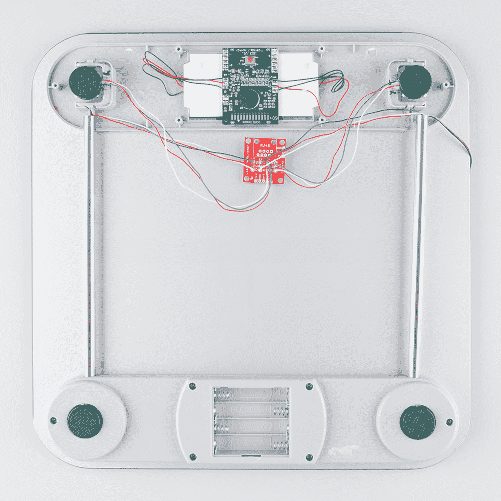](https://cdn.sparkfun.com//assets/parts/1/1/5/0/9/HX711_and_Combinator_board_hook_up_guide-09.jpg)

如果你用没有剥开的[电线接入厨房秤或称重传感器，使用一对](https://learn.sparkfun.com/tutorials/working-with-wire#how-to-strip-a-wire)[剥线钳](https://www.sparkfun.com/products/12630)去除大约 1/4 英寸的绝缘层。

[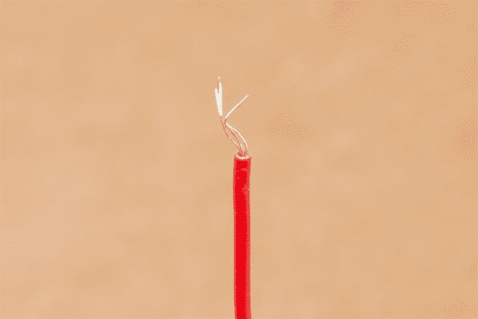](https://cdn.sparkfun.com/assets/learn_tutorials/8/8/0/SparkFun_Qwiic_Scale_-_NAU7802_Hookup_Guide-07.jpg)*Frayed stranded wire*

大多数称重传感器都有绞合线，而不是实心线。当来回弯曲时，绞合线有助于减少断线。绞线的缺点是，当你试图将它插入一个孔中，如 Qwiic 秤的弹簧端子时，它往往会无处不在。在试图插入电线之前，用手指拧几下，让所有的电线都弯回一起。

[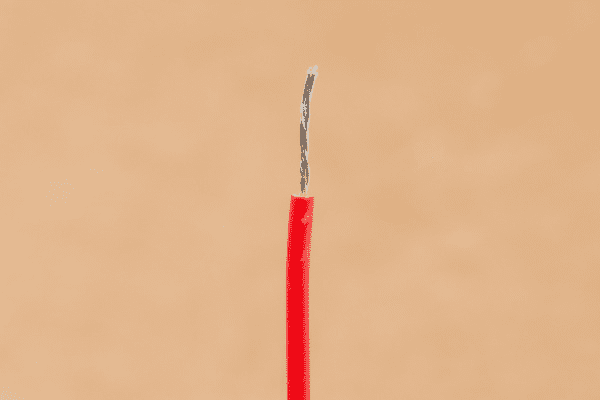](https://cdn.sparkfun.com/assets/learn_tutorials/8/8/0/SparkFun_Qwiic_Scale_-_NAU7802_Hookup_Guide-08.jpg)*Twisted stranded wire*

额外加分的是，在你拧好线的末端后，用少量熔化的焊料敲击它——这将会把线锁在适当的位置。这被称为“镀锡”，在处理绞合线时很有帮助，但不是必需的。

[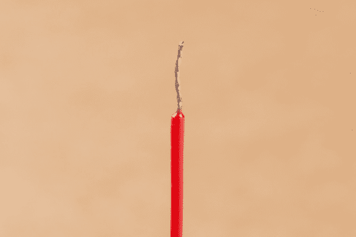](https://cdn.sparkfun.com/assets/learn_tutorials/8/8/0/SparkFun_Qwiic_Scale_-_NAU7802_Hookup_Guide-09.jpg)*Twisted stranded wire tinned with solder*

现在将第一根红线插入弹簧端子。如果臂回到与端子平齐的位置，则端子正确地夹住了焊线。轻轻拉一下这根线，它会固定住的。

[](https://cdn.sparkfun.com/assets/learn_tutorials/8/8/0/SparkFun_Qwiic_Scale_-_NAU7802_Hookup_Guide-06.jpg)*Arm in the correct position*

如果臂被轻微压下，这意味着电线插入过深，端子挤压电线周围的绝缘层。再次按压臂，将电线稍微拉出，直到碰到端子挤压电线的软点，而不是绝缘层。

[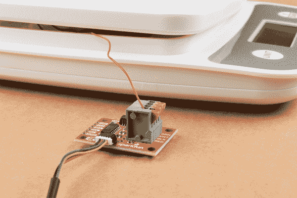](https://cdn.sparkfun.com/assets/learn_tutorials/8/8/0/SparkFun_Qwiic_Scale_-_NAU7802_Hookup_Guide-05.jpg)*Arm not in the correct position*

根据导线的颜色和 Qwiic 秤 PCB 上的丝印指示器插入所有四根导线。现在用一根 [Qwiic 电缆](https://www.sparkfun.com/products/14427)或其他带有 [Qwiic 试验板电缆](https://www.sparkfun.com/products/14425)的微控制器将 Qwiic 电子秤连接到你的 RedBoard。您已经准备好开始编码了！

[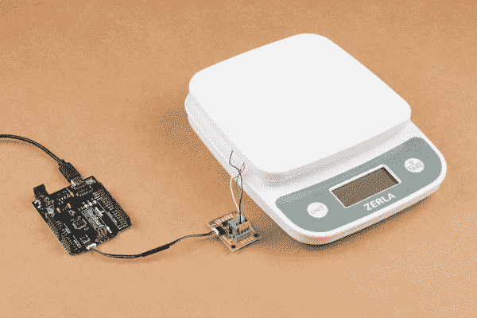](https://cdn.sparkfun.com/assets/learn_tutorials/8/8/0/SparkFun_Qwiic_Scale_-_NAU7802_Hookup_Guide-10.jpg)*Four arms in correct position with four wires connected to BlackBoard*

## Qwiic Scale Arduino 库和概述

**Note:** This example assumes you are using the latest version of the Arduino IDE on your desktop. If this is your first time using Arduino, please review our tutorial on [installing the Arduino IDE.](https://learn.sparkfun.com/tutorials/installing-arduino-ide) If you have not previously installed an Arduino library, please check out our [installation guide.](https://learn.sparkfun.com/tutorials/installing-an-arduino-library/using-the-arduino-library-manager)

[SparkFun Qwiic 秤 NAU7802 Arduino 库](https://github.com/sparkfun/SparkFun_Qwiic_Scale_NAU7802_Arduino_Library)是一个用于读取重量和配置 ic 的全功能库。我们建议您使用库管理器通过 Arduino IDE 安装库，并搜索 **SparkFun Scale** 。或者，您可以通过单击下面的链接下载并手动安装该库的 zip 文件。对于那些想查看代码的人，请查看 [GitHub repo](https://github.com/sparkfun/SparkFun_Qwiic_Scale_NAU7802_Arduino_Library) 。

[SparkFun Qwiic Scale NAU7802 Arduino Library (ZIP)](https://github.com/sparkfun/SparkFun_Qwiic_Scale_NAU7802_Arduino_Library/archive/master.zip)

一旦你安装了这个库，我们建议你从 *Example1* 开始，并逐步完成这些例子。您不需要阅读或理解以下所有函数，它们在示例中有演示和描述。但是如果你真的很高级，只是想要可用的功能，这里有:

*   **`bool begin(TwoWire &wirePort = Wire)`** -检查通信并初始化传感器。如果传感器成功启动，则返回 true。或者，您可以传入不同的线端口。
*   **`bool isConnected()`** -如果设备确认了对其 I2C 地址的呼叫，则返回 true。
*   **`bool available()`** -如果周期就绪位被置位(转换完成)，则返回真。
*   **`int32_t getReading()`** -返回 24 位读数。假设 CR 周期就绪位(ADC 转换完成)已经由`.available()`检查。
*   **`int32_t getAverage(uint8_t samplesToTake)`** -返回给定数量读数的平均值。
*   **`void calculateZeroOffset(uint8_t averageAmount = 8)`**——也作 taring。称之为无秤。
*   **`void setZeroOffset(int32_t newZeroOffset)`** -设置内部变量。对于从 NVM 加载值的用户非常有用。
*   **`int32_t getZeroOffset()`** -向库请求零点偏移值。用于将值存储到 NVM 中。
*   **`void calculateCalibrationFactor(float weightOnScale, uint8_t averageAmount = 8)`**——称这与天平上东西的价值有关。根据秤上的重量和零点偏移设置校准系数。
*   **`void setCalibrationFactor(float calFactor)`** -将一个已知的校准因子传入库中。从 NVM 加载设置时很有帮助。
*   **`float getCalibrationFactor()`** -向库索要校准因子。用于将值存储到 NVM 中。
*   **`float getWeight(bool allowNegativeWeights = false)`** -一旦你设置了零点偏移和校准因子，你就可以让库为你做计算。默认情况下，负权重将作为 0 返回。
*   **`bool setGain(uint8_t gainValue)`** -通过调用`myScale.setGain(NAU7802_GAIN_16)`设置增益。x1，2，4，8，16，32，64，128 都有。
*   **`bool setLDO(uint8_t ldoValue)`** -通过调用`myScale.setLDO(NAU7802_LDO_3V6)`将机载低压差稳压器设置为给定值。有 2.4，2.7，3.0，3.3，3.6，3.9，4.2，4.5V 可供选择。
*   **`bool setSampleRate(uint8_t rate)`**——通过调用`myScale.setSampleRate(NAU7802_SPS_80)`设置每秒钟的读数。每秒 10、20、40、80 和 320 个样本可用。
*   **`bool setChannel(uint8_t channelNumber)`** -在 1 和 2 之间选择
*   **`bool calibrateAFE()`** -校准 IC 的模拟前端。该功能与设置零点偏移和校准系数无关，应尽量少用。建议在增益、SPS 或通道号改变时，重新校准 AFE。如果 CAL_ERR 位为 0(无错误)，则返回 true。
*   **`bool reset()`** -将所有寄存器复位为默认上电状态
*   **`bool powerUp()`** -给刻度的数字和模拟部分加电，大约 2mA
*   **`bool powerDown()`** -将秤置于低功耗 200nA 模式
*   **`bool setIntPolarityHigh()`** -当数据准备好时，将 Int 引脚设为高电平(默认)
*   **`bool setIntPolarityLow()`** -当数据准备好时，将 Int 引脚设为低电平
*   **`uint8_t getRevisionCode()`**——获取该 IC 的版本号。总是 0x0F。

下面是操作寄存器的低级函数:

*   **`bool setBit(uint8_t bitNumber, uint8_t registerAddress)`** -屏蔽&设置寄存器内给定的位
*   **`bool clearBit(uint8_t bitNumber, uint8_t registerAddress)`** -屏蔽&清除寄存器内的给定位
*   **`bool getBit(uint8_t bitNumber, uint8_t registerAddress)`**——返回寄存器内给定的位
*   **`uint8_t getRegister(uint8_t registerAddress)`**——获取寄存器内容
*   **`bool setRegister(uint8_t registerAddress, uint8_t value)`** -发送一个给定值到给定地址进行写入。如果成功，则返回 true。

## 例子

以下从库中突出显示的例子将在[串行监视器](https://learn.sparkfun.com/tutorials/terminal-basics)上显示读数。

### 例 1:基本阅读

*示例 1* 将向您展示 NAU7802 的基本输出。这有助于获得基本的硬件设置。如果你把所有的东西都连接好了，那么当你在磅秤上按下时，数值会有几千或几十万的变化。

[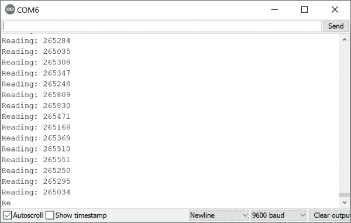](https://cdn.sparkfun.com/assets/learn_tutorials/8/8/0/SparkFun-Qwiic_Scale_Example1.jpg)

### 示例 2:完整比例

例 2 开始变得有趣了。该示例将向您展示如何表征您的秤。你需要一个完全设置好的秤，并且用一个已知重量(比如一个哑铃或一罐汽水)校准。如果您没有校准秤，您需要在串行终端发送一个`c`并按照提示校准秤。在校准并将代码重新加载到 Arduino 之后，您应该会看到类似下面的输出。

[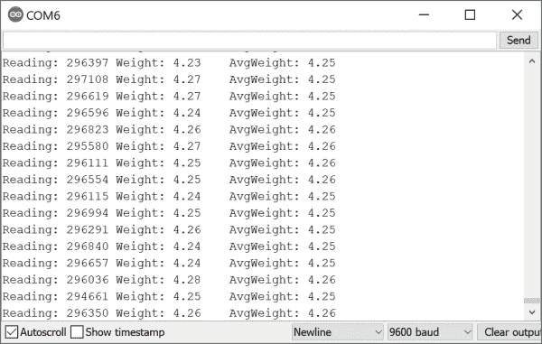](https://cdn.sparkfun.com/assets/learn_tutorials/8/8/0/SparkFun-Qwiic_Scale_Example2.jpg)*Example output after calibration*

### 高级示例

我们在库中添加了额外的示例，演示如何改变增益、采样速率，以及如何针对低功耗项目关断 IC。对于具有多个 Wire 端口的平台(即 Teensy，而不是 Uno)，我们还提供了一个高级 I2C 示例，展示如何将库指向使用 Wire1。

## 如何描述您的秤

你应该把你的秤装好，但是在我们开始测量之前还有一个步骤。是时候教你的秤一件东西的重量了，这样它就能知道其他所有东西的重量了！

称重传感器具有线性响应，这意味着它们的值与施加到其上的力或重量成比例变化。还记得你在学校学到的东西吗？没有也没关系！秤的特征如下所示:

*   连接秤，让*example 1 _ basicradings . ino*输出一个良好的变化值。
*   load*example 2 _ complete scale . ino*
*   把你称上的所有东西都拿掉，按“c”键得到一个“零”读数
*   将一个[已知重量的](https://cdn.sparkfun.com/r/600-600/assets/learn_tutorials/8/8/0/SparkFun_Qwiic_Scale_-_NAU7802_Hookup_Guide-04.jpg)(罐装汽水、举重板等)放在您的秤上，并输入其值。例如，如果您在磅秤上放置了 150 克重物，请输入 150.0。

就是这样。你可以去掉已知的重量，称出你周围任何东西的重量。但是到底是怎么回事呢？

[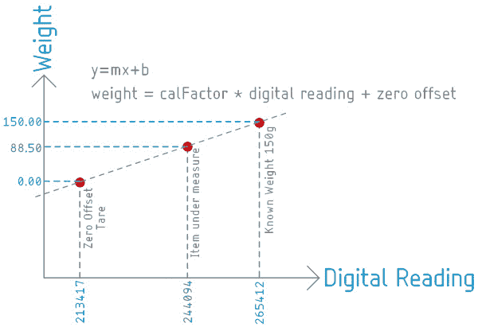](https://cdn.sparkfun.com/assets/learn_tutorials/8/8/0/SparkFun-Weight_vs_LoadCell_Reading_Explanation.jpg)

而不是`y = mx + b`想象`weight = calibrationFactor * reading + zeroOffset`。

NAU7802 的 SparkFun 图书馆采用数字读数。这些读数从 10，000 到超过 100 万不等。这些值是无单位的-IC 不知道您的秤是否有克或磅或石头，它只知道值的变化。所以当你把所有的重量从你的秤上拿掉，仍然有一个非零值被测量。我们称之为零点偏移(也称为`y = mx + b`的`+b`部分),它是在调用`calculateZeroOffset()`函数时设置的。当您将一个已知的重量放在秤上并调用`calculateCalibrationFactor(150.0)`函数时，该库将执行以下数学运算(并设置`y=mx+b`的`m`部分)。

假设您在秤上什么都没有的情况下测量了`213417`。一旦你添加了 150 克，秤就会测量出`265412`。根据这些数字，我们可以计算直线的斜率:

```
language:latex
Zero offset = 213417
Calibration factor = (265412 - 213417) / 150 = 346.6333 
```

我们现在知道，数字读数每改变 346，我们就看到 1 克的变化。干净利落。

现在，无论我们把什么放在秤上，我们都可以通过零偏移和已知重量之间的外推得到它的重量。例如，如果我们把一个未知的东西放在秤上，得到的读数是 244094，我们知道:

```
language:latex
244094 - 213417 = 30677

30677 / 346.633 = 88.4999 
```

88.5 克！同样，这些值是没有单位的，但是只要你知道已知的重量是以克为单位的，那么“重量”就以克为单位输出。

**Note:** The library holds the zero offset and calibration factor in volatile memory. We recommend you get these values using the `getZeroOffset()` and `getCalibrationFactor()` functions. Once obtained, store these values in EEPROM or other NVM. This will allow you to create a scale that can power up, load the values from NVM and immediately begin measuring weight. When power cycling your system you’ll want to reload them with the `setZeroOffset(213417)` and `setCalibrationFactor(346.6333)` functions. This is demonstrated in Example2.

## 常见问题和故障排除

### 满量程示例不会从零开始变化。

你看到这样的东西了吗？读数在变化但重量不变。

[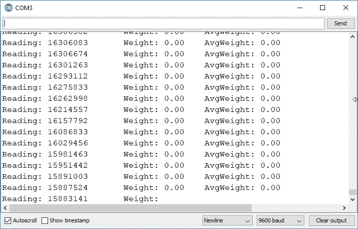](https://cdn.sparkfun.com/assets/learn_tutorials/8/8/0/Decreasing_Scale_Value_-_No_Weight.jpg)

如果你按下秤时看到读数在**下降**，那么 A+/A-线可能是反向的。因为重量越大，读数越低，所以显示的重量永远不会超过零。试着把白线和绿线反过来。

### 当我按下称重传感器时，数值会减小！救命啊！

A+/A-线大概是反的。试着把白线和绿线反过来。

### 示例 1 显示常数值~1000 / ~8，000，000 / ~ 16，000，000 /刻度不起作用

很有可能你的电线没有接触。确保将剥开的电线插入弹簧端子，但不要太远。如果端子“夹”在绝缘层上而不是电线上，则不会形成电气连接。向下按压臂，将电线拉出几毫米。

### 我可以量出 0.001 克吗？

大概不会。出于各种原因，真正高精度的秤不使用称重传感器。看看“重量秤元件”,它基本上是一种使用电磁铁和 PID 回路的天平。

我们能够可靠准确地测量 10 千克最大称重传感器上 5 克的变化，即 0.05%。所以在 200 公斤的称重传感器上是 100 克。在较小的 100g 最大称重传感器上，您可能能够可靠地测量低至 50 毫克的重量。

在进行更精确的测量时，需要考虑以下几点:

*   称重传感器的温度变化会改变零点偏移和已知重量值。如果温度波动超过几摄氏度，您需要重新定义您的秤。
*   对于毫克和微克读数，专业秤通常会有一个空气罩，以减少环境中小电流的影响。
*   来自 HVAC 设备、火车等的振动会影响读数。

### 我的称重传感器上的电线颜色与这里的任何颜色都不匹配！

不要害怕。从 Qwiic 标尺上断开电线，用[万用表测量每根电线之间的电阻](https://learn.sparkfun.com/tutorials/how-to-use-a-multimeter/all#measuring-resistance)。一边走一边记笔记。从一根导线开始，找出与另外两根导线的最低电阻。你现在知道这根线在惠斯通电桥的另外两根线之间，如下图所示。

[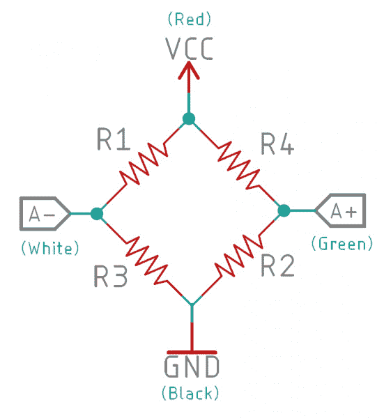](https://cdn.sparkfun.com/assets/learn_tutorials/8/8/0/SparkFun-Wheatstone-Bridge-Circuit.jpg)

一旦确定了电线对(可能是 VCC/GND 线对和 A+/A 线对),然后将这些线对连接到 Qwiic 秤。如果你按下秤上的按钮时读数下降，那么你就把 A+/A-颠倒了。如果这一比例根本不起作用，那么就交换两人一组，这样你假设的 VCC/GND 就变成了 A+/A-，反之亦然。

### 我的 1000 公斤称重传感器表现异常。

默认情况下，该库将增益设置为最大值 128，因为我们的大多数用户测量的是较小的称重传感器。如果您正在测量非常大的重量，您可能需要使用以下命令来降低增益:

```
language:c
myScale.setGain(NAU7802_GAIN_16); 
```

有`1`、`2`、`4`、`8`、`16`、`32`、`64`、`128`增益。

### 一罐汽水有多重？

我很高兴你问了，因为它在常规(394g)和节食(355.1g)之间变化，这很有趣。从虚拟化学书上了解所有相关信息:

[Vitual Chembook: Which is more dense - COKE or DIET COKE?](http://chemistry.elmhurst.edu/vchembook/121Adensitycoke.html)

## 资源和更进一步

我们希望您喜欢了解 Qwiic 秤和称重传感器。有关更多信息，请查看以下资源:

*   [示意图](https://cdn.sparkfun.com/assets/learn_tutorials/8/8/0/Qwiic_Scale.pdf)
*   [老鹰档案](https://cdn.sparkfun.com/assets/learn_tutorials/8/8/0/Qwiic_Scale.zip)
*   [NAU7802 数据表](https://cdn.sparkfun.com/assets/learn_tutorials/8/8/0/NAU7802_Data_Sheet_V1.7.pdf)
*   最新文件的回购:
    *   [Arduino 库](https://github.com/sparkfun/SparkFun_Qwiic_Scale_NAU7802_Arduino_Library)
    *   [产品回购](https://github.com/sparkfun/Qwiic_Scale)
*   [SFE 产品展示区](https://youtu.be/6-bod9ndOtY)

请务必查看其他 Qwiic 设备的连接指南，了解测量和控制世界是多么简单！

[](https://learn.sparkfun.com/tutorials/ccs811bme280-qwiic-environmental-combo-breakout-hookup-guide) [### CCS811/BME280 (Qwiic)环境组合分线连接指南](https://learn.sparkfun.com/tutorials/ccs811bme280-qwiic-environmental-combo-breakout-hookup-guide) Sense various environmental conditions such as temperature, humidity, barometric pressure, eCO2 and tVOCs with the CCS811 and BME280 combo breakout board.[Favorited Favorite](# "Add to favorites") 2[](https://learn.sparkfun.com/tutorials/qwiic-tmp117-high-precision-digital-temperature-sensor-hookup-guide) [### Qwiic TMP117 高精度数字温度传感器连接指南](https://learn.sparkfun.com/tutorials/qwiic-tmp117-high-precision-digital-temperature-sensor-hookup-guide) Add a high precision, digital temperature sensor to your projects using the TMP117 over the I2C 0[](https://learn.sparkfun.com/tutorials/garmin-lidar-lite-v4-qwiic-hookup-guide) [### Garmin LIDAR-Lite v4 (Qwiic)连接指南](https://learn.sparkfun.com/tutorials/garmin-lidar-lite-v4-qwiic-hookup-guide) Connecting the Garmin LIDAR-Lite v4 to a microcontroller just got easier! Check out our hookup guide to get started.[Favorited Favorite](# "Add to favorites") 4[](https://learn.sparkfun.com/tutorials/micromod-mikrobus-carrier-board-hookup-guide) [### MicroMod mikroBUS 载板连接指南](https://learn.sparkfun.com/tutorials/micromod-mikrobus-carrier-board-hookup-guide) This carrier board takes advantage of the MicroMod, Qwiic, and the mikroBUS™ ecosystems and allows users to take advantage of the growing number of 7 MicroMod processor boards, 83 Qwiic (add-on) boards, and +1100 drop-in Click boards™, which equates to +51M different board combinations. Click to learn more.[Favorited Favorite](# "Add to favorites") 1**