# 如何使用尺子

> 原文：<https://learn.sparkfun.com/tutorials/how-to-use-a-ruler>

## 介绍

我知道你在问什么？为什么会有一个[尺子](https://www.sparkfun.com/products/15295)的指南？这是一把尺子，我从三年级就开始用了。这是真的，但我真的想要一点额外的空间来谈论统治者的一些特点，他们是什么，为什么他们在那里。不久前，我们从 Digi-Key 的朋友那里得到了一些不错的赠品，这是一种 PCB 直尺，上面有很多信息。我们意识到了一些事情。首先，多氯联苯是很好的尺子，它们很坚固，但仍有一点可弯曲性，而且设计精确。PCB 走线的精度比尺子所需的精度高得多。第二，我意识到，通常当我需要一把尺子时，我不会担心 SOIC 包裹的大小，我宁愿尺子上有信息。所以，我开始在 Eagle 里玩，用一些我最想查的信息来设计一个。

[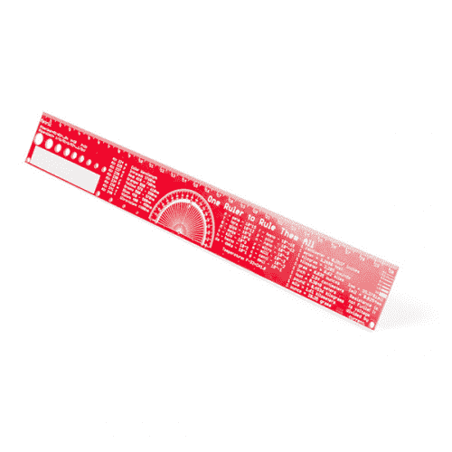](https://www.sparkfun.com/products/15295) 

将**添加到您的[购物车](https://www.sparkfun.com/cart)中！**

 **### [SparkFun PCB 直尺- 12 寸](https://www.sparkfun.com/products/15295)

[In stock](https://learn.sparkfun.com/static/bubbles/ "in stock") TOL-15295

一个统治者统治所有人。一个有用的转换和信息的 PCB 标尺。

$6.501[Favorited Favorite](# "Add to favorites") 29[Wish List](# "Add to wish list")** **## 前面

先说前面。你会看到这个名字，“一把尺子统治所有人”。除了双关语和极客参考，这只是为了让你知道这是有史以来最好的统治者。相当多的修改进入了这一点，以及问每个人，我可以找到他们想要的尺子。

*Having a hard time seeing the ruler? Click the image for a closer look.*

### 公制的

让我们从左侧开始一部分一部分地进行。你会看到这一面标有“**公制**”，这一面的所有信息都是公制的，从实际的标尺标记开始。这把尺子有 12 英寸长，也就是 30.48 厘米长，所以你会看到刻度刚好超过 30 厘米。

[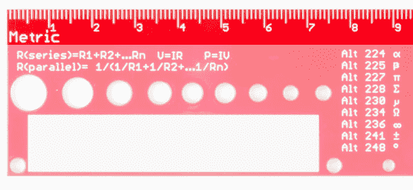](https://cdn.sparkfun.com/assets/learn_tutorials/8/8/5/15295-SparkFun_PCB_Ruler_-_12_Inch-Front1_metric.jpg)

### 电阻、欧姆和功率方程

在公制标签下，你会看到几个方程式。忘记[电阻串联或并联](https://learn.sparkfun.com/tutorials/resistors/series-and-parallel-resistors)的方程式(谁不知道)？好吧，给你。你还会发现[欧姆定律](https://learn.sparkfun.com/tutorials/voltage-current-resistance-and-ohms-law#ohms-law) (V=RI)和[功率的定义](https://learn.sparkfun.com/tutorials/electric-power#calculating-power) (P=VI)。

### 标签

在左下角你会看到一个白色的大盒子。就是它，它只是一个盒子。但是这是一个写你名字的好地方，这样人们就不会偷你的尺子(或者更有可能被提醒他们偷了谁的尺子)。您还可以使用它来添加标尺上没有的任何信息(不太可能，因为我们将所有已知的知识都放在了标尺上)。

[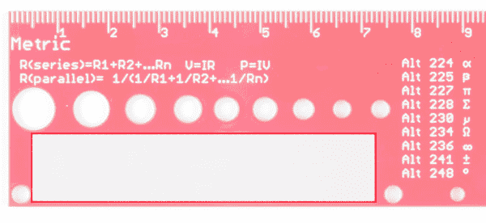](https://cdn.sparkfun.com/assets/learn_tutorials/8/8/5/15295-SparkFun_PCB_Ruler_-_12_Inch-Front1_name_label.jpg)

### 快捷键

接下来，你会看到 Alt 这个词一遍又一遍地重复出现，还有数字和奇怪的标记。嗯，那是因为我从来不记得如何正确地输入 330ω的电阻，而写出 3 会更容易些。59630.88638688666...而不是去记怎么打π。按住`alt`键，输入你看到的数字，通过魔法力量，你可以输入一个数量的字符(看我在那里做了什么...).

[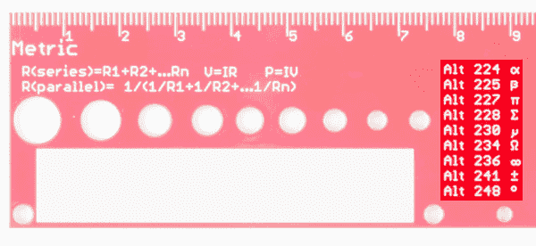](https://cdn.sparkfun.com/assets/learn_tutorials/8/8/5/15295-SparkFun_PCB_Ruler_-_12_Inch-Front1_keyboard_shortcuts.jpg)

### 光谱

接下来，我们将得到[颜色波长](https://learn.sparkfun.com/tutorials/light/all)。我见过太多只列出一个波长的 LED 数据手册。有时候你对绿色的深浅很挑剔。有时候你只想知道 LED 是绿的还是红的。这张方便的图表会让你知道。

[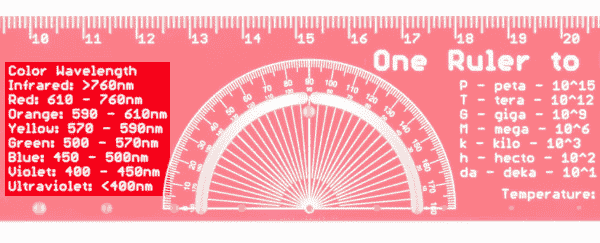](https://cdn.sparkfun.com/assets/learn_tutorials/8/8/5/15295-SparkFun_PCB_Ruler_-_12_Inch-Front2_Light_Spectrum.jpg)

### 量角器

接下来是花式量角器。如果你不知道量角器是什么，我建议你去找最近的三年级学生问问他们。你可以问数学老师，但你可能会在大约 3 分钟后睡着(就像你在三年级时一样，这就是为什么你会问量角器是什么)。这是我们必须在各种原型上不断做出的一个改变，切割出的弧是 2mm，任何更小的东西都太小了，以至于无法将笔放入，可能仍然很难将一些笔放入，但铅笔(尤其是自动铅笔)应该可以工作得很好。你还会注意到在 90 度标记处有一个小洞。这也是统治者的准确中心，也许有一天会派上用场，也许不会。

[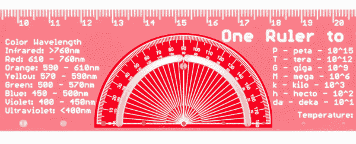](https://cdn.sparkfun.com/assets/learn_tutorials/8/8/5/15295-SparkFun_PCB_Ruler_-_12_Inch-Front2_Protractor.jpg)

### 公制前缀

接下来，我们来看看我做尺子的主要原因。我永远也记不住所有的公制前缀，所以这里列出了它们所有的优点。从 10 ^(-15) 到 10^(15)(3 的倍数)。所以下一次当你试图记住皮可和纳米哪个更小的时候，请记住你那奇特的尺子。*注意:标尺不会测量皮米或纳米，它只是帮助你转换。*

[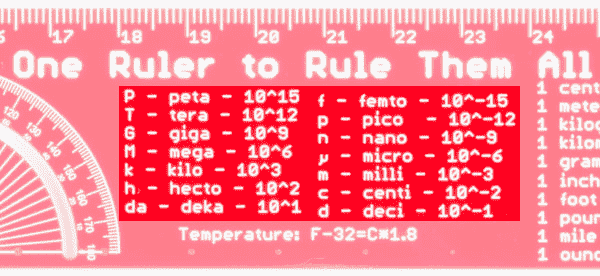](https://cdn.sparkfun.com/assets/learn_tutorials/8/8/5/15295-SparkFun_PCB_Ruler_-_12_Inch-Front_Metric_Prefixes.jpg)

### 公制和英制的转换

接下来，我们找到统治者的另一个原因。公制和英制的转换。虽然世界其他地方可能不在乎一米有多少英尺，但我们美国人(别忘了利比里亚和缅甸)有时需要把臭脚翻译成世界其他地方正在谈论的东西。

### PCB 走线宽度

在最右边，你会看到一些标记，帮助你确定 0.1 毫米线和 2.0 毫米线的区别。这实际上是设计 PCB 时有用的事情之一，了解走线的实际宽度会有所帮助。我们还增加了毫米到百万分之一的转换。

[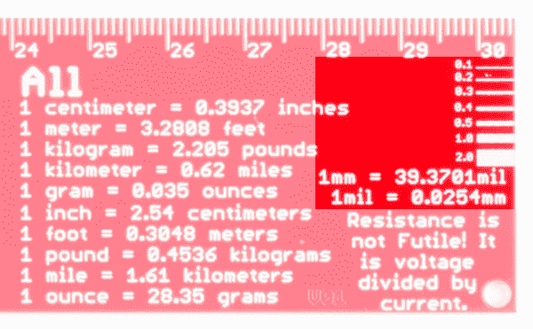](https://cdn.sparkfun.com/assets/learn_tutorials/8/8/5/15295-SparkFun_PCB_Ruler_-_12_Inch-Front3_PCB_Trace_Width.jpg)

### 欧姆定律

最后但同样重要的是，再次是欧姆定律(这一次提醒我们所有人反击博格人的一致性)。咻，那是一把尺子上的很多东西，但是等等，那只是前面...

[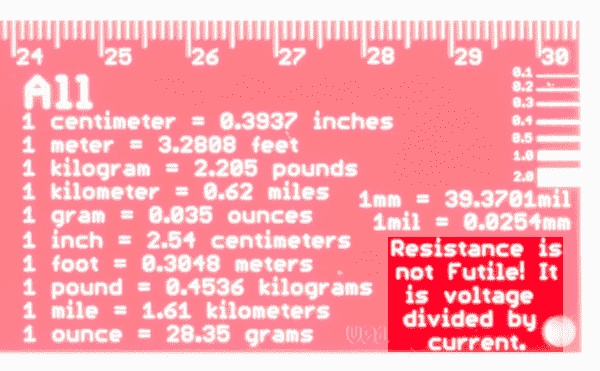](https://cdn.sparkfun.com/assets/learn_tutorials/8/8/5/15295-SparkFun_PCB_Ruler_-_12_Inch-Front3_Resistance_Spelled_Out.jpg)

## 背面

在尺子的背面。

*Having a hard time seeing the ruler? Click the image for a closer look.*

### 帝国的

从左边开始，我们看到这一面标有“**英寸**”，你可能还会注意到标尺的标记并不一致。最初的 2 英寸被分成 1/2 英寸，然后是 1/4 英寸、1/8 英寸、1/16 英寸和 1/32 英寸，因为有时这些都很重要。另外 10 英寸被分成 0.5 英寸，然后是 0.1 英寸，最后是 0.05 英寸。

[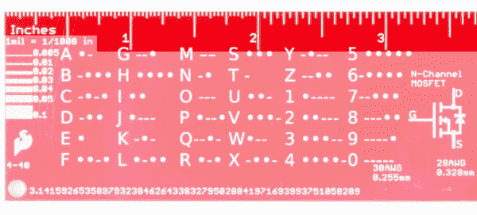](https://cdn.sparkfun.com/assets/learn_tutorials/8/8/5/15295-SparkFun_PCB_Ruler_-_12_Inch-Back1_Imperial_Inches.jpg)

### PCB 走线宽度

在英寸标识下，您还会看到 mil (1/1000 英寸)的定义，以及更多线宽标记，范围从 0.005 到 0.1 英寸(5mil 到 100mil)。

### 莫尔斯电码

接下来，你会看到一个莫尔斯电码小抄。多久有用一次？谁知道呢，但是下次有人半夜敲你的门时，你会感谢你有你的尺子。

[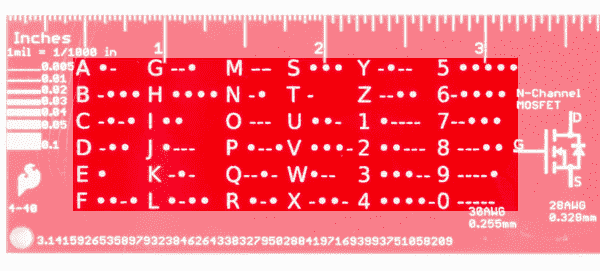](https://cdn.sparkfun.com/assets/learn_tutorials/8/8/5/15295-SparkFun_PCB_Ruler_-_12_Inch-Back1_Morse_Code.jpg)

### 圆周率的位数

在底部附近，您会看到π扩展到比任何项目所需的数字都多的数字，比您用π的知识给家人和朋友留下深刻印象所需的数字都多(实际上，忘记记住π，学会烤馅饼，他们会更感激)。如果你想知道如何打出π符号，看看尺子的前面。

[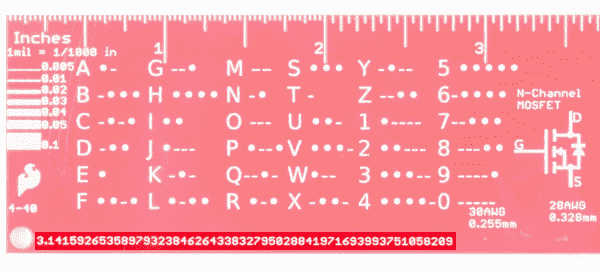](https://cdn.sparkfun.com/assets/learn_tutorials/8/8/5/15295-SparkFun_PCB_Ruler_-_12_Inch-Back1_Pi.jpg)

### 晶体管和二极管符号

接下来是一些晶体管图。似乎和我交谈过的人都不记得晶体管的配置，所以它们也在这里。

[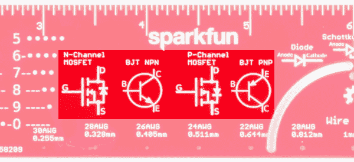](https://cdn.sparkfun.com/assets/learn_tutorials/8/8/5/15295-SparkFun_PCB_Ruler_-_12_Inch-Back_Transistors.jpg)

就在它们的右边，量角器的上方，你会发现一些二极管的图样。

[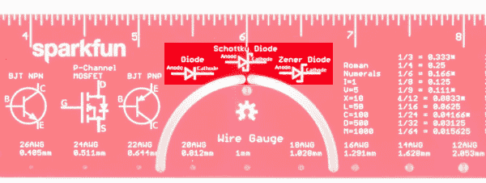](https://cdn.sparkfun.com/assets/learn_tutorials/8/8/5/15295-SparkFun_PCB_Ruler_-_12_Inch-Back2_Diodes.jpg)

### 线规

沿着底部，你会发现一些[线规](https://learn.sparkfun.com/tutorials/working-with-wire/all#wire-thickness)以及它们相应的尺寸(以毫米为单位)。我确实检查了一些，电线会非常舒适地插入正确的孔中。中间还有一个 1 毫米的孔，尽管它不对应任何电线尺寸。

### 罗马数字

接下来是罗马数字。他们为什么在那里？老实说，我不知道，我想我需要把一些东西放在那里，这似乎是合理的。老实说，在过去的 5 年里，我唯一一次看到罗马数字，是为了超级碗。但是，如果你发现自己回到了古罗马，很难读懂这些数字，你的统治者可以帮助你(尽管读懂这些数字可能是你最不担心的)。

### 分数和小数转换

另一方面，罗马人不必处理将分数转换成小数的问题。虽然你们可能都知道 1/2 是什么，但谁还记得 1/8 或更糟的 5/16 是什么。有时你需要这些数字，所以我们列出了一些更常见的值(并为重复的值加了一个*号)

[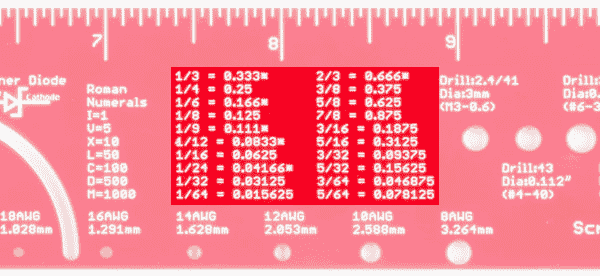](https://cdn.sparkfun.com/assets/learn_tutorials/8/8/5/15295-SparkFun_PCB_Ruler_-_12_Inch-Back_Fraction_Decimals.jpg)

### 机器螺钉和钻头尺寸

最后，是统治者最令人困惑的部分。螺钉和钻头尺寸。由于主题的复杂性，这很容易让人混淆，你会在网上找到大量的[攻丝和钻孔图表](https://littlemachineshop.com/images/gallery/PDF/TapDrillSizes.pdf)，但这应该是一些更常见尺寸的合理总结。对于给定的螺钉，您需要的钻头尺寸将根据您要钻进的材料以及您想要的配合而变化。标尺上的标记给出了螺钉的主要直径(不是孔的直径)、螺钉名称和 75%螺纹所需的钻头，75%螺纹是孔的尺寸。

[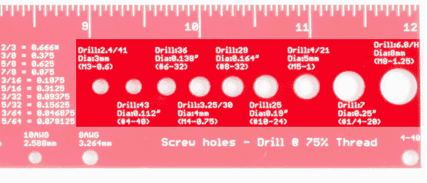](https://cdn.sparkfun.com/assets/learn_tutorials/8/8/5/15295-SparkFun_PCB_Ruler_-_12_Inch-Back3_Machine_Screw_Drill.jpg)

大概就是这样，如果你仔细看，你还会发现一些标志和版本号等等，但这是 SparkFun 统治者的基础。出去画一些直线，测量东西，转换很多东西。

## 资源和更进一步

有关更多信息，请查看以下资源:

*   [攻丝和钻孔图表](https://littlemachineshop.com/images/gallery/PDF/TapDrillSizes.pdf)
*   [更多公制转换](https://www.metric-conversions.org/)
*   [关于晶体管的更多信息](https://en.wikipedia.org/wiki/Bipolar_junction_transistor)
*   [GitHub 回购](https://github.com/sparkfun/SparkFun_PCB_Ruler)

需要一些灵感来为你的下一个项目使用尺子吗？查看这些教程:

 [### 如何安装和设置 EAGLE](https://learn.sparkfun.com/tutorials/how-to-install-and-setup-eagle) Not just how to download and install EAGLE, but how to install the SparkFun EAGLE Libraries and scripts.[Favorited Favorite](# "Add to favorites") 39 [### 使用 EAGLE:纸板布局](https://learn.sparkfun.com/tutorials/using-eagle-board-layout) Part 2 of the Using Eagle tutorials, this one covers how to lay out a board after designing a schematic.[Favorited Favorite](# "Add to favorites") 37 [### 将自定义图像导入 Eagle](https://learn.sparkfun.com/tutorials/importing-custom-images-into-eagle) How to create custom graphics and import them into Eagle for silk, copper, etc.[Favorited Favorite](# "Add to favorites") 6 [### KiCad 初学者指南](https://learn.sparkfun.com/tutorials/beginners-guide-to-kicad) An in-depth tutorial covering schematic capture, PCB layout, library editing, and gerber generation using this amazing open source PCB creation tool.[Favorited Favorite](# "Add to favorites") 17**