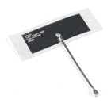
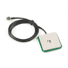
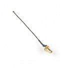
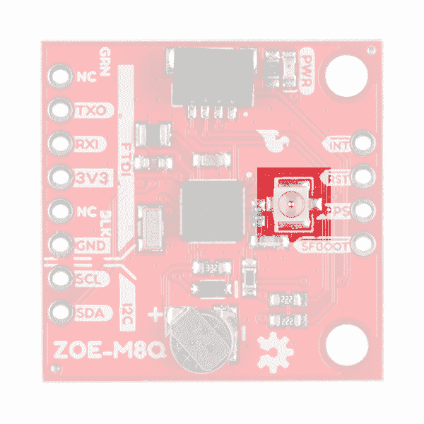
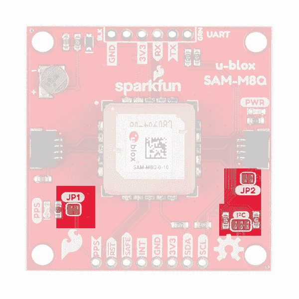
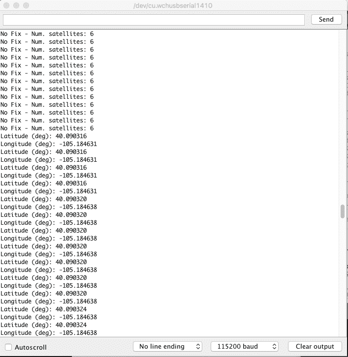

# SparkFun GPS 突破(ZOE-M8Q 和 SAM-M8Q)连接指南

> 原文：<https://learn.sparkfun.com/tutorials/sparkfun-gps-breakout-zoe-m8q-and-sam-m8q-hookup-guide>

## 介绍

SparkFun ZOE-M8Q 和 SAM-M8Q 是两个功能类似的 GPS 单元，但具有不同的项目应用。他们都有 2.5 米的水平精度！

[](https://www.sparkfun.com/products/15193) 

将**添加到您的[购物车](https://www.sparkfun.com/cart)中！**

 **### [【spark fun GPS Breakout-ZOE-M8Q(Qwiic)](https://www.sparkfun.com/products/15193)

[In stock](https://learn.sparkfun.com/static/bubbles/ "in stock") GPS-15193

SparkFun ZOE-M8Q GPS Breakout 是一款高精度、小型化的 GPS 板，非常适合不支持

$49.957[Favorited Favorite](# "Add to favorites") 8[Wish List](# "Add to wish list")****[](https://www.sparkfun.com/products/15210) 

将**添加到您的[购物车](https://www.sparkfun.com/cart)中！**

 **### [【spark fun】GPS 分线芯片天线，SAM-M8Q (Qwiic)](https://www.sparkfun.com/products/15210)

[In stock](https://learn.sparkfun.com/static/bubbles/ "in stock") GPS-15210

SparkFun SAM-M8Q GPS Breakout 是一款高质量的 GPS 板，具有同样令人印象深刻的配置选项。

$42.954[Favorited Favorite](# "Add to favorites") 17[Wish List](# "Add to wish list")**** ****[https://www.youtube.com/embed/80zvUz1v8uI/?autohide=1&border=0&wmode=opaque&enablejsapi=1](https://www.youtube.com/embed/80zvUz1v8uI/?autohide=1&border=0&wmode=opaque&enablejsapi=1)

### 所需材料

要跟随本教程，您将需要以下材料。你可能不需要所有的东西，这取决于你拥有什么。将它添加到您的购物车，通读指南，并根据需要调整购物车。

[](https://www.sparkfun.com/products/15123) 

将**添加到您的[购物车](https://www.sparkfun.com/cart)中！**

 **### [spark fun RedBoard Qwiic](https://www.sparkfun.com/products/15123)

[In stock](https://learn.sparkfun.com/static/bubbles/ "in stock") DEV-15123

SparkFun RedBoard Qwiic 是一款 Arduino 兼容开发板，内置 Qwiic 连接器，无需…

$21.5014[Favorited Favorite](# "Add to favorites") 49[Wish List](# "Add to wish list")****[](https://www.sparkfun.com/products/14427) 

将**添加到您的[购物车](https://www.sparkfun.com/cart)中！**

 **### [Qwiic 线缆- 100mm](https://www.sparkfun.com/products/14427)

[In stock](https://learn.sparkfun.com/static/bubbles/ "in stock") PRT-14427

这是一条 100 毫米长的 4 芯电缆，带有 1 毫米 JST 端接。它旨在将支持 Qwiic 的组件连接在一起…

$1.50[Favorited Favorite](# "Add to favorites") 32[Wish List](# "Add to wish list")****[](https://www.sparkfun.com/products/15246) 

将**添加到您的[购物车](https://www.sparkfun.com/cart)中！**

 **### [【Molex】柔性 GNSS 天线-U . FL](https://www.sparkfun.com/products/15246)

[In stock](https://learn.sparkfun.com/static/bubbles/ "in stock") GPS-15246

具有 U.FL 连接器和背胶的柔性纸薄 GNSS 天线。

$4.501[Favorited Favorite](# "Add to favorites") 7[Wish List](# "Add to wish list")****** ******#### 附加 GPS 天线选项

以下是一些其他的 GPS 天线选项。下面的一些选项有一个 SMA 连接器，所以如果你决定使用它们，确保得到 u.FL 到 SMA 电缆。链接在下面的 GPS 附件中。如果您想尝试不同的芯片天线，请尝试下面列出的 [GNSS 天线评估板](https://www.sparkfun.com/products/15247),并确保附件中有 u.FL 到 u.FL 的连接器。

[](https://www.sparkfun.com/products/14986) 

将**添加到您的[购物车](https://www.sparkfun.com/cart)中！**

 **### [【GPS/GNSS 磁悬挂天线- 3m (SMA)](https://www.sparkfun.com/products/14986)

[In stock](https://learn.sparkfun.com/static/bubbles/ "in stock") GPS-14986

这款出色的 GPS/GNSS 天线专为 GPS 和 GLONASS 接收而设计。

$13.953[Favorited Favorite](# "Add to favorites") 7[Wish List](# "Add to wish list")****[](https://www.sparkfun.com/products/177) 

将**添加到您的[购物车](https://www.sparkfun.com/cart)中！**

 **### [GPS 嵌入式天线 SMA](https://www.sparkfun.com/products/177)

[Out of stock](https://learn.sparkfun.com/static/bubbles/ "out of stock") GPS-00177

适合小型移动应用的嵌入式天线。带 LNA 的基本无包装天线。5 英寸电缆端接标准公…

$12.95[Favorited Favorite](# "Add to favorites") 10[Wish List](# "Add to wish list")****[](https://www.sparkfun.com/products/14987) 

将**添加到您的[购物车](https://www.sparkfun.com/cart)中！**

 **### [](https://www.sparkfun.com/products/14987)

[33 available](https://learn.sparkfun.com/static/bubbles/ "33 available") GPS-14987

这款三频 GNSS 天线非常适合 GPS L1、GLONASS L1 和北斗 B2 接收。

$64.50[Favorited Favorite](# "Add to favorites") 3[Wish List](# "Add to wish list")****[](https://www.sparkfun.com/products/15247) 

将**添加到您的[购物车](https://www.sparkfun.com/cart)中！**

 **### [SparkFun GNSS 芯片天线评估板](https://www.sparkfun.com/products/15247)

[In stock](https://learn.sparkfun.com/static/bubbles/ "in stock") GPS-15247

SparkFun GNSS 芯片天线评估板可以轻松测试各种尺寸的 GPS 天线和几何形状。

$28.50 $14.251[Favorited Favorite](# "Add to favorites") 9[Wish List](# "Add to wish list")******** ********#### GPS 天线附件

[](https://www.sparkfun.com/products/9145) 

将**添加到您的[购物车](https://www.sparkfun.com/cart)中！**

 **### [接口电缆 SMA 到 U . FL](https://www.sparkfun.com/products/9145)

[Out of stock](https://learn.sparkfun.com/static/bubbles/ "out of stock") WRL-09145

这是一条 4 英寸的连接器电缆，可将 U.FL 射频连接器连接到常规 SMA 连接器。这种电缆通常用于连接…

$5.503[Favorited Favorite](# "Add to favorites") 19[Wish List](# "Add to wish list")****[](https://www.sparkfun.com/products/17519) 

将**添加到您的[购物车](https://www.sparkfun.com/cart)中！**

 **### [GPS 天线接地板](https://www.sparkfun.com/products/17519)

[In stock](https://learn.sparkfun.com/static/bubbles/ "in stock") GPS-17519

使用这种简单的钢板可以有效地将简单贴片天线的性能提高到接近专业水平的天线设置…

$6.95[Favorited Favorite](# "Add to favorites") 7[Wish List](# "Add to wish list")****[](https://www.sparkfun.com/products/15114) 

将**添加到您的[购物车](https://www.sparkfun.com/cart)中！**

 **### [U.FL 到 U.FL 迷你同轴电缆- 200mm](https://www.sparkfun.com/products/15114)

[Only 9 left!](https://learn.sparkfun.com/static/bubbles/ "only 9 left!") WRL-15114

这个可爱的小同轴电缆是我们的射频套件冠军！它两端都有一个直角母 U.FL(又名 I-PEX)连接器。现在本…

$1.95[Favorited Favorite](# "Add to favorites") 2[Wish List](# "Add to wish list")****** ******#### 其他 Qwiic 电缆附件

[](https://www.sparkfun.com/products/15081) 

将**添加到您的[购物车](https://www.sparkfun.com/cart)中！**

 **### [SparkFun Qwiic 线缆套件](https://www.sparkfun.com/products/15081)

[In stock](https://learn.sparkfun.com/static/bubbles/ "in stock") KIT-15081

为了更容易上手，我们用 50 毫米到 500 毫米的各种 Qwiic 电缆组装了 Qwiic 电缆套件…

$8.9516[Favorited Favorite](# "Add to favorites") 58[Wish List](# "Add to wish list")****[](https://www.sparkfun.com/products/14427) 

将**添加到您的[购物车](https://www.sparkfun.com/cart)中！**

 **### [Qwiic 线缆- 100mm](https://www.sparkfun.com/products/14427)

[In stock](https://learn.sparkfun.com/static/bubbles/ "in stock") PRT-14427

这是一条 100 毫米长的 4 芯电缆，带有 1 毫米 JST 端接。它旨在将支持 Qwiic 的组件连接在一起…

$1.50[Favorited Favorite](# "Add to favorites") 32[Wish List](# "Add to wish list")****[](https://www.sparkfun.com/products/14426) 

将**添加到您的[购物车](https://www.sparkfun.com/cart)中！**

 **### [Qwiic 线缆- 50mm](https://www.sparkfun.com/products/14426)

[In stock](https://learn.sparkfun.com/static/bubbles/ "in stock") PRT-14426

这是一根 50 毫米长的 4 芯电缆，带有 1 毫米 JST 端接。它旨在将支持 Qwiic 的组件连接在一起…

$0.95[Favorited Favorite](# "Add to favorites") 29[Wish List](# "Add to wish list")****[](https://www.sparkfun.com/products/14428) 

### [Qwiic 线缆- 200mm](https://www.sparkfun.com/products/14428)

[Out of stock](https://learn.sparkfun.com/static/bubbles/ "out of stock") PRT-14428

这是一根 200 毫米长的 4 芯电缆，带有 1 毫米 JST 端接。它旨在将支持 Qwiic 的组件连接在一起…

[Favorited Favorite](# "Add to favorites") 21[Wish List](# "Add to wish list")**************Heads up!** If you are using the [RedBoard **without** a Qwiic connector](https://www.sparkfun.com/products/13975), we recommend getting the Qwiic Shield for Arduino.

[](https://www.sparkfun.com/products/14352) 

将**添加到您的[购物车](https://www.sparkfun.com/cart)中！**

 **### [ArduinoT3 的 SparkFun Qwiic 盾](https://www.sparkfun.com/products/14352)

[In stock](https://learn.sparkfun.com/static/bubbles/ "in stock") DEV-14352

SparkFun Qwiic Shield 是一种易于组装的板，它提供了一种简单的方法来将 Qwiic Connect 系统与

$7.508[Favorited Favorite](# "Add to favorites") 39[Wish List](# "Add to wish list")** **### 推荐阅读

如果你不熟悉 Qwiic 系统，我们推荐你在这里阅读[以获得一个概述](https://www.sparkfun.com/qwiic)。

| [](https://www.sparkfun.com/qwiic) |
| *[Qwiic 连接系统](https://www.sparkfun.com/qwiic)* |

如果你不熟悉下面的教程，我们也建议你看一看。

[](https://learn.sparkfun.com/tutorials/gps-basics) [### GPS 基础知识](https://learn.sparkfun.com/tutorials/gps-basics) The Global Positioning System (GPS) is an engineering marvel that we all have access to for a relatively low cost and no subscription fee. With the correct hardware and minimal effort, you can determine your position and time almost anywhere on the globe.[Favorited Favorite](# "Add to favorites") 31[](https://learn.sparkfun.com/tutorials/serial-peripheral-interface-spi) [### 串行外设接口(SPI)](https://learn.sparkfun.com/tutorials/serial-peripheral-interface-spi) SPI is commonly used to connect microcontrollers to peripherals such as sensors, shift registers, and SD cards.[Favorited Favorite](# "Add to favorites") 91[](https://learn.sparkfun.com/tutorials/i2c) [### I2C](https://learn.sparkfun.com/tutorials/i2c) An introduction to I2C, one of the main embedded communications protocols in use today.[Favorited Favorite](# "Add to favorites") 128[](https://learn.sparkfun.com/tutorials/how-to-work-with-jumper-pads-and-pcb-traces) [### 如何使用跳线焊盘和 PCB 走线](https://learn.sparkfun.com/tutorials/how-to-work-with-jumper-pads-and-pcb-traces) Handling PCB jumper pads and traces is an essential skill. Learn how to cut a PCB trace, add a solder jumper between pads to reroute connections, and repair a trace with the green wire method if a trace is damaged.[Favorited Favorite](# "Add to favorites") 11[](https://learn.sparkfun.com/tutorials/getting-started-with-u-center-for-u-blox) [### u-blox 的 U-Center 入门](https://learn.sparkfun.com/tutorials/getting-started-with-u-center-for-u-blox) Learn the tips and tricks to use the u-blox software tool to configure your GPS receiver.[Favorited Favorite](# "Add to favorites") 2[](https://learn.sparkfun.com/tutorials/three-quick-tips-about-using-ufl) [### 关于使用 U.FL 的三个快速提示](https://learn.sparkfun.com/tutorials/three-quick-tips-about-using-ufl) Quick tips regarding how to connect, protect, and disconnect U.FL connectors.[Favorited Favorite](# "Add to favorites") 14

## SparkFun ZOE-M8Q 硬件概述

### 力量

该板的电源应为 **3.3V** 。电路板侧面的 PTH 接头上有一个 3.3V 引脚，但您也可以通过 Qwiic 连接器供电。

### 电池

Qwiic 连接器对面的小金属盘是一个小锂电池。这种电池不像 3.3V 系统那样向 IC 供电，而是向 IC 内部的相关系统*供电，从而允许快速重新连接到卫星。第一次修复的时间大约为 **~29 秒**，但是在产品锁定后，电池将允许有**一秒**的时间进行第一次修复。这称为**热启动**，在主板断电后持续四个小时。电池为备用系统提供超过一年的电力，当主板通电时充电缓慢。*

[](https://cdn.sparkfun.com/assets/learn_tutorials/8/6/9/BATTERY.jpg)

### 发光二极管

在 Qwiic 连接器的正上方有一个红色的电源 LED，表示主板已通电。

[](https://cdn.sparkfun.com/assets/learn_tutorials/8/6/9/PowerLED.jpg)

### 针织套衫

产品下面有三个跳线，每个都标有其功能。图片左上角的第一个是标记为`I²C`的三路跳线，它将两个上拉电阻连接到 I ² C 数据线。如果你的 I ² C 数据线上有很多器件，那么你可以考虑砍掉这些。在板子最边缘的跳线右边是`LED`跳线。如果你切断这条线，它将断开电路板顶部的**电源** LED。最后，左下方是`SPI`跳线，当其关闭时，启用 **SPI** 通信。电路板默认为 I ² C，串行如此接近，如果你想通过 SPI 获得 NMEA 数据。

[](https://cdn.sparkfun.com/assets/learn_tutorials/8/6/9/Jumpers.jpg)

### 单位 FL 连接器

板上的 U.FL 连接器是您插入天线的地方。这是一款用于射频天线的紧凑型连接器，具有与传统 SMA 连接器相同的功能。你可能更熟悉，甚至拥有一些使用 SMA 连接器的天线；别担心，我们带了一个 [U.FL 到 SMA](https://www.sparkfun.com/products/15114) 的线缆适配器。如果这是你第一次使用 U.FL 连接器，请查看我们的[教程。](https://learn.sparkfun.com/tutorials/three-quick-tips-about-using-ufl)

[](https://cdn.sparkfun.com/assets/learn_tutorials/8/6/9/uFL.jpg)

### FTDI 标题

在电路板的底部，我们有传统的 FTDI 接头引脚排列。确保您使用的 FTDI 是 **3.3V** 而不是 5V！

[](https://cdn.sparkfun.com/assets/learn_tutorials/8/6/9/ZOE_FTDI_HEADER.jpg)

### Qwiic 和 I ² C

在电路板底部的 FTDI 接头旁边，有两个标记为`SDA`和`SCL`的引脚，表示 I ² C 数据线。同样，您可以使用图片左侧的 Qwiic 连接器。 [Qwiic 生态系统](https://www.sparkfun.com/qwiic)通过消除焊接需求来实现快速原型制作。您只需将 qw IC 电缆插入 qw IC 连接器，瞧！

The only I²C address for this and all u-Blox GPS products is **0x42**, though each can have their address changed through software.[](https://cdn.sparkfun.com/assets/learn_tutorials/8/6/9/Qwiic_I2C_ZOE.jpg)

### SPI 标头

这使得 ZOE-M8Q 有别于 SAM-M8Q。如上所述，产品底部有一个跳线，可以关闭以允许 SPI 通信。该接头贴有标签，用于 SPI 引脚排列。

[](https://cdn.sparkfun.com/assets/learn_tutorials/8/6/9/SPI_HEADER.jpg)

### 折断的针脚

还有另外四个管脚:每秒脉冲`PPS`，复位`RST`，安全启动`SAFE`，最后是中断管脚`INT`。第一个引脚`PPS`输出与 GPS 或 UTC 时间网格同步的脉冲序列。信号默认为每秒一次，但可以在很大范围内配置。阅读资源选项卡中的 **u-blox 接收器协议规范**了解更多信息。reset 引脚复位芯片。下一个引脚`SAFE`用于在安全引导模式下启动 IC。最后一个引脚`INT`可用于将芯片从省电模式中唤醒。

[](https://cdn.sparkfun.com/assets/learn_tutorials/8/6/9/EXTRA_FUNCTIONALITY_HEADER.jpg)

### GPS 功能

ZOE-M8 能够同时连接多达三个不同的 GNSS 星座，使其大小非常准确。下面列出了 GPS 装置的功能。

|  | 全球导航卫星系统（global navigation satellite system） | GPS 和 GLONASS | 全球（卫星）定位系统 | GLONASS | 北斗 | “伽利略”号 |
| **水平位置精度** |  | 250 万 | 250 万 | 4m | 3m | - |
| **最大导航更新率** | 只读存储器 | 10Hz | 18Hz | 18Hz | 18Hz | 18Hz |  |
|  | 闪光 | 5Hz | 10Hz | 10Hz | 10Hz | 10Hz |
| **首次定位时间** | 冷启动 | 26s | 29 岁 | 30 秒 | 34s | 45s |
|  | 热起动 | 1s | 1s | 1s | 1s | 1s |
| **灵敏度** | 跟踪和导航 | -167dBm | -166dBm | -166dBm | -160dBm | -159dBm |
|  | 重新获得 | -160dBm | -160dBm | -156dBm | -157dBm | -153dBm |
|  | 冷启动 | -148dBm | -148dBm | -145dBm | -143dBm | -138dBm |
|  | 热起动 | -157dBm | -157dBm | -156dBm | -155dBm | -151dBm |
| **速度精度** | 0.05 米/秒 |  |  |  |  |  |
| **航向精度** | 0.3 度 |  |  |  |  |  |

### 电路板尺寸

该板使用 1.0 英寸 x1.0 英寸的典型 Qwiic 板尺寸。由于电路板和元件的尺寸，电路板上有两个安装孔。

[](https://cdn.sparkfun.com/assets/learn_tutorials/8/6/9/SparkFun_ZOE-M8Q_Board_Dimensions.png)

## SparkFun SAM-M8Q 硬件概述

### 力量

该板的电源为 **3.3V** 。电路板侧面的 PTH 接头上有一个 3.3V 引脚，但您也可以通过 Qwiic 连接器供电。

### 电池

左上角的小金属盘是小锂电池。这种电池不像 3.3V 系统那样向 IC 供电，而是向 IC 内部的相关系统*供电，从而允许快速重新连接到卫星。第一次修复的时间大约为 **~29 秒**，但是当它锁定后，电池将允许一秒的时间进行第一次修复。这称为**热启动**，在主板断电后持续四个小时。电池为备用系统提供超过一年的电力，当主板通电时充电缓慢。*

[](https://cdn.sparkfun.com/assets/learn_tutorials/8/6/9/SAM_battery.jpg)

### 发光二极管

在 Qwiic 连接器的正上方有一个红色的电源 LED，表示主板已通电。还有另一个标记为`PPS`的 LED，它连接到 GPS 芯片上的每秒*脉冲*线上。当连接到卫星时，这条线路产生一个与 GPS 或 UTC 时间网格同步的脉冲。默认情况下，你会看到每秒一个脉冲。

[](https://cdn.sparkfun.com/assets/learn_tutorials/8/6/9/SAM_LEDs.jpg)

### 针织套衫

产品顶部有三个跳线，每个都标有其功能。在图片的右下方是一个标记为`I²C`的三路跳线，它将两个上拉电阻连接到 I ² C 数据线。如果你的 I ² C 数据线上有很多器件，那么你可以考虑砍掉这些。那个跳线的正上方是`JP2`跳线。如果你切断这条线，它将断开 Qwiic 连接器正上方的**电源** LED。最后，产品的左侧是`JP1`跳线，当切断时会断开 **PPS** LED。

[](https://cdn.sparkfun.com/assets/learn_tutorials/8/6/9/Jumpers_SAM.jpg)

### 芯片天线

这个位于 PCB 中心的 GPS 单元对你来说可能看起来有点古怪。事实上，你可能会想，“哇，这看起来很像 GNSS 天线……”。亲爱的导购员，你真聪明。这款 GPS IC 实际上内置在天线中，为您提供一体化的 GPS 解决方案。

[](https://cdn.sparkfun.com/assets/learn_tutorials/8/6/9/Chip_Antenna_SAM.jpg)

### FTDI 标题

在电路板的顶部，我们有传统的 FTDI 接头引脚排列。确保您使用的 FTDI 是 **3.3V** 而不是 5V！

[](https://cdn.sparkfun.com/assets/learn_tutorials/8/6/9/FTDI_SAM.jpg)

### Qwiic 和 I ² C

在棋盘的另一边。有两个标记为`SDA`和`SCL`的引脚，表示 I ² C 数据线。同样，您可以使用 Qwiic 连接器中的任何一个来供电并利用 I²c。[Qwiic 生态系统](https://www.sparkfun.com/qwiic)通过消除焊接需求来实现快速原型制作。您只需将 qw IC 电缆插入 qw IC 连接器，瞧！

The only I²C address for this and all u-Blox GPS products is **0x42**, though each can have their address changed through software.[](https://cdn.sparkfun.com/assets/learn_tutorials/8/6/9/Qwiic_Connectors_I2C_SAM.jpg)

### 折断的针脚

还有另外四个管脚:每秒脉冲`PPS`，复位`RST`，安全启动`SAFE`，最后是中断管脚`INT`。第一个引脚`PPS`输出与 GPS 或 UTC 时间网格同步的脉冲序列。信号默认为每秒一次，但可以在很大范围内配置。阅读资源选项卡中的 **u-blox 接收器协议规范**了解更多信息。reset 引脚复位芯片。下一个引脚`SAFE`用于在安全引导模式下启动 IC。最后一个引脚`INT`可用于将芯片从省电模式中唤醒。

[](https://cdn.sparkfun.com/assets/learn_tutorials/8/6/9/Extra_function_header_SAM.jpg)

### GPS 功能

SAM-M8 能够一次连接多达三个不同的 GNSS 星座，使其大小非常精确。下面列出了 GPS 装置的功能。

|  | 全球导航卫星系统（global navigation satellite system） | GPS 和 GLONASS | 全球（卫星）定位系统 | GLONASS | “伽利略”号 |
| **水平位置精度** |  | 250 万 | 250 万 | 8m | - |
| **最大导航更新率** | 只读存储器 | 10Hz | 18Hz | 18Hz | 18Hz |  |
| **首次定位时间** | 冷启动 | 26s | 29 岁 | 30 秒 | - |
|  | 热起动 | 1s | 1s | 1s | - |
| **灵敏度** | 跟踪和导航 | -165dBm | -164dBm | -164dBm | -157dBm |
|  | 重新获得 | -158dBm | -158dBm | -154dBm | -151dBm |
|  | 冷启动 | -146dBm | -146dBm | -143dBm | -136dBm |
|  | 热起动 | -155dBm | -155dBm | -154dBm | -149dBm |
| **速度精度** | 0.05 米/秒 |  |  |  |  |
| **航向精度** | 0.3 度 |  |  |  |  |

### 电路板尺寸

该板为 1.6 英寸 x1.6 英寸，略大于典型的 Qwiic 板。该板的每个角上都有四个安装孔。

[](https://cdn.sparkfun.com/assets/learn_tutorials/8/6/9/SparkFun_SAM-M8Q_Board_Dimensions.png)

## 我应该选择哪个 GPS 单元？！

### 尺寸和 GNSS 天线

在每个硬件概述部分，我们展示了两个 GPS 板的特性。让我们从主板之间更明显的差异开始。SAM-M8Q 是一款更大的主板，尺寸为 1.6 x 1.6 英寸。相对较大尺寸的电路板有助于增强产品的 GNSS 天线，该天线将 GPS 单元*安装在*内。ZOE-M8Q 是 1 x 1 英寸的板，没有*没有*板载 GNSS 天线，而是有一个 U.FL 连接器来连接外部天线。这使您可以选择使用可以连接到外部的东西，而 GPS 单元在内部连接到您的微控制器。如果您想尝试多种不同的天线形状和尺寸，我们有一款 [GNSS 评估板](https://www.sparkfun.com/products/15247)，可以帮助您找到最适合您项目的天线。

[](https://cdn.sparkfun.com/assets/learn_tutorials/8/6/9/GPS_Module_ZOE-M8Q__GPS_SAM-M8Q_Hookup_Guide-04.jpg)

### GPS 能力比较

这两个 GPS 单元在性能上非常相似，差异可以忽略不计。两者之间的一个区别是，SAM-M8Q 不连接到中国 GNSS 北斗星座。

### NMEA 数据

两者都有 I ² C 和串行能力来接收你的 NMEA 数据，但只有 ZOE-M8Q 有 SPI 能力。通过关闭产品底部标有`SPI`的跳线启用 SPI。

[](https://cdn.sparkfun.com/assets/learn_tutorials/8/6/9/SPI_Underside_ZOE.jpg)

## 硬件装配

对于这个例子，我使用了一个支持 Qwiic 的[红板](https://www.sparkfun.com/products/15123)和[相关的 USB 电缆](https://www.sparkfun.com/products/10215)。有了它和一根 Qwiic 电缆，组装就非常简单了。在 RedBoard 和 GPS 单元之间插入 Qwiic 电缆，并将天线连接到 U.FL 连接器。如果你需要插入 U.FL 连接器的技巧，那么看看我们的 [U.FL 教程](https://learn.sparkfun.com/tutorials/three-quick-tips-about-using-ufl)。如果你要将[焊接](https://learn.sparkfun.com/tutorials/how-to-solder-through-hole-soldering)到通孔引脚，那么只需将线连接到电源、地线，并将 I ² C 数据线连接到你选择的微控制器。当然，如果你使用的是 SAM-M8Q，那么你就不需要天线了，因为它已经有一个天线了。

[](https://cdn.sparkfun.com/assets/learn_tutorials/8/6/9/GPS_Module_ZOE-M8Q__GPS_SAM-M8Q_Hookup_Guide-01.jpg)*RedBoard Qwiic and the ZOE-M8Q with attached Adhesive Antenna*[](https://cdn.sparkfun.com/assets/learn_tutorials/8/6/9/GPS_Module_ZOE-M8Q__GPS_SAM-M8Q_Hookup_Guide-03.jpg)*RedBoard Qwiic and the SAM-M8Q*

## SparkFun u-blox Arduino 图书馆

**Note:** This example assumes you are using the latest version of the Arduino IDE on your desktop. If this is your first time using Arduino, please review our tutorial on [installing the Arduino IDE.](https://learn.sparkfun.com/tutorials/installing-arduino-ide) If you have not previously installed an Arduino library, please check out our [installation guide.](https://learn.sparkfun.com/tutorials/installing-an-arduino-library)

SAM-M8Q 和 ZOE-M8Q 共享同一个库。这两个还与他们的其他 u-BLOX 大学精度更高的[堂兄弟](https://www.sparkfun.com/products/15136)共享一个库。SparkFun U-blox Arduino 库可以通过搜索“ **SparkFun u-blox GNSS** ”使用 Arduino 库管理器下载，或者您可以从 [GitHub 库](https://github.com/sparkfun/SparkFun_u-blox_GNSS_Arduino_Library)获取 zip 文件:

[SparkFun u-blox GNSS Arduino Library (ZIP)](https://github.com/sparkfun/SparkFun_u-blox_GNSS_Arduino_Library/archive/main.zip)

这里提供了 13 个例子来帮助你从太空中接收信息。

## 示例代码

我们只看示例二(即“ **Example2_NMEAParsing.ino** ”)，在我看来，它清楚地表明了这些 GPS 接收机的神奇之处。也就是说，与卫星对话，找出你在世界上的什么地方。

```
language:c
#include <Wire.h> //Needed for I2C to GPS

#include <SparkFun_u-blox_GNSS_Arduino_Library.h> //Click here to get the library:  http://librarymanager/All#SparkFun_u-blox_GNSS
SFE_UBLOX_GNSS myGNSS;

void setup()
{
  Serial.begin(115200);
  Serial.println("SparkFun u-blox Example");

  Wire.begin();

  if (myGNSS.begin() == false)
  {
    Serial.println(F("u-blox GNSS module not detected at default I2C address. Please check wiring. Freezing."));
    while (1);
  }

  //This will pipe all NMEA sentences to the serial port so we can see them
  myGNSS.setNMEAOutputPort(Serial);
}

void loop()
{
  myGNSS.checkUblox(); //See if new data is available. Process bytes as they come in.

  delay(250); //Don't pound too hard on the I2C bus
} 
```

当你上传这段代码时，你需要等待 29 秒才能锁定任何卫星。在第一次锁定之后，板上的备用电池将为一些内部系统提供电力，这将允许下次打开板时进行**热启动**。**热启动**只持续四个小时，但允许你在一秒钟内锁定。锁定后，[串行终端](https://learn.sparkfun.com/tutorials/terminal-basics/arduino-serial-monitor-windows-mac-linux)将开始列出经度和纬度坐标，如下图所示。确保将串行监视器设置为 **115200 波特**。

[](https://cdn.sparkfun.com/assets/learn_tutorials/8/6/9/nmeaCapture-ublox2.jpg)These are the coordinates for SparkFun HQ

## 资源和更进一步

既然您已经成功地安装并运行了 ZOE-M8Q/SAM-M8Q GPS 接收机，那么是时候将它集成到您自己的项目中了！

有关更多信息，请查看以下资源:

*   SparkFun u-Blox ZOE-M8Q
    *   [示意图(PDF)](https://cdn.sparkfun.com/assets/learn_tutorials/8/6/9/SparkFun_ZOE-M8Q_GPS_Schematic.pdf)
    *   [老鹰档案](https://cdn.sparkfun.com/assets/e/d/6/0/0/SparkFun_ZOE-M8Q_GPS.zip)
    *   [数据表(PDF)](https://cdn.sparkfun.com/assets/learn_tutorials/8/6/9/ZOE-M8_DataSheet__UBX-16008094_.pdf)
    *   [集成手册(PDF)](https://cdn.sparkfun.com/assets/c/7/3/2/5/ZOE-M8_HIM__UBX-16030136_.pdf)
    *   [产品摘要(PDF)](https://cdn.sparkfun.com/assets/7/5/1/8/3/ZOE-M8_ProductSummary__UBX-16005908_.pdf)
    *   [u-blox 协议规范(PDF)](https://cdn.sparkfun.com/assets/learn_tutorials/8/6/9/u-blox8-M8_ReceiverDescrProtSpec__UBX-13003221__Public.pdf)
    *   [优信软件](https://www.u-blox.com/en/product/u-center)
    *   开源代码库
        *   [产品回购](https://github.com/sparkfun/SparkFun_u-blox_ZOE-M8)
        *   [SparkFun u-blox GNSS Arduino 库](https://github.com/sparkfun/SparkFun_u-blox_GNSS_Arduino_Library)
        *   [SFE 产品展示区](https://youtu.be/80zvUz1v8uI)
*   SparkFun u-Blox SAM-M8Q
    *   [示意图(PDF)](https://cdn.sparkfun.com/assets/learn_tutorials/8/6/9/SparkFun_Ublox_SAM-M8Q_Schematic.pdf)
    *   [老鹰文件(ZIP)](https://cdn.sparkfun.com/assets/learn_tutorials/8/6/9/SparkFun_SAM-M8Q_Eagle_Files.zip)
    *   [数据表(PDF)](https://cdn.sparkfun.com/assets/learn_tutorials/8/6/9/SAM-M8Q_DataSheet__UBX-16012619_.pdf)
    *   [集成手册(PDF)](https://cdn.sparkfun.com/assets/5/d/d/2/3/SAM-M8Q_HardwareIntegrationManual__UBX-16018358_.pdf)
    *   [u-blox 协议规范(PDF)](https://cdn.sparkfun.com/assets/0/b/0/f/7/u-blox8-M8_ReceiverDescrProtSpec__UBX-13003221__Public.pdf)
    *   [优信软件](https://www.u-blox.com/en/product/u-center)
    *   开源代码库
        *   [产品回购](https://github.com/sparkfun/SparkFun_u-blox_SAM-M8Q)
        *   [SparkFun u-blox GNSS Arduino 库](https://github.com/sparkfun/SparkFun_u-blox_GNSS_Arduino_Library)
        *   [SFE 产品展示区](https://youtu.be/80zvUz1v8uI)

您是否正在寻找一款具有*疯狂*10 毫米 3D 精度的 GPS 接收机？然后看看下面 SparkFun 的这些基于 u-Blox 的 GPS 板。

[](https://www.sparkfun.com/products/15136) 

将**添加到您的[购物车](https://www.sparkfun.com/cart)中！**

 **### [【spark fun GPS-RTK 2 Board-ZED-F9P(Qwiic)](https://www.sparkfun.com/products/15136)

[In stock](https://learn.sparkfun.com/static/bubbles/ "in stock") GPS-15136

SparkFun GPS-RTK2 是 ZED-F9P 模块的一个强大突破。ZED-F9P 是 GNSS 和 GPS 系统的顶级模块

$274.9521[Favorited Favorite](# "Add to favorites") 61[Wish List](# "Add to wish list")****[](https://www.sparkfun.com/products/15005) 

将**添加到您的[购物车](https://www.sparkfun.com/cart)中！**

 **### [【spark fun GPS-RTK 板- NEO-M8P-2 (Qwiic)](https://www.sparkfun.com/products/15005)

[In stock](https://learn.sparkfun.com/static/bubbles/ "in stock") GPS-15005

SparkFun GPS-RTK 板是 u-blox NEO-M8P-2 模块的一个强大突破。NEO-M8P-2 是一款顶级的移动…

$264.956[Favorited Favorite](# "Add to favorites") 22[Wish List](# "Add to wish list")**** ****你的下一个项目需要一些灵感吗？查看一些相关教程:

[](https://learn.sparkfun.com/tutorials/gps-logger-shield-hookup-guide) [### GPS 记录器屏蔽连接指南](https://learn.sparkfun.com/tutorials/gps-logger-shield-hookup-guide) How to assemble and hookup the SparkFun GPS Logger Shield. Never lose track of your Arduino again 6[](https://learn.sparkfun.com/tutorials/arduino-weather-shield-hookup-guide-v12) [### Arduino 天气防护罩连接指南 V12](https://learn.sparkfun.com/tutorials/arduino-weather-shield-hookup-guide-v12) Read humidity, pressure and luminosity quickly and easily. Add wind speed, direction and rain gauge for full weather station capabilities.[Favorited Favorite](# "Add to favorites") 13[](https://learn.sparkfun.com/tutorials/gps-rtk-hookup-guide) [### GPS-RTK 连接指南](https://learn.sparkfun.com/tutorials/gps-rtk-hookup-guide) Find out where you are! Use this easy hook-up guide to get up and running with the SparkFun high precision GPS-RTK NEO-M8P-2 breakout board.[Favorited Favorite](# "Add to favorites") 5[](https://learn.sparkfun.com/tutorials/micromod-gnss-carrier-board-zed-f9p-hookup-guide) [### MicroMod GNSS 载板(ZED-F9P)连接指南](https://learn.sparkfun.com/tutorials/micromod-gnss-carrier-board-zed-f9p-hookup-guide) Easily switch between Processor Boards using the MicroMod ecosystem and get precision down to the diameter of a dime with the ZED-F9P from u-blox using the MicroMod GNSS Carrier Board 0

或者看看这篇博文，了解更多想法:

[](https://www.sparkfun.com/news/3332 "July 14, 2020: When faced with the option of buying something to fit his needs or building it himself, Anker Berg-Sonne chose to take the DIY route.") [### 使用 u-blox GPS 提高精度

July 14, 2020](https://www.sparkfun.com/news/3332 "July 14, 2020: When faced with the option of buying something to fit his needs or building it himself, Anker Berg-Sonne chose to take the DIY route.")[Favorited Favorite](# "Add to favorites") 1************************************