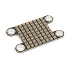
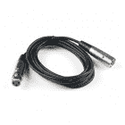
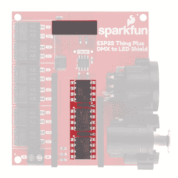

# SparkFun ESP32 DMX 至 LED 盾

> 原文：<https://learn.sparkfun.com/tutorials/sparkfun-esp32-dmx-to-led-shield>

## 介绍

[SparkFun ESP32 DMX 至 LED 盾](https://www.sparkfun.com/products/15110)是发送和接收 [DMX](https://en.wikipedia.org/wiki/DMX512) 数据的完美方式，无论是通过机载 XLR-3 插孔或 ArtNet 输入，还是通过 XLR-3 插孔/ArtNet 输出，这个盾都可以覆盖你。这是开始开发您自己的定制 DMX 装置，或者甚至将 ArtNet 功能添加到当前装置的完美方式。它还符合 DMX 标准，该标准要求控制器和通信端之间进行电气隔离，以避免接地环路。

[](https://www.sparkfun.com/products/15110) 

将**添加到您的[购物车](https://www.sparkfun.com/cart)中！**

### [SparkFun ESP32 的东西加上 DMX 给引盾](https://www.sparkfun.com/products/15110)

[In stock](https://learn.sparkfun.com/static/bubbles/ "in stock") DEV-15110

SparkFun ESP32 DMX 到 LED 盾是发送和接收 DMX 数据的最佳方式，无论它是通过 o…

$22.501[Favorited Favorite](# "Add to favorites") 16[Wish List](# "Add to wish list")** **在本连接指南中，我们将介绍 DMX 到 LED 屏蔽的几种不同配置方式，浏览简单的 DMX 输出和输入，了解如何使用 ArtNet 输入来控制 LED 阵列，甚至使用可用的 poke-home 连接器来控制伺服系统，最后了解如何将 ArtNet 输入转换为 DMX 输出，以便在现有的 DMX 夹具上实现 ArtNet 控制。

[https://www.youtube.com/embed/WCxcUrVRrqg/?autohide=1&border=0&wmode=opaque&enablejsapi=1](https://www.youtube.com/embed/WCxcUrVRrqg/?autohide=1&border=0&wmode=opaque&enablejsapi=1)

### 所需材料

**Note:** You might not need all of these items to get started on your specific DMX application, so head down to the [Examples](https://learn.sparkfun.com/tutorials/sparkfun-esp32-dmx-to-led-shield#examples) section to determine, which example best suits your needs and the products that are needed for the example.

To do all the examples, users will need:

*   +2 [DMX 到 LED 屏蔽](https://www.sparkfun.com/products/15110)(控制器/外设)，带 [ESP32 东西加](https://www.sparkfun.com/products/14689)-或-单独的 DMX 控制器/外设
*   [XLR-3 电缆](https://www.sparkfun.com/search/results?term=dmx)
*   [可寻址发光二极管](https://www.sparkfun.com/categories/286)
*   [云台伺服套件](https://www.sparkfun.com/products/14391)
*   [接头](https://www.sparkfun.com/categories/381)和[焊接工具](https://www.sparkfun.com/categories/49)

[](https://www.sparkfun.com/products/15047) 

将**添加到您的[购物车](https://www.sparkfun.com/cart)中！**

### [](https://www.sparkfun.com/products/15047)

[Out of stock](https://learn.sparkfun.com/static/bubbles/ "out of stock") COM-15047

8x8 SparkFun LuMini LED 矩阵，包含 64 个可单独寻址的 LEDS，每个能够产生 1600 万种颜色…

$27.951[Favorited Favorite](# "Add to favorites") 11[Wish List](# "Add to wish list")****[](https://www.sparkfun.com/products/14391) 

将**添加到您的[购物车](https://www.sparkfun.com/cart)中！**

### [【云台支架套件(单个附件)](https://www.sparkfun.com/products/14391)

[In stock](https://learn.sparkfun.com/static/bubbles/ "in stock") ROB-14391

这是一个易于组装的云台支架套件，利用伺服系统在两个轴上移动，适合相机和辅助手应用程序…

$7.508[Favorited Favorite](# "Add to favorites") 38[Wish List](# "Add to wish list")****[](https://www.sparkfun.com/products/retired/14689) 

### [spark fun Thing Plus-ESP32 WROOM](https://www.sparkfun.com/products/retired/14689)

[Retired](https://learn.sparkfun.com/static/bubbles/ "Retired") WRL-14689

SparkFun ESP32 Thing Plus 是开始使用 Espressif 物联网概念的下一步，同时还可以享受所有的便利设施

7 **Retired**[Favorited Favorite](# "Add to favorites") 16[Wish List](# "Add to wish list")[](https://www.sparkfun.com/products/retired/15309) 

### [XLR-3 电缆-10 英尺](https://www.sparkfun.com/products/retired/15309)

[Retired](https://learn.sparkfun.com/static/bubbles/ "Retired") CAB-15309

这是一个 10 英尺长的 DMX 电缆能够更好地沟通照明和特殊效果，通过标准或数字…

**Retired**[Favorited Favorite](# "Add to favorites") 0[Wish List](# "Add to wish list")**** ****#### 接头和焊接工具

DMX 至 LED 屏蔽设计有一个羽毛足迹。确保选择适合您的微控制器和项目的合适的接头组合。

[](https://www.sparkfun.com/products/116) 

将**添加到您的[购物车](https://www.sparkfun.com/cart)中！**

### [破开头球——直击](https://www.sparkfun.com/products/116)

[In stock](https://learn.sparkfun.com/static/bubbles/ "in stock") PRT-00116

一排标题-打破适应。40 个引脚，可切割成任何尺寸。用于定制 PCB 或通用定制接头。

$1.7520[Favorited Favorite](# "Add to favorites") 133[Wish List](# "Add to wish list")****[](https://www.sparkfun.com/products/115) 

将**添加到您的[购物车](https://www.sparkfun.com/cart)中！**

### [女标题](https://www.sparkfun.com/products/115)

[In stock](https://learn.sparkfun.com/static/bubbles/ "in stock") PRT-00115

单排 40 孔，内螺纹接头。可以用一把钢丝钳切割成合适的尺寸。标准 0.1 英寸间距。我们广泛使用它们…

$1.758[Favorited Favorite](# "Add to favorites") 71[Wish List](# "Add to wish list")****[](https://www.sparkfun.com/products/14681) 

将**添加到您的[购物车](https://www.sparkfun.com/cart)中！**

### [SparkFun 初学者工具包](https://www.sparkfun.com/products/14681)

[Out of stock](https://learn.sparkfun.com/static/bubbles/ "out of stock") TOL-14681

这些工具非常适合那些需要一套坚实的工具来启动工作台的人！

$62.50[Favorited Favorite](# "Add to favorites") 14[Wish List](# "Add to wish list")****[](https://www.sparkfun.com/products/15187) 

将**添加到您的[购物车](https://www.sparkfun.com/cart)中！**

### [羽毛可堆叠头套](https://www.sparkfun.com/products/15187)

[In stock](https://learn.sparkfun.com/static/bubbles/ "in stock") PRT-15187

这些可堆叠的接头可与[spark fun ESP32 Thing Plus](https://www . spark fun . com/products/14689)配合使用，以控制

$1.75[Favorited Favorite](# "Add to favorites") 4[Wish List](# "Add to wish list")******** ********### 推荐阅读

如果你不熟悉这些主题，我们建议你在开始之前先看看下面的教程和连接指南。如果你以前没有使用过这个协议，至少可以看看 DMX 的相关教程。

[](https://learn.sparkfun.com/tutorials/how-to-solder-through-hole-soldering) [### 如何焊接:通孔焊接](https://learn.sparkfun.com/tutorials/how-to-solder-through-hole-soldering) This tutorial covers everything you need to know about through-hole soldering.[Favorited Favorite](# "Add to favorites") 70[](https://learn.sparkfun.com/tutorials/using-artnet-dmx-and-the-esp32-to-drive-pixels) [### 使用 Artnet DMX 和 ESP32 驱动像素](https://learn.sparkfun.com/tutorials/using-artnet-dmx-and-the-esp32-to-drive-pixels) In this tutorial, we'll find out how to use Resolume Arena, a popular video jockey software, to control custom-made ArtNet DMX fixtures.[Favorited Favorite](# "Add to favorites") 10[](https://learn.sparkfun.com/tutorials/introduction-to-dmx) [### DMX 简介](https://learn.sparkfun.com/tutorials/introduction-to-dmx) DMX512 is an industry standard in lighting and stage design, whether it be controlling lights, motors, or lasers, DMX512 has many uses. In this tutorial we’ll cover DMX512 (Digital Multiplex with 512 pieces of information).[Favorited Favorite](# "Add to favorites") 10[](https://learn.sparkfun.com/tutorials/lumini-ring-hookup-guide) [### LuMini 环连接指南](https://learn.sparkfun.com/tutorials/lumini-ring-hookup-guide) The LuMini Rings (APA102-2020) are the highest resolution LED rings available.[Favorited Favorite](# "Add to favorites") 6[](https://learn.sparkfun.com/tutorials/esp32-thing-plus-hookup-guide) [### ESP32 Thing Plus 连接指南](https://learn.sparkfun.com/tutorials/esp32-thing-plus-hookup-guide) Hookup guide for the ESP32 Thing Plus (Micro-B) using the ESP32 WROOM's WiFi/Bluetooth system-on-chip in Arduino.[Favorited Favorite](# "Add to favorites") 8[](https://learn.sparkfun.com/tutorials/lumini-8x8-matrix-hookup-guide) [### LuMini 8x8 矩阵连接指南](https://learn.sparkfun.com/tutorials/lumini-8x8-matrix-hookup-guide) The LuMini 8x8 Matrix (APA102-2020) are the highest resolution LED matrix available.[Favorited Favorite](# "Add to favorites") 6

## 硬件概述

### 力量

您应该始终用 **5V** 给 DMX 屏蔽供电，以便为 RS485 提供适当的电源。DMX 到 LED 屏蔽可以通过螺丝端子或插入屏蔽的微控制器上的 USB 连接供电。

#### 电源螺丝端子

对于高电流消耗的应用，确保使用可用的螺丝端子来供电。如果您正在为大型 LED 阵列或许多伺服系统供电，由于 USB 电源无法提供足够的电流，您可能会开始看到功率骤降。螺丝端子是一个 2 针 **3.5 毫米**螺丝端子，应该能够接受带长约 5-6 毫米的 **26-16 AWG** 电线。螺丝是 M2 螺丝，因此您可能需要一个较小的珠宝尺寸螺丝刀。

[](https://cdn.sparkfun.com/assets/learn_tutorials/8/8/4/Power-Screw_Terminal.jpg)*Screw Terminal for 5V power. Note the polarity markings.*

#### 逻辑电平转换器

由于许多羽毛板是 **3.3V 逻辑**，所以在微控制器和 LED 数据引脚之间有一个逻辑电平转换器，以将 poke-home 连接器提升到 **5V 逻辑**。

[](https://cdn.sparkfun.com/assets/learn_tutorials/8/8/4/Logic_Level_Converter.jpg)*Logic level converter*

#### 电源和数据隔离

根据 DMX 规范，微控制器电源应与 XLR 通信电气隔离。这是通过 DC-DC 转换器和光隔离器实现的。DC-DC 转换器的隔离电压为 **1 kVDC** (额定 1 分钟。)和**1gω**的隔离电阻。DC-DC 转换器在 **5V** 输出 **200 mA** ，并能承受 9 VDC 的浪涌电压(持续 100 μs)。

[](https://cdn.sparkfun.com/assets/learn_tutorials/8/8/4/Power_Isolation.jpg)*Power isolation through DC-DC converter and data isolation through optocouplers.*

#### XLR 连接器

**Warning:** Be very careful **NOT** to plug into any sound boards as you will likely damage your DMX to LED Shield.

XLR 电缆通常用于舞台灯光和音响行业。每个 [DMX 到 LED 屏蔽](https://www.sparkfun.com/products/15110)都有一个 3 针(又名 XLR-3)公母 XLR 连接器。使用这些的时候，要非常小心**不要**插入任何音频设备，因为你很可能会损坏你的 DMX 到 LED 防护罩。要移除电缆，只需按下电缆或连接器上的按钮并将其拔出。通常，外设上的 XLR 公接头是输入，母接头是输出。

[](https://cdn.sparkfun.com/assets/learn_tutorials/8/8/4/XLR_Connectors.jpg)*Controller and peripheral XLR connections.***Note:** Three-pin XLR connection is essentially the same as five-pin connection, the primary difference between the two are in cost and that three-pin cable can be connected to a sound boards by mistake. Sound boards usually generate a much higher voltage; therefore, there is a potential to damage your DMX512 devices.

### 戳首页连接器

poke home 连接器的输出与 [APA102 LED 灯条](https://www.sparkfun.com/search/results?term=apa102)和 [LuMini 设备](https://www.sparkfun.com/search/results?term=lumini)相匹配。

[](https://cdn.sparkfun.com/assets/learn_tutorials/8/8/4/Poke_Home_Layout.gif)*Pin match up between a [LuMini 8x8 Matrix](https://www.sparkfun.com/products/15047) and the DMX to LED Shield (*products not to scale).*

因此，所有时钟线都连接到 ESP32(或您碰巧使用的任何微控制器)的同一个输出。屏蔽上的引脚已在下图中标记了相应的 poke home 连接器，因此如果您想将它们用于其他目的，您可以知道要连接到哪些引脚。

[](https://cdn.sparkfun.com/assets/learn_tutorials/8/8/4/DMX_Pin_Connections2_Updated.gif)*Poke-Home Connections. (Click to enlarge)*Poke Home Pin Connections on DMX Shield

| **ESP32 东西加** | **DMX 之盾** |
| 血清肌酸激酶 | C1
C2
 |
| 科皮 | D0 |
| 奇波 | D1 |
| 第 27 针 | D2 |

**Note:** You may not recognize the COPI/CIPO labels for SPI pins. SparkFun has joined with other members of OSHWA in a resolution to move away from using "Master" and "Slave" to describe signals between the controller and the peripheral. Check out [this page](https://www.sparkfun.com/spi_signal_names) for more on our reasoning behind this change. You can also see OSHWA's resolution [here](https://www.oshwa.org/a-resolution-to-redefine-spi-signal-names).

```
To use the poke-home connector, simply press down on the tab with a ballpoint pen (a key or screwdriver also works well) while pushing in the wire. The tabs to depress are highlighted in the image below, be aware that it'll take some extra finesse to get stranded core wire into these connectors. These connections should be able to accept **24-18 AWG** wire. 
```

[](https://cdn.sparkfun.com/assets/learn_tutorials/8/8/4/poke-home.png)*Poke-Home Use*

### 终端电阻焊盘

屏蔽层上有一个 120ω端接电阻焊盘。如果屏蔽位于 DMX 设备链的末端，这有助于增加信号反射。如果你没有 120ω的电阻，可以用一个[100ω的电阻](https://www.sparkfun.com/products/14493)。

[](https://cdn.sparkfun.com/assets/learn_tutorials/8/8/4/Termination_Resistor.jpg)*Termination Resistor*

## 硬件装配

DMX 至 LED 屏蔽设计有羽毛足迹；我们建议使用 [SparkFun ESP32 Thing Plus](https://www.sparkfun.com/products/14689) 的 WiFi 功能。将接头焊接到微控制器板上时，确保选择合适的接头组合来满足您的需求。在下面的例子中，我们将使用一个 [ESP32 加上](https://www.sparkfun.com/products/14689)焊接[公头](https://www.sparkfun.com/products/116)。查看 ESP32 Thing Plus 连接指南的[组装部分](https://learn.sparkfun.com/tutorials/esp32-thing-plus-hookup-guide#assembly-tips)，了解焊接 [ESP32 Thing Plus](https://www.sparkfun.com/products/14689) 的提示。

[](https://cdn.sparkfun.com/assets/learn_tutorials/8/5/2/SparkFun_Transparent_Graphical_OLED_Breakout__Qwiic__Hookup_Guide-01.jpg)*ESP32 Thing Plus with soldered male headers.*

这个盾牌很容易插上电源并开始摆弄。当创建高电流安装时，确保通过螺丝端子为系统供电。如果你知道电路板将位于 DMX 器件链的末端，在**端子**处焊接一个 120 欧姆的电阻(下面突出显示)。如果没有 120ω的电阻，可以使用[100ω的电阻](https://www.sparkfun.com/products/14493)。

[](https://cdn.sparkfun.com/assets/learn_tutorials/8/8/4/Termination_Resistor.jpg)*Termination Resistor*

## 软件概述

对于其中的一些例子，我们将使用一个对大多数 Arduino 用户来说都是新的软件，Resolume Arena 6，这是一个流行的视频骑师软件。如果您计划学习一些 ArtNet 示例，您需要在这里下载演示[，以便将一些 ArtNet 数据输出到您的网络。如果您的网络上有另一个产生 ArtNet 信号的设备，您可以继续使用它。](https://resolume.com/download/)

[Resolume Arena 6](https://resolume.com/download/)

首先，你需要**sparkfundx Arduino 库**、 **ArtnetWifi Arduino 库**、 **ESP32Servo Arduino 库**和 **Resolume Arena 6** (点击上面的按钮)。您可以通过 Arduino 库管理器获得这些库，方法是搜索它们以安装最新版本。如果你喜欢从 GitHub 库下载[库并手动安装，你可以在这里下载:](https://github.com/sparkfun/SparkFunDMX)

[SparkFunDMX (ZIP)](https://github.com/sparkfun/SparkFunDMX/archive/master.zip) [ArtnetWifi (ZIP)](https://github.com/rstephan/ArtnetWifi/archive/master.zip) [ESP32Servo (ZIP)](https://github.com/jkb-git/ESP32Servo/archive/master.zip)

**注意:**本教程假设您在桌面上使用的是最新版本的 Arduino IDE。如果这是你第一次使用 Arduino，请回顾我们关于[安装 Arduino IDE 的教程。](https://learn.sparkfun.com/tutorials/installing-arduino-ide)如果您之前没有安装 Arduino 库，请查看我们的[安装指南。](https://learn.sparkfun.com/tutorials/installing-an-arduino-library)

### SparkFunDMX 库函数

下面是可用的 SparkFunDMX 库函数列表。

`.initRead(int maxChan)` -启用 XLR 输入。

Input: int *maxChan*

正在使用的通道总数的整数。

`.initWrite(int maxChan)` -启用 XLR 输出。

Input: int *maxChan*

正在使用的通道总数的整数。

`.read(int Channel)` -从*通道*读取缓冲器中的数据。

Input: int *Channel*Specifies channel or device (1-512) that the code is looking at.Output: uint8_t (Value between 0-255)

无符号 8 位整数随你怎么处理。

`.write(int Channel, uint8_t value)` -将数据(*值*)写入*通道*的缓冲区。

Input: int *Channel*Specifies channel (1-512) to write to.

uint8_t *值*
要写入通道的无符号 8 位整数。

`.update()` -如果我们处于写入模式，则将数据缓冲器写入串行输出，如果我们处于读取模式，则将数据读入缓冲器。

## 例子

### 示例 1 -控制器

#### 材料

*   DMX 电缆公司
*   DMX 固定装置/额外的 DMX 到 LED 屏蔽

首先，我们将通过 XLR 插孔输出 DMX 来控制支持 DMX 的外围设备。我们将绘制通道，以便它们控制我们将在下一个示例中创建的外围设备。为了简单起见，在第一个例子中，我们将控制整个 8x8 矩阵的颜色以及每个伺服的值。打开**文件**->-**例子**->-**SparkFun DMX**-。**示例 1-DMX 输出**。看这个例子的开头，我们包含了 SparkFunDMX 库，并创建了一个名为`dmx`的`SparkFunDMX`对象。我们将使用通道 1、2 和 3 来表示色调、饱和度和值，第 4 个通道将包含平移，第 5 个通道将包含倾斜。这些在示例的序言中定义，以帮助跟踪哪些通道在哪里。如果我们使用两个 DMX 至 LED 屏蔽(一个作为输出，一个作为输入)，我们希望输出端和输入端的通道定义部分相同

```
language:c
#include <SparkFunDMX.h>

SparkFunDMX dmx;

//Channel Definitions
#define TOTAL_CHANNELS 5

#define HUE_CHANNEL 1
#define SATURATION_CHANNEL 2
#define VALUE_CHANNEL 3
#define PAN_CHANNEL 4
#define TILT_CHANNEL 5 
```

在我们的`setup()`循环中，我们通过调用`dmx.initWrite(TOTAL_CHANNELS);`在写入模式下开始我们的 DMX 屏蔽，这启用了 XLR 输出。然后我们可以使用`dmx.write(int channel, uint8_t value);`写入我们的缓冲区，然后使用`dmx.update();`通过 XLR 接口发送出去。在我们的`void loop()`中，我们使用一个`for`循环和几个`if`语句来决定在每个通道中放入什么，然后将数据发送出去。如下所示。

```
language:c
void loop() {
  for (int channel = 1; channel <= TOTAL_CHANNELS; channel++) //We don't (and can't) write to channel 0 as it contains 0x00, the DMX start code
  {
    if (channel == SATURATION_CHANNEL || channel == VALUE_CHANNEL) //Write the same value (190/255) = 74.5% to both saturation and value.
    {
      dmx.write(channel, 190);
    }
    else if (channel == HUE_CHANNEL || channel == PAN_CHANNEL || channel == TILT_CHANNEL) //Sweep across our servos as well as a rainbow cycle.
    {
      dmx.write(channel, x);
    }
  }
  Serial.print(x++);//Print and increment x. Since x is an unsigned 8 bit integer it will loop back to 0 if we try to increment it past 255
  dmx.update(); // update the DMX bus witht he values that we have written
  Serial.println(": updated!");
  delay(100);
} 
```

如果您想查看写入 hue 和伺服系统的当前值，您可以将串行监视器打开到 115200 波特，但在连接到外围设备之前，我们无法真正看到输出。

### 示例 2 -外围设备

#### 材料

*   DMX 电缆公司
*   DMX 控制器/附加 DMX 到 LED 屏蔽
*   发光二极管(可选)
*   平移/倾斜伺服(可选)

在这个例子中，我们将使用 [LuMini 8x8 矩阵](https://www.sparkfun.com/products/15047)和我们的[云台伺服套件](https://www.sparkfun.com/products/14391)创建世界上最可爱的[移动头灯](https://www.amazon.com/MFL-Rotating-Activated-Master-slave-Nightclub/dp/B00YIKO4CI/ref=sr_1_2?qid=1553190586&refinements=p_n_feature_keywords_browse-bin%3A7103859011&s=musical-instruments&sr=1-2)，尽管如果你想要一些更好的伺服系统，你完全可以使用我们的[其他伺服安装套件](https://www.sparkfun.com/products/10335)来使用不同的伺服系统。我们要做的是设置我们的 ESP32 发送我们的前 3 个通道的 DMX 数据到我们的 LED 矩阵来着色，第 4 和第 5 个通道将用于控制伺服系统。

#### 可选硬件组件

如果你决定创造一个移动头部的微型版本，组装你的云台伺服系统，如果你还没有的话，在 LuMini 矩阵上焊接一些电线。把你的 LED 灯贴在你移动的头部，你看怎样合适，我用海报油灰把我的贴在这个简单的演示上。继续将摇摄伺服(从左到右)上的数据针(摇摄/倾斜伺服套件上的橙色)连接到 **D1** 戳入式连接器，将倾斜伺服连接到 **D2** 戳入式连接器。将 **D0** 和 **C0** 连接到 **DI** 和 **CI** 上您决定使用的任何 APA102/LuMini LED。如果您使用 WS2812 型 LED，您只需将您的**数据线**连接到 **D0** 即可。我的设置如下所示，LED 线在左边的连接器上，伺服系统在右边的连接器上。

[](https://cdn.sparkfun.com/assets/learn_tutorials/8/8/4/DMX_to_LED_Shield_Hookup_Guide-02.jpg)*Moving Head Wiring*

#### 外围代码

如果你还没有，继续打开**文件**->-**例子**->-**SparkFun DMX**-。**示例 2-DMXInput** 。在我们的外围设备方面，我们将希望确保我们的报头中的通道定义与我们的输出示例中的通道定义相匹配，因为我们需要知道我们将接收多少个通道，以及如何处理数据的每一部分。然后，我们需要为我们的定制 DMX 夹具声明我们的硬件，在这种情况下，两个伺服系统和一个 LED 矩阵。所有的定义如下所示。

```
language:c
//Channel Defintions
#define TOTAL_CHANNELS 5

#define HUE_CHANNEL 1
#define SATURATION_CHANNEL 2
#define VALUE_CHANNEL 3
#define PAN_CHANNEL 4
#define TILT_CHANNEL 5

//Fixture Hardware Definitinos
#define NUM_LEDS 64
CRGB matrix[NUM_LEDS];
Servo pan;
Servo tilt; 
```

在我们的`setup()`循环中，我们初始化我们的 led 和伺服系统，并通过调用`dmx.initRead(totalChannels);`将我们的屏蔽置于读取模式。

```
language:c
void setup()
{
  Serial.begin(115200);
  dmx.initRead(TOTAL_CHANNELS);           // initialization for complete bus
  Serial.println("initialized...");

  FastLED.addLeds<APA102, DATA0, CLOCK, BGR>(matrix, NUM_LEDS);
  FastLED.setBrightness(16);
  pan.attach(DATA1);
  tilt.attach(DATA2);
} 
```

然后我们可以调用`dmx.update();`来更新我们的数据缓冲区，然后我们可以通过调用`dmx.read(int channel);`来访问它。我们使用这个过程将我们的数据从相应的通道读入`void loop()`中适当的硬件外设。

```
language:c
void loop()
{
  dmx.update();
  for (int led = 0; led < NUM_LEDS; led++)
  {
    matrix[led] = CHSV(dmx.read(HUE_CHANNEL), dmx.read(SATURATION_CHANNEL), dmx.read(VALUE_CHANNEL));
  }
  pan.write(map(dmx.read(PAN_CHANNEL), 0, 255, 0, 160));
  tilt.write(map(dmx.read(TILT_CHANNEL), 0, 255, 0, 160));
  FastLED.show();
} 
```

将示例 1 加载到一个屏蔽上，将示例 2 加载到另一个屏蔽上，并通过 XLR 将它们连接起来，应该会产生类似于下图的输出。

[](https://cdn.sparkfun.com/assets/learn_tutorials/8/8/4/DMX_Demo_01.gif)*Moving Head*

### 示例 3 - ArtNet 输入

#### 材料

*   发光二极管(可选)
*   平移/倾斜伺服(可选)

#### Arduino 代码

这个例子与前面的外设例子非常相似，只是这次我们将通过 WiFi 从一个流行的视频骑师软件 Resolume Arena 6 接收 ArtNet 数据。让我们从设置 ArtNet 输入开始，我们将采用上一个示例中的硬件设置，并在这里加以利用，因此硬件外设的所有定义将保持不变。然而，在本例中，我们将单独控制矩阵上的每个 LED，因此我们将使用 192 (64 个 LED 乘以每个 LED 的 3 个通道)个 LED 通道，而不是 3 个。这使得我们的通道定义部分如下所示。

```
language:c
//Channel and Peripheral Definitions
#define NUM_LEDS 64
#define NUM_LED_CHANNELS NUM_LEDS * 3 //Ends up being 192 channels for our 8x8 LED matrix
#define PAN_CHANNEL 193
#define TILT_CHANNEL 194
CRGB matrix[NUM_LEDS];
Servo pan;
Servo tilt; 
```

然后，我们需要开始 WiFi 和艺术网。该示例默认使用 ESP32 作为独立接入点，但是如果您想要连接到现有网络，可以更改第 23、24、54、55 和 57 行。然而，如果不是，独立接入点将具有 SSID**myDMX**，并且密码将是`artnetnode`。然后我们用`artnet.begin();`初始化我们的`artnet`对象(我们在序言中用`ArtnetWifi artnet;`创建的),这将开始搜索 Artnet 包的网络。然后我们使用`artnet.setArtDMXCallback(onDmxFrame);`,这样每当我们在网络上看到一个 Artnet 包时就调用`onDmxFrame`。`onDmxframe`是我们将根据我们的设置更改的功能，以便将数据解析到适当的硬件附件中。我们遍历所有的通道，并使用 if 语句将它们放入适当的段中。该代码概述如下。

```
language:c
void onDmxFrame(uint16_t universe, uint16_t length, uint8_t sequence, uint8_t* data)
{
  // read universe and put into the right part of the display buffer
  //DMX data should be sent with the first LED in the string on channel 0 of Universe 0
  for (int channel = 0; channel < length; channel++)
  {
    if (channel < NUM_LED_CHANNELS && channel % 3 == 0) //Only write on every 3rd piece of data so we correctly parse things into our RGB array
    {
      matrix[channel / 3] = CRGB(data[channel], data[channel + 1], data[channel + 2]);
    }
    else if (channel == PAN_CHANNEL - 1) //Subtract 1 due to the fact that we index at 0 and ignore the startcode
    {
      pan.write(map(data[channel], 0, 255, 0, 160));
    }
    else if (channel == TILT_CHANNEL - 1)
    {
      tilt.write(map(data[channel], 0, 255, 0, 160));
    }
  }
  previousDataLength = length;
  if (universe == endUniverse) //Display our data if we have received all of our universes, prevents incomplete frames when more universes are concerned.
  {
    FastLED.show();
  }
} 
```

#### 分辨率设置

如果你还没有，去查看一下 [ArtNet DMX 和 ESP32 像素推送指南](https://learn.sparkfun.com/tutorials/using-artnet-dmx-and-the-esp32-to-drive-pixels/all#resolume-setup)来获得一些在 Resolume 中设置自定义夹具的帮助。您需要创建两个装置，一个用于 8x8 显示器，一个用于控制平移和倾斜的单通道装置。然后，用你的 8×8 矩阵在中心和两个固定装置创建一个 Lumiverse 一个用于平移，一个用于倾斜。还要确保将 TargetIP 更改为 **IPAddress** ，并将地址更改为`192.168.4.1`，以便将数据直接发送到您的 ESP32。

[](https://cdn.sparkfun.com/assets/learn_tutorials/8/8/4/advancedoutput.PNG)*Advanced Output*

然后，我们将缩小我们的主视频源，这样它就不会占据显示器的角落，也不会影响平移和倾斜通道的输入。然后，我们将在角落添加两个纯色块，这样我们就可以影响设备的平移和倾斜通道。这是一种非常粗糙的做事方式，但 Resolume 是针对视频屏幕的，而不是完全成熟的设备。然后，我们将调整纯色块的亮度，以便将数据发送到相应的 DMX 通道。你可以自己设置这些，或者下载下面的作文。

[DOWNLOAD RESOLUME COMPOSITION](https://cdn.sparkfun.com/assets/learn_tutorials/8/8/4/Example4Composition.avc)

连接到与 ESP32 相同的网络会将数据发送到您的屏幕和伺服系统。看看下面的 gif，看看如果你设置正确的话会发生什么。

[](https://cdn.sparkfun.com/assets/learn_tutorials/8/8/4/DMX_Demo_02.gif)*Artnet to Moving Head*

### 例 4 -艺术网到 XLR

#### 材料

*   DMX 电缆公司
*   DMX 夹具

最后一个例子将结合我们到目前为止学到的所有知识，通过 ArtNet 控制不支持 ArtNet 的外设。我们的控制板将把 Artnet 数据转换成 DMX 输出。我们在这里的主要变化是，我们改变了我们的`onDmxFrame`函数，将我们输入的 Artnet 数据写入我们的 XLR 缓冲区。这是通过一个简单的 for 循环完成的，如下所示。

```
language:c
void onDmxFrame(uint16_t universe, uint16_t length, uint8_t sequence, uint8_t* data)
{
  sendFrame = 1;
  //Read universe and put into the right part of the display buffer
  //DMX data should be sent with the first LED in the string on channel 0 of Universe 0
  for (int channel = 0; channel < length; channel++)
  {
    dmx.write(channel, data[channel]);
  }
  previousDataLength = length;
  if (universe == endUniverse) //Display our data if we have received all of our universes, prevents incomplete frames when more universes are concerned.
  {
    dmx.update();
  }
} 
```

我有一个不支持 Artnet 的设备；一台旧的 Casa 激光器。我在互联网上做了一些调查，找到了这张[老虎机地图。](https://cdn.sparkfun.com/assets/learn_tutorials/8/8/4/ctl-dcm.pdf)然后，我在 Resolume 中绘制了通道，以匹配激光器上可用的 7 个通道。为此，我简单地创建了三种独立的纯色，并在每种颜色上放置一个 LED。这使得我的第一个 led 通道上的红色值为 1，绿色通道为 2，以此类推。第二个 LED 是通道 4-6，位于第二种颜色上。如下图所示。

[](https://cdn.sparkfun.com/assets/learn_tutorials/8/8/4/advanced_output2.PNG)*Advanced Output for Laser*

有了所有这些和我的固定地图，我就可以通过 WiFi 将我想要的数据发送到激光器。下面的剪辑只是简单地随机移动一些通道并观察输出。

[](https://cdn.sparkfun.com/assets/learn_tutorials/8/8/4/DMX_Demo_03.gif)*Artnet Laser Control*

## 资源和更进一步

有关更多信息，请查看以下资源:

*   [GitHub 产品回购](https://github.com/sparkfun/SparkFun_ESP32_Thing_Plus_DMX_to_LED_Shield)
*   [示意图(PDF)](https://cdn.sparkfun.com/assets/c/1/c/c/d/SparkFun_ESP32_Thing_Plus_DMX_to_LED_Shield.pdf)
*   [老鹰文件(ZIP)](https://cdn.sparkfun.com/assets/b/1/9/1/6/ESP32ThingPlusDMXtoLEDShield.zip)
*   [SparkFun DMX Arduino 图书馆(ZIP)](https://github.com/sparkfun/SparkFunDMX/archive/master.zip)
*   [spark fun DMX Arduino Library GitHub Repository](https://github.com/sparkfun/SparkFunDMX)
*   [SFE 产品展示区](https://youtu.be/WCxcUrVRrqg)

你的下一个项目需要一些灵感吗？查看一些相关教程:

[](https://learn.sparkfun.com/tutorials/using-artnet-dmx-and-the-esp32-to-drive-pixels) [### 使用 Artnet DMX 和 ESP32 驱动像素](https://learn.sparkfun.com/tutorials/using-artnet-dmx-and-the-esp32-to-drive-pixels) In this tutorial, we'll find out how to use Resolume Arena, a popular video jockey software, to control custom-made ArtNet DMX fixtures.[Favorited Favorite](# "Add to favorites") 10[](https://learn.sparkfun.com/tutorials/introduction-to-dmx) [### DMX 简介](https://learn.sparkfun.com/tutorials/introduction-to-dmx) DMX512 is an industry standard in lighting and stage design, whether it be controlling lights, motors, or lasers, DMX512 has many uses. In this tutorial we’ll cover DMX512 (Digital Multiplex with 512 pieces of information).[Favorited Favorite](# "Add to favorites") 10[](https://learn.sparkfun.com/tutorials/lumini-ring-hookup-guide) [### LuMini 环连接指南](https://learn.sparkfun.com/tutorials/lumini-ring-hookup-guide) The LuMini Rings (APA102-2020) are the highest resolution LED rings available.[Favorited Favorite](# "Add to favorites") 6[](https://learn.sparkfun.com/tutorials/lumini-8x8-matrix-hookup-guide) [### LuMini 8x8 矩阵连接指南](https://learn.sparkfun.com/tutorials/lumini-8x8-matrix-hookup-guide) The LuMini 8x8 Matrix (APA102-2020) are the highest resolution LED matrix available.[Favorited Favorite](# "Add to favorites") 6**************