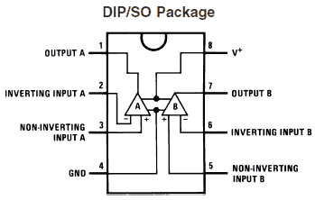
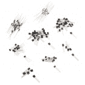

# 初学者零件套件识别指南

> 原文：<https://learn.sparkfun.com/tutorials/beginner-parts-kit-identification-guide>

## 介绍

随着你对电子爱好的深入挖掘，你可能会发现你的个人空间被反复出现的电子元件主题所渗透。通过[初级零件套件](https://www.sparkfun.com/products/13973)，我们试图创造一个令人愉快的电子元件大杂烩，多年来，美国电气工程师已经变得又爱又恨。它充满了电容器、发光二极管、晶体管、集成电路等我们发现最有用的元件。它们都装在一个漂亮的盒子里！无论你是开始收集电子产品，还是仅仅是补充电子产品，初学者的配件包都会有很多你需要的东西。

 

将**添加到您的[购物车](https://www.sparkfun.com/cart)中！**

 **### [SparkFun 初学者配件包](https://www.sparkfun.com/products/13973)

[28 available](https://learn.sparkfun.com/static/bubbles/ "28 available") KIT-13973

SparkFun 初学者配件包是一个包含常用配件的小容器，为您提供所有的基本组件…

$18.5012[Favorited Favorite](# "Add to favorites") 84[Wish List](# "Add to wish list")** **在本教程中，我们将提供工具包中每个部分的快速概要，以帮助您加深对组件的理解。对于某些部分，我们将包括一个示例应用程序，以防您需要一个电路来插入您的新玩具。

### 建议的材料

要学习本教程，您至少需要以下材料。你可能不需要所有的东西，这取决于你拥有什么。将它添加到您的购物车，通读指南，并根据需要调整购物车。

 

将**添加到您的[购物车](https://www.sparkfun.com/cart)中！**

 **### [【电阻器套件- 1/4W(共 500)](https://www.sparkfun.com/products/10969)

[Out of stock](https://learn.sparkfun.com/static/bubbles/ "out of stock") COM-10969

电阻是个好东西，事实上，在许多电路设计中，电阻是至关重要的。唯一的问题似乎是…

$8.95180[Favorited Favorite](# "Add to favorites") 185[Wish List](# "Add to wish list")**** 

将**添加到您的[购物车](https://www.sparkfun.com/cart)中！**

 **### [跳线高级 4" M/M - 26 AWG (30 个装)](https://www.sparkfun.com/products/14284)

[In stock](https://learn.sparkfun.com/static/bubbles/ "in stock") PRT-14284

这些是 101 毫米长的 26AWG 跳线，两端都有公接头。使用这些从任何板上的任何母接头跳接…

$2.75[Favorited Favorite](# "Add to favorites") 13[Wish List](# "Add to wish list")**** 

将**添加到您的[购物车](https://www.sparkfun.com/cart)中！**

 **### [【试验板-迷你模块化(黑色)](https://www.sparkfun.com/products/12047)

[In stock](https://learn.sparkfun.com/static/bubbles/ "in stock") PRT-12047

这个黑色的迷你试验板是你的小项目原型的好方法！有了 170 个并列点，就有足够的空间…

$4.50[Favorited Favorite](# "Add to favorites") 21[Wish List](# "Add to wish list")****** ******除了这些组件之外，您还需要一个实际的电源来提供比您想要的输出高 1-2V 的电压。如果我有墙上的电源插座，我总是喜欢用“壁灯”作为我的电源；其中 [9V](http://www.sparkfun.com/products/298) 或者 [12V](http://www.sparkfun.com/products/9442) 都是不错的选择。壁式电源插座的输出可以插入一个筒形插孔连接器，该连接器又可以连接到我们的电路。

 

将**添加到您的[购物车](https://www.sparkfun.com/cart)中！**

 **### [DC 筒式插孔适配器-兼容试验板](https://www.sparkfun.com/products/10811)

[In stock](https://learn.sparkfun.com/static/bubbles/ "in stock") PRT-10811

这个 DC 电源插孔/连接器就像我们携带的另一个，除了它的终端与试验板友好的 pi…

$1.058[Favorited Favorite](# "Add to favorites") 59[Wish List](# "Add to wish list")**** 

将**添加到您的[购物车](https://www.sparkfun.com/cart)中！**

 **### [墙壁适配器电源- 12VDC，600mA(筒式插孔)](https://www.sparkfun.com/products/15313)

[In stock](https://learn.sparkfun.com/static/bubbles/ "in stock") TOL-15313

这是一个高质量的交流到 DC 的“壁式电源”，在高达 600 毫安时产生 12v 直流稳压输出。

$6.50[Favorited Favorite](# "Add to favorites") 8[Wish List](# "Add to wish list")**** 

将**添加到您的[购物车](https://www.sparkfun.com/cart)中！**

 **### [DC 筒式千斤顶适配器——母](https://www.sparkfun.com/products/10288)

[In stock](https://learn.sparkfun.com/static/bubbles/ "in stock") PRT-10288

此适配器允许您将筒式插孔连接器连接到裸线。一端有螺丝端子，另一端有一个 5.5…

$3.501[Favorited Favorite](# "Add to favorites") 24[Wish List](# "Add to wish list")**** 

### [墙壁适配器电源- 9VDC 650mA](https://www.sparkfun.com/products/retired/298)

[Retired](https://learn.sparkfun.com/static/bubbles/ "Retired") TOL-00298

专为 Spark Fun Electronics 制造的高质量开关“壁式电源”AC 到 DC 9V 650mA 壁式电源。T…

12 **Retired**[Favorited Favorite](# "Add to favorites") 23[Wish List](# "Add to wish list")****** ******### 推荐阅读

如果您不熟悉以下概念，我们建议您在继续之前查看这些教程。

 [### 什么是电路？](https://learn.sparkfun.com/tutorials/what-is-a-circuit) Every electrical project starts with a circuit. Don't know what a circuit is? We're here to help.[Favorited Favorite](# "Add to favorites") 82 [### 如何使用试验板](https://learn.sparkfun.com/tutorials/how-to-use-a-breadboard) Welcome to the wonderful world of breadboards. Here we will learn what a breadboard is and how to use one to build your very first circuit.[Favorited Favorite](# "Add to favorites") 79 [### 如何阅读原理图](https://learn.sparkfun.com/tutorials/how-to-read-a-schematic) An overview of component circuit symbols, and tips and tricks for better schematic reading. Click here, and become schematic-literate today 112

## 套件内容

你可以在工具箱中找到以下零件。

*   1x [可调零件箱](https://www.sparkfun.com/products/13867)
*   10x [0.1uF 电容](http://www.sparkfun.com/products/8375)
*   5x [100uF 电容](http://www.sparkfun.com/products/96)
*   5x [10uF 电容](http://www.sparkfun.com/products/523)
*   5x 1uF 电容
*   5x 10nF Cap
*   5x 1nF Cap
*   5x 100pF 电容
*   5x 10pF 电容
*   5x [1N4148 二极管](http://www.sparkfun.com/products/8588)
*   5x [1N4001 二极管](http://www.sparkfun.com/products/8589)
*   5x [2N3906 PNP 晶体管](http://www.sparkfun.com/products/522)
*   5x [2N3904 NPN 晶体管](http://www.sparkfun.com/products/521)
*   3x 20 针母接头
*   3x 20 针公接头
*   3x [迷你电源开关](http://www.sparkfun.com/products/102)
*   2 个[按钮](http://www.sparkfun.com/products/97)
*   1x[10K·特里姆波特](http://www.sparkfun.com/products/9806)
*   2x [AS358P 运算放大器](https://www.sparkfun.com/products/15946)
*   2x [3.3V 稳压器](http://www.sparkfun.com/products/526)
*   2x [5V 稳压器](http://www.sparkfun.com/products/107)
*   1 个 555 小时
*   1x [绿色 LED](http://www.sparkfun.com/products/9650)
*   1x [黄色 LED](http://www.sparkfun.com/products/532)
*   1x [红色 LED](http://www.sparkfun.com/products/533)
*   1x [7 段红色 LED](http://www.sparkfun.com/products/8546)
*   1x [微型光电池](http://www.sparkfun.com/products/9088)

* * *

## 可调零件箱

虽然它缺乏真正的电气特性，但零件箱仍然是零件套件中最酷的部分之一。当元件从盒子的舒适范围中成长出来，成为自己的电路时，元件盒总有一天会容纳一个新的元件家族。以前的 SparkFun 零件箱由两个带不同隔间的锁盖组成。我们最新的零件箱包含单独的、可调节的分隔器。

 

将**添加到您的[购物车](https://www.sparkfun.com/cart)中！**

 **### [可调零件箱](https://www.sparkfun.com/products/13867)

[In stock](https://learn.sparkfun.com/static/bubbles/ "in stock") PRT-13867

这是一个小型、可调节的部件盒，用于组件、分线点和开发板。由透明的聚丙烯制成，带有 r…

$5.95[Favorited Favorite](# "Add to favorites") 29[Wish List](# "Add to wish list")** *** * *

## 电容器

### 陶瓷电容- 10pF、100pF、1nF、10nF、0.1uF、1uF

电容永远不会在电路中扮演主角，但却是大多数设计的基础。这些电容最常用于[电路**去耦**](https://learn.sparkfun.com/tutorials/capacitors/application-examples#decoupling) ，它们与 DC 电压源并联放置以抑制噪声。它们还有很多其他用途，比如储能和定时电路调谐(见下面的 555 定时器)。

这些帽子中的每一个都可以通过它们身上的微小印记来区分。请参见下表，将每个上限与其值对应起来，您可能会注意到一个模式:

| 上限价值 | 瓶盖标记 |
| 10pF | One hundred |
| 100pF | One hundred and one |
| 1nF | One hundred and two |
| 10nF | One hundred and three |
| 0.1uF | One hundred and four |
| 1uF | One hundred and five |

#### 电解电容器- 10uF 和 100uF

作为陶瓷电容器的远亲，这些电解电容有一个非常明显的特点:它们是**极化的，这意味着它们既有正极也有负极。**

**

负极引脚由帽体上的“–”标志(100uF 上为金色，10uF 上为白色)和一个较短的引脚标记。注意确保长正极引线上的电压高于负极引线上的电压。如果你碰巧把瓶盖倒扣上，灾难性的失败即将来临，通常表现为瓶盖发出有趣的“砰”的声音，并有点喘不过气来。听起来很有趣，我知道，但是你每样只有五个，所以你可能想让它们正常工作。

**Tip:** Looking for more information about ceramic capacitors? Check out this section from our [capacitor kit identification guide](https://learn.sparkfun.com/tutorials/capacitor-kit-identification-guide#capacitor-identification) for more information about the capacitor markings.

欲了解更多信息，请查看我们的电容教程。

 [### 电容器

#### 2013 年 6 月 19 日](https://learn.sparkfun.com/tutorials/capacitors) Learn about all things capacitors. How they're made. How they work. How they look. Types of capacitors. Series/parallel capacitors. Capacitor applications.[Favorited Favorite](# "Add to favorites") 84

* * *

## 二极管

### 二极管- 1N4148 和 1N4001

二极管用于确保电流只向一个方向流动，这是以二极管上的小正向压降为代价的。该套件中有两种二极管:1N4148 小信号二极管和 1N4001 整流二极管。1N4148 是外观整洁的橙黑二极管，黑线标记负(阴极)侧。1N4001 是黑灰色二极管，灰色线标记其阴极。

 

将**添加到您的[购物车](https://www.sparkfun.com/cart)中！**

 **### [二极管小信号- 1N4148](https://www.sparkfun.com/products/8588)

[In stock](https://learn.sparkfun.com/static/bubbles/ "in stock") COM-08588

这是一个很常见的信号二极管——1n 4148。将此用于高达 200mA 电流的信号。

$0.25[Favorited Favorite](# "Add to favorites") 10[Wish List](# "Add to wish list")**** 

将**添加到您的[购物车](https://www.sparkfun.com/cart)中！**

 **### [二极管整流器——1A，50V (1N4001)](https://www.sparkfun.com/products/8589)

[In stock](https://learn.sparkfun.com/static/bubbles/ "in stock") COM-08589

这是一个简单的，超小型尺寸，轴向引线安装整流二极管。1N4001 的额定电压高达 1A/50V。

$0.251[Favorited Favorite](# "Add to favorites") 13[Wish List](# "Add to wish list")**** ****这两种二极管都具有通常的二极管特性，但是它们的额定电流不同。与 1N4148 的 200mA 额定值相比，1N4001 的正向电流额定值高得多，为 1000mA，但它的正向电压额定值也略高。由于其相对较高的额定电流，1N4001 通常用于功率转换电路，如 DC-DC 转换器和交流-DC 整流器。小信号 1N4148 更适合逻辑电路等低电流应用。

要更深入地了解二极管，请查看我们的二极管教程。

 [### 二极管

#### 2013 年 5 月 9 日](https://learn.sparkfun.com/tutorials/diodes) A diode primer! Diode properties, types of diodes, and diode applications.[Favorited Favorite](# "Add to favorites") 70

* * *

### 发光二极管

#### 绿色、黄色、红色 3 毫米发光二极管

没有一个项目是不完整的。这是事实！该套件包括绿色、黄色和红色各一个 3 毫米 led。

 

将**添加到您的[购物车](https://www.sparkfun.com/cart)中！**

 **### [LED -基本绿色 3mm](https://www.sparkfun.com/products/9650)

[In stock](https://learn.sparkfun.com/static/bubbles/ "in stock") COM-09650

发光二极管-那些闪闪发光的东西。电源指示、引脚状态、光电传感器和有趣的闪烁显示器的必备组件。…

$0.451[Favorited Favorite](# "Add to favorites") 8[Wish List](# "Add to wish list")**** 

将**添加到您的[购物车](https://www.sparkfun.com/cart)中！**

 **### [LED -基本红色 3mm](https://www.sparkfun.com/products/533)

[In stock](https://learn.sparkfun.com/static/bubbles/ "in stock") COM-00533

发光二极管-那些闪闪发光的东西。电源指示、引脚状态、光电传感器和有趣的闪烁显示器的必备组件。…

$0.45[Favorited Favorite](# "Add to favorites") 7[Wish List](# "Add to wish list")**** 

将**添加到您的[购物车](https://www.sparkfun.com/cart)中！**

 **### [LED -基本黄色 3mm](https://www.sparkfun.com/products/532)

[In stock](https://learn.sparkfun.com/static/bubbles/ "in stock") COM-00532

发光二极管-那些闪闪发光的东西。电源指示、引脚状态、光电传感器和有趣的闪烁显示器的必备组件。…

$0.45[Favorited Favorite](# "Add to favorites") 5[Wish List](# "Add to wish list")****** ******发光二极管有两个端子，一个是正极，一个是负极。这两个终端可以用两种方式来区分。如果你看二极管的底部，你会注意到它并不完全是圆的，有一个平的边缘表示阴极。虽然我很难看到平坦的边缘，所以我通常会寻找两条腿中较短的一条，这也表明了阴极。

点亮 LED 有两个方面:LED 需要特定的正电压，还需要刚好足够但不太大的正向电流。下表列出了所有三个指示灯的额定值。

| LED 颜色 | 建议正向电流 | 最大值正向电流 | 典型正向电压 |
| 格林（姓氏）；绿色的 | 16-18 毫安 | 20mA | **2.0V-2.4V** |
| 黄色 | 16-18 毫安 | 20mA | **2.0V-2.4V** |
| 红色 | 16-18 毫安 | 20mA | **1.8V-2.2V** |

关于 LED 的精彩讨论，请查看我们的 LED 教程。

 [### 发光二极管

#### 2013 年 8 月 12 日](https://learn.sparkfun.com/tutorials/light-emitting-diodes-leds) Learn the basics about LEDs as well as some more advanced topics to help you calculate requirements for projects containing many LEDs.[Favorited Favorite](# "Add to favorites") 67

* * *

#### 7 段 LED -红色

这个长方形的部件是套件中的主角，它总共包含八个发光二极管。

 

将**添加到您的[购物车](https://www.sparkfun.com/cart)中！**

 **### [【7 段显示屏- LED(红色)](https://www.sparkfun.com/products/8546)

[In stock](https://learn.sparkfun.com/static/bubbles/ "in stock") COM-08546

你的基本 7 段 LED。公共阳极。两个小数点，但只有右边的一个是有线的。手指高度为 0.6 英寸。爱…

$1.251[Favorited Favorite](# "Add to favorites") 20[Wish List](# "Add to wish list")** **七个 led 组成了我们所说的七段显示器，可以打开或关闭来创建任何数量或许多其他字符的近似表示。第八个 LED 控制数字右下角的小数点。毫无疑问，你已经在其他重要场合见过 7 段 led 灯，比如你的闹钟、收音机、微波炉和许多其他需要显示数值的设备。

7 段 LED 有 10 个引脚，显示屏的顶部和底部各有 5 个。所有 LED 共用一个公共阳极，即引脚 3 和 8，而其余引脚是每个 LED 的单独阴极。

* * *

## 输入

### 头球

这对幸福的夫妇并不那么令人兴奋，但他们仍然是重要的组成部分。如果你发现自己有一个 SparkFun 分线板，你可能需要在其中一个接头上[焊接](https://learn.sparkfun.com/tutorials/how-to-solder-through-hole-soldering),以在板和另一个组件之间形成牢固的电连接。如果您想将分线板插入试验板，公接头很有用，而母接头用于将电线插入。你也可以用它们来帮助将引脚焊接到电路板上。

|  |  |  |
| *[焊接在 Arduino Pro Mini](https://learn.sparkfun.com/tutorials/using-the-arduino-pro-mini-33v) 上的公接头* | *[母接头焊接到 samd 21](https://learn.sparkfun.com/tutorials/samd21-minidev-breakout-hookup-guide/hardware-setup)* | *[少年堆着帮着锡焊锡焊](https://learn.sparkfun.com/tutorials/getting-started-with-the-teensy#soldering-options)* |

这些接头为 20 个一组，可以用一组剪刀分成更小的组。

 

将**添加到您的[购物车](https://www.sparkfun.com/cart)中！**

 **### [平齐刀具- Xcelite](https://www.sparkfun.com/products/14782)

[Out of stock](https://learn.sparkfun.com/static/bubbles/ "out of stock") TOL-14782

这些是来自 Excelite 的简单平切刀具，让您可以非常干净地切割引线并靠近焊点。

$8.952[Favorited Favorite](# "Add to favorites") 18[Wish List](# "Add to wish list")**** 

将**添加到您的[购物车](https://www.sparkfun.com/cart)中！**

 **### [电子剪](https://www.sparkfun.com/products/10447)

[In stock](https://learn.sparkfun.com/static/bubbles/ "in stock") TOL-10447

虽然我们的小斜切刀非常适合业余爱好，但有时你需要更有咬合力的东西。这些电子…

$16.50 $14.036[Favorited Favorite](# "Add to favorites") 9[Wish List](# "Add to wish list")**** ***** * *

### 输入

#### 迷你电源开关和按钮

任何伟大项目的核心都是用户输入，这正是这些开关和按钮的用途。

 

将**添加到您的[购物车](https://www.sparkfun.com/cart)中！**

 **### [迷你电源开关——SPDT](https://www.sparkfun.com/products/102)

[In stock](https://learn.sparkfun.com/static/bubbles/ "in stock") COM-00102

简单的 SPDT 滑动开关。额定电压为 30V/200mA。引脚间距为 0.1 英寸，非常适合安装在试验板上！使用它作为电源开关…

$1.60[Favorited Favorite](# "Add to favorites") 38[Wish List](# "Add to wish list")**** 

将**添加到您的[购物车](https://www.sparkfun.com/cart)中！**

 **### [迷你按钮开关](https://www.sparkfun.com/products/97)

[In stock](https://learn.sparkfun.com/static/bubbles/ "in stock") COM-00097

我们在所有东西上都用这些小按钮！这些微型单刀单掷开关有一个很好的点击他们和 ar…

$0.453[Favorited Favorite](# "Add to favorites") 65[Wish List](# "Add to wish list")**** ****迷你电源开关通常起到开/关控制的作用，但它也可以控制许多其他功能。这种单刀双掷(SPDT)开关有三个端子，两个外部端子中的一个将连接到中间的一个，哪一个将取决于开关翻转的方向。这一切都很直观。

按钮有两个端子；四根导线中，每侧两根短接在一起。当黑色小按钮被按下时，端子被短接在一起，否则按钮充当开路。当开关用作开/关控制时，按钮用于更多的瞬时控制，如快速复位。这里有一个 12 毫米彩色按钮注释的顶视图。

欲了解更多信息，请查看我们的交换机基础知识。

 [### 按钮和开关基础知识

#### 2013 年 5 月 7 日](https://learn.sparkfun.com/tutorials/button-and-switch-basics) A tutorial on electronics' most overlooked and underappreciated component: the switch! Here we explain the difference between momentary and maintained switches and what all those acronyms (NO, NC, SPDT, SPST, ...) stand for.[Favorited Favorite](# "Add to favorites") 53

* * *

#### 电位计-10kω

套件中唯一真正的电阻元件是 10kΩ电位计。像按钮一样，电位计可以用作一种输入形式；例如，如果你曾经把一个扬声器的音量设置为 11，你可能正在旋转一个电位计的旋钮。

 

将**添加到您的[购物车](https://www.sparkfun.com/cart)中！**

 **### [用旋钮微调 10K 欧姆](https://www.sparkfun.com/products/9806)

[In stock](https://learn.sparkfun.com/static/bubbles/ "in stock") COM-09806

这款 10K 可调电位器有一个内置的小旋钮，它是一款友好的实验板。

$1.056[Favorited Favorite](# "Add to favorites") 54[Wish List](# "Add to wish list")** **电位计有三个端子。两个外部端子之间的电阻将始终为 10kΩ。同时，随着旋钮的旋转，中间端子(称为游标)与两个外部端子之间的电阻将在 0 至 10kΩ之间变化。

欲了解有关该可变电阻的更多信息，请查看我们的电阻教程。

 [### 电阻

#### 2013 年 4 月 1 日](https://learn.sparkfun.com/tutorials/resistors) A tutorial on all things resistors. What is a resistor, how do they behave in parallel/series, decoding the resistor color codes, and resistor applications.[Favorited Favorite](# "Add to favorites") 57

* * *

### 光电池

这种元件也被称为光敏电阻。这是一个非常棒的设备，功能几乎像一个电位计，只是游标被光敏半导体材料取代了。光电池两端之间的电阻取决于入射到光电池顶部的光量。在完全黑暗的情况下，电阻约为 1mω，而在明亮的光线下，电阻可能低至 1kω。光电池显然是很好的光传感器，如果你想让一个设备只在你打开电灯开关时才打开，光电池将是你项目中的完美玩家。

 

将**添加到您的[购物车](https://www.sparkfun.com/cart)中！**

 **### [微型光电池](https://www.sparkfun.com/products/9088)

[In stock](https://learn.sparkfun.com/static/bubbles/ "in stock") SEN-09088

这是一个非常小的光传感器。光电池会改变(也称为光电探测器)

$1.607[Favorited Favorite](# "Add to favorites") 67[Wish List](# "Add to wish list")** **欲了解更多信息，请查看光电池连接指南。

 [### 光电管连接导轨

#### 2016 年 5 月 5 日](https://learn.sparkfun.com/tutorials/photocell-hookup-guide) Hook a light-sensing photocell up to an Arduino to create an ambient light monitor.[Favorited Favorite](# "Add to favorites") 13

* * *

## 电压调节器

### 电压调节器- 3.3V 和 5V

在大多数电路中，电压调节器在幕后工作，不断努力将那些不友好、不稳定的高压信号转换成让电路其余部分满意的信号。

 

将**添加到您的[购物车](https://www.sparkfun.com/cart)中！**

 **### [稳压器- 3.3V](https://www.sparkfun.com/products/526)

[In stock](https://learn.sparkfun.com/static/bubbles/ "in stock") COM-00526

这是基本的 LD1117V33 电压调节器，具有 3.3V 固定输出电压的低压降正调节器。这个固定的 reg…

$2.103[Favorited Favorite](# "Add to favorites") 39[Wish List](# "Add to wish list")**** 

将**添加到您的[购物车](https://www.sparkfun.com/cart)中！**

 **### [稳压器- 5V](https://www.sparkfun.com/products/107)

[Only 7 left!](https://learn.sparkfun.com/static/bubbles/ "only 7 left!") COM-00107

这是基本的 L7805 电压调节器，一个具有 5V 固定输出电压的三端正调节器。这个固定的 reg…

$1.053[Favorited Favorite](# "Add to favorites") 50[Wish List](# "Add to wish list")**** ****套件中包含的电压调节器属于[线性类型](http://en.wikipedia.org/wiki/Linear_regulator)，它们可用于将大电压降至 5V 或 3.3V。作为这种能量转移的交换，它们将在底部金属标签上产生从轻微温暖到灼热、疼痛的热量。

**Heads Up!** Watch out for that if you're stepping something like 35V down to 5V. Maybe consider a heatsink, hardware, and some heatsink compound.

 

将**添加到您的[购物车](https://www.sparkfun.com/cart)中！**

 **### [散热片到-220](https://www.sparkfun.com/products/121)

[In stock](https://learn.sparkfun.com/static/bubbles/ "in stock") PRT-00121

TO-220 元件的小型散热器。非常适合让 5V 和 3.3V 稳压器保持低温运行。典型的黑色阳极氧化螺栓…

$1.051[Favorited Favorite](# "Add to favorites") 18[Wish List](# "Add to wish list")**** 

将**添加到您的[购物车](https://www.sparkfun.com/cart)中！**

 **### [散热片复合](https://www.sparkfun.com/products/9599)

[In stock](https://learn.sparkfun.com/static/bubbles/ "in stock") PRT-09599

这是一个 5g 白色散热化合物注射器(又名散热膏、散热膏、散热胶)。无论何时，你都可以用这个…

$2.45[Favorited Favorite](# "Add to favorites") 14[Wish List](# "Add to wish list")**** 

将**添加到您的[购物车](https://www.sparkfun.com/cart)中！**

 **### [大型散热器——多瓦封装](https://www.sparkfun.com/products/9576)

[Only 14 left!](https://learn.sparkfun.com/static/bubbles/ "only 14 left!") PRT-09576

这个结实的散热器设计用于散发大量热量！6400BG 散热器适用于-220、TO-218、TO-247 和 Multiwatt pa…

$11.501[Favorited Favorite](# "Add to favorites") 7[Wish List](# "Add to wish list")**** 

### [Theragrip 热敏带](https://www.sparkfun.com/products/retired/9771)

[Retired](https://learn.sparkfun.com/static/bubbles/ "Retired") PRT-09771

Aavid Thermalloy Theragrip 是一种用于陶瓷或金属散热器封装的双面胶带。Theragrip 提供了良好的热…

**Retired**[Favorited Favorite](# "Add to favorites") 6[Wish List](# "Add to wish list")****** ******每个调节器只有三个引脚:输入电压、输出电压和公共地。两个调节器的引脚排列非常不同，所以请注意下图。

* * *

## 晶体管和运算放大器

### 晶体管- 2N3904 NPN 和 2N3906 PNP

作为二极管的远亲，晶体管也是半导体器件。

 

将**添加到您的[购物车](https://www.sparkfun.com/cart)中！**

 **### [晶体管- NPN，60V 200mA (2N3904)](https://www.sparkfun.com/products/521)

[In stock](https://learn.sparkfun.com/static/bubbles/ "in stock") COM-00521

这些是由 ST Micro 制造的非常普通的高质量 BJT NPN 晶体管。

$0.55[Favorited Favorite](# "Add to favorites") 13[Wish List](# "Add to wish list")**** 

将**添加到您的[购物车](https://www.sparkfun.com/cart)中！**

 **### [晶体管- PNP 60V 200mA (2N3906)](https://www.sparkfun.com/products/522)

[In stock](https://learn.sparkfun.com/static/bubbles/ "in stock") COM-00522

这些是由 ST Micro 制造的非常普通的高质量 BJT PNP 晶体管。额定电流高达 200 毫安。**数据表:* [2N3906](http…

$0.50[Favorited Favorite](# "Add to favorites") 9[Wish List](# "Add to wish list")**** ****虽然你可能没见过晶体管，但你用过的每一个电子设备中都有晶体管。所包含的晶体管代表了两种类型的[双极结型晶体管(BJT)](http://en.wikipedia.org/wiki/Bipolar_junction_transistor)、NPN 和 PNP，并且是一些最常见的晶体管。

*Internal Schematic Diagram Taken from the [2N3904](https://www.sparkfun.com/datasheets/Components/2N3904.pdf) and [2N3906](https://www.sparkfun.com/datasheets/Components/2N3906.pdf) Datasheet*

晶体管可以被认为是电子开关。它们有三个端子:集电极、发射极和基极。底座作为开关的控制器；无论是拉高还是拉低，都会控制电流能否从集电极流向发射极。对于 **NPN** 二极管，如果基极被拉高**(相对于发射极)，电流将从 C 流向 E，相反，在 **PNP** 晶体管上，基极必须相对于发射极被拉低**，电流才能从 C 流向 E****

 ****要更深入地了解二极管，请查看我们的二极管教程。

 [### 晶体管

#### 2014 年 7 月 1 日](https://learn.sparkfun.com/tutorials/transistors) A crash course in bi-polar junction transistors. Learn how transistors work and in which circuits we use them.[Favorited Favorite](# "Add to favorites") 84

* * *

### 运算放大器- 358

运算放大器...取决于你对模拟电路设计的热爱程度，这些集成电路要么唤起对[理想放大器理论](https://en.wikipedia.org/wiki/Operational_amplifier#Ideal_and_real_op-amps)的痛苦回忆，要么唤起对放大器电路设计的愉快回忆。幸运的是，有大量的*信息可以帮助你从运算放大器中得到你想要的东西。运算放大器是一种特殊的差分电压放大器，它采用两个电压输入，并将差值放大数十倍至数千倍。他们有无数的应用程序；根据周围的元件，它们可以用来对信号进行比较、反相、相加、积分或执行各种其他功能。*

AS358 和 LM358 是真正标准运算放大器的典范。套件中将包括 358 个运算放大器中的一个。

 

### [【运算放大器 AS358P(通孔)](https://www.sparkfun.com/products/15946)

[Out of stock](https://learn.sparkfun.com/static/bubbles/ "out of stock") COM-15946

AS358P 是一款出色、易用的双通道运算放大器。运算放大器有如此多的应用(http://en . Wikipedia . org/wiki/Oper…

[Favorited Favorite](# "Add to favorites") 14[Wish List](# "Add to wish list") 

### [-运算放大器(通孔)- LM358](https://www.sparkfun.com/products/retired/9456)

[Retired](https://learn.sparkfun.com/static/bubbles/ "Retired") COM-09456

LM358 是一款出色、易用的双通道运算放大器。运算放大器有很多应用(http://en . Wikipedia . org/wiki/Operati…

**Retired**[Favorited Favorite](# "Add to favorites") 15[Wish List](# "Add to wish list")

它是双通道的，这意味着它内部实际上有两个运算放大器。每个放大器都有一个反相和同相输入，以及一个输出。两个放大器共用一个电源。

*[Connection Diagram Taken from the Datasheet](https://www.sparkfun.com/datasheets/Components/General/LM358.pdf)*

有关运算放大器的更多信息，请查看我们的教程。

 [### 采用 LTSpice 的运算放大器简介

#### 2017 年 4 月 18 日](https://learn.sparkfun.com/tutorials/introduction-to-operational-amplifiers-with-ltspice) Picking up where we left off in "Getting Started with LTSpice," we delve a little deeper into LTSpice through an introduction of Operational Amplifiers (OpAmps).[Favorited Favorite](# "Add to favorites") 12

* * *

## 555 定时器

关闭组件是定时电路的主要部分。

 

将**添加到您的[购物车](https://www.sparkfun.com/cart)中！**

 **### [555 定时器](https://www.sparkfun.com/products/16473)

[In stock](https://learn.sparkfun.com/static/bubbles/ "in stock") COM-16473

这是 TI 常见的 555 定时器/振荡器。

$1.05[Favorited Favorite](# "Add to favorites") 6[Wish List](# "Add to wish list")** **这是一个组件，它的用途是如此的[开放，以至于举行比赛](https://makezine.com/2012/08/22/555-timer-contest-highlights/)来看谁能想到这个东西最有用、最复杂和/或最艺术的用途。将 555 作为电路的核心，加上一些精选的电阻和电容，您可以创建各种波形，其振荡频率从千分之一赫兹到几十万赫兹不等。

*Pinout and Schematic Taken from the [Datasheet](https://www.sparkfun.com/datasheets/Components/General/ne555.pdf) and [Wikipedia](https://en.wikipedia.org/wiki/555_timer_IC)*

寻找更多关于 555 的例子？查看下面的 555 定时器电路链接。

[555 Timer Circuit Examples](https://www.electronicshub.org/555-timer/)

* * *

## 实例在行动！

下面我们将讨论一些使用器件套件中元件的常见电路。希望他们能为新项目出谋划策。不幸的是，这个工具包没有你完成这些快速电路所需要的所有东西，但是我会把你需要的任何额外的部件连接起来。所有这些项目的一个共同主题是它们都是基于[试验板](https://www.sparkfun.com/categories/302)的，如果你正在寻找你的零件目录的补充，而你还没有，试验板是一个很好的起点。你可能还想添加一个[电阻套件](http://www.sparkfun.com/products/9258)，电源和适配器到你的收藏中。

### 示例 1:简单的稳压电源

我们可以使用内置的稳压器、1N4001 二极管和电容来创建稳压电源。

从桶形插孔连接器，我们首先运行电源进入 **1N4001** 二极管。由于二极管仅正向传导电流，这为电路增加了反向功率保护。如果有人疯狂到将桶形插孔反向连接，二极管将保护 C1 电容器和调节器免受-9V 电压的影响(还记得我们关于炸毁电解质的讨论吗？).

你会注意到在赛道上到处扔着帽子；这些都是**去耦电容**，用于限制电源中的噪声。添加去耦电容时，添加一系列值，甚至不同类型的电容，总是有好处的。根据所需的输出电压，您可以使用 **3.3V** 或 **5V 稳压器**。就是这样，你得到了一个美好的，快乐的，有规律的供应；项目设计的第一步也是最重要的一步。如果你想让这个设计更进一步，你可以增加一个电阻和一个 LED，作为电源指示器。要切换电源，请尝试在二极管和电压调节器之间添加开关。

### 示例 2:用光控制 LED

有时候，最简单的电路可能是有史以来最迷人、最棒的东西。这个电路就是这样，你需要的只是一个**电源**，一个**光敏电阻**，一个 **LED** 。

光敏电阻限制流经 LED 的电流，从而控制亮度。看看能不能把 LED 完全关掉；我当然不能。然后看看你能得到多亮的 LED，因为它扮演着伊卡洛斯的角色，越来越靠近它的光源。

如果你像我一样，这个电路有点反直觉。LED 应该在黑暗时打开，在明亮时关闭；自动夜灯。添加晶体管和耦合电阻解决了这个问题:

在这个电路中，晶体管起着反相器的作用。如果光电池的电阻很低，意味着它很亮，晶体管导通，LED 被拉向地。如果光电池的电阻很高，外面一片漆黑，晶体管就会关闭，LED 就会打开。这就是晶体管的魔力！你可能需要玩 R2 电阻器来调节你的夜灯的灵敏度。

### 示例 3:一位数的 7 段显示器

一个角色不能表达太多东西，但是你可以发挥一点创造力，用一个开关在一个显示器上显示多个角色。假设你对数字 13 有特殊的亲近感，除了一个[330ω电阻](http://www.sparkfun.com/products/9258)和**红色七段显示器**之外，你还可以使用**迷你电源开关**来显示它。

添加电阻器以限制进入所有段的电流；你不会想让你漂亮的红色发光二极管爆炸的。现在快速翻转开关，想象 13！也许你可以添加一个电位计，让你调暗 LED。

**Tip:** For more control, try using a microcontroller to control each segment of the 7-segment LED. For example, you could us an Arduino to toggle each LED with this [SevenSegment library](https://github.com/dgduncan/SevenSegment).

### 示例 LED 以 1 Hz 的频率闪烁

继续在 blinky 事物规则的前提下，让我们使用 **555 定时器**来控制一个保持节拍的 LED。除了一个 555、 **10uF 电容**、 **10nF 电容**和一个 LED，你还需要几个电阻。

Blinkies！555 定时器以非稳态模式运行，这意味着它以接近 50%的占空比连续输出方波。您可以调整 R2 的值来加快或减缓闪烁。试着用电位计代替 R2。

* * *

希望这些例子能让你很好地了解你在那个部件盒里有什么样的魔力。现在是时候创造一些令人惊叹的东西了；如果有，请告诉我们！

## 资源和更进一步

为你的零件箱或工具寻找其他重要物品？看看这些其他伟大的工具包和书籍！

 

将**添加到您的[购物车](https://www.sparkfun.com/cart)中！**

 **### [SparkFun 电容套装](https://www.sparkfun.com/products/13698)

[In stock](https://learn.sparkfun.com/static/bubbles/ "in stock") KIT-13698

这是一个工具包，为您提供一个基本的电容器分类，开始或继续您的电子修补。不要…

$8.9512[Favorited Favorite](# "Add to favorites") 86[Wish List](# "Add to wish list")**** 

将**添加到您的[购物车](https://www.sparkfun.com/cart)中！**

 **### [SparkFun 初学者工具包](https://www.sparkfun.com/products/14681)

[Out of stock](https://learn.sparkfun.com/static/bubbles/ "out of stock") TOL-14681

这些工具非常适合那些需要一套坚实的工具来启动工作台的人！

$62.50[Favorited Favorite](# "Add to favorites") 14[Wish List](# "Add to wish list")**** 

将**添加到您的[购物车](https://www.sparkfun.com/cart)中！**

 **### [SparkFun 分立半导体套件](https://www.sparkfun.com/products/13682)

[In stock](https://learn.sparkfun.com/static/bubbles/ "in stock") KIT-13682

SparkFun 分立半导体套件满足了您只需要一个或几个晶体管而不需要…

$12.956[Favorited Favorite](# "Add to favorites") 62[Wish List](# "Add to wish list")**** 

将**添加到您的[购物车](https://www.sparkfun.com/cart)中！**

 **### [电源电阻套件- 10W (25 个装)](https://www.sparkfun.com/products/13053)

[In stock](https://learn.sparkfun.com/static/bubbles/ "in stock") KIT-13053

神圣的瓦特，蝙蝠侠！这款电源电阻套件包含 5 种不同的 10 瓦电阻值，包括 1 欧姆、2 欧姆…

$6.502[Favorited Favorite](# "Add to favorites") 16[Wish List](# "Add to wish list")**** 

### [定时器，运放&光电电路&项目](https://www.sparkfun.com/products/retired/11131)

[Retired](https://learn.sparkfun.com/static/bubbles/ "Retired") BOK-11131

福里斯特·米姆斯三世写了六十多本关于科学、激光、计算机和电子学的书。1993 年，他获得了…

**Retired**[Favorited Favorite](# "Add to favorites") 9[Wish List](# "Add to wish list")******** ********* * *

需要一些灵感来开始原型制作吗？试着看看下面的教程来寻找思路吧！

 [### 牛肉继电器控制连接指南](https://learn.sparkfun.com/tutorials/beefcake-relay-control-hookup-guide) This is a guide for assembling and basic use of the Beefcake Relay Control board[Favorited Favorite](# "Add to favorites") 5 [### 保险丝转接板连接指南](https://learn.sparkfun.com/tutorials/fuse-breakout-board-hookup-guide) Protect your project by adding a fuse in your circuit to save it from molten destruction.[Favorited Favorite](# "Add to favorites") 2 [### Raspberry Pi 4 套件连接指南](https://learn.sparkfun.com/tutorials/raspberry-pi-4-kit-hookup-guide) Guide for hooking up your Raspberry Pi 4 Model B basic, desktop, or hardware starter kit together.[Favorited Favorite](# "Add to favorites") 2 [### 1W LoRa MicroMod 功能板连接指南](https://learn.sparkfun.com/tutorials/1w-lora-micromod-function-board-hookup-guide) Everything you need to get started with the 1W LoRa MicroMod function board; a MicroMod function board that provides LoRa capabilities for your MicroMod project. Must be used in conjunction with a MicroMod main board and processor.[Favorited Favorite](# "Add to favorites") 0 [### LED 灯条连接](https://learn.sparkfun.com/tutorials/led-light-bar-hookup) A quick overview of SparkFun's LED light bars, and some examples to show how to hook them up.[Favorited Favorite](# "Add to favorites") 10 [### Boss 警报](https://learn.sparkfun.com/tutorials/boss-alarm) Build a Boss Alarm that alerts you of anyone walking into your office and automatically changes your computer screen.[Favorited Favorite](# "Add to favorites") 19 [### SparkFun 发明家套件实验指南-4.0 版](https://learn.sparkfun.com/tutorials/sparkfun-inventors-kit-experiment-guide---v40) The SparkFun Inventor's Kit (SIK) Experiment Guide contains all of the information needed to build all five projects, encompassing 16 circuits, in the latest version of the kit, v4.0a.[Favorited Favorite](# "Add to favorites") 8

或者看看下面的一些博客帖子来寻找灵感:

 [### Enginursday:在 555 定时器上

March 10, 2016](https://www.sparkfun.com/news/2007 "March 10, 2016: For decades, the 555 timer has been a mainstay of hobbyist electronics. Is it time to retire this venerable little workhorse?")[Favorited Favorite](# "Add to favorites") 3 [### 技术和艺术

January 15, 2019](https://www.sparkfun.com/news/2854 "January 15, 2019: Which came first, the function or the form? Regardless of the course your build takes from start to finish, there's no reason it can't be seen as both technology and art.")[Favorited Favorite](# "Add to favorites") 2 [### 让我们“电气化”一个韩国桌游

June 19, 2019](https://www.sparkfun.com/news/2947 "June 19, 2019: Today we take a look into creating a version of the classic Korean board game, Yut Nori, into an electronic format.")[Favorited Favorite](# "Add to favorites") 1

* * *

对我们如何改进这份指南有什么建议吗？错过的步骤？说明不清楚？请让我们知道。您可以在下面留下评论或通过我们的[支持团队](https://www.sparkfun.com/support)联系我们。此外，如果这是您遇到过的最棒的组装指南，请告诉我们，我们将停止尝试改进它。**********************************************************************