# SparkFun Qwiic RFID-IDXXLA 连接指南

> 原文：<https://learn.sparkfun.com/tutorials/sparkfun-qwiic-rfid-idxxla-hookup-guide>

## 介绍

[Qwiic RFID ID-XXLA](https://www.sparkfun.com/products/15191) 是一种 I ² C 解决方案，与 ID-LA 模块: [ID-3LA](https://www.sparkfun.com/products/11862) 、 [ID-12LA](https://www.sparkfun.com/products/11827) 或 [ID-20LA](https://www.sparkfun.com/products/11828) 配对，使用 125kHz RFID 芯片。使用产品的中断 pin，我们将讨论如何获取、存储和比较唯一的 RFID IDs。让我们来看看这个 RFID 教程使用的硬件。

[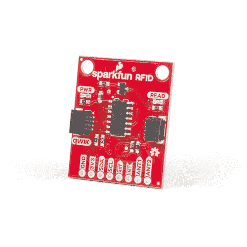](https://www.sparkfun.com/products/15191) 

将**添加到您的[购物车](https://www.sparkfun.com/cart)中！**

### [SparkFun RFID Qwiic 阅读器](https://www.sparkfun.com/products/15191)

[Only 6 left!](https://learn.sparkfun.com/static/bubbles/ "only 6 left!") SEN-15191

SparkFun RFID Qwiic 阅读器是一款基于 I2C 的简单 RFID 分线板，适用于 ID-3LA、ID-12LA 和 ID-20LA 阅读器。

$21.50[Favorited Favorite](# "Add to favorites") 15[Wish List](# "Add to wish list")****[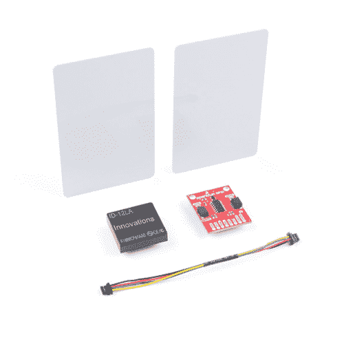](https://www.sparkfun.com/products/15209) 

将**添加到您的[购物车](https://www.sparkfun.com/cart)中！**

### [火花射频识别 qwiic kitT3](https://www.sparkfun.com/products/15209)

[Out of stock](https://learn.sparkfun.com/static/bubbles/ "out of stock") KIT-15209

SparkFun RFID Qwiic 套件是一款简单的一体化 I2C RFID 起点，适用于 ID-3LA、ID-12LA 和 ID-20LA 射频识别系统

$48.503[Favorited Favorite](# "Add to favorites") 16[Wish List](# "Add to wish list")**** ****[https://www.youtube.com/embed/ue0Rtlt6aG4/?autohide=1&border=0&wmode=opaque&enablejsapi=1](https://www.youtube.com/embed/ue0Rtlt6aG4/?autohide=1&border=0&wmode=opaque&enablejsapi=1)

### 所需材料

要跟随本教程，您将需要以下材料。你可能不需要所有的东西，这取决于你拥有什么。将它添加到您的购物车，通读指南，并根据需要调整购物车。

[](https://www.sparkfun.com/products/11827) 

将**添加到您的[购物车](https://www.sparkfun.com/cart)中！**

### [RFID 阅读器 ID-12LA(125 kHz)](https://www.sparkfun.com/products/11827)

[Only 5 left!](https://learn.sparkfun.com/static/bubbles/ "only 5 left!") SEN-11827

RFID(射频识别)是无线非接触使用射频电磁场，为目的…

$32.5012[Favorited Favorite](# "Add to favorites") 21[Wish List](# "Add to wish list")****[](https://www.sparkfun.com/products/15123) 

将**添加到您的[购物车](https://www.sparkfun.com/cart)中！**

### [spark fun RedBoard Qwiic](https://www.sparkfun.com/products/15123)

[In stock](https://learn.sparkfun.com/static/bubbles/ "in stock") DEV-15123

SparkFun RedBoard Qwiic 是一款 Arduino 兼容开发板，内置 Qwiic 连接器，无需…

$21.5014[Favorited Favorite](# "Add to favorites") 49[Wish List](# "Add to wish list")****[](https://www.sparkfun.com/products/10215) 

将**添加到您的[购物车](https://www.sparkfun.com/cart)中！**

### [USB micro-B 线- 6 脚](https://www.sparkfun.com/products/10215)

[In stock](https://learn.sparkfun.com/static/bubbles/ "in stock") CAB-10215

USB 2.0 型到微型 USB 5 针。这是一种新的、更小的 USB 设备连接器。微型 USB 连接器大约是…

$5.5014[Favorited Favorite](# "Add to favorites") 21[Wish List](# "Add to wish list")****[](https://www.sparkfun.com/products/14426) 

将**添加到您的[购物车](https://www.sparkfun.com/cart)中！**

### [Qwiic 线缆- 50mm](https://www.sparkfun.com/products/14426)

[In stock](https://learn.sparkfun.com/static/bubbles/ "in stock") PRT-14426

这是一根 50 毫米长的 4 芯电缆，带有 1 毫米 JST 端接。它旨在将支持 Qwiic 的组件连接在一起…

$0.95[Favorited Favorite](# "Add to favorites") 29[Wish List](# "Add to wish list")****[](https://www.sparkfun.com/products/8431) 

将**添加到您的[购物车](https://www.sparkfun.com/cart)中！**

### [跳线高级 6 "米/米装 10 根](https://www.sparkfun.com/products/8431)

[In stock](https://learn.sparkfun.com/static/bubbles/ "in stock") PRT-08431

这是一个 SparkFun 独家！这些是 155 毫米长、26 AWG 跳线，两端都有公接头。用这些来跳离…

$4.502[Favorited Favorite](# "Add to favorites") 11[Wish List](# "Add to wish list")****[](https://www.sparkfun.com/products/14325) 

将**添加到您的[购物车](https://www.sparkfun.com/cart)中！**

### [RFID 标签(125 khz)](https://www.sparkfun.com/products/14325)

[In stock](https://learn.sparkfun.com/static/bubbles/ "in stock") COM-14325

你可能知道 RFID 是老大哥用来跟踪你的一举一动的技术。快，戴上【锡纸帽】(https…

$2.10[Favorited Favorite](# "Add to favorites") 6[Wish List](# "Add to wish list")**************************Heads up!** For the scope of the tutorial, we will be using the ID-12LA RFID reader. The board is also compatible with the following **ID-xxLA modules at 125kHz**. The range varies with each model. Keep in mind that you will need to an external antenna for the ID-3LA.

[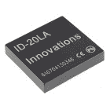](https://www.sparkfun.com/products/11828) 

将**添加到您的[购物车](https://www.sparkfun.com/cart)中！**

### [RFID 阅读器 ID-20LA(125 kHz)](https://www.sparkfun.com/products/11828)

[In stock](https://learn.sparkfun.com/static/bubbles/ "in stock") SEN-11828

RFID(射频识别)是无线非接触使用射频电磁场，为目的…

$37.508[Favorited Favorite](# "Add to favorites") 17[Wish List](# "Add to wish list")****[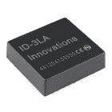](https://www.sparkfun.com/products/11862) 

将**添加到您的[购物车](https://www.sparkfun.com/cart)中！**

### [RFID 阅读器 ID-3LA(125 kHz)](https://www.sparkfun.com/products/11862)

[24 available](https://learn.sparkfun.com/static/bubbles/ "24 available") SEN-11862

RFID(射频识别)是无线非接触使用射频电磁场，为目的…

$27.954[Favorited Favorite](# "Add to favorites") 11[Wish List](# "Add to wish list")********The following **RFID tags** are also compatible with the RFID reader.

[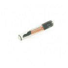](https://www.sparkfun.com/products/9416) 

将**添加到您的[购物车](https://www.sparkfun.com/cart)中！**

### [RFID 玻璃胶囊(125 khz)](https://www.sparkfun.com/products/9416)

[In stock](https://learn.sparkfun.com/static/bubbles/ "in stock") SEN-09416

这是一个玻璃的圆柱形 RFID 标签；很像那些【植入宠物】(http://en . Wikipedia . org/wiki/Pet _ chip……

$5.502[Favorited Favorite](# "Add to favorites") 19[Wish List](# "Add to wish list")****[](https://www.sparkfun.com/products/14325) 

将**添加到您的[购物车](https://www.sparkfun.com/cart)中！**

### [RFID 标签(125 khz)](https://www.sparkfun.com/products/14325)

[In stock](https://learn.sparkfun.com/static/bubbles/ "in stock") COM-14325

你可能知道 RFID 是老大哥用来跟踪你的一举一动的技术。快，戴上【锡纸帽】(https…

$2.10[Favorited Favorite](# "Add to favorites") 6[Wish List](# "Add to wish list")****[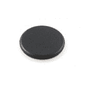](https://www.sparkfun.com/products/9417) 

将**添加到您的[购物车](https://www.sparkfun.com/cart)中！**

### [RFID 按钮- 16mm (125kHz)](https://www.sparkfun.com/products/9417)

[In stock](https://learn.sparkfun.com/static/bubbles/ "in stock") SEN-09417

这是一个简单的，缩略图大小的 RFID 标签。这些标签对于感知存在、识别等非常有用。，而且它们很小…

$4.501[Favorited Favorite](# "Add to favorites") 17[Wish List](# "Add to wish list")****** ******### 工具

你需要一个烙铁、焊料和一般的焊接附件。

[](https://www.sparkfun.com/products/9163) 

将**添加到您的[购物车](https://www.sparkfun.com/cart)中！**

### [无铅焊料- 15 克管](https://www.sparkfun.com/products/9163)

[In stock](https://learn.sparkfun.com/static/bubbles/ "in stock") TOL-09163

这是你的无铅焊料的基本管，带有不干净的水溶性树脂芯。0.031 英寸规格，15 克

$3.954[Favorited Favorite](# "Add to favorites") 14[Wish List](# "Add to wish list")****[](https://www.sparkfun.com/products/9507) 

将**添加到您的[购物车](https://www.sparkfun.com/cart)中！**

### [烙铁- 30W(美国，110V)](https://www.sparkfun.com/products/9507)

[33 available](https://learn.sparkfun.com/static/bubbles/ "33 available") TOL-09507

这是一个非常简单的固定温度，快速加热，30W 110/120 VAC 烙铁。我们真的很喜欢使用更贵的 iro…

$10.957[Favorited Favorite](# "Add to favorites") 21[Wish List](# "Add to wish list")**** ****### 推荐阅读

如果你不熟悉 Qwiic 系统，我们推荐你在这里阅读[以获得一个概述](https://www.sparkfun.com/qwiic)。

| [](https://www.sparkfun.com/qwiic) |
| *[Qwiic 连接系统](https://www.sparkfun.com/qwiic)* |

如果你不熟悉下面的教程，我们也建议你看一看。

[](https://learn.sparkfun.com/tutorials/i2c) [### I2C](https://learn.sparkfun.com/tutorials/i2c) An introduction to I2C, one of the main embedded communications protocols in use today.[Favorited Favorite](# "Add to favorites") 128[](https://learn.sparkfun.com/tutorials/rfid-basics) [### RFID 基础知识](https://learn.sparkfun.com/tutorials/rfid-basics) Dive into the basics of Radio Frequency Identification (RFID) technology.[Favorited Favorite](# "Add to favorites") 28

## 硬件概述

### Qwiic 连接器

这是一款 [Qwiic](https://www.sparkfun.com/qwiic) 产品，但不是“纯”Qwiic 产品。如果你决定使用中断引脚来指示 RFID 卡何时被读取，你仍然需要用[焊接](https://learn.sparkfun.com/tutorials/how-to-solder-through-hole-soldering)或连接中断引脚(稍后将详细介绍)。除此之外，Qwiic 是一个为 I ² C 设备设计的生态系统，它允许你快速制作原型，而不需要焊接任何东西。只需将您的 Qwiic 产品插入支持 Qwiic 的微控制器，您就可以开始使用了！该产品上有两个，这意味着您可以将该产品与其他 I ² C 设备进行菊花链连接，例如 Qwiic [键盘](https://www.sparkfun.com/products/14836)。

[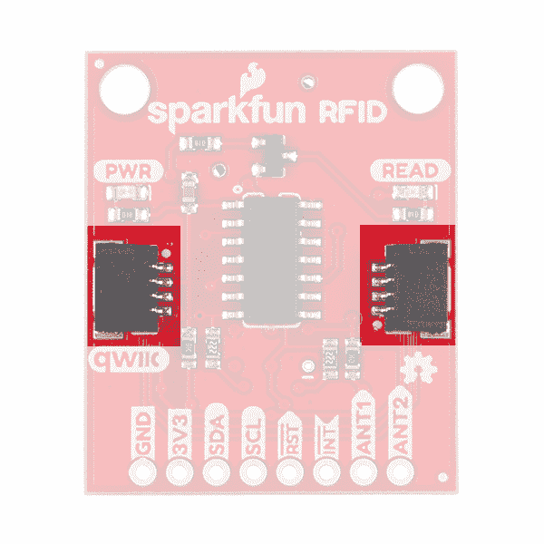](https://cdn.sparkfun.com/assets/learn_tutorials/8/5/7/QwiicConnectors1.jpg)

### 力量

SparkFun Qwiic RFID ID-xxLA 是一款 **3.3V** 系统。您可以将 Qwiic 电缆插入功能强大的微控制器，为产品供电。您也可以通过割台的`3V3`引脚供电。

### 发光二极管和蜂鸣器

当您为主板供电时，您会看到板上的红色电源 LED 亮起。在电源 LED 的对面还有另一个 LED，标有**读作**。当 RFID 标签进入范围时，此蓝色状态 LED 和板载蜂鸣器将分别亮起或发出蜂鸣声。

| [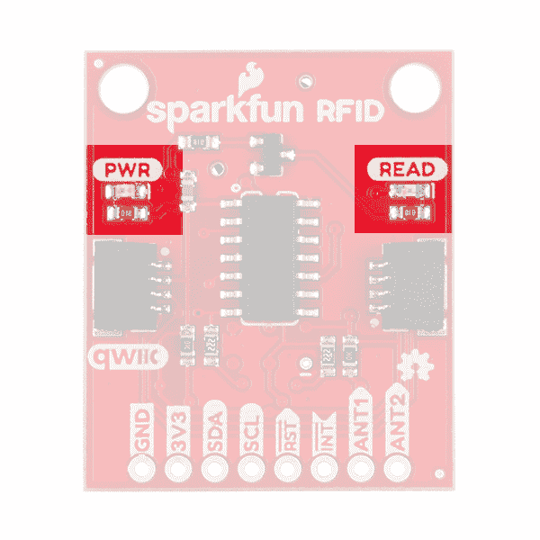](https://cdn.sparkfun.com/assets/learn_tutorials/8/5/7/LEDs1.jpg) | [](https://cdn.sparkfun.com/assets/learn_tutorials/8/5/7/Buzzer1.jpg) |

### RFID 模块

在我们的目录中有三种 **ID-xxLA** 选项，在上面的介绍中列出: [ID-3LA](https://www.sparkfun.com/products/11862) 、 [ID-12LA](https://www.sparkfun.com/products/11827) 和 [ID-20LA](https://www.sparkfun.com/products/11828) 。如果您购买了 [SparkFun RFID 套件](https://www.sparkfun.com/products/15209)，那么它包括您需要的 ID-12LA 和 RFID 卡。下图是插入 Qwiic RFID 的 ID-12LA。

[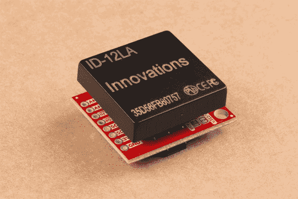](https://cdn.sparkfun.com/assets/learn_tutorials/8/5/7/ID-12LA_module1.jpg)

每个选项都是相似的，但是在功耗上有很小的差异，这转化为不同的读取范围能力。ID-3LA 设计为与外部天线一起使用，这将使您获得 30 厘米的范围。ID-12LA 和 ID-20LA 的射程分别为 12 厘米和 18 厘米。

插入您的模块时，只要注意针脚较少的一侧插入针脚较少的接头即可。

[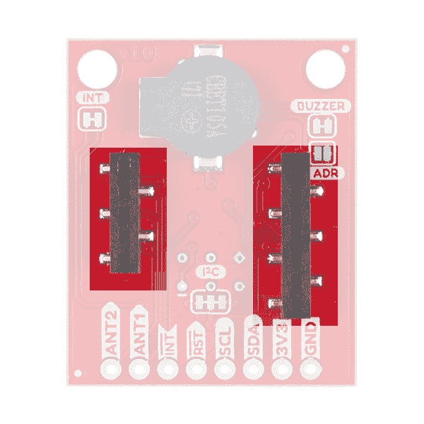](https://cdn.sparkfun.com/assets/learn_tutorials/8/5/7/Headers_Module1.jpg)*Smaller header on the left, larger on the right.*

### 针织套衫

产品的割台侧有*四个*跳线。面对顶部带有蜂鸣器的产品，您会看到左侧标有`INT`的跳线。中断引脚可以通过[切断轨迹](https://learn.sparkfun.com/tutorials/how-to-work-with-jumper-pads-and-pcb-traces)断开。现在移到底部靠近接头的是一个标有`I2C`的跳线，它将 I ² C 上拉电阻连接到 I ² C 数据线。右边是一个标有`Buzzer`的跳线，当切断时会断开蜂鸣器。当 RFID 卡在范围内时，这将禁用蜂鸣声。最后，`ADDR`跳线允许您将默认 I ² C 跳线从 **0x7D** 更改为 **0x7C** 。

[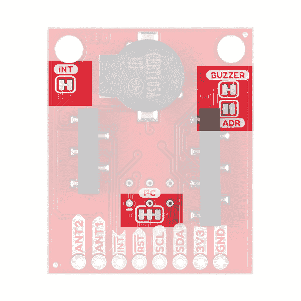](https://cdn.sparkfun.com/assets/learn_tutorials/8/5/7/Jumpers1.jpg)

## 硬件装配

只需在 RedBoard Qwiic 和 Qwiic RFID 阅读器之间插入一根 qw IC 电缆。您还需要在 Qwiic RedBoard 的引脚 8 和 Qwiic RFID 阅读器的 INT 引脚之间焊接电线。准备就绪后，将模块的接头与 Qwiic RFID 阅读器对齐。

[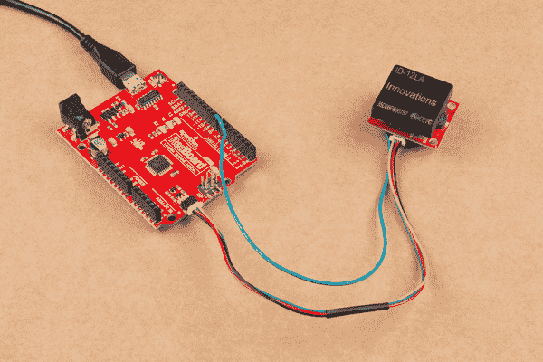](https://cdn.sparkfun.com/assets/learn_tutorials/8/5/7/SparkFun_RFID_Qwiic_Reader_Hookup_Guide-031.jpg)**Note:** The Qwiic system has a logic level of **3.3V**. I have attached the interrupt to pin 8 on the Redboard Qwiic even though the pin is at 5 volts. This will not harm the Qwiic RFID because we're doing a simple **digitalRead()** but also because the ATTiny84 is tolerant of voltages up to 5.5V.

## Arduino 图书馆

我们编写了一个库，使 SparkFun Qwiic RFID ID-XXLA 更容易上手。该库将为您提供 Qwiic RFID ID-XXLA 的全部功能，而无需 ic 数据事务的 hub bub。还包括示例代码来演示该库的全部功能。你可以点击下面的链接直接下载文件并手动安装，或者通过搜索 **SparkFun Qwiic RFID** 在 Arduino 库管理器中导航。你也可以去 [Github 页面](https://github.com/sparkfun/SparkFun_Qwiic_RFID_Arduino_Library)下载。

[SparkFun Qwiic RFID Arduino Library (ZIP)](https://github.com/sparkfun/SparkFun_Qwiic_RFID_Arduino_Library/archive/master.zip)**Note:** This example assumes you are using the latest version of the Arduino IDE on your desktop. If this is your first time using Arduino, please review our tutorial on [installing the Arduino IDE.](https://learn.sparkfun.com/tutorials/installing-arduino-ide) If you have not previously installed an Arduino library, please check out our [installation guide.](https://learn.sparkfun.com/tutorials/installing-an-arduino-library)

## 示例代码

让我们来看看 **SparkFun Qwiic RFID Arduino 库**中提供的前两个示例草图。

### 示例 1 -读取标签基础知识

在第一个例子中，我们将通过在 Arduino IDE 的串行终端中键入数字`1`来获取被扫描的卡以及从它被扫描到我们请求数字之间的*时间*。如果你直接下载了 SparkFun Qwiic RFID Arduino 库，那么打开位于 examples 文件夹中的示例:**spark fun _ Qwiic _ RFID _ Arduino _ Library**>**Examples**>**example 1 _ Read _ Tag _ basics . ino**。如果你已经通过 Arduino 库管理器下载了这个库，那么在 Arduino IDE 中你可以导航到**文件** > **示例**>**spark fun Qwiic RFID Arduino 库** > **示例 1_Read_Tag_Basics** 。

让我们在代码的最顶端浏览一下设置。这里没有什么太令人惊讶的，我们已经`#included`使用了 Wire 库和 SparkFun Qwiic RFID 库。然后我们用`Qwiif Rfid myRfid(RFID_ADDR)`声明初始化这个库。您可能会注意到，它将 Qwiic RFID 阅读器的地址作为其参数之一:`RFID_ADDR`。在设置中，我们`begin`了 Wire、Serial 以及 Qwiic RFID 库。如果你的 Redboard 和 SparkFun Qwiic RFID 板之间有问题，我们会打印出一条错误信息。

```
language:c
#include <Wire.h> 
#include "SparkFun_Qwiic_Rfid.h"

#define RFID_ADDR 0x7D // Default I2C address 

Qwiic_Rfid myRfid(RFID_ADDR);

String tag; 
float scanTime;
int serialInput; 

void setup()
{
  // Begin I-squared-C
    Wire.begin(); 
    Serial.begin(115200); 

  if(myRfid.begin())
    Serial.println("Ready to scan some tags!"); 
  else
    Serial.println("Could not communicate with Qwiic RFID!"); 

  // Want to clear tags sitting on the Qwiic RFID card?
  //myRfid.clearTags();
} 
```

在主循环中，我们正在寻找要输入串行终端的数字 **1** 。输入后，我们将通过`myRFId.getTag()`函数调用获取 RFID 标签，并通过`myRFID.getPrecReqTime()`函数调用获取其“扫描”时间(以秒为单位)。只是在“时间”上快速说明一下。这不是一天中扫描标签的时间，而是从扫描到请求之间的时间。这赋予每个 RFID 标签一个独特的属性，即使你扫描同一张卡两次，因为它们的扫描时间是不同的。

```
language:c
void loop()
{
  if (Serial.available() > 0){

    serialInput = Serial.read(); 
    if (serialInput == 49){   // "1" on your keyboard is 49 in ASCII

      tag = myRfid.getTag();
      Serial.print("Tag ID: ");
      Serial.print(tag);
      scanTime = myRfid.getPrecReqTime(); 
      // If this time is too precise try: 
      // long time = myRfid.getReqTime(); 
      Serial.print(" Scan Time: ");
      Serial.println(scanTime);

    }

  }
} 
```

在扫描一张卡并等待几秒钟后，将 **1** 输入串行终端，我的输出如下所示。

[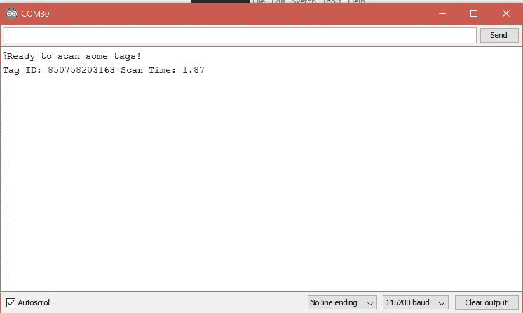](https://cdn.sparkfun.com/assets/learn_tutorials/8/5/7/Serial_OUTPUT_Serial_INPUT.JPG)

如果你需要一个类似的例子，但它能读取 SparkFun Qwiic RFID ID-XXLA 阅读器上存储的所有 20 个标签，那么请查看**example 5 _ Get _ All _ Available _ Tags**

### 示例 2 -读取标签中断

在下一个例子中，我们将使用一个额外的引脚作为中断，指示已经扫描了一张卡，这使得这不是一个纯粹的*Qwiic 例子。我们将使用该中断来发起一个请求，以读取 SparkFun Qwiic RFID 阅读器所持有的标签。如果你直接下载了 SparkFun Qwiic RFID Arduino 库，那么打开位于 examples 文件夹中的示例:**spark fun _ Qwiic _ RFID _ Arduino _ Library**>**Examples**>**example 2 _ Read _ Tag _ interrupt . ino**。如果您已经通过 Arduino 库管理器下载了该库，那么在 Arduino IDE 中，您可以导航到**文件** > **示例**>**spark fun Qwiic RFID Arduino 库** > **示例 2_Read_Tag_Interrupt** 。*

在顶部，我们`#include`新的库，并使用默认地址进行我们的`Qwiic Rfid myRfid(RFID_ADDR)`声明。在设置中，我们用`myRfid.begin`语句与 SparkFun Qwiic RFID 阅读器通信。如果在与 Qwiic RFID 通信时有任何问题，我们会在此处了解。最后但同样重要的是，我们用`pinMode(intPin, INPUT_PULLUP)`将引脚 3 上的中断引脚拉高，使其进入已知的**高电平**状态。当标签被读取时，这条线将变为低电平。

```
language:c
#include <Wire.h> 
#include "SparkFun_Qwiic_Rfid.h"

#define RFID_ADDR 0x7D // Default I2C address 

// Interrupt Pin on pin 3\. 
const int intPin = 3; 
String tag; 

Qwiic_Rfid myRfid(RFID_ADDR);

void setup()
{
  // Begin I-squared-C
    Wire.begin(); 
    Serial.begin(115200); 

  if(myRfid.begin())
    Serial.println("Ready to scan some tags!"); 
  else
    Serial.println("Could not communicate with the Qwiic RFID Reader!!!"); 

  // Put the interrupt pin in a known HIGH state. 
  pinMode(intPin, INPUT_PULLUP); 

  // Want to clear tags sitting on the Qwiic RFID card?
  //myRfid.clearTags();

} 
```

在循环中，我们只是监控 Qwiic RFID 的中断引脚，它将指示标签刚刚被读取。这将启动对`myRfid.getTag()`的调用，该调用将获取扫描卡的 RFID 标签 ID。

```
language:c
void loop()
{

  // If the pin goes low, then a card has been scanned. 
  if(digitalRead(intPin) == LOW){
    tag = myRfid.getTag();
    Serial.println(tag);
  }

  delay(500); // Geeze, woah! Slow it down mate.

} 
```

就是这样！

如果您还没有，请选择 Arduino 的板卡和 COM 端口，并上传 **Example1_ReadTag.ino** 代码。然后在 **9600** 打开你的[串口监视器](https://learn.sparkfun.com/tutorials/terminal-basics/arduino-serial-monitor-windows-mac-linux)扫描一个标签，

[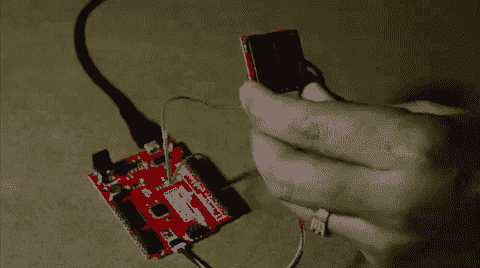](https://cdn.sparkfun.com/assets/learn_tutorials/8/5/7/SparkFun_RFID_Qwiic_Reader_Demo1.gif)

您应该看到以下内容:

[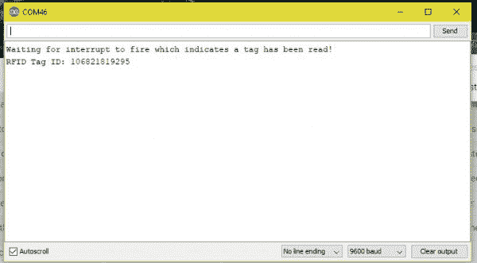](https://cdn.sparkfun.com/assets/learn_tutorials/8/5/7/SerialOutput_Single_NoTime.JPG)

## Python 包

**注意:**本教程假设您使用的是最新版本的 Python 3。如果这是你第一次在 Raspberry Pi 上使用 Python 或 I ² C 硬件，请查看我们关于用 Raspberry Pi 和 [Raspberry Pi SPI 和 I2C 教程](https://learn.sparkfun.com/tutorials/raspberry-pi-spi-and-i2c-tutorial)进行 [Python 编程的教程。Jetson Nano 用户可以通过 Jupyter 笔记本](https://learn.sparkfun.com/tutorials/python-programming-tutorial-getting-started-with-the-raspberry-pi)查看关于在 Jetson Nano 上使用 Qwiic 的[教程。](https://learn.sparkfun.com/tutorials/working-with-qwiic-on-a-jetson-nano-through-jupyter-notebooks)

我们编写了一个 Python 包来轻松设置和读取 ID-LA RFID 模块。有两种方法可以安装 Qwiic RFID 的 Python 包。

1.  安装全包 SparkFun Qwiic Python 包。
2.  独立安装 SparkFun RFID Python 包。

推荐使用全包式 SparkFun Qwiic Python 包，因为它还安装了所需的 I ² C 驱动程序。

注意:不要忘记仔细检查你的单板计算机上的硬件 I ² C 连接是否启用。

### SparkFun Qwiic 包

这个存储库作为`sparkfun-qwiic`包托管在 PyPi 上。在支持 PyPi 的系统上，通过`pip3`(对于 Python 2 使用`pip`)安装很简单，使用以下命令:

对于**所有用户**(注意:用户必须拥有 [**须户**](https://en.wikipedia.org/wiki/Sudo) 权限):

```
language:bash
sudo pip3 install sparkfun-qwiic 
```

对于**当前用户**:

```
language:bash
pip3 install sparkfun-qwiic 
```

### 独立安装

可以独立安装`sparkfun-qwiic-rfid` Python 包，由 PyPi 托管。然而，如果你喜欢从 [GitHub 库](https://github.com/sparkfun/Qwiic_RFID_Py)手动下载并安装软件包，你可以在这里下载(**请注意任何软件包的依赖关系。你也可以查看位于 [ReadtheDocs](https://qwiic-rfid-py.readthedocs.io/en/latest/index.html) 上的库文档页面。*):

[Download the SparkFun Qwiic RFID Python Package (ZIP)](https://github.com/sparkfun/Qwiic_RFID_Py/archive/main.zip)

#### PyPi 安装

这个存储库作为`sparkfun-qwiic-rfid`包托管在 PyPi 上。在支持 PyPi 的系统上，通过`pip3`(对于 Python 2 使用`pip`)安装很简单，使用以下命令:

对于**所有用户**(注意:用户必须拥有 [**须户**](https://en.wikipedia.org/wiki/Sudo) 权限):

```
language:bash
sudo pip3 install sparkfun-qwiic-rfid 
```

对于**当前用户**:

```
language:bash
pip3 install sparkfun-qwiic-rfid 
```

#### 本地安装

要安装，请确保系统上安装了`setuptools`包。

命令行直接安装(Python 2 使用`python`):

```
language:bash
python3 setup.py install 
```

要构建与`pip3`一起使用的包:

```
language:bash
python3 setup.py sdist 
```

构建一个包文件并放在名为 dist 的子目录中。这个包文件可以用`pip3`来安装。

```
language:bash
cd dist
pip3 install sparkfun_qwiic_rfid-<version>.tar.gz 
```

### Python 包操作

在我们开始阅读之前，让我们仔细看看 Python 包中可用的函数。下面是对 Python 包的基本功能的描述。这包括包的组织、内置方法以及它们的输入和/或输出。关于 Python 包如何工作的更多细节，请查看[源代码](https://github.com/sparkfun/Qwiic_RFID_Py/blob/main/qwiic_rfid.py)和[包文档](https://qwiic-rfid-py.readthedocs.io/en/latest/index.html)。

#### 属国

这个 Python 包在代码中只有很少的依赖项，如下所示:

```
language:python
import qwiic_i2c
import time 
```

#### 默认变量

代码中该 Python 包的默认变量如下所示:

```
language:python
# qwiic_rfid GLOBAL VARIABLES
#----------------------------------------------------------------------------------------------------
# Define the device name and I2C addresses. These are set in the class defintion 
# as class variables, making them avilable without having to create a class instance.
# This allows higher level logic to rapidly create a index of qwiic devices at 
# runtine
#
# The name of this device 
_DEFAULT_NAME = "Qwiic RFID"

# Some devices have multiple availabele addresses - this is a list of these addresses.
# NOTE: The first address in this list is considered the default I2C address for the 
# device.
_AVAILABLE_I2C_ADDRESS = [0x13, 0x14] 
```

**Note:** This package is different from previous packages as the register variables are declared in the object class.

```
language:python
# QwiicRFID CLASS VARIABLES
#----------------------------------------------------------------------------------------------------
ALTERNATE_ADDR = 0x7C
ADDRESS_LOCATION = 0xC7

TAG_AND_TIME_REQUEST = 10
MAX_TAG_STORAGE = 20
BYTES_IN_BUFFER = 4

RFID_TAG = None
RFID_TIME = None
TAG_ARRAY = [None] * MAX_TAG_STORAGE
TIME_ARRAY = [None] * MAX_TAG_STORAGE 
```

#### 班级

**`QwiicRFID()`** 或 **`QwiicRFID(address)`**
这个 Python 包作为一个类对象运行，允许创建该类型的新实例。使用一个`__init__()`构造器，该构造器使用默认或指定的 I ² C 地址通过 I ² C 总线创建一个到 I ² C 设备的连接。

##### 构造函数

构造函数是一种特殊的方法，用于在创建对象时初始化(赋值)对象所需的数据成员。

**T2`__init__(address=None, i2c_driver=None):`**

Input: valueThe value of the device address. If not defined, the Python package will use the default I²C address (**0x13**) stored under `_AVAILABLE_I2C_ADDRESS` variable.Input: *i2c_driver*Loads the specified I²C driver; by default the [Qwiic I²C driver](https://github.com/sparkfun/Qwiic_I2C_Py) is used: `qwiic_i2c.getI2CDriver()`. Users should use the default I²C driver and leave this field blank.

#### 功能

函数是类的一个属性，它为类的实例定义了一个方法。简单地说，它们是类的操作(或方法)的对象。所有可用函数的列表在 [Qwiic_RFID_Py Python 包](https://github.com/sparkfun/Qwiic_RFID_Py)的 ReadtheDocs 的 [API 参考页](https://qwiic-rfid-py.readthedocs.io/en/latest/apiref.html)中有详细说明。

### 升级 Python 包

将来，可能会对 Python 包进行更改。必须为每个软件包单独更新已安装的软件包(即子模块和依赖项不会自动更新，必须手动更新)。对于`sparkfun-qwiic-rfid` Python 包，使用下面的命令(对于 Python 2 使用`pip`):

对于**所有用户**(注意:用户必须拥有 [**须户**](https://en.wikipedia.org/wiki/Sudo) 权限):

```
language:bash
sudo pip3 install --upgrade sparkfun-qwiic-rfid 
```

对于**当前用户**:

```
language:bash
pip3 install --upgrade sparkfun-qwiic-rfid 
```

## Python 示例

**Note:** Work on this section is in progress. We will update the content as soon as we can.

## 资源和更进一步

既然您已经成功地安装并运行了 Qwiic RFID 阅读器，是时候将它集成到您自己的项目中了！

有关更多信息，请查看以下资源:

*   [示意图(PDF)](https://cdn.sparkfun.com/assets/5/f/e/b/0/Qwiic_RFID_-_IDXXLA-Sch.pdf)
*   [老鹰文件(ZIP)](https://cdn.sparkfun.com/assets/4/5/2/6/e/Qwiic_RFID_Eagle.zip)
*   开源代码库
    *   [硬件回购](https://github.com/sparkfun/SparkFun_Qwiic_RFID_ID-XXLA)
    *   [Qwiic RFID Arduino Library Repo](https://github.com/sparkfun/SparkFun_Qwiic_RFID_Arduino_Library)
        *   [Qwiic RFID Arduino 库(ZIP)](https://github.com/sparkfun/SparkFun_Qwiic_RFID_Arduino_Library/archive/master.zip)
    *   [Qwiic RFID Python 包](https://github.com/sparkfun/Qwiic_RFID_Py)
*   [SFE 产品展示区](https://youtu.be/ue0Rtlt6aG4)

我们提供其他 RFID 选项。你想要一个*高*供电的 RFID 阅读器，一次可以同时拾取多张 RFID 卡吗？也许你更喜欢通过串行传输的 RFID 读卡器，看看下面的选项。

[](https://www.sparkfun.com/products/14066) 

### [SparkFun 同步 RFID 阅读器- M6E Nano](https://www.sparkfun.com/products/14066)

[Out of stock](https://learn.sparkfun.com/static/bubbles/ "out of stock") SEN-14066

SparkFun 同步 RFID 阅读器是一款 Arduino 兼容板，可帮助您开始使用 M6E Nano UHF RFID 阅读器。

26[Favorited Favorite](# "Add to favorites") 45[Wish List](# "Add to wish list")[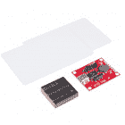](https://www.sparkfun.com/products/13198) 

### [SparkFun RFID 入门套件](https://www.sparkfun.com/products/13198)

[Out of stock](https://learn.sparkfun.com/static/bubbles/ "out of stock") KIT-13198

这是 SparkFun RFID 入门套件，这是一个集所有功能于一身的套件，提供您完成下一个 RFID 项目所需的一切…

15[Favorited Favorite](# "Add to favorites") 69[Wish List](# "Add to wish list")

你的下一个项目需要一些灵感吗？查看一些带有 RFID 标签的相关教程:

[](https://learn.sparkfun.com/tutorials/sparkfun-rfid-starter-kit-hookup-guide) [### SparkFun RFID 入门套件连接指南](https://learn.sparkfun.com/tutorials/sparkfun-rfid-starter-kit-hookup-guide) Learn the basics of how to get started with the SparkFun RFID Starter Kit.[Favorited Favorite](# "Add to favorites") 12[](https://learn.sparkfun.com/tutorials/simultaneous-rfid-tag-reader-hookup-guide) [### 同步 RFID 标签阅读器连接指南](https://learn.sparkfun.com/tutorials/simultaneous-rfid-tag-reader-hookup-guide) A basic guide to getting started with the RFID Tag Reader breakout and how to read and write multiple RFID tags over multiple feet 8[](https://learn.sparkfun.com/tutorials/build-a-qwiic-jukebox-that-is-toddler-approved) [### 建立一个 Qwiic 点唱机是幼儿批准！](https://learn.sparkfun.com/tutorials/build-a-qwiic-jukebox-that-is-toddler-approved) Follow this tutorial to build your own custom jukebox. Note, this is designed simple and tough for use primarily with toddlers. It's also a great introduction to SparkFun's Qwiic products 1[](https://learn.sparkfun.com/tutorials/rfid-beginners-tutorial) [### RFID 初学者教程](https://learn.sparkfun.com/tutorials/rfid-beginners-tutorial) In this tutorial we'll revisit some RFID basics and practice by making a remote work logger using an RFID reader and a GPS module. You'll scan a card and get ID, location, and time. All the perfect data to punch in and punch out from the middle of Nowhere 12

或者看看这篇博客:

[](https://www.sparkfun.com/news/2887 "March 7, 2019: Hop on the I2C  BUS and let's build Escape Room puzzles Qwiic!") [### 英语日:Qwiic 密室逃脱

March 7, 2019](https://www.sparkfun.com/news/2887 "March 7, 2019: Hop on the I2C  BUS and let's build Escape Room puzzles Qwiic!")[Favorited Favorite](# "Add to favorites") 4[](https://www.sparkfun.com/news/2901 "April 4, 2019: Check out this Qwiic-based jukebox using Qwiic RFID and Qwiic MP3\. Follow along with the video and hookup guide to build your own!") [### 今日英语:Qwiic 点唱机

April 4, 2019](https://www.sparkfun.com/news/2901 "April 4, 2019: Check out this Qwiic-based jukebox using Qwiic RFID and Qwiic MP3\. Follow along with the video and hookup guide to build your own!")[Favorited Favorite](# "Add to favorites") 0[](https://www.sparkfun.com/news/3420 "October 22, 2020: Building a system that records temperature based on a user's unique RFID tag into an Excel spreadsheet for the world of COVID-19.") [### 基于 RFID 的 DIY 非接触式温度监控系统

October 22, 2020](https://www.sparkfun.com/news/3420 "October 22, 2020: Building a system that records temperature based on a user's unique RFID tag into an Excel spreadsheet for the world of COVID-19.")[Favorited Favorite](# "Add to favorites") 0******************************