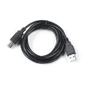

# Qwiic 透明有机发光二极管平视显示器连接指南

> 原文：<https://learn.sparkfun.com/tutorials/qwiic-transparent-oled-hud-hookup-guide>

## 介绍

清晰的屏幕不再是科幻世界的事情！Qwiic 透明有机发光二极管 HUD ( [平视显示器](https://en.wikipedia.org/wiki/Head-up_display))是 SparkFun 对所有未来透明 HUD 需求的回答。虽然你可以透过显示屏看到，但每个分段都有**区域颜色**，这意味着虽然没有一个分段可以改变颜色，但显示屏上有不同颜色的分段。

[](https://www.sparkfun.com/products/15079) 

### [【spark fun 透明有机发光二极管 HUD Breakout (Qwiic)](https://www.sparkfun.com/products/15079)

[Out of stock](https://learn.sparkfun.com/static/bubbles/ "out of stock") LCD-15079

Qwiic 透明有机发光二极管 HUD 是 SparkFun 对你所有未来透明 HUD 需求的回答。

[Favorited Favorite](# "Add to favorites") 46[Wish List](# "Add to wish list")

[https://www.youtube.com/embed/8Xre5bewfVE/?autohide=1&border=0&wmode=opaque&enablejsapi=1](https://www.youtube.com/embed/8Xre5bewfVE/?autohide=1&border=0&wmode=opaque&enablejsapi=1)

### 所需材料

要跟随本教程，您将需要以下材料。你可能不需要所有的东西，这取决于你拥有什么。将它添加到您的购物车，通读指南，并根据需要调整购物车。

#### 微控制器

透明的有机发光二极管 HUD 需要相当多的内存，所以你需要一个至少有 5500 字节内存的微控制器来控制一切。查看下面的一些可能的选项。

[](https://www.sparkfun.com/products/11061) 

将**添加到您的[购物车](https://www.sparkfun.com/cart)中！**

 **### [Arduino Mega 2560 R3](https://www.sparkfun.com/products/11061)

[In stock](https://learn.sparkfun.com/static/bubbles/ "in stock") DEV-11061

Arduino 是一个开源的物理计算平台，它基于一个简单的 i/o 板和一个开发环境

$48.9559[Favorited Favorite](# "Add to favorites") 77[Wish List](# "Add to wish list")****[](https://www.sparkfun.com/products/13907) 

将**添加到您的[购物车](https://www.sparkfun.com/cart)中！**

 **### [SparkFun ESP32 东西](https://www.sparkfun.com/products/13907)

[In stock](https://learn.sparkfun.com/static/bubbles/ "in stock") DEV-13907

SparkFun ESP32 Thing 是 Espressif 的 ESP32 的综合开发平台，ESP32 是他们的超级充电版本…

$23.5069[Favorited Favorite](# "Add to favorites") 83[Wish List](# "Add to wish list")****[](https://www.sparkfun.com/products/13664) 

将**添加到您的[购物车](https://www.sparkfun.com/cart)中！**

 **### [SparkFun SAMD21 迷你突围](https://www.sparkfun.com/products/13664)

[In stock](https://learn.sparkfun.com/static/bubbles/ "in stock") DEV-13664

如果您准备从旧的 8 位/16MHz 微控制器升级您的 Arduino 游戏，SparkFun SAMD21 Mini Breakout 是…

$22.5018[Favorited Favorite](# "Add to favorites") 36[Wish List](# "Add to wish list")****[](https://www.sparkfun.com/products/14812) 

将**添加到您的[购物车](https://www.sparkfun.com/cart)中！**

 **### [spark fun red Board Turbo-samd 21 开发板](https://www.sparkfun.com/products/14812)

[In stock](https://learn.sparkfun.com/static/bubbles/ "in stock") DEV-14812

如果你准备从旧的 8 位/16MHz 微控制器升级你的 Arduino 游戏，SparkFun RedBoard Turbo 是一种形式…

$26.958[Favorited Favorite](# "Add to favorites") 27[Wish List](# "Add to wish list")****[](https://www.sparkfun.com/products/13711) 

将**添加到您的[购物车](https://www.sparkfun.com/cart)中！**

 **### [SparkFun ESP8266 东西开发板](https://www.sparkfun.com/products/13711)

[In stock](https://learn.sparkfun.com/static/bubbles/ "in stock") WRL-13711

SparkFun ESP8266 Thing Dev Board 是一款开发板，专门围绕 ESP8266 设计，集成了一个

$18.5070[Favorited Favorite](# "Add to favorites") 58[Wish List](# "Add to wish list")****[](https://www.sparkfun.com/products/14057) 

### [Teensy 3.6](https://www.sparkfun.com/products/14057)

[Out of stock](https://learn.sparkfun.com/static/bubbles/ "out of stock") DEV-14057

Teensy 3.6 更大，更快，能够进行更复杂的项目，特别是其板载微型 SD 卡端口和升级…

15[Favorited Favorite](# "Add to favorites") 39[Wish List](# "Add to wish list")**********************Warning!** The Arduino sketch required to drive this display requires quite a bit of dynamic memory, meaning that it is not going to fit on a smaller controller like an ATmega328\. Any controller with larger RAM should have no problem. It has been tested to run very well on an Arduino Mega 2560\. In addition, your 3.3v source should be robust enough to supply around 400mA to the display.

#### 电缆

现在要进入 qw IC 生态系统，关键是使用 qw IC 屏蔽来匹配您对微控制器的偏好。在本教程中，我们将使用 Qwiic 至试验板适配器电缆。你还需要一根电缆将代码上传到你的微控制器。

[](https://www.sparkfun.com/products/512) 

将**添加到您的[购物车](https://www.sparkfun.com/cart)中！**

 **### [USB 线 A 到 B - 6 脚](https://www.sparkfun.com/products/512)

[In stock](https://learn.sparkfun.com/static/bubbles/ "in stock") CAB-00512

这是标准的 USB 2.0 电缆。这是最常见的 A 到 B 公/公型外围电缆，就是通常的那种…

$4.501[Favorited Favorite](# "Add to favorites") 13[Wish List](# "Add to wish list")****[](https://www.sparkfun.com/products/14425) 

将**添加到您的[购物车](https://www.sparkfun.com/cart)中！**

 **### [Qwiic 电缆-试验板跳线(4 针)](https://www.sparkfun.com/products/14425)

[In stock](https://learn.sparkfun.com/static/bubbles/ "in stock") PRT-14425

这是一根跳线适配器电缆，一端带有一个 Qwiic JST 母接头，另一端带有一个试验板连接…

$1.50[Favorited Favorite](# "Add to favorites") 34[Wish List](# "Add to wish list")**** ****### 推荐阅读

如果你不熟悉 Qwiic 系统，我们推荐你在这里阅读[以获得一个概述](https://www.sparkfun.com/qwiic)。

| [](https://www.sparkfun.com/qwiic) |
| *[Qwiic 连接系统](https://www.sparkfun.com/qwiic)* |

如果你不熟悉下面的教程，我们也建议你看一看。

[](https://learn.sparkfun.com/tutorials/serial-communication) [### 串行通信](https://learn.sparkfun.com/tutorials/serial-communication) Asynchronous serial communication concepts: packets, signal levels, baud rates, UARTs and more 100[](https://learn.sparkfun.com/tutorials/i2c) [### I2C](https://learn.sparkfun.com/tutorials/i2c) An introduction to I2C, one of the main embedded communications protocols in use today.[Favorited Favorite](# "Add to favorites") 128[](https://learn.sparkfun.com/tutorials/terminal-basics) [### 串行终端基础知识](https://learn.sparkfun.com/tutorials/terminal-basics) This tutorial will show you how to communicate with your serial devices using a variety of terminal emulator applications.[Favorited Favorite](# "Add to favorites") 46

## 硬件概述

首先，让我们来看看我们正在处理的 Qwiic HUD 的一些特性，这样我们就知道对电路板有什么期望了。

| **特性** | **范围** |
| 工作电压 | **1.65V-3.3V** |
| 源电流 | **400 毫安** |
| I ² C 地址 | 0x30、0x31 |

请注意，有机发光二极管可以拉动约 400 毫安的电流，所以请确保您有一个足够强大的电源，尤其是如果有机发光二极管不是您唯一供电的东西。还要注意，有机发光二极管位于两个 I ² C 地址上，所以要确保任何其他 I ² C 设备不会占用地址 **0x30** 和 **0x31** 。

### 腿

下表列出了所有透明有机发光二极管的引脚及其功能。

| 别针 | 描述 | 方向 |
| GND | 地面 | 在…里 |
| 3.3V | 力量 | 在…里 |
| 国家药品监督管理局 | 数据 | 双向的 |
| SCL | 时钟 | 在…里 |

### 可选功能

透明有机发光二极管分线点具有连接到 I ² C 总线的上拉电阻；如果多个传感器连接到总线并使能上拉电阻，并联等效电阻将产生过强的上拉电阻，使总线无法正常工作。一般来说，如果总线上连接了多个器件，则除一对上拉电阻外，应禁用所有上拉电阻。如果需要断开上拉电阻，可以通过[切断下面突出显示的相应跳线上的轨迹](https://learn.sparkfun.com/tutorials/how-to-work-with-jumper-pads-and-pcb-traces)来移除。

[](https://cdn.sparkfun.com/assets/learn_tutorials/8/4/3/i2c.png)*Pull-up Jumpers*

当主板通电时，板载 LED(下面突出显示)将会亮起。

[](https://cdn.sparkfun.com/assets/learn_tutorials/8/4/3/pwr.png)*Power LED*

## 硬件装配

透明的有机发光二极管 HUD 需要相当多的内存(大约 5500 字节)，所以你需要将 I ² C 引脚直接连接到没有 Qwiic Shields 的设备。使用 Qwiic 跳线适配器电缆将黄色连接到 SCL，蓝色连接到 SDA，红色连接到 3.3V，黑色连接到地。在这种情况下，我们将电路板连接到一个 [Arduino Mega 2560 的 I ² C 引脚](https://www.arduino.cc/en/reference/wire)。

[](https://cdn.sparkfun.com/assets/learn_tutorials/8/4/3/OLED_Hookup_Guide-03.jpg)*Transparent OLED HUD Attached to Arduino Mega*

## 库概述

**注意:**此示例假设您在桌面上使用的是最新版本的 Arduino IDE。如果这是你第一次使用 Arduino，请回顾我们关于[安装 Arduino IDE 的教程。](https://learn.sparkfun.com/tutorials/installing-arduino-ide)如果您之前没有安装 Arduino 库，请查看我们的[安装指南。](https://learn.sparkfun.com/tutorials/installing-an-arduino-library)

首先，你需要一个透明的有机发光二极管 HUD，Arduino 库。您可以通过 Arduino 库管理器获得该库。搜索 **Sparkfun Wisechip HUD** 安装最新版本。如果你喜欢从 [GitHub 库](https://github.com/sparkfun/SparkFun_WiseChip_HUD_Library)下载库并手动安装，你可以在这里下载:

[DOWNLOAD THE SPARKFUN WISECHIP HUD LIBRARY (ZIP)](https://github.com/sparkfun/SparkFun_WiseChip_HUD_Library/archive/master.zip)

在我们开始绘制草图之前，让我们看看所有可以用来控制透明 HUD 上的线段的功能。以下代码初始化罗盘圆圈中各个部分的功能(`CCx()`功能)、罗盘箭头(`D0x()`功能)、轮胎压力指示、目的地距离(`H01()`、`K01()`、`M01()`表示小时、公里和米)、转弯距离(`K02()`和`M03()`表示公里和米)、电话和 TPMS 图标(`P0x()`和`T0x()`)，最后是车速表和罗盘上的**1**(`S01_BAR()`和`S15_BAR()`)。你不需要使用这些函数中的大部分，因为大部分都在更高级的函数中使用，比如`setSpeedometer()`，但是我们已经给了你访问这些段的权限。打开任何 segmetn 就像用参数`1`调用它一样简单。用`0`打电话会关机。

```
language:c
void D01(uint8_t Action);
void CC1(uint8_t Action);
void D02(uint8_t Action);
void CC2(uint8_t Action);
void D03(uint8_t Action);
void CC3(uint8_t Action);
void D04(uint8_t Action);
void CC4(uint8_t Action);
void D05(uint8_t Action);
void CC5(uint8_t Action);
void D06(uint8_t Action);
void CC6(uint8_t Action);
void D07(uint8_t Action);
void CC7(uint8_t Action);
void D08(uint8_t Action);
void CC8(uint8_t Action);
void D0x(uint8_t Action);
void C01(uint8_t Action);
void C02(uint8_t Action);
void H01(uint8_t Action);
void K01(uint8_t Action);
void M01(uint8_t Action);
void C03(uint8_t Action);
void K02(uint8_t Action);
void M03(uint8_t Action);
void P01(uint8_t Action);
void P02(uint8_t Action);
void P03(uint8_t Action);
void T01(uint8_t Action);
void T02(uint8_t Action);
void S01_BAR(uint8_t Action);
void S15_BAR(uint8_t Action); 
```

### 高级功能

在下面的照片中可以更容易地看到透明有机发光二极管的可用功能。

[](https://cdn.sparkfun.com/assets/4/4/2/f/2/labeled_icons_hud.png)*Segment Map. Click to enlarge.*

以下所有函数将根据传递给它们的参数设置一组段

*   **T2`void compassCircle(uint8_t Select);`**
    *   **0** :全关
    *   **1-8** :除选定外全部关闭
    *   **9** :全部开启
    *   **10-17** :除选定外全部打开
*   **`void compassArrows(uint8_t Select);`**——与圆规相同。
*   **`void radarDistanceUnits(uint8_t Action);`**——打开**米**进行雷达测距。
*   **`void flag(uint8_t Action);`**——开启标志段。
*   **`void tirePressureAlert(uint8_t Action);`** -显示 TPMS 文本。
*   **`void speedometerUnits(uint8_t Action);`** -显示公里/小时段。
*   **T2`void destinationDistanceUnits(uint8_t iconUnits);`**
    *   **0** :空白
    *   **1** : h
    *   **2** : m
    *   **3** :公里
*   **T2`void turnDistanceUnits(uint8_t iconUnits);`**
    *   **0** :空白
    *   **1** : m
    *   **2** :公里

以下函数显示道路和隧道段，传入 1 以打开该段。

*   **T2`void leftTunnel(uint8_t Action);`**
*   **T2`void middleTunnel(uint8_t Action);`**
*   **T2`void rightTunnel(uint8_t Action);`**
*   **T2`void leftRoad(uint8_t Action);`**
*   **T2`void middleRoad(uint8_t Action);`**
*   **T2`void rightRoad(uint8_t Action);`**

以下功能打开相应的导航段

*   **`void nav_Group(uint8_t Action);`** -触发整个导航组
*   **T2`void nav_KeepLeft(uint8_t Action);`**
*   **T2`void nav_TurnLeft(uint8_t Action);`**
*   **T2`void nav_TurnRight(uint8_t Action);`**
*   **T2`void nav_HardRight(uint8_t Action);`**
*   **T2`void nav_HardLeft(uint8_t Action);`**
*   **T2`void nav_UTurnLeft(uint8_t Action);`**
*   **T2`void nav_UTurnRight(uint8_t Action);`**
*   **T2`void nav_ContinueStraight(uint8_t Action);`**
*   **T2`void nav_KeepRight(uint8_t Action);`**

*   **T2`void radarDetector(uint8_t Level);`**

    *   **0** :无雷达枪图标
    *   **1** :仅雷达枪
    *   **2-8** :测距仪
*   **`void setHeading(uint8_t SpeedNo);`**——设定指南针的航向。最多 199。
*   **`void setDestinationDistance(uint16_t SpeedNo, uint8_t Mode);`** -设定目的地段的距离。最高 999。
*   **`void setRadarDistance(uint16_t SpeedNo, uint8_t Mode);`** -设置雷达段中的距离。最高 999。
*   **`void setTurnDistance(uint16_t SpeedNo, uint8_t Mode);`**——设定夏侯惇的转弯距离。最高 999。
*   **`void setTirePressure(uint8_t SpeedNo, uint8_t Mode);`** -设置轮胎气压。最多 99
*   **`void setSpeedometer(uint8_t SpeedNo);`** -设置车速表。最多 199。
*   **T2`void setCallIcon(uint8_t iconStatus);`**

    *   **0** :空白
    *   **1** :轮廓
    *   **2** :大纲+电话
    *   **3** :所有段
*   **`void clearAll(void);`**——清除所有线段。

## 示例代码

现在我们已经安装了我们的库，并且理解了基本的功能，让我们为我们的 Qwiic 透明有机发光二极管 HUD 运行一些例子来看看它是如何工作的。

### 示例 1 -所有细分市场

从第一个例子开始，打开**文件** > **例子** > **来自自定义库的例子**>**SparkFun wise chip HUD**>**例子 1_AllSegments** 。在这个例子中，我们首先创建一个名为`myHUD`的 **`WiseChipHUD`** 对象，然后在`setup()`循环中初始化我们的传感器对象。完成这项工作的代码如下所示。

```
language:c
#include <WiseChipHUD.h>

WiseChipHUD myHUD;

void setup() {

  myHUD.begin();

} 
```

一旦我们初始化了 HUD，我们就可以开始打开分段了。主循环只是遍历并调用所有可用的函数。

```
language:c
void loop() {

  myHUD.clearAll(); // Clears all of the segments

  /************************* Compass Group *************************/
  myHUD.compassCircle(9); // 0 = All Off; 1-8 = All Off Except Selected; 9 = All On; 10-17 = All On Except Selected
  myHUD.compassArrows(9); // 0 = All Off; 1-8 = All Off Except Selected; 9 = All On; 10-17 = All On Except Selected
  myHUD.setHeading(188);  // Max 199

  /************************* Radar Detector Group *************************/
  myHUD.radarDetector(8); // 0 = No Radar Gun Icon; 1 = Radar Gun Only; 2-8 = Distance Meter
  myHUD.setRadarDistance(888,0); // Max 999    
  myHUD.radarDistanceUnits(1); // 0 = Blank; 1 = "m" 

  /************************* Destination/Waypoint Group *************************/
  myHUD.flag(1); // 0 = Blank; 1 = flag icon 
  myHUD.setDestinationDistance(888,2); // Max 999
  myHUD.destinationDistanceUnits(3); // 0 = Blank; 1 = "h"; 2 = "m"; 3 = "km"
  myHUD.H01(1); // 0 = Blank; 1 = "h"

  /************************* Exit Group *************************/
  myHUD.leftTunnel(1); // 0 = Blank; 1 = Tunnel; Also try leftRoad();
  myHUD.middleTunnel(1); // 0 = Blank; 1 = Tunnel; Also try middleRoad();
  myHUD.rightTunnel(1); // 0 = Blank; 1 = Tunnel; Also try rightRoad();

  /************************* Navigation Group *************************/
  myHUD.nav_Group(1); // 0 = Entire Nav Group Off; 1 = Entire Nav Group On
  myHUD.setTurnDistance(888,1); // Max 999
  myHUD.turnDistanceUnits(2); // 0 = Blank; 1 = "m"; 2 = "km"
  // Turn Groups:
  // nav_KeepLeft(1);
  // nav_TurnLeft(1);
  // nav_HardLeft(1);
  // nav_UTurnLeft(1);
  // nav_ContinueStraight(1);
  // nav_KeepRight(1);
  // nav_TurnRight(1);
  // nav_HardRight(1);
  // nav_UTurnRight(1);

  /************************* Call Group *************************/
  myHUD.setCallIcon(3); // 0 = Blank; 1 = Outline; 2 = Outline + Phone Icon; 3 = All Segments

  /************************* TPMS Group *************************/
  myHUD.tirePressureAlert(3); // 0 = Blank; 1 = "TPMS"; 2 = "TIRE"; 3 = All Segments
  myHUD.setTirePressure(88,1); // Max 99

  /************************* Speedometer Group *************************/
  myHUD.setSpeedometer(188); // Max 199
  myHUD.speedometerUnits(1); // 0 = Blank; 1 = "km/h"

  delay(5000);

  myHUD.clearAll(); // Clears all of the segments

while(1){};

} 
```

如果您还没有，请选择 **Arduino/Genuino Mega 2560 或 Mega2560** 作为它所枚举的板、COM 端口，然后点击上传！有机发光二极管应该看起来像下面的 GIF。

[](https://cdn.sparkfun.com/assets/learn_tutorials/8/4/3/OLED_Demo_1.gif)*Example 1 Output*

### 示例 2 -动画图标

在第二个例子中，我们将制作显示片段的动画。从第二个例子开始，打开**文件** > **例子** > **来自自定义库的例子**>**SparkFun wise chip HUD**>**例子 2 _ animatedics**。我们像第一个例子一样初始化 HUD。然后，我们继续使用`for`循环来遍历一组片段的每个可能的状态来制作动画。每个循环从 0 开始，并达到该特定段组的最大选项数。每个循环中有一个小的延迟，以便在帧之间留出一些时间..我们为指南针、雷达、电话和 TPMS 图标做这些。我们清除一组片段的每个动画之间的整个 HUD，以确保我们一次只显示一组。完成此任务的代码如下所示。

```
language:c
void loop() {

  myHUD.clearAll(); // Clears all of the segments

  for(int j = 0; j < 2; j++){
    for(int i = 1; i < 9; i++){
      myHUD.compassCircle(i);
      delay(50);
    }
  }

  for(int j = 0; j < 2; j++){
    for(int i = 10; i < 18; i++){
      myHUD.compassCircle(i);
      delay(50);
    }
  }

  myHUD.compassCircle(0);

  for(int j = 0; j < 2; j++){
    for(int i = 1; i < 9; i++){
      myHUD.compassArrows(i); 
      delay(100);
    }
  }

  for(int j = 0; j < 2; j++){
    for(int i = 10; i < 18; i++){
      myHUD.compassArrows(i); 
      delay(100);
    }
  }

  myHUD.compassArrows(0); 

  for(int i = 0; i < 5; i++){
    myHUD.radarDetector(1); 
    delay(100);
    myHUD.radarDetector(0);
    delay(100);
  }

  myHUD.radarDistanceUnits(1);

  for(int j = 800; j >= 0; j = j - 10){
    myHUD.setRadarDistance(j,0); 
    myHUD.radarDetector(j/100);
  }

  myHUD.clearAll();

  for(int j = 0; j < 5; j++){
    for(int i = 0; i < 4; i++){
      myHUD.setCallIcon(i); 
      delay(100);
    }
  }

  myHUD.setCallIcon(0); 

  myHUD.tirePressureAlert(3);
  myHUD.setTirePressure(30,1); 
  delay(2000);

  for(int j = 30; j > 14; j--){ 
    myHUD.setTirePressure(j,1); 
    delay(random(100,1000));
  }

  for(int j = 0; j < 10; j++){
    for(int i = 1; i < 3; i++){
      myHUD.tirePressureAlert(i);
      delay(100);
    }
  }
  myHUD.tirePressureAlert(3);

  myHUD.clearAll();

while(1){};

} 
```

如果您还没有，请选择 **Arduino/Genuino Mega 2560 或 Mega2560** 作为它所枚举的板、COM 端口，然后点击上传！上传代码后，透明 HUD 应该看起来像下面的 GIF。

[](https://cdn.sparkfun.com/assets/learn_tutorials/8/4/3/OLED_Demo_2.gif)*Example 2 Output*

### 示例 3 -计数

在第三个例子中，我们将让每个可用的数字显示计数到 200。从第三个例子开始，打开**文件** > **例子** > **来自自定义库的例子**>**SparkFun wise chip HUD**>**例子 2 _ animatedics**。在本例中，我们用与前两个例子相同的方式初始化有机发光二极管。然后，在我们的`void loop()`中，我们清除 HUD，然后开始一个以 5 为单位计数的`for`循环。我们将索引变量的值写入每个段。完成此任务的代码如下所示。

```
language:c
void loop() {

  myHUD.clearAll(); // Clears all of the segments

  while (1) {

    for (int i = 0; i < 200; i += 5) {
      myHUD.setHeading(i);  // Max 199
      myHUD.setRadarDistance(i, 0); // Max 999
      myHUD.setDestinationDistance(i, 2); // Max 999
      myHUD.setTurnDistance(i, 1); // Max 999
      myHUD.setTirePressure(i, 1); // Max 99
      myHUD.setSpeedometer(i); // Max 199
      delay(200);
    }

    myHUD.clearAll();

  };

} 
```

如果您还没有，请选择 **Arduino/Genuino Mega 2560 或 Mega2560** 作为它所枚举的板、COM 端口，然后点击上传！上传这段代码应该使有机发光二极管看起来像下面的 GIF。注意 TPMS 的数字是如何停在 99 的。这是一个关于这些函数如何处理越界数字的演示。

[](https://cdn.sparkfun.com/assets/learn_tutorials/8/4/3/OLED_Demo_3.gif)*Example 3 Output*

## 资源&更进一步

现在你已经成功地安装并运行了 Qwiic 透明有机发光二极管 HUD 连接指南，是时候把它整合到你自己的项目中了！

有关更多信息，请查看以下资源:

*   [示意图(PDF)](https://cdn.sparkfun.com/assets/e/8/e/f/b/SparkFun_Qwiic_OLED_HUD.pdf)
*   [老鹰文件(ZIP)](https://cdn.sparkfun.com/assets/a/a/1/6/9/SparkFun_Qwiic_OLED_HUD.zip)
*   GitHub 回购
    *   [Arduino 库](https://github.com/sparkfun/SparkFun_WiseChip_HUD_Library)
    *   [产品回购](https://github.com/sparkfun/Qwiic_Transparent_OLED_HUD)
*   [SFE 产品展示区](https://youtu.be/8Xre5bewfVE)

你的下一个项目需要一些灵感吗？查看一些相关教程:

[](https://learn.sparkfun.com/tutorials/micro-oled-breakout-hookup-guide) [### 微型有机发光二极管分线架连接指南](https://learn.sparkfun.com/tutorials/micro-oled-breakout-hookup-guide) Learn how to hook up the Micro OLED breakout to an Arduino. Then draw pixels, shapes, text and bitmaps all over it 12[](https://learn.sparkfun.com/tutorials/qwiic-gps-clock) [### Qwiic GPS 时钟](https://learn.sparkfun.com/tutorials/qwiic-gps-clock) What time is it? Time for you to... Qwiic-ly build a GPS clock and output it to a display! This project provides you with the current date and time using GPS satellites. Read the date and time as a digital or analog clock. Or even configure the clock for military, your time zone, or automatically adjust the time for daylight savings time 3[](https://learn.sparkfun.com/tutorials/sparkfun-rtk-facet-l-band-hookup-guide) [### SparkFun RTK 刻面 L 波段连接指南](https://learn.sparkfun.com/tutorials/sparkfun-rtk-facet-l-band-hookup-guide) Setup the RTK Facet L-Band in minutes to begin gathering millimeter level geospatial coordinates.[Favorited Favorite](# "Add to favorites") 0[](https://learn.sparkfun.com/tutorials/sending-sensor-data-over-lora) [### 通过 LoRa 发送传感器数据](https://learn.sparkfun.com/tutorials/sending-sensor-data-over-lora) This tutorial will show you how setup a simple peer-to-peer connection to send and receive sensor data using LoRa.[Favorited Favorite](# "Add to favorites") 4**************