# Qwiic 操纵杆连接指南

> 原文：<https://learn.sparkfun.com/tutorials/qwiic-joystick-hookup-guide>

## 介绍

现在，您可以轻松地将 HID/控制器添加到您的项目中！ [SparkFun Qwiic 操纵杆](https://www.sparkfun.com/products/15168)结合了 Qwiic 连接系统的便利性和模拟操纵杆，让人想起 PlayStation 2 控制器的*拇指操纵杆*。

[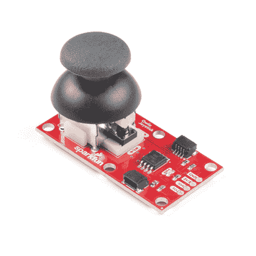](https://www.sparkfun.com/products/15168) 

将**添加到您的[购物车](https://www.sparkfun.com/cart)中！**

### [SparkFun Qwiic 操纵杆](https://www.sparkfun.com/products/15168)

[20 available](https://learn.sparkfun.com/static/bubbles/ "20 available") COM-15168

SparkFun Qwiic 操纵杆结合了 Qwiic 连接系统和模拟操纵杆的便利性。

$11.503[Favorited Favorite](# "Add to favorites") 32[Wish List](# "Add to wish list")** **多亏了在 [Qwiic 操纵杆](https://www.sparkfun.com/products/15168)上的 ATtiny85，所有必要的位都被处理了，你的微控制器只需要在 I ² C 设备的寄存器中寻找你的输入。

[https://www.youtube.com/embed/5m9HTMYB_UM/?autohide=1&border=0&wmode=opaque&enablejsapi=1](https://www.youtube.com/embed/5m9HTMYB_UM/?autohide=1&border=0&wmode=opaque&enablejsapi=1)

### 所需材料

Qwiic 游戏杆确实需要一些额外的东西来帮助你开始使用。 [RedBoard Qwiic](https://www.sparkfun.com/products/15123) 用于 Arduino 示例，而 [Qwiic Hat](https://www.sparkfun.com/products/14459) 用于 Raspberry Pi 示例(参见下面的注释)。你可能已经有一些这样的物品了，所以可以根据你的需要随意修改你的购物车。

 

将**添加到您的[购物车](https://www.sparkfun.com/cart)中！**

### [SparkFun Qwiic 线缆套件](https://www.sparkfun.com/products/15081)

[In stock](https://learn.sparkfun.com/static/bubbles/ "in stock") KIT-15081

为了更容易上手，我们用 50 毫米到 500 毫米的各种 Qwiic 电缆组装了 Qwiic 电缆套件…

$8.9516[Favorited Favorite](# "Add to favorites") 58[Wish List](# "Add to wish list")**** 

将**添加到您的[购物车](https://www.sparkfun.com/cart)中！**

### [spark fun RedBoard Qwiic](https://www.sparkfun.com/products/15123)

[In stock](https://learn.sparkfun.com/static/bubbles/ "in stock") DEV-15123

SparkFun RedBoard Qwiic 是一款 Arduino 兼容开发板，内置 Qwiic 连接器，无需…

$21.5014[Favorited Favorite](# "Add to favorites") 49[Wish List](# "Add to wish list")**** 

将**添加到您的[购物车](https://www.sparkfun.com/cart)中！**

### [树莓派的 SparkFun Qwiic 帽子](https://www.sparkfun.com/products/14459)

[In stock](https://learn.sparkfun.com/static/bubbles/ "in stock") DEV-14459

树莓派的 SparkFun Qwiic 帽子是进入 Qwiic 生态系统的最快捷、最简单的方式，并且仍然适用于

$6.505[Favorited Favorite](# "Add to favorites") 33[Wish List](# "Add to wish list")**************Raspberry Pi Example:** If you don't already have them, you will need a [Raspberry Pi](https://www.sparkfun.com/products/14644) and [standard peripherals](https://www.sparkfun.com/categories/398). An example setup is listed below. 

将**添加到您的[购物车](https://www.sparkfun.com/cart)中！**

### 

[18 available](https://learn.sparkfun.com/static/bubbles/ "18 available") KIT-14035

pi-topCEED 是一台 DIY 桌面计算机，它可以帮助您开始学习如何编码，创建令人敬畏的设备，并将您的知识…

$114.95 $99.954[Favorited Favorite](# "Add to favorites") 22[Wish List](# "Add to wish list")****[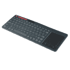](https://www.sparkfun.com/products/14271) 

将**添加到您的[购物车](https://www.sparkfun.com/cart)中！**

### [多媒体无线键盘](https://www.sparkfun.com/products/14271)

[In stock](https://learn.sparkfun.com/static/bubbles/ "in stock") WIG-14271

随着单板计算机(SBC)的兴起，用一种简单的方法与它们接口是一个好主意。在…上操作

$29.954[Favorited Favorite](# "Add to favorites") 26[Wish List](# "Add to wish list")****[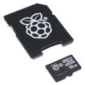](https://www.sparkfun.com/products/retired/13945) 

### [Raspberry Pi-16GB MicroSD NOOBS 卡](https://www.sparkfun.com/products/retired/13945)

[Retired](https://learn.sparkfun.com/static/bubbles/ "Retired") COM-13945

这是 10 级 16GB 微型 SDHC 卡，预装了用于 Raspberry Pi 的 NOOBS 操作系统。这个标清…

3 **Retired**[Favorited Favorite](# "Add to favorites") 13[Wish List](# "Add to wish list") 

### [树莓派 3 B+](https://www.sparkfun.com/products/14643)

[Out of stock](https://learn.sparkfun.com/static/bubbles/ "out of stock") DEV-14643

Raspberry Pi 3 B+在这里为您提供与以前相同的 Pi，但现在具有千兆位和 PoE 能力的以太网！

35[Favorited Favorite](# "Add to favorites") 75[Wish List](# "Add to wish list")**** ****### 推荐阅读

如果你对跳线垫、I ² C 或 Python 不熟悉，请务必查看一些基础教程。

 [### 逻辑电平](https://learn.sparkfun.com/tutorials/logic-levels) Learn the difference between 3.3V and 5V devices and logic levels.[Favorited Favorite](# "Add to favorites") 82 [### I2C](https://learn.sparkfun.com/tutorials/i2c) An introduction to I2C, one of the main embedded communications protocols in use today.[Favorited Favorite](# "Add to favorites") 128 [### 如何使用跳线焊盘和 PCB 走线](https://learn.sparkfun.com/tutorials/how-to-work-with-jumper-pads-and-pcb-traces) Handling PCB jumper pads and traces is an essential skill. Learn how to cut a PCB trace, add a solder jumper between pads to reroute connections, and repair a trace with the green wire method if a trace is damaged.[Favorited Favorite](# "Add to favorites") 11 [### RedBoard Qwiic 连接指南](https://learn.sparkfun.com/tutorials/redboard-qwiic-hookup-guide) This tutorial covers the basic functionality of the RedBoard Qwiic. This tutorial also covers how to get started blinking an LED and using the Qwiic system.[Favorited Favorite](# "Add to favorites") 5 [### 树莓派 SPI 和 I2C 教程](https://learn.sparkfun.com/tutorials/raspberry-pi-spi-and-i2c-tutorial) Learn how to use serial I2C and SPI buses on your Raspberry Pi using the wiringPi I/O library for C/C++ and spidev/smbus for Python.[Favorited Favorite](# "Add to favorites") 24 [### 覆盆子酱连接指南的 Qwiic 帽子](https://learn.sparkfun.com/tutorials/qwiic-hat-for-raspberry-pi-hookup-guide) Get started interfacing your Qwiic enabled boards with your Raspberry Pi. This Qwiic connects the I2C bus (GND, 3.3V, SDA, and SCL) on your Raspberry Pi to an array of Qwiic connectors.[Favorited Favorite](# "Add to favorites") 2 [### Python 编程教程:Raspberry Pi 入门](https://learn.sparkfun.com/tutorials/python-programming-tutorial-getting-started-with-the-raspberry-pi) This guide will show you how to write programs on your Raspberry Pi using Python to control hardware.[Favorited Favorite](# "Add to favorites") 27

qw IC 操纵杆利用[qw IC 连接系统](https://www.sparkfun.com/qwiic)。我们建议在使用之前熟悉一下**逻辑电平**和 **I ² C** 教程(如上)。点击上面的横幅，了解有关我们的 [Qwiic 产品](https://www.sparkfun.com/categories/399)的更多信息。

[https://www.youtube.com/embed/x0RDEHqFIF8/?autohide=1&border=0&wmode=opaque&enablejsapi=1](https://www.youtube.com/embed/x0RDEHqFIF8/?autohide=1&border=0&wmode=opaque&enablejsapi=1)

## 硬件概述

Qwiic 操纵杆将报告 I ² C 上方的*拇指操纵杆*位置，并且设计为与 Qwiic 系统兼容，因此您可以将其添加到您的项目免焊接！

### 电源 LED

有一个电源状态 LED，以帮助确保您的 Qwiic 操纵杆正在通电。你可以通过提供的*极化* **Qwiic 连接器**系统或**分线针** ( **PWR** 和 **GND** )给电路板供电。Qwiic 系统应在 **3.3V** 电压下运行，确保在使用 Qwiic 系统时**而不是**使用其他电压。

[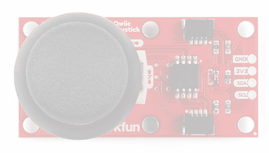](https://cdn.sparkfun.com/assets/learn_tutorials/8/4/7/Power_LED.jpg)

### 操纵杆

操纵杆类似于 PS2 (PlayStation 2)控制器上的*模拟*操纵杆。用两个**10kω**电位计简单地测量方向运动，每个轴一个。该操纵杆还有一个选择按钮，当操纵杆被按下时，该按钮被启动。

[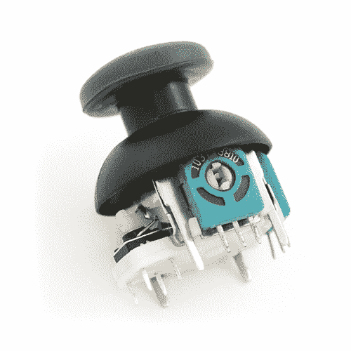](https://www.sparkfun.com/products/9032) 

将**添加到您的[购物车](https://www.sparkfun.com/cart)中！**

### [拇指操纵杆](https://www.sparkfun.com/products/9032)

[In stock](https://learn.sparkfun.com/static/bubbles/ "in stock") COM-09032

这是一个操纵杆，非常类似于 PS2 (PlayStation 2)控制器上的“模拟”操纵杆。定向运动更简单…

$4.505[Favorited Favorite](# "Add to favorites") 70[Wish List](# "Add to wish list")** **这两个电位计连接到 ATtiny85 的模数转换器(ADC)。选择按钮在 ATtiny85 上作为数字输入操作。这允许固件读取旋钮位置和任何按钮按压。

**Troubleshooting Tip:** Due to resistor manufacturing tolerances, the joystick may not read exactly half of VCC when at rest. You may want to make a note of the "zero" reading, and store that value into your program if necessary.

#### 操纵杆方向

操纵杆包含两个电位计，与一个万向节机构相连，该万向节机构将*水平*和*垂直*运动分开(方向如下所示)。

[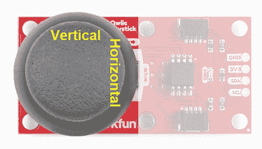](https://cdn.sparkfun.com/assets/learn_tutorials/8/4/7/Joystick_Orientation.jpg)

电位计是操纵杆两侧的两个蓝色或黑色的盒子。如果你移动操纵杆，同时观察每个电位计的中心轴，你会看到每个电位计只在一个轴上移动。很聪明，不是吗？

[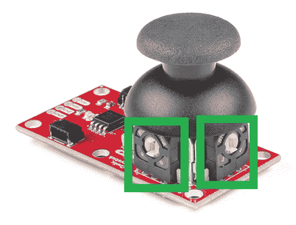](https://cdn.sparkfun.com/assets/learn_tutorials/8/4/7/Potentiometer.jpg)

#### 选择按钮

操纵杆还包含一个瞬时按钮，当您按下盖子时，该按钮就会激活。按钮是操纵杆侧面的小黑框。如果你按下盖子，你可以看到一个杠杆按下按钮的头部。无论操纵杆处于什么位置，操纵杆都会工作。这太酷了！

[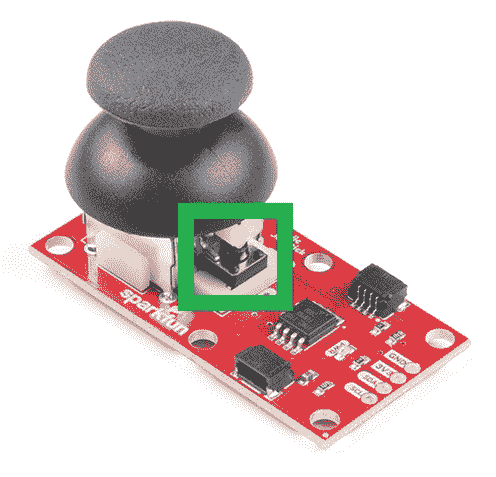](https://cdn.sparkfun.com/assets/learn_tutorials/8/4/7/Momentary_Button.jpg)

### 阿蒂 85

通过预安装的固件，ATtiny85 可充当操纵杆模拟和数字输入的中介(微控制器)。这允许 Qwiic 操纵杆报告其在 I ² C 上的位置。

[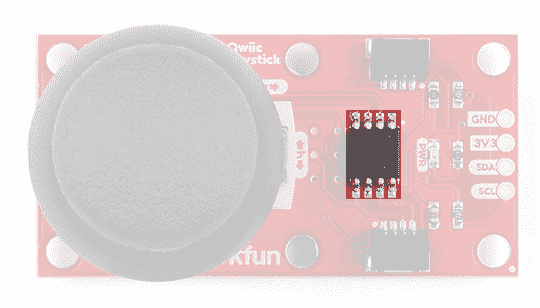](https://cdn.sparkfun.com/assets/learn_tutorials/8/4/7/ATtiny85.jpg)**Note:** To flash your own firmware, at minimum, you will need an [programmer for the ATtiny](https://www.sparkfun.com/products/9825) and a [pogo pin adapter](https://www.sparkfun.com/products/11591). Writing and uploading firmware is not easily done, unless you know what you are doing; this is **inadvisable** for beginners.

### Qwiic & I ² C

#### I ² C 地址

在固件中，Qwiic 操纵杆的 I ² C 地址是可配置的，因此您可以将它们添加到同一条总线上，而不会出现冲突问题。

**出厂默认 I ² C 从地址:** 0x20

#### I ² C 寄存器

| 地址 | 描述 |
| 0x00 | 来自 EEPROM 的默认 I ² C 从机地址 |
| 0x01 - 0x02 | 固件版本(MSB 优先) |
| 0x03 - 0x04 | 当前水平位置(MSB 优先) |
| 0x05 - 0x06 | 当前垂直位置(MSB 优先) |
| 0x07 | 当前按钮位置 |
| 0x08 | 按钮状态:指示自上次读取按钮状态后按钮是否被按下。读取后清零。 |
| 0x09 | 配置或"*锁定*"寄存器-防止在 I ² C 扫描和寄存器转储期间随机 I ² C 地址改变。在将地址更改保存到 EEPROM 之前，必须将其设为 0x13。 |
| 0x0A | 当前/设置 I ² C 从机地址(写)。*存储在 EEPROM 中。* |

**Note:** In the registers for the joystick position, the MSB contains the first 8 bits of the 10-bit ADC value and the LSB contains the last two bits. As an example, this is how the library converts the two registers back to a 10-bit value.

`uint_16t full10bitvalue = ((MSB << 8) | LSB) >> 6;`

You could potentially only look at the MSB and get an 8-bit reading (for 256 positions). The firmware was intentionally written this way in the hopes that it would be useful for customers who didn't need the full resolution of the joystick position.**Troubleshooting Tip:**
Please be aware, the first time the joystick position registers are read, it will have a maximum value (all 1's in binary). I am not sure if it is something in the firmware or if has something to do with the ATtiny85, but the initial read will be 1023\. Once that is read, everything reading after should be accurate (excluding the manufacturing tolerances mentioned above). If you have a fix for this issue, please feel free to [comment on this tutorial](https://learn.sparkfun.com/tutorials/qwiic-joystick-hookup-guide/discuss) or create a pull request on the [GitHub repository](https://github.com/sparkfun/Qwiic_Joystick).

#### 连接

该板提供四个带标签的分线引脚。如果没有 Qwiic 连接器，您可以将这些线路连接到微控制器的 I ² C 总线和电源引脚( **3.3V** 和 **GND** )。

[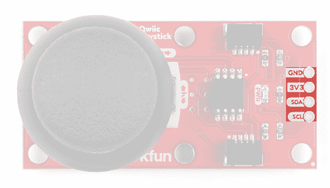](https://cdn.sparkfun.com/assets/learn_tutorials/8/4/7/Breakout_Pins.jpg)

然而，使用 Qwiic 操纵杆最简单的方法是通过 Qwiic connect 系统。连接器针对 I ² C 连接和电源进行了极化。(**它们被绑在分线销上。*)

[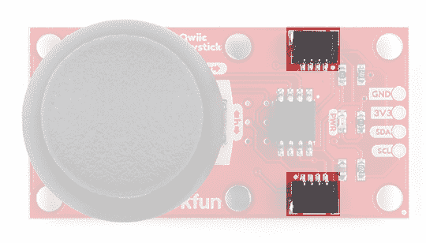](https://cdn.sparkfun.com/assets/learn_tutorials/8/4/7/Qwiic_Connectors.jpg)

#### I ² C 上拉跳线

切断 **I ² C** 跳线将从 I ² C 总线上移除**2.2kω**电阻。如果您的 I ² C 总线上有许多设备，您可能需要移除这些跳线。不知道怎么剪跳线？[看这里！](https://learn.sparkfun.com/tutorials/how-to-work-w-jumper-pads-and-pcb-traces/cutting-a-trace-between-jumper-pads)

[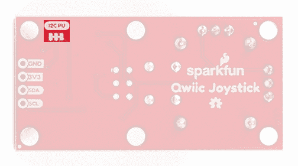](https://cdn.sparkfun.com/assets/learn_tutorials/8/4/7/Pullup_Jumper.jpg)

## 硬件装配

### Arduino 示例

有了 Qwiic 连接器系统，组装硬件变得简单。你所需要做的就是用 [Qwiic 线缆](https://www.sparkfun.com/products/15081)将你的 [Qwiic 操纵杆](https://www.sparkfun.com/products/15168)连接到 [RedBoard Qwiic](https://www.sparkfun.com/products/15123) 上。否则，您可以使用您的微控制器的 I ² C 引脚；请注意逻辑电平，ATtiny85 的工作电压范围为 1.8 至 5.5V，EEPROM 至少需要 2V，否则会损坏。

[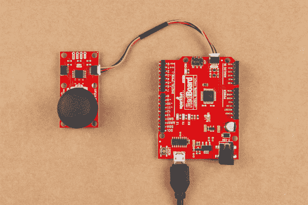](https://cdn.sparkfun.com/assets/learn_tutorials/8/4/7/Assembly-Arduino.jpg)

**注意:**本教程假设您熟悉 Arduino 产品，并且在您的桌面上使用 Arduino IDE 的最新稳定版本。如果这是你第一次使用 Arduino IDE，请回顾我们关于[安装 Arduino IDE 的教程。](https://learn.sparkfun.com/tutorials/installing-arduino-ide)

**Troubleshooting Tip:**
It is best to power the board at the recommended 3.3V of the Qwiic system. However, if you have a board with firmware version 2.3 and happen to accidentally corrupt the EEPROM and inject a new, random I²C address. There is a way to replace the I²C address and store it in the EEPROM again. Follow the following steps exactly, you will need to use the Arduino Library from below:

1.  用 qw IC 电缆将 qw IC 操纵杆连接到 RedBoard Qwiic。
2.  运行示例 3，找到当前 I ² C 地址。
3.  修改示例 2 以使用您刚刚找到的 I ² C 地址。
4.  运行示例 2，将 I ² C 地址改回默认地址。
5.  拔下 Qwiic 操纵杆，然后重新插上。EEPROM 应复位至默认 I ² C 地址，并准备再次使用。

### Raspberry Pi 示例

有了 Qwiic 连接器系统，组装硬件变得简单。你需要一根 [Qwiic 线缆](https://www.sparkfun.com/products/15081)，一顶 [SparkFun Qwiic 树莓派帽子](https://www.sparkfun.com/products/14459)，以及一套[树莓派](https://www.sparkfun.com/products/14643)，配备 [Raspbian 操作系统](https://www.sparkfun.com/products/13945)，监视器和[标准外设](https://www.sparkfun.com/categories/398)。(* *如果您不熟悉 Qwiic 帽子，您可以在此处* 找到[连接指南。)](https://learn.sparkfun.com/tutorials/qwiic-hat-for-raspberry-pi-hookup-guide)

[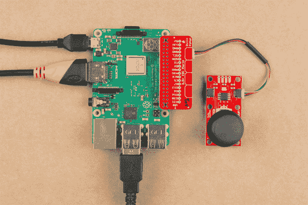](https://cdn.sparkfun.com/assets/learn_tutorials/8/4/7/Assembly-RaspberryPi.jpg)

**注意:**本教程假设您熟悉使用 Raspberry Pi，并且您有最新的(完整版...带推荐软件)版本 [Raspbian OS](https://www.raspberrypi.org/downloads/raspbian/) 你的树莓 Pi。你可以从[树莓派基金会网站](https://www.raspberrypi.org/downloads/raspbian/)下载最新版本的 Raspbian 操作系统。截至 2019 年 2 月 13 日，我们推荐 **Raspbian 拉伸带桌面和推荐软件**选项。

如果这是你第一次使用树莓派，请前往[树莓派基金会网站](https://www.raspberrypi.org/help/)使用他们的快速入门指南。我们在这里列举了其中的几个:

1.  [设置您的树莓派](https://projects.raspberrypi.org/en/projects/raspberry-pi-setting-up)
2.  [用你的树莓派](https://projects.raspberrypi.org/en/projects/raspberry-pi-using)
3.  文档:

[安装文档](https://www.raspberrypi.org/documentation/setup/)
[安装文档](https://www.raspberrypi.org/documentation/installation/)
[Raspbian 文档](https://www.raspberrypi.org/documentation/raspbian/)
[SD 卡文档](https://www.raspberrypi.org/documentation/installation/sd-cards.md)

## Arduino 图书馆

安装 Arduino 库最简单的方法是在 Arduino 库管理器中搜索 **SparkFun Qwiic 操纵杆**。要手动安装，请前往 [GitHub 页面](https://github.com/sparkfun/SparkFun_Qwiic_Joystick_Arduino_Library)或在此随意下载库！

[DOWNLOAD: SparkFun Qwiic Joystick Library (ZIP)](https://github.com/sparkfun/SparkFun_Qwiic_Joystick_Arduino_Library/archive/master.zip)

### 库函数

Arduino 库是注释过的，函数应该是不言自明的。然而，下面是可用库函数的详细列表。

`.begin()`或`.begin(Wire, deviceAddress)`
使用默认或指定的 I ² C 地址通过 I ² C 总线创建到 I ² C 设备的连接。

Input: uint8_t *deviceAddress*Unasssigned 8-bit integer for device address. If not defined, the library will use the default I²C address stored in the I²C library (0x20).Output: Boolean

真-连接到 I ² C 设备。
错误-未找到或连接任何设备。

`.isConnected()`
尝试连接到存储在库中的 I ² C 地址的设备。

Output: Boolean

真-连接到 I ² C 设备。
错误-未找到或连接任何设备。

`.setI2CAddress(newAddress)`
将 I ² C 地址改为*新地址*。一旦更改，新的 I ² C 地址将保存在 Qwiic 操纵杆的 EEPROM 中。使用新的 I ² C 地址重新连接到设备。(*新地址在串行监视器中打印出来。*)

Input: uint8_t *newAddress*

设备地址的未赋值 8 位整数。

`.getHorizontal()`
返回操纵杆水平位置的 ADC 值。

Output: uint16_t

水平轴上操纵杆位置的 ADC 值的无符号 10 位整数[0 - 1023]。

`.getVertical()`
返回操纵杆垂直位置的 ADC 值。

Output: uint16_t

垂直轴中操纵杆位置的 ADC 值的无符号 10 位整数[0 - 1023]。

`.getButton()`
返回当前按钮状态(清除检查按钮指示器-见下文)。

Output: byte

0 -按钮当前正被按下。
1 -按钮当前未按下。

`.checkButton()`
表示在读取按钮状态或调用此功能之间是否按下了按钮。然后该指示器的寄存器被清除。

Output: byte

0 -按钮是按下了而不是。
1 -按钮被按下。

`.getVersion()`
返回一串固件版本号。

Output: String *AAA.BBB*

AAA -固件版本(主要版本)
BBB -固件版本(次要版本)

### 例子

在 Qwiic 游戏杆 Arduino 库中有四个例子来帮助你开始使用 Qwiic 游戏杆。这些示例文件的名称不言自明，但是如果您想了解更多信息，请参见下面的描述。

*   **例 1 _ 基本 _ 读数**

    本示例使用库中保存的默认 I ² C 地址连接到 Qwiic 操纵杆。草图查看当前操纵杆位置和按钮状态的寄存器。然后，该示例通过串行监视器打印出这些值。

*   **示例 2 _ I2C _ 地址 _ 固件**

    该示例使用草图中设置的默认 I ² C 地址连接到 Qwiic 操纵杆，然后通过串行监视器打印出 I ² C 地址和固件版本。然后，草图从串行监视器获取输入，使用十进制值(DEC)更改 I ² C 地址。一旦 I ² C 地址被更改，它将被存储在 Qwiic 操纵杆的 EEPROM 中。之后，草图使用新的 I ² C 地址连接到操纵杆，并再次读取固件版本的寄存器。然后，该示例再次在串行监视器上打印出这些值。

*   **示例 3 _ I2C _ 扫描仪**

    这个例子来自 Arduino Playground 网页上的 [I ² C 扫描仪例子](https://playground.arduino.cc/Main/I2cScanner)。草图扫描 I ² C 总线上的设备，并在串行监视器上报告它们。这对于忘记更改过的主板 I ² C 地址的用户很有用。

*   **例 4_Joystic_Serial_Output**

    这个例子显示了一个基本的例子，如何开始使用 Qwiic 操纵杆作为一个 HID。示例草图获取操纵杆的值，并将其转换为串行监视器上的方向打印输出。

## Arduino 示例

**Note:** This section is an example of using the Qwiic Joystick and the RedBoard Qwiic with the Arduino IDE. It is not intended to be a guide for using I²C devices with the Arduino IDE.

Please use the following links and the internet for a better understanding of I²C and how it works in the Arduino IDE:

*   一个关于 I ² C 的[教程。](https://learn.sparkfun.com/tutorials/i2c/all)
*   [线【I ² C】库](https://www.arduino.cc/en/reference/wire)的[深度概述](https://playground.arduino.cc/Main/WireLibraryDetailedReference)。

### 例 1:基本阅读

该草图查看当前操纵杆位置和按钮状态的寄存器；这些值被发送到[串行监视器](https://learn.sparkfun.com/tutorials/terminal-basics)。确保你使用的是 **9600bps** 的波特率。

[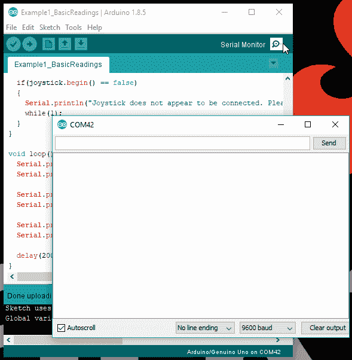](https://cdn.sparkfun.com/assets/learn_tutorials/8/4/7/Example1.gif)

### 示例 2: I ² C 地址更改和固件版本读取

该草图从[串行监视器](https://learn.sparkfun.com/tutorials/terminal-basics)获取一个十进制值，并更改设备的 I ² C 地址。然后读取固件版本以确认地址已更改。确保你使用的是 **9600bps** 的波特率。

[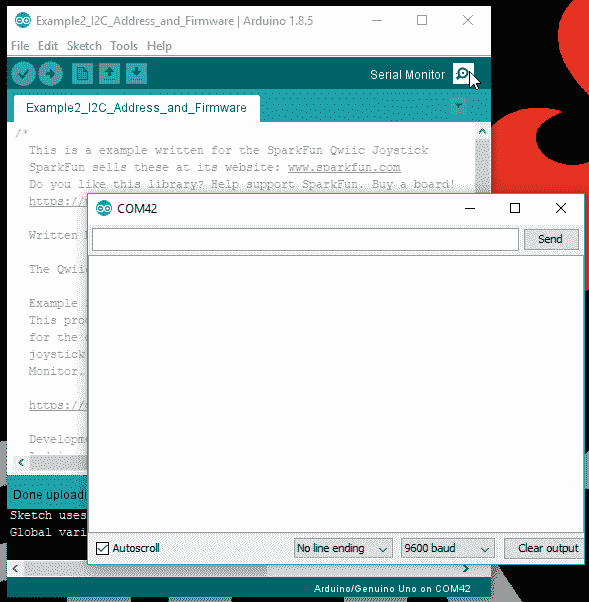](https://cdn.sparkfun.com/assets/learn_tutorials/8/4/7/Example2.gif)

### 示例 3: I ² C 扫描仪

这张草图来自 [Arduino 游乐场网页](https://playground.arduino.cc/Main/I2cScanner)的 I ² C 扫描仪示例。草图扫描 I ² C 总线上的设备，并在[串行监视器](https://learn.sparkfun.com/tutorials/terminal-basics)上报告它们。确保您使用的波特率为 **9600bps** 。

### 示例 4:操纵杆串行输出

该草图获取操纵杆的值，并将其转换为[串行监视器](https://learn.sparkfun.com/tutorials/terminal-basics)上的方向打印输出。它还会读出按钮是否被按下。确保你使用的是 **9600bps** 的波特率。

[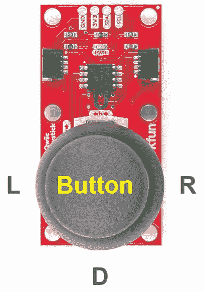](https://cdn.sparkfun.com/assets/learn_tutorials/8/4/7/Example4.jpg)

## Python 示例

**Update:** We've written a full Python package for the Qwiic Joystick that can be found here:
[SparkFun Qwiic Joystick Py](https://github.com/sparkfun/Qwiic_Joystick_Py)For installation instructions, please refer to the repository's README file.**Note:** This section is an example of using the Qwiic Joystick with the Raspberry Pi in Python. It is not intended to be a guide for using I²C devices with a Raspberry Pi or a tutorial on Python.

Please use the following links and the internet for a better understanding of I²C and how it works in the Arduino IDE:

*   有关使用带有树莓 Pi 的 I ² C 设备的教程，请参见我们的[树莓 Pi SPI 和 I ² C 教程](https://learn.sparkfun.com/tutorials/raspberry-pi-spi-and-i2c-tutorial/all#i2c-on-pi)。
*   关于 Python 的教程，请参见我们的 [Python 编程教程:树莓派入门](https://learn.sparkfun.com/tutorials/python-programming-tutorial-getting-started-with-the-raspberry-pi/all)。

### 启用 I ² C 接口

如果尚未启用，请在首选项> Raspberry Pi 配置面板中启用 I ² C 接口。

[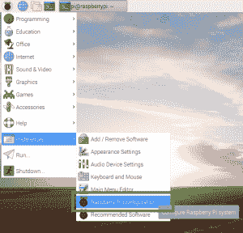](https://cdn.sparkfun.com/assets/learn_tutorials/8/4/7/ConfigurationPanel.png) [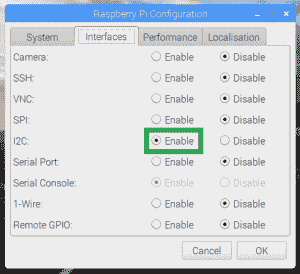](https://cdn.sparkfun.com/assets/learn_tutorials/8/4/7/EnableI2C.png)*Enabling the I²C through the configuration panel.*

### 使用命令行检查设备

在(完整的)Raspbian 操作系统上，应该预装了`i2ctools`(如果没有，请按照这里的[说明](https://learn.sparkfun.com/tutorials/qwiic-hat-for-raspberry-pi-hookup-guide))。在 Qwiic 操纵杆和 Qwiick Hat 连接到 Raspberry Pi 的情况下，在终端/命令行中运行以下命令。

`i2cdetect -y 1`

### 下载并运行 Python 示例

从 [GitHub 库](https://github.com/sparkfun/Qwiic_Joystick)下载 [Python 示例](https://github.com/sparkfun/Qwiic_Joystick/tree/master/Firmware/Python%20Examples)。您需要做的就是打开一个示例 python 文件并执行该模块。您可以在 Python 3 或另一个兼容的编程文本编辑器(如 Geany)中实现这一点。

#### 基础阅读

下面是来自**基础读物**示例文件的 python shell 的截图。

[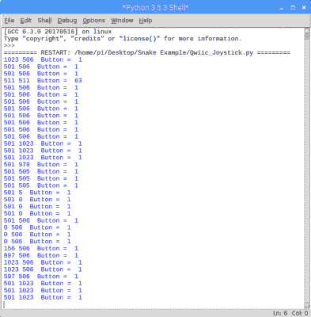](https://cdn.sparkfun.com/assets/learn_tutorials/8/4/7/RaspberryPiExample.png)

#### 贪吃蛇游戏

运行**贪吃蛇游戏**示例代码时，只需点击按钮即可开始游戏。(**向阿尔·斯威加特喊出他的 [**蠕虫状的**例子](http://inventwithpython.com/pygame/chapter6.html)，它被改编成与 Qwiic 操纵杆一起工作。*)

**Troubleshooting Tip:** I did run into an error with the python example codes. Unfortunately, I am not an *expert* in Python and the Raspberry Pi. However, I got around this by having the error print out instead of terminating the script. From what I could deduce based on the available information on the internet, the error `[Errno 121] Remote I/O error` is an issue with the I²C bus and how SMBUS interacts with the slave device.

You will also get an `[Errno 121] Remote I/O error` if your I²C address is defined wrong.

## 资源和更进一步

有关更多信息，请查看以下资源:

### 产品资料

*   [GitHub 产品回购](https://github.com/sparkfun/Qwiic_Joystick/)
*   [已插入 85 个固件](https://github.com/sparkfun/Qwiic_Joystick/tree/master/Firmware/ATtiny85%20Firmware)
*   [示意图(PDF)](https://cdn.sparkfun.com/assets/7/4/a/6/8/Qwiic_Joystick.pdf)
*   [老鹰文件(ZIP)](https://cdn.sparkfun.com/assets/d/e/3/2/9/Qwiic_Joystick.zip)
*   [SFE 产品展示区](https://www.youtube.com/watch?v=5m9HTMYB_UM)

### 示例代码以及 Arduino 和 Python 库

*   [Qwiic 操纵杆 Arduino 库](https://github.com/sparkfun/SparkFun_Qwiic_Joystick_Arduino_Library)
*   [Qwiic 操纵杆 Python 示例代码](https://github.com/sparkfun/Qwiic_Joystick/tree/master/Firmware/Python%20Examples)
*   [Qwiic 操纵杆 Python 包](https://github.com/sparkfun/Qwiic_Joystick_Py)

需要帮助入门 Arduino 和 I ² C？点击此处查看这些资源:

*   [Arduino I ² C 扫描仪示例](https://playground.arduino.cc/Main/I2cScanner)
*   [Arduino 电线库参考页面](https://www.arduino.cc/en/reference/wire)
*   [Arduino 电线库(深入)参考](https://playground.arduino.cc/Main/WireLibraryDetailedReference)

需要帮助开始使用您的树莓派吗？点击此处查看这些资源:

*   [设置您的树莓派](https://projects.raspberrypi.org/en/projects/raspberry-pi-setting-up)
*   [用你的树莓派](https://projects.raspberrypi.org/en/projects/raspberry-pi-using)
*   文档:
    *   [设置文件](https://www.raspberrypi.org/documentation/setup/)
    *   [安装文件](https://www.raspberrypi.org/documentation/installation/)
    *   [Raspbian 文档](https://www.raspberrypi.org/documentation/raspbian/)
    *   [SD 卡文档](https://www.raspberrypi.org/documentation/installation/sd-cards.md)

需要帮助入门 Python 和 I ² C？点击此处查看这些资源:

*   [Python 编程教程:树莓派入门](https://learn.sparkfun.com/tutorials/python-programming-tutorial-getting-started-with-the-raspberry-pi/all)
*   [树莓派 SPI 和我 ² C 教程](https://learn.sparkfun.com/tutorials/raspberry-pi-spi-and-i2c-tutorial/all#i2c-on-pi)

你的下一个项目需要一些灵感吗？查看其他一些 Qwiic 产品教程:

 [### 光谱三联体(AS7265x)连接指南](https://learn.sparkfun.com/tutorials/spectral-triad-as7265x-hookup-guide) Learn how to wield the power of 18 channels of UV to NIR spectroscopy with AS72651 (UV), AS72652 (VIS), and AS72653 (NIR) sensors 1 [### SparkFun GPS 突破(ZOE-M8Q 和 SAM-M8Q)连接指南](https://learn.sparkfun.com/tutorials/sparkfun-gps-breakout-zoe-m8q-and-sam-m8q-hookup-guide) The SparkFun ZOE-M8Q and SAM-M8Q are two similarly powerful GPS units but with different project applications. We'll compare both chips before getting each up and running.[Favorited Favorite](# "Add to favorites") 1 [### 只需按下按钮，就能进行 GPS 地理测绘](https://learn.sparkfun.com/tutorials/gps-geo-mapping-at-the-push-of-a-button) Let's ramp up our GPS tracking skills with KML files and Google Earth. We'll make a tracker that logs location and allows us to visualize our steps with Google Earth.[Favorited Favorite](# "Add to favorites") 9 [### Qwiic EEPROM 连接指南](https://learn.sparkfun.com/tutorials/qwiic-eeprom-hookup-guide) Running out of memory? Don't forget to check out the Qwiic EEPROM 2**************