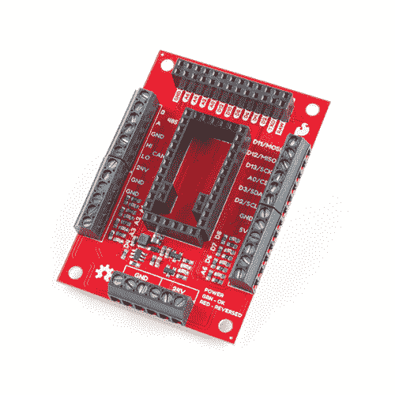

# AST-CAN485 I/O 屏蔽(24V)连接指南

> 原文：<https://learn.sparkfun.com/tutorials/ast-can485-io-shield-24v-hookup-guide>

## 介绍

[AST-CAN485 I/O 屏蔽(24)](https://www.sparkfun.com/products/14598) 是一个 Arduino 屏蔽，它允许用户将 [AST-CAN485 开发板](https://www.sparkfun.com/products/14483)与 24V 输入和输出接口，从而将其实用性扩展到工业系统。

 

将**添加到您的[购物车](https://www.sparkfun.com/cart)中！**

### [【spark fun AST-can 485 I/O Shield(24V)](https://www.sparkfun.com/products/14598)

[33 available](https://learn.sparkfun.com/static/bubbles/ "33 available") DEV-14598

AST-CAN485 I/O Shield 允许您将 AST-CAN485 开发板与 24V 输入和输出接口，从而扩展了它的使用范围。

$20.95 $16.76[Favorited Favorite](# "Add to favorites") 3[Wish List](# "Add to wish list")** **[https://www.youtube.com/embed/CbP9fsDl8Ww/?autohide=1&border=0&wmode=opaque&enablejsapi=1](https://www.youtube.com/embed/CbP9fsDl8Ww/?autohide=1&border=0&wmode=opaque&enablejsapi=1)

### 所需材料

要跟随本教程，您将需要以下材料。你可能不需要所有的东西，这取决于你拥有什么。将它添加到您的购物车，通读指南，并根据需要调整购物车。**