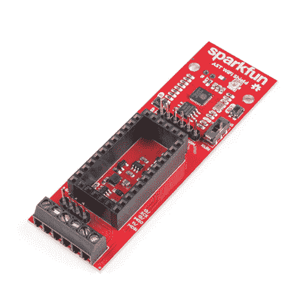

# AST-CAN485 WiFi 屏蔽连接指南

> 原文：<https://learn.sparkfun.com/tutorials/ast-can485-wifi-shield-hookup-guide>

## 介绍

什么会让 AST-CAN485 变得更好？WiFi！为了进一步增强 CAN485 的通信能力，我们推出了 [AST-CAN485 Wifi 屏蔽](http://www.sparkfun.com/products/14597)。这个盾牌是基于 Sparkfun ESP8266 的东西，允许 CAN485 模块通过 Wifi 进行通信。

 

将**添加到您的[购物车](https://www.sparkfun.com/cart)中！**

 **### [SparkFun AST-CAN485 WiFi 盾](https://www.sparkfun.com/products/14597)

[Only 5 left!](https://learn.sparkfun.com/static/bubbles/ "only 5 left!") WRL-14597

AST-CAN485 WiFi Shield 提供了一种在自动化环境中无线工作的方式，这种环境以嘈杂和不友好而闻名

$19.50 $11.70[Favorited Favorite](# "Add to favorites") 4[Wish List](# "Add to wish list")** **[https://www.youtube.com/embed/CbP9fsDl8Ww/?autohide=1&border=0&wmode=opaque&enablejsapi=1](https://www.youtube.com/embed/CbP9fsDl8Ww/?autohide=1&border=0&wmode=opaque&enablejsapi=1)

### 所需材料

要跟随本教程，您将需要以下材料。你可能不需要所有的东西，这取决于你拥有什么。将它添加到您的购物车，通读指南，并根据需要调整购物车。**