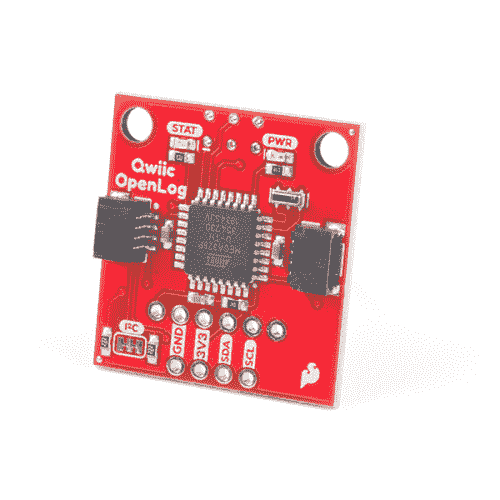
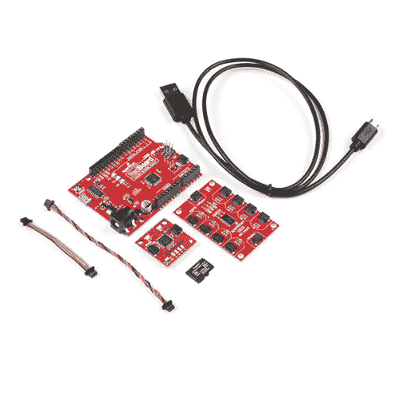
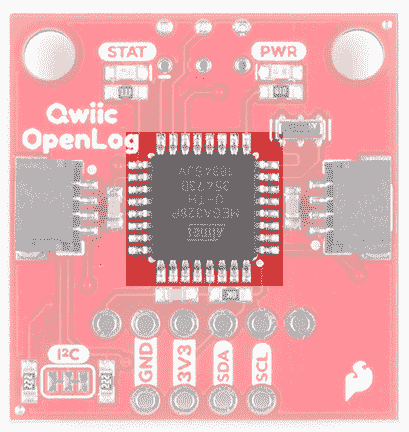
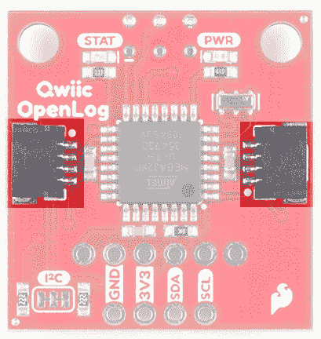
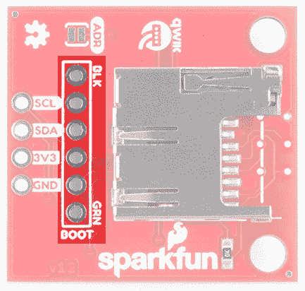
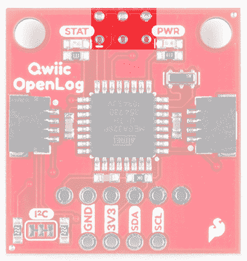
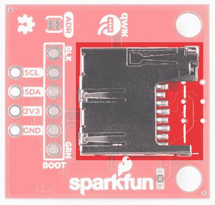
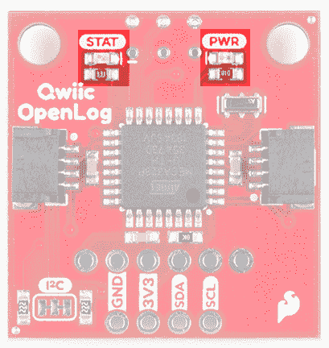
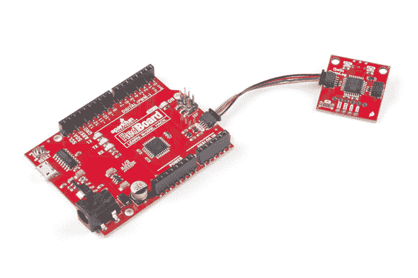

# Qwiic OpenLog 连接指南

> 原文：<https://learn.sparkfun.com/tutorials/qwiic-openlog-hookup-guide>

## 介绍

**Heads up!** This tutorial is for the Qwiic Open Log for I²C [ [DEV-15164](https://www.sparkfun.com/products/15164) ]. If you are using the OpenLog for serial UART [ [DEV-13712](https://www.sparkfun.com/products/13712) ], please refer to the [OpenLog Hookup Guide](https://learn.sparkfun.com/tutorials/openlog-hookup-guide).

SparkFun Qwiic OpenLog 是极其流行的 OpenLog 的更智能和更好看的表亲。我们已经将原来的基于串行的接口移植到 I ² C。现在，您可以菊花链多个 I ² C 设备，并在不占用您的串行端口的情况下记录它们。插入一个 microSD 卡，编写一些简单的代码，你的数据就会被记录到 microSD 卡上的一个文本文件中。

[](https://www.sparkfun.com/products/15164) 

将**添加到您的[购物车](https://www.sparkfun.com/cart)中！**

 **### [火花 qwiic openlogT3](https://www.sparkfun.com/products/15164)

[In stock](https://learn.sparkfun.com/static/bubbles/ "in stock") DEV-15164

SparkFun Qwiic OpenLog 可以存储或“记录”大量的串行数据，并在 I2C 各地充当各种黑匣子。

$18.50[Favorited Favorite](# "Add to favorites") 28[Wish List](# "Add to wish list")****[](https://www.sparkfun.com/products/18350) 

将**添加到您的[购物车](https://www.sparkfun.com/cart)中！**

 **### [火花 Qwiic OpenLog 工具包T3](https://www.sparkfun.com/products/18350)

[33 available](https://learn.sparkfun.com/static/bubbles/ "33 available") KIT-18350

Qwiic OpenLog 套件包括启动和运行 Qwiic OpenLog 和 Qwiic 生态系统所需的一切。

$74.95[Favorited Favorite](# "Add to favorites") 3[Wish List](# "Add to wish list")**** ****[https://www.youtube.com/embed/xzkV6eFKAQg/?autohide=1&border=0&wmode=opaque&enablejsapi=1](https://www.youtube.com/embed/xzkV6eFKAQg/?autohide=1&border=0&wmode=opaque&enablejsapi=1)

### 所需材料

为了全面完成本教程，您将需要以下部分。你可能不需要所有的东西，这取决于你有什么。将它添加到您的购物车，通读指南，并根据需要调整购物车。

### 推荐阅读

如果您不熟悉或不习惯以下概念，我们建议您在继续阅读 Qwiic OpenLog 连接指南之前通读这些概念。

[](https://learn.sparkfun.com/tutorials/serial-communication) [### 串行通信](https://learn.sparkfun.com/tutorials/serial-communication) Asynchronous serial communication concepts: packets, signal levels, baud rates, UARTs and more 100[](https://learn.sparkfun.com/tutorials/i2c) [### I2C](https://learn.sparkfun.com/tutorials/i2c) An introduction to I2C, one of the main embedded communications protocols in use today.[Favorited Favorite](# "Add to favorites") 128[](https://learn.sparkfun.com/tutorials/terminal-basics) [### 串行终端基础知识](https://learn.sparkfun.com/tutorials/terminal-basics) This tutorial will show you how to communicate with your serial devices using a variety of terminal emulator applications.[Favorited Favorite](# "Add to favorites") 46[](https://learn.sparkfun.com/tutorials/openlog-hookup-guide) [### OpenLog 连接指南](https://learn.sparkfun.com/tutorials/openlog-hookup-guide) An introduction to working with the OpenLog data logger.[Favorited Favorite](# "Add to favorites") 4

## 硬件概述

### 力量

Qwiic OpenLog 在以下设置下运行:

**OpenLog Power Ratings**

| VCC 输入 | **3.3V** |
| 国家药品监督管理局 | 3.3V |
| SCL | 3.3V |
| 空闲电流消耗 | 约 2mA-6mA |
| 有效写入电流消耗 | 约 20-23mA(取决于 microSD 卡) |

在写入 microSD 时，Qwiic OpenLog 的电流消耗约为 **20mA 至 23mA** 。根据 microSD 卡的大小及其制造商，当 OpenLog 写入存储卡时，有效电流消耗可能会有所不同。

### 寄存器映射

Qwiic Open Log 实现了一个注册映射类型，如果你想创建自己的库。

[](https://cdn.sparkfun.com/assets/learn_tutorials/8/6/5/newthing.JPG)*Having a hard time seeing? Click the image for a closer look.*

### 微控制器

像它的前身一样，Qwiic OpenLog 依靠板载 ATmega328 运行，由于板载晶体，运行频率为 16MHz。ATmega328 上加载了 Optiboot 引导加载程序，这使得 OpenLog 与 Arduino IDE 中的" **SparkFun Redboard** "板设置兼容。

[](https://cdn.sparkfun.com/assets/learn_tutorials/8/6/5/microcontroller.jpg)*The brain of the Qwiic OpenLog.*

### 连接

#### Qwiic 连接器

Qwiic OpenLog 的主要接口是电路板两侧的 Qwiic 连接器。如果你不熟悉 Qwiic 系统，你会很高兴的！Qwiic 系统利用 I ² C 协议，允许多个“从”数字集成电路(“芯片”)仅用两根导线与一个或多个“主”芯片通信。点击这里查看 [Qwiic 系统的所有好处。](https://www.sparkfun.com/qwiic)

[](https://cdn.sparkfun.com/assets/learn_tutorials/8/6/5/qwiic_Connectors.jpg)*Qwiic Connectors*

#### FTDI 接头引脚

虽然 Qwiic OpenLog 保留了断开的 FTDI 头引脚，但这些引脚专门用于固件的重新编程。所有测井通信都通过 Qwiic 线路和相关的断开引脚进行。

[](https://cdn.sparkfun.com/assets/learn_tutorials/8/6/5/SerialUARTPins.jpg)*FTDI Header Pins*

#### 精力

电路板的另一侧还有六个 SPI 测试点。您也可以使用这些来重新编程 ATmega328 上的引导加载程序。

[](https://cdn.sparkfun.com/assets/learn_tutorials/8/6/5/SPIPins.jpg)*SPI Test Points*

#### 微型 sd 卡

与 Qwiic OpenLog 通信的最后一个接口是 microSD 卡本身。为了进行通信，microSD 卡需要 SPI 引脚。这不仅是 OpenLog 存储数据的地方，还可以通过 microSD 卡上的`config.txt`文件更新 OpenLog 的配置。

OpenLog 记录的所有数据都存储在 microSD 卡上。OpenLog 与 microSD 卡配合使用，包括以下功能:

*   64MB 至 32GB
*   FAT16 或 FAT32

[](https://cdn.sparkfun.com/assets/learn_tutorials/8/6/5/microSDSlot_new.jpg)*microSD Slot on the bottom of the Qwiic OpenLog*

### 状态 LED

OpenLog 上有两个指示灯帮助您排除故障。

*   **STAT** -这个绿色 LED 连接到 Arduino **D13** (串行时钟线/ ATmega328 PB5)。该 LED 仅在 SPI 接口激活时闪烁。当 OpenLog 向 microSD 卡记录数据时，您会看到它在闪烁。
*   **PWR** -这个红色的指示灯 LED 附着在 Arduino **D5** (ATmega328 PD5)上，当电路板处于活动状态且正在运行时，它会亮起。

[](https://cdn.sparkfun.com/assets/learn_tutorials/8/6/5/LEDs.jpg)*Status and Power LEDs on the Qwiic OpenLog*

## 硬件连接

如果您已经购买了 [SparkFun RedBoard Qwiic](https://www.sparkfun.com/products/15123) ，硬件连接就像插上 Qwiic 电缆一样简单！

[](https://cdn.sparkfun.com/assets/learn_tutorials/8/6/5/Qwiic_Open_Log.jpg)

然而，如果你正在使用一个旧的 [SparkFun RedBoard](https://www.sparkfun.com/products/13975) ，你将需要一个[组装的 Qwiic Shield](https://learn.sparkfun.com/tutorials/qwiic-shield-for-arduino--photon-hookup-guide) ，所以如果你还没有这样做，现在将是前往该教程的时候了。

[](https://learn.sparkfun.com/tutorials/qwiic-shield-for-arduino--photon-hookup-guide) [### Arduino 和光子连接指南的 Qwiic 屏蔽

#### 2017 年 10 月 19 日](https://learn.sparkfun.com/tutorials/qwiic-shield-for-arduino--photon-hookup-guide) Get started with our Qwiic ecosystem with the Qwiic shield for Arduino or Photon.[Favorited Favorite](# "Add to favorites") 5

## Arduino 草图

**Note:** This example assumes you are using the latest version of the Arduino IDE on your desktop. If this is your first time using Arduino, please review our tutorial on [installing the Arduino IDE.](https://learn.sparkfun.com/tutorials/installing-arduino-ide) If you have not previously installed an Arduino library, please check out our [installation guide.](https://learn.sparkfun.com/tutorials/installing-an-arduino-library)**Note:** The Qwiic OpenLog utilizes clock stretching, which some I²C master devices like ESP32 can't handle. To avoid this, you may have to only send/read bytes one at a time to receive proper data.

在连接到 Qwiic OpenLog 时，Qwiic OpenLog Arduino 库中有 11 个例子可以使用。这些 Arduino 函数取代了之前版本的 OpenLog 中的串行命令通信。这些示例文件的命名使得它们的功能不言自明，但是如果您想了解更多信息，请参见下面的描述。安装这个库最简单的方法是在 Arduino 库管理器中搜索 **SparkFun Qwiic OpenLog** 。要手动安装，请前往 [GitHub 页面](https://github.com/sparkfun/SparkFun_Qwiic_OpenLog_Arduino_Library)或在此随意下载库！

[SparkFun Qwiic OpenLog Arduino Library (ZIP)](https://github.com/sparkfun/SparkFun_Qwiic_OpenLog_Arduino_Library/archive/main.zip)

*   这个例子展示了如何将不同的文本和变量记录到 Qwiic OpenLog 中。

*   **example 2 _ append File**-Arduino 草图，展示了如何将文本追加到*文件*的末尾。如果调用该函数时*文件*不存在，将创建该文件。

*   这个例子展示了如何在当前目录下创建一个名为*文件*的新文件。[支持标准 8.3](https://en.wikipedia.org/wiki/8.3_filename) 文件名。比如“87654321.123”可以接受，而“987654321.123”就不行。

*   这个例子展示了如何将一些字符串记录到一个默认的日志中，检查给定文件名的大小，如果给定的文件不存在，就这么说。

*   这个例子展示了如何将一些字符串记录到默认日志中，检查给定文件名的大小，如果给定文件不存在，用随机字符创建它，并读回给定文件的内容(包含随机字符)

*   这个例子展示了如何创建一个目录，移动到名为 MONDAY 的目录中，在 MONDAY 中创建了一个名为 LOGS 的子目录，并在 MONDAY 中创建和写入一个文件。

*   这个例子展示了如何读取给定目录中的文件。如果需要，可以使用通配符。这对于列出某种类型的文件很方便，比如*。LOG 或 LOG01* .TXT。

*   这个例子展示了如何创建一个目录，在那里创建一些文件，删除一个特定的文件，删除*。TXT，并删除我们创建的目录。

*   这个例子展示了如何读取 Qwiic OpenLog 的固件版本。

*   这个例子展示了如何读取 OpenLog 的状态字节。

*   **example 11 _ change address**——这个例子展示了如何将 Qwiic OpenLog 的 I ² C 地址从默认地址 **0x2A** 分别改为十进制的 *0x1E* (或 **42** 和 *30* )。很容易改变 I ² C 地址。如果您忘记了地址，您可以使用 [I2CScanner 示例](https://playground.arduino.cc/Main/I2cScanner/)重新发现它。您也可以关闭电路板上的 ADR 跳线。这将强制 I ² C 地址为 *0x29* ，而不考虑任何其他设置或命令。

    *   有效的 I ² C 地址为 *0x08* 至 *0x77* (含)

        **Note:** Example 11 is useful if there is another I²C device that uses the same address. For example, the Qwiic OpenScale uses the same address (**0x2A**). You would need to configure the I²C address of either the Qwiic OpenLog or OpenScale.

    For the scope of this tutorial, let's say you modified the address of the OpenLog using **Example11_ChangeAddress.ino** to `0x1E`. To continue using the examples in the Qwiic OpenLog library, you will need to make sure to include the address as a parameter when making a connection to the OpenLog. The Qwiic OpenLog examples will default value of 0x2A if you do not provide an address. To include the new address you will need to change this function in the `setup()` function from:

    ```
    myLog.begin(); //Open connection to OpenLog (no pun intended)
    ```

    To:

    ```
    myLog.begin(0x1E); //Open connection to OpenLog (no pun intended)
    ```

## 固件

Qwiic OpenLog 有两个主要的软件:引导程序和固件。

### Arduino 引导程序

当上传示例代码或新固件到板上时，你可以像对待 **SparkFun RedBoard** 一样对待 Qwiic OpenLog。上传代码时，只需在 Arduino IDE 的菜单中选择**工具** > **板卡**>**Arduino/genu ino Uno**下的板卡。

### 将默认固件编译并加载到 Qwiic OpenLog 上

**Note:** If this is your first time using Arduino, please review our tutorial on [installing the Arduino IDE.](https://learn.sparkfun.com/tutorials/installing-arduino-ide) If you have not previously installed an Arduino library, please check out our [installation guide to manually install the libraries.](https://learn.sparkfun.com/tutorials/installing-an-arduino-library/all#manually-installing-a-library---windows)

如果出于任何原因，您需要更新或重新安装 Qwiic OpenLog 上的默认固件，以下过程将启动并运行您的主板。首先，下载 Qwiic OpenLog 默认固件。您可以进入 [Qwiic OpenLog GitHub 页面](https://github.com/sparkfun/Qwiic_OpenLog)或通过此处的按钮下载:

[Download Qwiic OpenLog Default Firmware (ZIP)](https://github.com/sparkfun/Qwiic_OpenLog/archive/master.zip)

下载完固件后，您还需要将以下库安装到 Arduino 中。如果您不确定如何在 IDE 中手动安装库，请参考上面的链接。

[Download SerialPort (ZIP)](https://github.com/greiman/SerialPort/archive/master.zip) [Download SdFat (ZIP)](https://github.com/greiman/SdFat/archive/master.zip)

如果您还没有，请使用丝网标签作为参考，通过 3.3V FTDI 板将 Qwiic OpenLog 连接到计算机。如果您不确定如何正确操作，请仔细检查[示例电路](https://learn.sparkfun.com/tutorials/openlog-hookup-guide#hardware-hookup)。为了安全连接，您需要将接头焊接到 FTDI 引脚上。如果你需要帮助，请点击这里查看我们的[焊接教程](https://learn.sparkfun.com/tutorials/how-to-solder-through-hole-soldering)。否则，您可以简单地以一个角度向外螺纹接头施加压力。只要 FTDI 和 Qwiic OpenLog 之间有联系，代码仍然可以上传。

如果您还没有，解压缩默认固件文件夹，并在 Arduino IDE 中打开它。它可能位于您的下载文件夹中，路径如下:

```
language:bash
...Downloads\Qwiic_OpenLog-master\Qwiic_OpenLog-master\Firmware\Qwiic_OpenLog\Qwiic_OpenLog.ino 
```

打开后，选择板卡**工具** > **板卡**>**Arduino/genu ino Uno**，在**工具** > **端口**下为你的 FTDI 板卡选择合适的 *COM 端口*。点击上传按钮上传代码。

就是这样！你的 Qwiic OpenLog 现在已经用新的固件编程了。

## 配置文件

配置文件与更新后的 Qwiic OpenLog 的相关性不如其前身。当你打开配置文件时，你会看到 I ² C 地址，转义字符，转义字符的数量，以及模式。您可以编辑 I ² C 地址和模式，但忽略转义字符和转义字符数。在文本编辑器中打开 **config.txt** 文件时，您将会看到以下内容。如你所见，`i2c_address`就是`42`。这是十进制形式的 Qwiic OpenLog 的默认地址。转换值，这匹配我们的默认地址是 **0x2A** 。

```
language:bash
42,26,3,0
i2c_address,escape,esc#,mode 
```

## 解决纷争

有几个不同的选项可以检查您的 Qwiic OpenLog 是否有问题。

### 检查 STAT1 LED 行为

STAT1 LED 显示两种不同常见错误的不同行为。

*   闪烁 3 次:microSD 卡初始化失败。您可能需要在计算机上用 FAT/FAT16 格式化该卡。
*   闪烁 5 次:OpenLog 已更改为新的波特率，需要重启。

### 仔细检查子目录结构

如果您使用默认的 OpenLog.ino 示例，OpenLog 将只支持两个子目录。您需要将`FOLDER_TRACK_DEPTH`从`2`更改为您需要支持的子目录数量。一旦你这样做了，重新编译代码，并上传修改后的固件。

### 验证根目录中文件的数量

OpenLog 在根目录下最多只支持 65，534 个日志文件。我们建议重新格式化您的 microSD 卡，以提高记录速度。

### 验证修改后固件的大小

如果您正在为 OpenLog 编写自定义草图，请验证您的草图不大于 32，256。如果是这样的话，它会切入到闪存的上 500 字节，这是 Optiboot 串行引导加载程序所使用的。

### 仔细检查文件名

所有文件名都应该是字母数字。`MyLOG1.txt`可以，但是`Hi !e _.txt`可能不行。

### 格式化您的 MicroSD 卡

记得使用一张卡，上面很少或没有文件。带有 3.1GB 文件或 MP3 的 microSD 卡的响应时间比空卡慢。

如果您没有在 Windows 操作系统上格式化 microSD 卡，请重新格式化 microSD 卡，并在 SD 卡上创建 DOS 文件系统。

### 交换 MicroSD 卡

有许多不同类型的卡制造商、重新标记的卡、卡大小和卡类别，它们可能都不能正常工作。我们通常使用 16GB 的 10 级 microSD 卡，它在 9600bps 时工作良好。如果您使用的是旧卡或低于 class 6 的卡，您可能需要升级您的 SD 卡。

### 添加字符写入之间的延迟

通过在 Serial.print()语句之间添加一个小的延迟，可以让 OpenLog 有机会记录它的当前缓冲区。

例如:

```
language:c
Serial.begin(115200);      
for(int i = 1 ; i < 10 ; i++) {
    Serial.print(i, DEC);     
    Serial.println(":abcdefghijklmnopqrstuvwxyz-!#");
} 
```

可能无法正常登录，因为有许多字符是紧挨着发送的。在大字符写入之间插入 15 毫秒的小延迟将有助于打开日志记录，而不会丢失字符。

```
language:c
Serial.begin(115200);      
for(int i = 1 ; i < 10 ; i++) {
    Serial.print(i, DEC);     
    Serial.println(":abcdefghijklmnopqrstuvwxyz-!#");
    delay(15);
} 
```

### 向社区核实一下

如果您对 Qwiic OpenLog 仍有问题，请查看我们 GitHub 资源库[上当前和已解决的问题，此处](https://github.com/sparkfun/Qwiic_OpenLog/issues)。有一个很大的社区在使用 OpenLog，所以很可能有人已经找到了解决您所看到的问题的方法。

## 资源和更进一步

现在，您已经成功地用 Qwiic OpenLog 记录了数据，您可以设置远程项目并监控所有可能的数据。考虑创建你自己的[公民科学](https://learn.sparkfun.com/tutorials/tags/citizen-science)项目，或者甚至是一个宠物追踪器，看看毛毛外出时都做些什么！

有关更多信息，请查看以下资源:

*   [老鹰文件(ZIP)](https://cdn.sparkfun.com/assets/learn_tutorials/8/6/5/QwiicOpenLog.zip)
*   [示意图(PDF)](https://cdn.sparkfun.com/assets/learn_tutorials/8/6/5/Qwiic-OpenLog.pdf)
*   [Qwiic OpenLog GitHub](https://github.com/sparkfun/Qwiic_OpenLog)
*   [Qwiic OpenLog Arduino 库 GitHub](https://github.com/sparkfun/SparkFun_Qwiic_OpenLog_Arduino_Library)
*   [SdFat GitHub](https://github.com/greiman/SdFat)
*   [串口 GitHub](https://github.com/greiman/SerialPort)

你的下一个项目需要一些灵感吗？查看一些相关教程:

[](https://learn.sparkfun.com/tutorials/microsd-shield-and-sd-breakout-hookup-guide) [### MicroSD 屏蔽和 SD 转接连接指南](https://learn.sparkfun.com/tutorials/microsd-shield-and-sd-breakout-hookup-guide) Adding external storage in the form of an SD or microSD card can be a great addition to any project. Learn how in this hookup guide for the microSD shield and SD breakout boards.[Favorited Favorite](# "Add to favorites") 1[](https://learn.sparkfun.com/tutorials/hazardous-gas-monitor) [### 有害气体监测器](https://learn.sparkfun.com/tutorials/hazardous-gas-monitor) Build a portable gas monitor to check for dangerous levels of hazardous gases.[Favorited Favorite](# "Add to favorites") 15[](https://learn.sparkfun.com/tutorials/gps-geo-mapping-at-the-push-of-a-button) [### 只需按下按钮，就能进行 GPS 地理测绘](https://learn.sparkfun.com/tutorials/gps-geo-mapping-at-the-push-of-a-button) Let's ramp up our GPS tracking skills with KML files and Google Earth. We'll make a tracker that logs location and allows us to visualize our steps with Google Earth.[Favorited Favorite](# "Add to favorites") 9[](https://learn.sparkfun.com/tutorials/openlog-artemis-hookup-guide) [### OpenLog Artemis 连接指南](https://learn.sparkfun.com/tutorials/openlog-artemis-hookup-guide) How to use and re-program the OpenLog Artemis, an open source datalogger. The OLA comes preprogrammed to automatically log data. The OLA can also record serial data, analog voltages, or readings from external Qwiic-enabled I2C devices. Some of these Qwiic-enabled devices include GPS/GNSS modules, pressure, altitude, humidity, temperature, air quality, environment, distance, and weight sensors.[Favorited Favorite](# "Add to favorites") 1

* * *

如果您有任何教程反馈，请访问[评论](https://learn.sparkfun.com/tutorials/openlog-hookup-guide/discuss)或联系我们在 TechSupport@sparkfun.com[的技术支持团队](mailto:techsupport@sparkfun.com?subject=)。****