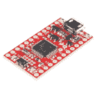

# 为 SAMD 板添加更多 SERCOM 端口

> 原文：<https://learn.sparkfun.com/tutorials/adding-more-sercom-ports-for-samd-boards>

## 介绍

SERCOM(串行通信)是一种多路复用串行配置，用于 SAMD21、SAMD51 和其它电路板。它允许您为大多数引脚选择各种串行功能。例如，ATmega328 在一对引脚上有 UART (RX/TX ),在另一组引脚上有 I ² C (SDA/SCL ),在另一组引脚上有 SPI (MOSI、MISO、SCK)。SAMD21 有 5 个不同的内部端口，您可以对其进行配置，以使用 UART、I ² C 和 SPI 的任意组合。SAMD21 和 SAMD51 板越来越受欢迎，部分原因就是这一特性。但是你是怎么做到的呢？

### 所需材料

要跟随本教程，您将需要以下材料。你可能不需要所有的东西，这取决于你拥有什么。将它添加到您的购物车，通读指南，并根据需要调整购物车。

#### 基于 ARM 的微控制器

在本教程中，我们将使用 RedBoard Turbo，但您应该能够很好地使用下面的任何 SAMD21 板(或下面未列出的任何板)。

[](https://www.sparkfun.com/products/15836) 

将**添加到您的[购物车](https://www.sparkfun.com/cart)中！**

 **### [【spark fun Pro RF-LoRa，915MHz (SAMD21)](https://www.sparkfun.com/products/15836)

[Out of stock](https://learn.sparkfun.com/static/bubbles/ "out of stock") WRL-15836

SparkFun Pro RF 是一款支持 LoRa 的无线板，它将 SAMD21 和远程 RFM95W 结合在一起，构成一个紧凑的电子设备

$33.953[Favorited Favorite](# "Add to favorites") 14[Wish List](# "Add to wish list")****[](https://www.sparkfun.com/products/13664) 

将**添加到您的[购物车](https://www.sparkfun.com/cart)中！**

 **### [SparkFun SAMD21 迷你突围](https://www.sparkfun.com/products/13664)

[In stock](https://learn.sparkfun.com/static/bubbles/ "in stock") DEV-13664

如果您准备从旧的 8 位/16MHz 微控制器升级您的 Arduino 游戏，SparkFun SAMD21 Mini Breakout 是…

$22.5018[Favorited Favorite](# "Add to favorites") 36[Wish List](# "Add to wish list")****[](https://www.sparkfun.com/products/14812) 

将**添加到您的[购物车](https://www.sparkfun.com/cart)中！**

 **### [spark fun red Board Turbo-samd 21 开发板](https://www.sparkfun.com/products/14812)

[In stock](https://learn.sparkfun.com/static/bubbles/ "in stock") DEV-14812

如果你准备从旧的 8 位/16MHz 微控制器升级你的 Arduino 游戏，SparkFun RedBoard Turbo 是一种形式…

$26.958[Favorited Favorite](# "Add to favorites") 27[Wish List](# "Add to wish list")****[](https://www.sparkfun.com/products/13672) 

将**添加到您的[购物车](https://www.sparkfun.com/cart)中！**

 **### [SparkFun SAMD21 开发突破](https://www.sparkfun.com/products/13672)

[In stock](https://learn.sparkfun.com/static/bubbles/ "in stock") DEV-13672

如果您准备从旧的 8 位/16MHz 微控制器升级您的 Arduino 游戏，SparkFun SAMD21 Dev Breakout 是一个…

$29.507[Favorited Favorite](# "Add to favorites") 13[Wish List](# "Add to wish list")******** ********#### 串行设备和原型硬件

你还需要一个串行设备。我们还将使用一个 [16x2 串行 LCD 屏幕](https://www.sparkfun.com/products/14072)作为示例，因为它将通过 UART、SPI 或 I ² C 接受命令。您还需要一种方法将您的电路板连接到屏幕，但这些是唯一需要遵循的组件。

[](https://www.sparkfun.com/products/116) 

将**添加到您的[购物车](https://www.sparkfun.com/cart)中！**

 **### [破开头球——直击](https://www.sparkfun.com/products/116)

[In stock](https://learn.sparkfun.com/static/bubbles/ "in stock") PRT-00116

一排标题-打破适应。40 个引脚，可切割成任何尺寸。用于定制 PCB 或通用定制接头。

$1.7520[Favorited Favorite](# "Add to favorites") 133[Wish List](# "Add to wish list")****[](https://www.sparkfun.com/products/10215) 

将**添加到您的[购物车](https://www.sparkfun.com/cart)中！**

 **### [USB micro-B 线- 6 脚](https://www.sparkfun.com/products/10215)

[In stock](https://learn.sparkfun.com/static/bubbles/ "in stock") CAB-10215

USB 2.0 型到微型 USB 5 针。这是一种新的、更小的 USB 设备连接器。微型 USB 连接器大约是…

$5.5014[Favorited Favorite](# "Add to favorites") 21[Wish List](# "Add to wish list")****[](https://www.sparkfun.com/products/115) 

将**添加到您的[购物车](https://www.sparkfun.com/cart)中！**

 **### [女标题](https://www.sparkfun.com/products/115)

[In stock](https://learn.sparkfun.com/static/bubbles/ "in stock") PRT-00115

单排 40 孔，内螺纹接头。可以用一把钢丝钳切割成合适的尺寸。标准 0.1 英寸间距。我们广泛使用它们…

$1.758[Favorited Favorite](# "Add to favorites") 71[Wish List](# "Add to wish list")****[](https://www.sparkfun.com/products/8431) 

将**添加到您的[购物车](https://www.sparkfun.com/cart)中！**

 **### [跳线高级 6 "米/米装 10 根](https://www.sparkfun.com/products/8431)

[In stock](https://learn.sparkfun.com/static/bubbles/ "in stock") PRT-08431

这是一个 SparkFun 独家！这些是 155 毫米长、26 AWG 跳线，两端都有公接头。用这些来跳离…

$4.502[Favorited Favorite](# "Add to favorites") 11[Wish List](# "Add to wish list")****[](https://www.sparkfun.com/products/12044) 

将**添加到您的[购物车](https://www.sparkfun.com/cart)中！**

 **### [【试验板-迷你模块化(红色)](https://www.sparkfun.com/products/12044)

[In stock](https://learn.sparkfun.com/static/bubbles/ "in stock") PRT-12044

这个红色迷你试验板是你的小项目原型的好方法！有了 170 个并列点，就有足够的空间来建立…

$4.50[Favorited Favorite](# "Add to favorites") 12[Wish List](# "Add to wish list")****[](https://www.sparkfun.com/products/retired/14072) 

### [spark fun 16x 2 SerLCD-Black on RGB 3.3V](https://www.sparkfun.com/products/retired/14072)

[Retired](https://learn.sparkfun.com/static/bubbles/ "Retired") LCD-14072

SparkFun SerLCD 是一款基于 AVR 的串行 LCD，为添加 16x 2……

5 **Retired**[Favorited Favorite](# "Add to favorites") 5[Wish List](# "Add to wish list")********** **********### 工具

根据您的设置，您可能需要烙铁、焊料、[通用焊接附件](https://www.sparkfun.com/categories/49)用于不带接头的电路板。

[](https://www.sparkfun.com/products/14456) 

将**添加到您的[购物车](https://www.sparkfun.com/cart)中！**

 **### [【烙铁- 60W(可调温度)](https://www.sparkfun.com/products/14456)

[In stock](https://learn.sparkfun.com/static/bubbles/ "in stock") TOL-14456

当你不想倾家荡产，但又需要一个可靠的烙铁时，这个可调节温度的烙铁是一个很好的工具…

$16.5016[Favorited Favorite](# "Add to favorites") 43[Wish List](# "Add to wish list")****[](https://www.sparkfun.com/products/9163) 

将**添加到您的[购物车](https://www.sparkfun.com/cart)中！**

 **### [无铅焊料- 15 克管](https://www.sparkfun.com/products/9163)

[In stock](https://learn.sparkfun.com/static/bubbles/ "in stock") TOL-09163

这是你的无铅焊料的基本管，带有不干净的水溶性树脂芯。0.031 英寸规格，15 克

$3.954[Favorited Favorite](# "Add to favorites") 14[Wish List](# "Add to wish list")**** ****### 推荐阅读

如果您不熟悉以下概念，我们建议您在继续之前查看这些教程。

[](https://learn.sparkfun.com/tutorials/samd21-minidev-breakout-hookup-guide) [### SAMD21 迷你/开发分线连接指南](https://learn.sparkfun.com/tutorials/samd21-minidev-breakout-hookup-guide) An introduction to the Atmel ATSAMD21G18 microprocessor and our Mini and Pro R3 breakout boards. Level up your Arduino-skills with the powerful ARM Cortex M0+ processor.[Favorited Favorite](# "Add to favorites") 7[](https://learn.sparkfun.com/tutorials/avr-based-serial-enabled-lcds-hookup-guide) [### 基于 AVR 的串行 LCD 连接指南](https://learn.sparkfun.com/tutorials/avr-based-serial-enabled-lcds-hookup-guide) The AVR-based Qwiic Serial Enabled LCDs are a simple and cost effective solution to include in your project. These screens are based on the HD44780 controller, and include ATmega328P with an Arduino compatible bootloader. They accept control commands via Serial, SPI and I2C (via PTH headers or Qwiic connector). In this tutorial, we will show examples of a simple setup and go through each communication option.[Favorited Favorite](# "Add to favorites") 13[](https://learn.sparkfun.com/tutorials/redboard-turbo-hookup-guide) [### RedBoard Turbo 连接指南](https://learn.sparkfun.com/tutorials/redboard-turbo-hookup-guide) An introduction to the RedBoard Turbo. Level up your Arduino-skills with the powerful SAMD21 ARM Cortex M0+ processor 2

### 雷德伯德涡轮增压车的外观

每当一个新板被添加到 Arduino IDE 时，它都会附带几个变量文件( **variant.h** 和 **variant.cpp** )。这些文件定义了哪些引脚用于什么目的。它们定义 D0 映射到哪里，`BUILT_IN_LED`去往哪里，以及哪些管脚被分配给 UART、I ² C 等。您遇到的几乎任何 SAMD21 或 SAMD51 板都应该已经在其变体文件中定义了至少 1 个 UART、I ² C 和 SPI 端口。通常最简单的方法就是使用它们。但是偶尔你会想要添加另一个端口。例如，您有一个加速度计，想用来测量两个不同平台上的振动。但是加速度计只有一个可用的 I ² C 地址。虽然您可以使用 I ² C 多路复用器，但您也可以在您的电路板上再添加一个 I ² C 端口。

让我们来看看 RedBoard Turbo。如你所见，在右上角有一个 I ² C 端口。在底部，您还可以看到 UART 和标记为 TX 和 RX 的引脚。最后，您将看到通常被称为传统 ISP 报头的内容。最初，这个 SPI 端口连接到电路板一侧的一个端口(ATMega 电路板只有一个 SPI 端口),用于将引导加载程序编程到电路板上。由于许多屏蔽层将此端口用作主要 SPI 端口，因此也存在这种情况。但是，它们位于与 RedBoard Turbo 不同的 SPI 端口上。

[](https://cdn.sparkfun.com/assets/learn_tutorials/8/5/8/RedBoardTurboSercom_SAMD.jpg)**Heads up!** The RedBoard Turbo with the SAMD21 uses a different architecture. Compared to the Arduino Uno/RedBoard with an ATmega328P, there are no SPI pins on D10-D13 for the RedBoard Turbo.

现在让我们仔细看看 SAMD21，并开始定义一些术语。

*   **[串行](https://en.wikipedia.org/wiki/Serial_communication)**——串行通信是指一次发送一项或一位。这与并行不同，并行是在不同的线路上一次发送多个项目。UART、SPI 和 I ² C 都是串行通信类型。
*   **[【通用异步收发器】](https://learn.sparkfun.com/tutorials/serial-communication)**——这就是通常所说的串行，尽管它只是串行的一种类型。通过 TX(发送)和 RX(接收)线路，该通信协议没有时钟线路。还要记住，一个器件发射的信号是另一个器件接收的信号，因此您需要将 TX 连接到 RX，RX 连接到 TX。
    *   **RX**-UART 通信的接收线。
    *   **TX**-UART 通信的发送线路。
*   **[【SPI(串行外设接口)](https://learn.sparkfun.com/tutorials/serial-peripheral-interface-spi)**——该串行总线既有一条用于主机发送数据和从机接收数据的线路(MOSI)，一条用于从机发送数据和主机接收数据的线路(MISO)，还有一个时钟(SCK)。CS 线路用于选择正在与哪个电路板通话。换句话说，一条总线将有 *3+n* 根导线。当从机的 CS 线路被选中时，它知道主机正试图与它通话。因为这只是一条选择线，所以它可能包括也可能不包括在硬件串行接口中。
    *   **MOSI**-SPI 总线上的主机输出，从机排队。
    *   **MISO**-SPI 总线的主机输入、从机输出线路。
    *   **SCK**-SPI 总线的时钟线。
    *   **CS**-SPI 总线的电缆选择线。也称为从机选择(SS)。
*   **[I ² C(或 I2C，内部集成电路)](https://learn.sparkfun.com/tutorials/i2c)**——这是一个双线串行接口，使用时钟和数据线传递信息。总线上的每个设备都有一个不同的地址，由主机在通信期间指定。I ² C 总线在两条线上都需要[上拉电阻](https://learn.sparkfun.com/tutorials/pull-up-resistors)。大多数 SparkFun I ² C 板都内置了上拉电阻以及一个跳线来禁用它们。
    *   **SDA** -这是一条 I ² C 总线的数据线。
    *   **SCL**——这是一条 I ² C 总线的时钟线。
*   **[【SERCOM】](https://learn.sparkfun.com/tutorials/samd21-minidev-breakout-hookup-guide/samd21-overview#sercom)**-这是 SAMD21 板上一个串行通信端口的名称。由于 SAMD21 的引脚多路复用，芯片上的每个引脚都有多种功能。因此，每个 SERCOM 端口可以使用不同的引脚。
*   **端口**
    *   SERCOM 端口-samd 21 有 6 个串行通信模块，可以通过多种方式进行配置。端口或模块是指它们中的一个。这给了我们 6 个不同的通信选项。大多数 SAMD21 板使用其中的 4-5 个来为您带来 1 个 SPI、UART 和 I ² C 总线，并且通常使用 1 个或 2 个用于第二个 SPI，和/或连接到板上的另一个芯片，如板载闪存或 WiFi 模块。
    *   **Pad** -每个 SERCOM 端口将有 4 个 Pad(0-4)。为了确定如何使用 SERCOM 端口，我们需要找出端口的哪些管脚在哪个焊盘上。这可以通过多种方式写入，例如，SERCOM 1 上的 pad 0 可以写成 SERCOM1/Pad[0]、SERCOM1.0，甚至 1:0。
    *   **SAMD21 端口** -虽然 Arduino 为所有可用的引脚命名(通常基于它们的配置方式)，但芯片制造商不会以这种方式分配引脚编号。相反，每个引脚都有一个端口名。对于 SAMD21，端口名称将包含一个字母(A 或 B)和一个数字，如下所示:PortA10，PortB08。通常为了节省空间，端口会缩写为字母“P ”,名称如下:PA10、PB08 等。
*   **宏**——这是你的代码中预定义的值。通常由`#define`命令指定。查看电路板定义时，您会看到许多宏都在别处定义了定义。定义并不重要，理解宏的作用也不重要。例如，宏`PIN_WIRE_SDA`被用来定义在一个导线(I ² C】接口上哪个管脚用于 SDA。
*   **Multiplex(或简称 mux)**-这是将许多冲突的属性分配给一个项目，并能够选择您想要的属性的做法。这种情况下，SAMD21 芯片上的每个引脚都被分配了许多功能，从模拟输入、数字输入、定时器到各种 SERCOM 端口。当我们设置一个 SERCOM 端口时，我们需要花一些时间在 mux 中选择正确的特性。
*   **[Qwiic](sparkfun.com/qwiic)** - Qwiic 是 SparkFun 的 I ² C 接口。明白了，Qw **IIC** ！此端口连接到板 I ² C 端口，并提供电源(3.3V)。你会在很多板上看到它，包括 Redboard Turbo。这是硬连线到板的 SDA 和 SCL 引脚，所以你不能改变它。

## 数据表- SAMD21

### 图形数据表

设置 SERCOM 端口的部分技巧是确定哪些管脚要放在一起。你不能随便分配他们。SparkFun 图形数据表很好地总结了它们。我们将从查看 Redboard Turbo 开始，并检查其图形数据手册以及 SAMD21 数据手册。

[](https://github.com/sparkfun/RedBoard_Turbo/blob/master/Documentation/GraphicalDatasheet-SamD21TurboDev.pdf)*Click image for the full version.*

SparkFun 图形数据手册可以让您快速浏览一页，了解您的电路板特性。上图是 Redboard Turbo 图形数据表的简化版本。点击它，你会得到一个全尺寸的版本，包括所有列出的 SERCOM 端口。正如你所看到的，Turbo 有 1 个串行端口，1 个 I ² C 端口(也连接到 Qwiic 连接器)和 1 个 SPI 端口(传统的 ISCP 头)。

### SAMD21 数据手册

查看 *I/O 多路复用和考虑因素*下的 [SAMD21 数据手册(第 21 页)](https://cdn.sparkfun.com/datasheets/Dev/Arduino/Boards/Atmel-42181-SAM-D21_Datasheet.pdf)，我们可以开始看到每个引脚可以拥有的所有选项。我们可以为每个引脚选择任何列。具体来说，我们关注 C 列和 d 列，另外，值得注意的是，Redboard Turbo 上的芯片是 SAMD21G18。正如您所看到的，还有其他具有更多或更少引脚的 SAMD21 芯片变体。这个' **G** '版本就是我们想要的。如您所见，许多引脚都有 1 或 2 个 SERCOM 端口可用。

[](https://cdn.sparkfun.com/datasheets/Dev/Arduino/Boards/Atmel-42181-SAM-D21_Datasheet.pdf)*Click image for the full datasheet.*

### 但是什么样的引脚对应哪里呢？

虽然您可以检查原理图/电路板文件来查看芯片上的哪个引脚在哪里，但最好的选择可能是您的电路板的 **variant.cpp** 文件。让我们看看这个为 RedBoard Turbo 定义的[文件。该文件以一个相当大的注释开始。虽然这是一个很好的参考，请记住，人们可能会选择不更新他们的董事会的评论。在注释下，您应该可以看到 Pin 描述。在 RedBoard Turbo 上，引脚定义分为几个部分，以便于阅读。第一部分是 D0-D13，从 D0 和 D1 开始，它们是 UART 引脚。您会注意到第一个参数列出了端口和端口上的 pin。最后的注释还会告诉您正在使用哪个 SERCOM 端口。如果我们滚动并找到使用 SERCOM 引脚的引脚，我们会发现以下内容。](https://github.com/sparkfun/Arduino_Boards/blob/master/sparkfun/samd/variants/SparkFun_RedBoard_Turbo/variant.cpp)

```
language:c
// 0..13 - Digital pins
// ----------------------
// 0/1 - SERCOM/UART (Serial1)
{ PORTA, 11, PIO_SERCOM, (PIN_ATTR_DIGITAL), No_ADC_Channel, NOT_ON_PWM, NOT_ON_TIMER, EXTERNAL_INT_11 }, // RX: SERCOM0/PAD[3]
{ PORTA, 10, PIO_SERCOM, (PIN_ATTR_DIGITAL), No_ADC_Channel, NOT_ON_PWM, NOT_ON_TIMER, EXTERNAL_INT_10 }, // TX: SERCOM0/PAD[2]

// 20..21 I2C pins (SDA/SCL and also EDBG:SDA/SCL)
// ----------------------
{ PORTA, 22, PIO_SERCOM, PIN_ATTR_DIGITAL, No_ADC_Channel, NOT_ON_PWM, NOT_ON_TIMER, EXTERNAL_INT_6 }, // SDA: SERCOM3/PAD[0]
{ PORTA, 23, PIO_SERCOM, PIN_ATTR_DIGITAL, No_ADC_Channel, NOT_ON_PWM, NOT_ON_TIMER, EXTERNAL_INT_7 }, // SCL: SERCOM3/PAD[1]

// 22..24 - SPI pins (ICSP:MISO,SCK,MOSI)
// ----------------------
{ PORTA, 12, PIO_SERCOM_ALT, PIN_ATTR_DIGITAL, No_ADC_Channel, NOT_ON_PWM, NOT_ON_TIMER, EXTERNAL_INT_12 }, // MISO: SERCOM4/PAD[0]
{ PORTB, 10, PIO_SERCOM_ALT, PIN_ATTR_DIGITAL, No_ADC_Channel, NOT_ON_PWM, NOT_ON_TIMER, EXTERNAL_INT_10 }, // MOSI: SERCOM4/PAD[2]
{ PORTB, 11, PIO_SERCOM_ALT, PIN_ATTR_DIGITAL, No_ADC_Channel, NOT_ON_PWM, NOT_ON_TIMER, EXTERNAL_INT_11 }, // SCK: SERCOM4/PAD[3]

// 30..41 - Extra Pins
// ----------------------
// 30/31 - Extra UART
{ PORTB, 22, PIO_SERCOM_ALT, PIN_ATTR_NONE, No_ADC_Channel, NOT_ON_PWM, NOT_ON_TIMER, EXTERNAL_INT_NONE }, // 30/TX: SERCOM5/PAD[2]
{ PORTB, 23, PIO_SERCOM_ALT, PIN_ATTR_NONE, No_ADC_Channel, NOT_ON_PWM, NOT_ON_TIMER, EXTERNAL_INT_NONE }, // 31/RX: SERCOM5/PAD[3]

// 32/33 I2C (SDA/SCL and also EDBG:SDA/SCL)
{ PORTA, 22, PIO_SERCOM, PIN_ATTR_NONE, No_ADC_Channel, NOT_ON_PWM, NOT_ON_TIMER, EXTERNAL_INT_NONE }, // SDA: SERCOM3/PAD[0]
{ PORTA, 23, PIO_SERCOM, PIN_ATTR_NONE, No_ADC_Channel, NOT_ON_PWM, NOT_ON_TIMER, EXTERNAL_INT_NONE }, // SCL: SERCOM3/PAD[1]

// 34..37 - EDBG/SPI
{ PORTA, 19, PIO_SERCOM, PIN_ATTR_NONE, No_ADC_Channel, NOT_ON_PWM, NOT_ON_TIMER, EXTERNAL_INT_NONE }, // D12/MISO: SERCOM1/PAD[3]
{ PORTA, 16, PIO_SERCOM, PIN_ATTR_NONE, No_ADC_Channel, NOT_ON_PWM, NOT_ON_TIMER, EXTERNAL_INT_NONE }, // D11/MOSI: SERCOM1/PAD[0]
{ PORTA, 18, PIO_SERCOM, PIN_ATTR_NONE, No_ADC_Channel, NOT_ON_PWM, NOT_ON_TIMER, EXTERNAL_INT_NONE }, // D10/SS: SERCOM1/PAD[2]
{ PORTA, 17, PIO_SERCOM, PIN_ATTR_NONE, No_ADC_Channel, NOT_ON_PWM, NOT_ON_TIMER, EXTERNAL_INT_NONE }, // D13/SCK: SERCOM1/PAD[1] 
```

根据代码，看起来我们使用的是 SERCOM 0、1、3、4 和 5。我们使用的任何额外端口都必须使用尚未使用的 SERCOM 端口，或者重用已经使用的端口。此外，请记住，通常不使用的端口不会被删除。例如，该文件将 D30 和 D31 列为额外的串行 UART 端口。但是，开发板没有突破 D30 和 D31(但 SAMD21 开发板做到了)，所以 SERCOM 5 实际上也是免费的。

## 添加 SERCOM 端口的步骤

**Note:** This example assumes you are using the latest version of the Arduino IDE on your desktop. If this is your first time using Arduino, please review our tutorial on [installing the Arduino IDE.](https://learn.sparkfun.com/tutorials/installing-arduino-ide) If you have not previously installed an Arduino library, please check out our [installation guide.](https://learn.sparkfun.com/tutorials/installing-an-arduino-library)

对于要添加的每种类型的端口，我们基本上都要遵循 4 个步骤。所有类型的步骤都是相同的，但实现方式略有不同。因为图表和数据表用于每种类型，所以它们被列在文档的[末尾。参考引脚时，确保打开一个额外的窗口。](https://learn.sparkfun.com/tutorials/sercom-ports-for-the-samd-boards#helpful-charts)

1.)弄清楚要用哪些引脚。
2。)添加您的代码。
3。)根据引脚多路复用器更新引脚定义。
4。)把这一切放在一起。

## 添加 UART

### 1.)弄清楚要用哪些引脚。

我们先来看看 Arduino 的 SAMD21 核心文件中的 [SERCOM.h](https://github.com/arduino/ArduinoCore-samd/blob/master/cores/arduino/SERCOM.h#L73) 文件。具体来说，我们正在看第 73-86 行。您应该会看到下面列出的代码。但这意味着什么呢？有两个部分，第一部分定义了哪些焊盘可以用作 RX 焊盘。看起来你可以使用护垫`0`、`1`、`2`和`3`，它们都是护垫。接下来，它定义了哪些焊盘可以用于 TX。看起来你只能用衬垫`0`和`2`。因此，在选择引脚时，我们需要记住这一点。

```
language:c
typedef enum
{
    SERCOM_RX_PAD_0 = 0,
    SERCOM_RX_PAD_1,
    SERCOM_RX_PAD_2,
    SERCOM_RX_PAD_3
} SercomRXPad;

typedef enum
{
    UART_TX_PAD_0 = 0x0ul,  // Only for UART
    UART_TX_PAD_2 = 0x1ul,  // Only for UART
    UART_TX_RTS_CTS_PAD_0_2_3 = 0x2ul,  // Only for UART with TX on PAD0, RTS on PAD2 and CTS on PAD3
} SercomUartTXPad; 
```

因为我遇到的所有主板都没有使用 SERCOM 2，所以我们将在示例中使用它。让我们从 TX 开始，因为与 RX 相比，这些引脚是有限的。我们需要找到哪个引脚在 2:0 或 2:2 上。[查看我们的图表](https://learn.sparkfun.com/tutorials/adding-more-sercom-ports-for-samd-boards#helpful-charts)，你可以看到这些引脚被标为 MISO、D4、D2 和 D1/德克萨斯。因为 MISO 和 D1/TX 已经被使用，这意味着我们可以使用 D2 或 D4。让我们使用 D2，看看我们能否将新的串行端口放在原来的端口旁边。这意味着 RX 应该在 D3 上。看起来 D3 是 2:1，这样就可以了。

### 2.)添加您的代码。

接下来，让我们弄清楚我们需要什么代码。我们再来看看 [**variant.cpp** 文件](https://github.com/sparkfun/Arduino_Boards/blob/master/sparkfun/samd/variants/SparkFun_RedBoard_Turbo/variant.cpp#L213)。在底部附近，您会看到下面几行。这就是我们试图在代码中复制的内容。 **variant.h** 文件定义了所有这些宏，但是它们的名字给了我们一个很好的主意应该放在哪里。

```
language:c
Uart Serial1( &sercom0, PIN_SERIAL1_RX, PIN_SERIAL1_TX, PAD_SERIAL1_RX, PAD_SERIAL1_TX ) ;
Uart Serial( &sercom5, PIN_SERIAL_RX, PIN_SERIAL_TX, PAD_SERIAL_RX, PAD_SERIAL_TX ) ;
void SERCOM0_Handler()
{
  Serial1.IrqHandler();
}

void SERCOM5_Handler()
{
  Serial.IrqHandler();
} 
```

先说定义。让我们选择一个名字。`mySerial`“听起来不错。我们还知道我们将使用 SERCOM 2，RX 将在 D3 上，TX 在 D2 上，D3 使用 pad 1，D2 使用 pad 2。因此，我们将在代码中添加以下内容。

```
language:c
Uart mySerial(&sercom2, 3, 2, SERCOM_RX_PAD_1, UART_TX_PAD_2);

void SERCOM2_Handler()
{
  mySerial.IrqHandler();
} 
```

### 3.)根据引脚多路复用器更新引脚定义。

接下来，我们需要设置 mux。目前，D2 和 D3 被定义为通用 I/O 引脚。我们希望它们充当 SERCOM 引脚。我们需要做的第一件事是添加引脚外设库。然后我们使用`pinPeripheral`命令来设置管脚定义。

```
language:c
#include "wiring_private.h" // pinPeripheral() function

pinPeripheral(2, PIO_SERCOM); 
pinPeripheral(3, PIO_SERCOM_ALT); 
```

你会注意到一个使用了参数`PIO_SERCOM`，另一个使用了参数`PIO_SERCOM_ALT`。如果查看数据手册，您会注意到这些引脚可能在 SERCOM 或 SERCOM-ALT 下列出了一个 SERCOM 端口。对于 D2，我们使用 SERCOM 列中的 SERCOM 端口。对于 D3，我们使用 SERCOM-ALT 列中的 SERCOM 端口。

### 4.)把这一切放在一起。

第 4 步是运行代码、测试和故障排除。在本例中，我们将抓取一个串行 LCD 屏幕，并将其连接到我们新的串行 UART 端口。如果您还没有将[焊接到 LCD 上，请确保您已经将](https://learn.sparkfun.com/tutorials/how-to-solder-through-hole-soldering)接头焊接到 LCD 上。

[](https://cdn.sparkfun.com/assets/learn_tutorials/8/5/8/SparkFun_Arduino_SAMD21_Configured_SERCOM_UART_Fritzing_bb.jpg)

下一步是用下面列出的代码测试 UART 端口。代码非常简单，向您展示了所有新代码应该放在哪里。将代码复制并粘贴到 Arduino IDE 中。选择您的主板、COM 端口，然后点击上传。

```
language:c
/*********************************************************************
 * Sample code for setting up additional Serial ports on a SamD21 board
 * In this example the Redboard Turbo is used with the 16x2 SerLCD display
 * For more information on the SerLCD code check out the github repo
 * https://github.com/sparkfun/OpenLCD
 * https://www.sparkfun.com/products/14812
 * https://www.sparkfun.com/products/14072
 * By: Michelle Shorter - SparkFun Electronics
 * License: This code is public domain but you buy me a burger
 * if you use this and we meet someday (Beefware license).
 *********************************************************************/

#include "wiring_private.h" // pinPeripheral() function
//D2-TX, D3-RX
Uart mySerial (&sercom2, 3, 2, SERCOM_RX_PAD_1, UART_TX_PAD_2);
void SERCOM2_Handler()
{
  mySerial.IrqHandler();
}

int i = 0;

void setup() {
  // put your setup code here, to run once:
  mySerial.begin(9600);

  pinPeripheral(2, PIO_SERCOM);
  pinPeripheral(3, PIO_SERCOM_ALT);

  mySerial.write('|');//Setting character
  mySerial.write('-');//Clear display
  mySerial.write('|');//Put LCD into setting mode
  mySerial.write(158 + 0); //Set green backlight amount to 0%
  mySerial.write('|');//Put LCD into setting mode
  mySerial.write(188 + 0); //Set blue backlight amount to 0%
  mySerial.write('|');//Put LCD into setting mode
  mySerial.write(128 + 29); //Set white/red backlight amount to 51% (100%=+29)

  mySerial.print("Welcome");
  delay(1000);
}

void loop() {
  // put your main code here, to run repeatedly:
  mySerial.write('|');//Setting character
  mySerial.write('-');//Clear display
  mySerial.print("Counting ");
  mySerial.print(i);
  i++;
  delay(1000);

} 
```

## 添加 SPI

### 1.)弄清楚要用哪些引脚。

让我们先来看看 Arduino 的 SAMD21 核心文件中的 [SERCOM.h](https://github.com/arduino/ArduinoCore-samd/blob/master/cores/arduino/SERCOM.h#L73) 文件。具体来说，我们正在查看第 73-79 行(是的，我们在添加 UART 时查看了这些行)和第 102-108 行。您应该会看到下面列出的代码。但这意味着什么呢？有两部分，第一部分定义了哪些焊盘可以用作 RX (MISO)焊盘。看起来你可以使用护垫`0`、`1`、`2`和`3`，它们都是护垫。接下来，它定义了可以用于 TX (MOSI 和 SCK)的焊盘以及配置。因此，在选择引脚时，我们需要记住这一点。

```
language:c
typedef enum
{
    SERCOM_RX_PAD_0 = 0,
    SERCOM_RX_PAD_1,
    SERCOM_RX_PAD_2,
    SERCOM_RX_PAD_3
} SercomRXPad;

//...

typedef enum
{
    SPI_PAD_0_SCK_1 = 0,
    SPI_PAD_2_SCK_3,
    SPI_PAD_3_SCK_1,
    SPI_PAD_0_SCK_3
} SercomSpiTXPad; 
```

因为我遇到的所有主板都没有使用 SERCOM 2，所以我们将在示例中使用它。让我们从输出开始，因为与 MISO 引脚相比，这些引脚是有限的。看起来 SCK 只能在`1`或`3`台上，而 MOSI 可以在`0`、`2`或`3`台上，这取决于配置。因此，[查看我们的表格](https://learn.sparkfun.com/tutorials/adding-more-sercom-ports-for-samd-boards#helpful-charts)，让我们从移除未连接到我们的电路板或已在使用的引脚开始。这样就去掉了 MISO、D38、D1/TX 和 D0/RX，只剩下 D4、D3、D2 和 D5。这些看起来都是不错的选择，但是让我们用 D3 代替味噌，用 D5 代替 SCK，用 D4 代替 MOSI。同样，我们需要挖掘我们的花式图表，以找出什么是哪里。

### 2.)添加您的代码。

接下来让我们弄清楚我们需要什么代码。我们再来看看 [SPI.cpp](https://github.com/arduino/ArduinoCore-samd/blob/master/libraries/SPI/SPI.cpp#L261) 文件。在接近第 261 行底部的地方，您会看到下面的行。这就是我们试图在代码中复制的内容。 **variant.h** 文件定义了所有这些宏，但是它们的名字给了我们一个很好的主意应该放在哪里。

```
language:c
 SPIClass SPI (&PERIPH_SPI, PIN_SPI_MISO, PIN_SPI_SCK, PIN_SPI_MOSI, PAD_SPI_TX, PAD_SPI_RX); 
```

先说定义。让我们选择一个名字。`SPI2`“听起来不错。我们还知道我们将使用 SERCOM 2，我们将使用 D3 表示 MISO，D5 表示 SCK，D4 表示 MOSI。因此，我们将在代码中添加以下内容。

```
language:c
SPIClass SPI2 (&sercom2, 3, 5, 4, SPI_PAD_0_SCK_3, SERCOM_RX_PAD_1); 
```

### 3.)根据引脚多路复用器更新引脚定义。

接下来，我们需要设置 mux。目前，这些引脚被定义为通用 I/O 引脚。我们希望它们充当 SERCOM 引脚。我们需要做的第一件事是添加引脚外设库。然后我们使用`pinPeripheral`命令来设置管脚定义。

```
language:c
#include "wiring_private.h" // pinPeripheral() function

SPI2.begin();
pinPeripheral(3, PIO_SERCOM_ALT);
pinPeripheral(4, PIO_SERCOM_ALT);
pinPeripheral(5, PIO_SERCOM); 
```

你会注意到其中一个使用了参数`PIO_SEROM`，其他的使用了参数`PIO_SERCOM_ALT`。如果查看数据手册，您会注意到这些引脚可能在 SERCOM 或 SERCOM-ALT 下列出了一个 SERCOM 端口。对于 D5，我们使用 SERCOM 列中的 SERCOM 端口。对于 D3 和 D4，我们使用 SERCOM-ALT 列中的 SERCOM 端口。

### 4.)把这一切放在一起。

第 4 步是运行代码、测试和故障排除。在本例中，我们将抓取一个串行 LCD 屏幕，并将其连接到新的 SPI 端口。如果您还没有将[焊接到 LCD 上，请确保您已经将](https://learn.sparkfun.com/tutorials/how-to-solder-through-hole-soldering)接头焊接到 LCD 上。

[](https://cdn.sparkfun.com/assets/learn_tutorials/8/5/8/SparkFun_Arduino_SAMD21_Configured_SERCOM_Serial_SPI-Fritzing_bb.jpg)

下一步是用下面列出的代码测试 SPI 端口。代码非常简单，向您展示了所有新代码应该放在哪里。该代码还包括`CSPIN`的引脚定义。将代码复制并粘贴到 Arduino IDE 中。选择您的主板、COM 端口，然后点击上传。

```
language:c
/*********************************************************************
   Sample code for setting up additional Serial ports on a SamD21 board
   In this example the Redboard Turbo is used with the 16x2 SerLCD display
   For more information on the SerLCD code check out the github repo
   https://github.com/sparkfun/OpenLCD
   https://www.sparkfun.com/products/14812
   https://www.sparkfun.com/products/14072
   By: Michelle Shorter - SparkFun Electronics
   License: This code is public domain but you buy me a burger
   if you use this and we meet someday (Beefware license).
**********************************************************************/
#include <SPI.h>
#include "wiring_private.h" // pinPeripheral() function
#define CSPIN 6
#define Time 25

//D3-MISO, D4-MOSI, D5-SCK
SPIClass SPI2 (&sercom2, 3, 5, 4, SPI_PAD_0_SCK_3, SERCOM_RX_PAD_1); 

int i = 0;
void setup() {
  // put your setup code here, to run once:

  //Get all pins and SPI ports setup
  SPI2.begin();
  pinPeripheral(3, PIO_SERCOM_ALT);
  pinPeripheral(4, PIO_SERCOM_ALT);
  pinPeripheral(5, PIO_SERCOM);
  pinMode(CSPIN, OUTPUT);
  digitalWrite(CSPIN, HIGH); //make sure it is high to start
  SPI2.setClockDivider(SPI_CLOCK_DIV128); //Slow down the master a bit

  //Reset the screen, set backlight, etc.
  digitalWrite(CSPIN, LOW);// Select the screen before sending
  SPI2.transfer('|');//Setting character
  SPI2.transfer('-');//Clear display
  SPI2.transfer('|');//Put LCD into setting mode
  SPI2.transfer(158 + 0); //Set green backlight amount to 0%
  SPI2.transfer('|');//Put LCD into setting mode
  SPI2.transfer(188 + 10); //Set blue backlight amount to 0%
  SPI2.transfer('|');//Put LCD into setting mode
  SPI2.transfer(128 + 5); //Set white/red backlight amount to (15=51% 100%=+29)
  delay(Time);
  digitalWrite(CSPIN, HIGH);// Deselect the screen after sending
  delay(1000);//Each setting change prints an output, this delay allows them to be printed before trying to keep going

  //Send Welcome Text
  char tempString[50]; //Needs to be large enough to hold the entire string with up to 5 digits
  sprintf(tempString, "Welcome ");
  spiSendString(tempString);
  delay(1500);
}

void loop() {    
  // put your main code here, to run repeatedly:

  //Clear the screen, then send the Counting string
  digitalWrite(CSPIN, LOW);// Select the screen before sending
  SPI2.transfer('|');//Setting character
  SPI2.transfer('-');//Clear display
  delay(Time);
  digitalWrite(CSPIN, HIGH);// Deselect the screen after sending
  char tempString[50]; //Needs to be large enough to hold the entire string with up to 5 digits
  sprintf(tempString,"Counting: %d ", i);
  spiSendString(tempString);
  i++;
  delay(1000-Time);

}

//Sends a string over SPI
void spiSendString(char* data)
{
  digitalWrite(CSPIN, LOW); //Drive the CS pin low to select OpenLCD
  for(byte x = 0 ; data[x] != '\0' ; x++) //Send chars until we hit the end of the string
    SPI2.transfer(data[x]);
  digitalWrite(CSPIN, HIGH); //Release the CS pin to de-select OpenLCD
} 
```

## 添加 I2C

### 1.)弄清楚要用哪些引脚。

为 I ² C 挑选引脚稍微容易一点。SDA 始终位于焊盘 0。SCL 总是在 1 号发射台。就是这样。在这种情况下，当我们查看图表时，我们可以立即排除 MISO 和 D38，因为这些引脚是使用过的还是未断开的。这意味着 D4 将成为民主行动党，D3 将成为 SCL。

### 2.)添加您的代码。

接下来，让我们弄清楚我们需要什么代码。我们来看看 Arduino 的 SAMD21 核心文件中的 [Wire.cpp](https://github.com/arduino/ArduinoCore-samd/blob/master/libraries/Wire/Wire.cpp#L285) 文件。在接近第 285 行底部的地方，您会看到下面的行。这就是我们试图在代码中复制的内容。 **variant.h** 文件定义了所有这些宏，但是它们的名字给了我们一个很好的主意应该放在哪里。

```
language:c
TwoWire Wire(&PERIPH_WIRE, PIN_WIRE_SDA, PIN_WIRE_SCL); 
```

先说定义。让我们选择一个名字。“我的电线”听起来不错。我们还知道我们将使用 SERCOM 2，我们将使用 D4 用于 SDA，D3 用于 SCL。因此，我们将在代码中添加以下内容。

```
language:c
TwoWire myWire(&sercom2, 4, 3); 
```

### 3.)根据引脚多路复用器更新引脚定义。

接下来，我们需要设置 mux。目前，这些引脚被定义为通用 I/O 引脚。我们希望它们充当 SERCOM 引脚。我们需要做的第一件事是添加引脚外设库。然后我们使用`pinPeripheral`命令来设置管脚定义。

```
language:c
#include "wiring_private.h" // pinPeripheral() function

myWire.begin();
pinPeripheral (4,PIO_SERCOM_ALT);
pinPeripheral (3,PIO_SERCOM_ALT); 
```

您会注意到代码使用了参数`PIO_SERCOM_ALT`。如果查看数据手册，您会注意到这些引脚可能在 SERCOM 或 SERCOM-ALT 下列出了一个 SERCOM 端口。在这种情况下，两个引脚都在 SERCOM_ALT 列下，但是如果您在 SERCOM 列下使用一个引脚，请使用参数“`PIO_SEROM`”。

### 4.)把这一切放在一起。

第 4 步是运行代码、测试和故障排除。对于这个例子，我们将抓取一个串行 LCD 屏幕，并将其连接到我们新的 I ² C 端口。如果你还没有将[焊接到 LCD 上，确保你已经将](https://learn.sparkfun.com/tutorials/how-to-solder-through-hole-soldering)焊接到 LCD 上。

[](https://cdn.sparkfun.com/assets/learn_tutorials/8/5/8/SparkFun_SAMD21_Configured_SERCOM_Serial_I2C_Fritzing_bb.jpg)

下一步是用下面列出的代码测试 I2C 端口。代码非常简单，向您展示了所有新代码应该放在哪里。将代码复制并粘贴到 Arduino IDE 中。选择您的主板、COM 端口，然后点击上传。

```
language:c
/*********************************************************************
   Sample code for setting up additional Serial ports on a SamD21 board
   In this example the Redboard Turbo is used with the 16x2 SerLCD display
   For more information on the SerLCD code check out the github repo
   https://github.com/sparkfun/OpenLCD
   https://www.sparkfun.com/products/14812
   https://www.sparkfun.com/products/14072
   By: Michelle Shorter - SparkFun Electronics
   License: This code is public domain but you buy me a burger
   if you use this and we meet someday (Beefware license).
**********************************************************************/
#include <Wire.h> 
#include "wiring_private.h" // pinPeripheral() function

//D4 SDA, D3 SCL
TwoWire myWire(&sercom2, 4, 3);

#define DISPLAY_ADDRESS1 0x72 //This is the default address of the OpenLCD

int i = 0;
void setup() {
  // put your setup code here, to run once:

  //Get all pins and I2C ports setup

  myWire.begin();
  pinPeripheral(3, PIO_SERCOM_ALT);
  pinPeripheral(4, PIO_SERCOM_ALT);

  //Reset the screen, set backlight, etc.
  myWire.beginTransmission(DISPLAY_ADDRESS1);
  myWire.write('|');//Setting character
  myWire.write('-');//Clear display
  myWire.write('|');//Put LCD into setting mode
  myWire.write(158 + 0); //Set green backlight amount to 0%  
  myWire.write('|');//Put LCD into setting mode
  myWire.write(188 + 15); //Set blue backlight amount to 0%
  myWire.write('|');//Put LCD into setting mode
  myWire.write(128 + 0); //Set white/red backlight amount to (15=51% 100%=+29)
  //Send Welcome Text
  myWire.print("Welcome ");
  myWire.endTransmission();
  delay(3000);
}

void loop() {
  // put your main code here, to run repeatedly:

  //Clear the screen, then send the Counting string
  myWire.beginTransmission(DISPLAY_ADDRESS1);
  myWire.write('|');//Setting character
  myWire.write('-');//Clear display
  myWire.print("Counting: ");
  myWire.print(i);
  myWire.endTransmission();
  i++;
  delay(1000);

} 
```

## 有用的图表

我答应给你一些图表。

*   先说 SAM21 [数据表](https://cdn.sparkfun.com/datasheets/Dev/Arduino/Boards/Atmel-42181-SAM-D21_Datasheet.pdf)。从第 21 页的 *I/O 多路复用和考虑因素*开始，您将看到包括多路复用选项在内的所有引脚定义。这真的是一切的来源。
*   接下来是[图形数据表](https://github.com/sparkfun/Graphical_Datasheets/tree/master/Datasheets)。虽然这些都可以在任何主板的产品页面上找到，但在这里它们只是一个简洁的小集合。

下面是我做的一些图表来帮助你...

### SAMD21 上的 Arduino 引脚

| SERCOM | 端口 0 | Port 0 Alt | 端口 1 | Port 1 Alt | 端口 2 | Port 2 Alt | 端口 3 | Port 3 Alt |
| Zero | D4 | A3 号 | D3 | A4 号 | D1 | D8 | D0 | D9 |
| one | D11 | 透明的 | D13 | 透明的 | D10 | SWCLK | D12，
RXLED | SWDIO |
| Two | 军事情报部门组织(Military Intelligence Service Organization) | D4 | D38 | D3 | D2 | D1/TX | D5 | D0/RX |
| three | D20/SDA | D11/MOSI | D21/SCL | D13/SCK | 通用串行总线 | D10/党卫军，
D6 | 通用串行总线 | D12/MISO，
D7 |
| four |  | A1，
味噌 |  | A2，
D38 |  | 
MOSI，D2 |  | 
SCK，D4 |
| five |  | D20/SDA，
A5 |  | D21/SCL | D6 | USB，
EDBGTX | D7 | USB，
EDBGRX |

*注意:ISP 接头不单独命名引脚，因此它被称为 ISP 或板上使用的实际 SPI 引脚名称。*

*注意:逗号表示有 2 个引脚可以使用该端口。斜线表示同一引脚的两个不同名称。*

*注意:有些引脚直接连接到 USB 端口或晶振上，无法使用。它们被贴上这样的标签。*

### Arduino 电路板

我还想知道在不同的 Arduino 板上哪些 SERCOM 端口是开放的。下表列出了一些开发板已经分配给串行协议的 SERCOM 端口。

| SERCOM 端口 | Zero | one | Two | three | four | five |
| 零 | Serial1 | 精力 |  | I2C | 网络服务提供商 | EDBG 系列 |
| MKR1000 | I2C | 精力 | WinC1500 (SPI) |  |  | Serial1 |
| SAMD21 开发板 | Serial1 | 精力 |  | I2C | 网络服务提供商 | 连续的 |
| SAMD21 迷你板 | Serial1 | 精力 |  | I2C |  |  |
| RedBoard Turbo | Serial1 | 精力 |  | I2C | 网络服务提供商 | 闪光 |

## 资源和更进一步

有关更多信息，请查看以下资源:

*   [Atmel ATSAMD21G18A 产品页面](http://www.atmel.com/devices/ATSAMD21G18.aspx)
*   [ATSAMD21 概要数据表](http://www.atmel.com/Images/Atmel-42181-SAM-D21_Summary.pdf)
*   [ATSAMD21 完整数据表](https://cdn.sparkfun.com/assets/4/c/9/e/f/SAMD21-Family-DataSheet-DS40001882D.pdf)
*   开源代码库
    *   [图形数据表>数据表](https://github.com/sparkfun/Graphical_Datasheets/tree/master/Datasheets)
    *   [ArduinoCore-samd >内核> arduino > SERCOM.h](https://github.com/arduino/ArduinoCore-samd/blob/master/cores/arduino/SERCOM.h)
    *   [Arduino _ Boards>spark fum>samd>变种](https://github.com/sparkfun/Arduino_Boards/tree/master/sparkfun/samd/variants)

你的下一个项目需要一些灵感吗？查看一些相关教程:

[](https://learn.sparkfun.com/tutorials/samd21-minidev-breakout-hookup-guide) [### SAMD21 迷你/开发分线连接指南](https://learn.sparkfun.com/tutorials/samd21-minidev-breakout-hookup-guide) An introduction to the Atmel ATSAMD21G18 microprocessor and our Mini and Pro R3 breakout boards. Level up your Arduino-skills with the powerful ARM Cortex M0+ processor.[Favorited Favorite](# "Add to favorites") 7[](https://learn.sparkfun.com/tutorials/9dof-razor-imu-m0-hookup-guide) [### 9 自由度剃刀 IMU M0 连接指南](https://learn.sparkfun.com/tutorials/9dof-razor-imu-m0-hookup-guide) How to use and re-program the 9DoF Razor IMU M0, a combination of ATSAMD21 ARM Cortex-M0 microprocessor and MPU-9250 9DoF-in-a-chip.[Favorited Favorite](# "Add to favorites") 7[](https://learn.sparkfun.com/tutorials/wireless-joystick-hookup-guide) [### 无线操纵杆连接指南](https://learn.sparkfun.com/tutorials/wireless-joystick-hookup-guide) A hookup guide for the SparkFun Wireless Joystick Kit.[Favorited Favorite](# "Add to favorites") 5[](https://learn.sparkfun.com/tutorials/lorawan-with-prorf-and-the-things-network) [### LoRaWAN 与 ProRF 和物联网](https://learn.sparkfun.com/tutorials/lorawan-with-prorf-and-the-things-network) Learn how to make a LoRaWAN node for your next long range IoT project and connect it to the internet with The Things Network 11[](https://learn.sparkfun.com/tutorials/redboard-turbo-hookup-guide) [### RedBoard Turbo 连接指南](https://learn.sparkfun.com/tutorials/redboard-turbo-hookup-guide) An introduction to the RedBoard Turbo. Level up your Arduino-skills with the powerful SAMD21 ARM Cortex M0+ processor 2**********************