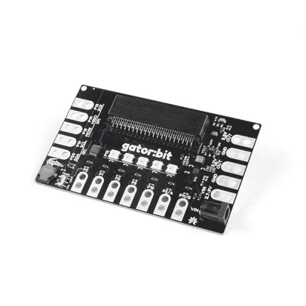

# SparkFun gator:bit v2 连接指南

> 原文：<https://learn.sparkfun.com/tutorials/sparkfun-gatorbit-v2-hookup-guide>

## 介绍

SparkFun gator:bit v2 是 BBC micro:bit 的开发板。几乎每一个微型垫:位是打破了鳄鱼可夹垫，对鳄鱼:位，所以你可以得到最大限度的利用。gator:bit 配备了五个可寻址的 led，一个内置的蜂鸣器(扬声器)，以及一个电源管理系统，可以提供 3.3V 和 5V 的电源。gator:bit 可以从 2.7V - 9V 供电，为您提供了相当多的供电选择。

 

将**添加到您的[购物车](https://www.sparkfun.com/cart)中！**

### [spark fun gator:bit v 2.0-micro:bit 载板](https://www.sparkfun.com/products/15162)

[In stock](https://learn.sparkfun.com/static/bubbles/ "in stock") DEV-15162

SparkFun 鳄鱼:位是一个多合一的载体板为您的微型:位，为您提供一个功能齐全的开发…

$21.502[Favorited Favorite](# "Add to favorites") 10[Wish List](# "Add to wish list")** **[https://www.youtube.com/embed/AbGEFqrRmlQ/?autohide=1&border=0&wmode=opaque&enablejsapi=1](https://www.youtube.com/embed/AbGEFqrRmlQ/?autohide=1&border=0&wmode=opaque&enablejsapi=1)

在没有任何外部硬件的情况下， [gator:bit (v2)](https://www.sparkfun.com/products/15162) 仍然是 micro:bit 的探索性开发板。无论是使用板载可寻址 led 的数据可视化，还是使用内置扬声器创作音乐艺术作品，我们都可以用 with the gator:bit 实现。

使用一些鳄鱼夹和额外的硬件，您将能够探索传感器、电位计和按钮等输入，并控制灯、电机和扬声器等输出。

### 所需材料

这里有一些产品可以帮助你开始使用 gator:bit:**