# Qwiic MP3 触发连接指南

> 原文：<https://learn.sparkfun.com/tutorials/qwiic-mp3-trigger-hookup-guide>

## 介绍

有时候你只需要播放一个 MP3 文件。无论是你进入房间时的音轨，还是当一美元[捐给儿童博物馆](https://github.com/nseidle/Money_Vacuum)时海盗的咯咯笑声。 [Qwiic MP3 触发器](https://www.sparkfun.com/products/15165)负责所有必要的位，你需要做的就是发送一个简单的 I ² C 命令并监听。

[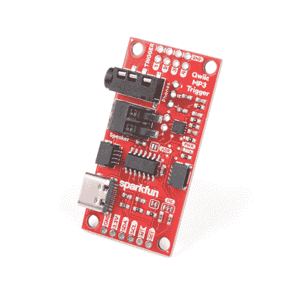](https://www.sparkfun.com/products/19030) 

### [SparkFun Qwiic MP3 触发器](https://www.sparkfun.com/products/19030)

[Out of stock](https://learn.sparkfun.com/static/bubbles/ "out of stock") DEV-19030

SparkFun Qwiic MP3 触发器满足了播放声音文件的所有必要要求，您需要做的只是选择…

2[Favorited Favorite](# "Add to favorites") 11[Wish List](# "Add to wish list")

[https://www.youtube.com/embed/ahuEUC8uQ2k/?autohide=1&border=0&wmode=opaque&enablejsapi=1](https://www.youtube.com/embed/ahuEUC8uQ2k/?autohide=1&border=0&wmode=opaque&enablejsapi=1)

### 所需材料

Qwiic MP3 触发器确实需要一些额外的项目来帮助您开始使用，如下所示。但是，您可能已经有了一些这样的物品，所以可以根据需要随意修改您的购物车。

[](https://www.sparkfun.com/products/14743) 

将**添加到您的[购物车](https://www.sparkfun.com/cart)中！**

### [USB 3.1 线 A 到 C - 3 脚](https://www.sparkfun.com/products/14743)

[In stock](https://learn.sparkfun.com/static/bubbles/ "in stock") CAB-14743

USB C 棒极了。但是，在我们将所有的集线器、充电器和端口转换为 USB C 之前，这是您要使用的电缆…

$5.504[Favorited Favorite](# "Add to favorites") 9[Wish List](# "Add to wish list")****[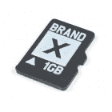](https://www.sparkfun.com/products/15107) 

将**添加到您的[购物车](https://www.sparkfun.com/cart)中！**

### [microSD 卡-1GB(4 类)](https://www.sparkfun.com/products/15107)

[In stock](https://learn.sparkfun.com/static/bubbles/ "in stock") COM-15107

当你只需要一张基本的 SD 卡时，这张卡就适合你了。1GB 的容量足以存储 MP3 或日志环境…

$5.50[Favorited Favorite](# "Add to favorites") 6[Wish List](# "Add to wish list")****[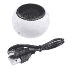](https://www.sparkfun.com/products/14023) 

将**添加到您的[购物车](https://www.sparkfun.com/cart)中！**

### [汉堡迷你音箱](https://www.sparkfun.com/products/14023)

[In stock](https://learn.sparkfun.com/static/bubbles/ "in stock") COM-14023

这对你的耳朵将是一种享受！汉堡包迷你扬声器是一个 3W 的经济扬声器选项，适用于任何需要标准扬声器的项目

$5.502[Favorited Favorite](# "Add to favorites") 20[Wish List](# "Add to wish list")****[](https://www.sparkfun.com/products/11456) 

将**添加到您的[购物车](https://www.sparkfun.com/cart)中！**

### [USB 壁式充电器- 5V，1A(黑色)](https://www.sparkfun.com/products/11456)

[In stock](https://learn.sparkfun.com/static/bubbles/ "in stock") TOL-11456

近来，USB 越来越多地被作为一种电源连接标准来实现，但是你并不总是在 han 上有一台计算机…

$4.502[Favorited Favorite](# "Add to favorites") 10[Wish List](# "Add to wish list")******************Note:** If you want to add hardware connections for the triggers, you will probably some [soldering equipment](https://www.sparkfun.com/categories/49), [hook-up wire](https://www.sparkfun.com/search/results?term=hook-up+wire), and some [momentary buttons](https://www.sparkfun.com/categories/313). Additionally, if you wish to interface with the board using a microcontroller, you should also grab a [RedBoard Qwiic](https://www.sparkfun.com/products/15123) and some [Qwiic cables](https://www.sparkfun.com/products/15081).

### 推荐阅读

如果你对开关、跳线垫或 I ² C 不熟悉，一定要去看看这些基础教程。

[](https://learn.sparkfun.com/tutorials/logic-levels) [### 逻辑电平](https://learn.sparkfun.com/tutorials/logic-levels) Learn the difference between 3.3V and 5V devices and logic levels.[Favorited Favorite](# "Add to favorites") 82[](https://learn.sparkfun.com/tutorials/button-and-switch-basics) [### 按钮和开关基础知识](https://learn.sparkfun.com/tutorials/button-and-switch-basics) A tutorial on electronics' most overlooked and underappreciated component: the switch! Here we explain the difference between momentary and maintained switches and what all those acronyms (NO, NC, SPDT, SPST, ...) stand for.[Favorited Favorite](# "Add to favorites") 53[](https://learn.sparkfun.com/tutorials/i2c) [### I2C](https://learn.sparkfun.com/tutorials/i2c) An introduction to I2C, one of the main embedded communications protocols in use today.[Favorited Favorite](# "Add to favorites") 128[](https://learn.sparkfun.com/tutorials/how-to-work-with-jumper-pads-and-pcb-traces) [### 如何使用跳线焊盘和 PCB 走线](https://learn.sparkfun.com/tutorials/how-to-work-with-jumper-pads-and-pcb-traces) Handling PCB jumper pads and traces is an essential skill. Learn how to cut a PCB trace, add a solder jumper between pads to reroute connections, and repair a trace with the green wire method if a trace is damaged.[Favorited Favorite](# "Add to favorites") 11[](https://www.sparkfun.com/qwiic)

qw IC 键盘利用[qw IC 连接系统](https://www.sparkfun.com/qwiic)。我们建议在使用之前熟悉一下**逻辑电平**和 **I ² C** 教程(如上)。点击上面的横幅，了解有关我们的 [Qwiic 产品](https://www.sparkfun.com/categories/399)的更多信息。

[https://www.youtube.com/embed/x0RDEHqFIF8/?autohide=1&border=0&wmode=opaque&enablejsapi=1](https://www.youtube.com/embed/x0RDEHqFIF8/?autohide=1&border=0&wmode=opaque&enablejsapi=1)

## 硬件概述

### 电特性

Qwiic MP3 触发器设计为在 **3.3V** 下工作，并且不得在 **3.6V** 以上供电，因为这是 microSD 卡的最大工作电压。来自 USB C 连接器的 **5V** 电源连接到一个强大的 AP2112 3.3V 电压调节器，该调节器可为电路板提供高达 **600mA** 的电源。否则，电路板也可以通过 Qwiic 连接器供电。

#### 最大工作电压

所有 I/O 引脚都可以承受 **5V** 电压，但电路板必须以 **3.3V** 供电。

#### 推荐工作电压

所有 I/O 引脚都设计为在 **3.3V** 下工作。板卡在待机状态下消耗 **35mA** ，在最大音量下驱动 **8 欧姆**扬声器时消耗 **400mA** 以上。

**Note:** The Qwiic MP3 Trigger can be powered through either the USB C cable or the Qwiic connector when used in conjunction with the [RedBoard Qwiic](https://www.sparkfun.com/products/15123). However, when using the Qwiic connection make sure that the **3.3V** line can source enough current for the amplifier.

### MP3 和 ATtiny84

Qwiic MP3 触发器的核心是 [WT2003S MP3 解码器 IC](https://cdn.sparkfun.com/assets/7/c/0/c/6/WT2003S-16S_Chip_V1.03.pdf) 。该 IC 从 microSD 卡读取 MP3，如果检测到 USB，将自动安装 SD 卡作为跳跃驱动器。 [ATtiny84A](https://cdn.sparkfun.com/datasheets/Widgets/doc8006.pdf) 接收 I ² C 命令并控制 MP3 解码器。

[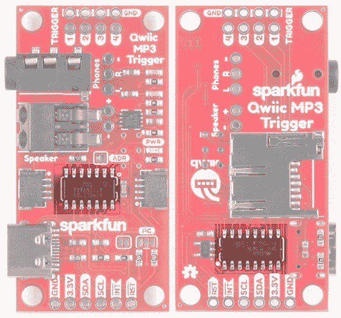](https://cdn.sparkfun.com/assets/learn_tutorials/8/5/9/SparkFun_Qwiic_MP3_Trigger_-_ATtiny84A_WT2003S.jpg)

### SD 和 USB

SparkFun Qwiic MP3 触发器适用于 FAT32 格式的 512MB 至 32GB 卡。我们推荐 [SparkFun 1GB MicroSD 卡](https://www.sparkfun.com/products/15107)，因为它很好地结合了 MP3 播放的低成本和高性能。Qwiic MP3 触发器最多可加载 255 首歌曲。

[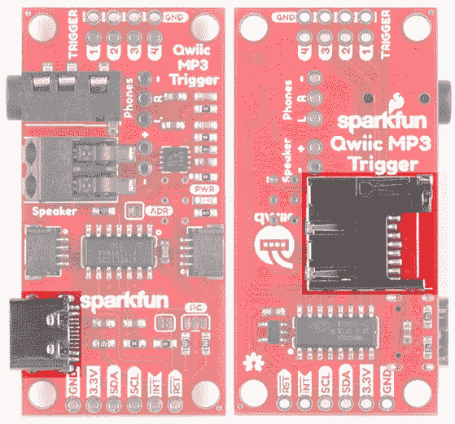](https://cdn.sparkfun.com/assets/learn_tutorials/8/5/9/SparkFun_Qwiic_MP3_Trigger_-_USB_microSD.jpg)

在 Qwiic MP3 触发器上添加和移除 MP3 的最简单方法是连接 USB C 线。这将把 microSD 卡枚举为一个跳跃驱动器，使得访问卡上的文件变得极其容易。或者，如果您不想使用 USB，您可以弹出 microSD 卡，并使用普通的 [USB SD 适配器](https://www.sparkfun.com/products/13004)对其进行读写。

**Troubleshooting Tip:** While USB is connected to a computer, MP3 playing is disabled. However, as long as D+/D- are not connected, you can power the board over USB from a [USB wall adapter](https://www.sparkfun.com/products/11456) or power bank and still use the Qwiic MP3 Trigger normally.**Note:** If you are moving just a few MP3 files, the USB C cable will work perfectly fine. However, if you need to move large amounts of data to the SD card, we suggest a normal [USB SD adapter](https://www.sparkfun.com/products/13004). The write speed to the SD card through a USB C cable is slower than a few MBs per second.

### Qwiic 连接器

SparkFun 的 Qwiic MP3 触发器包括两个 Qwiic 连接器，可以将这款音乐播放器与各种 I ² C 设备进行菊花链连接。为你的下一个项目结帐 [Qwiic](https://www.sparkfun.com/qwiic) 。

[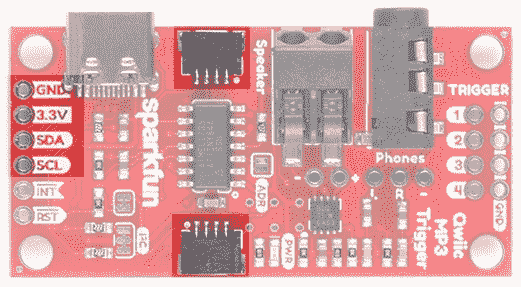](https://cdn.sparkfun.com/assets/learn_tutorials/8/5/9/SparkFun_Qwiic_MP3_Trigger_-_I2C_Ports_2_.jpg)

电路板上的 I ² C 引脚直接连接到 Qwiic 连接器。

### 音频放大器

扬声器由一个能够输出高达 **1.4W** 的**D 类单声道放大器**放大。1.4W 是什么意思？声音大得令人难以置信；非常有助于确保您的机甲效果能够在*con 会场听到(例如 _Comic_ - con、_Def_ - con 等)。)而且很适合惹恼你的同事。两个输出都有由`SET_VOLUME`命令控制的音量，可在 32 个级别之间选择。此外，如果首选焊接连接，则两个连接器旁边都有 PTH 孔。

[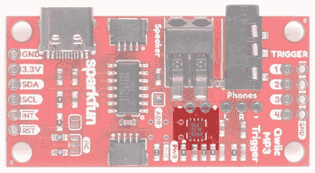](https://cdn.sparkfun.com/assets/learn_tutorials/8/5/9/SparkFun_Qwiic_MP3_Trigger_-_Class_D_Amp_2_.jpg)**Note:** The volume can be adjusted in software using the **SET_VOLUME** `0x07` command (see *Command Set* section). The volume setting is saved to NVM (non-volatile memory) and loaded at power on.

### 音频输出

提供了一个标准的 3.5 毫米音频插孔，便于通过耳机或放大的桌面扬声器(如我们的[汉堡扬声器](https://www.sparkfun.com/products/14023)或任何其他放大器)播放您的音乐。

[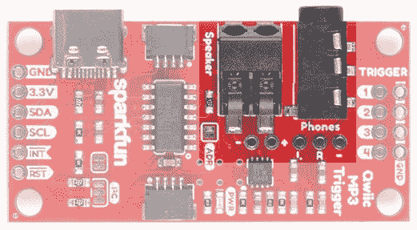](https://cdn.sparkfun.com/assets/learn_tutorials/8/5/9/SparkFun_Qwiic_MP3_Trigger_-_Audio_Connectors_2_.jpg)

标有**扬声器**的 poke-home 连接器也与 3.5 毫米插孔平行。这是一种摩擦配合型连接器；只需将绞合或实芯电线( **22AWG** 或更大)推入孔中，连接器就会夹住电线。

要使用[外部扬声器](https://www.sparkfun.com/products/9151)，将两根电线焊接到扬声器上，并将电线插入 poke home 连接器。

[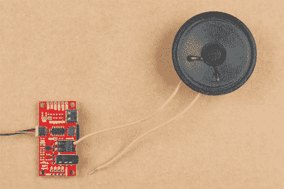](https://cdn.sparkfun.com/assets/learn_tutorials/8/5/9/Qwiic_MP3_Trigger_Tutorial-01.jpg)*Wire inserted into the poke home connector.*

要移除，用圆珠笔按下标签上的*并轻轻拉动电线。*

[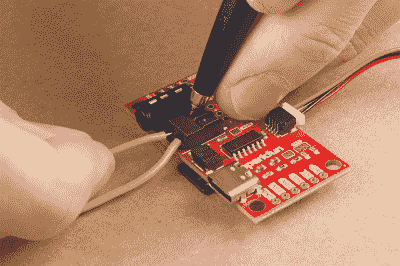](https://cdn.sparkfun.com/assets/learn_tutorials/8/5/9/Qwiic_MP3_Trigger_Tutorial-03.jpg)*Using pen to remove wire from poke home connector.*

### 针织套衫

Qwiic MP3 触发器有三个跳线，如下所示:

[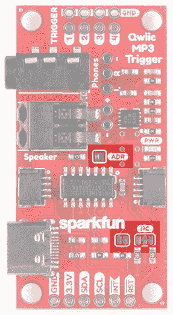](https://cdn.sparkfun.com/assets/learn_tutorials/8/5/9/SparkFun_Qwiic_MP3_Trigger_-_Jumpers.jpg)

Qwiic MP3 触发器的默认 7 位 I ² C 地址为`0x37`。默认情况下， **ADR** 跳线是断开的，可以用焊料闭合，以强制器件的 I ² C 地址到`0x36`。如果您需要在同一总线上有两个触发器，这是很方便的。如果总线上需要两个以上的设备，或者如果这些地址与另一个 I ² C 设备冲突，可以在软件中更改地址。请参见[命令集](https://learn.sparkfun.com/tutorials/qwiic-mp3-trigger-hookup-guide#command-set)。

**Troubleshooting Tip:** Closing the **ADR** jumper forces the device to I²C address 0x36 regardless what the user may have set via the SET_ADDRESS command.

切断 **I ² C** 跳线将从 I ² C 总线上移除 2.2k 欧姆电阻。如果您的 I ² C 总线上有许多设备，您可能需要移除这些跳线。不知道怎么剪跳线？[看这里！](https://learn.sparkfun.com/tutorials/how-to-work-w-jumper-pads-and-pcb-traces/cutting-a-trace-between-jumper-pads)

**INT** 跳线位于 SparkFun 徽标下方，将一个 10K 上拉电阻连接到 INT 引脚。如果有多个开漏中断引脚连接在一起，您可能需要消除此上拉电阻，以便更好地控制上拉电阻。

### I/O 引脚

板上有几个 I/O 引脚，如下表所示。

[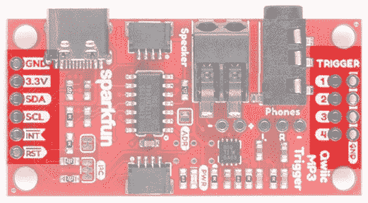](https://cdn.sparkfun.com/assets/learn_tutorials/8/5/9/SparkFun_Qwiic_MP3_Trigger_-_Pins_2_.jpg)

| Pin 名称 | 类型 | 描述 |
| 英特尔的快速储存技术 | 投入 | 低电平有效。拉低此引脚可复位 ATtiny84A，从而有效复位 Qwiic MP3 触发器。 |
| （同 Internationalorganizations）国际组织 | 输出 | 低电平有效。曲目播放完毕后变为低电平。发出 CLEAR_INTERRUPTS 命令时，再次变为高电平。 |
| SCL | 投入 | I ² C 接口的串行时钟线。Qwiic MP3 触发器确实实现了时钟伸展，如果它不能接收额外的 I ² C 数据，它将保持时钟线为低电平。 |
| 国家药品监督管理局 | 输入/输出 | I ² C 接口的串行数据线。 |
| 3.3V | 力量 | Qwiic MP3 触发器可以从 **2.8V** 到 **3.3V** 供电。任何大于 **3.6V** 的电压都会损坏 microSD 卡。 |
| GND | 力量 | 接地引脚。 |
| 触发器 1-4 | 投入 | 当触发引脚被拉至地电位时，相应的 T00X.mp3 文件就会播放。引脚可以组合播放 T001 到 T010。引脚可以承受 5V 电压。 |

#### 扳机

在电路板的顶部有四个触发针。拉低时，这些引脚开始播放名为`T001.mp3`到`T010.mp3`的任何文件。例如，如果您在**引脚 3** 和 **GND** 上附加一个瞬时按钮，当您按下该按钮时，`T003.mp3`文件将立即播放。这允许你不用*任何*编程，只需轻触一个按钮就可以开始播放音效！

[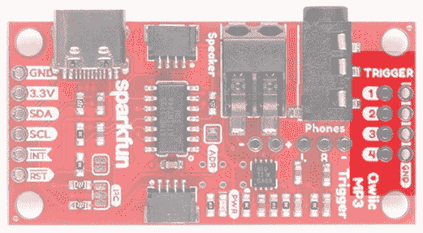](https://cdn.sparkfun.com/assets/learn_tutorials/8/5/9/SparkFun_Qwiic_MP3_Trigger_-_Trigger_Pins_2_.jpg)

##### 单次触发

对于基本的触发设置，在 microSD 卡上加载四个名为 *T001.mp3* 、 *T002.mp3* 、 *T003.mp3* 和 *T004.mp3* 的文件。使用导线或按钮将触发引脚接地，相关曲目将开始播放。一旦设置工作，使用任何[瞬时按钮](https://www.sparkfun.com/categories/313)允许用户使 MP3 开始播放。

##### 使用多个触发器

通过同时拉下多个引脚，四个触发器可以播放多达十首曲目:T001 至 T010。当检测到触发 pin 时，pin 值被加在一起。例如，同时拉低引脚 **2** 和 **4** 将播放曲目`T006.mp3`，同时拉低引脚 **1** 、 **2** 和 **3** 也将播放曲目`T006.mp3`。

**Note:**

*   触发引脚被持续监控，引脚的任何变化都会立即导致新曲目开始播放。
*   无限期地将引脚保持在低电平会导致同一曲目再次播放。这允许循环音效。

#### 中断引脚

Qwiic MP3 触发器有一个 **INT 引脚**，该引脚配置为开漏引脚，带有片上 10K 欧姆上拉电阻。

[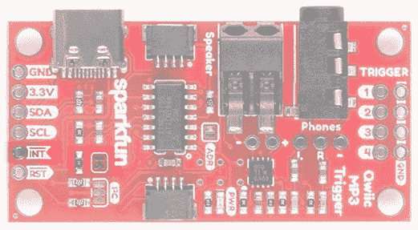](https://cdn.sparkfun.com/assets/learn_tutorials/8/5/9/SparkFun_Qwiic_MP3_Trigger_-_INT_Jumper_2_.jpg)

当曲目停止播放时， **INT 引脚**将变为低电平。一旦接收到 **CLEAR_INTERRUPTS** `0x0D`命令， **INT 引脚**将变为高阻态，并将返回高电平。

如果您有多个带总线中断引脚的器件，您可能想要切断 **INT 跳线**以移除 10K 上拉电阻。

## Qwiic MP3 触发器库

**Note:** This section assumes you are using the latest version of the Arduino IDE on your desktop. If this is your first time using Arduino, please review our tutorial on [installing the Arduino IDE.](https://learn.sparkfun.com/tutorials/installing-arduino-ide) If you have not previously installed an Arduino library, please check out our [installation guide.](https://learn.sparkfun.com/tutorials/installing-an-arduino-library)

SparkFun Qwiic MP3 触发器 Arduino 库演示了如何控制 Qwiic MP3 触发器的所有功能。我们建议通过搜索“ **SparkFun MP3 触发器**”通过 Arduino 库管理器下载 SparkFun 库。或者，你可以从 [GitHub 库](https://github.com/sparkfun/SparkFun_Qwiic_MP3_Trigger_Arduino_Library)获取压缩文件:

[SparkFun Qwiic MP3 Trigger Arduino Library (ZIP)](https://github.com/sparkfun/SparkFun_Qwiic_MP3_Trigger_Arduino_Library/archive/master.zip)

一旦你安装了库，就可以检查各种例子。

*   **例 1:** 播放 microSD 卡上的第一首 MP3 曲目。
*   **例 2:** 播放 microSD 卡上的下一首曲目。
*   **例 3:** 播放一个特定的文件。比如`mp3.playFile(3);`会播放 F003.mp3。
*   **示例 4:** 停止和暂停曲目。
*   **示例 5:** 厨房水槽示例，显示音量设置、均衡器、获取歌曲名称、获取歌曲计数、获取固件版本等。
*   **例 6:** 更改 MP3 触发器的 I ² C 地址。允许多个触发器存在于同一 I ² C 总线上。
*   **示例 7:** 显示了如何使用不同的有线端口(例如 Wire1)启动库。
*   **示例 8:** 演示了如何检查歌曲结束中断并重新开始播放歌曲。

## 指挥台

SparkFun Qwiic MP3 触发器库会为您处理所有这些命令。但是，如果您想实现自己的接口，可以使用以下命令(参见下面的列表)。Qwiic MP3 触发器使用标准 I ² C 通信来接收命令和发送响应。Qwiic MP3 触发器的 ***未移位* I ² C 地址**默认为`0x37`。**写**字节为`0x6E`，而**读**字节为`0x6F`。

下面是一个示例 I ² C 事务，显示如何将音量设置为 10:

[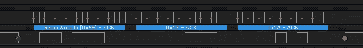](https://cdn.sparkfun.com/assets/learn_tutorials/8/5/9/SparkFun_Qwiic_MP3_Trigger_-_Set_Volume.jpg)

下面是一个示例 I ² C 事务，显示了如何读取设备 ID (0x39):

[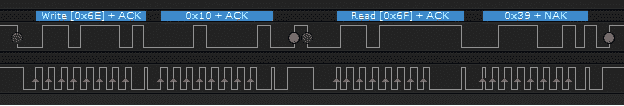](https://cdn.sparkfun.com/assets/learn_tutorials/8/5/9/SparkFun_Qwiic_MP3_Trigger_-_Read_ID.jpg)

以下命令可用:

*   **停止** `0x00` -停止任何当前播放的曲目
*   **PLAY_TRACK** `0x01 [TRACKNUMBER]` -播放给定的曲目号。例如，0x01 0x0A 将播放根目录中的第 10 个 MP3 文件。
*   **PLAY_FILENUMBER** `0x02 [FILENUMBER]` -从根目录播放一个文件号。例如，0x02 0x03 将播放 F003.mp3。
*   **暂停** `0x03` -播放时暂停，暂停时开始播放
*   **播放 _ 下一个** `0x04` -播放位于根目录下的下一个文件(下一首曲目)
*   **PLAY_PREVIOUS** `0x05` -播放位于根目录下的上一个文件(上一首曲目)
*   **SET_EQ** `0x06 [EQ_SETTING]` -将均衡水平设置为 6 种设置之一:0 =正常，1 =流行，2 =摇滚，3 =爵士，4 =古典，5 =低音。设置存储在 NVM 中，并在每次上电时加载。
*   **SET_VOLUME** `0x07 [VOLUME_LEVEL]` -将音量设置为 32 种设置之一:0 =关，31 =最大音量。设置存储在 NVM 中，并在每次上电时加载。
*   **GET_SONG_COUNT** `0x08` -返回一个字节，代表在 microSD 卡上找到的 MP3 的数量。最高 255。注:歌曲计数是在开机时建立的。通过 USB 将文件加载到 SD 卡后，请确保重启主板以更新该值。
*   **GET_SONG_NAME** `0x09` -返回当前正在播放的文件的前 8 个字符。一旦发出命令，MP3 触发器必须有 50 毫秒的时间来获取歌曲名称，然后才能用 I ² C read 查询。
*   **GET_PLAY_STATUS** `0x0A` -返回一个表示 MP3 播放器状态的字节。0 =正常，1 =失败，2 =没有这样的文件，5 = SD 错误。
*   **GET _ CARD _ STATUS**`0x0B`——返回一个表示卡状态的字节。0 =正常，5 =标清错误。一旦发出命令，MP3 触发器必须有 50 毫秒的时间来获取卡的状态，然后才能使用 I ² C read 进行查询。
*   **GET _ VERSION**`0x0C`——返回两个字节，表示主要和次要固件版本。
*   **清除 _ 中断** `0x0D` -清除中断位。
*   **GET _ VOLUME**`0x0E`——返回代表音量级别的字节。
*   **GET_EQ** `0x0F` -返回代表 EQ 设置的字节。
*   **GET_ID** `0x10` -返回 0x39。对于测试给定 I ² C 地址的设备是否确实是 MP3 触发器非常有用。
*   **SET_ADDRESS** `0xC7 [NEW_ADDRESS]` -设置 Qwiic MP3 触发器的 I ² C 地址。例如，`0x6E 0xC7 0x21`会将 I ² C 地址 0x37 的 MP3 触发器更改为地址 0x21。在本例中，`0x6E`是写位设置为 1 的设备地址`0x37`。有效地址包括 0x08 至 0x77。设置存储在 NVM 中，并在每次上电时加载。

### 命令 Que

ATtiny84A 通过 I ² C 接收命令，然后将 I ² C 命令记录到命令 que 中。que 以 9600bps 的速率通过 FIFO 串行发送到 WT2003S。然后，WT2003S 需要一段不确定的时间来响应。这意味着 Qwiic MP3 触发器不会立即执行命令，一些命令可能需要一定的时间，Qwiic MP3 触发器才会加载有效响应。

[](https://cdn.sparkfun.com/assets/learn_tutorials/8/5/9/SparkFun_Qwiic_MP3_Trigger_-_Get_Song_Name2.jpg)*An Example GET_SONG_NAME. Do you know the answer?*

例如，`GET_SONG_NAME`可以由主微控制器向 Qwiic MP3 触发器发出。QMP3 然后向 WT2003S 发送一个串行命令。经过一段时间后(不幸的是, [WT2003S 数据表](https://cdn.sparkfun.com/assets/learn_tutorials/8/5/9/WT2003S-16S_Chip_V1.03.pdf)没有定义最大时间), WT2003S 将通过串行响应。这可能需要 **15 到 40 毫秒**。此时，歌曲名称将被加载到 Qwiic MP3 触发器上，并可由主微控制器通过 I ² C 读取。

为了避免时钟被 Qwiic MP3 触发器拉长并占用 I ² C 总线，Qwiic MP3 触发器将在收到每个命令后释放总线。因此，由用户决定在`WRITE GET_SONG_NAME`和`READ` I ² C 命令之间等待最短**50 毫秒**。

### 通电时间

Qwiic MP3 触发器上的 MP3 解码器 IC 是 WT2003S。上电后大约需要 **1500ms** 来安装 SD 卡。通常情况下，Qwiic MP3 触发器在用户书写和重写草图时通电，因此用户不会注意到这个启动时间。引导时间仅在用户最初启动他们的项目时生效。主控制器(如 Uno)在放弃与 Qwiic MP3 触发器的通信之前需要等待多达 **2 秒**。SparkFun Qwiic MP3 触发器库负责 **2 秒等待**，但是如果您正在编写自己的实现，那么请考虑下面的示例代码:

```
language:c
if (isConnected() == false)
{
    delay(2000); //Device may take up to 1500ms to mount the SD card

    //Try again
    if (isConnected() == false)
        return (false); //No device detected
}
return (true); //We're all setup! 
```

### 最大歌曲数

多达 255 首歌曲可以加载到 Qwiic MP3 触发器上，并通过命令界面触发。

## 示例 1:播放音轨 1

Qwiic MP3 触发器既可以作为独立电路板使用，也可以与 Qwiic connect 系统一起使用。在这种情况下，我们将使用[red board qw IC](https://www.sparkfun.com/products/15123)作为 qw IC 系统中的微控制器。

对于这两个选项，请确保将标记为`T001.mp3`的 MP3 文件加载到 MicroSD 卡上。

**Heads up!** Make sure to follow the same format to label each track when including more than one audio file. Otherwise, you associated audio file will not begin playing with the trigger pin. For example, if you were including a second track, make sure to label it as `T002.mp3` to associate it with **Trigger Pin 2**.

### 独立:使用触发器 1

默认情况下，安装在 ATtiny84 上的固件允许您使用触发器播放曲目。更多详情，参见**硬件概述**的*触发器*部分。只需插上 SD 卡，给 Qwiic MP3 触发器上电，将**触发引脚 1** 短接到 **GND** 。每次你短接两个球瓶，`T001.mp3`就会开始。

[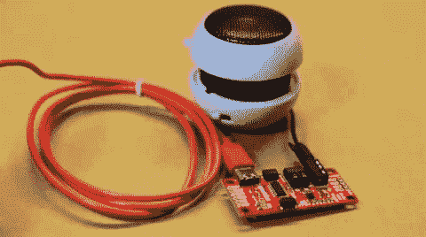](https://cdn.sparkfun.com/assets/learn_tutorials/8/5/9/Example_1.jpg)*Triggering the first track to play by shorting **Trigger 1** with a pair tweezers. **Click** on image for a closer view of the hardware setup.*

### Arduino 库:使用 RedBoard Qwiic

将 SD 卡插入 MP3 触发器。然后，使用[qw IC 线缆](https://www.sparkfun.com/products/15081)将 Qwiic MP3 触发器连接到[red board qw IC](https://www.sparkfun.com/products/15123)上。

[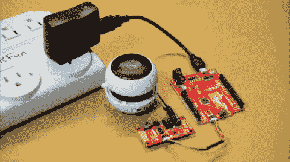](https://cdn.sparkfun.com/assets/learn_tutorials/8/5/9/Example_2.jpg)*Triggering the first track to play through the Qwiic connection. **Click** on image for a closer view of the hardware setup.*

使用 Arduino IDE 将`Example1-PlaySong.ino`上传到 RedBoard Qwiic。一旦上传，RedBoard 将检查 Qwiic MP3 触发器，将音量设置为 10，然后播放`T001.mp3`。按下红板上的**复位**按钮将再次运行草图。

## 资源和更进一步

尽情享受您的新音乐制作工具吧！

有关 Qwiic MP3 触发器的更多信息，请查看以下链接:

*   [示意图(PDF)](https://cdn.sparkfun.com/assets/2/8/c/1/0/SparkFun_Qwiic_MP3_Trigger.pdf)
*   [老鹰文件(ZIP)](https://cdn.sparkfun.com/assets/b/5/a/e/2/SparkFun_Qwiic_MP3_Trigger.zip)
*   [WT2003S 数据表(PDF)](https://cdn.sparkfun.com/assets/7/c/0/c/6/WT2003S-16S_Chip_V1.03.pdf)
*   [Qwiic 登陆页面](https://www.sparkfun.com/qwiic)
*   [SparkFun Qwiic MP3 触发器 Arduino 库](https://github.com/sparkfun/SparkFun_Qwiic_MP3_Trigger_Arduino_Library)
*   [示例草图(ZIP)](https://cdn.sparkfun.com/assets/d/d/e/a/1/Qwiic_MP3_Trigger_Examples.zip)
*   [Qwiic MP3 触发回购](https://github.com/sparkfun/Qwiic_MP3_Trigger)
*   [SFE 产品展示区](https://youtu.be/ahuEUC8uQ2k)

需要一些灵感吗？查看一些相关教程:

[](https://learn.sparkfun.com/tutorials/mp3-player-shield-music-box) [### MP3 播放器屏蔽音乐盒](https://learn.sparkfun.com/tutorials/mp3-player-shield-music-box) Music Box Project based on the Dr. Who TARDIS.[Favorited Favorite](# "Add to favorites") 8[](https://learn.sparkfun.com/tutorials/sound-page-guide) [### 有声页面指南](https://learn.sparkfun.com/tutorials/sound-page-guide) How to use the Lilypad MP3 Player and some Bare Conductive Paint to make a fandom silhouette sound trigger page.[Favorited Favorite](# "Add to favorites") 13[](https://learn.sparkfun.com/tutorials/photon-battery-shield-hookup-guide) [### 光子电池屏蔽连接指南](https://learn.sparkfun.com/tutorials/photon-battery-shield-hookup-guide) The Photon Battery Shield has everything your Photon needs to run off, charge, and monitor a LiPo battery. Read through this hookup guide to get started using it.[Favorited Favorite](# "Add to favorites") 11

查看其他 Qwiic 教程:

[](https://learn.sparkfun.com/tutorials/real-time-clock-module---rv-8803-qwiic-hookup-guide) [### 实时时钟模块- RV-8803 (Qwiic)连接指南](https://learn.sparkfun.com/tutorials/real-time-clock-module---rv-8803-qwiic-hookup-guide) A Hookup Guide for the SparkFun Real Time Clock Module - RV-8803 (Qwiic). Learn how to integrate the RV-8803 into your next time-keeping project.[Favorited Favorite](# "Add to favorites") 2[](https://learn.sparkfun.com/tutorials/micromod-all-the-pins-atp-carrier-board) [### 微模压所有引脚(ATP)载板](https://learn.sparkfun.com/tutorials/micromod-all-the-pins-atp-carrier-board) Access All The Pins (ATP) of the MicroMod Processor Board with the Carrier Board 0[](https://learn.sparkfun.com/tutorials/sound-location-with-the-qwiic-sound-trigger-and-the-u-blox-zed-f9x) [### 使用 Qwiic 声音触发器和 u-blox ZED-F9x 进行声音定位](https://learn.sparkfun.com/tutorials/sound-location-with-the-qwiic-sound-trigger-and-the-u-blox-zed-f9x) [Favorited Favorite](# "Add to favorites") 2[](https://learn.sparkfun.com/tutorials/getting-started-with-machinechat) [### machinecat 入门](https://learn.sparkfun.com/tutorials/getting-started-with-machinechat) Organize and display your data with SparkFun's Artemis OpenLog and MachineChat's JEDIOne 0

或者看看这些博客帖子:

[](https://www.sparkfun.com/news/2700 "July 12, 2018: Here at SparkFun, we love our dogs. When we searched deep in our dog-loving hearts, we found one true question: What if they could talk? ") [### 今日英语:挖衣领

July 12, 2018](https://www.sparkfun.com/news/2700 "July 12, 2018: Here at SparkFun, we love our dogs. When we searched deep in our dog-loving hearts, we found one true question: What if they could talk? ")[Favorited Favorite](# "Add to favorites") 4[](https://www.sparkfun.com/news/2873 "February 19, 2019: A beginner project utilizing the SparkFun Qwiic MP3 Trigger for two tired kiddos!") [### MP3 音乐盒

February 19, 2019](https://www.sparkfun.com/news/2873 "February 19, 2019: A beginner project utilizing the SparkFun Qwiic MP3 Trigger for two tired kiddos!")[Favorited Favorite](# "Add to favorites") 0[](https://www.sparkfun.com/news/2901 "April 4, 2019: Check out this Qwiic-based jukebox using Qwiic RFID and Qwiic MP3\. Follow along with the video and hookup guide to build your own!") [### 今日英语:Qwiic 点唱机

April 4, 2019](https://www.sparkfun.com/news/2901 "April 4, 2019: Check out this Qwiic-based jukebox using Qwiic RFID and Qwiic MP3\. Follow along with the video and hookup guide to build your own!")[Favorited Favorite](# "Add to favorites") 0[](https://www.sparkfun.com/news/2961 "August 8, 2019: New LulzBot + new car = new project") [### 今日英语:3D 打印的哈利·波特会说话的头

August 8, 2019](https://www.sparkfun.com/news/2961 "August 8, 2019: New LulzBot + new car = new project")[Favorited Favorite](# "Add to favorites") 1[](https://www.sparkfun.com/news/3344 "August 5, 2020: Marcus demonstrates how the Qwiic System makes it super easy to build a novelty sound maker with a capacitive touch interface.") [### 我如何用 Qwiic 系统构建 Cap Touch 声卡

August 5, 2020](https://www.sparkfun.com/news/3344 "August 5, 2020: Marcus demonstrates how the Qwiic System makes it super easy to build a novelty sound maker with a capacitive touch interface.")[Favorited Favorite](# "Add to favorites") 1********