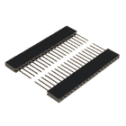
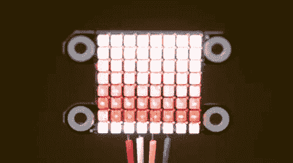
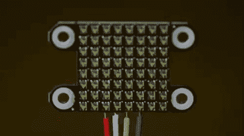

# LuMini 8x8 矩阵连接指南

> 原文：<https://learn.sparkfun.com/tutorials/lumini-8x8-matrix-hookup-guide>

## 介绍

LuMini 8x8 矩阵是一种很好的方式，可以为任何东西添加正方形的光线，甚至可以制作定制形状的屏幕。LuMini 产品线使用的 LED 与我们在 [Lumenati](https://www.sparkfun.com/categories/405) 板上使用的相同，即 [APA102](https://www.sparkfun.com/categories/tags/apa102) ，只是封装尺寸更小，为 2.0x2.0 mm。这允许难以置信的紧密像素密度，因此，屏幕像素较少。LuMini 矩阵将 64 个 led 封装在一个微不足道的平方英寸内！

[](https://www.sparkfun.com/products/15047) 

将**添加到您的[购物车](https://www.sparkfun.com/cart)中！**

 **### [](https://www.sparkfun.com/products/15047)

[Out of stock](https://learn.sparkfun.com/static/bubbles/ "out of stock") COM-15047

8x8 SparkFun LuMini LED 矩阵，包含 64 个可单独寻址的 LEDS，每个能够产生 1600 万种颜色…

$27.951[Favorited Favorite](# "Add to favorites") 11[Wish List](# "Add to wish list")** **[https://www.youtube.com/embed/ahuEUC8uQ2k/?autohide=1&border=0&wmode=opaque&enablejsapi=1](https://www.youtube.com/embed/ahuEUC8uQ2k/?autohide=1&border=0&wmode=opaque&enablejsapi=1)

在本教程中，我们将介绍如何将 LuMini 矩阵连接到更多的 LuMini 矩阵以及其他基于 APA102 的产品。我们将看看如何在软件中绘制出一个灯光矩阵，这样我们就可以让我们的动画更有创意。当你把越来越多的灯串在一起时，我们会考虑一些事情，我们也会考虑一些简洁的照明模式，让你远离标准的彩虹模式(如果你有 1600 万种颜色，为什么要用 255 种)。

### 所需材料

要跟随本教程，您将需要以下材料。你可能不需要所有的东西，这取决于你拥有什么。将它添加到您的购物车，通读指南，并根据需要调整购物车。

#### 选择微控制器

你需要一个微控制器来控制一切，然而，当选择一个来控制一整吨的 led 时，有一些事情要考虑。第一件事是，虽然它们不需要在特定的时间运行，但 APA102 LEDs 可以非常非常快地传输数据*对于一个 LED， **20 MHz** 快！因此，您应该使用足够快的微控制器来利用这一功能。另一个考虑因素是 LED 框架占用的 RAM 量；尤其是，当你开始进入更高的 LED 计数。每个 LED 占用 RAM 中 3 字节的空间。这听起来不是很多，但如果你控制 5000 个 led，你可能需要比传统的 RedBoard 内存大一点的东西。下表列出了您可能开始遇到内存问题的指示灯数量。请记住，这些都是非常宽松的估计，并会根据声明的其他全局变量而减少。*

 *| **微控制器** | **最大 LED 数** | **时钟速度** |
| SparkFun 红板 | Six hundred | 16 兆赫 |
| Arduino Mega 2560 | Two thousand six hundred | 16 兆赫 |
| Pro Micro | Seven hundred | 16 兆赫 |
| SparkFun ESP8266 的东西 | Twenty-seven thousand | 160 兆赫 |
| SparkFun ESP32 东西(Plus) | Ninety-seven thousand | 160 兆赫或 240 兆赫 |
| 青少年 3.6 | Eighty-seven thousand | 180 兆赫(240 兆赫超频) |

在这种情况下，很容易选择 ESP32 或 Teensy 3.6，因为它们在时钟周期中有大量开销来运行动画的古怪计算。然而，如果你的项目不全是灯，你只是在项目上扔一个 LuMini 环作为指示器，那么功能不那么强大的微控制器就足够了。

以下是指向 ESP32 Thing、ESP32 Thing Plus 和 Teensy 3.6 的链接；否则，您可以查看我们目录中列出的其他微控制器:

[](https://www.sparkfun.com/products/13907) 

将**添加到您的[购物车](https://www.sparkfun.com/cart)中！**

 **### [SparkFun ESP32 东西](https://www.sparkfun.com/products/13907)

[In stock](https://learn.sparkfun.com/static/bubbles/ "in stock") DEV-13907

SparkFun ESP32 Thing 是 Espressif 的 ESP32 的综合开发平台，ESP32 是他们的超级充电版本…

$23.5069[Favorited Favorite](# "Add to favorites") 83[Wish List](# "Add to wish list")****[](https://www.sparkfun.com/products/14057) 

### [Teensy 3.6](https://www.sparkfun.com/products/14057)

[Out of stock](https://learn.sparkfun.com/static/bubbles/ "out of stock") DEV-14057

Teensy 3.6 更大，更快，能够进行更复杂的项目，特别是其板载微型 SD 卡端口和升级…

15[Favorited Favorite](# "Add to favorites") 39[Wish List](# "Add to wish list")[](https://www.sparkfun.com/products/retired/14689) 

### [spark fun Thing Plus-ESP32 WROOM](https://www.sparkfun.com/products/retired/14689)

[Retired](https://learn.sparkfun.com/static/bubbles/ "Retired") WRL-14689

SparkFun ESP32 Thing Plus 是开始使用 Espressif 物联网概念的下一步，同时还可以享受所有的便利设施

7 **Retired**[Favorited Favorite](# "Add to favorites") 16[Wish List](# "Add to wish list")** **如果您需要这些主板的标题，这里有这些产品的链接。(Teensy 3.6 有 24 个试验板引脚，因此您可以使用 4 个 photon 接头。ESP32 Thing Plus 具有羽毛状外形，因此您需要使用相应尺寸的割台或羽毛状可堆叠割台套件。)

[](https://www.sparkfun.com/products/14311) 

将**添加到您的[购物车](https://www.sparkfun.com/cart)中！**

 **### [【ESP32】东西可堆叠头组](https://www.sparkfun.com/products/14311)

[In stock](https://learn.sparkfun.com/static/bubbles/ "in stock") PRT-14311

这些接头是为了与 SparkFun ESP32 的东西连接到 ESP32 屏蔽板。

$1.75[Favorited Favorite](# "Add to favorites") 11[Wish List](# "Add to wish list")****[](https://www.sparkfun.com/products/15187) 

将**添加到您的[购物车](https://www.sparkfun.com/cart)中！**

 **### [羽毛可堆叠头套](https://www.sparkfun.com/products/15187)

[In stock](https://learn.sparkfun.com/static/bubbles/ "in stock") PRT-15187

这些可堆叠的接头可与[spark fun ESP32 Thing Plus](https://www . spark fun . com/products/14689)配合使用，以控制

$1.75[Favorited Favorite](# "Add to favorites") 4[Wish List](# "Add to wish list")****[](https://www.sparkfun.com/products/14322) 

将**添加到您的[购物车](https://www.sparkfun.com/cart)中！**

 **### [光子可堆叠接头- 12 针](https://www.sparkfun.com/products/14322)

[In stock](https://learn.sparkfun.com/static/bubbles/ "in stock") PRT-14322

这些可堆叠的头部可以与粒子光子和光子原盾板一起工作。每个标题增加了一个伟大的数据…

$0.75[Favorited Favorite](# "Add to favorites") 5[Wish List](# "Add to wish list")****** ******#### 选择电源

大多数情况下，您的 LED 安装会产生超过电路板处理能力的电流。根据亮度和动画，任何地方的 100-250 个 LED 对你的电路板的电压调节器来说都太多了，所以你应该找一个舒适的 5V 电源，它在小屋里有足够的瓦数供你所有的 LED 使用。这里有几个 5V 电源可供使用:

[](https://www.sparkfun.com/products/13831) 

将**添加到您的[购物车](https://www.sparkfun.com/cart)中！**

 **### [壁式适配器电源- 5.1V DC 2.5A (USB Micro-B)](https://www.sparkfun.com/products/13831)

[In stock](https://learn.sparkfun.com/static/bubbles/ "in stock") TOL-13831

这是一个高品质的开关“壁式”交流到 DC 5.1V 2500ma USB 微型 B 壁式电源，专为…

$8.9521[Favorited Favorite](# "Add to favorites") 47[Wish List](# "Add to wish list")****[](https://www.sparkfun.com/products/retired/14601) 

### [指 LED 开关电源-5v 直流，5A](https://www.sparkfun.com/products/retired/14601)

[Retired](https://learn.sparkfun.com/static/bubbles/ "Retired") TOL-14601

这是一款 40W 单输出开关电源，来自 Mean Well，专为 LED 应用而设计

**Retired**[Favorited Favorite](# "Add to favorites") 8[Wish List](# "Add to wish list")[](https://www.sparkfun.com/products/retired/14098) 

### [指井开关电源-5v 直流，20A](https://www.sparkfun.com/products/retired/14098)

[Retired](https://learn.sparkfun.com/static/bubbles/ "Retired") TOL-14098

这是一款来自 Mean Well 的 100W 单输出开关电源。这种电源非常可靠，能够输出很高的电压

**Retired**[Favorited Favorite](# "Add to favorites") 19[Wish List](# "Add to wish list")[](https://www.sparkfun.com/products/retired/14602) 

### [表示 LED 开关电源-5v 直流，8A 表示 ](https://www.sparkfun.com/products/retired/14602)

[Retired](https://learn.sparkfun.com/static/bubbles/ "Retired") TOL-14602

这是一款 40W 单输出开关电源，来自 Mean Well，专为 LED 应用而设计

1 **Retired**[Favorited Favorite](# "Add to favorites") 7[Wish List](# "Add to wish list")** **您可以通过将 LED 的数量乘以 60 mA (0.06 A)来估计所需的电源大小，60mA(0.06 A)是使 LED 全白运行所需的电流量。这一计算将为您提供您的 LED 可以消耗的最大功率。然而，在大多数情况下，这是对你最终实际消耗的电量的严重高估。与其计算最大电流消耗，我通常喜欢在[台式电源](https://www.sparkfun.com/products/9291)上测试我的完整安装，使用它将运行的最亮动画，然后增加 20%或 30%给自己一点回旋余地，如果我想在未来提高亮度的话。

#### 附加硬件

您可能还需要一些焊接设备和一个 4.7 F SMD 电容(603 封装)。该电容器将用于去耦电源。这将降低电力线中的高频噪声，并补偿由于设备开启和关闭引起的电流需求变化而导致的电压降。603 封装可能有点难焊接，一套好的镊子会有帮助。

[](https://www.sparkfun.com/products/11367) 

将**添加到您的[购物车](https://www.sparkfun.com/cart)中！**

 **### [](https://www.sparkfun.com/products/11367)

[In stock](https://learn.sparkfun.com/static/bubbles/ "in stock") PRT-11367

各种颜色的电线:你知道这是一个美丽的东西。六种不同颜色的硬纸板实芯焊丝…

$21.5037[Favorited Favorite](# "Add to favorites") 86[Wish List](# "Add to wish list")****[](https://www.sparkfun.com/products/14681) 

将**添加到您的[购物车](https://www.sparkfun.com/cart)中！**

 **### [SparkFun 初学者工具包](https://www.sparkfun.com/products/14681)

[Out of stock](https://learn.sparkfun.com/static/bubbles/ "out of stock") TOL-14681

这些工具非常适合那些需要一套坚实的工具来启动工作台的人！

$62.50[Favorited Favorite](# "Add to favorites") 14[Wish List](# "Add to wish list")****[](https://www.sparkfun.com/products/10602) 

将**添加到您的[购物车](https://www.sparkfun.com/cart)中！**

 **### [【镊子弯曲(ESD 安全)](https://www.sparkfun.com/products/10602)

[In stock](https://learn.sparkfun.com/static/bubbles/ "in stock") TOL-10602

你可以从我们种类繁多的镊子看出，我们 SparkFun 非常擅长拾取细小的东西。为了确保我们…

$4.507[Favorited Favorite](# "Add to favorites") 47[Wish List](# "Add to wish list")****[](https://www.sparkfun.com/products/retired/15169) 

### [电容器 4.7uF -贴片(10 片)](https://www.sparkfun.com/products/retired/15169)

[Retired](https://learn.sparkfun.com/static/bubbles/ "Retired") COM-15169

这是 10 个微型 4.7 F SMD 去耦电容。这些电容中的每一个都提供了 16V 的 DC 额定电压和一个电容…

**Retired**[Favorited Favorite](# "Add to favorites") 1[Wish List](# "Add to wish list")****** ******### 推荐阅读

如果您不熟悉以下概念，我们建议您在继续之前查看这些教程。

#### 发光二极管、灯和电源

[](https://learn.sparkfun.com/tutorials/light) [### 光](https://learn.sparkfun.com/tutorials/light) Light is a useful tool for the electrical engineer. Understanding how light relates to electronics is a fundamental skill for many projects.[Favorited Favorite](# "Add to favorites") 24[](https://learn.sparkfun.com/tutorials/how-to-power-a-project) [### 如何为项目提供动力](https://learn.sparkfun.com/tutorials/how-to-power-a-project) A tutorial to help figure out the power requirements of your project.[Favorited Favorite](# "Add to favorites") 67[](https://learn.sparkfun.com/tutorials/light-emitting-diodes-leds) [### 发光二极管](https://learn.sparkfun.com/tutorials/light-emitting-diodes-leds) Learn the basics about LEDs as well as some more advanced topics to help you calculate requirements for projects containing many LEDs.[Favorited Favorite](# "Add to favorites") 67[](https://learn.sparkfun.com/tutorials/electric-power) [### 电力](https://learn.sparkfun.com/tutorials/electric-power) An overview of electric power, the rate of energy transfer. We'll talk definition of power, watts, equations, and power ratings. 1.21 gigawatts of tutorial fun 54

#### 焊接基础

[](https://learn.sparkfun.com/tutorials/how-to-solder-through-hole-soldering) [### 如何焊接:通孔焊接](https://learn.sparkfun.com/tutorials/how-to-solder-through-hole-soldering) This tutorial covers everything you need to know about through-hole soldering.[Favorited Favorite](# "Add to favorites") 70[](https://learn.sparkfun.com/tutorials/how-to-solder-castellated-mounting-holes) [### 如何焊接:堞形安装孔](https://learn.sparkfun.com/tutorials/how-to-solder-castellated-mounting-holes) Tutorial showing how to solder castellated holes (or castellations). This might come in handy if you need to solder a module or PCB to another PCB. These castellations are becoming popular with integrated WiFi and Bluetooth modules.[Favorited Favorite](# "Add to favorites") 19[](https://learn.sparkfun.com/tutorials/how-to-work-with-jumper-pads-and-pcb-traces) [### 如何使用跳线焊盘和 PCB 走线](https://learn.sparkfun.com/tutorials/how-to-work-with-jumper-pads-and-pcb-traces) Handling PCB jumper pads and traces is an essential skill. Learn how to cut a PCB trace, add a solder jumper between pads to reroute connections, and repair a trace with the green wire method if a trace is damaged.[Favorited Favorite](# "Add to favorites") 11

## 硬件概述

### 输入/输出焊盘

LuMini 矩阵由每个电路板背面的几个焊盘供电和控制。每块板都有一组用于 **5V** 和 **GND** 的焊盘(地)，一组用于 **DI** (数据输入)和 **CI** (时钟输入)的焊盘，一组用于 **DO** (数据输出)和 **CO** (时钟输出)的焊盘。下图中概述了这些焊盘。

[](https://cdn.sparkfun.com/assets/learn_tutorials/8/5/3/LuMini_Matrix_IO_Pads.png)*LuMini Matrix 8x8 I/O pads.*

### APA102

**Heads up!** The LiMini Rings and Matrix has a different footprint compared to the individual APA102-2020s that are sold in packs of 10 (i.e. COM-14608).

[APA102](https://cdn.sparkfun.com/assets/d/c/a/4/2/APA_102-2020-256-6.pdf) 是一种可寻址的 RGB LED，具有 8 位颜色(256 种颜色)和 256 级灰度。这实质上意味着，你可以告诉每个 LED 显示什么颜色，亮度应该是多少。

[](https://cdn.sparkfun.com/assets/learn_tutorials/8/5/3/APA102.jpg)*APA102 LED under a microscope. **Click** to enlarge image.*

led 采用由时钟线和数据线组成的双线通信协议。虽然这比标准 WS2812B 可寻址 led 多需要一根导线，但其优势是与 led 的通信在一定程度上与时间无关，允许您在没有长时间精确定时数据流的情况下运行这些电路板。

**Note:** We've found that setting the global brightness using the FastLED Library to `32` is good for testing, as it's easier on the eyes. You can also tape a small piece of paper to the front to get better diffusion of each LED.

#### LED 索引

每个矩阵就像一串发光二极管。LED 的索引(或编号)在面向 LED 的一侧从左到右、从下到上移动，如下图所示。

[](https://cdn.sparkfun.com/assets/learn_tutorials/8/5/3/LuMini_Matrix_LED_Indexing.png)*LED indexing for LuMini Matrix 8x8 (Left: Front or LED facing side, Right: Back). **Click** to enlarge image.*

### 电容器焊盘

在较大的安装中，您可能需要在电源和地之间添加一个去耦电容，以防止同时打开一整束 led 时出现电压骤降。添加该可选电容的位置如下所示。

[](https://cdn.sparkfun.com/assets/learn_tutorials/8/5/3/LuMini_Matrix_Cap_Pads.png)*LuMini Matrix 8x8 pads for capacitor.*

我们推荐下面的 [4.7 F 电容](https://www.sparkfun.com/products/15169)。如果你以前从未做过表面贴装焊接，这部分可能会有点棘手，但看看我们的 [SMD 技巧和诀窍](https://www.sparkfun.com/news/2233)就能做到。

[](https://cdn.sparkfun.com/assets/parts/1/3/5/6/2/15169-Capacitor_4.7uF_SMD__strip_of_10_-02.jpg)*[4.7 µF capacitor](https://www.sparkfun.com/products/15169) on a quarter for size comparison.***Note:** You only need capacitor one per setup and not one for every board in your installation.

### [散热](#heat_dissipation)

与大多数高功率 led 一样，LuMini Matrix 8x8 上使用的 APA102 LEDs 会产生大量热量。为了防止 led 损坏自身和电路板，接地层(电路板的背面/底层)用于散热。隔离焊盘也连接到接地层，可用于更好的散热。

**Note:** Be careful to make sure your animations don't run too hot, and if they do, you can always lower the brightness (see **Warning** below).

We've found that setting the global brightness using the FastLED Library to `32` is good for testing, as it's easier on the eyes. Even if all the LEDs are set to white, the temperature of the board will idle around (90-95°F... depending on your ambient room temperature).**Warning!** **Do NOT** try this at home! (*We tested the Matrix at full-tilt so that you don't have to.*)

[](https://cdn.sparkfun.com/assets/learn_tutorials/8/5/3/Full_Brightness.gif)
Setting all the LEDs on white and turning the brightness up all the way up will result in damage to your board and may result in injury and/or fire ! We only ran our display for about 20-30 seconds before we decided to turn it off, in that time it climbed to **over 300°F** and was still rising!

## 硬件装配

### 焊接到 LuMini 矩阵

将电线焊接到 LuMini Matirx 的焊盘上非常简单。诀窍是在试图将焊盘和导线焊接在一起之前，简单地预焊这两者。然后，将导线压到焊盘上，焊接掉！如果你有一点困惑，看看下面的 GIF。

[](https://cdn.sparkfun.com/assets/learn_tutorials/8/5/3/Soldering_Wire.gif)*Soldering wire to board.*

### 选择引脚

APA102 LED 是在类似 SPI 的协议上控制的，因此通常好的做法是将 LuMini 矩阵上的 **CI** 连接到微控制器上的 **`SCLK`** ，并将 **DI** 连接到 **`MOSI`** 。但是，这种设置不是必需的，您可以将数据和时钟连接到微控制器上的大多数引脚。继续下去，并确定您将使用哪些引脚，并将您的数据和时钟线焊接到您的微控制器中。

#### 连接到 SparkFun ESP32 的东西

[SparkFun ESP32 Thing](https://www.sparkfun.com/products/13907)

**5V**

**VUSB**

**GND**

**GND**

**DI**

**16**

**CI**

**17**

[](https://cdn.sparkfun.com/assets/learn_tutorials/8/5/3/LuMini_Pin_Connections.jpg)

*Pin connections to [SparkFun ESP32 Thing](https://www.sparkfun.com/products/13907) for examples below. **Click** image for wiring on the matrix panel.*

### 创建更大的安装

既然我们知道如何焊接到这些焊盘，我们就可以开始制作一个 LuMini 矩阵网格，甚至可以将它们连接到其他基于 APA102 的产品上。为此，我们需要做的就是将一个矩阵面板的 **CO** 和 **DO** 焊接到下一个矩阵面板的 **CI** 和 **DI** 。下图是多个矩阵焊接在一起形成一个更大的显示屏。

[](https://cdn.sparkfun.com/assets/learn_tutorials/8/5/3/Soldering_Board.gif)*Castellated soldering for I/O pads.*

**故障排除提示:**可以用一对楔子(对角钢丝钳)夹住支座安装点。你可能需要沙子或锉平边缘，因为斜切刀会留下粗糙的边缘。

## Arduino 图书馆

**注意:**此示例假设您在桌面上使用的是最新版本的 Arduino IDE。如果这是你第一次使用 Arduino，请回顾我们关于[安装 Arduino IDE 的教程。](https://learn.sparkfun.com/tutorials/installing-arduino-ide)如果您之前没有安装 Arduino 库，请查看我们的[安装指南。](https://learn.sparkfun.com/tutorials/installing-an-arduino-library)

我们将利用日益流行的`FastLED`库来控制我们的 LuMini 矩阵。因此，请点击下面的按钮或在 Arduino 库管理器中搜索`FastLED`，开始下载库。

[DOWNLOAD THE FASTLED LIBRARY (ZIP)](https://github.com/FastLED/FastLED/archive/master.zip)

## 点燃它

SparkFun 还编写了一些特定于戒指的示例代码来帮助您入门。这些示例草图可以在固件下的 [LuMini 8x8 GitHub Repo](https://github.com/sparkfun/Lumini_8x8/tree/master/Firmware) 中找到。要下载，请单击下面的按钮。

[DOWNLOAD THE EXAMPLE SKETCHES](https://github.com/sparkfun/LuMini_8x8/archive/master.zip)

确保根据 led 与微控制器的连接方式调整引脚定义。

**Note:** Be careful to make sure your animations don't run too hot, and if they do, you can always lower the brightness `LEDS.setBrightness(##);` (see **Warning** below).**Warning!**
Setting all the LEDs on white and turning the brightness up all the way up will result in damage to your board and may result in injury and/or fire !

### 示例 1 -矩阵测试

格伦·拉森发明了拉森扫描仪，作为电视剧《霹雳游侠》的 LED 特效。在这个例子中，我们将开始复制它的效果，并添加一些颜色的味道。这张草图是测试所有 led 的好方法。首先，我们开始为 matrix `CRGB matrix[NUM_LEDS]`创建一个对象。

```
language:c
#include <FastLED.h>

// How many leds in your chain? Change the value of NUM_BOARDS depending on your setup
#define NUM_BOARDS 1
#define NUM_LEDS 64 * NUM_BOARDS //64 LED's per board

// The LuMini matrices need two data pins connected, these two pins are common on many microcontrollers, but can be changed according to your setup
#define DATA_PIN 16
#define CLOCK_PIN 17

// Define the array of leds
CRGB matrix[NUM_LEDS]; 
```

然后，我们使用下面的`LEDS.addLeds`函数初始化矩阵。注意本声明中的 **BGR** ，这是颜色顺序，有时，制造商会改变接收数据输入 PWM 寄存器的顺序，因此您必须改变颜色顺序以与之匹配。我们正在使用的特定芯片组是 **BGR** ，但这可能会在未来发生变化。

```
language:c
void setup() {
  Serial.begin(115200);
  Serial.println("resetting");
  LEDS.addLeds<APA102, DATA_PIN, CLOCK_PIN, BGR>(matrix, NUM_LEDS);
  LEDS.setBrightness(32);
} 
```

在这张草图中，全局亮度设置为**32**T0。虽然，这个设置的全范围是 **0** 到 **255** ，但是我们发现 **32** 对测试来说很好，因为它对眼睛更容易。即使所有的 led 都设置为白色，电路板的温度也会在(90-95°F...取决于您周围的室温)。

然后，我们的动画包含在`fadeAll()`函数中，该函数循环遍历每个 LED 并将其渐变到之前亮度的一个百分比。然后我们的`loop()`将 LED 设置为一种色调，我们增加色调，然后显示我们的 LED。在这之后，我们使用`fadeAll()`功能来淡化我们的 LED 灯，这样它们就不会一直亮着。

```
language:c
void fadeAll() {
  for (int i = 0; i < NUM_LEDS; i++)
  {
    matrix[i].nscale8(250);
  }
}

void loop() {
  static uint8_t hue = 0;
  //Rotate around the circle
  for (int i = 0; i < NUM_LEDS; i++) {
    // Set the i'th led to the current hue
    matrix[i] = CHSV(hue++, 150, 255); //display the current hue, then increment it.
    // Show the leds
    FastLED.show();
    fadeAll();//Reduce the brightness of all LEDs so our LED's fade off with every frame.
    // Wait a little bit before we loop around and do it again
    delay(5);
  }
} 
```

如果你把所有东西都连接好了，你的代码应该看起来像下面的 gif。如果事情不是你所期望的那样，仔细检查你的线路。

[](https://cdn.sparkfun.com/assets/learn_tutorials/8/5/3/Example_1.gif)*You should see this on the LuMini matrix if you have done everything correctly.*

作为一个挑战，看看你是否能创造一个真正的拉森扫描仪。只需对示例代码做一些修改。

### 示例 2 - RGB 颜色选择器

在第二个例子中，我们将使用串行终端来控制矩阵显示的颜色。我们以同样的方式初始化一切。然后，我们监听串行端口上的数据，从 Arduino IDE 解析从[串行监视器](https://learn.sparkfun.com/tutorials/terminal-basics)发送的整数，并将它们放入相应的颜色(红色、绿色或蓝色)。实现这一点的代码如下所示。

```
language:c
#include <FastLED.h>

// How many leds in your chain? Change the value of NUM_BOARDS depending on your setup
#define NUM_BOARDS 1
#define NUM_LEDS 64 * NUM_BOARDS //64 LED's per board

// The LuMini matrices need two data pins connected, these two pins are common on many microcontrollers, but can be changed according to your setup
#define DATA_PIN 16
#define CLOCK_PIN 17

CRGB color;
char colorToEdit;

// Define the array of leds
CRGB matrix[NUM_LEDS];

void setup() {
  Serial.begin(115200);
  Serial.println("resetting");
  LEDS.addLeds<APA102, DATA_PIN, CLOCK_PIN, BGR>(matrix, NUM_LEDS);
  LEDS.setBrightness(32);

  //Display our current color data
  Serial.print("Red Value: ");
  Serial.println(color[0]);
  Serial.print("Green Value: ");
  Serial.println(color[1]);
  Serial.print("Blue Value: ");
  Serial.println(color[2]);
  Serial.println();      
}

void loop()
{
  if (Serial.available()) //Check to see if we have new Serial data.
  {
    colorToEdit = Serial.read();
    switch (colorToEdit)
    {
      case 'R':
      case 'r':
        color[0] = Serial.parseInt();
        break;
      case 'G':
      case 'g':
        color[1] = Serial.parseInt();
        break;
      case 'B':
      case 'b':
        color[2] = Serial.parseInt();
        break;
    }
    //Display our current color data
    Serial.print("Red Value: ");
    Serial.println(color[0]);
    Serial.print("Green Value: ");
    Serial.println(color[1]);
    Serial.print("Blue Value: ");
    Serial.println(color[2]);
    Serial.println();
    for (int i = 0; i < NUM_LEDS; i++)
    {
      matrix[i] = color;
      FastLED.show();
      delay(10);
    }
  }
} 
```

继续上传这段代码，然后打开你的[串行监视器](https://learn.sparkfun.com/tutorials/terminal-basics)到波特率 **115200** 。如果不是，它应该显示当前颜色值(`R:0, G:0, B:0`)。

[](https://cdn.sparkfun.com/assets/learn_tutorials/8/5/3/Serial_Monitor.gif)*Serial monitor entries (for animation below `r255` **->** `r100g50b200` **->** `r255g255b255`).*

通过发送颜色的字母( **R** 、 **G** 或 **B** )后跟一个介于 **0** 和 **255** 之间的值，可以改变颜色的值。例如，通过发送 **`R127`** 可以将**变为红色**的一半亮度。四处游玩，寻找自己喜欢的颜色。

[](https://cdn.sparkfun.com/assets/learn_tutorials/8/5/3/Example_2.gif)*You should see this on the LuMini matrix if you have done everything correctly.***Troubleshooting Tips:**

*   使用较低的 RGB 值可能会得到一些奇怪的响应；大约 50 或更少。
*   颜色条目的字母不区分大小写。
*   您也可以发送多个条目。尝试在串行监视器中发送`r100b50 g200`或`r0, b200,g150`。
*   `CRGB`是 FastLED 库中定义的对象。如果你查找对象定义，你就可以在你的代码中体验它是如何操作的。例如，修改这行代码:会将整个面板颜色设置为白色。
    `matrix[i] = CRGB::White;`
    will set your entire panel color to white.

### 示例 3 - HSV 颜色选择器

第三个例子与第一个非常相似，因为我们使用串行终端来选择颜色。然而，在这个例子中，我们使用的是一个 [HSV 颜色空间。](https://en.wikipedia.org/wiki/HSL_and_HSV)这幅草图的工作原理与上一幅大致相同，只是我们用 **h** 、 **s** 或 **v** 代替了 **r** 、 **g** 或 **b** 。上传下面的代码，寻找你喜欢的颜色。

```
language:c
#include <FastLED.h>

// How many leds in your chain? Change the value of NUM_BOARDS depending on your setup
#define NUM_BOARDS 1
#define NUM_LEDS 64 * NUM_BOARDS //64 LED's per board

// The LuMini matrices need two data pins connected, these two pins are common on many microcontrollers, but can be changed according to your setup
#define DATA_PIN 16
#define CLOCK_PIN 17

CHSV color = CHSV(0, 255, 255);
char colorToEdit;

// Define the array of leds
CRGB matrix[NUM_LEDS];

void setup() {
  Serial.begin(115200);
  Serial.println("resetting");
  LEDS.addLeds<APA102, DATA_PIN, CLOCK_PIN, BGR>(matrix, NUM_LEDS);
  LEDS.setBrightness(32);

  //Display our current color data
  Serial.print("Hue: ");
  Serial.println(color.hue);
  Serial.print("Saturation: ");
  Serial.println(color.sat);
  Serial.print("Value: ");
  Serial.println(color.val);
  Serial.println();
}

void loop()
{
  if (Serial.available()) //Check to see if we have new Serial data.
  {
    colorToEdit = Serial.read();
    switch (colorToEdit)
    {
      case 'H':
      case 'h':
        color.hue = Serial.parseInt();
        break;
      case 'S':
      case 's':
        color.sat = Serial.parseInt();
        break;
      case 'V':
      case 'v':
        color.val = Serial.parseInt();
        break;
    }
    //Display our current color data
    Serial.print("Hue: ");
    Serial.println(color.hue);
    Serial.print("Saturation: ");
    Serial.println(color.sat);
    Serial.print("Value: ");
    Serial.println(color.val);
    Serial.println();

    for (int i = 0; i < NUM_LEDS; i++)
    {
      matrix[i] = color;
      FastLED.show();
      delay(10);
    }
  }
} 
```

再次尝试找到你最喜欢的颜色。我发现 HSV 是一个比 RGB 空间更直观的工作空间。

### 示例 4 -映射多个矩阵

LuMini 矩阵可以很容易地以菊花链的形式创建一个定制尺寸的屏幕。当处理任何屏幕或 LED 矩阵时，您将希望能够调用某种函数`XY(x, y)`来返回任意给定坐标处的 LED 编号。为了做到这一点，我们需要勾勒出菊花链矩阵的路径以及每个矩阵的方向。首先，让我们看看矩阵的路径。

[](https://cdn.sparkfun.com/assets/learn_tutorials/8/5/3/2x2_Soldering_Points-Highlighted.jpg)*Completed assembly for 2x2 matrices with matrix map marked. The orientation of third panel should be rotated 90° clockwise (from the front of the panels). **Click** image to see the soldering connections on the back of the assembly.*

在下图中，我已经将 4 个 LuMini 矩阵焊接在一起。每个数字代表矩阵在链中的数字。我喜欢从左下角开始，但是你可以按照你想要的方式布置你的矩阵。然后我们必须编辑我们的`matrixMap[moduleHeight][moduleWidth]`对象来告诉我们的代码每个矩阵在哪里。请注意表格中的数字是如何完全一致地映射到上图中矩阵上的数字的。

```
language:c
#include <FastLED.h>

const int moduleHeight = 2; //The Height of our display, measured in numbers of LuMini matrices
const int moduleWidth = 2; //The Width of our display, measured in numbers of LuMini matrices

//The following matrix represents our entire LED display, with the number that each module is in the chain. My data flows in to the bottom left matrix (matrix 0 in my chain),
//then it goes right to the bottom right matrix (matrix 1 in my chain) then up to the top right matrix (matrix 2) then to the remaining matrix 3
//The below table should have identical matrix numbers/positions as that of the full multi-matrix module   
int matrixMap[moduleHeight][moduleWidth] = {
  {3, 2},
  {0, 1}
}; 
```

然后，我们需要调整代码中每个矩阵的方向，以便任何物理旋转的矩阵的像素也在代码中旋转。检查方向的最简单方法是首先将`int orientation[moduleHeight * moduleWidth]`的值更改为 0，这是当 LuMini 矩阵正对上下时的默认方向。继续上传你的代码。最后一个矩阵应该有一条从上到下的线，而不是从左到右。

如果你的整个模块方向正确，你会看到一条从左向右的颜色线。如果您的任何矩阵有一条线在不同的方向上滑动，请注意该线在问题模块上滑动的方向。使用下表将您看到的方向与`int orientation[moduleHeight * moduleWidth]`对象中的必要方向相匹配。

| **滑动方向(方向 0)** | **方位号** |
| 从左到右 | Zero |
| 从上到下 | one |
| 从右到左 | Two |
| 从底部到顶部 | three |

由于最后一个矩阵的方向，它有一条从上到下的线，我将像这样改变最后一个矩阵的方向。

```
language:c
int orientation[moduleHeight * moduleWidth] = { 0, 0, 0, 1 }; 
```

[](https://cdn.sparkfun.com/assets/learn_tutorials/8/5/3/Example_4.gif)*You should see this on the 2x2 matrices if you have done everything correctly.*

### 示例 5 -使用渐变

在最后一个例子中，我们将利用 FastLED 的调色板对象( **`CRGBPalette16`** )在我们的矩阵上创建并可视化一个调色板。我们的初始化和前面的例子非常相似，只是这次我们也初始化了一个充满颜色的`CRGBPalette16`对象和一个告诉我们是否混合颜色的`TBlendType`。这可以是`LINEARBLEND`也可以是`NOBLEND`。为了填充这个渐变，我们使用示例 2 和示例 3 来找到我们想要放入渐变中的颜色。包含的渐变是在 HSV 空间中创建的一组颜色，但是如果您愿意，您可以很容易地更改为 RGB 空间。您也可以通过取消注释将它设置为等于`currentPalette`的行来使用任何预置调色板。

```
language:c
TBlendType    currentBlending = LINEARBLEND;
CRGBPalette16 currentPalette = {
  CHSV(5, 190, 255),
  CHSV(0, 190, 255),
  CHSV(245, 255, 255),
  CHSV(235, 235, 255),
  CHSV(225, 235, 255),
  CHSV(225, 150, 255),
  CHSV(16, 150, 255),
  CHSV(16, 200, 255),
  CHSV(16, 225, 255),
  CHSV(0, 255, 255),
  CHSV(72, 200, 255),
  CHSV(115, 225, 255),
  CHSV(40, 255, 255),
  CHSV(35, 255, 255),
  CHSV(10, 235, 255),
  CHSV(5, 235, 255)
};

//currentPalette = RainbowColors_p;
//currentPalette = RainbowStripeColors_p;
//currentPalette = OceanColors_p;
//currentPalette = CloudColors_p;
//currentPalette = LavaColors_p;
//currentPalette = ForestColors_;
//currentPalette = PartyColors_p; 
```

然后我们使用`ColorFromPalette`函数将渐变中的颜色放到我们的 LED 矩阵中。

```
language:c
void loop() {
  for (uint8_t x = 0; x < matrixWidth; x++)
  {
    uint8_t gradientIndex = (x * 2) + rotation;//Multiply by 2 to show more of the gradient on the matrix
    for (uint8_t y = 0; y < matrixHeight; y++)
    {
      matrix[XY(x, y)] = ColorFromPalette(currentPalette, gradientIndex, brightness, currentBlending);
    }
  }
  FastLED.show();
  rotation++;
  delay(30);
} 
```

摆弄调色板上的颜色，直到你满意为止。如果一切都连接正确，你的 LED 矩阵应该看起来像下面的 gif。

[](https://cdn.sparkfun.com/assets/learn_tutorials/8/5/3/Example_5.gif)*You should see this on the LuMini matrix if you have done everything correctly.*

### 其他示例

FastLED 库中包含了很多其他的例子。这些可以通过打开**文件**->-**实例**->-**实例从自定义库**->-**FastLED**中获取

## 资源&更进一步

既然您已经成功地启动并运行了您的 LuMini Ring，那么是时候将它整合到您自己的项目中了！有关 LuMini 矩阵的更多信息，请查看下面的链接。

*   [示意图(PDF)](https://cdn.sparkfun.com/assets/4/4/2/0/0/LuMini_8X8_Matrix.pdf)
*   [老鹰文件(ZIP)](https://cdn.sparkfun.com/assets/d/5/5/3/1/LuMini_8X8_Matrix.zip)
*   [数据表- APA102 (PDF)](https://cdn.sparkfun.com/assets/d/c/a/4/2/APA_102-2020-256-6.pdf)
*   [SMD 焊嘴](https://www.sparkfun.com/news/2233)
*   [GitHub FastLED Arduino 库](https://github.com/FastLED/FastLED)
*   [示例代码](https://github.com/sparkfun/Lumini_8x8/tree/master/Firmware)
*   [GitHub 产品存储库](https://github.com/sparkfun/Lumini_8x8)
*   [SFE 产品展示区](https://youtu.be/ahuEUC8uQ2k)

或者，你可以看看我们的其他 LuMini 产品:

[](https://learn.sparkfun.com/tutorials/lumini-ring-hookup-guide) [### LuMini 环连接指南](https://learn.sparkfun.com/tutorials/lumini-ring-hookup-guide) The LuMini Rings (APA102-2020) are the highest resolution LED rings available.[Favorited Favorite](# "Add to favorites") 6[](https://learn.sparkfun.com/tutorials/lumidrive-hookup-guide) [### LumiDrive 连接指南](https://learn.sparkfun.com/tutorials/lumidrive-hookup-guide) The LumiDrive LED Driver is SparkFun’s foray into all things Python on micro-controllers. With the SparkFun LumiDrive you will be able to control and personalize a whole strand of APA102s directly from the board itself.[Favorited Favorite](# "Add to favorites") 5

以下是更多项目和想法的一些教程:

[](https://learn.sparkfun.com/tutorials/lumenati-hookup-guide) [### Lumenati Hookup Guide](https://learn.sparkfun.com/tutorials/lumenati-hookup-guide) Lumenati is our line of APA102c-based addressable LED boards. We'll show you how to bring the sparkle to your projects 5[](https://learn.sparkfun.com/tutorials/using-artnet-dmx-and-the-esp32-to-drive-pixels) [### 使用 Artnet DMX 和 ESP32 驱动像素](https://learn.sparkfun.com/tutorials/using-artnet-dmx-and-the-esp32-to-drive-pixels) In this tutorial, we'll find out how to use Resolume Arena, a popular video jockey software, to control custom-made ArtNet DMX fixtures.[Favorited Favorite](# "Add to favorites") 10[](https://learn.sparkfun.com/tutorials/getting-started-with-the-smartled-shield-for-teensy) [### 面向青少年的 SmartLED 盾入门](https://learn.sparkfun.com/tutorials/getting-started-with-the-smartled-shield-for-teensy) In this tutorial, we will connect different RGB LED matrix panels to PixelMatix's SmartLED shield and Teensy.[Favorited Favorite](# "Add to favorites") 8[](https://learn.sparkfun.com/tutorials/introduction-to-dmx) [### DMX 简介](https://learn.sparkfun.com/tutorials/introduction-to-dmx) DMX512 is an industry standard in lighting and stage design, whether it be controlling lights, motors, or lasers, DMX512 has many uses. In this tutorial we’ll cover DMX512 (Digital Multiplex with 512 pieces of information).[Favorited Favorite](# "Add to favorites") 10

查看以下博客文章，了解更多 LED 乐趣:

[](https://www.sparkfun.com/news/2514 "October 31, 2017: Instead of buying expensive, one-color LED kits to attach to your helmet, use SparkFun addressable LEDs!") [### DIY LED 摩托车头盔

October 31, 2017](https://www.sparkfun.com/news/2514 "October 31, 2017: Instead of buying expensive, one-color LED kits to attach to your helmet, use SparkFun addressable LEDs!")[Favorited Favorite](# "Add to favorites") 4[](https://www.sparkfun.com/news/2844 "December 26, 2018: Chances are, you may never use all 16 million colors available to you with your RGB LEDs. But whatever colors you use, you should know how to smoothly fade from one color to another. And thanks to the wonders of math, now you can!") [### 数学褪色

December 26, 2018](https://www.sparkfun.com/news/2844 "December 26, 2018: Chances are, you may never use all 16 million colors available to you with your RGB LEDs. But whatever colors you use, you should know how to smoothly fade from one color to another. And thanks to the wonders of math, now you can!")[Favorited Favorite](# "Add to favorites") 4[](https://www.sparkfun.com/news/2857 "January 22, 2019: If you're looking to try coding in Python, especially as it translates to the world of physical computing, the SparkFun LumiDrive is a great way to get started. ") [### python 和 sparkfun lumidrives

January 22, 2019](https://www.sparkfun.com/news/2857 "January 22, 2019: If you're looking to try coding in Python, especially as it translates to the world of physical computing, the SparkFun LumiDrive is a great way to get started. ")[Favorited Favorite](# "Add to favorites") 1*******************