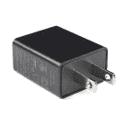

# RedBoard Turbo 连接指南

> 原文：<https://learn.sparkfun.com/tutorials/redboard-turbo-hookup-guide>

## 介绍

如果您准备从较旧的 8 位/16MHz 微控制器升级您的 Arduino 游戏，RedBoard Turbo 是一个不错的选择。RedBoard Turbo 使用 ATSAMD21G18，这是一款 ARM Cortex M0+32 位微控制器，最高运行频率可达 48MHz。 [RedBoard Turbo](https://www.sparkfun.com/products/14812) 类似于 [SAMD21 Dev Breakout](https://www.sparkfun.com/products/13672) ，有一些改进。RedBoard Turbo 将闪存从 256kB 的内部存储器提升至 4MB 的外部存储器。随着 UF2 引导加载程序，红板涡轮甚至比以前更容易编程！

[](https://www.sparkfun.com/products/14812) 

将**添加到您的[购物车](https://www.sparkfun.com/cart)中！**

 **### [spark fun red Board Turbo-samd 21 开发板](https://www.sparkfun.com/products/14812)

[In stock](https://learn.sparkfun.com/static/bubbles/ "in stock") DEV-14812

如果你准备从旧的 8 位/16MHz 微控制器升级你的 Arduino 游戏，SparkFun RedBoard Turbo 是一种形式…

$26.958[Favorited Favorite](# "Add to favorites") 27[Wish List](# "Add to wish list")** **[https://www.youtube.com/embed/ahuEUC8uQ2k/?autohide=1&border=0&wmode=opaque&enablejsapi=1](https://www.youtube.com/embed/ahuEUC8uQ2k/?autohide=1&border=0&wmode=opaque&enablejsapi=1)

RedBoard Turbo 为 ATSAMD21G18 配备了用于编程和电源的 USB 接口、Qwiic 连接器、RTC 晶体、基于 WS2812 的可寻址 RGB LED、600mA 3.3V 调节器、LiPo 充电器和各种其他组件。

### 所需材料

除了 RedBoard Turbo，你还需要一根 [Micro-B 线缆](https://www.sparkfun.com/products/10215)(就好像你的 USB 线缆抽屉里还没有几十根一样！).这就是你开始工作所需要的一切。你也可以利用它的 LiPo 充电器和一个[单体锂聚合物电池](https://www.sparkfun.com/search/results?term=lithium%20polymer)。你可能不需要所有的东西，这取决于你拥有什么。将它添加到您的购物车，通读指南，并根据需要调整购物车。

[](https://www.sparkfun.com/products/10215) 

将**添加到您的[购物车](https://www.sparkfun.com/cart)中！**

 **### [USB micro-B 线- 6 脚](https://www.sparkfun.com/products/10215)

[In stock](https://learn.sparkfun.com/static/bubbles/ "in stock") CAB-10215

USB 2.0 型到微型 USB 5 针。这是一种新的、更小的 USB 设备连接器。微型 USB 连接器大约是…

$5.5014[Favorited Favorite](# "Add to favorites") 21[Wish List](# "Add to wish list")****[](https://www.sparkfun.com/products/14812) 

将**添加到您的[购物车](https://www.sparkfun.com/cart)中！**

 **### [spark fun red Board Turbo-samd 21 开发板](https://www.sparkfun.com/products/14812)

[In stock](https://learn.sparkfun.com/static/bubbles/ "in stock") DEV-14812

如果你准备从旧的 8 位/16MHz 微控制器升级你的 Arduino 游戏，SparkFun RedBoard Turbo 是一种形式…

$26.958[Favorited Favorite](# "Add to favorites") 27[Wish List](# "Add to wish list")**** ****### 推荐阅读

在继续本教程之前，如果您不熟悉这些主题，您可能需要熟悉它们:

| [](https://www.sparkfun.com/qwiic) |
| *[Qwiic 连接系统](https://www.sparkfun.com/qwiic)* |

[](https://learn.sparkfun.com/tutorials/analog-to-digital-conversion) [### 模数转换](https://learn.sparkfun.com/tutorials/analog-to-digital-conversion) The world is analog. Use analog to digital conversion to help digital devices interpret the world.[Favorited Favorite](# "Add to favorites") 58[](https://learn.sparkfun.com/tutorials/what-is-an-arduino) [### 什么是 Arduino？](https://learn.sparkfun.com/tutorials/what-is-an-arduino) What is this 'Arduino' thing anyway? This tutorials dives into what an Arduino is and along with Arduino projects and widgets.[Favorited Favorite](# "Add to favorites") 50[](https://learn.sparkfun.com/tutorials/installing-arduino-ide) [### 安装 Arduino IDE](https://learn.sparkfun.com/tutorials/installing-arduino-ide) A step-by-step guide to installing and testing the Arduino software on Windows, Mac, and Linux.[Favorited Favorite](# "Add to favorites") 16[](https://learn.sparkfun.com/tutorials/samd21-minidev-breakout-hookup-guide) [### SAMD21 迷你/开发分线连接指南](https://learn.sparkfun.com/tutorials/samd21-minidev-breakout-hookup-guide) An introduction to the Atmel ATSAMD21G18 microprocessor and our Mini and Pro R3 breakout boards. Level up your Arduino-skills with the powerful ARM Cortex M0+ processor.[Favorited Favorite](# "Add to favorites") 7

## SAMD21 RedBoard Turbo 概述

**Note:** For those interested in the nitty, gritty details of the SAMD21, check out the section from the Dev Breakout's [SAMD21 overview](https://learn.sparkfun.com/tutorials/samd21-minidev-breakout-hookup-guide/samd21-overview) or the [datasheet](https://cdn.sparkfun.com/assets/4/c/9/e/f/SAMD21-Family-DataSheet-DS40001882D.pdf).

在我们开始编程 SAMD21 之前，让我们先了解一下 [RedBoard Turbo](https://www.sparkfun.com/products/14812) 内置的一些特性。RedBoard Turbo 类似于我们的 [SAMD21 开发突破](https://www.sparkfun.com/products/13672)，除了涡轮增压。在这一部分中，我们将介绍电路板的供电，概述 I/O 引脚，以及电路板上各种 led 的用途。

### I/O 引脚

如果你以前使用过任何 Arduino，这种引脚排列应该不会让你感到惊讶——布局符合 Arduino 1.0 尺寸标准，包括一个单独的 SPI 接头和额外的 I ² C 接头。如需快速参考，请参考我们的[图形数据表](https://github.com/sparkfun/RedBoard_Turbo/blob/master/Documentation/GraphicalDatasheet-SAMD21TurboDev_1.pdf)，它详尽地显示了每个 I/O 引脚的能力以及板上的一些其他特性。

[](https://github.com/sparkfun/RedBoard_Turbo/blob/master/Documentation/GraphicalDatasheet-SAMD21TurboDev_1.pdf)*Preview of some of the RedBoard Turbo's Pin Functionality taken from the [Graphical Datasheet](https://github.com/sparkfun/RedBoard_Turbo/blob/master/Documentation/GraphicalDatasheet-SAMD21TurboDev_1.pdf)*

所有**支持 PWM 的**引脚在引脚标签旁边用波浪符号(~)表示。说到“模拟输出”，A0 引脚提供真正的模拟输出。

⚡ **5V 输出引脚:**5v 输出电源的引脚直接接在 USB 插孔上。因此，如果您需要 5V 电源用于屏蔽或为设备供电，只有通过 USB 插孔为电路板供电时，您才能从该引脚获得 5V 电源。

⚡ **3.3V 逻辑电平！**当您开始将 SAMD21 的 I/O 引脚与外部传感器和其它元件连接时，请记住每个 I/O 最多会产生 3.3V 的高电平输出。

配置为输入时，每个 I/O 的最大输入电压为 3.6V (VDD+0.3V)。如果 SAMD21 与 5V 器件接口，可能需要一些[电平移位器](https://www.sparkfun.com/products/12009)在其间。

### 供电

可以通过 USB、单芯(3.7-4.2V)锂聚合物电池或通过桶形插孔的外部 5V 电源向 RedBoard Turbo 供电。每个电源输入均位于电路板的顶部边缘(也可以使用电源接头上的 VIN 引脚)。与 [RedBoard](https://www.sparkfun.com/products/15123) 不同，Turbo 的 5V 引脚连接到 USB 的 5V 电源，不是稳压 5V 输出。

[](https://cdn.sparkfun.com/assets/learn_tutorials/8/5/1/power_highlight.jpg)⚡ **Warning** The barrel jack connection on the RedBoard Turbo has a lower input voltage than most Arduino development boards. Make sure that you are using a power supply **below 6V**!

#### USB 电源

USB 插孔以 **micro-B** 连接器的形式出现。它应该可以与你身边的许多 USB 手机充电线之一或我们的 [Micro-B 线](https://www.sparkfun.com/products/10215)之一配合使用。你可以将另一端插入电脑 USB 端口，或者使用 [USB 壁式适配器](https://www.sparkfun.com/products/15312)。USB 电源输入包括一个 500mA PTC 可复位保险丝-如果分接头上或连接到分接头的某个部件出现故障，它应该有助于保护您的电源免受损坏。

[](https://www.sparkfun.com/products/10215) 

将**添加到您的[购物车](https://www.sparkfun.com/cart)中！**

 **### [USB micro-B 线- 6 脚](https://www.sparkfun.com/products/10215)

[In stock](https://learn.sparkfun.com/static/bubbles/ "in stock") CAB-10215

USB 2.0 型到微型 USB 5 针。这是一种新的、更小的 USB 设备连接器。微型 USB 连接器大约是…

$5.5014[Favorited Favorite](# "Add to favorites") 21[Wish List](# "Add to wish list")****[](https://www.sparkfun.com/products/15312) 

将**添加到您的[购物车](https://www.sparkfun.com/cart)中！**

 **### [【墙上适配器电源- 5VDC，2A(桶形插孔)](https://www.sparkfun.com/products/15312)

[In stock](https://learn.sparkfun.com/static/bubbles/ "in stock") TOL-15312

这是一个高品质的开关“壁式电源”交流到 DC 5V 2000 毫安桶形插座壁式电源，专为…

$6.502[Favorited Favorite](# "Add to favorites") 13[Wish List](# "Add to wish list")****[](https://www.sparkfun.com/products/15311) 

将**添加到您的[购物车](https://www.sparkfun.com/cart)中！**

 **### [【墙上适配器电源- 5VDC，2A (USB Micro-B)](https://www.sparkfun.com/products/15311)

[In stock](https://learn.sparkfun.com/static/bubbles/ "in stock") TOL-15311

这是一个高品质的开关“壁式电源”AC 到 DC 5V 2000mA USB 微型 B 壁式电源，专为 S…

$6.50[Favorited Favorite](# "Add to favorites") 2[Wish List](# "Add to wish list")****[](https://www.sparkfun.com/products/11456) 

将**添加到您的[购物车](https://www.sparkfun.com/cart)中！**

 **### [USB 壁式充电器- 5V，1A(黑色)](https://www.sparkfun.com/products/11456)

[In stock](https://learn.sparkfun.com/static/bubbles/ "in stock") TOL-11456

近来，USB 越来越多地被作为一种电源连接标准来实现，但是你并不总是在 han 上有一台计算机…

$4.502[Favorited Favorite](# "Add to favorites") 10[Wish List](# "Add to wish list")******** ********#### 单体锂聚合物(LiPo)电池充电器

SAMD21 吹嘘许多低功耗特性，因此在电池供电项目中使用它应该是常见的事情。我们已经将标准 2 针 JST 连接器和单节 USB 电池充电器集成到电路板中。我们的任何单节[锂聚合物电池](https://www.sparkfun.com/categories/54)都可以用来给电路板供电。

[](https://www.sparkfun.com/products/13813) 

将**添加到您的[购物车](https://www.sparkfun.com/cart)中！**

 **### [锂离子电池-1Ah](https://www.sparkfun.com/products/13813)

[In stock](https://learn.sparkfun.com/static/bubbles/ "in stock") PRT-13813

基于锂离子化学的超薄超轻电池。每个电池在 1000 毫安时输出 3.7V 的标称电压！

$10.958[Favorited Favorite](# "Add to favorites") 75[Wish List](# "Add to wish list")****[](https://www.sparkfun.com/products/13851) 

将**添加到您的[购物车](https://www.sparkfun.com/cart)中！**

 **### [锂离子电池- 400mAh](https://www.sparkfun.com/products/13851)

[In stock](https://learn.sparkfun.com/static/bubbles/ "in stock") PRT-13851

这是一种基于锂离子化学的非常小、非常轻的电池，具有目前最高的能量密度…

$5.5010[Favorited Favorite](# "Add to favorites") 41[Wish List](# "Add to wish list")****[](https://www.sparkfun.com/products/13855) 

将**添加到您的[购物车](https://www.sparkfun.com/cart)中！**

 **### [锂离子电池- 2Ah](https://www.sparkfun.com/products/13855)

[In stock](https://learn.sparkfun.com/static/bubbles/ "in stock") PRT-13855

这是基于锂离子化学的非常薄、非常轻的电池。每个电池在 200 伏时输出一个标称的 3.7 伏电压…

$13.959[Favorited Favorite](# "Add to favorites") 43[Wish List](# "Add to wish list")****[](https://www.sparkfun.com/products/13853) 

将**添加到您的[购物车](https://www.sparkfun.com/cart)中！**

 **### [锂离子电池- 110mAh](https://www.sparkfun.com/products/13853)

[In stock](https://learn.sparkfun.com/static/bubbles/ "in stock") PRT-13853

这是一种基于锂离子化学的非常小、非常轻的电池。这是最高的能量密度电流…

$5.503[Favorited Favorite](# "Add to favorites") 22[Wish List](# "Add to wish list")******** ********要给电池充电，只需在连接电池的同时**连接 USB 或 5V 壁式适配器**。

[](https://cdn.sparkfun.com/assets/learn_tutorials/8/5/1/RedBoard_Turbo_Hookup_Guide-04.jpg)

“充电”LED 应该在电池充电时亮起，充满电后应该最终熄灭。

#### 配置电池充电电流

MCP73831 的充电电流由 66kΩ和 2kω之间的电阻值配置，分别以 15mA 和 500mA 之间的速率对电池充电。默认情况下，电路板配置为在大约 **250mA** 时为电池充电。

大多数电池不应以超过 1C 的速率充电(例如，110 毫安时电池的 1C 充电电流为 110 毫安)。如果您需要调整充电电流，我们为通孔电阻器添加了焊盘。该电阻可与板上已有的 3.9kΩ电阻并联[或用烙铁移除 CHG 设置电阻。](https://learn.sparkfun.com/tutorials/resistors#series-and-parallel-resistors)

[](https://cdn.sparkfun.com/assets/learn_tutorials/8/5/1/CHG_SET.jpg)

如果您需要更小的充电电流，在添加您自己的之前，必须移除充电设置电阻*。增加充电电流可以通过并联一个电阻来实现。以下是一些电阻值/充电电流示例:*

| 充电电流(I [充电] | 总阻力(R [Prog] | 并联电阻器 |
| 40mA | 25 号 | 不，必须去掉 CHG 设定电阻 |
| 100 毫安 | 10 号 | 不，必须去掉 CHG 设定电阻 |
| 400 毫安 | 2.5 毫米口径 | 6.9 毫米口径 |
| 500 毫安 | 2 号机 | 四点一 |

充电电流计算如下:

I[Charge] = 1000/R[Prog]
R[Prog] is the total programming resistor resistance, which may include the 3.9kΩ resistor in parallel.

#### 当前能力

根据任务的不同，SAMD21 的内核通常消耗 3-17mA 的电流。600mA 的 3.3V 稳压器应该还有足够的电力来为 Turbo 的 3.3V 供电轨上的其他传感器或组件供电。

每个 I/O 引脚可以吸收高达 10mA 的电流，提供高达 7mA 的电流，但有一点需要注意:**每个 I/O 集群只能提供 14mA 电流或吸收 19.5mA 电流**。GPIO 集群包括:

| 串 | GPIO | 集群电源(引脚) | 仪表组接地(引脚) |
| one | SWCLK, SWDIO | VDDIN (44) | GND (42 岁) |
| Two | 30，31
(USB_HOST_EN，TX_LED) | VDDIN (44)
VDDIO (36) | 全球导航卫星系统(42)
全球导航卫星系统(35) |
| three | D2，D5，D6，D7，D10，D11，D12，D13，D38
SCL，SDA，MISO，SCK，MOSI
(USB_D-，USB_D+) | VDDIO (36)
VDDIO (17) | GND (35)
GND (18 个) |
| four | D0，D1，D3，D4 | VDDIO (17) | GND (18) |
| five | A1、A2、A3、A4
D8、D9 | VDDANA (6) | GNDANA (5) |
| six | A0，A5，AREF
(RX_LED，RTC1，RTC2) | VDDANA (6) | GNDANA (5) |

因此，举例来说，如果您向引脚 0、1、3 和 4(第 4 组)连接的四个 LED 提供电流，则该电流之和必须小于 14mA(每个 LED 约 3.5mA)。

### 发光二极管

说到 LED，RedBoard Turbo 有很多 LED:电源指示器、引脚 13“状态”LED、USB 发送和接收 LED 指示器、电池充电状态指示器和可寻址 WS2812 LED。

[](https://cdn.sparkfun.com/assets/learn_tutorials/8/5/1/LED_Highlight.jpg)

#### 状态 LED

Arduino 引脚 13 驱动的蓝色 LED 实际上是通过 N 沟道 MOSFET 获得的，因此我们宝贵的集群电流被消耗的更少。当您将引脚写入高电平时，LED 仍然点亮，当引脚 13 为低电平时，LED 熄灭。

#### 串行 UART LEDs

RX 和 TX LEDs 指示 USB 串行端口上的活动。它们也可以在 Arduino 草图中使用宏`PIN_LED_RXL`和`PIN_LED_TXL`进行寻址。这些 LED 为**低电平有效**，因此将引脚写高将关闭 LED。

#### 充电 LED

充电 LED 由电路板的集成 [MCP73831](https://cdn.sparkfun.com/datasheets/Components/General%20IC/33244_SPCN.pdf) 电池充电器控制。如果连接了电池并提供 5V 电源(通过 USB 或外部插孔)，它将在电池充电时亮起，并在充满电后熄灭。

#### 可寻址 WS2812 LED

RGB LED 使用 WS2812，它连接到引脚 44，可用于任何目的。

[](https://cdn.sparkfun.com/assets/learn_tutorials/8/5/1/LED_Highlight_1_.jpg)

## UF2 引导程序和驱动程序

**Heads up!** Please be aware that the RedBoard Turbo is **NOT currently supported on Windows 8** due to a lack of support drivers for those specific OS's.

感谢 UF2 引导程序，RedBoard Turbo 现在比以往任何时候都更容易编程。有了这个引导程序，RedBoard Turbo 就可以作为 USB 存储设备**出现在你的电脑上，而无需安装 Windows 10、Mac 和 Linux 的驱动程序**！

从 Arduino IDE 中，您仍然需要在您的机器上选择正确的端口，但是您可以同样容易地使用另一种编程语言，例如 CircuitPython 或 MakeCode，它们将在不久的将来推出。

### [Windows 7](#windows-7)

如果您使用的是 Windows 7 操作系统，您需要使用 [SAMD Windows 7 安装程序](https://github.com/sparkfun/samd_windows7_installer/releases)安装 SAMD 驱动程序。前往 GitHub repo 安装可执行文件。

[SAMD Windows 7 Installer](https://github.com/sparkfun/samd_windows7_installer/releases)

向下滚动页面至**最新版本**中的资产，并点击**。exe** 下载。版本号可能因版本而异。下图是*spark fun _ drivers _ 1 . 0 . 5 . 3 . exe*。

[](https://cdn.sparkfun.com/assets/learn_tutorials/9/1/7/Windows_7_SAMD_Drivers_Download_Versions.jpg)*Click on the image for a closer view.*

下载完成后，点击可执行文件，按照提示进行安装。尽管下图显示了 **v1.0.5.1** 的驱动程序，但安装步骤是相同的。

[](https://cdn.sparkfun.com/assets/learn_tutorials/4/5/4/Windows_7_SparkFun_SAMD_Driver_Executable.jpg)

您将收到来自 Windows 的警告。点击**是**继续。

[](https://cdn.sparkfun.com/assets/learn_tutorials/4/5/4/Windows_7_Warning.jpg)

将弹出另一个窗口。通读许可证并点击“**我同意**”。

[](https://cdn.sparkfun.com/assets/learn_tutorials/4/5/4/Windows_7_Driver_Agreement.jpg)

准备好后，点击**安装**按钮。

[](https://cdn.sparkfun.com/assets/learn_tutorials/4/5/4/Windows_7_Driver_Agreement_Install.jpg)

将弹出另一个窗口。点击“**仍然安装该驱动程序软件**继续。

[](https://cdn.sparkfun.com/assets/learn_tutorials/4/5/4/Windows_7_SAMD_Drivers_Install_Anyway.jpg)

您的 Windows 7 将开始安装驱动程序。这需要几秒钟的时间。安装驱动程序后，点击“**关闭**按钮退出安装程序。

[](https://cdn.sparkfun.com/assets/learn_tutorials/4/5/4/Windows_7_Driver_Successful_Install.jpg)

### UF2 是什么？

UF2 代表 USB 闪存格式，由微软为 PXT(现在称为 MakeCode)开发，用于在海量存储类(MSC)上闪存微控制器，就像可移动闪存驱动器一样。文件格式是独一无二的，所以不幸的是，您不能简单地将编译好的二进制或十六进制文件拖放到 Turbo 上。相反，除了数据本身之外，文件的格式还有额外的信息告诉处理器数据去了哪里。

对于 Arduino 用户来说，UF2 引导程序是兼容 BOSSA 的，这是 Arduino IDE 在 ATSAMD 板上所期望的。关于 UF2 的更多信息，你可以从 [MakeCode 博客](https://makecode.com/blog/one-chip-to-flash-them-all)以及 [UF2 文件格式规范](https://github.com/Microsoft/uf2)中了解更多。

## 设置 Arduino

虽然 SAMD21 本身就足够强大，但真正让它与众不同的是它在 Arduino IDE 中不断增加的支持。只需几次点击、复制和粘贴，您就可以将 ARM Cortex-M0+支持添加到您的 Arduino IDE 中。本页将列出在 Arduino IDE 中获得 RedBoard Turbo 支持所需的每个步骤。

**更新 Arduino！**此设置要求*至少拥有* Arduino 版本 1.6.4 或更高版本。我们已经在 1.6.5 和最新版本 1.8.8 上测试过了。

如果你运行的是旧版本的 Arduino，考虑访问 [arduino.cc](https://www.arduino.cc/en/Main/Software) 获取最新、最好的版本。

### 安装 Arduino SAMD 插件板

首先，你需要安装各种工具，包括充满通用代码的[低级 ARM Cortex 库](http://www.arm.com/products/processors/cortex-m/cortex-microcontroller-software-interface-standard.php)、编译代码的 [arm-gcc](https://launchpad.net/gcc-arm-embedded) 和通过引导程序上传的 [bossa](http://www.shumatech.com/web/products/bossa) 。这些工具与 Arduino Zero 的 SAMD 板定义打包在一起。

要安装 Arduino SAMD 板定义，导航到您的板管理器(**工具** > **板** > **板管理器)...**)，然后找到 **Arduino SAMD 板(32 位 ARM Cortex-M0+)** 的入口。选中它，安装最新版本(最近更新到 *v1.6.19* )。

[](https://cdn.sparkfun.com/assets/learn_tutorials/4/5/4/arduino-arduino-board-install.png)

下载和安装工具可能需要几分钟——特别是 arm-gcc 将需要最长的时间，它大约有 250MB。

安装后，Arduino-blue“已安装”文本应该出现在 SAMD 主板列表条目的旁边。

### 安装 SparkFun 插件板

现在你的 ARM 工具已经安装好了，还需要最后一点设置来增加对 SparkFun SAMD 板的支持。首先，打开你的 Arduino 首选项(**文件** > **首选项**)。然后找到**附加董事会经理网址**文本框，并粘贴以下链接:

```
https://raw.githubusercontent.com/sparkfun/Arduino_Boards/master/IDE_Board_Manager/package_sparkfun_index.json 
```

[](https://cdn.sparkfun.com/assets/learn_tutorials/4/5/4/arduino-board-add.png)

然后点击“确定”，并返回到**电路板管理器**菜单。你应该(但可能不会)能够为 **SparkFun SAMD 板**找到一个新条目。如果看不到，请关闭纸板管理器，然后再次打开。 \_(ツ)_/。

[](https://cdn.sparkfun.com/assets/learn_tutorials/4/5/4/sparkfun-arduino-board-install.png)

这个安装应该快得多；在前面的部分中，您已经完成了繁重的工作。

### 选择板和串行端口

一旦板安装完毕，你应该会在你的**工具** > **板**列表中看到一个新条目。**选择你的 SparkFun RedBoard Turbo。**

[](https://cdn.sparkfun.com/assets/learn_tutorials/8/5/1/Board_Selection.png)

最后，选择你的涡轮的港口。导航回到**工具** > **端口**菜单。端口菜单可能会神奇地知道您的哪个端口(如果您有多个端口)是 RedBoard Turbo 板。在 Windows 机器上，串行端口应该以“ **COM#** 的形式出现。在 Mac 或 Linux 机器上，端口将看起来像“ **/dev/cu.usbmodem####** ”。

[](https://cdn.sparkfun.com/assets/learn_tutorials/8/5/1/Port_Selection.png)

一旦你找到它，选择它！

## 示例:眨眼

就像任何开发板一样，如果你能让 LED 闪烁，你就能很好地控制世界的其他部分。由于 RedBoard Turbo 有 3 个用户可控制的 led，让我们将它们全部闪烁！

[](https://cdn.sparkfun.com/assets/learn_tutorials/8/5/1/RedBoard_Turbo_Hookup_Guide-02.jpg)

RX 和 TX LEDs 分别位于引脚 25 和 26 上，可以使用几个预定义的宏(`PIN_LED_RXL`和`PIN_LED_TXL`)来访问这些引脚，以防您忘记编号。

这里有一个快速示例草图，用于闪烁 led 并确保您的环境设置正确。从下面复制粘贴，上传！

```
language:c
const int BLUE_LED = 13; // Blue "stat" LED on pin 13
const int RX_LED = PIN_LED_RXL; // RX LED on pin 25, we use the predefined PIN_LED_RXL to make sure
const int TX_LED = PIN_LED_TXL; // TX LED on pin 26, we use the predefined PIN_LED_TXL to make sure

bool ledState = LOW;

void setup() 
{
  pinMode(BLUE_LED, OUTPUT);
  pinMode(RX_LED, OUTPUT);
  pinMode(TX_LED, OUTPUT);
  digitalWrite(RX_LED, HIGH);
  digitalWrite(TX_LED, HIGH);
  digitalWrite(BLUE_LED, LOW);
}

void loop() 
{
  digitalWrite(RX_LED, LOW); // RX LED on
  delay(333);
  digitalWrite(RX_LED, HIGH); // RX LED off
  digitalWrite(TX_LED, LOW); // TX LED on
  delay(333);
  digitalWrite(TX_LED, HIGH); // TX LED off
  digitalWrite(BLUE_LED, HIGH); // Blue LED on
  delay(333);
  digitalWrite(BLUE_LED, LOW); // Blue LED off
} 
```

点击“上传”按钮后，等待几秒钟，让代码编译并发送。当代码上传时，您应该会看到蓝色 LED 闪烁。一旦您确认 IDE 已经设置完毕，您就可以开始探索 ATSAMD21 的世界了！

## 示例:串行端口

SAMD21 最令人兴奋的特性之一是 SERCOM——它有多个可配置的串行端口。默认情况下，Arduino IDE 为 SAMD21 配备了两个硬件串行端口，外加第三个“USB 串行端口”,用于串行监视器之间的通信。

每个串行端口都有一个独特的`Serial`对象，您将在代码中引用它:

| 串行对象 | 串行端口 | RX 引脚 | TX 引脚 |
| `SerialUSB` | USB 串行(串行监视器) |  |  |
| `Serial1` | 硬件串行端口 1 | Zero | one |

这里有几件重要的事情需要注意。首先，如果你试图使用串行监视器来调试，你需要使用`SerialUSB.begin(<baud>)`和`SerialUSB.print()`。(谢天谢地，find/replace 的存在是为了调整示例代码。)

这里有一个简单的例子，展示了[串行监视器](https://learn.sparkfun.com/tutorials/terminal-basics/arduino-serial-monitor-windows-mac-linux)和`Serial1`之间的区别。它设计用于将数据从`Serial1`发送到串行监视器，反之亦然。

```
language:c
void setup()
{
  SerialUSB.begin(9600); // Initialize Serial Monitor USB
  Serial1.begin(9600); // Initialize hardware serial port, pins 0/1

  while (!SerialUSB) ; // Wait for Serial monitor to open

  // Send a welcome message to the serial monitor:
  SerialUSB.println("Send character(s) to relay it over Serial1");
}

void loop()
{
  if (SerialUSB.available()) // If data is sent to the monitor
  {
    String toSend = ""; // Create a new string
    while (SerialUSB.available()) // While data is available
    {
      // Read from SerialUSB and add to the string:
      toSend += (char)SerialUSB.read();
    }
    // Print a message stating what we're sending:
    SerialUSB.println("Sending " + toSend + " to Serial1");

    // Send the assembled string out over the hardware
    // Serial1 port (TX pin 1).
    Serial1.print(toSend);
  }

  if (Serial1.available()) // If data is sent from device
  {
    String toSend = ""; // Create a new string
    while (Serial1.available()) // While data is available
    {
      // Read from hardware port and add to the string:
      toSend += (char)Serial1.read();
    }
    // Print a message stating what we've received:
    SerialUSB.println("Received " + toSend + " from Serial1");
  }
} 
```

然后尝试在串行监视器中键入一些内容。即使没有连接到硬件串行端口，您也应该看到您输入的内容会得到回应。

[](https://cdn.sparkfun.com/assets/learn_tutorials/4/5/4/serial-monitor-example.png)

您可以通过将一个 [3.3V FTDI Basic](https://www.sparkfun.com/products/9873) 或任何其他串行设备连接到 SAMD21 的引脚 0 (RX)和 1 (TX)来进一步测试该草图。通过打开一个[串行终端](https://learn.sparkfun.com/tutorials/terminal-basics/tera-term-windows)，从 FTDI 发送的任何数据都应该在你的 Arduino 串行监视器中结束，发送到你的 Arduino 串行监视器的数据将被路由到 FTDI。下表显示了需要连接的引脚。

| 红板涡轮引脚 | 3.3V FTDI(或任何 USB 转串行转换器)引脚 |
| 1/TX | RXI |
| 0/RX | TXO |
| GND | GND |

## 示例:模拟输入和输出

虽然 SAMD21 仍具有基于 PWM 的“模拟输出”，但它还具有数模转换器(DAC)形式的真模拟输出。该模块可以产生 0 到 3.3V 之间的模拟电压。它可以用来产生更自然的声音，或作为一种“数字电位计”来控制模拟设备。

DAC 仅在 **Arduino 引脚 A0** 上可用，并通过`analogWrite(A0, <value>)`控制。DAC 可以设置为 10 位分辨率(确保在您的设置中调用[analogWriteResolution(10)](https://www.arduino.cc/en/Reference/AnalogWriteResolution))，这意味着 0 到 1023 之间的值会将电压设置为 0 到 3.3V 之间的某个值

除了 DAC，SAMD21 的 ADC 通道也不同于 ATmega328:它们配备了高达 **12 位分辨率**。这意味着模拟输入值的范围可以是 0-4095，代表 0 到 3.3V 之间的电压。要在 12 位模式下使用 ADC，请确保在设置中调用 [analogReadResolution(12)](https://www.arduino.cc/en/Reference/AnalogReadResolution) 。

### DAC 串行图

The **Serial Plotter** in this example requires Arduino 1.6.6 or later. Visit [arduino.cc](https://www.arduino.cc/en/Main/Software) to get the latest, greatest version.

下面的例子演示了 10 位 DAC 和 12 位 ADC。为了设置实验，**将 A0 连接到 A1** -我们用模拟电压驱动 A0，然后用 A1 读取。这是我们在教程中介绍过的最简单的电路:

[](https://cdn.sparkfun.com/assets/learn_tutorials/8/5/1/RedBoard_Turbo_Hookup_Guide-01.jpg)*Jumping a temporary connection between A0 (our DAC) and A1.*

然后将下面的代码复制粘贴到你的 Arduino IDE 中，并上传！

```
language:c
// Connect A0 to A1, then open the Serial Plotter.

#define DAC_PIN A0 // Make code a bit more legible

float x = 0; // Value to take the sin of
float increment = 0.02;  // Value to increment x by each time
int frequency = 440; // Frequency of sine wave

void setup() 
{
  analogWriteResolution(10); // Set analog out resolution to max, 10-bits
  analogReadResolution(12); // Set analog input resolution to max, 12-bits

  SerialUSB.begin(9600);
}

void loop() 
{
  // Generate a voltage value between 0 and 1023\. 
  // Let's scale a sin wave between those values:
  // Offset by 511.5, then multiply sin by 511.5.
  int dacVoltage = (int)(511.5 + 511.5 * sin(x));
  x += increment; // Increase value of x

  // Generate a voltage between 0 and 3.3V.
  // 0= 0V, 1023=3.3V, 512=1.65V, etc.
  analogWrite(DAC_PIN, dacVoltage);

  // Now read A1 (connected to A0), and convert that
  // 12-bit ADC value to a voltage between 0 and 3.3.
  float voltage = analogRead(A1) * 3.3 / 4096.0;
  SerialUSB.println(voltage); // Print the voltage.
  delay(1); // Delay 1ms
} 
```

这张草图在 A0 上产生一个正弦波输出，其值范围为 0 至 3.3V，然后使用 A1 将该输出读入其 12 位 ADC，并将其转换为 0 至 3.3V 之间的电压。

当然，您可以打开串行监视器来查看电压值流。但是，如果正弦波很难通过文本可视化，请通过前往**工具** > **串行绘图仪**来检查 Arduino 的新**串行绘图仪**。

[](https://cdn.sparkfun.com/assets/learn_tutorials/4/5/4/serial-plotter-open.png)

感受正弦波的威严。

[](https://cdn.sparkfun.com/assets/learn_tutorials/4/5/4/serial-plotter.png)

## 示例:可寻址 RGB LED

**Heads up!** Since the addressable WS2812 LED is attached to pin 44, we will be using the NeoPixel library. The FastLED will not be able to work at that high of an I/O number for the SAMD21

在最后一个例子中，我们将了解如何在 RedBoard Turbo 上使用 RGB LED。RGB LED 以 WS2812 的形式出现，如果您不想或不需要使用串行终端，它可以作为状态 LED 或用于调试。在下面的例子中，我们将使用下面的彩虹渐变代码来测试 LED 的功能。要使用这段代码，您需要安装[新像素库](https://github.com/adafruit/Adafruit_NeoPixel)。您可以通过 Arduino 库管理器获得这些库。搜索 NeoPixel，你应该可以安装最新版本。如果你喜欢手动下载这些库，你可以从 [GitHub 库](https://github.com/adafruit/Adafruit_NeoPixel)中获取它们:

[Download NeoPixel Library (ZIP)](https://github.com/adafruit/Adafruit_NeoPixel/archive/master.zip)

安装完库后，将以下代码复制并粘贴到 Arduino IDE 中。

```
language:c
#include <Adafruit_NeoPixel.h>
#define LEDPIN RGB_LED // connect the Data from the strip to this pin on the Arduino
#define NUMBER_PIEXELS 1 // the number of pixels in your LED strip
Adafruit_NeoPixel strip = Adafruit_NeoPixel(NUMBER_PIEXELS, LEDPIN, NEO_GRB + NEO_KHZ800);

int wait = 10; // how long we wait on each color (milliseconds)

void setup() {
  strip.begin();
}

void loop() {

    for (int color=0; color<255; color++) {
      for (int i=0; i<strip.numPixels(); i++) {
        strip.setPixelColor(i, Wheel(color));
       }
    strip.show();
    delay(wait);
  }
}

// Input a value 0 to 255 to get a color value.
// The colours are a transition r - g - b - back to r.
uint32_t Wheel(byte WheelPos) {
  WheelPos = 255 - WheelPos;
  if(WheelPos < 85) {
   return strip.Color(255 - WheelPos * 3, 0, WheelPos * 3);
  } else if(WheelPos < 170) {
    WheelPos -= 85;
   return strip.Color(0, WheelPos * 3, 255 - WheelPos * 3);
  } else {
   WheelPos -= 170;
   return strip.Color(WheelPos * 3, 255 - WheelPos * 3, 0);
  }
} 
```

上传后，您应该会看到 LED 改变颜色。注意在代码中，RGB LED 的管脚是用 **RGB_LED** 定义的。你也可以使用`LED4`或者它的 pin 码`44`来调用它。

[](https://cdn.sparkfun.com/assets/learn_tutorials/8/5/1/RedBoard_Turbo_Hookup_Guide-03.jpg)

## 解决纷争

有关故障排除技巧，请点击此处查看 [SAMD21 故障排除指南](https://learn.sparkfun.com/tutorials/samd21-minidev-breakout-hookup-guide/troubleshooting)，了解在将 SAMD21 与 Arduino 配合使用时可能遇到的常见问题。唯一的例外是，RedBoard Turbo 不需要驱动程序，因此重新安装驱动程序的提示将不适用。

[SAMD21 Mini/Dev Breakout Hookup Guide: Troubleshooting](https://learn.sparkfun.com/tutorials/samd21-minidev-breakout-hookup-guide/troubleshooting)

## 重新安装电路 Python

如果你决定在 Arduino 中进行开发，你会发现在通过串行上传加载你的第一个草图时，RedBoard Turbo 不再像以前那样像可移动 USB 设备一样弹出。那是意料之中的事，所以不要惊慌。在本节中，我们将通过几个简单的步骤将 Circuit Python 重新上传到您的计算机上。

### 将主板重置为引导加载程序

我们希望主板重置为 UF2 引导程序，如上所述，使主板能够像闪存驱动器一样工作。为此，我们将采取故障排除部分下面提到的步骤:我们将*双击*重置按钮。在你这么做之后不久，主板会弹出一个名为*涡轮引导*的 USB 驱动器。

### 拖放电路 Python 固件

从这里开始，这是一个简单的拖放成功。下载下面的 Circuit Python 固件(也可以在固件文件夹下的 Github Repo 中找到)。将名为`turbo-boot_cp.uf2`的内容拖到你的 *TURBOBOOT* USB 驱动器上，文件夹应该会暂时消失，但会重新显示为一个 *CIRCUITPY* USB 驱动器。

[Circuit Python Firmware (ZIP)](https://cdn.sparkfun.com/assets/learn_tutorials/8/5/1/turbo-boot_cp.zip)

## 资源和更进一步

无论您是在寻找数据手册、原理图还是设计文件，都有丰富的信息。其他资源，以下是一些您可能会觉得方便的链接:

*   **SparkFun RedBoard Turbo 设计资源**
    *   [示意图(PDF)](https://cdn.sparkfun.com/assets/6/5/4/5/0/RedBoard_Turbo.pdf)
    *   [鹰(ZIP)](https://cdn.sparkfun.com/assets/a/8/f/1/9/RedBoard_Turbo.zip)
    *   开源代码库
        *   [Arduino 板卡定义](https://github.com/sparkfun/Arduino_Boards)
        *   [产品存储库](https://github.com/sparkfun/RedBoard_Turbo)
            *   [图形数据表](https://github.com/sparkfun/RedBoard_Turbo/blob/master/Documentation/GraphicalDatasheet-SAMD21TurboDev_1.pdf)
*   **ATmel ATSAMD21 资源**
    *   [Atmel ATSAMD21G18A 产品页面](http://www.atmel.com/devices/ATSAMD21G18.aspx)
    *   [ATSAMD21 概要数据表](http://www.atmel.com/Images/Atmel-42181-SAM-D21_Summary.pdf)
    *   [ATSAMD21 完整数据表](https://cdn.sparkfun.com/assets/4/c/9/e/f/SAMD21-Family-DataSheet-DS40001882D.pdf)
*   **Arduino ATSAMD21 资源**
    *   [SAMD Arduino 核心 GitHub 库](https://github.com/arduino/ArduinoCore-samd)
*   [SFE 产品展示区](https://youtu.be/ahuEUC8uQ2k)

关于为基于 SAMD 的主板添加更多 SERCOM 端口的更多信息，请查看下面的教程。

[](https://learn.sparkfun.com/tutorials/adding-more-sercom-ports-for-samd-boards) [### 为 SAMD 板添加更多 SERCOM 端口

#### 2019 年 2 月 4 日](https://learn.sparkfun.com/tutorials/adding-more-sercom-ports-for-samd-boards) How to setup extra SPI, UART, and I2C serial ports on a SAMD-based boards.[Favorited Favorite](# "Add to favorites") 1

这是一个勇敢的新世界——Arduinos 和 ARMs 一起工作！你打算用你强大的新 RedBoard Turbo 创造什么？寻找一些灵感，看看这些教程！

[](https://learn.sparkfun.com/tutorials/using-github-to-share-with-sparkfun) [### 使用 GitHub 与 SparkFun 分享](https://learn.sparkfun.com/tutorials/using-github-to-share-with-sparkfun) A simple step-by-step tutorial to help you download files from SparkFun's GitHub site, make changes, and share the changes with SparkFun.[Favorited Favorite](# "Add to favorites") 12[](https://learn.sparkfun.com/tutorials/connecting-arduino-to-processing) [### 将 Arduino 连接到处理](https://learn.sparkfun.com/tutorials/connecting-arduino-to-processing) Send serial data from Arduino to Processing and back - even at the same time 35[](https://learn.sparkfun.com/tutorials/data-types-in-arduino) [### Arduino 中的数据类型](https://learn.sparkfun.com/tutorials/data-types-in-arduino) Learn about the common data types and what they signify in the Arduino programming environment.[Favorited Favorite](# "Add to favorites") 38**********************