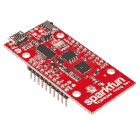
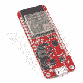
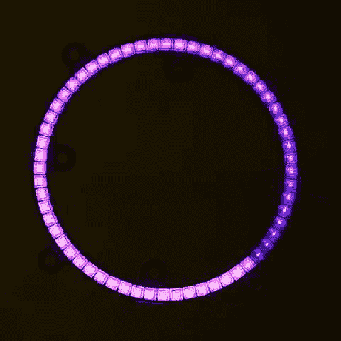

# LuMini 环连接指南

> 原文：<https://learn.sparkfun.com/tutorials/lumini-ring-hookup-guide>

## 介绍

LuMini 戒指( [3 英寸](https://www.sparkfun.com/products/14965)、 [2 英寸](https://www.sparkfun.com/products/14966)、 [1 英寸](https://www.sparkfun.com/products/14967))是为任何东西添加光环的绝佳方式。

[](https://www.sparkfun.com/products/14966) 

将**添加到您的[购物车](https://www.sparkfun.com/cart)中！**

### [SparkFun LuMini LED 戒指- 2 寸(40 x APA 102-2020)](https://www.sparkfun.com/products/14966)

[In stock](https://learn.sparkfun.com/static/bubbles/ "in stock") COM-14966

SparkFun LuMini LED 戒指的两英寸版本，装有 40 个可单独寻址的 LEDS，每个都能产生…

$18.50[Favorited Favorite](# "Add to favorites") 9[Wish List](# "Add to wish list")****[](https://www.sparkfun.com/products/14967) 

将**添加到您的[购物车](https://www.sparkfun.com/cart)中！**

### [SparkFun LuMini LED 戒指- 1 寸(20 x APA 102-2020)](https://www.sparkfun.com/products/14967)

[Out of stock](https://learn.sparkfun.com/static/bubbles/ "out of stock") COM-14967

SparkFun LuMini LED 戒指的一英寸版本，装有 20 个可单独寻址的 LEDS，每个都能产生…

$11.50[Favorited Favorite](# "Add to favorites") 14[Wish List](# "Add to wish list")****[](https://www.sparkfun.com/products/14965) 

将**添加到您的[购物车](https://www.sparkfun.com/cart)中！**

### [SparkFun LuMini LED 戒指- 3 寸(60 x APA 102-2020)](https://www.sparkfun.com/products/14965)

[Out of stock](https://learn.sparkfun.com/static/bubbles/ "out of stock") COM-14965

三英寸版本的闪光发光二极管戒指，装有 60 个可单独寻址的 LEDS，每个能够产生…

$29.505[Favorited Favorite](# "Add to favorites") 11[Wish List](# "Add to wish list")****** ******[https://www.youtube.com/embed/WxBrUkzW4tA/?autohide=1&border=0&wmode=opaque&enablejsapi=1](https://www.youtube.com/embed/WxBrUkzW4tA/?autohide=1&border=0&wmode=opaque&enablejsapi=1)

LuMini 系列使用的 LED 与我们的 Lumenati 电路板上使用的 LED 相同，即 [APA102](https://www.sparkfun.com/categories/tags/apa102) ，只是封装尺寸更小，为 2.0x2.0 mm。这允许非常紧密的像素密度，因此，一个更连续的颜色环。虽然 LuMini 戒指有不同的尺寸，但它们都以相似的方式运作。

| [](https://www.sparkfun.com/products/14608) | [](https://www.sparkfun.com/products/14863) |
| *APA 102，2020 包装的尺寸* | *APA 102，5050 包装的尺寸* |

**Heads up!** The LiMini Rings and Matrix has a different footprint compared to the individual APA102-2020s that are sold in packs of 10 (i.e. COM-14608).

在本教程中，我们将介绍如何将 LuMini 环连接到更多 LuMini 环以及其他基于 APA102 的产品。我们将了解如何在软件中绘制一个光环，这样我们就可以用圆形动画来获得更多的创意。当你把越来越多的灯串在一起时，我们会考虑一些事情，我们也会考虑一些简洁的照明模式，让你远离标准的彩虹模式(如果你有 1600 万种颜色，为什么要用 255 种)。

### 所需材料

要跟随本教程，您将需要以下材料。你可能不需要所有的东西，这取决于你拥有什么。将它添加到您的购物车，通读指南，并根据需要调整购物车。

#### 选择微控制器

你需要一个微控制器来控制一切，然而，当选择一个微控制器来控制一整吨的 LED 时，有一些事情需要考虑。首先，尽管 APA102 LED 不需要在特定的时间内工作，但它可以非常非常快地传输数据，比如 20 MHz。因此，您应该使用足够快的微控制器来利用这一事实。当您开始增加 LED 数量时，另一个要考虑的事情是 LED 框架占用的 RAM 量。每个 LED 占用 3 字节的 RAM 空间，这听起来不是很多，但如果你控制 5000 个 LED，那么，你可能需要比传统的 RedBoard 有更多 RAM 的东西。下表列出了您可能开始遇到内存问题的指示灯数量。请记住，这些都是非常宽松的估计，并会根据声明的其他全局变量而减少。

| **微控制器** | **最大 LED 数** | **时钟速度** |
| SparkFun 红板 | Six hundred | 16 兆赫 |
| Arduino Mega 2560 | Two thousand six hundred | 16 兆赫 |
| Pro Micro | Seven hundred | 16 兆赫 |
| SparkFun ESP8266 的东西 | Twenty-seven thousand | 160 兆赫 |
| SparkFun ESP32 的东西 | Ninety-seven thousand | 160 兆赫或 240 兆赫 |
| 青少年 3.6 | Eighty-seven thousand | 180 兆赫(240 兆赫超频) |

当涉及到这样的东西时，选择 ESP 或 Teensy 是非常容易的，因为你在时钟周期中有大量的开销来为动画运行古怪的计算。然而，如果你的项目不全是灯，你只是在项目上扔一个 LuMini 环作为指示器，那么功能不那么强大的微控制器就足够了。这里是从目录中列出的几个[微控制器。根据开发板的不同，您可能需要根据个人喜好焊接](https://www.sparkfun.com/categories/300)[接头](https://www.sparkfun.com/categories/381)。

[](https://www.sparkfun.com/products/12640) 

将**添加到您的[购物车](https://www.sparkfun.com/cart)中！**

### [Pro 微 5V/16MHz](https://www.sparkfun.com/products/12640)

[Out of stock](https://learn.sparkfun.com/static/bubbles/ "out of stock") DEV-12640

在 SparkFun，我们拒绝放弃“足够好”。这就是我们增加 Arduino 兼容微控制器产品线的原因…

$19.5080[Favorited Favorite](# "Add to favorites") 87[Wish List](# "Add to wish list")****[](https://www.sparkfun.com/products/11061) 

将**添加到您的[购物车](https://www.sparkfun.com/cart)中！**

### [Arduino Mega 2560 R3](https://www.sparkfun.com/products/11061)

[In stock](https://learn.sparkfun.com/static/bubbles/ "in stock") DEV-11061

Arduino 是一个开源的物理计算平台，它基于一个简单的 i/o 板和一个开发环境

$48.9559[Favorited Favorite](# "Add to favorites") 77[Wish List](# "Add to wish list")****[](https://www.sparkfun.com/products/13975) 

将**添加到您的[购物车](https://www.sparkfun.com/cart)中！**

### [spark fun red board——用 Arduino 编程 T3](https://www.sparkfun.com/products/13975)

[In stock](https://learn.sparkfun.com/static/bubbles/ "in stock") DEV-13975

SparkFun RedBoard 结合了 UNO 的 Optiboot 引导程序的简单性、FTDI 的稳定性和 shield com…

$21.5049[Favorited Favorite](# "Add to favorites") 89[Wish List](# "Add to wish list")****[](https://www.sparkfun.com/products/13907) 

将**添加到您的[购物车](https://www.sparkfun.com/cart)中！**

### [SparkFun ESP32 东西](https://www.sparkfun.com/products/13907)

[In stock](https://learn.sparkfun.com/static/bubbles/ "in stock") DEV-13907

SparkFun ESP32 Thing 是 Espressif 的 ESP32 的综合开发平台，ESP32 是他们的超级充电版本…

$23.5069[Favorited Favorite](# "Add to favorites") 83[Wish List](# "Add to wish list")****[](https://www.sparkfun.com/products/13804) 

将**添加到您的[购物车](https://www.sparkfun.com/cart)中！**

### [](https://www.sparkfun.com/products/13804)

[28 available](https://learn.sparkfun.com/static/bubbles/ "28 available") WRL-13804

SparkFun ESP8266 带接头的东西开发板是一种围绕 ESP8266 设计的开发板，具有集成的…

$20.258[Favorited Favorite](# "Add to favorites") 14[Wish List](# "Add to wish list")****[](https://www.sparkfun.com/products/14058) 

### [田晶晶 3.6(头球)](https://www.sparkfun.com/products/14058)

[Out of stock](https://learn.sparkfun.com/static/bubbles/ "out of stock") DEV-14058

Teensy 3.6 更大，更快，能够进行更复杂的项目，特别是其板载微型 SD 卡端口，ARM 公司…

7[Favorited Favorite](# "Add to favorites") 22[Wish List](# "Add to wish list")[](https://www.sparkfun.com/products/retired/14689) 

### [spark fun Thing Plus-ESP32 WROOM](https://www.sparkfun.com/products/retired/14689)

[Retired](https://learn.sparkfun.com/static/bubbles/ "Retired") WRL-14689

SparkFun ESP32 Thing Plus 是开始使用 Espressif 物联网概念的下一步，同时还可以享受所有的便利设施

7 **Retired**[Favorited Favorite](# "Add to favorites") 16[Wish List](# "Add to wish list")********** **********#### 选择电源

在大多数情况下，您的 LED 安装会超出您的电路板的处理能力(取决于亮度和动画，100-250 个 LED 对于您的电路板的电压调节器来说可能太多了)，所以您应该在小屋中为所有的 LED 安装一个 5V 的电源。下面是我们目录中列出的几款 [5V 电源。只需确保在连接耗电的 led 时使用合适的电缆和适配器。](https://www.sparkfun.com/categories/307)

[](https://www.sparkfun.com/products/retired/14601) 

### [指 LED 开关电源-5v 直流，5A](https://www.sparkfun.com/products/retired/14601)

[Retired](https://learn.sparkfun.com/static/bubbles/ "Retired") TOL-14601

这是一款 40W 单输出开关电源，来自 Mean Well，专为 LED 应用而设计

**Retired**[Favorited Favorite](# "Add to favorites") 8[Wish List](# "Add to wish list")[](https://www.sparkfun.com/products/retired/12889) 

### [壁式适配器电源- 5V DC 2A(桶形插孔)](https://www.sparkfun.com/products/retired/12889)

[Retired](https://learn.sparkfun.com/static/bubbles/ "Retired") TOL-12889

这是一个高品质的开关“壁式电源”交流到 DC 5V 2000 毫安桶形插座壁式电源，专为…

16 **Retired**[Favorited Favorite](# "Add to favorites") 19[Wish List](# "Add to wish list")[](https://www.sparkfun.com/products/retired/14098) 

### [指井开关电源-5v 直流，20A](https://www.sparkfun.com/products/retired/14098)

[Retired](https://learn.sparkfun.com/static/bubbles/ "Retired") TOL-14098

这是一款来自 Mean Well 的 100W 单输出开关电源。这种电源非常可靠，能够输出很高的电压

**Retired**[Favorited Favorite](# "Add to favorites") 19[Wish List](# "Add to wish list")

您可以通过将 LED 的数量乘以 60 mA (0.06 A)来估计所需的电源大小，60mA(0.06 A)是使 LED 全白运行所需的电流量。这一计算将会给出你的 LED 可以消耗的最大功率，但是大多数时候，这是对你实际消耗功率的一个总的高估。与其计算，我通常喜欢在一个[台式电源](https://www.sparkfun.com/products/9291)上测试我完成的安装，使用它将运行的最亮的动画，然后增加 20%或 30%给自己一点回旋的空间，如果我想在未来提高亮度的话。

[](https://www.sparkfun.com/products/retired/9291) 

### [电源- 80W DC 开关模式](https://www.sparkfun.com/products/retired/9291)

[Retired](https://learn.sparkfun.com/static/bubbles/ "Retired") TOL-09291

这是一款 80W 三合一(3 个输出范围)开关 DC 电源。在 2.2A 时提供 0-36VDC 的稳定电压，最大输出功率为 80W。需要…

1 **Retired**[Favorited Favorite](# "Add to favorites") 28[Wish List](# "Add to wish list")

### 工具

你需要一个剥线钳、电线、烙铁、焊料、[通用焊接附件](https://www.sparkfun.com/categories/49)。如果要将表贴去耦电容焊接到电路板背面，镊子是可选的。

[](https://www.sparkfun.com/products/11367) 

将**添加到您的[购物车](https://www.sparkfun.com/cart)中！**

### [](https://www.sparkfun.com/products/11367)

[In stock](https://learn.sparkfun.com/static/bubbles/ "in stock") PRT-11367

各种颜色的电线:你知道这是一个美丽的东西。六种不同颜色的硬纸板实芯焊丝…

$21.5037[Favorited Favorite](# "Add to favorites") 86[Wish List](# "Add to wish list")****[](https://www.sparkfun.com/products/14228) 

### [威勒 WLC100 焊台](https://www.sparkfun.com/products/14228)

[Out of stock](https://learn.sparkfun.com/static/bubbles/ "out of stock") TOL-14228

Weller 的 WLC100 是一款多功能的 5 瓦至 40 瓦焊台，非常适合业余爱好者、DIY 爱好者和学生。…

2[Favorited Favorite](# "Add to favorites") 17[Wish List](# "Add to wish list")[](https://www.sparkfun.com/products/10602) 

将**添加到您的[购物车](https://www.sparkfun.com/cart)中！**

### [【镊子弯曲(ESD 安全)](https://www.sparkfun.com/products/10602)

[In stock](https://learn.sparkfun.com/static/bubbles/ "in stock") TOL-10602

你可以从我们种类繁多的镊子看出，我们 SparkFun 非常擅长拾取细小的东西。为了确保我们…

$4.507[Favorited Favorite](# "Add to favorites") 47[Wish List](# "Add to wish list")****[](https://www.sparkfun.com/products/9163) 

将**添加到您的[购物车](https://www.sparkfun.com/cart)中！**

### [无铅焊料- 15 克管](https://www.sparkfun.com/products/9163)

[In stock](https://learn.sparkfun.com/static/bubbles/ "in stock") TOL-09163

这是你的无铅焊料的基本管，带有不干净的水溶性树脂芯。0.031 英寸规格，15 克

$3.954[Favorited Favorite](# "Add to favorites") 14[Wish List](# "Add to wish list")****[](https://www.sparkfun.com/products/retired/14763) 

### [剥线钳- 20-30AWG](https://www.sparkfun.com/products/retired/14763)

[Retired](https://learn.sparkfun.com/static/bubbles/ "Retired") TOL-14763

这些是 Techni-Tool 的高级剥线钳，带有弯曲的手柄，如果您需要拆卸，这是一个实惠的选择

3 **Retired**[Favorited Favorite](# "Add to favorites") 0[Wish List](# "Add to wish list")****** ******### 推荐阅读

如果您不熟悉以下概念，我们建议您在继续之前查看这些教程。

[](https://learn.sparkfun.com/tutorials/light) [### 光](https://learn.sparkfun.com/tutorials/light) Light is a useful tool for the electrical engineer. Understanding how light relates to electronics is a fundamental skill for many projects.[Favorited Favorite](# "Add to favorites") 24[](https://learn.sparkfun.com/tutorials/how-to-power-a-project) [### 如何为项目提供动力](https://learn.sparkfun.com/tutorials/how-to-power-a-project) A tutorial to help figure out the power requirements of your project.[Favorited Favorite](# "Add to favorites") 67[](https://learn.sparkfun.com/tutorials/light-emitting-diodes-leds) [### 发光二极管](https://learn.sparkfun.com/tutorials/light-emitting-diodes-leds) Learn the basics about LEDs as well as some more advanced topics to help you calculate requirements for projects containing many LEDs.[Favorited Favorite](# "Add to favorites") 67[](https://learn.sparkfun.com/tutorials/electric-power) [### 电力](https://learn.sparkfun.com/tutorials/electric-power) An overview of electric power, the rate of energy transfer. We'll talk definition of power, watts, equations, and power ratings. 1.21 gigawatts of tutorial fun 54[](https://learn.sparkfun.com/tutorials/how-to-work-with-jumper-pads-and-pcb-traces) [### 如何使用跳线焊盘和 PCB 走线](https://learn.sparkfun.com/tutorials/how-to-work-with-jumper-pads-and-pcb-traces) Handling PCB jumper pads and traces is an essential skill. Learn how to cut a PCB trace, add a solder jumper between pads to reroute connections, and repair a trace with the green wire method if a trace is damaged.[Favorited Favorite](# "Add to favorites") 11

## 硬件概述

### I/O 引脚

LuMini 环由每块电路板背面的几个衬垫供电和控制。每块板都有一组用于 **5V** 和地的焊盘，一组用于数据和时钟输入的焊盘，一组用于数据和时钟输出的焊盘。下图中概述了这些焊盘。

[](https://cdn.sparkfun.com/assets/learn_tutorials/8/4/1/pads.png)*I/O Pads*

### 去耦电容焊盘

在较大的安装中，您可能需要在电源和地之间添加一个去耦电容，以防止同时打开一整串 LED 时出现电压骤降。添加该可选电容的位置如下所示。

[](https://cdn.sparkfun.com/assets/learn_tutorials/8/4/1/cap.png)*Capacitor Pads*

我们推荐如下所示的表面贴装 [4.7 F 电容](https://www.sparkfun.com/products/15169)。如果你以前从未做过表面贴装焊接，这部分可能会有点棘手，但看看我们的 [SMD 技巧和诀窍](https://www.sparkfun.com/news/2233)就能做到。

[](https://www.sparkfun.com/products/retired/15169) 

### [电容器 4.7uF -贴片(10 片)](https://www.sparkfun.com/products/retired/15169)

[Retired](https://learn.sparkfun.com/static/bubbles/ "Retired") COM-15169

这是 10 个微型 4.7 F SMD 去耦电容。这些电容中的每一个都提供了 16V 的 DC 额定电压和一个电容…

**Retired**[Favorited Favorite](# "Add to favorites") 1[Wish List](# "Add to wish list")

### LED 数字

查看每个戒指的背面，您还会看到一些数字。由于该环的作用类似于一串 LED，因此这些数字对应于该串中的 LED 编号。注意，像 led 阵列一样，我们在 LED 0 处进行索引，因此调用`leds[5]`将对应于 **5** 标签对面的 LED。

[](https://cdn.sparkfun.com/assets/learn_tutorials/8/4/1/nums.png)*LED Numbers***Warning!** We've found that setting the global brightness using the FastLED Library to `32` is good for testing, as it's a little easier on the eyes. However, turning the brightness up all the way and leaving all LED's on white will result in damage to your ring! Be careful to make sure your animations don't run too hot, and if they do, you can always lower the brightness.

## 硬件装配

### 焊接到 LuMini 环

[将](https://learn.sparkfun.com/tutorials/how-to-solder-through-hole-soldering)电线焊接到 LuMini 环的衬垫上非常简单。诀窍是在试图将两者焊接在一起之前，简单地预焊接焊盘和[剥线](https://learn.sparkfun.com/tutorials/working-with-wire#how-to-strip-a-wire)。然后，将导线压到焊盘上，焊接掉！如果你有一点困惑，看看下面的 GIF。

[](https://cdn.sparkfun.com/assets/learn_tutorials/8/4/1/SparkFun_LuMini_LED_Ring_1.gif)*Soldering to the LuMini Ring*

### 选择引脚

APA102 LED 是通过类似 SPI 的协议来控制的，因此通常最好在微控制器上将 **`CI`** 连接到 **`SCLK`** ，将 **`DI`** 连接到 **`MOSI`** 。但是，这种设置不是必需的，您可以将数据和时钟连接到微控制器上的大多数引脚。继续并确定你将使用哪些引脚，并将你的数据线( **`DI`** )和时钟线( **`CI`** )焊接到你的微控制器中。

既然我们知道如何焊接到这些焊盘，我们就可以开始制作一系列 LuMini 环，甚至将它们连接到其他基于 APA102 的产品上。为此，我们需要做的就是将一个环的 **`CO`** 和 **`DO`** 焊接到下一个环的 **`CI`** 和 **`DI`** 。下图显示了一个 1 英寸环的输出连接到一个 3 英寸环的输入。

[](https://cdn.sparkfun.com/assets/learn_tutorials/8/4/1/SparkFun_LuMini_LED_Ring-03.jpg)*Chained Rings*

## 软件安装

**注意:**此示例假设您在桌面上使用的是最新版本的 Arduino IDE。如果这是你第一次使用 Arduino，请回顾我们关于[安装 Arduino IDE 的教程。](https://learn.sparkfun.com/tutorials/installing-arduino-ide)如果您之前没有安装 Arduino 库，请查看我们的[安装指南。](https://learn.sparkfun.com/tutorials/installing-an-arduino-library)

我们将利用一直流行的 **FastLED** 库来控制我们的 LuMini 环。您可以通过 Arduino 库管理器获得这些库。搜索 **FastLED** 安装最新版本。如果你喜欢手动下载这些库，你也可以从 [GitHub 库](https://github.com/FastLED/FastLED)获取它们:

[DOWNLOAD THE FASTLED LIBRARY (ZIP)](https://github.com/FastLED/FastLED/archive/master.zip)

## 点燃它

SparkFun 还编写了一些特定于戒指的示例代码来帮助您入门。这些示例草图可以在固件下的 [LuMini 3 英寸 GitHub Repo 中找到。要下载，请单击下面的按钮。](https://github.com/sparkfun/LuMini_3_Inch/tree/master/Firmware)

[DOWNLOAD THE EXAMPLE SKETCHES (ZIP)](https://github.com/sparkfun/LuMini_3_Inch/archive/master.zip)

确保根据 led 与微控制器的连接方式调整引脚定义。

### 示例 1 -环形测试

格伦·拉森发明了拉森扫描仪，作为电视剧《霹雳游侠》的 LED 特效。在这个例子中，我们将复制它，只是为了更好地测量，我们将添加一些颜色。拉森扫描仪是测试你戒指上所有发光二极管的一个很好的丰富多彩的方法。我们将首先为我们的戒指创建一个对象。只需为您选择的戒指取消合适的 LED 数量。对于这些例子，我们将使用 3 英寸环。

```
language:c
#include <FastLED.h>

// How many leds in your strip? Uncomment the corresponding line
#define NUM_LEDS 60 //3 Inch
//#define NUM_LEDS 40 //2 Inch
//#define NUM_LEDS 20 //1 Inch

// The LuMini rings need two data pins connected
#define DATA_PIN 16
#define CLOCK_PIN 17

// Define the array of leds
CRGB ring[NUM_LEDS]; 
```

然后我们将使用下面的`.addLeds`函数初始化一个环。注意本声明中的 **BGR** ，这是颜色顺序，有时，制造商会改变接收到的数据放入 PWM 寄存器的顺序，所以你必须改变颜色顺序来匹配。我们使用的特定芯片组是 **`BGR`** ，但这在未来可能会改变。我们还将设置全局亮度为`32`。

```
language:c
void setup() {
  LEDS.addLeds<APA102, DATA_PIN, CLOCK_PIN, BGR>(ring, NUM_LEDS);
  LEDS.setBrightness(32);
} 
```

**Warning!** We've found that setting the global brightness using the FastLED Library to `32` is good for testing, as it's a little easier on the eyes. However, turning the brightness up all the way and leaving all LED's on white will result in damage to your ring! Be careful to make sure your animations don't run too hot, and if they do, you can always lower the brightness.

然后，我们的动画包含在`fadeAll()`函数中，该函数循环遍历每个 LED 并将其渐变到之前亮度的一个百分比。然后我们的`loop()`将 LED 设置为一种色调，增加色调，然后显示我们的 LED。在这之后，我们使用`fadeAll()`功能淡化我们的 LED 灯，这样它们就不会一直亮着。

```
lanuage:c
void fadeAll() {
  for (int i = 0; i < NUM_LEDS; i++)
  {
    ring[i].nscale8(250);
  }
}

void loop() {
  static uint8_t hue = 0;
  //Rotate around the circle
  for (int i = 0; i < NUM_LEDS; i++) {
    // Set the i'th led to the current hue
    ring[i] = CHSV(hue++, 150, 255); //display the current hue, then increment it.
    // Show the leds
    FastLED.show();
    fadeAll();//Reduce the brightness of all LEDs so our LED's fade off with every frame.
    // Wait a little bit before we loop around and do it again
    delay(5);
  }
} 
```

如果你把所有东西都连接好了，你的代码应该看起来像下面的 GIF。如果事情不是你所期望的那样，仔细检查你的线路。

[](https://cdn.sparkfun.com/assets/learn_tutorials/8/4/1/SparkFun_LuMini_LED_Ring_A.gif)*Example 1 Output*

### 示例 2 - RGB 颜色选择器

在第二个例子中，我们将使用串行终端来控制铃声显示的颜色。我们以同样的方式初始化一切。然后，我们监听串行端口上的数据，解析从桌面上的串行终端发送的整数，并将它们放入相应的颜色(红色、绿色或蓝色)。实现这一点的代码如下所示。

```
language:c
#include <FastLED.h>

// How many leds in your strip?
#define NUM_LEDS 60 //3 Inch
//#define NUM_LEDS 40 //2 Inch
//#define NUM_LEDS 20 //1 Inch

//Data and Clock Pins
#define DATA_PIN 16
#define CLOCK_PIN 17

CRGB color;
char colorToEdit;

// Define the array of leds
CRGB ring[NUM_LEDS];

void setup() {
  Serial.begin(115200);
  Serial.println("resetting");
  LEDS.addLeds<APA102, DATA_PIN, CLOCK_PIN, BGR>(ring, NUM_LEDS);
  LEDS.setBrightness(32);

  //Display our current color data
  Serial.print("Red Value: ");
  Serial.println(color[0]);
  Serial.print("Green Value: ");
  Serial.println(color[1]);
  Serial.print("Blue Value: ");
  Serial.println(color[2]);
  Serial.println();      
}

void loop()
{
  if (Serial.available()) //Check to see if we have new Serial data.
  {
    colorToEdit = Serial.read();
    switch (colorToEdit)
    {
      case 'R':
      case 'r':
        color[0] = Serial.parseInt();
        break;
      case 'G':
      case 'g':
        color[1] = Serial.parseInt();
        break;
      case 'B':
      case 'b':
        color[2] = Serial.parseInt();
        break;
    }
    //Display our current color data
    Serial.print("Red Value: ");
    Serial.println(color[0]);
    Serial.print("Green Value: ");
    Serial.println(color[1]);
    Serial.print("Blue Value: ");
    Serial.println(color[2]);
    Serial.println();
    for (int i = 0; i < NUM_LEDS; i++)
    {
      ring[i] = color;
      FastLED.show();
      delay(10);
    }
  }
} 
```

继续上传这段代码，然后打开你的[串口监视器](https://learn.sparkfun.com/tutorials/terminal-basics/arduino-serial-monitor-windows-mac-linux)到 **115200** 。它应该显示当前的颜色值(R:0，G:0，B:0)，如果不是。

[](https://cdn.sparkfun.com/assets/learn_tutorials/8/4/1/EX2.PNG)

通过发送颜色的字母(R、G 或 B)后跟一个 0 到 255 之间的值来改变颜色的值。例如，通过发送 **`R127`** 可以将**变成红色**的一半亮度。四处游玩，寻找自己喜欢的颜色。

### 示例 3 - HSV 颜色选择器

第三个例子与第一个非常相似，因为我们使用串行终端来选择颜色。然而，在这个例子中，我们使用的是一个 [HSV 颜色空间。](https://en.wikipedia.org/wiki/HSL_and_HSV)这个小品和上一个基本一样，只是我们用`h`、`s`或`v`代替了`r`、`g`或`b`。上传下面的代码，寻找你喜欢的颜色。

```
language:c
#include <FastLED.h>

// How many leds in your strip?
#define NUM_LEDS 60 //3 Inch
//#define NUM_LEDS 40 //2 Inch
//#define NUM_LEDS 20 //1 Inch

//Data and Clock Pins
#define DATA_PIN 16
#define CLOCK_PIN 17

CHSV color = CHSV(0, 255, 255);
char colorToEdit;

// Define the array of leds
CRGB ring[NUM_LEDS];

void setup() {
  Serial.begin(115200);
  Serial.println("resetting");
  LEDS.addLeds<APA102, DATA_PIN, CLOCK_PIN, BGR>(ring, NUM_LEDS);
  LEDS.setBrightness(32);

  //Display our current color data
  Serial.print("Hue: ");
  Serial.println(color.hue);
  Serial.print("Saturation: ");
  Serial.println(color.sat);
  Serial.print("Value: ");
  Serial.println(color.val);
  Serial.println();
}

void loop()
{
  if (Serial.available()) //Check to see if we have new Serial data.
  {
    colorToEdit = Serial.read();
    switch (colorToEdit)
    {
      case 'H':
      case 'h':
        color.hue = Serial.parseInt();
        break;
      case 'S':
      case 's':
        color.sat = Serial.parseInt();
        break;
      case 'V':
      case 'v':
        color.val = Serial.parseInt();
        break;
    }
    //Display our current color data
    Serial.print("Hue: ");
    Serial.println(color.hue);
    Serial.print("Saturation: ");
    Serial.println(color.sat);
    Serial.print("Value: ");
    Serial.println(color.val);
    Serial.println();

    for (int i = 0; i < NUM_LEDS; i++)
    {
      ring[i] = color;
      FastLED.show();
      delay(10);
    }
  }
} 
```

再次尝试找到你最喜欢的颜色。我发现 HSV 是一个比 RGB 空间更直观的工作空间。

### 示例 4 -角度分配

在这个例子中，我们将把我们圆中的 LED 指定给[单位圆](https://en.wikipedia.org/wiki/Unit_circle)的角度，这样我们就不必考虑哪个 LED 对应于哪个角度。我们还将使用 0-255 而不是 0-360，因为从计算机的角度来看这更有意义。例如，可以通过调用`ringMap[64]`来访问 90°处的 LED。这是使用填充了`uint8_t ringMap[255]`对象的`populateMap()`函数完成的。下面显示了`populateMap()`函数，它在我们的`setup()`循环中被调用。

```
language:c
#include <FastLED.h>

// How many leds in your strip?
#define NUM_LEDS 60 //3 Inch
//#define NUM_LEDS 40 //2 Inch
//#define NUM_LEDS 20 //1 Inch

//Data and Clock Pins
#define DATA_PIN 16
#define CLOCK_PIN 17

// Define the array of leds
CRGB ring[NUM_LEDS];
uint8_t ringMap[255];
uint8_t rotation = 0;

float angleRangePerLED = 256.0 / NUM_LEDS; //A single LED will take up a space this many degrees wide.

void populateMap () //we map LED's to a 360 degree circle where 360 == 255
{
  for (int ledNum = 0; ledNum < NUM_LEDS; ledNum++) //Loops through each LED and assigns it to it's range of angles
  {
    for (int j = round(ledNum * angleRangePerLED); j < round((ledNum + 1) * angleRangePerLED); j++)
    {
      ringMap[j] = ledNum;
    }
  }
}

void fadeAll(uint8_t scale = 250)
{
  for (int i = 0; i < NUM_LEDS; i++)
  {
    ring[i].nscale8(scale);
  }
}

void setup()
{
  Serial.begin(115200);
  FastLED.addLeds<APA102, DATA_PIN, CLOCK_PIN, BGR>(ring, NUM_LEDS);
  FastLED.setBrightness(32);
  populateMap();
} 
```

在我们的循环中，我们将圆的每个角度映射到一个色调，然后我们将点亮 3 个像素，每个像素间隔 120 °,我们以 0°的起始角度点亮 LED，然后加上 120°对应于 85.333 ((120/360)*255 = 85.333)，并以此角度点亮 LED。我们重复同样的过程来点亮最后一个 LED。每个角度都与一种色调相匹配，所以我们应该在每个位置看到相同的颜色。

```
language:c
void loop()
{
  for (int i = 0; i < 3; i++)
  {
    uint8_t angle = round(i * 85.3333) + rotation;
    ring[ringMap[angle]] = CHSV(angle, 127, 255);
  }
  FastLED.show();
  rotation++;
  fadeAll(248);
  delay(5);
} 
```

注意`ringMap[angle]`是如何在`ring`中被调用的，因为它将返回该角度的 led 编号。上传这段代码应该类似于下面的 GIF

[](https://cdn.sparkfun.com/assets/learn_tutorials/8/4/1/SparkFun_LuMini_LED_Ring_B.gif)*Example 4 Output*

### 示例 5 -使用渐变

在最后一个例子中，我们将利用 FastLED 的调色板对象( **`CRGBPalette16`** )在我们的戒指上创建并可视化一个调色板。我们的初始化和前面的例子非常相似，只是这次我们也初始化了一个充满颜色的`CRGBPalette16`对象和一个告诉我们是否混合颜色的`TBlendType`。这可以是`LINEARBLEND`也可以是`NOBLEND`。为了填充这个渐变，我们使用示例 2 和示例 3 来找到我们想要放入渐变中的颜色。包含的渐变是在 HSV 空间中创建的一组颜色，但是如果您愿意，您可以很容易地更改为 RGB 空间。您也可以通过取消注释将它设置为等于`currentPalette`的行来使用任何预置调色板。

```
language:c
TBlendType    currentBlending = LINEARBLEND;
CRGBPalette16 currentPalette = {
  CHSV(5, 190, 255),
  CHSV(0, 190, 255),
  CHSV(245, 255, 255),
  CHSV(235, 235, 255),
  CHSV(225, 235, 255),
  CHSV(225, 150, 255),
  CHSV(16, 150, 255),
  CHSV(16, 200, 255),
  CHSV(16, 225, 255),
  CHSV(0, 255, 255),
  CHSV(72, 200, 255),
  CHSV(115, 225, 255),
  CHSV(40, 255, 255),
  CHSV(35, 255, 255),
  CHSV(10, 235, 255),
  CHSV(5, 235, 255)
};

//currentPalette = RainbowColors_p;
//currentPalette = RainbowStripeColors_p;
//currentPalette = OceanColors_p;
//currentPalette = CloudColors_p;
//currentPalette = LavaColors_p;
//currentPalette = ForestColors_;
//currentPalette = PartyColors_p; 
```

然后我们使用`ColorFromPalette`函数将渐变的颜色放到 LED 环上。请注意我们是如何再次使用角度函数将渐变的每个部分映射到一个角度的。

```
language:c
void loop() {
  for (uint8_t i = 0; i < 255; i++)
  {
    uint8_t gradientIndex = i + rotation;
    ring[ringMap[i]] = ColorFromPalette(currentPalette, gradientIndex, brightness, currentBlending);
  }
  FastLED.show();
  rotation++;
  delay(20);
} 
```

摆弄调色板上的颜色，直到你满意为止。如果一切都连接正确，你的戒指应该看起来像下面的 GIF。

[](https://cdn.sparkfun.com/assets/learn_tutorials/8/4/1/SparkFun_LuMini_LED_Ring_C.gif)*Example 5 Output*

### 其他示例

FastLED 库中包含了很多其他的例子。虽然它们不是专门为指环王制作的，但它们仍然可以向您展示 FastLED 库中一些有用的功能，并可能为您自己的一些动画提供一些想法。

[GitHub: FastLED > Examples](https://github.com/FastLED/FastLED/tree/master/examples)

如果安装了 FastLED 库，可以从 Arduino IDE 菜单中打开**文件**->-**示例**->-**自定义库示例**->-**FastLED**找到它们。

## 资源&更进一步

既然您已经成功地启动并运行了您的 LuMini Ring，那么是时候将它整合到您自己的项目中了！想了解更多关于 LuMini 戒指的信息，请点击下面的链接。

**Lumini Ring 3 Inch**

*   [示意图(PDF)](https://cdn.sparkfun.com/assets/0/4/2/e/a/LuMini_3Inch.pdf)
*   [老鹰文件(ZIP)](https://cdn.sparkfun.com/assets/a/4/f/c/3/LuMini_3Inch.zip)
*   [GitHub 产品回购](https://github.com/sparkfun/LuMini_3_Inch)T2

**Lumini Ring 2 Inch**

*   [示意图(PDF)](https://cdn.sparkfun.com/assets/9/7/f/e/4/LuMini_2Inch.pdf)
*   [老鹰文件(ZIP)](https://cdn.sparkfun.com/assets/c/b/7/b/6/LuMini_2Inch.zip)
*   [GitHub 产品回购](https://github.com/sparkfun/LuMini_2_Inch)T2

**Lumini Ring 1 Inch**

*   [示意图(PDF)](https://cdn.sparkfun.com/assets/7/7/3/a/0/LuMini_1Inch.pdf)
*   [老鹰文件(ZIP)](https://cdn.sparkfun.com/assets/8/d/d/f/e/LuMini_1Inch.zip)
*   [GitHub 产品回购](https://github.com/sparkfun/LuMini_1_Inch)T2

* * *

*   [数据表- APA102 (PDF)](https://cdn.sparkfun.com/assets/d/c/a/4/2/APA_102-2020-256-6.pdf)
*   [SMD 焊接技巧和窍门](https://www.sparkfun.com/news/2233)
*   [GitHub FastLED Arduino 库](https://github.com/FastLED/FastLED)
*   [GitHub 代码](https://github.com/sparkfun/LuMini_3_Inch/tree/master/Firmware) -本教程中使用的示例可在 LuMini Ring 3 Inch Repo 中找到
*   [SFE 产品展示区](https://youtu.be/WxBrUkzW4tA)

寻找一种不同的方式来控制 LuMini 戒指？检查 [LuMini 驱动](https://learn.sparkfun.com/tutorials/lumidrive-hookup-guide)以在电路 Python 中编程 APA102。

[](https://learn.sparkfun.com/tutorials/lumidrive-hookup-guide) [### LumiDrive 连接指南

#### 2019 年 1 月 17 日](https://learn.sparkfun.com/tutorials/lumidrive-hookup-guide) The LumiDrive LED Driver is SparkFun’s foray into all things Python on micro-controllers. With the SparkFun LumiDrive you will be able to control and personalize a whole strand of APA102s directly from the board itself.[Favorited Favorite](# "Add to favorites") 5

你的下一个项目需要一些灵感吗？查看一些相关教程:

[](https://learn.sparkfun.com/tutorials/badgerhack-gaming-add-on-kit) [### BadgerHack:游戏附加套件](https://learn.sparkfun.com/tutorials/badgerhack-gaming-add-on-kit) Make a Breakout clone with the BadgerHack Gaming Add-On Kit.[Favorited Favorite](# "Add to favorites") 1[](https://learn.sparkfun.com/tutorials/experiment-guide-for-the-johnny-five-inventors-kit) [### Johnny-Five 发明人工具包实验指南](https://learn.sparkfun.com/tutorials/experiment-guide-for-the-johnny-five-inventors-kit) Use the Tessel 2 and the Johnny Five Inventors kit to explore the world of JavaScript enabled hardware through 14 awesome experiments 8[](https://learn.sparkfun.com/tutorials/spectacle-light-board-hookup-guide) [### 眼镜灯板连接导轨](https://learn.sparkfun.com/tutorials/spectacle-light-board-hookup-guide) All the information you need to use the Spectacle Light Board in one place.[Favorited Favorite](# "Add to favorites") 2[](https://learn.sparkfun.com/tutorials/basic-led-animations-for-beginners-arduino) [### 面向初学者的基本 LED 动画(Arduino)](https://learn.sparkfun.com/tutorials/basic-led-animations-for-beginners-arduino) Let's have some fun with LEDs! We'll explore LEDs once again with the SparkFun RedBoard Qwiic, making cool effects, and putting those effects to work using a sensor.[Favorited Favorite](# "Add to favorites") 9

或者看看这些博客帖子:

[](https://www.sparkfun.com/news/2857 "January 22, 2019: If you're looking to try coding in Python, especially as it translates to the world of physical computing, the SparkFun LumiDrive is a great way to get started. ") [### python 和 sparkfun lumidrives

January 22, 2019](https://www.sparkfun.com/news/2857 "January 22, 2019: If you're looking to try coding in Python, especially as it translates to the world of physical computing, the SparkFun LumiDrive is a great way to get started. ")[Favorited Favorite](# "Add to favorites") 1[](https://www.sparkfun.com/news/2863 "January 29, 2019: Last week, we took a look at using the digital pins on our new LumiDrive LED Driver. This week, we'll play with the analog pins, and see if we can't put something together using both!") [### 更多 Python 与 SparkFun LumiDrive！

January 29, 2019](https://www.sparkfun.com/news/2863 "January 29, 2019: Last week, we took a look at using the digital pins on our new LumiDrive LED Driver. This week, we'll play with the analog pins, and see if we can't put something together using both!")[Favorited Favorite](# "Add to favorites") 0[](https://www.sparkfun.com/news/2868 "February 5, 2019: Taking what I've learned about LED color mixing and Python, along with our LumiDrive LED Driver and LuMini LED Ring, I set out to create a light ring for macro photography that surpasses all others.") [### DIY 相机镜头灯圈

February 5, 2019](https://www.sparkfun.com/news/2868 "February 5, 2019: Taking what I've learned about LED color mixing and Python, along with our LumiDrive LED Driver and LuMini LED Ring, I set out to create a light ring for macro photography that surpasses all others.")[Favorited Favorite](# "Add to favorites") 3[](https://www.sparkfun.com/news/2939 "June 6, 2019: How the night was won!") [### Enginursday: DIY 电容式触摸小夜灯

June 6, 2019](https://www.sparkfun.com/news/2939 "June 6, 2019: How the night was won!")[Favorited Favorite](# "Add to favorites") 5**********************