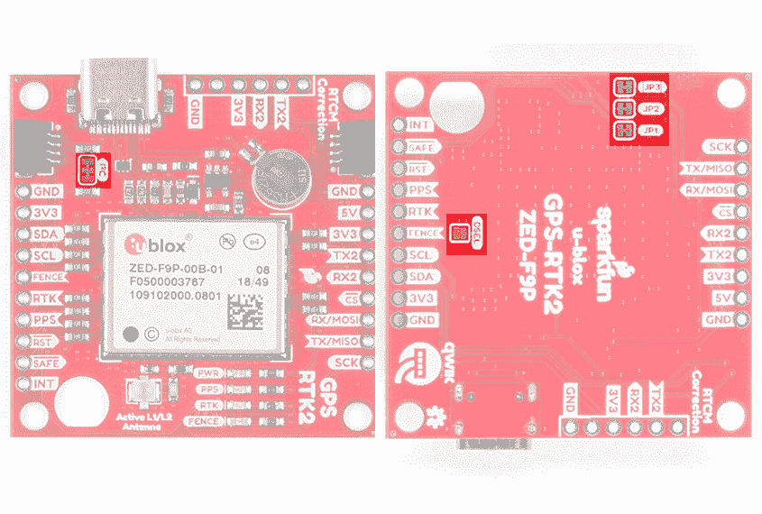
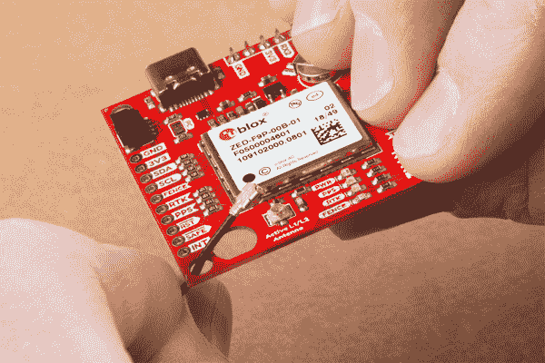
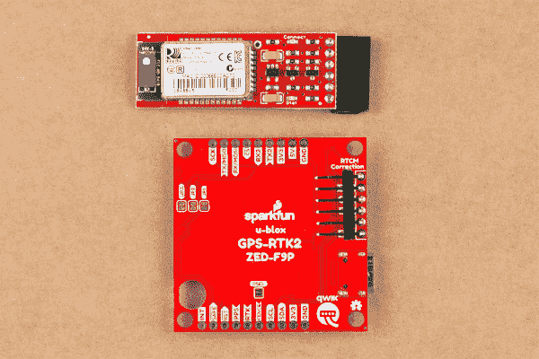

# GPS-RTK2 连接指南

> 原文：<https://learn.sparkfun.com/tutorials/gps-rtk2-hookup-guide>

## 介绍

[SparkFun GPS-RTK2](https://www.sparkfun.com/products/15136) 和 [GPS-RTK-SMA](https://www.sparkfun.com/products/16481) 提高了高精度 GPS 的标准。利用 u-blox 最新的 ZED-F9P 模块，RTK2 和 RTK-SMA 能够达到 10 毫米 3 维精度。是的，你没看错，这些板可以输出你的 X，Y，Z 位置，大概是你指甲的宽度。强大的能力带来了一些要求:高精度 GPS 需要清晰的天空视野(抱歉，没有室内位置)和来自 RTCM 源的一系列校正数据。我们将在后面的章节中对此进行更深入的讨论，但只要您有两个 ZED-F9P 分线板，或者可以访问在线校正源，您的 ZED-F9P 就可以以厘米级的精度输出纬度、经度和高度。

[](https://www.sparkfun.com/products/15136) 

将**添加到您的[购物车](https://www.sparkfun.com/cart)中！**

 **### [【spark fun GPS-RTK 2 Board-ZED-F9P(Qwiic)](https://www.sparkfun.com/products/15136)

[In stock](https://learn.sparkfun.com/static/bubbles/ "in stock") GPS-15136

SparkFun GPS-RTK2 是 ZED-F9P 模块的一个强大突破。ZED-F9P 是 GNSS 和 GPS 系统的顶级模块

$274.9521[Favorited Favorite](# "Add to favorites") 61[Wish List](# "Add to wish list")****[](https://www.sparkfun.com/products/16481) 

将**添加到您的[购物车](https://www.sparkfun.com/cart)中！**

 **### [踢腿式 GPS-RTK-SMA 突围-zed-F9(qwiic)T3](https://www.sparkfun.com/products/16481)

[In stock](https://learn.sparkfun.com/static/bubbles/ "in stock") GPS-16481

SparkFun GPS-RTK-SMA 提高了高精度 GPS 的标准，是一系列功能强大的 RTK 板中最新的一款

$274.9511[Favorited Favorite](# "Add to favorites") 33[Wish List](# "Add to wish list")**** ****[https://www.youtube.com/embed/HsaeGcB3Cj0/?autohide=1&border=0&wmode=opaque&enablejsapi=1](https://www.youtube.com/embed/HsaeGcB3Cj0/?autohide=1&border=0&wmode=opaque&enablejsapi=1)

[https://www.youtube.com/embed/5rCFLwCEtqM/?autohide=1&border=0&wmode=opaque&enablejsapi=1](https://www.youtube.com/embed/5rCFLwCEtqM/?autohide=1&border=0&wmode=opaque&enablejsapi=1)

**Note:** For those looking for the bare minimum without a microcontroller, check out the [GPS-RTK-SMA Kit](https://www.sparkfun.com/products/18292). This includes the GNSS multi-band antenna, USB cable, ZED-F9P breakout board with SMA connector, and GPS antenna ground plate.

[](https://www.sparkfun.com/products/18292) 

将**添加到您的[购物车](https://www.sparkfun.com/cart)中！**

 **### [踢腿 gps-rtk-sma 工具包](https://www.sparkfun.com/products/18292)

[Only 4 left!](https://learn.sparkfun.com/static/bubbles/ "only 4 left!") KIT-18292

SparkFun GPS-RTK-SMA 套件提供了您开始使用 GPS 实时运动学和 u-blox ZED-F 所需的一切

$324.952[Favorited Favorite](# "Add to favorites") 2[Wish List](# "Add to wish list")** **### 推荐阅读

在开始之前，请务必查看我们的[什么是 GPS RTK？](https://learn.sparkfun.com/tutorials/what-is-gps-rtk)教程，如果你想预读一点，看看我们的[开始使用 U-Center](https://learn.sparkfun.com/tutorials/getting-started-with-u-center-for-u-blox) 。

[](https://learn.sparkfun.com/tutorials/i2c) [### I2C](https://learn.sparkfun.com/tutorials/i2c) An introduction to I2C, one of the main embedded communications protocols in use today.[Favorited Favorite](# "Add to favorites") 128[](https://learn.sparkfun.com/tutorials/serial-basic-hookup-guide) [### 串行基本连接指南](https://learn.sparkfun.com/tutorials/serial-basic-hookup-guide) Get connected quickly with this Serial to USB adapter.[Favorited Favorite](# "Add to favorites") 10[](https://learn.sparkfun.com/tutorials/what-is-gps-rtk) [### 什么是 GPS RTK？](https://learn.sparkfun.com/tutorials/what-is-gps-rtk) Learn about the latest generation of GPS and GNSS receivers to get 14mm positional accuracy 9[](https://learn.sparkfun.com/tutorials/getting-started-with-u-center-for-u-blox) [### u-blox 的 U-Center 入门](https://learn.sparkfun.com/tutorials/getting-started-with-u-center-for-u-blox) Learn the tips and tricks to use the u-blox software tool to configure your GPS receiver.[Favorited Favorite](# "Add to favorites") 2

## 硬件概述

ZED-F9P 与几乎所有其他低成本 RTK 解决方案的主要区别之一是，ZED-F9P 能够接收 L1 和 L2 频段。

[](https://cdn.sparkfun.com/assets/learn_tutorials/8/5/6/GPS_RTK_L1_and_L2_bands.jpg)

### 通信端口

ZED-F9P 的独特之处在于它有五个同时激活的*通信端口。你可以通过 I ² C 读取 NMEA 数据，同时通过 UART 发送配置命令，反之亦然。唯一的限制是 SPI 引脚映射到 I ² C 和 UART 引脚，因此它要么是 SPI，要么是 I ² C+UART。USB 端口随时可用。*

| [](https://cdn.sparkfun.cuom//assets/parts/1/3/5/1/4/15136-SparkFun_GPS-RTK2_Board_-_ZED-F9P__Qwiic_-04.jpg) | [](https://cdn.sparkfun.com/assets/learn_tutorials/8/5/6/16481-SparkFun_GPS-RTK-SMA_Breakout_-_ZED-F9P__Qwiic_-04a.jpg) |
| *SparkFun GPS-RTK2 板* | *SparkFun GPS-RTK-SMA 板* |

### 通用串行总线

USB C 连接器可以很容易地将 ZED-F9P 连接到 u-center 进行配置和快速查看 NMEA 句子。也可以通过 USB 连接 Raspberry Pi 或其他单板电脑。ZED-F9P 枚举为一个串行 COM 端口，它是一个独立于 UART 接口的串行端口。参见[U-Center](https://learn.sparkfun.com/tutorials/getting-started-with-u-center-for-u-blox)入门，了解有关将 USB 端口变为串行 COM 端口的更多信息。

| [](https://cdn.sparkfun.com/assets/learn_tutorials/8/5/6/15136-SparkFun_GPS-RTK2_Board_ZED-F9P_Qwiic_I2C-USB_5V_3V3.jpg) | [](https://cdn.sparkfun.com/assets/learn_tutorials/8/5/6/16481-SparkFun_GPS-RTK-SMA_Board_ZED-F9P_Qwiic_I2C-USB_5V_3v3.jpg) |
| *USB 端口和电源 GPS-RTK2* | *USB 端口和电源 GPS RTK-SMA* |

提供一个 3.3V 调节器，将 5V USB 电压下调至模块所需的 **3.3V** 。可以施加外部 5V 电压，也可以直接提供 3.3V 电压。请注意，如果您直接为电路板提供 3.3V 电压，它应该是一个干净的电源，噪声极小(小于 50mV 的 VPP 纹波是精确定位的理想选择)。

3.3V 调节器能够从 5V 输入获得 600mA 电流，USB C 连接能够获得 2A。

### I ² C(又名 DDC)

u-blox ZED-F9P 有一个“DDC”端口，这实际上只是一个 I ² C 端口(没有商标问题的所有麻烦)。这些引脚与 SPI 引脚共享。默认情况下，I ² C 引脚被启用。确保主板背面的 DSEL 跳线是打开的。SparkFun 的 GPS-RTK2 和 GPS-RTK-SMA 还包括两个 Qwiic 连接器，可以将这款 GPS 接收机与各种 I ² C 设备菊花链连接。为你的下一个项目结帐。

[](#carousel-63c18d5d97722)[](#carousel-63c18d5d97722)*Highlighted I2C port and Qwiic connectors on the RTK2 and RTK-SMA*

所有功能都可以通过 I ² C 端口访问，包括读取 NMEA 语句、发送 UBX 配置字符串、将 RTCM 数据传输到模块等。我们已经编写了一个扩展的 Arduino 库，展示了如何配置 ZED-F9P 的大多数方面，使 I ² C 成为我们在 ZED 上首选的通信方式。你可以通过 Arduino library manager 搜索' **SparkFun u-blox GNSS** '获得该库。查看 [SparkFun u-blox 库](https://learn.sparkfun.com/tutorials/gps-rtk2-hookup-guide#sparkfun-u-blox-arduino-library)部分了解更多信息。

### UART/串行

ZED-F9P 提供经典串行引脚，但与 SPI 引脚共享。默认情况下，UART 引脚使能。确保主板背面的 DSEL 跳线是打开的。

*   TX/MISO =来自 ZED-F9P 的 TX out
*   RX/MOSI = RX into ZED-F9P

[](#carousel-63c18d5d9774a)[](#carousel-63c18d5d9774a)*Serial pins on SparkFun ZED-F9P breakout boards highlighted*

ZED-F9P 还有第二个串行端口(UART2 ),主要用于 RTCM3 校正数据。默认情况下，该端口将自动接收和解析输入的 RTCM3 字符串，从而在板上启用 RTK 模式。除了 TX2/RX2 引脚，我们还增加了一个额外的“ **RTCM 校正**”端口，在这里我们安排了引脚以匹配工业标准串行连接(也称为“FTDI”引脚排列)。这种引脚排列与我们的[蓝牙配对](https://www.sparkfun.com/products/12576)和[串行基本](https://www.sparkfun.com/products/15096)兼容，所以你可以从手机或电脑发送 RTCM 校正数据。注意，如果需要，RTCM3 数据也可以通过 I ² C、UART1、SPI 或 USB 发送。

| [](https://cdn.sparkfun.com/assets/learn_tutorials/8/5/6/15136-SparkFun_GPS-RTK2_Board_ZED-F9P_Qwiic_I2C-UART2_RTCM_Correction.jpg) | [](https://cdn.sparkfun.com/assets/learn_tutorials/8/5/6/16481-SparkFun_GPS-RTK-SMA_Board_ZED-F9P_Qwiic_I2C-UART2_RTCM_Correction.jpg) |
| *GPS-RTK 2 上的 UART2 和 RTCM 校正端口* | *GPS-RTK-SMA 上的 UART2 和 RTCM 校正端口* |

RTCM 校正端口(UART2)默认为 **38400bps** 串行，但可以通过软件命令(查看我们的 Arduino 库)或使用 u-center 通过 USB 进行配置。请记住，我们的蓝牙伴侣默认为 **115200bps** 。如果您计划使用蓝牙来校正数据(我们发现这是最简单的)，我们建议您使用 u-center 将此端口速度提高到 115200bps。此外，UART2 可以配置为 NMEA 输出，但这种情况不太常见。一般来说，除了 RTCM 校正数据，我们不使用 UART2，所以我们建议将输入/输出协议保留为 RTCM。

[](https://cdn.sparkfun.com/assets/learn_tutorials/8/5/6/ZED-F9P_UART2_Configuration.jpg)

如果你已经将 ZED-F9P 设置为基站模式(也称为*勘测输入*模式)，UART2 将*输出* RTCM3 校正数据。这意味着你可以连接一个无线电或有线链接到 UART2，板将自动发送*只是* RTCM 字节通过链接(没有 NMEA 数据占用带宽)。这里是一个使用 RTK2 的例子，但你也可以使用 RTK-SMA 使用相同的设置。

[](https://cdn.sparkfun.com/assets/learn_tutorials/8/5/6/SparkFun_GPS-RTK2_Board_-_Bluetooth_Attached.jpg)*Base station setup to send RTCM bytes out over Bluetooth*

### 精力

ZED-F9P 也可以配置为 SPI 通信。默认情况下，SPI 端口禁用。要启用 SPI，请关闭电路板背面的 DSEL 跳线。关闭该跳线将禁用 UART1 和 I ² C 接口(UART2 将继续正常运行)。

[](#carousel-63c18d5d97766)[](#carousel-63c18d5d97766)*The SPI pins highlighted on the SparkFun RTK2 and RTK-SMA*

### 控制引脚

下面突出显示了控制引脚。

| [](https://cdn.sparkfun.com/assets/learn_tutorials/8/5/6/15136-SparkFun_GPS-RTK2_Board_ZED-F9P_Qwiic_I2C-Control_Pins.jpg) | [](https://cdn.sparkfun.com/assets/learn_tutorials/8/5/6/16481-SparkFun_GPS-RTK-SMA_Board_ZED-F9P_Qwiic_I2C-Control_Pins.jpg) |
| *spark fun GPS-RTK 2 的高亮控制引脚* | SparkFun GPS-RTK-SMA 的高亮控制引脚 |

这些引脚用于 ZED-F9P 的各种额外控制:

*   **栅栏:** Geofence 输出引脚。配置有 U 型中心。设置地理围栏后，将变为高电平或低电平。当模块退出设定的边界时，用于触发警报和动作。
*   **RTK:** 实时运动输出引脚。当模块处于正常 GPS 模式时，保持高电平。当接收到 RTCM 校正且模块进入 RTK 浮点模式时，开始闪烁。当模块进入 RTK 固定模式并开始输出厘米级精确位置时，变为低电平。
*   **PPS:** 每秒脉冲输出引脚。当模块获得基本 GPS/GNSS 位置锁定时，开始以 1Hz 的频率闪烁。

*   **RST:** 复位输入引脚。将此线拉低以复位模块。

*   **SAFE:** Safeboot 输入 pin。这是模块固件更新所必需的，通常不应使用或连接。
*   **INT:** 中断输入/输出引脚。可以使用 U-Center 进行配置，以将模块从深度睡眠中唤醒，或者针对各种模块状态输出中断。

**Note:** For those that need to connect a SMA connector to the PPS pin, the RTK-SMA includes a footprint so that you can [manually solder](https://learn.sparkfun.com/tutorials/how-to-solder-through-hole-soldering) the connector to the board for your application. The PPS output is helpful as a clock source correction when synchronizing equipment (not 1 Hz but in many MHz). The PPS output can be configured to output a very accurate clock which scientists use to correct less accurate, but much faster clocks. To configure, you can use the u-center to adjust The NEO-F9P's setting under **View** > **Conviguration View** > **TP (TimePulse)**.

[](https://www.sparkfun.com/products/593) 

将**添加到您的[购物车](https://www.sparkfun.com/cart)中！**

 **### [SMA 连接器](https://www.sparkfun.com/products/593)

[In stock](https://learn.sparkfun.com/static/bubbles/ "in stock") WRL-00593

PCB 边缘安装- SMA 射频连接器。非常适合需要天线连接的 GPS 和蜂窝设备的原型制作…

$2.10[Favorited Favorite](# "Add to favorites") 4[Wish List](# "Add to wish list")** **### 天线

ZED-F9P 需要高质量的 GPS 或 GNSS(首选)天线。提供了一种 U.FL 连接器。注意:U.FL 连接器仅额定几个配合周期(大约 30 °),所以我们建议您设置它并忘记它。根据您的应用，您可能需要固定 u.FL 到 SMA 电缆。否则，您可以使用 RTK-SMA 版本。

| [](https://cdn.sparkfun.com/assets/learn_tutorials/8/5/6/15136-SparkFun_GPS-RTK2_Board_ZED-F9P_Qwiic_I2C-uFL_Antenna.jpg) | [](https://cdn.sparkfun.com/assets/learn_tutorials/8/5/6/16481-SparkFun_GPS-RTK-SMA_Board_ZED-F9P_Qwiic_I2C-SMA_Antenna.jpg) |
| *GPS RTK 2 上的 U.FL 天线连接器和 SMA 切口* | *GPS-SMA 上的 SMA 天线连接器* |

SMA 舱壁的切口可用于那些想要额外坚固连接的人。我们建议仅当主板安装在机箱中时，才在主板中安装 SMA。否则，电缆会有被压缩时损坏的风险(例如，学生将冲浪板松散地放在背包中)。交流电

[](https://cdn.sparkfun.com/assets/learn_tutorials/8/5/6/SparkFun_GPS-RTK2_Board_-_SMA_Threaded.jpg)

穿过安装孔的 [U.FL 到 SMA 电缆](https://www.sparkfun.com/products/9145)提供了一个坚固的连接，如果需要，也可以很容易地在 SMA 连接处断开。查看下面的**连接天线**了解更多信息。

可以使用低成本的磁性 [GPS/GNSS 天线](https://www.sparkfun.com/categories/18)(查看 [u-blox 白皮书](https://cdn.sparkfun.com/assets/learn_tutorials/8/1/4/AntennasForRTK_WhitePaper__UBX-16010559_.pdf))但是需要在天线下放置一个 4" / 10cm 的金属圆盘作为[金属接地面](https://www.sparkfun.com/products/15004)。

[](https://cdn.sparkfun.com//assets/parts/1/3/3/1/9/15004-GPS_Antenna_Ground_Plate-04.jpg)

### 发光二极管

该板包括四个状态指示灯，如下图所示。

| [](https://cdn.sparkfun.com/assets/learn_tutorials/8/5/6/15136-SparkFun_GPS-RTK2_Board_ZED-F9P_Qwiic_I2C-Status_LEDs.jpg) | [](https://cdn.sparkfun.com/assets/learn_tutorials/8/5/6/16481-SparkFun_GPS-RTK-SMA_Board_ZED-F9P_Qwiic_I2C-Status_LEDs.jpg) |
| *GPS-RTK 2 上的状态指示灯* | *GPS-SMA 上的状态指示灯* |

*   **PWR:** 当通过 USB 或 Qwiic 总线激活 3.3V 时，电源 LED 将点亮。
*   **PPS:** 一旦达到位置锁定，每秒脉冲 LED 将每秒点亮一次。
*   **RTK:**RTK LED 将在通电时持续点亮。一旦成功接收到 RTCM 数据，它将开始闪烁。这是一个很好的方法来看看 ZED-F9P 是否从各种来源获得 RTCM。一旦获得 RTK 定位，LED 将关闭。
*   **围栏:**围栏 LED 可配置为地理围栏应用的开/关。

### 针织套衫

有五个跳线用于配置 GPS-RTK2。

[](#carousel-63c18d5d9b08d)[](#carousel-63c18d5d9b08d)*User jumpers on the SparkFun RTK2 and RTK-SMA*

用焊料闭合 **DSEL** 启用 SPI 接口，禁用 UART 和 I ² C 接口。USB 仍然可以工作。

切断 **I ² C** 跳线将从 I ² C 总线上移除 2.2k 欧姆电阻。如果您的 I ² C 总线上有许多设备，您可能需要移除这些跳线。不知道怎么剪跳线？[看这里！](https://learn.sparkfun.com/tutorials/how-to-work-w-jumper-pads-and-pcb-traces/cutting-a-trace-between-jumper-pads)

切断 RTK2 上的 **JP1** 、 **JP2** 、 **JP3** 跳线将断开各种状态 led 与其相关引脚的连接。这些已在 RTK-SMA 版本上标注。我们在 RTK-SMA 的顶部和底部为 **PPS** 提供了跳线。

### 备用电池

MS621FE 充电电池维持 GNSS 模块上的电池后备 RAM (BBR)。这允许更快的位置锁定(又名热启动)。BBR 也用于模块配置保持。当通电时，电池会自动涓流充电，并应在断电的情况下保持设置和 GNSS 轨道数据长达两周。

| [](https://cdn.sparkfun.com/assets/learn_tutorials/8/5/6/15136-SparkFun_GPS-RTK2_Board_ZED-F9P_Qwiic_I2C-Backup_Battery_Hot_Start.jpg) | [](https://cdn.sparkfun.com/assets/learn_tutorials/8/5/6/16481-SparkFun_GPS-RTK-SMA_Board_ZED-F9P_Qwiic_I2C-Backup_Battery_Hot_Start.jpg) |
| *spark fun RTK 2 上的备用电池* | *spark fun RTK-SMA 上的备用电池* |

### 连接天线

单位 FL 连接器非常好，但它们是为在笔记本电脑等小型嵌入式应用中实现而设计的。将 U.FL 连接器暴露在野外会有损坏的风险。为防止损坏 GPS-RTK2 上的 U.FL 连接，我们建议将 U.FL 电缆穿过支座孔，然后连接 U.FL 连接器。这将极大地减轻天线连接的应力。现在附上你选择的 SMA 天线。

[](https://cdn.sparkfun.com/assets/learn_tutorials/8/5/6/SparkFun_GPS-RTK2_Board_-_UFL_Connection.jpg)**Be Careful!** U.FL connectors are easily damaged. Make sure the connectors are aligned, flush face to face (not at an angle), then press down using a rigid blunt edge such as the edge of a PCB or point of a small flat head screwdriver. For more information checkout our tutorial [Three Quick Tips About Using U.FL](https://learn.sparkfun.com/tutorials/three-quick-tips-about-using-ufl/all).

[](https://learn.sparkfun.com/tutorials/three-quick-tips-about-using-ufl) [### 关于使用 U.FL 的三个快速提示

#### 2018 年 12 月 28 日](https://learn.sparkfun.com/tutorials/three-quick-tips-about-using-ufl) Quick tips regarding how to connect, protect, and disconnect U.FL connectors.[Favorited Favorite](# "Add to favorites") 14

此外，如果需要，还提供一个隔板切口，用于将 SMA 拧到 PCB 上。

[](https://cdn.sparkfun.com/assets/learn_tutorials/8/5/6/SparkFun_GPS-RTK2_Board_-_SMA_Threaded.jpg)

虽然这种方法减少了 U.FL 连接器的应力，但仅当电路板被永久安装时才推荐使用。如果未安装该板，U.FL 电缆上的电缆容易扭结，导致阻抗变化，可能会降低接收质量。

如果您使用 RTK-SMA，无需担心这一点，因为电路板上焊接有一个 SMA 连接器，可提供牢固的连接。

[](https://cdn.sparkfun.com/assets/learn_tutorials/8/5/6/16481-SparkFun_GPS-RTK-SMA_Breakout_-_ZED-F9P__Qwiic_-01a.jpg)

如果你在室内，你*必须*运行一根足够长的 SMA 延长线，以将天线定位在可以清晰看到天空的位置。这意味着在天线和天空之间没有树木、建筑、墙壁、车辆或混凝土金属物。确保将天线安装在 4 英寸/10 厘米[的金属接地板](https://www.sparkfun.com/products/15004)上，以增强接收效果。

[](https://cdn.sparkfun.com/assets/learn_tutorials/8/1/4/GPS_RTK_Antenna_with_clear_view_of_sky.jpg)

### 电路板尺寸

每块板的整体尺寸约为 1.70 英寸 x 1.70 英寸(约 43.18 毫米 x 43.18 毫米)。请记住，连接器不与电路板齐平，这会增加电路板的长度。在外壳中安装和放置主板时，请务必考虑这一点。

| [](https://cdn.sparkfun.com/assets/learn_tutorials/8/5/6/SparkFun_Qwiic_GPS-RTK2_ZED-F9P_Board_Dimensions.png) | [](https://cdn.sparkfun.com/assets/6/0/c/0/d/SparkFun-GPS-RTK-SMA-ZED-F9P_Board_Dimensions.png) |
| 【RTK2 的电路板尺寸 | *RTK-SMA 的电路板尺寸* |

## 将 ZED-F9P 连接至校正源

在开始野外工作之前，最好了解如何获取 RTCM 数据以及如何将其传输到 GPS-RTK2 和 GPS-RTK-SMA。我们建议您阅读原始 GPS-RTK 教程的[连接校正源](https://learn.sparkfun.com/tutorials/gps-rtk-hookup-guide/all#connecting-the-gps-rtk-to-a-correction-source)部分。这将为您提供如何获得 UNAVCO 帐户以及如何在使用 ZED-F9P 漫游者的 10 公里范围内识别挂载点的基础知识。本节基于这些概念。

| [](https://learn.sparkfun.com/tutorials/gps-rtk-hookup-guide/all#connecting-the-gps-rtk-to-a-correction-source) |
| *[GPS RTK 连接指南:连接校正源](https://learn.sparkfun.com/tutorials/gps-rtk-hookup-guide/all#connecting-the-gps-rtk-to-a-correction-source)* |

对于这个例子，我们将展示如何从 UNAVCO 网络获取校正数据，并使用名为 [NTRIP Client](http://lefebure.com/software/android-ntripclient/) 的 Android 应用程序获取这些数据。然后，使用 [SparkFun Bluetooth Mate](https://www.sparkfun.com/products/12576) ，校正数据将通过蓝牙从应用程序传输到 ZED-F9P。

### 所需材料

*   1x [GPS-RTK2](https://www.sparkfun.com/products/15136) 或 [GPS-RTK-SMA](https://www.sparkfun.com/products/16481)
*   1x GPS 或 [GNSS 天线](https://www.sparkfun.com/products/14986)
*   1 个 4 英寸或更大的金属板
*   1 根 SMA 延长线(如果需要获得清晰的天空视野)
*   1x [USB C 2.0 线缆](https://www.sparkfun.com/products/15092)
*   1x [蓝牙配对](https://www.sparkfun.com/products/12576)
*   1x [公](https://www.sparkfun.com/products/553)和[母](https://www.sparkfun.com/products/115)接头对

[](https://cdn.sparkfun.com/assets/learn_tutorials/8/1/4/SparkFun_GPS_RTK_Antenna_on_a_camera_tripod.jpg)*GNSS antenna sitting on a metal ground plate elevated with clear view of the sky*

现在设置好你的 GPS 接收器，这样你就可以在办公桌上工作，但要把天线放在室外，这样可以清楚地看到天空。

### 所需软件

*   免费 RTCM 提供商(如 UNAVCO)的凭证
*   [U 形中心](https://www.u-blox.com/en/product/u-center)
*   从 Google Play 获取 NTRIP By Lefebure 应用程序。似乎有适用于 iOS 的 NTRIP 应用程序，但我们无法具体验证任何一个应用程序。如果你有喜欢的，请告诉我们。

首先，我们需要将蓝牙模块连接到 ZED-F9P 的分线板。将母接头焊接到蓝牙配对上，使其悬挂在末端。

[](https://cdn.sparkfun.com/assets/learn_tutorials/8/5/6/SparkFun_GPS-RTK2_Board_-_Bluetooth_Mate_with_Headers.jpg)

在 GPS-RTK2 或 GPS_RTK-SMA 板上，我们建议将[焊接](https://learn.sparkfun.com/tutorials/how-to-solder---through-hole-soldering)板下的直角公接头。这将允许蓝牙模块简洁地塞在电路板下。

将 Bluetooth Mate 连接到电路板时，请确保对齐针脚，以便两块电路板上的 **GND** 指示器对齐。安装蓝牙后，连接 GNSS 天线并通过 USB 连接主板。这将为板和蓝牙配对供电。

[](https://cdn.sparkfun.com/assets/learn_tutorials/8/5/6/SparkFun_GPS-RTK2_Board_-_USB_C_connected.jpg)

男女头去哪是个人喜好。例如，这里有两个蓝牙伴侣；一个带有公接头，一个带有母接头。

[](https://cdn.sparkfun.com/assets/learn_tutorials/8/5/6/SparkFun_GPS-RTK2_Board_-_Bluetooth_Options.jpg)

将母接头焊接到蓝牙配对上可以更容易地将蓝牙添加到具有“FTDI”类型连接的电路板上，如我们的 [OpenScale](https://www.sparkfun.com/products/13261) 、 [Arduino Pro](https://www.sparkfun.com/products/10915) 或[同步 RFID 阅读器](https://www.sparkfun.com/products/14066)。然而，将插头焊接到蓝牙 Mate 会使其更易于在试验板中使用。真的取决于你！

蓝牙 Mate 默认为 **115200bps** ，而 ZED-F9P 期望 UART2 上的串行为 **38400bps** 。要解决这个问题，我们需要打开 u-center 并更改 UART2 的端口设置。如果你还没有，一定要看看教程[开始使用 U-Center](https://learn.sparkfun.com/tutorials/getting-started-with-u-center-for-u-blox/all) 来找到你的方向。

打开配置窗口并导航至 **PRT(端口)**部分。将目标设置为 UART2，并将波特率设置为 **115200** 。最后，点击“发送”按钮。

[](https://cdn.sparkfun.com/assets/learn_tutorials/8/5/6/ZED-F9P_UART2_Configuration.jpg)

到这个时候，你应该有一个大约 1.5 米精度的有效的 3D GPS 锁。它将会变得更好。

我们假设您已经阅读了原始的 [RTK 教程](https://learn.sparkfun.com/tutorials/gps-rtk-hookup-guide/all#connecting-the-gps-rtk-to-a-correction-source)，并获得了您的 UNAVCO 证书，包括以下内容:

*   用户名
*   密码
*   UNAVCO 的 IP 地址(在编写本报告时为 69.44.86.36)
*   脚轮端口(撰写本文时为 2101)
*   数据流又称为装载点(如果您想要靠近科罗拉多州博尔德的装载点，则为“P041_RTCM3 ”,但您应该真正找到离您的漫游者位置最近的装载点)

蓝牙配对应通电。从您的手机中，发现蓝牙配对并与之配对。本教程中使用的模块被发现为 **RNBT-E0DC** ，其中 *E0DC* 是模块的 MAC 地址的最后四个字符，并且对于您的模块应该是唯一的。

一旦你有了你的 UNAVCO 凭证并且你已经与蓝牙模块配对，打开 NTRIP 客户端。

[](https://cdn.sparkfun.com/assets/learn_tutorials/8/5/6/NTRIP-Client-Main.jpg)

在主屏幕上，点击右上角的齿轮，然后点击*接收器设置*。

[](https://cdn.sparkfun.com/assets/learn_tutorials/8/5/6/NTRIP-Client-ReceiverSettings.jpg)

验证*接收器连接*是否设置为蓝牙，然后选择*蓝牙设备*并选择您刚刚配对的蓝牙模块。接下来，打开 NTRIP 设置并输入您的凭证，包括挂载点(又名*数据流*)。

[](https://cdn.sparkfun.com/assets/learn_tutorials/8/5/6/NTRIP-Client-ServerSettings-2.jpg)

本例演示了如何从 UNAVCO 的服务器获取校正数据，但您也可以使用另一个 ZED-F9P 和 [RTKLIB](http://www.rtklib.com/) 来广播校正数据，从而类似地设置您自己的基站。这个 NTRIP 应用程序可以连接到你的基于 RTKLIB 的服务器，给你一些惊人的灵活性(基站可以在你的漫游者 10 公里内有笔记本电脑和 Wifi 的任何地方)。

好的。准备好了吗？这是有趣的部分。返回 NTRIP 主窗口，点击**连接**。该应用程序将连接到蓝牙模块。一旦连接，它将连接到您的 NTRIP 源。一旦数据开始流动，你会看到每秒钟的字节数都在增加。

[](https://cdn.sparkfun.com/assets/learn_tutorials/8/5/6/NTRIP-Downloading-Correction-Data.jpg)

几秒钟内，你应该会看到 ZED-F9P 分线板上的 **RTK** LED 熄灭。这表明您有 RTK 修复。要验证这一点，请在您的计算机上打开 u-center。首先要注意的是，左侧黑色窗口中的**修复模式**从 *3D* 变为 *3D/DGNSS/FIXED* 。

[](https://cdn.sparkfun.com/assets/learn_tutorials/8/5/6/17mm_Accuracy.jpg)

导航到 UBX-NAV-HPPOSECEF 消息。这将向您展示一个高精度的 3D 精度估计。我们能够使用带有金属板接地层的低成本 GNSS 天线实现 17 毫米的精度*和*我们距离校正站超过 10 公里。

恭喜你。你现在知道你在一角硬币直径内的位置了！

## SparkFun u-blox Arduino 图书馆

**Note:** This example assumes you are using the latest version of the Arduino IDE on your desktop. If this is your first time using Arduino, please review our tutorial on [installing the Arduino IDE.](https://learn.sparkfun.com/tutorials/installing-arduino-ide) If you have not previously installed an Arduino library, please check out our [installation guide.](https://learn.sparkfun.com/tutorials/installing-an-arduino-library)

SparkFun u-blox Arduino 库支持读取所有位置基准，并通过 I ² C 发送二进制 UBX 配置命令。这有助于配置高级模块，如 ZED-F9P 以及 NEO-M8P-2、SAM-M8Q 和任何其他使用 u-blox 二进制协议的 u-blox 模块。

SparkFun u-blox Arduino 库可以通过搜索' **SparkFun u-blox GNSS** '使用 Arduino 库管理器下载，或者您可以从 [GitHub 库](https://github.com/sparkfun/SparkFun_u-blox_GNSS_Arduino_Library)获取 zip 文件:

[SparkFun U-blox Arduino Library (ZIP)](https://github.com/sparkfun/SparkFun_u-blox_GNSS_Arduino_Library/archive/main.zip)

一旦你安装了库，就可以检查各种例子。

*   **例 1:** 使用 u-blox 模块 SAM-M8Q、NEO-M8P 等阅读 I ² C 上的 NMEA 句子
*   **示例 2:** 使用 MicroNMEA 库解析 NMEA 句子。这个例子还演示了如何重写`processNMEA`函数，这样你就可以将来自 u-blox 模块的 NMEA 字符定向到你喜欢的任何库、显示器、收音机等。
*   **示例 3:** 获取纬度、经度、高度和可见卫星(SIV)。这个例子还演示了如何关闭从 I ² C 端口发出的 NMEA 消息。你仍然可以在 UART1 和 USB 上看到 NMEA，但在 I ² C 上看不到。仅使用 UBX 二进制消息有助于减少 I ² C 流量，并且是一个重量轻得多的协议。
*   **示例 4:** 显示您的定位类型，最常见的两种是无定位和全 3D 定位。此草图还显示了如何确定您是否有 RTK 修复以及修复的类型(浮动与固定)。
*   **示例 5:** 显示了如何获取当前速度、航向和精度因子。
*   **Example6:** 演示如何将输出速率从默认的每秒 1 个提高到每秒多个；某些模块高达 30Hz！
*   **例 7:**SAM-M8Q 等旧模块使用旧协议(版本 18)，而 ZED-F9P 等新模块使用最新协议(版本 27)删除一些命令。该草图显示了如何查询模块以获取协议版本。
*   **示例 8:** u-blox 模块使用 I ² C 地址 0x42，但这可通过软件配置。该草图将允许您更改模块的 I ² C 地址。
*   **例 9:** 海拔不是简单的测量。这张草图显示了如何获得基于椭球面的高度和基于 MSL(平均海平面)的高度读数。
*   **例 10:** 有时候你只需要对硬件进行硬复位。该草图显示了如何将 u-blox 模块设置回出厂默认设置。
*   **NEO-M8P**
    *   **NEO-M8P 示例 1:** 发送 UBX 二进制命令，启用 u-blox NEO-M8P-2 模块上的 RTCM 语句。此示例是将 NEO-M8P 设置为基站所需的步骤之一。要了解更多信息，请查看 u-blox 设置 RTK 链接的手册。
    *   **NEO-M8P 示例 2:** 本示例扩展了前面的示例，将所有命令发送到 NEO-M8P-2，使其作为基础运行。此外，`processRTCM`功能被暴露。这允许用户重写该功能，以将 RTCM 字节定向到用户想要的任何连接(无线电、串行等)。
    *   **NEO-M8P 示例 3:** 这是与 NEO-M8P 的示例 2 相同的示例。然而，数据通过 I ² C 发送到串行 LCD
*   **ZED-F9P**
    *   **ZED-F9P 示例 1:** 该模块能够实现高精度解决方案。这张草图显示了如何检查解决方案的准确性。看着我们的定位精度下降到毫米级是很有趣的。
    *   **ZED-F9P 例 2:**ZED-F9P 采用了 VALGET/VALSET/VALDEL 的全新 u-blox 配置系统。这张草图展示了这些方法的基础。
    *   **ZED-F9P 例 3:** 设置 ZED-F9P 为基站，输出 RTCM 数据。
    *   **ZED-F9P 示例 4:** 这是与 ZED-F9P 的示例 3 相同的示例。然而，数据通过 I ² C 发送到串行 LCD

这个 SparkFun u-blox 库真正关注 I ² C，因为它比串行更快，并且支持菊花链。该库也使用 UBX 协议，因为它比 NMEA 解析需要更少的开销，并且没有 NMEA 的精度限制。

## 将 ZED-F9P 设置为校正源

**Heads up!** This section is a bit out of date. We've got a shiny new [How to Build a GNSS Reference Station](https://learn.sparkfun.com/tutorials/how-to-build-a-diy-gnss-reference-station) tutorial that provides up to date information. We plan to keep this section for reference.

如果您的位置距离校正站超过 20 公里，您可以使用 ZED-F9P 创建自己的校正站。u-blox 在 [ZED-F9P 集成手册](https://cdn.sparkfun.com/assets/learn_tutorials/8/5/6/ZED-F9P_Integration_Manual.pdf)中提供了设置指南，显示了通过 u-Center 所需的各种设置。我们将只讲述如何使用 I ² C 命令来设置 ZED-F9P。这将实现输出 RTCM 校正数据的基站的无头(无计算机)配置。

在开始之前，我们建议您使用 u-center 配置模块。使用 U-Center 查看我们关于[的教程，然后阅读](https://learn.sparkfun.com/tutorials/getting-started-with-u-center-for-u-blox) [u-blox 集成手册](https://cdn.sparkfun.com/assets/learn_tutorials/8/5/6/ZED-F9P_Integration_Manual.pdf)的第 **3.5.8 节基站配置**以获取使用 U-Center 为 RTK 配置的 ZED-F9P。一旦你在你的实验室里使用 u-center 成功地控制了模块，然后考虑去户外。

在本练习中，我们将使用以下零件:

*   1x [SparkFun GPS-RTK2 板](https://www.sparkfun.com/products/15136)或 [RTK-SMA 板](https://www.sparkfun.com/products/16481)
*   用于 RTK2 的 1x [U.FL 至 SMA 电缆](https://www.sparkfun.com/products/9145)
*   1x [SparkFun 黑板](https://www.sparkfun.com/products/14669)让 I ² C 变得简单
*   1 根 [USB C 2.0 线缆](https://www.sparkfun.com/products/15092)如果您需要的话
*   1x [两根 Qwiic 电缆](https://www.sparkfun.com/search/results?term=qwiic+cable)
*   焊接有 [Qwiic 适配器](https://www.sparkfun.com/products/14495)的 1x [20x4 SerLCD](https://www.sparkfun.com/products/14074)
*   1x [天线 L1/L2 GNSS 3-5V 磁性支架](https://www.sparkfun.com/products/15192)
*   1x [GPS 天线接地板](https://www.sparkfun.com/products/17519)
*   1x 20+ft [SMA extension](https://www.sparkfun.com/products/17495) 在第一次尝试基站时非常方便，因此您可以坐在室内用笔记本电脑分析 GPS-RTK 的输出
*   1x 标准相机三脚架

ZED-F9P 可以使用串行、SPI 或 I ² C 进行配置。我们喜欢 I ² C 的菊花链功能，因此我们将重点关注 Qwiic 系统。在这个练习中，我们将使用两根 Qwiic 电缆将一个 LCD 和 GPS-RTK2 连接到一块黑板上。您也可以使用 RTK-SMA 作为替代方案。

[](https://cdn.sparkfun.com/assets/learn_tutorials/8/5/6/SparkFun_GPS-RTK2_Board_-_BaseStation_with_LCD.jpg)

对于天线，你需要一个清晰的天空视野。天线位置越好，系统的精确度和性能就越好。我们设计了 [GPS 天线接地板](https://www.sparkfun.com/products/15004)来简化设置。该板有一个“螺纹孔，可以直接拧到相机三脚架上。选择足够厚的板厚度，以便螺纹螺钉与板齐平，从而不会干扰天线。不确定我们为什么要用接地板？阅读关于使用 RTK 低成本 GNSS 天线的[的 u-blox 白皮书。安装磁性安装天线，将 SMA 电缆连接到 U.FL 到 SMA 电缆，再连接到 GPS-RTK2 电路板。如果您有 RTK-SMA，您只需将 SMA 电缆连接到电路板的连接器。](https://cdn.sparkfun.com/assets/0/c/0/1/c/AntennasForRTK_WhitePaper__UBX-16010559_.pdf)

[](https://cdn.sparkfun.com/assets/learn_tutorials/8/1/4/SparkFun_GPS_RTK_Antenna_on_a_camera_tripod.jpg)

启动基站只需三个步骤:

*   启用调查模式 1 分钟(60 秒)
*   启用 RTCM 输出消息
*   通过选择的回程传输 RTCM 分组

一定要为 u-blox 抓取 [SparkFun Arduino 库。你可以通过图书馆管理器搜索“ **SparkFun u-blox GNSS** ”轻松安装。安装完成后，点击**文件**->-**示例**->-**spark fun _ u-blox _ GNSS _ Arduino _ Library**。](https://github.com/sparkfun/SparkFun_u-blox_GNSS_Arduino_Library)

ZED-F9P 子文件夹包含一些特定于其设置的草图。*库的示例 3* 演示了如何向 ZED-F9P 发送各种命令来启用调查模式。让我们讨论一下重要的代码。

```
language:c
response = myGNSS.enableSurveyMode(60, 5.000); //Enable Survey in, 60 seconds, 5.0m 
```

该库能够通过 I ² C 发送包含所有必要报头、数据包长度和 CRC 字节的 UBX 二进制命令。`enableSurveyMode(minimumTime, minimumRadius)`命令完成所有的艰苦工作，告诉模块进入调查模式。模块将开始记录锁定数据并计算 3D 标准偏差。当达到最小时间和最小半径时，测量过程结束。u-blox 建议 60 秒，半径 5m。天空清晰，低成本的 L1/L2 GNSS 天线安装在[接地板](https://www.sparkfun.com/products/15004)上，我们看到勘测在 61 秒内完成，半径约为 1.5 米

```
language:c
response &= myGNSS.enableRTCMmessage(UBX_RTCM_1005, COM_PORT_I2C, 1); //Enable message 1005 to output through I2C port, message every second
response &= myGNSS.enableRTCMmessage(UBX_RTCM_1074, COM_PORT_I2C, 1);
response &= myGNSS.enableRTCMmessage(UBX_RTCM_1084, COM_PORT_I2C, 1);
response &= myGNSS.enableRTCMmessage(UBX_RTCM_1094, COM_PORT_I2C, 1);
response &= myGNSS.enableRTCMmessage(UBX_RTCM_1124, COM_PORT_I2C, 1);
response &= myGNSS.enableRTCMmessage(UBX_RTCM_1230, COM_PORT_I2C, 10); //Enable message every 10 seconds 
```

这六条线使第二个 ZED-F9P 接收校正数据所需的六个 RTCM 输出消息成为可能。一旦这些句子被启用(并且假设调查过程完成)，ZED-F9P 基本模块将在 NMEA 句子之后每秒开始输出 RTCM 数据(RTCM_1230 句子将每 10 秒输出一次)。您可以在这里查看这个输出的示例[。](https://cdn.sparkfun.com/assets/learn_tutorials/8/1/4/Example_RTCM_Binary_Output.txt)

RTCM 校正数据的大小各不相同，但通常约为每秒 2000 字节(当传输 1230 字节时，约为每 10 秒 2500 字节)。

```
language:c
//This function gets called from the SparkFun u-blox GNSS Arduino Library.
//As each RTCM byte comes in you can specify what to do with it
//Useful for passing the RTCM correction data to a radio, Ntrip broadcaster, etc.
void SFE_UBLOX_GNSS::processRTCM(uint8_t incoming)
{
  //Let's just pretty-print the HEX values for now
  if (myGNSS.rtcmFrameCounter % 16 == 0) Serial.println();
  Serial.print(" ");
  if (incoming < 0x10) Serial.print("0");
  Serial.print(incoming, HEX);
} 
```

如果你在野外有一个需要修正数据的“漫游者”,你需要把 RTCM 字节传给它。SparkFun u-blox 库自动检测 NMEA 句子和 RTCM 数据之间的差异。`processRTCM()`功能允许您将 RTCM 校正数据“传输”到您选择的通道。一旦基站完成调查并启用 RTCM 消息，您的自定义`processRTCM()`功能可以将每个字节传递给任意数量的通道:

*   无线系统，如 LoRa 或[蜂窝](https://www.sparkfun.com/products/14997)
*   通过 Ntrip caster 使用 WiFi 或有线以太网在互联网上发布字节
*   通过 RS485 等有线解决方案

`processRTCM()`函数的强大之处在于它不在乎；它向用户提供输入字节，并且不知道反向信道。

**Heads up!** We’ve been experimenting with various LoRa solutions and the bandwidth needed for the best RTCM (~500 bytes per second) is right at the usable byte limit for many LoRa setups. It’s possible but you may need to adjust your LoRa settings to reach the throughput necessary for RTK.

配置火星车怎么样？u-blox 将 ZED-F9P 设计为一旦在任何端口上检测到 RTCM 数据，就自动进入 RTK 模式。只需将 RTCM 字节从你的反向通道推入漫游者 ZED-F9P 上的一个端口(UART，SPI，I ² C ),定位精度将从米到厘米。漫游者的 NMEA 信息将包含改进的纬度/经度数据，你会以令人难以置信的准确度知道你在哪里。看着很有意思！

## 我真的可以使用高精度 GPS 接收机的 NMEA 吗？

是啊！除了 NMEA 的句子已经足够精确了。NMEA 的句子大概是这样的:

```
language:bash
$GNGGA,012911.00,4003.19080,N,10416.95542,W,1,12,0.75,1647.1,M,-21.3,M,,*4F 
```

NMEA 以 ddmm.mmmmm 格式输出坐标。那么最低有效位的权重是多少呢？换个说法，一位数的变化有什么影响？

```
language:bash
104 16.95542 
```

相对

```
language:bash
104 16.95543 
```

如果我们知道在赤道 1 度纬度是 111.3 公里[，我们可以收集到一分钟内的变化:](https://en.wikipedia.org/wiki/Decimal_degrees)

*   1 度= 60 分钟
*   1 分钟= 1 度/60 = 111.32 公里/60 = 1.855 公里
*   1 分钟= 1855 米
*   0.1 分钟= 185.5 米
*   0.01 分钟= 18.55 米
*   0.001 分钟= 1.855 米
*   0.0001 分钟= 0.1855 米= 185.5 毫米
*   0.00001 分钟= 0.0185 米= 18.55 毫米= 1.855 厘米

谢天谢地，u-blox 已经考虑到了这一点，并提供了一个设置，将 NMEA 精度从小数点后 5 位提高到 7 位。

[](https://cdn.sparkfun.com/assets/learn_tutorials/8/5/6/u-center_-_enable_high_precision_mode.jpg)

高精度 NMEA 将小数位数从 5 位增加到 7 位。如果 0.1855 毫米还不够精确，那就靠你自己了！

> $GNGLL，4005.42027，N，10511.08674，W，180753.00，A，D*63
> 
> $GNGLL，4005.4202248，N，10511.0867652，W，180817.00，A，D*60

正确解析和加载 7 位有效数字的浮点变量可能很棘手。考虑使用 UBX 协议，它可以以 dd.dddddddd 格式输出多达 8 位的精度。请务必查看 [SparkFun u-blox Arduino 库](https://github.com/sparkfun/SparkFun_u-blox_GNSS_Arduino_Library)中的示例。我们有各种各样的例子在 I ² C 上输出完整的 8 位精度，而没有解析 NMEA 语句的负担。

## 资源和更进一步


## 准备好动手操作 GPS 了吗？

我们为您准备了一个页面！我们将带您了解 GPS 的基本工作原理、所需的硬件以及项目教程，帮助您入门。

带我去那里！

享受你新发现的超能力:亚分米级 GPS！有关 GPS-RTK2 和 RTK-SMA 的更多信息，请查看以下链接:

*   斯派普，GPS-RTK2
    *   [示意图(PDF)](https://cdn.sparkfun.com/assets/learn_tutorials/8/5/6/Qwiic_GPS-RTK2_-_ublox_ZED-F9P.pdf)
    *   [老鹰文件(ZIP)](https://cdn.sparkfun.com/assets/0/3/c/a/4/Qwiic_GPS-RTK2_-_ublox_ZED-F9P.zip)
    *   [电路板尺寸](https://cdn.sparkfun.com/assets/learn_tutorials/8/5/6/SparkFun_Qwiic_GPS-RTK2_ZED-F9P_Board_Dimensions.png)
*   斯派普的 gps-rtk-sma
    *   [示意图(PDF)](https://cdn.sparkfun.com/assets/6/5/7/6/6/SparkFun-GPS-RTK-SMA-ZED-F9P-Schematic.pdf)
    *   [老鹰文件(ZIP)](https://cdn.sparkfun.com/assets/8/3/0/3/b/Qwiic_GPS-RTK-SMA_-_ublox_ZED-F9P.zip)
    *   [电路板尺寸](https://cdn.sparkfun.com/assets/6/0/c/0/d/SparkFun-GPS-RTK-SMA-ZED-F9P_Board_Dimensions.png)
*   [ZED-F9P 数据表(PDF)](https://cdn.sparkfun.com/assets/8/3/2/b/8/ZED-F9P_Data_Sheet.pdf)
*   [ZED-F9P UBX 和 NMEA 协议手册](https://cdn.sparkfun.com/assets/learn_tutorials/8/5/6/ZED-F9P_UBX_NMEA_and_RTCM_protocols.pdf)
*   [ZED-F9P 集成手册](https://cdn.sparkfun.com/assets/learn_tutorials/8/5/6/ZED-F9P_Integration_Manual.pdf)包括使用 u-center 设置基站模块
*   [ZED-F9P 产品概要](https://cdn.sparkfun.com/assets/learn_tutorials/8/5/6/ZED-F9P_Product_Summary.pdf)
*   [ZED-F9P FW1.00 发行说明](https://cdn.sparkfun.com/assets/learn_tutorials/8/5/6/ZED-F9P_FW_1.00_HPG_1.00_release_notes.pdf)
*   [U-blox ECCN](https://cdn.sparkfun.com/assets/9/b/5/5/8/Ublox_ECCN.pdf) 预告
*   来自 ZED-F9P 的[示例 RTCM 输出](https://cdn.sparkfun.com/assets/learn_tutorials/8/5/6/RTCM_Output_ZED-F9P.txt)
*   开源代码库
    *   [Arduino 库](https://github.com/sparkfun/SparkFun_u-blox_GNSS_Arduino_Library)
    *   产品回购
        *   [GPS-RTK2](https://github.com/sparkfun/Qwiic_GPS-RTK2)
        *   [全球定位系统 RTK SMA](https://github.com/sparkfun/Qwiic_GPS-RTK2/tree/Add-SMA)
*   [SFE 产品展示区](https://www.youtube.com/watch?v=HsaeGcB3Cj0)

需要一些灵感吗？查看一些相关教程:

[](https://learn.sparkfun.com/tutorials/building-an-autonomous-vehicle-the-batmobile) [### 建造自主车辆:蝙蝠战车](https://learn.sparkfun.com/tutorials/building-an-autonomous-vehicle-the-batmobile) Documenting a six-month project to race autonomous Power Wheels at the SparkFun Autonomous Vehicle Competition (AVC) in 2016\.[Favorited Favorite](# "Add to favorites") 8[](https://learn.sparkfun.com/tutorials/what-is-gps-rtk) [### 什么是 GPS RTK？](https://learn.sparkfun.com/tutorials/what-is-gps-rtk) Learn about the latest generation of GPS and GNSS receivers to get 14mm positional accuracy 9[](https://learn.sparkfun.com/tutorials/gps-rtk-hookup-guide) [### GPS-RTK 连接指南](https://learn.sparkfun.com/tutorials/gps-rtk-hookup-guide) Find out where you are! Use this easy hook-up guide to get up and running with the SparkFun high precision GPS-RTK NEO-M8P-2 breakout board.[Favorited Favorite](# "Add to favorites") 5[](https://learn.sparkfun.com/tutorials/getting-started-with-u-center-for-u-blox) [### u-blox 的 U-Center 入门](https://learn.sparkfun.com/tutorials/getting-started-with-u-center-for-u-blox) Learn the tips and tricks to use the u-blox software tool to configure your GPS receiver.[Favorited Favorite](# "Add to favorites") 2[](https://learn.sparkfun.com/tutorials/setting-up-a-rover-base-rtk-system) [### 设置基于流动站的 RTK 系统](https://learn.sparkfun.com/tutorials/setting-up-a-rover-base-rtk-system) Getting GNSS RTCM correction data from a base to a rover is easy with a serial telemetry radio! We'll show you how to get your high precision RTK GNSS system setup and running.[Favorited Favorite](# "Add to favorites") 15[](https://learn.sparkfun.com/tutorials/how-to-build-a-diy-gnss-reference-station) [### 如何建立一个 DIY GNSS 参考站](https://learn.sparkfun.com/tutorials/how-to-build-a-diy-gnss-reference-station) Learn how to affix a GNSS antenna, use PPP to get its ECEF coordinates and then broadcast your own RTCM data over the internet and cellular using NTRIP to increase rover reception to 10km 14

或者看看这篇博客来寻找灵感。

[](https://www.sparkfun.com/news/3339 "August 4, 2020: When a GPS module with a small footprint and extreme accuracy is needed, GPS-RTK2 is just the thing.") [### SparkFun 的 GPS RTK 让定向运动梦想成真

August 4, 2020](https://www.sparkfun.com/news/3339 "August 4, 2020: When a GPS module with a small footprint and extreme accuracy is needed, GPS-RTK2 is just the thing.")[Favorited Favorite](# "Add to favorites") 0********