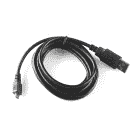
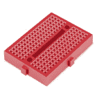
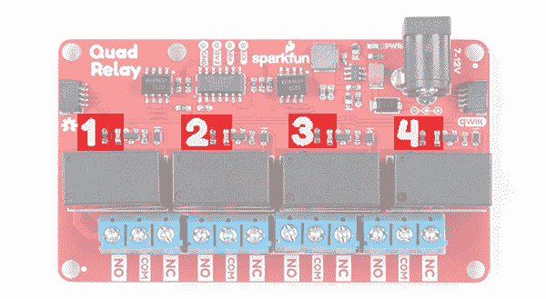
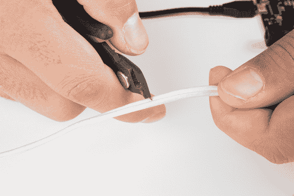

# Qwiic 四路继电器连接指南

> 原文：<https://learn.sparkfun.com/tutorials/qwiic-quad-relay-hookup-guide>

## 介绍

SparkFun 的 Qwiic 四路继电器是一款设计用于使用 I ² C 从您的 Arduino 或其他低功率微控制器切换不是一个而是**四个高功率设备**的产品。它有四个[继电器](https://www.sparkfun.com/products/100)，在 250VAC 或 30VDC 下每通道额定 5 安培，由 ATtiny84A 控制。每个通道都有自己的蓝色 stat LED、便于识别的丝绸和便于连接的螺丝端子。该产品具有 *Qwiic* 功能，允许您在 [Qwiic 环境](https://www.sparkfun.com/qwiic)中轻松将四路继电器与其他产品集成，这意味着无需焊接！

[](https://www.sparkfun.com/products/16566) 

将**添加到您的[购物车](https://www.sparkfun.com/cart)中！**

 **### [SparkFun Qwiic 四重接力](https://www.sparkfun.com/products/16566)

[Out of stock](https://learn.sparkfun.com/static/bubbles/ "out of stock") COM-16566

SparkFun Qwiic 四路继电器是一种独特的电源附件板，用于从您的 Arduino……

$32.506[Favorited Favorite](# "Add to favorites") 18[Wish List](# "Add to wish list")** **[https://www.youtube.com/embed/XL7Gu8KlnPI/?autohide=1&border=0&wmode=opaque&enablejsapi=1](https://www.youtube.com/embed/XL7Gu8KlnPI/?autohide=1&border=0&wmode=opaque&enablejsapi=1)

⚡ **Before we begin!** There are a number of safety precautions included in the product, but that can not account for human inexperience and error. This product and the example below interacts with **HIGH** AC voltage and so is intended for people experienced around, and knowledgeable about **HIGH** AC voltage. If that's not quite your jam, then take a look at our [IoT Power Relay](https://www.sparkfun.com/products/14236)! It's not I²C but the IoT Power Relay contains shielding to prevent accidental shock.

### 所需材料

对于**硬件组件**下的示例，我使用了以下材料来控制负载(即一盏灯)。你可能不需要所有的东西，这取决于你拥有什么。将它添加到您的购物车，通读指南，并根据需要调整购物车。

[](https://www.sparkfun.com/products/15123) 

将**添加到您的[购物车](https://www.sparkfun.com/cart)中！**

 **### [spark fun RedBoard Qwiic](https://www.sparkfun.com/products/15123)

[In stock](https://learn.sparkfun.com/static/bubbles/ "in stock") DEV-15123

SparkFun RedBoard Qwiic 是一款 Arduino 兼容开发板，内置 Qwiic 连接器，无需…

$21.5014[Favorited Favorite](# "Add to favorites") 49[Wish List](# "Add to wish list")****[](https://www.sparkfun.com/products/10215) 

将**添加到您的[购物车](https://www.sparkfun.com/cart)中！**

 **### [USB micro-B 线- 6 脚](https://www.sparkfun.com/products/10215)

[In stock](https://learn.sparkfun.com/static/bubbles/ "in stock") CAB-10215

USB 2.0 型到微型 USB 5 针。这是一种新的、更小的 USB 设备连接器。微型 USB 连接器大约是…

$5.5014[Favorited Favorite](# "Add to favorites") 21[Wish List](# "Add to wish list")****[](https://www.sparkfun.com/products/15312) 

将**添加到您的[购物车](https://www.sparkfun.com/cart)中！**

 **### [【墙上适配器电源- 5VDC，2A(桶形插孔)](https://www.sparkfun.com/products/15312)

[In stock](https://learn.sparkfun.com/static/bubbles/ "in stock") TOL-15312

这是一个高品质的开关“壁式电源”交流到 DC 5V 2000 毫安桶形插座壁式电源，专为…

$6.502[Favorited Favorite](# "Add to favorites") 13[Wish List](# "Add to wish list")****[](https://www.sparkfun.com/products/14427) 

将**添加到您的[购物车](https://www.sparkfun.com/cart)中！**

 **### [Qwiic 线缆- 100mm](https://www.sparkfun.com/products/14427)

[In stock](https://learn.sparkfun.com/static/bubbles/ "in stock") PRT-14427

这是一条 100 毫米长的 4 芯电缆，带有 1 毫米 JST 端接。它旨在将支持 Qwiic 的组件连接在一起…

$1.50[Favorited Favorite](# "Add to favorites") 32[Wish List](# "Add to wish list")****[](https://www.sparkfun.com/products/12795) 

将**添加到您的[购物车](https://www.sparkfun.com/cart)中！**

 **### [【跳线-连接 6”(米/米，20 个装)](https://www.sparkfun.com/products/12795)

[In stock](https://learn.sparkfun.com/static/bubbles/ "in stock") PRT-12795

这些是 6 英寸长的跳线，两端都有公接头。使用这些从任何板上的任何母接头跳线到…

$2.102[Favorited Favorite](# "Add to favorites") 28[Wish List](# "Add to wish list")****[](https://www.sparkfun.com/products/10302) 

将**添加到您的[购物车](https://www.sparkfun.com/cart)中！**

 **### [触觉按钮分类](https://www.sparkfun.com/products/10302)

[In stock](https://learn.sparkfun.com/static/bubbles/ "in stock") COM-10302

这是一个简单的 12 包瞬间，多色按钮，伟大的各种项目！

$6.508[Favorited Favorite](# "Add to favorites") 60[Wish List](# "Add to wish list")****[](https://www.sparkfun.com/products/12044) 

将**添加到您的[购物车](https://www.sparkfun.com/cart)中！**

 **### [【试验板-迷你模块化(红色)](https://www.sparkfun.com/products/12044)

[In stock](https://learn.sparkfun.com/static/bubbles/ "in stock") PRT-12044

这个红色迷你试验板是你的小项目原型的好方法！有了 170 个并列点，就有足够的空间来建立…

$4.50[Favorited Favorite](# "Add to favorites") 12[Wish List](# "Add to wish list")************** ************### 附加选项

如果您喜欢，您也可以使用我们的 9 伏墙壁适配器，我们有多种规格的 Qwiic 电缆可以满足您的需求。

[](https://www.sparkfun.com/products/14427) 

将**添加到您的[购物车](https://www.sparkfun.com/cart)中！**

 **### [Qwiic 线缆- 100mm](https://www.sparkfun.com/products/14427)

[In stock](https://learn.sparkfun.com/static/bubbles/ "in stock") PRT-14427

这是一条 100 毫米长的 4 芯电缆，带有 1 毫米 JST 端接。它旨在将支持 Qwiic 的组件连接在一起…

$1.50[Favorited Favorite](# "Add to favorites") 32[Wish List](# "Add to wish list")****[](https://www.sparkfun.com/products/14429) 

将**添加到您的[购物车](https://www.sparkfun.com/cart)中！**

 **### [Qwiic 线缆- 500mm](https://www.sparkfun.com/products/14429)

[In stock](https://learn.sparkfun.com/static/bubbles/ "in stock") PRT-14429

这是一根 500mm 长的 4 芯电缆，带有 1mm JST 端接。它旨在将支持 Qwiic 的组件连接在一起…

$1.951[Favorited Favorite](# "Add to favorites") 25[Wish List](# "Add to wish list")****[](https://www.sparkfun.com/products/14426) 

将**添加到您的[购物车](https://www.sparkfun.com/cart)中！**

 **### [Qwiic 线缆- 50mm](https://www.sparkfun.com/products/14426)

[In stock](https://learn.sparkfun.com/static/bubbles/ "in stock") PRT-14426

这是一根 50 毫米长的 4 芯电缆，带有 1 毫米 JST 端接。它旨在将支持 Qwiic 的组件连接在一起…

$0.95[Favorited Favorite](# "Add to favorites") 29[Wish List](# "Add to wish list")****[](https://www.sparkfun.com/products/14428) 

### [Qwiic 线缆- 200mm](https://www.sparkfun.com/products/14428)

[Out of stock](https://learn.sparkfun.com/static/bubbles/ "out of stock") PRT-14428

这是一根 200 毫米长的 4 芯电缆，带有 1 毫米 JST 端接。它旨在将支持 Qwiic 的组件连接在一起…

[Favorited Favorite](# "Add to favorites") 21[Wish List](# "Add to wish list")[](https://www.sparkfun.com/products/retired/298) 

### [墙壁适配器电源- 9VDC 650mA](https://www.sparkfun.com/products/retired/298)

[Retired](https://learn.sparkfun.com/static/bubbles/ "Retired") TOL-00298

专为 Spark Fun Electronics 制造的高质量开关“壁式电源”AC 到 DC 9V 650mA 壁式电源。T…

12 **Retired**[Favorited Favorite](# "Add to favorites") 23[Wish List](# "Add to wish list")****** ******### 工具

你需要一把平切刀和剥线钳来去除电缆的外皮和绝缘层。将负荷连接到螺丝端子需要一把十字螺丝刀。

[](https://www.sparkfun.com/products/retired/14872) 

### [自动调节剥线钳](https://www.sparkfun.com/products/retired/14872)

[Retired](https://learn.sparkfun.com/static/bubbles/ "Retired") TOL-14872

自动调节的剥线器可以将电线放在工具的头部，压缩手柄，这样你就有了一个自动剥线器

2 **Retired**[Favorited Favorite](# "Add to favorites") 21[Wish List](# "Add to wish list")[](https://www.sparkfun.com/products/14782) 

将**添加到您的[购物车](https://www.sparkfun.com/cart)中！**

 **### [平齐刀具- Xcelite](https://www.sparkfun.com/products/14782)

[Out of stock](https://learn.sparkfun.com/static/bubbles/ "out of stock") TOL-14782

这些是来自 Excelite 的简单平切刀具，让您可以非常干净地切割引线并靠近焊点。

$8.952[Favorited Favorite](# "Add to favorites") 18[Wish List](# "Add to wish list")****[](https://www.sparkfun.com/products/9146) 

将**添加到您的[购物车](https://www.sparkfun.com/cart)中！**

 **### [SparkFun 迷你螺丝刀](https://www.sparkfun.com/products/9146)

[In stock](https://learn.sparkfun.com/static/bubbles/ "in stock") TOL-09146

这只是你的基本可逆螺丝刀口袋大小！有平头和十字头可供选择。配有别针和…

$1.053[Favorited Favorite](# "Add to favorites") 11[Wish List](# "Add to wish list")**** ****### 推荐阅读

如果你不熟悉 Qwiic 系统，我们推荐你在这里阅读[以获得一个概述](https://www.sparkfun.com/qwiic)。

| [](https://www.sparkfun.com/qwiic) |
| *[Qwiic 连接系统](https://www.sparkfun.com/qwiic)* |

如果你不熟悉下面的教程，我们也建议你看一看。

[](https://learn.sparkfun.com/tutorials/serial-communication) [### 串行通信](https://learn.sparkfun.com/tutorials/serial-communication) Asynchronous serial communication concepts: packets, signal levels, baud rates, UARTs and more 100[](https://learn.sparkfun.com/tutorials/i2c) [### I2C](https://learn.sparkfun.com/tutorials/i2c) An introduction to I2C, one of the main embedded communications protocols in use today.[Favorited Favorite](# "Add to favorites") 128

## 硬件概述

**Revision Changes:** This guide is for the Qwiic Quad Relay [v2.0 [ COM-16566 ]](https://www.sparkfun.com/products/16566) and [v1.0 [ COM-15102 ]](https://www.sparkfun.com/products/15102). There are some improvements to the design for reliability but overall, they should function the same. below is a list of changes for v2.0\.

*   包括电源 LED 的常开跳线。
*   开关调节器代替线性调节器。

*   开关调节器效率更高；同时为四个继电器供电时，不需要外部冷却。

*   改进继电器周围的电路。

*   1.0 版中某些板上的继电器在启动时不能完全切换的问题已经解决。

The image on the left is v2.0 while the right is v1.0\. You'll notice that the circuit to regulate the voltage by the barrel jacks are different. If you flip over either version, you will find the board's version number just under the relay labeled as `4`.

| [](https://cdn.sparkfun.com/assets/learn_tutorials/8/3/9/16566-SparkFun_Quad_Relay__Qwiic_-04a.jpg) | [](https://cdn.sparkfun.com/assets/learn_tutorials/8/3/9/15102-SparkFun_Qwiic_Quad_Relay-05a.jpg) |
| *v2.0* | *v1.0* |

### 力量

**Heads up!** The circuit to regulate the voltage is different in v2.0\. The maximum voltage is now 12V.

四路继电器上有两个独立的电源系统:一个为继电器供电的 5V 系统和一个为 ATtiny84A 板上的供电的 3.3V 系统，并通过四引脚接头或 Qwiic 连接器与微控制器接口。

机载筒状千斤顶采用 7-12V 范围内的电源。它调节电压并向继电器的 5V 电源系统供电。如果您的墙壁适配器或电源像我们的 [5V/2A 墙壁适配器](https://www.sparkfun.com/products/12889)一样为 5V，那么您可以闭合产品下面标有 **5V 墙壁适配器**的跳线(参见下面的**跳线**部分)，这将允许您绕过板载调节器直接为 5V 系统供电。如果你决定使用更高电压的墙壁适配器，要知道电压调节器会开始发热。当所有的继电器通道打开时，四路继电器将产生大约 250 毫安的电流，在 9 伏电压下，这是 2.25 瓦的功率(数学！).随着时间的推移，调节器会变热，但仍能正常工作。我建议，如果你想让所有的中继通道长时间开启，你应该使用 5V 的电源。

[](https://cdn.sparkfun.com/assets/learn_tutorials/8/3/9/16566-SparkFun_Quad_Relay_Qwiic_Power.jpg)

要为 ATtiny84A 的板载提供 3.3V 电压，您可以使用四引脚接头上标有 **3V3** 的电镀通孔。或者，您可以将一个 qw IC 连接器插入两个 qw IC 连接器中的一个。

[](https://cdn.sparkfun.com/assets/learn_tutorials/8/3/9/16566-SparkFun_Quad_Relay_Qwiic_Power_Alternative.jpg)

### 重放

Qwiic 四继电器上有四个单刀双掷 [JZC-11F 继电器](https://www.sparkfun.com/products/100)。每个继电器在 250 伏交流电压或 30 伏直流电压下的电流为 5 安培。这些继电器有一个相关的**蓝色螺丝销端子**，从左到右依次排列。

[](https://cdn.sparkfun.com/assets/learn_tutorials/8/3/9/16566-SparkFun_Quad_Relays.jpg)

### 发光二极管

有一个标有 **PWR** 的红色电源 LED，指示来自桶形插孔的电源。每个继电器还有一个蓝色的状态 LED，标有各自的编号 **1-4** 。每当继电器被激活时(即当 COM 连接到 NO 时)，相应的 LED 将点亮。

[](https://cdn.sparkfun.com/assets/learn_tutorials/8/3/9/16566-SparkFun_Quad_Relay_Qwiic_Status_LEDs.jpg)

### 针织套衫

Qwiic 四路继电器的下面有三个跳线。

*   LED -第一个跳线用于电源 LED。[关闭跳线](https://learn.sparkfun.com/tutorials/how-to-work-with-jumper-pads-and-pcb-traces)以点亮电源 LED。
*   ADDR——第二个是地址跳线，将默认的 I ² C 地址从 **0x6D** 改为 **0x6C** 。
*   BYP -第三个是标有 **5V 墙壁适配器跳线**的跳线。如果您打算使用低于 7-15V 的壁式适配器或其他电源，那么您可以闭合此跳线，以侧移板载电压调节器，并直接向 5V 电源系统提供 5V 电压。

[](https://cdn.sparkfun.com/assets/learn_tutorials/8/3/9/16566-SparkFun_Quad_Relay_Qwiic_Jumpers.jpg)**Note:** In v1.0, there were only two jumpers on the back of the board. With v2.0, there is now an additional jumper for the power LED.

### Qwiic 连接器

Qwiic 连接器让您可以轻松地集成到我们的 [Qwiic 环境](www.sparkfun.com/qwiic)中，并允许您制作*原型，而不需要*焊接！Qwiic 连接器提供的 3.3V 电压将为 ATtiny84A 的板载电源供电。如果不以这种方式为 3.3V 电源系统供电，您仍然可以通过四针接头供电。

[](https://cdn.sparkfun.com/assets/learn_tutorials/8/3/9/Qwiic_connectors_nw.jpg)

### 电路板尺寸

主板尺寸为 3.25 英寸 x 1.85 英寸。板上有 5x 个安装孔，其中四个位于板的每个角上。如果您决定使用 1.0"x1.0 "尺寸的主板连接支持 Qwiic 的设备，靠近主板左上角的第五个安装孔也包括在内。

[](https://cdn.sparkfun.com/assets/9/8/a/7/d/Qwiic_Quad_Relay_Board_Dimensions.png)

### 安全考虑

本产品设计用于切换大功率交流电或 DC，因此存在一些固有的危险。我们已经尽最大努力将安全功能直接融入设计中。首先，ATtiny84A 电路的铜接地浇注被限制在远离继电器的区域。关于微控制器，有光隔离器将其使用的 3.3V 电源系统与继电器的 5V 电源系统隔离。其次，继电器的公共引脚在三面有一个围绕引脚的气隙，以防止任何高压电弧。最后，继电器上的走线非常宽，可以处理继电器的高电流承载能力。

## 硬件装配

### 继电器介绍

让我们来看看如何设置继电器来打开灯或其他设备，但让我们从继电器的简短介绍开始。继电器是一个 [**开关**](https://learn.sparkfun.com/tutorials/switch-basics) 。然而，与大多数开关不同的是，在继电器外壳内还有一个开关机构，它与开关隔离*。这是继电器的定义特征，因为开关机构和开关之间的这种分离，以及开关机构的低功率要求，允许低功率微控制器激活开关机构，而无需与正在被“切换”的任何事物接口。嘘嘘。*

每个继电器有三个通道连接到蓝色螺丝销端子。这些通道根据其功能进行标记。一个被认为是*常开*或**无**，下一个通道是*普通*或 **COM** ，最后是*常闭*或 **NC** 。这些名称解释了通道相对于静止开关的状态。*常闭*通道是开关机构启动前开关所处的位置，相反*常开*通道是开关启动后开关所处的位置。*公共*通道，顾名思义，就是其他两个通道所共有的。这就是所谓的单刀双掷开关( **SPDT** )。下图有助于说明我们特定继电器的这一特性。

[](https://cdn.sparkfun.com/assets/learn_tutorials/8/3/9/single_pole_double_throw_with_text.jpg)

当开关机构被激活时，上图中连接*常闭*和*公共端*的粗条翻转过来连接*常开*和*公共端*。

### 装配

到组件上。首先，我用的是一个[黑板](https://www.sparkfun.com/products/14669)，因为它有 [Qwiic](https://www.sparkfun.com/qwiic) 功能，而且它是通过微型 USB 供电的。我有一个插在试验板上的按钮，跨在中间的空隙上，跳线将它连接到黑板上的引脚 2 和 GND。

[](https://cdn.sparkfun.com/assets/learn_tutorials/8/3/9/Quad_Relay_Hookup_Guide-03.jpg)

在尾端是一个 Qwiic 连接器导致四继电器。

⚡ **Warning!** Make sure the lamp is **not** plugged into the wall as you cut into the wire in the following section.

在我们看四路继电器之前，让我们快速看一下灯线。我们的目标是切断两根灯线中的一根，并将切断的线的两端插入继电器，当我们激活开关机制时，继电器将重新连接电线。首先，我切断了如图所示的两根电线中的一根，以在连接中创建一个断点。

[](https://cdn.sparkfun.com/assets/learn_tutorials/8/3/9/cutting_wires.jpg)

然后我剥开电线，[剥去两端](https://learn.sparkfun.com/tutorials/working-with-wire#stranded-vs-solid)。

[](https://cdn.sparkfun.com/assets/learn_tutorials/8/3/9/cut_wires.jpg)

我们将把线的一端放在 **COM** 通道中，另一端由我们决定。在这个项目中，我们希望我们的开关能够直观地动作:当你启动开关机制时，灯就会打开。可能会有这样一种情况，您希望将切换机制激活为其“休息”状态。因为我们要用一种更正常的方法，我们将切断我们的电线，把一端放在*公共*中，另一端放在*常开*通道中。现在，当我们激活开关机构时，当开关翻转到连接它和*公共*通道的*常开*通道时，切断的电线将被重新连接。

对于四路继电器，我正在为 5V 系统(继电器)供电，下面有一个 [5V 墙上适配器](https://www.sparkfun.com/products/12889)，和一个 **5V 墙上适配器**跳线。来自黑板的 Qwiic 电缆为 3.3V 系统供电，如下图顶部所示，我们将灯电缆插入并拧紧通道 **COM** 和 **NO** 上的螺丝端子。

[](https://cdn.sparkfun.com/assets/learn_tutorials/8/3/9/relay_wires.jpg)⚡ **Warning!** Make sure that your wires connecting to the wall outlet are secure and are rated to handle the current! Please be careful when handling the contacts when the cable is plugged into a wall outlet. **Touching the contacts while powered could result in injury.**

Looking for information about safety and insulation? Check out the notes about [Safety and Insulation from our Beefcake Relay Control Kit](https://learn.sparkfun.com/tutorials/beefcake-relay-control-hookup-guide/saftey-and-insulation).

现在我们的硬件都设置好了，让我们看看打开灯的代码。当系统通电时，切记不要触摸继电器的触点。

## Arduino 图书馆

我们编写了一个库，使 SparkFun Qwiic Quad Relay 更容易上手。该库将为您提供 Qwiic Quad Relay 的全部功能，而无需 ic 数据处理的 hub bub。你可以点击下面的链接下载文件，或者通过搜索 **SparkFun Qwiic Relay** 在 Arduino Library Manager 中导航。你也可以去 [Github 页面](https://github.com/sparkfun/SparkFun_Qwiic_Relay_Arduino_Library)直接获取。

[SparkFun Qwiic Relay Arduino Library (ZIP)](https://github.com/sparkfun/SparkFun_Qwiic_Relay_Arduino_Library/archive/master.zip)

这个库也可以和我们的 [Qwiic 单中继板](https://www.sparkfun.com/products/15102)一起工作。如果你只需要一个接力，那就去试试吧！

**Note:** This example assumes you are using the latest version of the Arduino IDE on your desktop. If this is your first time using Arduino, please review our tutorial on [installing the Arduino IDE.](https://learn.sparkfun.com/tutorials/installing-arduino-ide) If you have not previously installed an Arduino library, please check out our [installation guide.](https://learn.sparkfun.com/tutorials/installing-an-arduino-library)

### 库函数概述

下面的列表概述了 Qwiic Relay Arduino 库的所有功能，这些功能是为 Qwiic Quad Relay 设计的，并简要描述了它们的功能。这些例子涵盖了几乎所有的函数，所以看看这些例子，看看如何将它们集成到您自己的代码中。

*   `bool begin(TwoWire &wirePort = Wire);` -初始化 I ² C 总线上的 Qwiic 继电器
*   `float singleRelayVersion();` -返回继电器的版本号
*   `void turnRelayOn(uint8_t relay);` -打开给定继电器。`relay`的有效输入为 1 至 4。例如，`turnRelayOn(1);`将触发第一个继电器。
*   `void turnRelayOff(uint8_t relay);` -关闭选定的继电器。与上述功能类似，选择 1 到 4 之间的值来关闭所选的继电器。
*   `void toggleRelay(uint8_relay)` -将所选继电器切换到相反状态。该功能首先检查继电器的状态，并根据状态检查返回的结果切换到`on`或`off`。
*   `void turnAllRelaysOn();` -打开板上的所有继电器。
*   `void turnAllRelaysOff();` -关闭板上的所有继电器。
*   `void toggleAllRelays();` -将板上的所有继电器切换到继电器状态检查的相反状态。
*   `uint8_t getState(uint8_t relay);` -返回所选继电器的状态。打开时返回`1`，关闭时返回`0`。就像前面的功能一样，`relay`的有效输入是 1 到 4。
*   `bool changeAddress(uint8_t newAddress);` -改变 Qwiic 继电器的 I ² C 地址。新地址被写入 EEPROM 中决定地址的存储位置。有效的`newAddress`值可以在 **0x07** 和 **0x78** 之间。

## 示例代码

### 示例 4 -使用按钮的继电器控制

这是用于下面的灯示例的代码。解压并打开**下的例四...**>**spark fun Qwiic _ Relay _ Arduino 库-master** > **示例代码** > **示例 4_Quad_Relay_Buttons** 跟随一起。从顶部开始，我们已经`#include`编辑了库的头文件以及 Arduino 的 I C 库:`Wire.h`的路径。为了使用 SparkFun Qwiic Relay 库中的函数，我们创建了它的一个版本，并将其命名为`quadRelay`。你会注意到在括号里我们给出了董事会的地址。如果您已经更改或关闭了地址跳线，则将`RELAY_ADDR`更改为您的地址。

```
language:c
#include <Wire.h>
#include "SparkFun_Qwiic_Relay.h"

#define RELAY_ADDR 0x6D

Qwiic_Relay quadRelay(RELAY_ADDR); 
```

接下来，我们设置三个按钮:黄色、红色和蓝色的三个引脚:2、3 和 4。

```
language:c
const int yellow_btn = 2;
const int red_btn    = 3;
const int blue_btn   = 4; 
```

首先，我们检查是否可以通过`quadRelay.begin()`函数调用与四继电器正确通信。如果有一些连接问题，我们将在这里找到它们。请注意，这不会阻止我们的代码运行，所以请留意错误消息。接下来，我们使用按钮上的上拉电阻将它们置于已知的高电平 T2 状态。

```
language:c
void setup()
{
  Wire.begin(); 
  Serial.begin(115200);

  if(!quadRelay.begin())
    Serial.println("Check connections to Qwiic Relay.");
  else
    Serial.println("Ready to flip some switches.");

    //Use internal resitors to keep them in a known high state. 
  pinMode(yellow_btn, INPUT_PULLUP);
  pinMode(blue_btn, INPUT_PULLUP);
  pinMode(red_btn, INPUT_PULLUP);

} 
```

最后，在循环中，不断检查按钮是否被按下。例如，如果按下蓝色按钮，则 1 号继电器打开。400 毫秒的小延迟是为了去抖。如果没有它，我们每一次随意的按下都会被读取几百次，直到我们最终把手指从按钮上拿开。

```
language:c
void loop()
{
    // Button one turns on relay one....
  if(digitalRead(yellow_btn) == LOW){
        delay(400);
    quadRelay.turnRelayOn(1);
    Serial.println("Yellow Button");
  }

    // Button two turns on relay two....
  if(digitalRead(blue_btn) == LOW){
        delay(400);
    quadRelay.turnRelayOn(2);
    Serial.println("Blue Button");
  }

  // Button three turns off relay one and two...
  if(digitalRead(red_btn) == LOW){
        delay(400);
    quadRelay.turnRelayOff(1);
    quadRelay.turnRelayOff(2);
    Serial.println("Red Button");
  }

} 
```

现在让我们通过 Arudino IDE 上传一些代码。上传前，请务必在上传时切断负载电源，以安全处理继电器。然后将 Arduino 连接到您的电脑进行上传。选择 Arduino 枚举到的板卡(在本例中为 **Arduino/Genuino Uno** )和 COM 端口。点击上传按钮。代码上传完成后，将 Arduino 和继电器放在不导电的表面上进行测试。当系统通电时，切记不要触摸继电器的触点。

## 要有光！

在我们加载代码，并按下按钮，我们应该看到继电器一发光二极管亮起。

[](https://cdn.sparkfun.com/assets/learn_tutorials/8/3/9/relay_wires_on.jpg)

如果您的继电器 LED 亮起，但灯没有亮起，请确保灯已亮起。从现在起，我们将让继电器来控制开关。现在，如果一切都正确组装:

[](https://cdn.sparkfun.com/assets/learn_tutorials/8/3/9/Quad_Relay.gif)

代数！！

**Note:** Did you notice that there were more examples in the **Example Code** folder? If you need, there is an example using interupts (i.e. **Example3_Quad_Relay_Interrupts**) if you need your [Arduino to stop whatever it is processing](https://learn.sparkfun.com/tutorials/processor-interrupts-with-arduino) to toggle the relays.**Heads up!** The circuit used in this tutorial is a temporary connection so you will need to secure the circuit and place the relay in an enclosure. For more ideas, check out some of the projects in resources and going further.

## 资源和更进一步

既然您已经成功地启动并运行了 SparkFun Qwiic Quad Relay，是时候将它整合到您自己的项目中了！

有关更多信息，请查看以下资源:

*   [示意图(PDF)](https://cdn.sparkfun.com/assets/5/4/9/f/6/Qwiic_Quad_Relay_Schematic-v20.pdf) - v2.0
*   [鹰文件(ZIP)](https://cdn.sparkfun.com/assets/2/1/d/9/2/Qwiic_Quad_Relay-v20.zip) - v2.0
*   [板尺寸(PNG)](https://cdn.sparkfun.com/assets/9/8/a/7/d/Qwiic_Quad_Relay_Board_Dimensions.png) - v2.0
*   [数据表(PDF)](https://www.sparkfun.com/datasheets/Components/General/JZC-11F-05VDC-1Z%20EN.pdf)
*   [spark fun Qwiic Relay Arduino Library Github Repo](https://github.com/sparkfun/SparkFun_Qwiic_Relay_Arduino_Library)
    *   [SparkFun Qwiic Relay Arduino 库(ZIP)](https://github.com/sparkfun/SparkFun_Qwiic_Relay_Arduino_Library/archive/master.zip)
*   [SparkFun Qwiic Relay Python 包 GitHub Repo](https://github.com/sparkfun/Qwiic_Relay_Py)
*   [GitHub 回购](https://github.com/sparkfun/Qwiic_Quad_Relay)
    *   [默认固件](https://github.com/sparkfunX/Qwiic_Quad_Relay/tree/master/Firmware/Qwiic_Quad_Relay_Firmware)
    *   [示例代码(邮编)](https://cdn.sparkfun.com/assets/learn_tutorials/8/3/9/Examples.zip)
*   [SFE 产品展示区](https://www.youtube.com/watch?v=XL7Gu8KlnPI)

你的下一个项目需要一些灵感吗？查看一些其他使用继电器的相关教程。在浏览其他一些使用继电器的教程时，在操作 Qwiic 单继电器时，请务必检查您的当前额定值。

[](https://learn.sparkfun.com/tutorials/photon-remote-water-level-sensor) [### 光子远程水位传感器](https://learn.sparkfun.com/tutorials/photon-remote-water-level-sensor) Learn how to build a remote water level sensor for a water storage tank and how to automate a pump based off the readings 15[](https://learn.sparkfun.com/tutorials/blynk-board-project-guide) [### Blynk 板项目指南](https://learn.sparkfun.com/tutorials/blynk-board-project-guide) A series of Blynk projects you can set up on the Blynk Board without ever re-programming it.[Favorited Favorite](# "Add to favorites") 18[](https://learn.sparkfun.com/tutorials/esp8266-powered-propane-poofer) [### ESP8266 动力丙烷储罐](https://learn.sparkfun.com/tutorials/esp8266-powered-propane-poofer) Learn how Nick Poole built a WiFi controlled fire-cannon using the ESP8266 Thing Dev Board 4[](https://learn.sparkfun.com/tutorials/blynk-board-bridge-widget-demo) [### Blynk Board Bridge 小部件演示](https://learn.sparkfun.com/tutorials/blynk-board-bridge-widget-demo) A Blynk project that demonstrates how to use the Bridge widget to get two (or more) Blynk Boards to communicate.[Favorited Favorite](# "Add to favorites") 2[](https://learn.sparkfun.com/tutorials/beefcake-relay-control-hookup-guide) [### 牛肉继电器控制连接指南](https://learn.sparkfun.com/tutorials/beefcake-relay-control-hookup-guide) This is a guide for assembling and basic use of the Beefcake Relay Control board[Favorited Favorite](# "Add to favorites") 5[](https://learn.sparkfun.com/tutorials/how-to-build-a-remote-kill-switch) [### 如何建立一个远程断路开关](https://learn.sparkfun.com/tutorials/how-to-build-a-remote-kill-switch) Learn how to build a wireless controller to kill power when things go... sentient.[Favorited Favorite](# "Add to favorites") 18[](https://learn.sparkfun.com/tutorials/iot-power-relay) [### 物联网电源继电器](https://learn.sparkfun.com/tutorials/iot-power-relay) Using the ESP32 to make a web-configured timed relay.[Favorited Favorite](# "Add to favorites") 4[](https://learn.sparkfun.com/tutorials/qwiic-single-relay-hookup-guide) [### Qwiic 单继电器连接指南](https://learn.sparkfun.com/tutorials/qwiic-single-relay-hookup-guide) Get started switching those higher power loads around with the Qwiic Single Relay.[Favorited Favorite](# "Add to favorites") 3

或者看看这些博客文章，寻找灵感。

[](https://www.sparkfun.com/news/2887 "March 7, 2019: Hop on the I2C  BUS and let's build Escape Room puzzles Qwiic!") [### 英语日:Qwiic 密室逃脱

March 7, 2019](https://www.sparkfun.com/news/2887 "March 7, 2019: Hop on the I2C  BUS and let's build Escape Room puzzles Qwiic!")[Favorited Favorite](# "Add to favorites") 4[](https://www.sparkfun.com/news/2897 "March 21, 2019: The creation of an automatic light switch using infrared tripwires. ") [### 物联网上的自动电灯开关

March 21, 2019](https://www.sparkfun.com/news/2897 "March 21, 2019: The creation of an automatic light switch using infrared tripwires. ")[Favorited Favorite](# "Add to favorites") 1[](https://www.sparkfun.com/news/2957 "July 11, 2019: Terrify your coworkers! Annoy your friends! How many people in upper management can I frighten without losing my job?") [### 今日英语:恐怖互联网

July 11, 2019](https://www.sparkfun.com/news/2957 "July 11, 2019: Terrify your coworkers! Annoy your friends! How many people in upper management can I frighten without losing my job?")[Favorited Favorite](# "Add to favorites") 0[](https://www.sparkfun.com/news/3184 "January 16, 2020: Using cryptographic authentication, we created a super-secure remote control to open a garage!") [### 安全 DIY 车库开门器

January 16, 2020](https://www.sparkfun.com/news/3184 "January 16, 2020: Using cryptographic authentication, we created a super-secure remote control to open a garage!")[Favorited Favorite](# "Add to favorites") 5[](https://www.sparkfun.com/news/3330 "July 9, 2020: Let's take a look at the pros and cons of traditional mechanical relays vs solid state relays.") [### 切换到不同的继电器

July 9, 2020](https://www.sparkfun.com/news/3330 "July 9, 2020: Let's take a look at the pros and cons of traditional mechanical relays vs solid state relays.")[Favorited Favorite](# "Add to favorites") 2************************