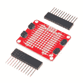

# Qwiic 单继电器连接指南

> 原文：<https://learn.sparkfun.com/tutorials/qwiic-single-relay-hookup-guide>

## 介绍

Qwiic 单继电器是 SparkFun 迄今为止最容易使用的继电器。单个继电器可以在 240 VAC 下长时间处理高达 5.5A 的电流。Qwiic 连接器和螺丝端子也意味着不需要焊接。

[](https://www.sparkfun.com/products/15093) 

将**添加到您的[购物车](https://www.sparkfun.com/cart)中！**

 **### [SparkFun Qwiic 单人接力](https://www.sparkfun.com/products/15093)

[In stock](https://learn.sparkfun.com/static/bubbles/ "in stock") COM-15093

SparkFun Qwiic 单继电器为您提供了迄今为止最容易使用的继电器，在 240VAC 下可长期处理高达 5.5A 的电流…

$13.953[Favorited Favorite](# "Add to favorites") 32[Wish List](# "Add to wish list")** **[https://www.youtube.com/embed/XL7Gu8KlnPI/?autohide=1&border=0&wmode=opaque&enablejsapi=1](https://www.youtube.com/embed/XL7Gu8KlnPI/?autohide=1&border=0&wmode=opaque&enablejsapi=1)

⚡ **Warning!** The Qwiic single relay is great for switching loads like motors, batteries, solenoids, pumps, and more! Keep in mind controlling high voltage (110/220VAC) requires certain precautions. A beginner can do it but if you're unsure then please consider the pre-made [IoT Power Relay](https://www.sparkfun.com/products/14236). It's not I²C but the IoT Power Relay contains shielding to prevent accidental shock.

### 所需材料

首先，你需要一个微控制器来控制一切。你可能不需要所有的东西，这取决于你拥有什么。将它添加到您的购物车，通读指南，并根据需要调整购物车。

[](https://www.sparkfun.com/products/13975) 

将**添加到您的[购物车](https://www.sparkfun.com/cart)中！**

 **### [spark fun red board——用 Arduino 编程 T3](https://www.sparkfun.com/products/13975)

[In stock](https://learn.sparkfun.com/static/bubbles/ "in stock") DEV-13975

SparkFun RedBoard 结合了 UNO 的 Optiboot 引导程序的简单性、FTDI 的稳定性和 shield com…

$21.5049[Favorited Favorite](# "Add to favorites") 89[Wish List](# "Add to wish list")****[](https://www.sparkfun.com/products/13907) 

将**添加到您的[购物车](https://www.sparkfun.com/cart)中！**

 **### [SparkFun ESP32 东西](https://www.sparkfun.com/products/13907)

[In stock](https://learn.sparkfun.com/static/bubbles/ "in stock") DEV-13907

SparkFun ESP32 Thing 是 Espressif 的 ESP32 的综合开发平台，ESP32 是他们的超级充电版本…

$23.5069[Favorited Favorite](# "Add to favorites") 83[Wish List](# "Add to wish list")****[](https://www.sparkfun.com/products/13774) 

将**添加到您的[购物车](https://www.sparkfun.com/cart)中！**

 **### [【粒子光子】](https://www.sparkfun.com/products/13774)

[Out of stock](https://learn.sparkfun.com/static/bubbles/ "out of stock") WRL-13774

Particle 的 IoT(物联网)硬件开发板 Photon 提供了构建互联网络所需的一切…

$19.0032[Favorited Favorite](# "Add to favorites") 51[Wish List](# "Add to wish list")****[](https://www.sparkfun.com/products/retired/13825) 

### [树莓派 3](https://www.sparkfun.com/products/retired/13825)

[Retired](https://learn.sparkfun.com/static/bubbles/ "Retired") DEV-13825

每个人都知道并喜欢 Raspberry Pi，但如果您不需要额外的外设来使其无线化会怎么样呢？覆盆子…

92 **Retired**[Favorited Favorite](# "Add to favorites") 97[Wish List](# "Add to wish list")****** ******现在，要进入 Qwiic 生态系统，关键是以下 Qwiic 屏蔽之一，以符合您对微控制器的偏好:

[](https://www.sparkfun.com/products/14352) 

将**添加到您的[购物车](https://www.sparkfun.com/cart)中！**

 **### [ArduinoT3 的 SparkFun Qwiic 盾](https://www.sparkfun.com/products/14352)

[In stock](https://learn.sparkfun.com/static/bubbles/ "in stock") DEV-14352

SparkFun Qwiic Shield 是一种易于组装的板，它提供了一种简单的方法来将 Qwiic Connect 系统与

$7.508[Favorited Favorite](# "Add to favorites") 39[Wish List](# "Add to wish list")****[](https://www.sparkfun.com/products/14459) 

将**添加到您的[购物车](https://www.sparkfun.com/cart)中！**

 **### [树莓派的 SparkFun Qwiic 帽子](https://www.sparkfun.com/products/14459)

[In stock](https://learn.sparkfun.com/static/bubbles/ "in stock") DEV-14459

树莓派的 SparkFun Qwiic 帽子是进入 Qwiic 生态系统的最快捷、最简单的方式，并且仍然适用于

$6.505[Favorited Favorite](# "Add to favorites") 33[Wish List](# "Add to wish list")****[](https://www.sparkfun.com/products/14477) 

将**添加到您的[购物车](https://www.sparkfun.com/cart)中！**

 **### [光子盾](https://www.sparkfun.com/products/14477)

[28 available](https://learn.sparkfun.com/static/bubbles/ "28 available") DEV-14477

SparkFun Qwiic Shield for Photon 是一个易于组装的板，提供了一种简单的方法来整合 Qwiic 系统…

$6.50[Favorited Favorite](# "Add to favorites") 7[Wish List](# "Add to wish list")****** ******您还需要一根 qw IC 电缆将屏蔽层连接到 qw IC 单继电器，选择适合您需要的长度。

[](https://www.sparkfun.com/products/14427) 

将**添加到您的[购物车](https://www.sparkfun.com/cart)中！**

 **### [Qwiic 线缆- 100mm](https://www.sparkfun.com/products/14427)

[In stock](https://learn.sparkfun.com/static/bubbles/ "in stock") PRT-14427

这是一条 100 毫米长的 4 芯电缆，带有 1 毫米 JST 端接。它旨在将支持 Qwiic 的组件连接在一起…

$1.50[Favorited Favorite](# "Add to favorites") 32[Wish List](# "Add to wish list")****[](https://www.sparkfun.com/products/14429) 

将**添加到您的[购物车](https://www.sparkfun.com/cart)中！**

 **### [Qwiic 线缆- 500mm](https://www.sparkfun.com/products/14429)

[In stock](https://learn.sparkfun.com/static/bubbles/ "in stock") PRT-14429

这是一根 500mm 长的 4 芯电缆，带有 1mm JST 端接。它旨在将支持 Qwiic 的组件连接在一起…

$1.951[Favorited Favorite](# "Add to favorites") 25[Wish List](# "Add to wish list")****[](https://www.sparkfun.com/products/14426) 

将**添加到您的[购物车](https://www.sparkfun.com/cart)中！**

 **### [Qwiic 线缆- 50mm](https://www.sparkfun.com/products/14426)

[In stock](https://learn.sparkfun.com/static/bubbles/ "in stock") PRT-14426

这是一根 50 毫米长的 4 芯电缆，带有 1 毫米 JST 端接。它旨在将支持 Qwiic 的组件连接在一起…

$0.95[Favorited Favorite](# "Add to favorites") 29[Wish List](# "Add to wish list")****[](https://www.sparkfun.com/products/14428) 

### [Qwiic 线缆- 200mm](https://www.sparkfun.com/products/14428)

[Out of stock](https://learn.sparkfun.com/static/bubbles/ "out of stock") PRT-14428

这是一根 200 毫米长的 4 芯电缆，带有 1 毫米 JST 端接。它旨在将支持 Qwiic 的组件连接在一起…

[Favorited Favorite](# "Add to favorites") 21[Wish List](# "Add to wish list")****** ******### 工具

你需要一把平切刀和剥线钳来去除电缆的外皮和绝缘层。将负荷连接到螺丝端子需要一把十字螺丝刀。

[](https://www.sparkfun.com/products/retired/14872) 

### [自动调节剥线钳](https://www.sparkfun.com/products/retired/14872)

[Retired](https://learn.sparkfun.com/static/bubbles/ "Retired") TOL-14872

自动调节的剥线器可以将电线放在工具的头部，压缩手柄，这样你就有了一个自动剥线器

2 **Retired**[Favorited Favorite](# "Add to favorites") 21[Wish List](# "Add to wish list")[](https://www.sparkfun.com/products/14782) 

将**添加到您的[购物车](https://www.sparkfun.com/cart)中！**

 **### [平齐刀具- Xcelite](https://www.sparkfun.com/products/14782)

[Out of stock](https://learn.sparkfun.com/static/bubbles/ "out of stock") TOL-14782

这些是来自 Excelite 的简单平切刀具，让您可以非常干净地切割引线并靠近焊点。

$8.952[Favorited Favorite](# "Add to favorites") 18[Wish List](# "Add to wish list")****[](https://www.sparkfun.com/products/9146) 

将**添加到您的[购物车](https://www.sparkfun.com/cart)中！**

 **### [SparkFun 迷你螺丝刀](https://www.sparkfun.com/products/9146)

[In stock](https://learn.sparkfun.com/static/bubbles/ "in stock") TOL-09146

这只是你的基本可逆螺丝刀口袋大小！有平头和十字头可供选择。配有别针和…

$1.053[Favorited Favorite](# "Add to favorites") 11[Wish List](# "Add to wish list")**** ****### 推荐阅读

如果你不熟悉 Qwiic 系统，我们推荐你在这里阅读[以获得一个概述](https://www.sparkfun.com/qwiic)。

| [](https://www.sparkfun.com/qwiic) |
| *[Qwiic 连接系统](https://www.sparkfun.com/qwiic)* |

如果你不熟悉下面的教程，我们也建议你看一看。

[](https://learn.sparkfun.com/tutorials/serial-communication) [### 串行通信](https://learn.sparkfun.com/tutorials/serial-communication) Asynchronous serial communication concepts: packets, signal levels, baud rates, UARTs and more 100[](https://learn.sparkfun.com/tutorials/i2c) [### I2C](https://learn.sparkfun.com/tutorials/i2c) An introduction to I2C, one of the main embedded communications protocols in use today.[Favorited Favorite](# "Add to favorites") 128[](https://learn.sparkfun.com/tutorials/terminal-basics) [### 串行终端基础知识](https://learn.sparkfun.com/tutorials/terminal-basics) This tutorial will show you how to communicate with your serial devices using a variety of terminal emulator applications.[Favorited Favorite](# "Add to favorites") 46[](https://learn.sparkfun.com/tutorials/qwiic-shield-for-arduino--photon-hookup-guide) [### Arduino 和光子连接指南的 Qwiic 屏蔽](https://learn.sparkfun.com/tutorials/qwiic-shield-for-arduino--photon-hookup-guide) Get started with our Qwiic ecosystem with the Qwiic shield for Arduino or Photon.[Favorited Favorite](# "Add to favorites") 5

## 硬件概述

首先，让我们来看看我们正在处理的[继电器的数据手册](https://cdn.sparkfun.com/assets/5/e/e/d/f/3V_Relay_Datasheet_en-g5le.pdf)中列出的一些特性，这样我们就知道电路板会有什么样的性能。

| **特性** | **范围** |
| 工作电压 | **1.7V-3.6V** |
| 源电流 | 100 毫安 |
| 线圈电阻 | 23.5Ω |
| I ² C 地址 | **0x18(默认)**，*(跳线改为 0x19)* |
| 最大电流(通过继电器) | 5.5A (240 伏交流电压) |

### 腿

下表列出了继电器的所有引脚及其功能。

| 别针 | 描述 | 方向 |
| GND | 地面 | 在…里 |
| 3.3V | 力量 | 在…里 |
| 国家药品监督管理局 | 数据 | 双向的 |
| SCL | 时钟 | 在…里 |
| 网络计算机 | 常闭合的 | 转换 |
| 不 | 常开 | 转换 |
| 计算机输出缩微胶片 | 开关公共 | 转换 |

### 可选功能

Qwiic 继电器有连接到 I ² C 总线的上拉电阻；如果多个传感器连接到总线并使能上拉电阻，并联等效电阻将产生过强的上拉电阻，使总线无法正常工作。一般来说，如果总线上连接了多个器件，则除一对上拉电阻外，应禁用所有上拉电阻。如果需要断开上拉电阻，可以通过切断下面突出显示的相应跳线上的走线来移除。

[](https://cdn.sparkfun.com/assets/learn_tutorials/8/3/2/PU.png)*Pull-up Jumper*

当主板通电时，电源指示灯会亮起。当继电器被触发且开关闭合时，状态 LED 将点亮，下图中两者都被高亮显示

[](https://cdn.sparkfun.com/assets/learn_tutorials/8/3/2/Qwiic_Relay_Hookup_Guide-LEDs.jpg)*Power LED*

板载螺丝终端应该用来连接你的高功率负载，这是下面突出。中间的`COM`引脚应连接到从墙上伸出的**带电**线(通常为黑色)，而`NO`或`NC`应连接到设备侧的**带电**线。

[](https://cdn.sparkfun.com/assets/learn_tutorials/8/3/2/SCREW_UNCONNECTED.png)*Screw Terminal*

## 硬件装配

如果你还没有组装好你的 Qwiic 盾，现在是时候去上那个教程了。根据您选择的微控制器和 shield，您的装配可能会有所不同，但这里有一个便捷的链接，链接到用于 Arduino 的 Qwiic Shield 和 Photon Hookup Guide，让您开始使用！

[Qwiic Shield for Arduino Photon Hookup Guide](https://learn.sparkfun.com/tutorials/qwiic-shield-for-arduino--photon-hookup-guide)

随着盾牌的组装，SparkFun 的新 Qwiic 环境意味着连接继电器不可能更容易。只需将 Qwiic 电缆的一端插入 Qwiic 继电器，另一端插入 Qwiic 屏蔽，您就可以上传草图并开始开关东西了。它看起来太容易使用了，但这就是为什么我们要这样做！

[](https://cdn.sparkfun.com/assets/learn_tutorials/8/3/2/Qwiic_Relay_Hookup_Guide-03__1_.jpg)*SparkFun RedBoard and Qwiic Shield with the Qwiic Relay attached***Note:** Not sure about what color insulation wiring is used in you region? Check out the [standard wire insulation colors](https://en.wikipedia.org/wiki/Electrical_wiring) listed online for reference. If you are unsure about the standard wiring color in your region, please consult a certified electrician to connect to the AC input voltage side.⚡ **Warning!** Make sure the cable is **not** plugged into the wall as you cut into the wire in the following section.

您还需要将继电器放置在您试图控制的交流供电项目的线上。你必须切断你的带电交流线(通常是黑色或红色)，将切断的线的一端连接到`COM`，另一端连接到`NC`或`NO`，这取决于你希望你的设备处于什么样的静止状态。如果你的交流设备大部分时间都开着，你偶尔想关掉它，你应该把一端接到`COM`，另一端接到`NC`。如果设备大部分时间处于关闭状态，则连接到`NO`。看看下面的图片作为视觉辅助。

[](https://cdn.sparkfun.com/assets/learn_tutorials/8/3/2/connected.png)*Relay Example Connection*⚡ **Warning!** Make sure that your wires connecting to the wall outlet are secure and are rated to handle the current! Please be careful when handling the contacts when the cable is plugged into a wall outlet. **Touching the contacts while powered could result in injury.**

Looking for information about safety and insulation? Check out the notes about [Safety and Insulation from our Beefcake Relay Control Kit](https://learn.sparkfun.com/tutorials/beefcake-relay-control-hookup-guide/saftey-and-insulation).⚡ **Each relay takes just over 100 mA to power** Daisy chaining these boards together on the same bus will result in pretty large power spikes, you may need a separate 3.3V source depending on what else is included in your project

## Arduino 图书馆

我们已经编写了一个库，使 SparkFun Qwiic Single Relay 更容易上手。该库将为您提供 Qwiic 单中继的全部功能，而无需 ic 数据事务的 hub bub。你可以点击下面的链接下载文件，或者通过搜索 **SparkFun Qwiic Relay** 在 Arduino Library Manager 中导航。你也可以去 [Github 页面](https://github.com/sparkfun/SparkFun_Qwiic_Relay_Arduino_Library)直接获取。

[SparkFun Qwiic Relay Arduino Library (ZIP)](https://github.com/sparkfun/SparkFun_Qwiic_Relay_Arduino_Library/archive/master.zip)

这个库也可以与我们的 Qwiic 四路继电器板配合使用。如果你需要更多的继电器在一个 PCB 上，那就去看看吧！

**Note:** This example assumes you are using the latest version of the Arduino IDE on your desktop. If this is your first time using Arduino, please review our tutorial on [installing the Arduino IDE.](https://learn.sparkfun.com/tutorials/installing-arduino-ide) If you have not previously installed an Arduino library, please check out our [installation guide.](https://learn.sparkfun.com/tutorials/installing-an-arduino-library)

### 库函数概述

下面的列表概述了 Qwiic Relay Arduino 库的功能，该库旨在与 Qwiic Single Relay 配合使用，并简要描述了它们的功能。这些示例几乎涵盖了所有这些函数，所以看一看它们有助于将它们集成到您自己的代码中。

*   `bool begin(TwoWire &wirePort = Wire);` -初始化 I ² C 总线上的 Qwiic 单继电器
*   `float singleRelayVersion();` -返回 Qwiic 单继电器上的固件版本。
*   `void turnRelayOn();` -打开继电器。
*   `void turnRelayOff();` -关闭继电器。
*   `void toggleRelay()` -将继电器切换到相反状态。该功能首先检查继电器的状态，并根据状态检查返回的结果切换到`on`或`off`。
*   `uint8_t getState();` -返回继电器的状态。打开时返回`1`，关闭时返回`0`。
*   `bool changeAddress(uint8_t newAddress);` -将 Qwiic 继电器的 I ² C 地址更改为`newAddress`的设定值。有效的`newAddress`值可以在 **0x07** 和 **0x78** 之间。新地址被写入 EEPROM 中决定地址的存储位置。

## 示例代码

Qwiic Relay 非常简单，所以控制它的所有函数都包含在 SparkFun Qwiic Relay Arduino 库的第一个例子中。

### 示例 1 -单继电器基础知识

继续将文件夹解压到您选择的目录，然后打开`Example1_Single_Relay_Basics`。

从顶部开始，我们已经`#include`编辑了库的头文件以及 Arduino 的 I C 库:`Wire.h`的路径。为了使用 SparkFun Qwiic Relay 库中的函数，我们创建了它的一个版本，并将其命名为`relay`。你会注意到在括号里我们给出了董事会的地址。如果您更改了该地址或关闭了地址跳线，则将您的地址从`RELAY_ADDR`更改为*。*

```
language:c
#include <Wire.h>
#include "SparkFun_Qwiic_Relay.h"

#define RELAY_ADDR 0x18 // Alternate address 0x19

Qwiic_Relay relay(RELAY_ADDR); 
```

让我们看看设置。首先，我们检查是否可以通过`relay.begin()`函数调用与单个 Qwiic 继电器正确通信。如果有一些连接问题，我们将在这里找到它们。请注意，如果有错误，代码不会停止，所以请留意错误消息。接下来，我们使用`relay.singleRelayVersion()`功能检查您产品上的固件版本。

```
language:c
void setup()
{
  Wire.begin(); 
  Serial.begin(115200);

  // Let's see
  if(!relay.begin())
    Serial.println("Check connections to Qwiic Relay.");
  else
    Serial.println("Ready to flip some switches.");

  float version = relay.singleRelayVersion();
  Serial.print("Firmware Version: ");
  Serial.println(version); 
```

现在我们使用两个函数来打开和关闭继电器。首先，更明显的功能`turnRelayOn()`打开继电器，然后用`turnRelayOff`关闭继电器。接下来继电器*通过`toggleRelay()`功能切换*的开和关。这里的区别在于继电器是关闭还是打开取决于继电器的当前状态:如果**关闭** - >打开**打开**，反之亦然。

```
language:c
  // Let's turn on the relay...
  relay.turnRelayOn(); 
  delay(500);
  // Let's turn that relay off...
  relay.turnRelayOff(); 
  delay(500);
  // Let's 'toggle' the relay; if it's off turn it on and vice versa.
  relay.toggleRelay(); 
  delay(500);
  // Toggle the relay back off.
  relay.toggleRelay();
  delay(500); 
```

你可能想知道为什么我完全在设置中这样做？如果你第一次在没有阅读的情况下运行这个，你就不会有一个继电器不停地打开和关闭。现在，在设置的最后，我们看到了 SparkFun Qwiic Arduino 库的最终功能。

```
language:c
  Serial.print("The Relay is now: ");
  // Is the relay on or off?
  int state = relay.getState();
  if(state == 1)
    Serial.print("On!");
  else if(state == 0)
    Serial.print("Off!");

} 
```

使用`getState`功能，我们不用看电路板就可以检查继电器是开还是关。这可以帮助您根据项目的需求以编程方式做出决策。

## 资源和更进一步

既然您已经成功地启动并运行了您的 Qwiic 单继电器，那么是时候将它合并到您自己的项目中了！

有关更多信息，请查看以下资源:

*   [示意图(PDF)](https://cdn.sparkfun.com/assets/0/7/b/1/6/Qwiic_Single_Relay.pdf)
*   [老鹰文件(ZIP)](https://cdn.sparkfun.com/assets/5/1/1/1/e/Qwiic_Single_Relay.zip)
*   [数据表(PDF)](https://cdn.sparkfun.com/assets/5/e/e/d/f/3V_Relay_Datasheet_en-g5le.pdf)
*   [默认固件](https://cdn.sparkfun.com/assets/1/2/d/4/b/Qwiic_Relay_Firmware.zip)
*   [spark fun Qwiic Relay Arduino Library Github Repo](https://github.com/sparkfun/SparkFun_Qwiic_Relay_Arduino_Library)
*   [SparkFun Qwiic Relay Python 包 GitHub Repo](https://github.com/sparkfun/Qwiic_Relay_Py)
*   [示例代码](https://cdn.sparkfun.com/assets/learn_tutorials/8/3/2/Examples.zip)
*   [GitHub 库](https://github.com/sparkfun/Qwiic_Relay)
*   [SFE 产品展示区](https://www.youtube.com/watch?v=XL7Gu8KlnPI)

你的下一个项目需要一些灵感吗？查看一些使用中继的相关教程。在浏览其他一些使用继电器的教程时，在操作 Qwiic 单继电器时，请务必检查您的当前额定值。

[](https://learn.sparkfun.com/tutorials/photon-remote-water-level-sensor) [### 光子远程水位传感器](https://learn.sparkfun.com/tutorials/photon-remote-water-level-sensor) Learn how to build a remote water level sensor for a water storage tank and how to automate a pump based off the readings 15[](https://learn.sparkfun.com/tutorials/blynk-board-project-guide) [### Blynk 板项目指南](https://learn.sparkfun.com/tutorials/blynk-board-project-guide) A series of Blynk projects you can set up on the Blynk Board without ever re-programming it.[Favorited Favorite](# "Add to favorites") 18[](https://learn.sparkfun.com/tutorials/esp8266-powered-propane-poofer) [### ESP8266 动力丙烷储罐](https://learn.sparkfun.com/tutorials/esp8266-powered-propane-poofer) Learn how Nick Poole built a WiFi controlled fire-cannon using the ESP8266 Thing Dev Board 4[](https://learn.sparkfun.com/tutorials/blynk-board-bridge-widget-demo) [### Blynk Board Bridge 小部件演示](https://learn.sparkfun.com/tutorials/blynk-board-bridge-widget-demo) A Blynk project that demonstrates how to use the Bridge widget to get two (or more) Blynk Boards to communicate.[Favorited Favorite](# "Add to favorites") 2[](https://learn.sparkfun.com/tutorials/beefcake-relay-control-hookup-guide) [### 牛肉继电器控制连接指南](https://learn.sparkfun.com/tutorials/beefcake-relay-control-hookup-guide) This is a guide for assembling and basic use of the Beefcake Relay Control board[Favorited Favorite](# "Add to favorites") 5[](https://learn.sparkfun.com/tutorials/how-to-build-a-remote-kill-switch) [### 如何建立一个远程断路开关](https://learn.sparkfun.com/tutorials/how-to-build-a-remote-kill-switch) Learn how to build a wireless controller to kill power when things go... sentient.[Favorited Favorite](# "Add to favorites") 18[](https://learn.sparkfun.com/tutorials/iot-power-relay) [### 物联网电源继电器](https://learn.sparkfun.com/tutorials/iot-power-relay) Using the ESP32 to make a web-configured timed relay.[Favorited Favorite](# "Add to favorites") 4[](https://learn.sparkfun.com/tutorials/qwiic-quad-relay-hookup-guide) [### Qwiic 四路继电器连接指南](https://learn.sparkfun.com/tutorials/qwiic-quad-relay-hookup-guide) SparkFun’s Qwiic Quad Relay is a product designed for switching not one but four high powered devices from your Arduino or other low powered microcontroller using I2C.[Favorited Favorite](# "Add to favorites") 2

或者看看这些博客文章，寻找灵感。

[](https://www.sparkfun.com/news/2887 "March 7, 2019: Hop on the I2C  BUS and let's build Escape Room puzzles Qwiic!") [### 英语日:Qwiic 密室逃脱

March 7, 2019](https://www.sparkfun.com/news/2887 "March 7, 2019: Hop on the I2C  BUS and let's build Escape Room puzzles Qwiic!")[Favorited Favorite](# "Add to favorites") 4[](https://www.sparkfun.com/news/2897 "March 21, 2019: The creation of an automatic light switch using infrared tripwires. ") [### 物联网上的自动电灯开关

March 21, 2019](https://www.sparkfun.com/news/2897 "March 21, 2019: The creation of an automatic light switch using infrared tripwires. ")[Favorited Favorite](# "Add to favorites") 1[](https://www.sparkfun.com/news/2957 "July 11, 2019: Terrify your coworkers! Annoy your friends! How many people in upper management can I frighten without losing my job?") [### 今日英语:恐怖互联网

July 11, 2019](https://www.sparkfun.com/news/2957 "July 11, 2019: Terrify your coworkers! Annoy your friends! How many people in upper management can I frighten without losing my job?")[Favorited Favorite](# "Add to favorites") 0[](https://www.sparkfun.com/news/3184 "January 16, 2020: Using cryptographic authentication, we created a super-secure remote control to open a garage!") [### 安全 DIY 车库开门器

January 16, 2020](https://www.sparkfun.com/news/3184 "January 16, 2020: Using cryptographic authentication, we created a super-secure remote control to open a garage!")[Favorited Favorite](# "Add to favorites") 5[](https://www.sparkfun.com/news/3255 "March 5, 2020: This is the second part depicting the building of a keycode-based anti-theft system for a car.") [### Enginursday: Keycode 安全入门，第 2 部分

March 5, 2020](https://www.sparkfun.com/news/3255 "March 5, 2020: This is the second part depicting the building of a keycode-based anti-theft system for a car.")[Favorited Favorite](# "Add to favorites") 1[](https://www.sparkfun.com/news/3330 "July 9, 2020: Let's take a look at the pros and cons of traditional mechanical relays vs solid state relays.") [### 切换到不同的继电器

July 9, 2020](https://www.sparkfun.com/news/3330 "July 9, 2020: Let's take a look at the pros and cons of traditional mechanical relays vs solid state relays.")[Favorited Favorite](# "Add to favorites") 2************************