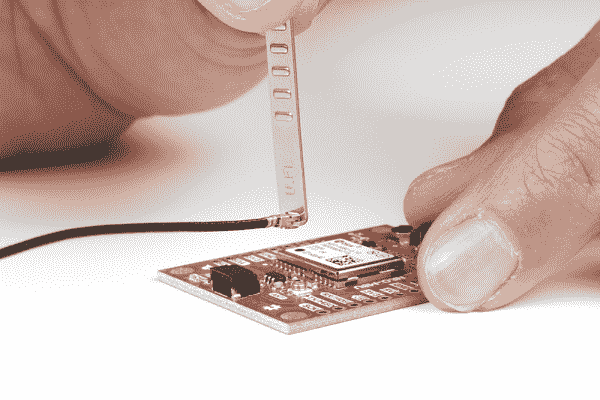

# 关于使用 U.FL 的三个快速提示

> 原文：<https://learn.sparkfun.com/tutorials/three-quick-tips-about-using-ufl>

## 介绍

由于具有无线或射频(RF)应用的 SparkFun 产品的数量不断增加，我们认为在最普遍的播放器之一:U.FL 连接器中开设一门速成课程会有所帮助。

单位 FL 和兼容连接器主机(如 I-PEX、IPX 或 UMCC)都设计为允许连接小型[同轴电缆](https://en.wikipedia.org/wiki/Coaxial_cable)，由于外部导体提供的屏蔽，这些电缆在无线应用中更受欢迎。我们使用这些连接器是因为它们体积小，价格便宜，而且使用更小的同轴电缆更容易处理。然而，它们比它们更大的表亲( [SMA 连接器](https://en.wikipedia.org/wiki/SMA_connector))更难使用，也更脆弱，所以快速了解一下如何使用它们不会有什么坏处。

这张照片展示了 U.FL 连接器的公头和母头。左侧是连接电缆的母侧，公侧焊接在电路板上。(顺便说一句，连接器的性别总是由电触点的性别决定，而不是塑料外壳或其他外来材料的性别)。

在一个渴望发明的人手中，暴露在外的荧光灯比那些深藏在消费者手机里的荧光灯更容易被插上/拔出。Hirose 数据表显示，他们只对 30 个循环的重复使用进行了测试，所以请遵循这些提示，让您的连接器尽可能长时间地正常工作！

## 连接

爱护你的 U.FL 连接器就是要保持闪亮的电触点的原始和接触！尘垢、氧化和激浪会增加天线的阻抗，缩小覆盖范围。弯曲的触点根本不会让任何电精灵通过，那些“如果我拿得恰到好处就能工作”的问题绝对是最难调试的！

当连接 U.FL 的部件时，首先确保你的手指相对干净。为避免对连接施加压力，将电缆从末端捏起一到两厘米，并试着对齐，使母接头均匀地靠在公接头表面上。然后你可以轻轻地把你的手指放在堆叠的连接器上——如果感觉像你小学时的老跷跷板，那么再试一次，你希望它稳定。另外，当您从主板上方查看连接器时，请确保两个连接器从左到右和从上到下彼此居中。

如果一切都准备好了，用手指的正中心用力向下压——你会感觉到一种令人满意的“锁定感”,就像数据表中所说的那样！(注:我不得不将手指移到一边，以便您可以看到那里的连接器，但您应该真正努力按下连接器的正中央)

最终结果应该看起来像这个非常愉快的 ESP32 LoRa 单通道网关:

## 保护

你可以把 U.FL 母连接器的外部抓握部分想象成由蜻蜓翅膀制成——看起来非常漂亮，但也很脆弱。对它们施加不必要的力，例如以奇怪的方式拉动电缆产生的扭矩，可能会导致它们弯曲远离连接器的公侧，并且不再形成可靠的连接。在移动项目或创建最终安装时，防止这种情况发生也应该是一个优先事项。

防止这种奇怪的扭矩被称为 ***应变消除*** ，有几种方法可以做到:

*   用胶带封住电缆
*   将电缆穿过电路板上的应力消除孔(如果适用)
*   用胶水粘住电缆
*   或者想点别的什么，只要它能减轻任何可能意外施加在缆绳上的力

使用任何应变消除方法，您都应该允许电缆自然弯曲到固定位置，以免将任何力或扭矩传递到连接器。ESP32 Gateway 在 ESP32 模块的正下方有一个非常方便的通道，您可以用它来制作一个*磁带帐篷。*这样可以保持连接的美观和安全，根本不用压下电缆！

如果附近有一个通孔没有被使用并且足够宽，您也可以在连接前穿过 u.FL 连接器。下面是将 u.FL 电缆穿过安装孔，然后连接到 NEO-M9U GPS 板的示例。使用热胶或胶带在电路板上随意添加额外的应力消除，以减少小连接器上的力。

## 拆开

不可避免地，你会想把你的午餐盒收音机天线换成更有活力的东西(谁不想要八木呢...)尽管像撕创可贴一样撕掉电缆很诱人(而且绝对容易),但我们强烈建议您不要这样做。还记得蜻蜓翅膀吗？是的，那些外部连接器可能会弯曲到足以使连接松动，或者公连接器的中心引脚可能会弯曲到一边，使下次连接变得困难。或者更糟，连接器扯掉 PCB！

实际上有一个‘专门’的工具来断开这些！不同的制造商有不同形状的工具。我们将在下面介绍一些专门的工具以及如何使用它们。

如果你有 [U.FL 推/拉工具](https://www.sparkfun.com/products/20687)，该工具包括固定 U.FL 连接器的齿。这可以用来帮助推入或拉出连接器。我们发现用它从板上拔出 U.FL 连接器更有用。

 

将**添加到您的[购物车](https://www.sparkfun.com/cart)中！**

 **### [U.FL 推/拉工具](https://www.sparkfun.com/products/20687)

[In stock](https://learn.sparkfun.com/static/bubbles/ "in stock") TOL-20687

该工具用于连接或断开 U.FL 配合状态。

$14.95[Favorited Favorite](# "Add to favorites") 3[Wish List](# "Add to wish list")** **使用工具，滑动 U.FL 连接器周围标有齿的一端。将 U.FL 连接器向上拉离电路板。您将希望避免像撬棍一样以一定角度拉动 U.FL 连接器，因为这可能会弯曲连接器。

|  |  |  |

**Note:** If there are components around the U.FL connector, you may need to rotate the cable around when sliding the U.FL tool around the U.FL connector.

如果您有 [U.FL 拔出工具](https://www.sparkfun.com/products/20687)，该工具包括齿，仅从底部固定 U.FL 连接器。与上面显示的其他 U.FL 工具相比，这只能用于帮助拔出连接器。齿没有那么厚，所以当附近有很多 SMD 元件时，它可以更好地在 U.FL 连接器下面滑动，但它不能像其他工具一样抓住 U.FL 连接器。

 

将**添加到您的[购物车](https://www.sparkfun.com/cart)中！**

 **### [U.FL 移除工具](https://www.sparkfun.com/products/19929)

[Only 9 left!](https://learn.sparkfun.com/static/bubbles/ "only 9 left!") TOL-19929

该工具用于从 U.FL 配合状态中拔出。

$25.95[Favorited Favorite](# "Add to favorites") 6[Wish List](# "Add to wish list")**** 

### 带钥匙扣的 u 盘拔出工具

[Retired](https://learn.sparkfun.com/static/bubbles/ "Retired") TOL-20060

该工具用于从 U.FL 配合状态中拔出。

**Retired**** **使用工具，将带有两个标记为“U.FL”的齿的一端滑动到 U.FL 连接器周围。将 U.FL 连接器向上拉离电路板。您将希望避免像撬棍一样以一定角度拉动 u.FL 连接器，因为这可能会弯曲连接器。

|  |  |

没有专门的工具来移除 U.FL？还有其他选择，包括:

*   一把镊子
*   直角刀具(哇哦，不要太用力！)
*   一种扁平的类似“spudger”的工具
*   你的想象力(嗯，不是直接的...)

这是镊子技术使用前后的图像:

|  |  |

就像当你连接两个部分时，游戏的名字是“扭矩是熔岩”，意思当然是你不想在连接器脱落时扭曲它。紧紧抓住(但不要挤压)厚顶部正下方的母接头(拉起时会有一个漂亮的小唇可以抓住)。然后你所要做的就是离开冲浪板。当母头部分分离时，它不再有公头部分来阻止外部触点向内弯曲，所以要轻柔。

事实上，任何能抓住母接头下面的凸缘的工具都会起作用。当使用这些直角钳时，我只是确保我手掌的厚部分保持它们张开，以免压碎连接器。然后我用我的拇指作为支点(离连接器越远越好，拉得越直)，把两半分开。

如果你没有双面工具，你也可以尝试“spudger”技术。要做到恰到好处有点困难，但也有可能通过这种方式最小化连接器上的扭矩。要做到这一点，把一些薄而硬的东西放在电缆下面，让尖端正好对着连接器的圆筒。现在将电缆压在扁平的物体上，尽可能靠近连接器。如果可以的话，将电缆直接从连接器上拉下一点(这有助于抵消仅从一侧拉起时产生的扭矩)。最后，用你的扁平硬片提起连接器。

现在你知道了如何连接、保护和断开 U.FL 连接器的基本知识。去统治电波吧！

## 资源&更进一步

你的下一个项目需要一些灵感吗？看看这些教程。

 [### ESP8266 东西开发板连接指南](https://learn.sparkfun.com/tutorials/esp8266-thing-development-board-hookup-guide) An overview of SparkFun's ESP8266 Thing Development Board - a development board for the Internet of Things.[Favorited Favorite](# "Add to favorites") 15 [### 同步 RFID 标签阅读器连接指南](https://learn.sparkfun.com/tutorials/simultaneous-rfid-tag-reader-hookup-guide) A basic guide to getting started with the RFID Tag Reader breakout and how to read and write multiple RFID tags over multiple feet 8 [### SparkFun SAMD21 Pro 射频连接指南](https://learn.sparkfun.com/tutorials/sparkfun-samd21-pro-rf-hookup-guide) Using the super blazing, nay blinding, fast SAMD21 whipping clock cycles at 48MHz and the RFM96 module to connect to the Things Network (and other Radio woodles).[Favorited Favorite](# "Add to favorites") 6 [### SparkFun LoRa Gateway 单通道连接指南](https://learn.sparkfun.com/tutorials/sparkfun-lora-gateway-1-channel-hookup-guide) How to setup and use the LoRa Gateway 1-Channel in Arduino.[Favorited Favorite](# "Add to favorites") 3****