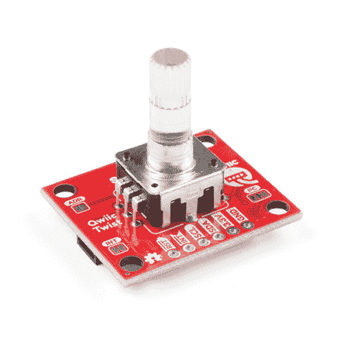
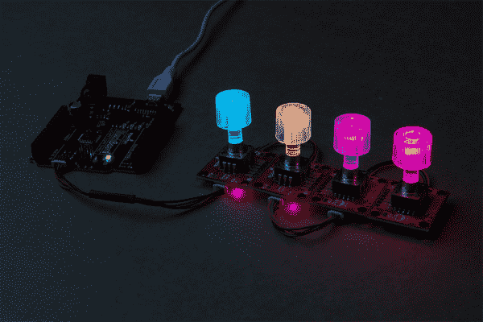
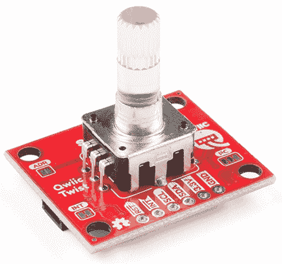
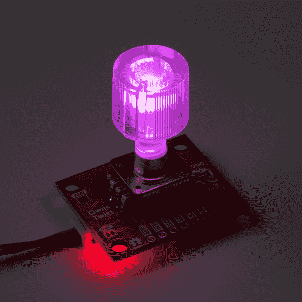
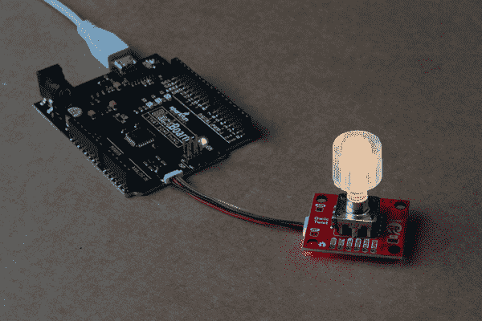
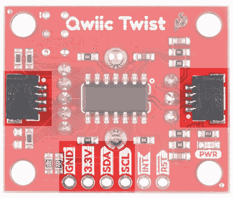
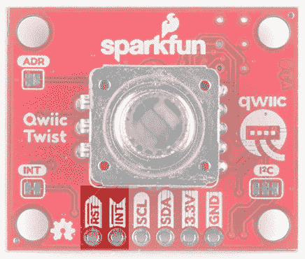
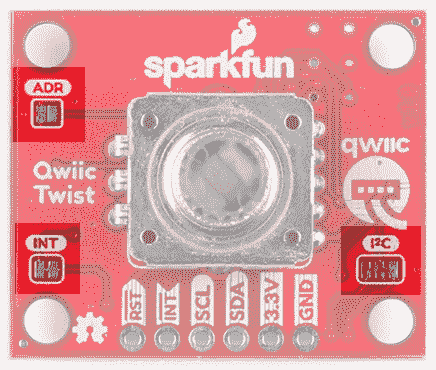
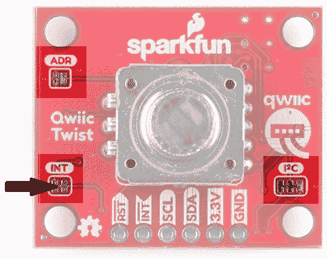
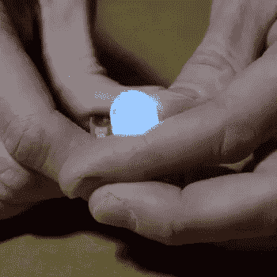

# Qwiic 扭转连接指南

> 原文：<https://learn.sparkfun.com/tutorials/qwiic-twist-hookup-guide>

## 介绍

有时候你只需要一个音量旋钮。 [Qwiic Twist](https://www.sparkfun.com/products/15083) 是一个数字 RGB 编码器，也称为连续旋转旋钮，通过 I ² C 读取和控制

[](https://www.sparkfun.com/products/15083) 

将**添加到您的[购物车](https://www.sparkfun.com/cart)中！**

 **### [SparkFun Qwiic Twist - RGB 旋转编码器突破](https://www.sparkfun.com/products/15083)

[In stock](https://learn.sparkfun.com/static/bubbles/ "in stock") DEV-15083

SparkFun Qwiic Twist 是一个数字 RGB 旋转编码器分线点，也能够连接到我们的 Qwiic Connect 系统。

$24.952[Favorited Favorite](# "Add to favorites") 31[Wish List](# "Add to wish list")** **[https://www.youtube.com/embed/FWk2tp59r54/?autohide=1&border=0&wmode=opaque&enablejsapi=1](https://www.youtube.com/embed/FWk2tp59r54/?autohide=1&border=0&wmode=opaque&enablejsapi=1)

那是什么意思？发送命令`twist.getCount()`，您将获得用户旋转旋钮的步数。例如，312 或-23 取决于用户转动旋钮的方向和数量。Twist 负责所有各种中断、开关、led 的 PWM，并通过易于使用的 I ² C 接口呈现所有这些功能。Qwiic Twist 的设计目的是消除在试验板中实现 RGB 编码器所需的大量导线。现在可以用 twist.getCount()这样的东西来获取编码器位置；您的微控制器可以专注于其他更重要的任务。

Qwiic Twist 有一个缩进式编码器，让用户在转动时有很好的“咔嗒”感。Qwiic Twist 还有一个 RGB LED 和一个内置按钮。我们编写了一个 Arduino 库，让控制这些功能变得简单:

```
language:c
twist.setColor(255, 0, 0); //Red
if(twist.isPressed() == true) Serial.println(“Pressed!”); 
```

最后，Qwiic Twist 的 I ² C 地址是软件可配置的，这意味着您可以在一条 I ² C 总线上连接超过 100 个 Twist！

[](https://cdn.sparkfun.com/assets/learn_tutorials/8/4/6/Qwiic_Twist_Hookup_Guide-01.jpg)

### 所需材料

按照这个连接指南，你需要一个带有 Arduino 的 Qwiic 保护罩。你可能不需要所有的东西，这取决于你拥有什么。将它添加到您的购物车，通读指南，并根据需要调整购物车。

[](https://www.sparkfun.com/products/13975) 

将**添加到您的[购物车](https://www.sparkfun.com/cart)中！**

 **### [spark fun red board——用 Arduino 编程 T3](https://www.sparkfun.com/products/13975)

[In stock](https://learn.sparkfun.com/static/bubbles/ "in stock") DEV-13975

SparkFun RedBoard 结合了 UNO 的 Optiboot 引导程序的简单性、FTDI 的稳定性和 shield com…

$21.5049[Favorited Favorite](# "Add to favorites") 89[Wish List](# "Add to wish list")****[](https://www.sparkfun.com/products/14352) 

将**添加到您的[购物车](https://www.sparkfun.com/cart)中！**

 **### [ArduinoT3 的 SparkFun Qwiic 盾](https://www.sparkfun.com/products/14352)

[In stock](https://learn.sparkfun.com/static/bubbles/ "in stock") DEV-14352

SparkFun Qwiic Shield 是一种易于组装的板，它提供了一种简单的方法来将 Qwiic Connect 系统与

$7.508[Favorited Favorite](# "Add to favorites") 39[Wish List](# "Add to wish list")**********Note:** Originally, a BlackBoard was used in the tutorial. If you are looking to reduce the cost and avoid soldering headers to the Qwiic shield, try taking a look at the RedBoard Qwiic. It is essentially a RedBoard with Qwiic connector.

[](https://www.sparkfun.com/products/15123) 

将**添加到您的[购物车](https://www.sparkfun.com/cart)中！**

 **### [spark fun RedBoard Qwiic](https://www.sparkfun.com/products/15123)

[In stock](https://learn.sparkfun.com/static/bubbles/ "in stock") DEV-15123

SparkFun RedBoard Qwiic 是一款 Arduino 兼容开发板，内置 Qwiic 连接器，无需…

$21.5014[Favorited Favorite](# "Add to favorites") 49[Wish List](# "Add to wish list")** **您还需要一根 Qwiic 电缆来连接屏蔽层和双绞线，选择适合您需求的长度。如果您想轻松地将 Qwiic Twist 插入 3.3V 平台，如 [Teensy](https://www.sparkfun.com/categories/267) ，Qwiic to breadboard 电缆是不错的选择。

[](https://www.sparkfun.com/products/14427) 

将**添加到您的[购物车](https://www.sparkfun.com/cart)中！**

 **### [Qwiic 线缆- 100mm](https://www.sparkfun.com/products/14427)

[In stock](https://learn.sparkfun.com/static/bubbles/ "in stock") PRT-14427

这是一条 100 毫米长的 4 芯电缆，带有 1 毫米 JST 端接。它旨在将支持 Qwiic 的组件连接在一起…

$1.50[Favorited Favorite](# "Add to favorites") 32[Wish List](# "Add to wish list")****[](https://www.sparkfun.com/products/14429) 

将**添加到您的[购物车](https://www.sparkfun.com/cart)中！**

 **### [Qwiic 线缆- 500mm](https://www.sparkfun.com/products/14429)

[In stock](https://learn.sparkfun.com/static/bubbles/ "in stock") PRT-14429

这是一根 500mm 长的 4 芯电缆，带有 1mm JST 端接。它旨在将支持 Qwiic 的组件连接在一起…

$1.951[Favorited Favorite](# "Add to favorites") 25[Wish List](# "Add to wish list")****[](https://www.sparkfun.com/products/14426) 

将**添加到您的[购物车](https://www.sparkfun.com/cart)中！**

 **### [Qwiic 线缆- 50mm](https://www.sparkfun.com/products/14426)

[In stock](https://learn.sparkfun.com/static/bubbles/ "in stock") PRT-14426

这是一根 50 毫米长的 4 芯电缆，带有 1 毫米 JST 端接。它旨在将支持 Qwiic 的组件连接在一起…

$0.95[Favorited Favorite](# "Add to favorites") 29[Wish List](# "Add to wish list")****[](https://www.sparkfun.com/products/14425) 

将**添加到您的[购物车](https://www.sparkfun.com/cart)中！**

 **### [Qwiic 电缆-试验板跳线(4 针)](https://www.sparkfun.com/products/14425)

[In stock](https://learn.sparkfun.com/static/bubbles/ "in stock") PRT-14425

这是一根跳线适配器电缆，一端带有一个 Qwiic JST 母接头，另一端带有一个试验板连接…

$1.50[Favorited Favorite](# "Add to favorites") 34[Wish List](# "Add to wish list")****[](https://www.sparkfun.com/products/14428) 

### [Qwiic 线缆- 200mm](https://www.sparkfun.com/products/14428)

[Out of stock](https://learn.sparkfun.com/static/bubbles/ "out of stock") PRT-14428

这是一根 200 毫米长的 4 芯电缆，带有 1 毫米 JST 端接。它旨在将支持 Qwiic 的组件连接在一起…

[Favorited Favorite](# "Add to favorites") 21[Wish List](# "Add to wish list")******** ********### 工具

Qwiic Twist 设计为无需焊接即可轻松连接到[qw IC 总线](https://www.sparkfun.com/qwiic)。但是如果你选择直接连接 I ² C 引脚，你可能需要一个烙铁、焊料和[通用焊接附件](https://www.sparkfun.com/categories/49)。

[](https://www.sparkfun.com/products/14228) 

### [威勒 WLC100 焊台](https://www.sparkfun.com/products/14228)

[Out of stock](https://learn.sparkfun.com/static/bubbles/ "out of stock") TOL-14228

Weller 的 WLC100 是一款多功能的 5 瓦至 40 瓦焊台，非常适合业余爱好者、DIY 爱好者和学生。…

2[Favorited Favorite](# "Add to favorites") 17[Wish List](# "Add to wish list")[](https://www.sparkfun.com/products/9325) 

将**添加到您的[购物车](https://www.sparkfun.com/cart)中！**

 **### [无铅焊料- 100 克线轴](https://www.sparkfun.com/products/9325)

[In stock](https://learn.sparkfun.com/static/bubbles/ "in stock") TOL-09325

这是带有水溶性树脂芯的无铅焊料的基本线轴。0.031 英寸规格，100 克。这是一个好主意…

$9.957[Favorited Favorite](# "Add to favorites") 33[Wish List](# "Add to wish list")** **### 推荐阅读

如果你不熟悉 Qwiic 系统，我们推荐你在这里阅读[以获得一个概述](https://www.sparkfun.com/qwiic)。

| [](https://www.sparkfun.com/qwiic) |
| *[Qwiic 连接系统](https://www.sparkfun.com/qwiic)* |

我们还建议在继续之前查看这些教程。

[](https://learn.sparkfun.com/tutorials/i2c) [### I2C](https://learn.sparkfun.com/tutorials/i2c) An introduction to I2C, one of the main embedded communications protocols in use today.[Favorited Favorite](# "Add to favorites") 128[](https://learn.sparkfun.com/tutorials/qwiic-shield-for-arduino--photon-hookup-guide) [### Arduino 和光子连接指南的 Qwiic 屏蔽](https://learn.sparkfun.com/tutorials/qwiic-shield-for-arduino--photon-hookup-guide) Get started with our Qwiic ecosystem with the Qwiic shield for Arduino or Photon.[Favorited Favorite](# "Add to favorites") 5

此外，我们有一个很棒的视频，介绍了编码器的内部工作原理以及它们的重要性。

[https://www.youtube.com/embed/oLBYHbLO8W0/?autohide=1&border=0&wmode=opaque&enablejsapi=1](https://www.youtube.com/embed/oLBYHbLO8W0/?autohide=1&border=0&wmode=opaque&enablejsapi=1)

## 硬件概述

RGB 编码器是一个 24 缩进的编码器。当旋转 360 度时，你会感觉到 24 次点击。

[](https://cdn.sparkfun.com/assets/learn_tutorials/8/4/6/SparkFun-Qwiic-Twist.jpg)

编码器与[透明塑料旋钮](https://www.sparkfun.com/products/10597)配合使用效果最佳，但与任何带有 6mm 滚花孔的旋钮兼容。编码器输出通过一系列电阻、电容进行滤波，并在软件中进行误差检查，以确保输出准确的滴答数。

[](https://cdn.sparkfun.com/assets/learn_tutorials/8/4/6/Qwiic_Twist_PurpleKnob.jpg)

编码器内置一个 RGB LED。为了获得完整的灯光效果，我们建议使用透明旋钮，但根据您的设置，您也可以使用不透明旋钮获得“背光”效果。RGB LEDs 通过软件(由非易失性存储器支持)进行脉宽调制和控制，因此您可以告诉 Qwiic Twist 转到您想要的任何颜色，现在它将是该颜色，甚至在 Twist 循环通电后也是如此(它会记住最后的颜色设置)。

编码器有一个内置的瞬时按钮。这对于选择菜单项和获得用户的总体反馈很有用。

### Qwiic I ² C 引脚

[](https://cdn.sparkfun.com/assets/learn_tutorials/8/4/6/Qwiic_Twist_Hookup_Guide-02.jpg)

Qwiic Twist 最好与 Qwiic 系统一起使用。只需将一根 [Qwiic 线缆](https://www.sparkfun.com/products/14426)插入 Twist 并开始与之对话。

[](https://cdn.sparkfun.com/assets/learn_tutorials/8/4/6/SparkFun-Qwiic-Twist-I2C.jpg)

或者，您可以焊接到电路板上的 I ² C 引脚。

**Heads Up!** The Qwiic Twist is designed to operate at **3.3V** so please don’t drive it at **5V**. Your I²C pins, however, can be **5V** logic.

### RST 和国际

reset 引脚是低电平有效输入。拉低时，Qwiic 扭转将保持在复位状态。

[](https://cdn.sparkfun.com/assets/learn_tutorials/8/4/6/Qwiic-Twist-ADR-INT-2.jpg)

INT 引脚低电平有效，为开漏输出。当发生以下任何事件时，中断引脚将变为低电平:

*   用户按下按钮被按下或释放。
*   用户转动了旋钮，并且在一定时间内没有检测到移动。这段时间称为 *turnInterruptTimeout* ，默认为 250 毫秒。这意味着一旦用户停止转动旋钮 250 毫秒，中断将被触发。当用户进行大量旋钮改变时，这是有帮助的。Qwiic Twist 不会触发中断，直到用户停止坐立不安。turnInterruptTimeout 可通过软件配置，范围为 1 毫秒至 65000 毫秒(65 秒)。

INT 引脚为开漏引脚，通过一个 10k 电阻上拉，但如果想要连接多个绞合线并在多个绞合线之间共享中断引脚，则可以选择切断跳线，去除每个绞合板上的 10k 上拉电阻。

### 针织套衫

ADR 跳线是常开的，控制设备的 I ² C 地址。默认情况下，Qwiic Twist 7 位未移位地址为`0x3F`。如果跳线用焊料封闭，地址将变为`0x3E`。

[](https://cdn.sparkfun.com/assets/learn_tutorials/8/4/6/Qwiic-Twist-Jumpers.jpg)

Twist 的独特之处在于，它可以分配 0x08 至 0x77 之间的任何地址。这意味着一条总线上可以连接 100 多条双绞线！

**注意:**如果 ADR 跳线关闭，则 Qwiic Twist 将求助于地址`0x3E`，无论通过软件命令配置了什么地址。这是一种安全机制，以防 Twist 被设置为未知地址。

INT 跳线是一种常闭跳线；有一个小的痕迹连接两个垫。该跳线通过 10k 电阻将 ATtiny84 上的 INT 引脚连接到 **3.3V** 。切断小走线会断开 ATtiny84 上 10k 电阻与 INT 引脚的连接。

[](https://cdn.sparkfun.com/assets/learn_tutorials/8/4/6/Qwiic-Twist-Jumpers-INTHighlightedFixed.jpg)

Qwiic Twist 上的 INT 引脚为*开漏*，这意味着当中断发生时，该引脚将主动变为低电平，但当没有中断时，该引脚将悬空。如果你有多个设备共享一条中断线路，这种*开漏*类型的设置很方便。对于高级应用(如许多许多绞线都共享同一个 INT 引脚)，您可能希望[在每个绞线上切断此跳线](https://learn.sparkfun.com/tutorials/how-to-work-with-jumper-pads-and-pcb-traces)以移除 10k 上拉电阻。**对于一般用途，您可以不修改该跳线。**

Qwiic Twist 在 SDA 和 SCL 线上内置 2.2k 上拉电阻。这些是正常 I ² C 通信所需要的。I ² C 跳线有两条小迹线将上拉电阻连接到 3.3v。**对于一般用途，您可以不修改此跳线。**如果 I ² C 总线上有许多(超过 7 个)器件，每个都有自己的上拉电阻，那么您可能希望[切断 I ² C 跳线](https://learn.sparkfun.com/tutorials/how-to-work-with-jumper-pads-and-pcb-traces)以断开每个 Qwiic 板上的 2.2k 电阻。

## Qwiic Twist Arduino 库

**Note:** This example assumes you are using the latest version of the Arduino IDE on your desktop. If this is your first time using Arduino, please review our tutorial on [installing the Arduino IDE.](https://learn.sparkfun.com/tutorials/installing-arduino-ide) If you have not previously installed an Arduino library, please check out our [installation guide.](https://learn.sparkfun.com/tutorials/installing-an-arduino-library)

我们已经编写了一个易于使用的 Arduino 库，涵盖了 Qwiic Twist 的所有功能。安装这个库最简单的方法是在 Arduino 库管理器中搜索 **SparkFun Twist** 。如果你需要的话，我们甚至有一个关于[安装 Arduino 库](https://learn.sparkfun.com/tutorials/installing-an-arduino-library/all)的教程。您也可以通过下载 zip 文件手动安装 [Qwiic Twist 库](https://github.com/sparkfun/SparkFun_Qwiic_Twist_Arduino_Library):

[Download the SparkFun Qwiic Twist Library (ZIP)](https://github.com/sparkfun/SparkFun_Qwiic_Twist_Arduino_Library/archive/master.zip)

*   **例 1** -编码器值的基本读数
*   **例 2** -设置旋钮颜色
*   **例 3** -在旋钮上显示疯狂的颜色
*   **例 4** -连接颜色:根据位置将旋钮颜色从蓝色变为红色
*   **例 5** -读取时间戳
*   **示例 6** -显示自上次读数以来的编码器差异
*   **例 7** -设置编码器计数值
*   **例 8** -启用和读取中断
*   **例 7** -设置编码器计数值
*   **例 9** -更改 I ² C 地址
*   **示例 10** -高级焊线设置

下面是可以从库中调用的各种函数。这些函数中的大多数都在示例中进行了演示，因此我们建议您先浏览每个示例。

*   **T2`boolean begin(TwoWire &wirePort, uint8_t deviceAddress);`**
*   **`int16_t getCount();`** -返回用户旋转旋钮的缩进量
*   **`boolean setCount(int16_t amount);`** -设置给定数量的缩进量
*   **`int16_t getDiff(boolean clearValue = true);`** -返回自上次检查以来的刻度数。读取后清除差异。
*   **`boolean isMoved();`** -如果旋钮已经旋转，则返回真
*   **`boolean isPressed();`** -如果按钮当前被按下，则返回 true。
*   **`boolean isClicked();`** -如果发生了点击事件，则返回 true。然后重置事件标志。
*   **`uint16_t timeSinceLastMovement(boolean clearValue = true);`** -返回自上次编码器运动以来的毫秒数。读取后清除值。
*   **`uint16_t timeSinceLastPress(boolean clearValue = true);`** -返回自上次按钮事件(按下并释放)以来的毫秒数。读取后清除值。

**颜色**功能设置每个 LED 的亮度。

*   **`boolean setColor(uint8_t red, uint8_t green, uint8_t blue);`** -设置编码器发光二极管的颜色，0-255
*   **`boolean setRed(uint8_t);`** -设置红色 LED，0-255
*   **`boolean setGreen(uint8_t);`** -设置绿色 LED，0-255
*   **`boolean setBlue(uint8_t);`** -设置蓝色 LED，0-255
*   **`uint8_t getRed();`** -获取当前值
*   **`uint8_t getGreen();`** -获取当前值
*   **`uint8_t getBlue();`** -获取当前值

**连接**功能设置每种颜色与旋钮旋转的关系。这些功能连接 LED，使其在没有主机干预的情况下随着每个编码器节拍改变[数量]。负数是允许的(所以你越调低编码器，LED 越亮)。

*   **`boolean connectColor(int16_t red, int16_t green, int16_t blue);`** -在一个命令中连接所有颜色
*   **`boolean connectRed(int16_t);`** -连接个别颜色
*   **`boolean connectGreen(int16_t);`** -连接个别颜色
*   **`boolean connectBlue(int16_t);`** -连接个别颜色
*   **`int16_t getRedConnect();`** -获取每种颜色的连接值
*   **T2`int16_t getGreenConnect();`**
*   **T2`int16_t getBlueConnect();`**

**通用**函数获取并设置扭转的各个方面。

*   **`uint16_t getIntTimeout();`** -获取旋钮旋转结束和中断点火之间必须经过的毫秒数
*   **`boolean setIntTimeout(uint16_t timeout);`** -设置旋钮旋转结束和中断点火之间的毫秒数
*   **`void clearInterrupts();`** -清除移动和按钮中断以及按下和点击事件位
*   **`boolean isConnected();`** -如果检测到传感器，则返回真
*   **`uint16_t getVersion();`** -返回一个两字节的固件版本
*   **`void changeAddress(uint8_t newAddress);`**——将 I ² C 地址改为新地址

## 寄存器映射

如果您想使用 Arduino 之外的平台，您可以通过访问以下寄存器组来轻松控制 Qwiic Twist:

[](https://cdn.sparkfun.com/assets/learn_tutorials/8/4/6/Qwiic_Twist_Register_Map_-_Endianness_Fixed_.jpg)*You can also download the [PDF](https://cdn.sparkfun.com/assets/learn_tutorials/8/4/6/Qwiic_Twist_Register_Map_-_Fixed_Endianness.pdf).*

Qwiic Twist 表现为一个正常的 I ² C 从机。首先写下你想读或写的寄存器的地址，然后跟随 I ² C 命令，用一个读来读给定的寄存器，或者用一个写和一个数据字节来写一个寄存器。寄存器地址指针自动递增，因此您可以一次读写多个寄存器。

## 连接颜色

Qwiic Twist 的一个更高级(但非常方便)的功能是能够将颜色控制与旋钮移动相连接。这意味着，当用户转动旋钮时，你可以增加或减少红色 LED 的亮度，而无需向 Qwiic Twist 发送命令。这大大提高了旋钮照明的响应性，并显著减少了 I ² C 流量。

[](https://cdn.sparkfun.com/assets/learn_tutorials/8/4/6/Qwiic_Twist-Color-Connect.gif)

在上面的照片中，我们将蓝色连接起来，每增加一个刻度，亮度增加 10，将红色连接起来，每增加一个刻度，亮度增加-10。颜色会自动改变，无需 I ² C 主机的干预。颜色连接值存储在 Qwiic Twist 中，并将在每次通电后加载。

完整演示见 SparkFun 库的 **[例 4](https://github.com/sparkfun/SparkFun_Qwiic_Twist_Arduino_Library/blob/master/examples/Example4_ConnectColors/Example4_ConnectColors.ino)** 。

## 资源和更进一步

寻找更多信息？查看此处提供的链接:

*   [示意图(PDF)](https://cdn.sparkfun.com/assets/2/f/2/c/c/Qwiic_Twist.pdf)
*   [鹰(ZIP)](https://cdn.sparkfun.com/assets/d/f/5/1/2/SparkFun_Qwiic_Twist.zip)
*   [Qwiic 扭转寄存器映射](https://cdn.sparkfun.com/r/600-600/assets/5/3/d/5/6/RegisterMap.jpg)
*   GitHub 回购
    *   SparkFun Qwiic Twist Arduino 库 -用于轻松连接 Qwiic Twist，包括一系列示例。通过在 Arduino 库管理器中搜索“SparkFun Twist ”,这是最容易安装的。
    *   [SparkFun Qwiic Twist Python 包](https://github.com/sparkfun/Qwiic_Twist_Py) -用于与 Raspberry Pi 或 Jetson Nano 上的 Qwiic Twist 接口。这是最容易安装的[指令在这里](https://qwiic-twist-py.readthedocs.io/en/latest/?#id3)。
    *   [硬件报告](https://github.com/sparkfun/Qwiic_Twist) -用于 Qwiic Twist，包括 ATtiny84 的固件
*   [SFE 产品展示区](https://www.youtube.com/watch?v=FWk2tp59r54)

我们希望你在你的 Qwiic 扭扭中有很多乐趣！查看其他 Qwiic 产品:

[](https://learn.sparkfun.com/tutorials/soil-moisture-sensor-hookup-guide) [### 土壤湿度传感器连接指南](https://learn.sparkfun.com/tutorials/soil-moisture-sensor-hookup-guide) A quick hookup guide and project to get you started with the Soil Moisture Sensor from SparkFun.[Favorited Favorite](# "Add to favorites") 34[](https://learn.sparkfun.com/tutorials/qwiic-vr-imu-bno080-hookup-guide) [### Qwiic VR IMU (BNO080)连接指南](https://learn.sparkfun.com/tutorials/qwiic-vr-imu-bno080-hookup-guide) Figure out how things are oriented with the robust 9 degrees of freedom (DOF) BNO080 IMU. Maybe even make your own virtual reality (VR) applications if you're feeling savvy.[Favorited Favorite](# "Add to favorites") 2[](https://learn.sparkfun.com/tutorials/esp32-lora-1-ch-gateway-lorawan-and-the-things-network) [### ESP32 LoRa 1-CH 网关、LoRaWAN 和物联网](https://learn.sparkfun.com/tutorials/esp32-lora-1-ch-gateway-lorawan-and-the-things-network) Using the ESP32 LoRa 1-CH Gateway as a gateway and device, and pushing data to The Things Network.[Favorited Favorite](# "Add to favorites") 4[](https://learn.sparkfun.com/tutorials/qwiic-uv-sensor-veml6075-hookup-guide) [### Qwiic 紫外线传感器(VEML6075)连接指南](https://learn.sparkfun.com/tutorials/qwiic-uv-sensor-veml6075-hookup-guide) Learn how to connect your VEML6075 UV Sensor and figure out just when you should put some sunscreen on.[Favorited Favorite](# "Add to favorites") 2

或者看看这篇博客文章。

[](https://www.sparkfun.com/news/3344 "August 5, 2020: Marcus demonstrates how the Qwiic System makes it super easy to build a novelty sound maker with a capacitive touch interface.") [### 我如何用 Qwiic 系统构建 Cap Touch 声卡

August 5, 2020](https://www.sparkfun.com/news/3344 "August 5, 2020: Marcus demonstrates how the Qwiic System makes it super easy to build a novelty sound maker with a capacitive touch interface.")[Favorited Favorite](# "Add to favorites") 1******************