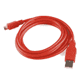
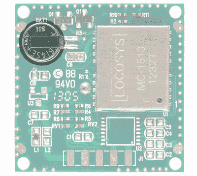

# LS20031 5Hz (66 频道)GPS 接收机连接指南

> 原文：<https://learn.sparkfun.com/tutorials/ls20031-5hz-66-channel-gps-receiver-hookup-guide>

## 介绍

祝贺您购买了 [Locosys LS20031 5Hz 66 通道 GPS 模块](https://www.sparkfun.com/products/8975)！这个低功耗的 GPS 接收器可以在一秒钟内告诉你五次你在哪里！你现在在哪里？现在呢？我打赌你不知道，这就是为什么你需要让你的 LS20031 工作。在本教程中，我们将添加头并使用 Arduino 读取输出。所以让我们开始吧...

[](https://www.sparkfun.com/products/8975) 

将**添加到您的[购物车](https://www.sparkfun.com/cart)中！**

 **### [【GPS 接收器- LS20031 5Hz (66 通道)](https://www.sparkfun.com/products/8975)

[26 available](https://learn.sparkfun.com/static/bubbles/ "26 available") GPS-08975

LS20031 GPS 接收机是一个完整的 GPS 智能天线接收机，包括一个嵌入式天线和 GPS 接收机电路…

$74.95 $37.482[Favorited Favorite](# "Add to favorites") 13[Wish List](# "Add to wish list")** **### 所需材料

要跟随本教程，您将需要以下材料。你可能不需要所有的东西，这取决于你拥有什么。将它添加到您的购物车，通读指南，并根据需要调整购物车。

[](https://www.sparkfun.com/products/12009) 

将**添加到您的[购物车](https://www.sparkfun.com/cart)中！**

 **### [SparkFun 逻辑电平转换器-双向](https://www.sparkfun.com/products/12009)

[In stock](https://learn.sparkfun.com/static/bubbles/ "in stock") BOB-12009

SparkFun 双向逻辑电平转换器是一个小型设备，可以安全地将 5V 信号降压至 3.3V，并升压 3。…

$3.50116[Favorited Favorite](# "Add to favorites") 146[Wish List](# "Add to wish list")****[](https://www.sparkfun.com/products/13975) 

将**添加到您的[购物车](https://www.sparkfun.com/cart)中！**

 **### [spark fun red board——用 Arduino 编程 T3](https://www.sparkfun.com/products/13975)

[In stock](https://learn.sparkfun.com/static/bubbles/ "in stock") DEV-13975

SparkFun RedBoard 结合了 UNO 的 Optiboot 引导程序的简单性、FTDI 的稳定性和 shield com…

$21.5049[Favorited Favorite](# "Add to favorites") 89[Wish List](# "Add to wish list")****[](https://www.sparkfun.com/products/12002) 

将**添加到您的[购物车](https://www.sparkfun.com/cart)中！**

 **### [【试验板-不干胶(白色)](https://www.sparkfun.com/products/12002)

[In stock](https://learn.sparkfun.com/static/bubbles/ "in stock") PRT-12002

这是你的尝试和真正的白色无焊试验板。它有 2 条电源总线，10 列，30 行，总共 400 个连接…

$5.5048[Favorited Favorite](# "Add to favorites") 93[Wish List](# "Add to wish list")****[](https://www.sparkfun.com/products/8431) 

将**添加到您的[购物车](https://www.sparkfun.com/cart)中！**

 **### [跳线高级 6 "米/米装 10 根](https://www.sparkfun.com/products/8431)

[In stock](https://learn.sparkfun.com/static/bubbles/ "in stock") PRT-08431

这是一个 SparkFun 独家！这些是 155 毫米长、26 AWG 跳线，两端都有公接头。用这些来跳离…

$4.502[Favorited Favorite](# "Add to favorites") 11[Wish List](# "Add to wish list")****[](https://www.sparkfun.com/products/11301) 

将**添加到您的[购物车](https://www.sparkfun.com/cart)中！**

 **### [SparkFun USB 迷你-B 线- 6 脚](https://www.sparkfun.com/products/11301)

[In stock](https://learn.sparkfun.com/static/bubbles/ "in stock") CAB-11301

这是一条 USB 2.0 型到 Mini-B 型 5 针电缆。你知道，通常带有 USB 集线器、相机、MP3 的迷你 B 连接器…

$4.503[Favorited Favorite](# "Add to favorites") 20[Wish List](# "Add to wish list")****[](https://www.sparkfun.com/products/553) 

将**添加到您的[购物车](https://www.sparkfun.com/cart)中！**

 **### [挣脱男头球-直角](https://www.sparkfun.com/products/553)

[In stock](https://learn.sparkfun.com/static/bubbles/ "in stock") PRT-00553

一排直角公接头-断开以适合。40 个引脚，可切割成任何尺寸。用于定制 PCB 或一般定制…

$2.255[Favorited Favorite](# "Add to favorites") 47[Wish List](# "Add to wish list")****[](https://www.sparkfun.com/products/8975) 

将**添加到您的[购物车](https://www.sparkfun.com/cart)中！**

 **### [【GPS 接收器- LS20031 5Hz (66 通道)](https://www.sparkfun.com/products/8975)

[26 available](https://learn.sparkfun.com/static/bubbles/ "26 available") GPS-08975

LS20031 GPS 接收机是一个完整的 GPS 智能天线接收机，包括一个嵌入式天线和 GPS 接收机电路…

$74.95 $37.482[Favorited Favorite](# "Add to favorites") 13[Wish List](# "Add to wish list")************** ************### 工具

你需要一个烙铁、焊料和一般的焊接附件。

[](https://www.sparkfun.com/products/14456) 

将**添加到您的[购物车](https://www.sparkfun.com/cart)中！**

 **### [【烙铁- 60W(可调温度)](https://www.sparkfun.com/products/14456)

[In stock](https://learn.sparkfun.com/static/bubbles/ "in stock") TOL-14456

当你不想倾家荡产，但又需要一个可靠的烙铁时，这个可调节温度的烙铁是一个很好的工具…

$16.5016[Favorited Favorite](# "Add to favorites") 43[Wish List](# "Add to wish list")****[](https://www.sparkfun.com/products/9163) 

将**添加到您的[购物车](https://www.sparkfun.com/cart)中！**

 **### [无铅焊料- 15 克管](https://www.sparkfun.com/products/9163)

[In stock](https://learn.sparkfun.com/static/bubbles/ "in stock") TOL-09163

这是你的无铅焊料的基本管，带有不干净的水溶性树脂芯。0.031 英寸规格，15 克

$3.954[Favorited Favorite](# "Add to favorites") 14[Wish List](# "Add to wish list")**** ****### 推荐阅读

如果您不熟悉以下概念，我们建议您在继续之前查看这些教程。

[](https://learn.sparkfun.com/tutorials/how-to-solder-through-hole-soldering) [### 如何焊接:通孔焊接](https://learn.sparkfun.com/tutorials/how-to-solder-through-hole-soldering) This tutorial covers everything you need to know about through-hole soldering.[Favorited Favorite](# "Add to favorites") 70[](https://learn.sparkfun.com/tutorials/serial-communication) [### 串行通信](https://learn.sparkfun.com/tutorials/serial-communication) Asynchronous serial communication concepts: packets, signal levels, baud rates, UARTs and more 100[](https://learn.sparkfun.com/tutorials/gps-basics) [### GPS 基础知识](https://learn.sparkfun.com/tutorials/gps-basics) The Global Positioning System (GPS) is an engineering marvel that we all have access to for a relatively low cost and no subscription fee. With the correct hardware and minimal effort, you can determine your position and time almost anywhere on the globe.[Favorited Favorite](# "Add to favorites") 31[](https://learn.sparkfun.com/tutorials/installing-an-arduino-library) [### 安装 Arduino 库](https://learn.sparkfun.com/tutorials/installing-an-arduino-library) How do I install a custom Arduino library? It's easy! This tutorial will go over how to install an Arduino library using the Arduino Library Manager. For libraries not linked with the Arduino IDE, we will also go over manually installing an Arduino library.[Favorited Favorite](# "Add to favorites") 22[](https://learn.sparkfun.com/tutorials/logic-levels) [### 逻辑电平](https://learn.sparkfun.com/tutorials/logic-levels) Learn the difference between 3.3V and 5V devices and logic levels.[Favorited Favorite](# "Add to favorites") 82[](https://learn.sparkfun.com/tutorials/how-to-install-ftdi-drivers) [### 如何安装 FTDI 驱动程序](https://learn.sparkfun.com/tutorials/how-to-install-ftdi-drivers) How to install drivers for the FTDI Basic on Windows, Mac OS X, and Linux.[Favorited Favorite](# "Add to favorites") 12[](https://learn.sparkfun.com/tutorials/bi-directional-logic-level-converter-hookup-guide) [### 双向逻辑电平转换器连接指南](https://learn.sparkfun.com/tutorials/bi-directional-logic-level-converter-hookup-guide) An overview of the Bi-Directional Logic Level Converter, and some example circuits to show how it works.[Favorited Favorite](# "Add to favorites") 23

## 硬件概述

LS20031 是一款高性能、可靠、廉价的 GPS 模块。这是一个很好的选择，因为它具有 5Hz 的更新速率、用于快速锁定(首次修复时间)的备用电源以及小尺寸。唯一的缺点是它没有配备连接器。需要一些小的组装，但是非常简单。

### GPS 模块

**Heads up!** The new version (V1.3) of this module uses the MT3339 MTK chipset. Previous versions (V1.2) used MT3329 MTK. For more details on the update, check out [page 19 of the datasheet](https://cdn.sparkfun.com/datasheets/GPS/LS20030~3_datasheet_v1.3.pdf).

LS20031 使用联发科 MT3339，一次最多可以捕获 66 颗卫星。GPS 模块具有快速的首次定位时间(TTFF)和高灵敏度，适用于在茂密的树叶和城市峡谷环境中需要导航和跟踪的应用。

[](https://cdn.sparkfun.com/assets/learn_tutorials/6/7/8/08975-02_LS20031_GPS_Receiver_Module.jpg)**Note:** While the receiver was designed for high sensitivity, there will always be a possibility of [lock problems when using a GPS receiver indoors](https://learn.sparkfun.com/tutorials/alphanumeric-gps-wall-clock#lock-problems).

### 内置 GPS 天线

陶瓷贴片天线是焊接在绿色 PCB 上的大块棕褐色白色物体。确保天线始终指向天空！

[](https://cdn.sparkfun.com/assets/learn_tutorials/6/7/8/08975-01_LS20031_GPS_Receiver_Ceramic_Antenna.jpg)

### 状态 LED

修复后，红色状态 LED 会闪烁。定位意味着视野中有足够多的卫星来精确计算你的位置。持续供电模式下一旦有锁，位置固定时会每秒闪烁一次。否则，该 LED 将保持熄灭。

[](https://cdn.sparkfun.com/assets/learn_tutorials/6/7/8/08975-01_LS20031_GPS_Receiver_Status_LED_1.jpg)

### 插脚引线图

输入电压为 **3.3V** 。Rx 和 Tx 引脚支持 **3.3V** TTL。这意味着如果你使用 5V Arduino，你将需要一个[逻辑电平转换](https://learn.sparkfun.com/tutorials/bi-directional-logic-level-converter-hookup-guide)。下面是底视图和顶视图的引脚排列。当使用直角接头并将 GPS 接收器连接到试验板时，引脚是镜像的。从任何一侧观看时，确保连接到正确的引脚！

| [](https://cdn.sparkfun.com/assets/learn_tutorials/6/7/8/08975-02_LS20031_GPS_Receiver_Pinout_Back.jpg) | [](https://cdn.sparkfun.com/assets/learn_tutorials/6/7/8/LS20031_GPS_Receiver_Pinout_Labeled_Top_View.jpg) |
| *后视图引出线* | *俯视图引出线* |

可以向模块发送命令来配置设置。有一个叫做[迷你 GPS](http://www.sparkfun.com/datasheets/GPS/MiniGPS_1.32.zip) 的便捷程序可以帮助你配置你的模块。关于配置的更多信息可以在 [DIY 无人机的博客上找到:使用 5Hz Locosys GPS 和 Arduino/ArduPilot](http://diydrones.com/profiles/blogs/using-the-5hz-locosys-gps-with) 。可配置的 10Hz 更新率意味着您可以获得有效的位置，时间等。数据每秒 10 次。默认设置为 1Hz。

**Heads up!** The datasheet for this unit states that the update rate is configurable up to 10Hz but we’ve found that it is most reliable at a rate of 5Hz.

### 电池备用

LS20031 有一个内置电池来保存系统数据。这允许冷启动的快速卫星捕获。

[](https://cdn.sparkfun.com/assets/learn_tutorials/6/7/8/08975-02_LS20031_GPS_Receiver_Backup_Battery.jpg)

## 硬件装配

LS20031 模块没有连接连接器。为了从设备中获取数据，我们需要连接一个连接器或一些连接线。无论你使用哪种连接方法，记住保持方形陶瓷天线指向天空是很重要的。断开 1x5 排直角接头，将[焊接](https://learn.sparkfun.com/tutorials/how-to-solder-through-hole-soldering)到 GPS 接收器。

[](https://cdn.sparkfun.com/assets/learn_tutorials/6/7/8/LS20031_Parts_Solder_1.jpg)**Note:** You may prefer to use plain wire or [M/M jumper wires](https://www.sparkfun.com/products/8431) like those pictured below but we will not cover this method here.

[](https://cdn.sparkfun.com/assets/learn_tutorials/6/7/8/LS20031_Parts_Solder_Alternative_Jumper_Wires.jpg)

组装过程中最困难的部分可能是在将引脚焊接到 GPS 接收器时保持直角接头连接器对齐。我们将使用[粘性图钉](#sticky-tack)将图钉压在板上。暂时将连接器的一个外侧引脚固定到位，确保所有连接器引脚与 GPS 模块电路板上相应的金色焊盘重叠。

[](https://cdn.sparkfun.com/assets/learn_tutorials/6/7/8/GPS_Receiver_LS20031_Assembly_Solder_1.jpg)**Note:** Alternatively, you could use tape to hold the pins down depending on what you have. A third arm with the two clips also works very well for this. If you're really good, you can hold header in place with your index finger and thumb against the GPS receiver. Just make sure to not touch the header that you are soldering.**Note:** You will notice the small holes (vias) around the outside of the module run under two of the pins—it is okay if these two pins of the connector make contact with the small holes as in this case both the pins and vias are connected to ground.

[](https://cdn.sparkfun.com/assets/learn_tutorials/6/7/8/08975-02_LS20031_GPS_Receiver_GND_Pins.jpg)

一旦你对连接器的位置满意，在连接器的另一端焊接引脚。您可以使用比平时更多的焊料，因为除了电接触之外，它还需要提供结构支撑。像往常一样，尽量不要让烙铁接触超过几秒钟。此外，确保不要意外脱焊电路板上的任何其他元件，或者将焊料弹到电路板上。当你焊接了第一个引脚，它应该看起来像这样。

[](https://cdn.sparkfun.com/assets/learn_tutorials/6/7/8/GPS_Receiver_LS20031_Assembly_Solder_2.jpg)

接下来，去除临时粘合剂，确保引脚在焊盘上仍然正确对齐，如果没有对齐，对已经焊接的连接器加热，并轻轻移动连接器对齐。然后将另一个外侧引脚焊接到位。

[](https://cdn.sparkfun.com/assets/learn_tutorials/6/7/8/GPS_Receiver_LS20031_Assembly_Solder_3.jpg)

最后，将其余三个引脚焊接到焊盘上。两个外侧引脚就位后，其余引脚应与焊盘对齐。当你完成后，你的模块应该看起来像下图。

[](https://cdn.sparkfun.com/assets/learn_tutorials/6/7/8/GPS_Receiver_LS20031_Assembly_Solder_4.jpg)**Heads up!** Make sure that the solder has fully flowed so that there is contact between the pin and pad.

现在你的 GPS 模块有了一个直角连接器，你可以把它直接插入试验板。我们建议将接头插入靠近试验板中心的位置，以确保连接安全和稳定性。

[](https://cdn.sparkfun.com/assets/learn_tutorials/6/7/8/LS20031_GPS_Receiver_Breadboard.jpg)**Heads up!** Careful when removing the GPS receiver from the breadboard. Since the right angle header is soldered to pads, there is a possibility of ripping the pads off when removing the GPS from the breadboard. The rails may grip the square headers more than usual if you are using a new breadboard. Try placing the 2x2 protoboard (like the [Solderable Breadboard Mini](https://www.sparkfun.com/products/12702)) under the LS20031 to remove the GPS from the breadboard.

## 硬件连接

从 GPS 接收器读取串行 UART 输出的最简单方法是使用 USB 转串行转换器(即 FTDI)。但是，您也可以使用微控制器来读取嵌入式项目的输出。在本教程中，我们将重点介绍连接 GPS 接收机的两种方法。让我们开始吧。

### USB 转串行转换器

对于快速测试，可以使用 3.3V usb 转串行转换器。只需将 3.3V FTDI 分线板连接至下列引脚。在 FTDI 上，只有一个 GND 引脚可用。连接一个 GND 引脚就足够了。要阅读 NMEA 的句子，没有必要将 GPS 接收器的 Rx 引脚连接到 FTDI，除非您正在配置 GPS 接收器。在本教程中，我们只需将 GPS 接收器的 Tx 引脚连接到 FTDI 的 Rx。

| LS20031
(从左侧开始的俯视图) | 3.3V FTDI 分线板 |
| GND | GND |
| GND | GND |
| Tx (3.3V TTL) | 处方 |
| Rx (3.3V TTL) | 税 |
| Vcc | 3.3V |

[](https://cdn.sparkfun.com/assets/learn_tutorials/6/7/8/LS20031_GPS_Receiver_FTDI_USB-to-Serial_Converter.jpg)

### 微控制器

**Heads up!** You will not be able to use the LS20031 with the current baud rate reliably with an ATmega328P running at 3.3V/8MHz Arduino (i.e. Arduino Pro Mini 3.3V/8MHz). An Arduino running at 8MHz will have problems reading the baud rate causing the output to be sparse.

为了从 GPS 模块中检索数据，并在嵌入式项目中对数据做任何有意义的事情，我们将把它连接到 Arduino。LS20031 需要 **3.3V** 的电源，根据产品页面要求 **41mA 的电流**，所以我们可以使用 Arduino 的 3.3V 引脚供电，因为它可以提供高达 **50mA** 。使用连接到标准 5V Arduino 的模块的唯一复杂性是，该模块只能与最大 3.3V 通信。为了安全可靠地与 5V Arduino 通信，我们将使用逻辑电平转换器。

| LS20031
(从左侧开始的俯视图) | 逻辑电平转换器*(低端)* | 逻辑电平转换器*(高端)* | Arduino Uno
(Atmega328P)引脚 |
| GND | GND | GND | GND |
| GND | GND | GND | GND |
| Tx (3.3V TTL) | LV1 | HV1 | D4 |
| *Rx (3.3V TTL)
(可选)* | *LV4
(optional)* | *H4
(可选)* | *D3
(optional)* |
| Vcc | LV |  | 3.3V |
|  |  | 超速(Hyper-Velocity) | 5V |

[](https://cdn.sparkfun.com/assets/learn_tutorials/6/7/8/LS20031_GPS_Receiver_Arduino_Software_Serial.jpg)

## 软件库安装

**Note:** The examples assumes you are using the latest version of the Arduino IDE on your desktop. If this is your first time using Arduino, please review our tutorial on [installing the Arduino IDE.](https://learn.sparkfun.com/tutorials/installing-arduino-ide) If you have not previously installed an Arduino library, please check out our [installation guide.](https://learn.sparkfun.com/tutorials/installing-an-arduino-library)

米卡勒·哈特编写了一个优秀的库来解析 GPS 数据。点击下面的按钮下载 [TinyGPSPlus 库](https://github.com/mikalhart/TinyGPSPlus)。

[GitHub: TinyGPSPlus (ZIP)](https://github.com/mikalhart/TinyGPSPlus/archive/master.zip)

您需要通过 ZIP 文件夹安装库。打开 Arduino，导航到**草图** > **包含库** > **添加。ZIP 库**，选择刚刚下载的 ZIP 文件夹。

## 例子

### 示例 1:快速测试

为了快速测试，让我们连接到 LS20031 GPS 接收机来查看 NMEA 的句子。您可以使用下面两个连接选项中的任何一个。

#### a.)USB 转串行转换器

一种选择是将一个 [3.3V FTDI](https://www.sparkfun.com/products/9873) 连接到 LS20031 GPS 接收器。

[](https://cdn.sparkfun.com/assets/learn_tutorials/6/7/8/LS20031_GPS_Receiver_FTDI_USB-to-Serial_Converter.jpg)

#### b.)微控制器

只要将硬件 UART 引脚配置为输入，您也可以在 Arduino 兼容设备上使用 USB 转串行转换器。一旦设置为输入，ATmega、FTDI 和 GPS 接收器之间将不会有任何总线争用。复制下面的代码并上传到 Arduino。在这种情况下，我们将使用用 Arduino 编程的[红板](https://www.sparkfun.com/products/13975)。

```
language:c
/*
  SerialBridge.ino

  Written by: Mike Hord
  Date: 3/8/2013

  Description: Simple sketch to turn an Arduino-compatible device into a
  USB-to-serial bridge.

  NOTE: There is no need to include *any* Serial functions
  at all*. Doing so would only serve to override the
  pinMode() commands. The baud rate will be set by the
  computer when the serial program connects to the bridge
  device.
*/

void setup()
{
  // Make the RX/TX lines inputs, so they don't contend with
  //  the lines on the serial UART and cause data issues or damage.
  pinMode(0, INPUT);
  pinMode(1, INPUT);
}

void loop()
{
  // Nothing here, because we don't *need* anything here.
} 
```

然后将[逻辑电平转换器](https://www.sparkfun.com/products/12009)高压侧的 GPS 接收器 Tx 线从引脚 4 移至引脚 1。

[](https://cdn.sparkfun.com/assets/learn_tutorials/6/7/8/LS20031_GPS_Receiver_Serial_Bridge_with_Arduino_Atmega328P_UART_Disabled.jpg)

#### 阅读 NMEA 的句子

[以 **57600** 的波特率打开串行监视器或终端程序](https://learn.sparkfun.com/tutorials/terminal-basics)。信息显示为 [NMEA 语句](http://en.wikipedia.org/wiki/NMEA_0183)，GPS 模块使用该语句传递位置信息。您应该会看到类似以下值的输出。如果什么都没有显示，你需要仔细检查你的连接，焊接和波特率。

```
language:bash
$GPGGA,105317.709,8960.0000,N,00000.0000,E,0,0,,137.0,M,13.0,M,,*4C
$GPGLL,8960.0000,N,00000.0000,E,105317.709,V,N*49
$GPGSA,A,1,,,,,,,,,,,,,,,*1E
$GPGSV,1,1,00*79
$GPRMC,105317.709,V,8960.0000,N,00000.0000,E,0.00,0.00,010610,,,N*78
$GPVTG,0.00,T,,M,0.00,N,0.00,K,N*32 
```

打开数据表，试着读一下句子。注意分隔符之间的值(即逗号“`,`”)是空的？这是因为 GPS 接收器还没有接收到卫星锁定。您会注意到“`V`”出现在一些 NMEA 句子中(特别是第二个字段中的 GPRMC 句子)。这表明数据无效，并且视野中没有足够的卫星。这应该需要几秒钟才能锁定。最终，一旦 GPS 接收器收集到足够的信息并实现卫星锁定，更多的字段将被填充。您还会看到一个字母“`A`”，表示有一个有效的锁。

```
language:bash
$GPGGA,065938.200,4005.9932,N,10509.9938,W,1,9,0.86,1562.8,M,-20.7,M,,*5C
$GPGLL,4005.9932,N,10509.9938,W,065938.200,A,A*4E
$GPGSA,A,3,17,28,30,01,13,24,15,11,06,,,,1.62,0.86,1.37*04
$GPGSV,4,1,13,17,80,265,43,28,62,054,36,19,48,235,,30,41,156,33*78
$GPGSV,4,2,13,48,35,219,29,01,33,058,25,13,28,250,41,11,22,048,29*70
$GPGSV,4,3,13,15,15,287,36,06,15,181,23,24,13,317,33,07,10,149,22*74
$GPGSV,4,4,13,22,01,079,*44
$GPRMC,065938.200,A,4005.9932,N,10509.9938,W,0.01,57.88,261118,,,A*47
$GPVTG,57.88,T,,M,0.01,N,0.01,K,A*0F 
```

**Troubleshooting Tip:** In the serial monitor or terminal program, if all you see is garbage (see image below), check to make sure the baud rate set is correctly. In our experience, the default baud rate for the LS20031 is *usually* **57600** bps, but the datasheet does list it at **9600** bps.

[](//cdn.sparkfun.com/assets/c/e/2/d/a/50d247c5ce395fdc6b000000.png)

*Baud rate mismatch (aka garbage) as described in this [Common Pitfalls](https://learn.sparkfun.com/tutorials/serial-communication#common-pitfalls) section.*

* * *

### 示例 2:软件串行直通

这个例子不像其他软件串行传递那样简单。使用软件串行时，用户遇到了默认缓冲区大小的问题。要调整 LS20031 的软件串行库，您需要进入 Arduino 的程序文件夹。在 Windows 上，路径应该类似于如下所示的目录。

```
C:\Program Files\arduino-1.8.5\hardware\arduino\avr\libraries\SoftwareSerial\src 
```

打开文本编辑程序修改 *SoftwareSerial.h* 文件。然后在标题顶部附近查找这段代码:

```
#ifndef _SS_MAX_RX_BUFF
#define _SS_MAX_RX_BUFF 64 // RX buffer size
#endif 
```

通过将值更改为`256`来调整`64`的缓冲区大小，如下所示。

```
#ifndef _SS_MAX_RX_BUFF
#define _SS_MAX_RX_BUFF 256 // RX buffer size
#endif 
```

保存更改。如果您打开了 Arduino IDE，请确保将其关闭。打开 Arduino 备份(修改了 *SoftwareSerial.h* 文件的版本)。复制并粘贴下面的代码。为您的 Arduino 选择 Arduino 板和 COM 端口。然后点击上传。

```
language:c
/*
GPS_SerialPassthrough.ino
LS20031 GPS Receiver

By: Ho Yun "Bobby" Chan @ SparkFun Electronics
Date: November 25th, 2018

Description: This is a basic serial passthrough code that 
sets up a software serial port to pass data between the a 
GPS receiver and the serial monitor. This code should work 
with any GPS receiver as long as you have the correct
baud rate. 
*/

// We'll use SoftwareSerial to communicate with the FPS:
#include <SoftwareSerial.h>

// set up software serial pins for Arduino's w/ Atmega328P's
// GPS (TX) is connected to pin 4 (Arduino's Software RX)
// GPS (RX) is connected through a converter to pin 3 (Arduino's Software TX)
SoftwareSerial gps(4, 3); // (Arduino SS_RX = pin 4, Arduino SS_TX = pin 3)
static const uint32_t GPSBaud = 57600; //LS20031's Baud Rate

/*If using another Arduino microcontroller, please be aware of the 
limitations listed in the library's note 
=> https://www.arduino.cc/en/Reference/softwareSerial . Do
not forget to rewire the connection to the Arduino. if you do!*/

// GPS (TX) is connected to pin 11 (Arduino's Software RX)
// GPS (RX) is connected through a converter to pin 10 (Arduino's Software TX)
//SoftwareSerial gps(11, 10); // (Arduino SS_RX = pin 11, Arduino SS_TX = pin 10)

void setup()
{
  // Set up both ports at 115200 baud since that is the GPS's default baud.
  // Make sure the baud rate matches the config setting of SDK demo software.
  Serial.begin(115200); //set up Arduino's hardware serial UART
  gps.begin(57600);    //set up software serial UART for GPS
}

void loop()
{
  if (Serial.available())
  { // If data comes in from serial monitor, send it out to GPS
    gps.write(Serial.read());
  }
  if (gps.available())
  { // If data comes in from GPS, send it out to serial monitor
    Serial.write(gps.read());
  }
} 
```

如果还没有，请确保将 GPS 接收器的 Tx 线放在逻辑电平转换器的高压侧的引脚 4 上。

[](https://cdn.sparkfun.com/assets/learn_tutorials/6/7/8/LS20031_GPS_Receiver_Arduino_Software_Serial.jpg)

以 **115200** 的波特率打开一个串行监视器。您应该会看到与下面的值类似的输出，如示例 1。请记住，下面显示的值实际上还无效，因为没有卫星锁。这需要几秒钟的时间。如果什么都没有显示，你需要仔细检查你的连接，焊接和波特率。

```
language:bash
$GPGGA,105317.709,8960.0000,N,00000.0000,E,0,0,,137.0,M,13.0,M,,*4C
$GPGLL,8960.0000,N,00000.0000,E,105317.709,V,N*49
$GPGSA,A,1,,,,,,,,,,,,,,,*1E
$GPGSV,1,1,00*79
$GPRMC,105317.709,V,8960.0000,N,00000.0000,E,0.00,0.00,010610,,,N*78
$GPVTG,0.00,T,,M,0.00,N,0.00,K,N*32 
```

**Troubleshooting Tip:** If you see *message IDs* or *parts of fields* with missing values, you might not have saved the changes to the *SoftwareSerial.h* file or you did not modify the header associated with the Arduino IDE version that you are using. You may see an output similar to the values shown below:

```
    $GPGGA,014646.400,4001.0409,N,10515.1451,W,2,8,0.94,1614.5,M,-20.6,M,0000,0000*5A
    $GPGLL,4001.0409,N,10515.1451,W,016640,D4
    GGAM,2,020,30,82,,1600412*
    $GGV3,13,01420,9,02,6709,703,8,5*
    $PS,2,173,1,,0,41,42,0072,,6,93*2
    PSV3313,9211,2210,78,*6$PRC0664,A40.4,,51541W.217.061,,D7
    $VG1.5,,M.2N0.,,*
```

* * *

### 示例 3:tinygpsplus-device example . ino

**Note:** You will need to adjust the default buffer size for your software serial library as explained in example 2 for a reliable output. Make sure you check out example 2 in order to reliably view the output. Otherwise, try configuring the GPS receiver to reduce the output by turning off NMEA sentences that not being used as indicated in the [datasheet on page 12](https://cdn.sparkfun.com/datasheets/GPS/LS20030~3_datasheet_v1.3.pdf).

安装 TinyGPS++ Arduino 库后，打开 Arduino IDE。点击**文件** > **实例**>**tinygps++**>**设备实例**打开实例**设备实例. ino** 。打开后，通过修改以下代码行将软件串行的波特率更新为 **56700** :

```
language:c
static const uint32_t GPSBaud = 4800; 
```

到

```
language:c
static const uint32_t GPSBaud = 57600; 
```

选择正确的板定义和 COM 端口。确保 GPS 接收器的输出连接到第 4 针。然后打开串行监视器。示例代码向计算机的串行端口输出不同的波特率，因此确保设置为 **115200** 。当存在锁时，您的输出应该类似于下面的读数。

[](https://cdn.sparkfun.com/assets/learn_tutorials/6/7/8/TinyGPSPlusPlus_DeviceExample_LS20031.jpg)

* * *

### 示例 4:TinyGPSPlusPlus-full example . ino

**Note:** You will need to adjust the default buffer size for your software serial library as explained in example 2 for a reliable output. Make sure you check out example 2 in order to reliably view the output. Otherwise, try configuring the GPS receiver to reduce the output by turning off NMEA sentences that not being used as indicated in the [datasheet on page 12](https://cdn.sparkfun.com/datasheets/GPS/LS20030~3_datasheet_v1.3.pdf).

安装 TinyGPS++ Arduino 库后，打开 Arduino IDE。点击**文件** > **实例**>**tinygps++**>**full example**打开实例 **FullExample.ino** 。您还需要通过将软件串行波特率设置为 **56700** 来更新软件串行波特率。修改以下代码行:

```
language:c
static const uint32_t GPSBaud = 4800; 
```

到

```
language:c
static const uint32_t GPSBaud = 57600; 
```

选择正确的板定义和 COM 端口。再次，确保你的 GPS 接收器的输出连接到引脚 4。然后打开串行监视器。示例代码向计算机的串行端口输出不同的波特率，因此确保设置为 **115200** 。当存在锁时，您的输出应该类似于下面的读数。

[](https://cdn.sparkfun.com/assets/learn_tutorials/6/7/8/TinyGPSPlusPlus_FullExample_LS20031.jpg)

### 摩尔的例子！

如果您查看 TinyGPSPlus 示例文件夹，您会注意到 TinyGPSPlus 库中列出了更多的示例！浏览代码，在将它应用到您的下一个项目之前，在测试示例时进行必要的调整！

[GitHub: TinyGPSPlus > Examples](https://github.com/mikalhart/TinyGPSPlus/tree/master/examples)

## 解决纷争

以下是使用 LS20031 GPS 接收机时的一些额外的故障排除提示和技巧。

### 1.)看不到卫星的 GPS 锁定问题

如果看不到卫星，请尝试移动到不同的位置。在建筑物内使用任何 GPS 接收器[都很难获得 GPS 锁定](https://learn.sparkfun.com/tutorials/alphanumeric-gps-wall-clock#lock-problems)。这也适用于有物体的位置(如城市峡谷),这些物体会阻挡 GPS 接收器对卫星的观察。

### 2.)卫星可见时的 GPS 锁定问题

如果你的单位可以看到 4 个以上的卫星，但从来没有得到一个定位/锁定，尝试发送一个`FULL_COLD_RESTART`。一个用户遇到了一个问题，该设备报告说它可以看到多达 9 颗卫星(下面 GSV 句子中的“`09`”):

```
$GPGSV,3,1,09,05,,,39,29,,,31,26,,,42,02,,,38*7F
$GPGSV,3,2,09,21,,,20,15,,,18,30,,,29,10,,,24*72
$GPGSV,3,3,09,07,,,25*70 
```

虽然 GPS 可以看到 9 颗卫星，但它从未开始产生位置数据/闪烁红色 LED。尝试发送以下命令。您需要连接到 GPS 接收器的 Rx 引脚。

```
Serial.println("$PMTK104*37"); // FULL COLD RESTART 
```

详细情况列在 [MTK NMEA 包装用户手册](https://www.sparkfun.com/datasheets/GPS/Modules/PMTK_Protocol.pdf)中。这重置了 GPS 的历书，它很少带有坏数据。如果你使用的是[更老的 TinyGPS 库](https://github.com/mikalhart/TinyGPS)，它只使用 **GGA** 和 **RMC** 语句。因此，您可以使用以下命令将您的单元配置为仅发送这些值，并且每 5 次修复(即 1Hz)仅发送一次:

```
 Serial.println("$PMTK314,0,5,0,5,0,0,0,0,0,0,0,0,0,0,0,0,0*28"); 
```

### 3.)在 TinyGPSPlus 库中使用示例时没有输出

TinyGPSPlus 库中的示例需要一个附属锁来查看解析后的数据。尝试使用 FTDI 查看输出，看看 GPS 接收器是否正在输出 NMEA 句子。如果您能够查看 NMEA 句子，那么 LS20031 是功能性的。你可能只需要移动到一个不同的位置，以实现卫星锁定或重置 GPS 接收器，如上所述。

## 资源和更进一步

既然您已经成功安装并运行了您的 LS20031 GPS 接收机，那么是时候将它集成到您自己的项目中了！

有关更多信息，请查看以下资源:

*   数据表(PDF)
    *   [V1.3](https://cdn.sparkfun.com/datasheets/GPS/LS20030~3_datasheet_v1.3.pdf)
    *   [V1.2](https://www.sparkfun.com/datasheets/GPS/Modules/LS20030~3_datasheet_v1.2.pdf)
*   [PMTK 议定书参考文件(PDF)](http://www.sparkfun.com/datasheets/GPS/Modules/PMTK_Protocol.pdf)
*   [迷你 GPS (ZIP)](http://www.sparkfun.com/datasheets/GPS/MiniGPS_1.32.zip) -伟大的配置软件
*   [达拉斯创客空间 Wiki: LS20031](https://dallasmakerspace.org/wiki/LS20031_GPS)
*   [MTK NMEA 校验和计算器](http://www.hhhh.org/wiml/proj/nmeaxor.html) -这是一个简单的计算器，用于计算联发科/ ETEK 芯片组 NMEA 协议命令扩展的校验和字段。
*   项目
    *   【DIYDrones 的配置示例
    *   [使用 FPGA 解析 GPS](https://www.sparkfun.com/news/754)-使用 FPGA 将 GPS 解析为 16x2 字符 LCD 示例
    *   [Wayne 的修补页面:使用 GPS 导航](https://sites.google.com/site/wayneholder/self-driving-rc-car/navigating-with-gps) -为 SparkFun AVC 使用 LS20031 的示例

你的下一个项目需要一些灵感吗？查看一些相关教程:

[](https://learn.sparkfun.com/tutorials/gps-shield-hookup-guide) [### GPS 屏蔽连接指南](https://learn.sparkfun.com/tutorials/gps-shield-hookup-guide) This tutorial shows how to get started with the SparkFun GPS Shield and read and parse NMEA data with a common GPS receiver.[Favorited Favorite](# "Add to favorites") 6[](https://learn.sparkfun.com/tutorials/alphanumeric-gps-wall-clock) [### 字母数字 GPS 挂钟](https://learn.sparkfun.com/tutorials/alphanumeric-gps-wall-clock) This is a GPS controlled clock - a clock you truly never have to set! Using GPS and some formulas, we figure out what day of the week and if we are in or out of daylight savings time.[Favorited Favorite](# "Add to favorites") 13[](https://learn.sparkfun.com/tutorials/gps-rtk2-hookup-guide) [### GPS-RTK2 连接指南](https://learn.sparkfun.com/tutorials/gps-rtk2-hookup-guide) Get precision down to the diameter of a dime with the new ZED-F9P from u-blox.[Favorited Favorite](# "Add to favorites") 9[](https://learn.sparkfun.com/tutorials/micromod-update-tool-hookup-guide) [### MicroMod 更新工具连接指南](https://learn.sparkfun.com/tutorials/micromod-update-tool-hookup-guide) Follow this guide to learn how to use the MicroMod Update Tool to interact directly with the UART on the MicroMod Asset Tracker's SARA-R5\. Using this board you can talk directly to the module using u-blox's m-center software as well as update the firmware using EasyFlash.[Favorited Favorite](# "Add to favorites") 0******************