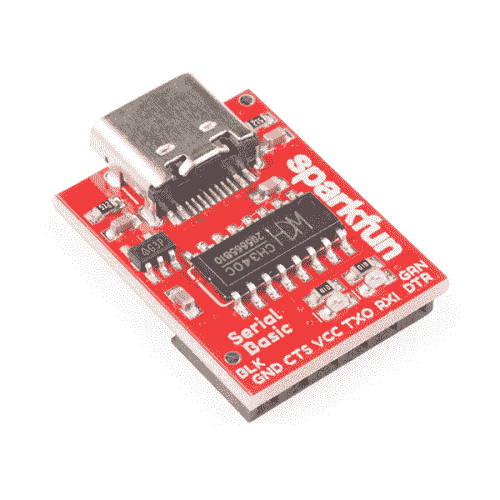
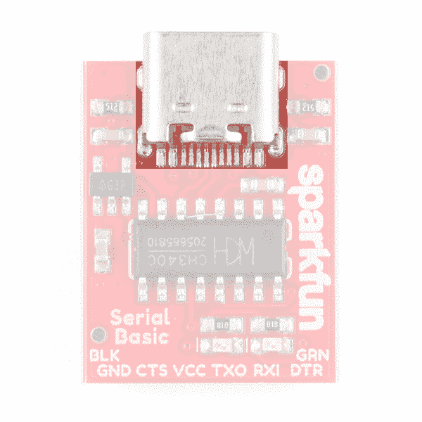
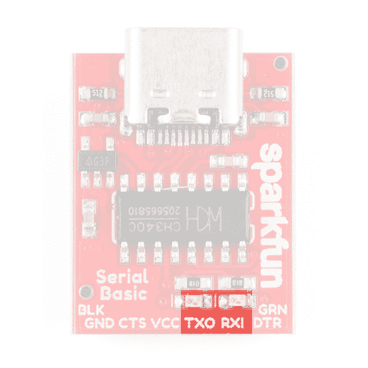
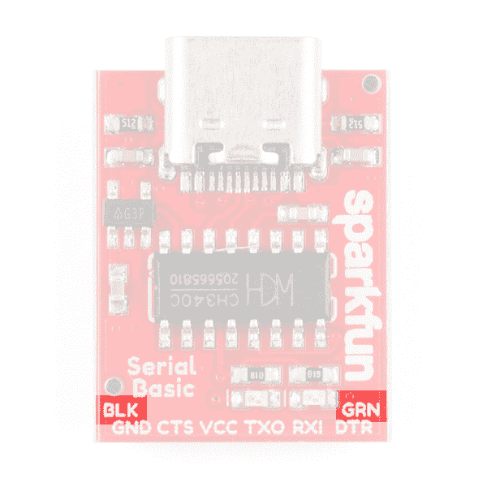
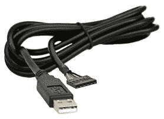
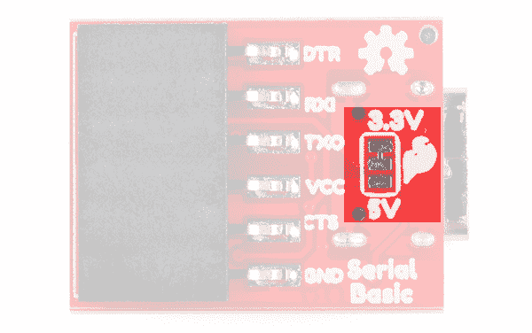
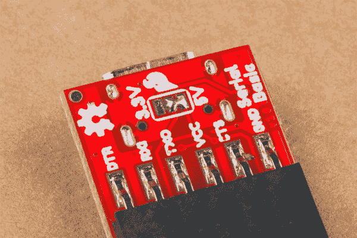
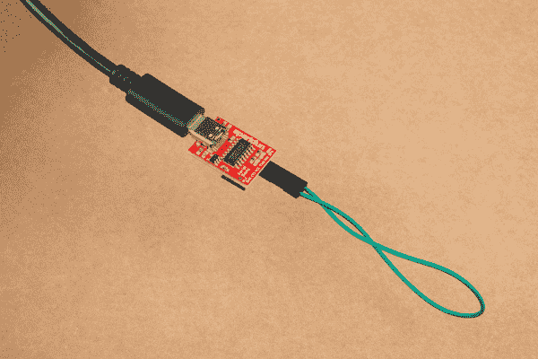
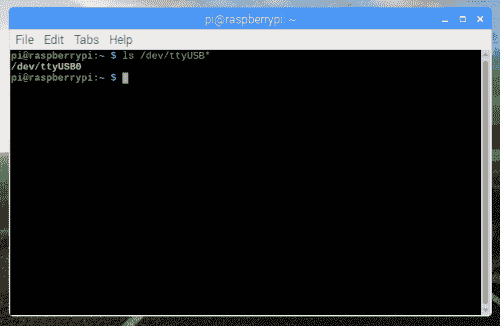
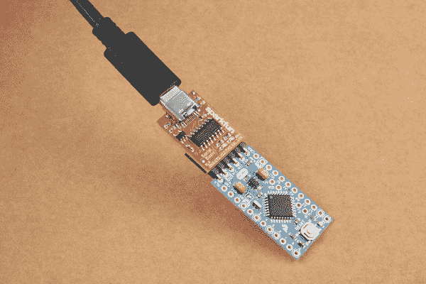

# SparkFun 系列基本款 CH340C 连接指南

> 原文：<https://learn.sparkfun.com/tutorials/sparkfun-serial-basic-ch340c-hookup-guide>

## 介绍

SparkFun Serial Basic Breakout 的[最新版本利用了 USB-C，是一款基于 WCH*ch 340 C*IC 的易于使用的 USB 转串行适配器。有了 USB-C，你可以获得三倍于上一代 USB 的功率，并且具有*可逆*的便利特性。该产品适用于 5V 和 3.3V 系统，可以在大多数操作系统上自动安装，无需额外的驱动程序。Serial Basic 使用 CH340C IC 快速轻松地将串行信号转换为 USB。这是非常受欢迎的 FTDI 基础版](https://www.sparkfun.com/products/15096)[的一个很好的低成本替代品。](https://www.sparkfun.com/products/9716)

[](https://www.sparkfun.com/products/15096) 

将**添加到您的[购物车](https://www.sparkfun.com/cart)中！**

### [SparkFun 系列基本突破- CH340C 和 USB-C](https://www.sparkfun.com/products/15096)

[In stock](https://learn.sparkfun.com/static/bubbles/ "in stock") DEV-15096

这款 SparkFun Serial Basic Breakout 是一款基于 CH340G 的易于使用的 USB 转串行适配器，利用了 ha…

$9.957[Favorited Favorite](# "Add to favorites") 30[Wish List](# "Add to wish list")** **### 所需材料

至少，您需要以下材料来跟随教程。你可能不需要所有的东西，但这取决于你有什么和你的设置。将它添加到您的购物车，通读指南，并根据需要调整购物车。

[](https://www.sparkfun.com/products/12795) 

将**添加到您的[购物车](https://www.sparkfun.com/cart)中！**

### [【跳线-连接 6”(米/米，20 个装)](https://www.sparkfun.com/products/12795)

[In stock](https://learn.sparkfun.com/static/bubbles/ "in stock") PRT-12795

这些是 6 英寸长的跳线，两端都有公接头。使用这些从任何板上的任何母接头跳线到…

$2.102[Favorited Favorite](# "Add to favorites") 28[Wish List](# "Add to wish list")****[](https://www.sparkfun.com/products/14743) 

将**添加到您的[购物车](https://www.sparkfun.com/cart)中！**

### [USB 3.1 线 A 到 C - 3 脚](https://www.sparkfun.com/products/14743)

[In stock](https://learn.sparkfun.com/static/bubbles/ "in stock") CAB-14743

USB C 棒极了。但是，在我们将所有的集线器、充电器和端口转换为 USB C 之前，这是您要使用的电缆…

$5.504[Favorited Favorite](# "Add to favorites") 9[Wish List](# "Add to wish list")**** ****### 推荐阅读

在开始之前，可能有必要先了解一下串行通信的基础知识。你有最喜欢的终端程序了吗？没有吗？看一看串行终端基础教程，它将简要介绍流行的终端程序。

[](https://learn.sparkfun.com/tutorials/serial-communication) [### 串行通信](https://learn.sparkfun.com/tutorials/serial-communication) Asynchronous serial communication concepts: packets, signal levels, baud rates, UARTs and more 100[](https://learn.sparkfun.com/tutorials/terminal-basics) [### 串行终端基础知识](https://learn.sparkfun.com/tutorials/terminal-basics) This tutorial will show you how to communicate with your serial devices using a variety of terminal emulator applications.[Favorited Favorite](# "Add to favorites") 46[](https://learn.sparkfun.com/tutorials/how-to-work-with-jumper-pads-and-pcb-traces) [### 如何使用跳线焊盘和 PCB 走线](https://learn.sparkfun.com/tutorials/how-to-work-with-jumper-pads-and-pcb-traces) Handling PCB jumper pads and traces is an essential skill. Learn how to cut a PCB trace, add a solder jumper between pads to reroute connections, and repair a trace with the green wire method if a trace is damaged.[Favorited Favorite](# "Add to favorites") 11

## 串行基本概述

串行基本引脚排列模仿数百种 FTDI 至 USB 衍生产品上常见的DTR/RX/TX/VCC/CTS/GND 引脚排列。

| Pin Label | 输入/输出 | 描述 |
| DTR | 输出 | 数据终端就绪，低电平有效 |
| RXI | 投入 | 串行接收 |
| TXO | 输出 | 串行传输 |
| VCC | 供应输出 | 电源 **3.3V(默认)**或 5V |
| CTS | 投入 | 清除发送，低电平有效 |
| GND | 供应输出 | 接地(0V)电源 |

### USB-C

USB-C 为您提供了比上一代 USB 更强大的潜力。USB-C 用于为从笔记本电脑到低功率微控制器的所有设备供电，并且具有惊人的可逆能力。

[](https://cdn.sparkfun.com/assets/learn_tutorials/8/3/7/USB-C.jpg)

### 发光二极管

板上的两个发光二极管连接到 TX(绿色)和 RX(黄色)，并正确对准 silk header 标签:`RXI`和`TXO`。这是查看串行流量的快捷方式。

[](https://cdn.sparkfun.com/assets/learn_tutorials/8/3/7/LEDs.jpg)

### 对齐标记

USB-C 连接器对面角落里的`GRN`和`BLK`丝线帮助您将主板与使用这些相同方向指示器的产品正确对齐。

[](https://cdn.sparkfun.com/assets/learn_tutorials/8/3/7/Alignment_Markers.jpg)

串行基本接口可与使用标准串行连接的产品无缝对接。如果您看到带有`BLK`和`GRN`标签的主板，那么您知道它将与**串行基本**兼容。


*See the GRN and BLK labels on this [nRF52832 Breakout](https://www.sparkfun.com/products/13990)?***Where did GRN and BLK come from?** Way back in 2008, when we created the [Arduino Pro Mini](https://www.sparkfun.com/products/11113), we needed to have a pinout to allow serial bootloading. At the time, the best USB to TTL Serial device was the FT232 Cable. Its unpolarized connector could be flipped either way so we added the words **GRN** and **BLK** to the PCB to let folks know how to line up the colored wires. The practice stuck! Now, many boards use this standard.

[](https://cdn.sparkfun.com/assets/learn_tutorials/5/9/7/FTDI_Cable.jpg)
*The cable with colored wires*

### 电压选择跳线

电路板下面有一个跳线，用于控制 VCC 引脚上的输出电压。默认情况下，板卡输出 **3.3V** ，有 **3.3V 信号**。

[](https://cdn.sparkfun.com/assets/learn_tutorials/8/3/7/Serial_Basic_IO_Logic_SelectionJumpers.jpg)*There is a small trace connecting the middle pad and the top pad labeled `3.3V`.*

当跳线设置为 3.3V 时，评估板使用能够提供 600mA 电流的片上 3.3V 稳压器。如果你试图拉动超过 600 毫安，稳压器将进入短路关闭，它将只输出 150 毫安。

通过[切断中心和`3.3V`标记的焊盘之间的轨迹](https://learn.sparkfun.com/tutorials/how-to-work-with-jumper-pads-and-pcb-traces)和[将焊料](https://learn.sparkfun.com/tutorials/how-to-solder---through-hole-soldering)放在中心和`5V`标记的焊盘上，可以将板卡的输出和信号变为 5V。这将通过 **5V 信号**将板的输出变为 VCC 引脚上的 **5V** 。

[](https://cdn.sparkfun.com/assets/learn_tutorials/8/3/7/Serial_Basic_CH340C-02.jpg)

当跳线设置为 5V 时，主板将提供与 USB 端口所能提供的一样多的电源。使用 USB-C，最高可达 1.5 安培，但根据电源和电缆的容量，最高可达 3 安培。

## 硬件测试

要将该板连接到计算机，您需要一根 [USB-C](https://www.sparkfun.com/products/14743) 电缆。将 USB-C 电缆插入电脑的 USB 端口，另一端插入串行基本接口。您的计算机应该自动安装必要的驱动程序，并在您的计算机上创建一个 COM 端口。如果提示您输入驱动程序，请参见[驱动程序](https://learn.sparkfun.com/tutorials/sparkfun-serial-basic-ch340c-hookup-guide#drivers-if-you-need-them)部分。

确保一切正常的最快、最简单的方法是进行 TX/RX 环回。为此，在 **TX** 和 **RX** 之间插入一根[跳线](https://www.sparkfun.com/products/12795)，如下图所示。从 TX 引脚发送的任何信号都将被*反射*回 RX 引脚。

[](https://cdn.sparkfun.com/assets/learn_tutorials/8/3/7/USB-C_and_Jumper_Wire.jpg)

现在你已经插上电源，打开你最喜欢的终端程序。选择串行基本接口分配到的 COM 端口，并连接。当您键入一个字符时，您应该看到您键入的每个字符都在终端中回显，并且 RX 和 TX LEDs 会随着您的键入而闪烁。

[](https://cdn.sparkfun.com/assets/learn_tutorials/5/9/7/Terminal_Window_with_Echoed_Characters.jpg)*Success!*

## 我需要哪个 COM 端口？

大多数程序会显示创建该端口的 USB 设备的描述。要验证您的驱动程序是否正常工作，您可以使用串行终端、Arduino IDE、设备管理器或命令行。

### 串行终端

寻找与 **CH340C** 关联的端口。下图显示了在一个[串行终端](https://learn.sparkfun.com/tutorials/terminal-basics/tera-term-windows)内的一个 COM 端口上的串行基本枚举。

[](https://cdn.sparkfun.com/assets/learn_tutorials/5/9/7/SerialPort_Name-3.jpg)

### Arduino IDE 连接埠

如果你使用的是 Arduino IDE，确定哪个 COM 端口是你想要的就更困难了。这里有一个快速的方法来解决这个问题:将串行 Basic 连接到你的计算机上，并检查列出了哪些 COM 端口。在下图中，我们有两个端口。现在点击 Arduino IDE 主窗口，关闭**工具**菜单。

[](https://cdn.sparkfun.com/assets/learn_tutorials/5/9/7/SerialPort_Name-1.jpg)*Which COM port should I select?*

拔下串口 Basic，重新打开**工具**->-**端口**子菜单。您将看到其中一个串行端口丢失。那才是你想要的！重新插上串行 Basic，并使用 COM 端口。

[](https://cdn.sparkfun.com/assets/learn_tutorials/5/9/7/SerialPort_Name-2.jpg)**Note:** You need to close and re-open the tools menu before Arduino will refresh the port list. If you have the tool menu open simply click on the main window, then click back on **Tools** -> **Port**.

#### Windows:设备管理器

如果该板出现在您的设备管理器中，您也可以验证它是否已安装。你可以点击**开始**或者`⊞` ( **Windows** )按钮，输入“设备”快速搜索应用。(*在 Windows 10 上，快速搜索功能对您正在搜索的应用程序的拼写很挑剔。例如，使用“_devi_”可能会得到结果，而使用“_device_”可能得不到结果。)

[](https://cdn.sparkfun.com/assets/learn_tutorials/8/4/4/Win7_10_Device_Check.PNG)
*Screenshot of Window 10 Device Manager with Serial Basic on COM42\. **Click** to enlarge.*

#### 麦克·OSX:命令行

通过命令行在 Mac 上验证。要打开命令行窗口，请转到您的**应用程序**文件夹、**实用程序**文件夹，然后双击**终端**。否则，按`⌘` ( **命令** ) + `space bar` ( **空格键**)启动 Spotlight，输入“终端”，然后双击搜索结果。

在终端中运行以下命令“`ls /dev/cu*`”，并检查以下更改(您的板可能显示在不同的设备名称下)。

```
language:bash
ls /dev/cu* 
```

您应该会得到类似下图所示的内容。

[](https://cdn.sparkfun.com/assets/learn_tutorials/8/4/4/MacOSX_Device_Check.png)
*Screenshot of Mac OSX terminal with Serial Basic on cu.wchusbserialfd1410\. **Click** to enlarge.***Note:** If you are still unsure of how to access the Terminal, [watch this video](https://www.youtube.com/watch?v=zw7Nd67_aFw) or read this [Apple support article](https://support.apple.com/guide/terminal/open-or-quit-terminal-apd5265185d-f365-44cb-8b09-71a064a42125/mac).

#### Raspbian:命令行

在 CLI/终端中运行以下命令“`ls /dev/ttyUSB*`”，并检查以下更改(您的板可能会显示在不同的设备名称下)。

```
language:bash
ls /dev/ttyUSB* 
```

您应该会得到类似下图所示的内容。

[](https://cdn.sparkfun.com/r/500-500/assets/learn_tutorials/8/4/4/Raspbian_Stretch_Device_Check.png)
*Screenshot of Raspberry Pi CLI with Serial Basic on ttyUSB0\. **Click** to enlarge*

## 驱动程序(如果需要的话)

该驱动程序应该会自动安装在大多数操作系统上。然而，有各种各样的操作系统。第一次将芯片连接到计算机的 USB 端口时，或者有操作系统更新时，您可能需要安装驱动程序。更多信息，请查看我们的[如何安装 CH340 驱动教程](https://www.sparkfun.com/ch340)。

[](https://learn.sparkfun.com/tutorials/how-to-install-ch340-drivers) [### 如何安装 CH340 驱动程序

#### 2019 年 8 月 6 日](https://learn.sparkfun.com/tutorials/how-to-install-ch340-drivers) How to install CH340 drivers (if you need them) on Windows, Mac OS X, and Linux.[Favorited Favorite](# "Add to favorites") 9

## 资源和更进一步

一旦串行通信开始工作，就可以开始玩串行项目了。考虑连接到类似 [GP-20U7](https://www.sparkfun.com/products/13740) 的 GPS 模块，看看我们关于 [GPS](https://learn.sparkfun.com/tutorials/gps-basics) 的教程，看看串行字符串滚动。或者，你可以使用*串行 Basic* 对像 [Arduino Pro Mini](https://www.sparkfun.com/products/11114) 这样的设备进行编程和调试。有大量的设备使用串行通信，所以去探索吧！

[](https://cdn.sparkfun.com/assets/learn_tutorials/8/3/7/USB-C_and_Arduino_Pro_Mini.jpg)*The Serial Basic programming an [Arduino Pro Mini](https://www.sparkfun.com/products/11114)***Heads up!** The image shows the Serial Basic connected to an Arduino Pro Mini 3.3V/8MHz. If you are using an Arduino Pro Mini 5V/16MHz, make sure to adjust the jumper pad for the voltage selection on the back of the Serial Basic.

查看串行基础的其他资源。

*   [示意图(PDF)](https://cdn.sparkfun.com/assets/learn_tutorials/8/3/7/Serial-Basic-CH340C_Datasheet.pdf)
*   [老鹰文件(ZIP)](https://cdn.sparkfun.com/assets/learn_tutorials/8/3/7/Serial-Basic-CH340C.zip)
*   [数据表(PDF)](https://cdn.sparkfun.com/assets/9/3/0/2/e/ch3402CDS.pdf) (CH340C)
*   [WCH: CH340 驱动程序](http://www.wch-ic.com/downloads/CH341SER_ZIP.html) -可以从制造商处找到最新的驱动程序
    *   [Windows (EXE)](https://cdn.sparkfun.com/assets/learn_tutorials/8/4/4/CH341SER.EXE) -驱动程序可执行文件
    *   [Windows (ZIP)](https://cdn.sparkfun.com/assets/learn_tutorials/5/9/7/Windows-CH340-Driver.zip) -驱动程序版本 3.4 (2016-09-27)
    *   [Linux (ZIP)](https://cdn.sparkfun.com/assets/learn_tutorials/8/4/4/CH341SER_LINUX.ZIP) -驱动 1.5 版(2018-03-18)
    *   [Mac (ZIP)](https://cdn.sparkfun.com/assets/learn_tutorials/8/4/4/CH341SER_MAC.ZIP) -驱动程序 v1.5 (2018-07-04)
*   [GitHub](https://github.com/sparkfun/Serial_Basic_Breakout-CH340C)

* * *

查看这些其他伟大的 SparkFun 教程。

[](https://learn.sparkfun.com/tutorials/usb-type-a-female-breakout-hookup-guide) [### USB 型插座连接指南](https://learn.sparkfun.com/tutorials/usb-type-a-female-breakout-hookup-guide) An above-and-beyond example using the USB Type A Female Breakout board.[Favorited Favorite](# "Add to favorites") 1[](https://learn.sparkfun.com/tutorials/si4703-fm-radio-receiver-hookup-guide) [### Si4703 调频收音机接收器连接指南](https://learn.sparkfun.com/tutorials/si4703-fm-radio-receiver-hookup-guide) Add some tunes to your project with the Si4703 FM Radio Receiver Breakout.[Favorited Favorite](# "Add to favorites") 5[](https://learn.sparkfun.com/tutorials/sparkfun-gatorlog-hookup-guide) [### 火花短吻鳄:日志连接指南](https://learn.sparkfun.com/tutorials/sparkfun-gatorlog-hookup-guide) The gator:log is a serial communication based data logger. This tutorial will get you started using the gator:log with the micro:bit platform.[Favorited Favorite](# "Add to favorites") 1[](https://learn.sparkfun.com/tutorials/industrial-fiber-optics-hookup-guide) [### 工业光纤连接指南](https://learn.sparkfun.com/tutorials/industrial-fiber-optics-hookup-guide) Learn how to get started with our fiber optics breakout boards[Favorited Favorite](# "Add to favorites") 3

你的下一个项目需要一些灵感吗？查看一些相关教程:

[](https://learn.sparkfun.com/tutorials/serial-communication) [### 串行通信](https://learn.sparkfun.com/tutorials/serial-communication) Asynchronous serial communication concepts: packets, signal levels, baud rates, UARTs and more 100[](https://learn.sparkfun.com/tutorials/gps-basics) [### GPS 基础知识](https://learn.sparkfun.com/tutorials/gps-basics) The Global Positioning System (GPS) is an engineering marvel that we all have access to for a relatively low cost and no subscription fee. With the correct hardware and minimal effort, you can determine your position and time almost anywhere on the globe.[Favorited Favorite](# "Add to favorites") 31[](https://learn.sparkfun.com/tutorials/using-the-arduino-pro-mini-33v) [### 使用 Arduino Pro Mini 3.3V](https://learn.sparkfun.com/tutorials/using-the-arduino-pro-mini-33v) This tutorial is your guide to all things Arduino Pro Mini. It explains what it is, what it's not, and how to get started using it.[Favorited Favorite](# "Add to favorites") 16[](https://learn.sparkfun.com/tutorials/terminal-basics) [### 串行终端基础知识](https://learn.sparkfun.com/tutorials/terminal-basics) This tutorial will show you how to communicate with your serial devices using a variety of terminal emulator applications.[Favorited Favorite](# "Add to favorites") 46******