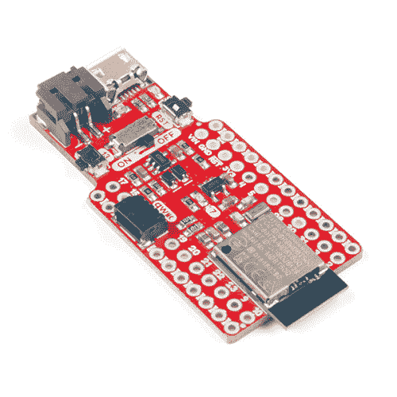

# SparkFun Pro nRF52840 迷你连接指南

> 原文：<https://learn.sparkfun.com/tutorials/sparkfun-pro-nrf52840-mini-hookup-guide>

## 介绍

[SparkFun Pro nRF52840 Mini](https://www.sparkfun.com/products/15025) 是 [Nordic Semiconductor 的 nRF52840](https://www.nordicsemi.com/eng/Products/nRF52840) 的突破和开发板——ARM Cortex-M4 CPU 和 2.4 GHz 蓝牙无线电的强大组合。随着 nRF52840 成为您项目的核心，您将看到一个看似无穷无尽的项目可能性列表。

 

### [SparkFun Pro nRF52840 迷你蓝牙开发板](https://www.sparkfun.com/products/15025)

[Out of stock](https://learn.sparkfun.com/static/bubbles/ "out of stock") DEV-15025

SparkFun Pro nRF52840 Mini 是 Nordic NRF 52840 的开发板，这是 ARM Cortex-M4 CPU 的强大组合…

1[Favorited Favorite](# "Add to favorites") 30[Wish List](# "Add to wish list")

我们用于 nRF52840 的“迷你”开发板在保持小尺寸的同时，断开了大多数关键的 I/O 引脚。它具有一个 USB 接口(使用 nRF52840 的原生 USB 支持)，可用于编程、供电和与芯片通信。还包括一个 LiPo 电池充电器、 [qwiic 连接器](https://www.sparkfun.com/qwiic)、开/关开关、复位开关和一个用户 LED/按钮。

该板预编程有一个 **USB 引导加载程序**。您可以使用 Arduino、Circuit Python 或 C(使用 Nordic 的 nRF5 SDK)为 nRF52840 的 Cortex-M4 开发程序，并使用 USB 串行或大容量存储接口加载编译后的代码。

[https://www.youtube.com/embed/OYTAytwIQCY/?autohide=1&border=0&wmode=opaque&enablejsapi=1](https://www.youtube.com/embed/OYTAytwIQCY/?autohide=1&border=0&wmode=opaque&enablejsapi=1)

### 本教程涵盖的内容

本教程旨在向您介绍 nRF52840 以及我们的 Pro nRF52840 迷你分线点的硬件特性。它将帮助您组装电路板，然后将您送上您选择的软件开发方法。

请务必查看[软件开发指南](https://learn.sparkfun.com/tutorials/sparkfun-pro-nrf52840-mini-hookup-guide#software-development-guides)部分，该部分分为 [Arduino](https://learn.sparkfun.com/tutorials/nrf52840-development-with-arduino-and-circuitpython) 、 [Circuit Python](https://learn.sparkfun.com/tutorials/nrf52840-development-with-arduino-and-circuitpython) 或 [C (Nordic SDK)](https://learn.sparkfun.com/tutorials/nrf52840-advanced-development-with-the-nrf5-sdk) 开发指南。

### 所需材料

要跟随本教程，您将需要以下材料。你可能不需要所有的东西，这取决于你已经拥有的东西。将它添加到您的购物车，通读指南，并根据需要调整购物车。