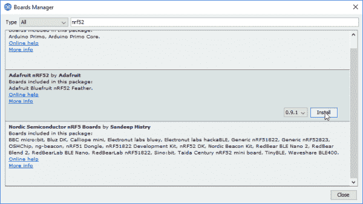
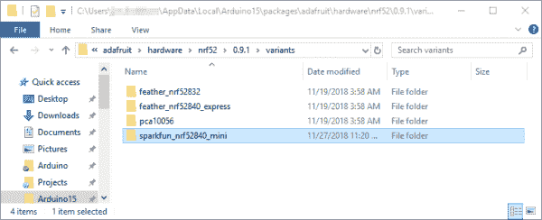
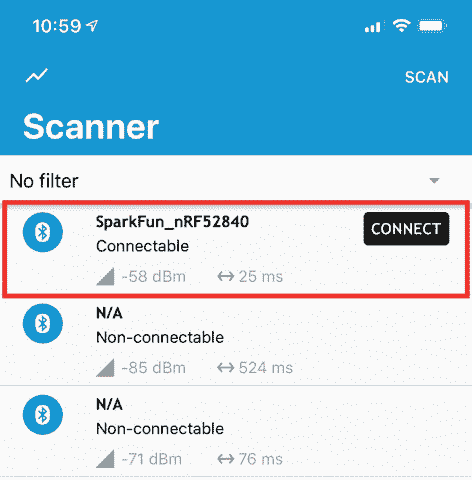
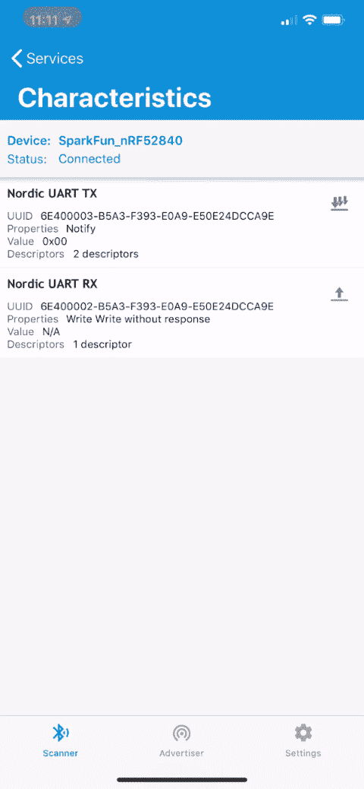
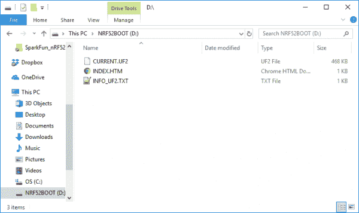
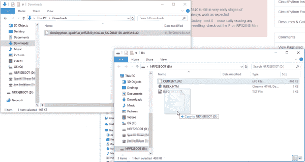
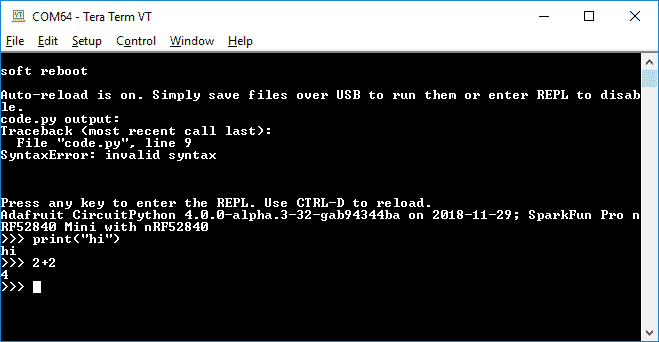

# 使用 Arduino 和 CircuitPython 开发 nRF52840

> 原文：<https://learn.sparkfun.com/tutorials/nrf52840-development-with-arduino-and-circuitpython>

## 介绍

无论你是一个学习如何编程的程序员新手，还是一个寻找快速原型开发环境的经验丰富的专家， [Arduino](https://arduino.cc) 和 [CircuitPython](https://en.wikipedia.org/wiki/CircuitPython) 都是编程环境/语言的绝佳选择。将这些简单的编程语言与强大的微控制器(如 [nRF52840](https://www.nordicsemi.com/eng/Products/nRF52840) )相结合，将它们带到了一个全新的水平——一个具有蓝牙功能的水平！

在本教程中，我们将演示如何为您的 nRF52840 和开发计算机配备在 Arduino 或 CircuitPython 中开发所需的固件和软件。这两种语言都支持数字 I/O 输入/输出、模拟输入、串行总线，以及 nRF52840 最关键的功能:支持**蓝牙低功耗(BLE)** 。

### 所需材料

[](https://www.sparkfun.com/products/15025) 

### [SparkFun Pro nRF52840 迷你蓝牙开发板](https://www.sparkfun.com/products/15025)

[Out of stock](https://learn.sparkfun.com/static/bubbles/ "out of stock") DEV-15025

SparkFun Pro nRF52840 Mini 是 Nordic NRF 52840 的开发板，这是 ARM Cortex-M4 CPU 的强大组合…

1[Favorited Favorite](# "Add to favorites") 30[Wish List](# "Add to wish list")

我们将主要关注在 [SparkFun Pro nRF52840 Mini](https://www.sparkfun.com/products/15025) 上使用这些编程工具，但任何其他 nRF52840 都应该是可适应的。唯一需要注意的是 [Adafruit nRF52840 引导程序](https://github.com/adafruit/Adafruit_nRF52_Bootloader)应该安装在 nRF52840 上。

### 推荐阅读

如果您尚未通读，我们建议您在继续阅读之前跟随我们的 [SparkFun Pro nRF52840 迷你连接指南](https://learn.sparkfun.com/tutorials/sparkfun-pro-nrf52840-mini-hookup-guide)。本教程将使您熟悉主板的硬件特性以及 DFU/UF2 引导程序的复杂性。

[](https://learn.sparkfun.com/tutorials/sparkfun-pro-nrf52840-mini-hookup-guide) [### SparkFun Pro nRF52840 迷你连接指南

#### 2018 年 11 月 29 日](https://learn.sparkfun.com/tutorials/sparkfun-pro-nrf52840-mini-hookup-guide) A hardware overview and hookup guide for the SparkFun Pro nRF52840 Mini -- a breakout for Nordic's impossibly cool Bluetooth/ARM Cortex M4 SoC.[Favorited Favorite](# "Add to favorites") 2

## Arduino 安装

有了 Arduino [板管理器](https://www.arduino.cc/en/Guide/Cores)，在 Arduino IDE 中安装新的板支持变得轻而易举！不过，为 SparkFun Pro nRF52840 Mini 安装推荐的支持还需要一个额外的步骤。

**Note:** This example assumes you are using the latest version of the Arduino IDE on your desktop. If this is your first time using Arduino, please review our tutorial on [installing the Arduino IDE.](https://learn.sparkfun.com/tutorials/installing-arduino-ide) If you have not previously installed an Arduino library, please check out our [installation guide.](https://learn.sparkfun.com/tutorials/installing-an-arduino-library)

### 为 nRF52 主板安装 Arduino 核心

为 nRF52832 开发了 [nRF52 Arduino 内核](https://github.com/adafruit/Adafruit_nRF52_Arduino)的 Adafruit 表现出色，他们一直在扩展对 nRF52840 的支持。

要安装 nRF52 Arduino 核心:

*   打开 Arduino IDE(必须是 v1.6.12 或更高版本)
*   导航至**偏好设置**
*   在“附加 Board Manager URL”框中，添加[https://github . com/ada fruit/arduino-Board-index/blob/GH-pages/package _ ada fruit _ index . JSON](https://github.com/adafruit/arduino-board-index/blob/gh-pages/package_adafruit_index.json)
*   进入**工具** > **板卡**，选择**板卡管理器**。
*   搜索“nRF”，应该会找到 **Adafruit nRF52** 板包。
*   确保选择了最新版本，然后点击**安装**

[](https://cdn.sparkfun.com/assets/learn_tutorials/8/4/2/Arduino_Boards_Manager.png)*Having a hard time seeing? Click the image for a closer look.*

安装可能需要几分钟——安装中包括 Arduino 核心和 nRF52 库的所有必要源文件，以及所有编译器和软件上传工具，您需要将 nRF52840 与 Arduino 配合使用。

一旦安装了板定义，您应该在您的工具>板菜单下看到一组新的 nRF52 板。然而，你不会看到 SparkFun Pro nRF52840 Mini 的选项。为此，我们需要手动添加一个新板。

### 将 SparkFun Pro nRF52840 Mini 添加到电路板菜单

要将“SparkFun Pro nRF52840 Mini”选项添加到 nRF52 板列表中，我们需要对您刚刚安装的 Arduino 核心进行一些小的手动修改。

#### 为什么要定义 SparkFun Pro nRF52840 迷你板？

通过 Arduino 将代码上传到 nRF52840 时，不需要添加这些主板修改。最重要的是，这些电路板定义有助于定义引脚布线。他们将帮助路由下列串行总线和引脚:

*   **硬件序列** ( `Serial1`)到引脚 17 (TX)和 15 (RX)以匹配 Arduino Pro 迷你引脚排列
*   **I ² C** 到引脚 8 (SDA)和 11 (SCL)。如果您使用的是 **qwiic** 连接器，这一点很重要。
*   **SPI** 至引脚 31 (MISO)、3 (MOSI)、30(SCK)–再次匹配 Arduino Pro 迷你引脚排列。
*   **内置 LED** ( `LED_BUILTIN`)到引脚 7

如果您想跳过这一步，即使是暂时的，您也可以使用 nRF52840DK PCA10056 上的 **Adafruit Bluefruit 作为您的电路板选择。**

要为 nRF52 Arduino 内核添加 SparkFun nRF52840 板支持，需要修改一个文件( **boards.txt** )，并复制一个新文件夹(**variants/spark fun _ NRF 52840 _ mini**)。你可以从我们的 [GitHub 库](https://github.com/sparkfun/nRF52840_Breakout_MDBT50Q/tree/master/Firmware/Arduino)获取这些文件的最新版本，或者点击下面的按钮解压 ZIP 文件内容:

[Download the SparkFun nRF52840 Arduino Board Definitions](https://cdn.sparkfun.com/assets/learn_tutorials/8/4/2/sparkfun-nrf52840-arduino-board-def-v1.4.zip)

要放置文件，首先导航到 Adafruit nRF52 核心安装。如果您是通过 board manager 安装的，它可能位于以下文件夹中:

*   **视窗** : `%LOCALAPPDATA%\Arduino15\packages\adafruit\hardware\nrf52\<version>`
*   **OS X** : `~/Library/Arduino15/packages/adafruit/hardware/nrf52/<version>`
*   **Linux** : `~/.arduino15/packages/adafruit/hardware/nrf52/<version>`

如果你手动安装了核心到你的 Arduino sketchbook，它会在“hardware/adafruit/nrf52”中。

然后**打开 boards.txt** 。滚动到底部，然后**将下面的**粘贴到该文件的底部:

```
language:text
#**********************************************
# SparkFun Pro nRF52840 Mini
#**********************************************
sparkfunnrf52840mini.name=SparkFun Pro nRF52840 Mini

# DFU Mode with CDC only
sparkfunnrf52840mini.vid.0=0x1B4F
sparkfunnrf52840mini.pid.0=0x002A

# DFU Mode with CDC + MSC (UF2)
sparkfunnrf52840mini.vid.1=0x1B4F
sparkfunnrf52840mini.pid.1=0x0029

# Application with CDC + MSC
sparkfunnrf52840mini.vid.2=0x1B4F
sparkfunnrf52840mini.pid.2=0x8029

# CircuitPython
sparkfunnrf52840mini.vid.2=0x1B4F
sparkfunnrf52840mini.pid.2=0x802A

sparkfunnrf52840mini.bootloader.tool=bootburn

# Upload
sparkfunnrf52840mini.upload.tool=nrfutil
sparkfunnrf52840mini.upload.protocol=nrfutil
sparkfunnrf52840mini.upload.use_1200bps_touch=true
sparkfunnrf52840mini.upload.wait_for_upload_port=true
#sparkfunnrf52840mini.upload.native_usb=true

# Build
sparkfunnrf52840mini.build.mcu=cortex-m4
sparkfunnrf52840mini.build.f_cpu=64000000
sparkfunnrf52840mini.build.board=NRF52840_FEATHER
sparkfunnrf52840mini.build.core=nRF5
sparkfunnrf52840mini.build.variant=sparkfun_nrf52840_mini
sparkfunnrf52840mini.build.extra_flags=-DNRF52840_XXAA {build.flags.usb}
sparkfunnrf52840mini.build.vid=0x1B4F
sparkfunnrf52840mini.build.pid=0x5284
sparkfunnrf52840mini.build.usb_manufacturer="SparkFun"
sparkfunnrf52840mini.build.usb_product="nRF52840 Mini Breakout"

# SofDevice Menu
# Ram & ROM size varies depending on SoftDevice (check linker script)

sparkfunnrf52840mini.menu.softdevice.s140v6=s140 6.1.1 r0
sparkfunnrf52840mini.menu.softdevice.s140v6.build.sd_flags=-DS140
sparkfunnrf52840mini.menu.softdevice.s140v6.build.sd_name=s140
sparkfunnrf52840mini.menu.softdevice.s140v6.build.sd_version=6.1.1
sparkfunnrf52840mini.menu.softdevice.s140v6.build.sd_fwid=0x00B6
sparkfunnrf52840mini.menu.softdevice.s140v6.build.ldscript=nrf52840_s140_v6.ld
sparkfunnrf52840mini.menu.softdevice.s140v6.upload.maximum_size=815104
sparkfunnrf52840mini.menu.softdevice.s140v6.upload.maximum_data_size=248832

# Debug Menu
sparkfunnrf52840mini.menu.debug.l0=Level 0 (Release)
sparkfunnrf52840mini.menu.debug.l0.build.debug_flags=-DCFG_DEBUG=0 -Os
sparkfunnrf52840mini.menu.debug.l1=Level 1 (Error Message)
sparkfunnrf52840mini.menu.debug.l1.build.debug_flags=-DCFG_DEBUG=1 -Os
sparkfunnrf52840mini.menu.debug.l2=Level 2 (Full Debug)
sparkfunnrf52840mini.menu.debug.l2.build.debug_flags=-DCFG_DEBUG=2 -Os
sparkfunnrf52840mini.menu.debug.l3=Level 3 (Segger SystemView)
sparkfunnrf52840mini.menu.debug.l3.build.debug_flags=-DCFG_DEBUG=3 -Os 
```

然后将该目录下“variants”文件夹的内容复制到原目录下的“variants”文件夹中。不应覆盖任何内容，但应添加一个新的“sparkfun_nrf52840_mini”目录。

[](https://cdn.sparkfun.com/assets/learn_tutorials/8/4/2/arduino-board-variant-copy.png)*Having a hard time seeing? Click the image for a closer look.*

完成这些修改后，**如果 Arduino IDE** 已打开，请重新启动它。

### 安装 adafruit-nrfutil

一个名为 [adafruit-nrfutil](https://github.com/adafruit/Adafruit_nRF52_nrfutil) 的程序用于打包和上传编译后的代码到 NRF 52840——类似于 [avrdude](https://www.nongnu.org/avrdude/) 为 Arduino Uno 和其他 AVR 板所做的事情。

如果你使用的是 **Windows 或 Mac 电脑**，你可以忽略这一部分。adafruit-nrfutil 会自动安装电路板定义。

**Linux** 用户需要手动安装 adafruit-nrfutil。adafruit-nrfutil 是一个基于 Python 的程序，用 PyPi 类型安装它:

```
language:python
pip3 install adafruit-nrfutil --user 
```

(如果你还没有安装 Python 3，你可能需要安装它。)

## Arduino 示例

使用 Arduino nRF52 内核，您可以编程`digitalWrite` I/O、`analogRead` ADC 引脚、`Serial`打印到串行监视器、使用`Serial1`与硬件串行交互，甚至使用 Wire 和 SPI 库执行更复杂的 I ² C 或 SPI 写操作。但是，如果你以前做过 Arduino 开发，这些可能并不那么令人兴奋。让我们做一些蓝牙的东西！

nRF52 Arduino 内核包括 [Bluefruit nRF52 库](https://github.com/adafruit/Adafruit_nRF52_Arduino/tree/master/libraries/Bluefruit52Lib)，可用于将您的 nRF52840 变成 BLE 外设和/或中央设备。通过导航到**文件** > **示例**>**Adafruit blue fruit NRF 52 库**浏览详尽的示例列表。如果你想从简单开始，一个建议是**外设/blinky_ota** 的例子。

### Blinky 按钮 BLE 示例代码

如果您还没有足够的示例，我们想提供一个简单的示例，演示如何通过 BLE 连接控制 nRF52840 的硬件组件并与之交互。这个例子允许你使用手机上的 BLE 应用程序切换 LED 并读取 pin-13 按钮状态。

要获取示例，请将以下内容复制并粘贴到 IDE 中的新 Arduino 草图中(或者在我们的 [GitHub repo](https://github.com/sparkfun/nRF52840_Breakout_MDBT50Q) 中获取最新版本):

```
language:c
/* BLE Example for SparkFun Pro nRF52840 Mini 
 *  
 *  This example demonstrates how to use the Bluefruit
 *  library to both send and receive data to the
 *  nRF52840 via BLE.
 *  
 *  Using a BLE development app like Nordic's nRF Connect
 *  https://www.nordicsemi.com/eng/Products/Nordic-mobile-Apps/nRF-Connect-for-Mobile
 *  The BLE UART service can be written to to turn the
 *  on-board LED on/off, or read from to monitor the 
 *  status of the button.
 *  
 *  See the tutorial for more information:
 *  https://learn.sparkfun.com/tutorials/nrf52840-development-with-arduino-and-circuitpython#arduino-examples  
*/
#include <bluefruit.h>

BLEUart bleuart; // uart over ble

// Define hardware: LED and Button pins and states
const int LED_PIN = 7;
#define LED_OFF LOW
#define LED_ON HIGH

const int BUTTON_PIN = 13;
#define BUTTON_ACTIVE LOW
int lastButtonState = -1;

void setup() {
  // Initialize hardware:
  Serial.begin(9600); // Serial is the USB serial port
  pinMode(LED_PIN, OUTPUT); // Turn on-board blue LED off
  digitalWrite(LED_PIN, LED_OFF);
  pinMode(BUTTON_PIN, INPUT);

  // Uncomment the code below to disable sharing
  // the connection LED on pin 7.
  //Bluefruit.autoConnLed(false);

  // Initialize Bluetooth:
  Bluefruit.begin();
  // Set max power. Accepted values are: -40, -30, -20, -16, -12, -8, -4, 0, 4
  Bluefruit.setTxPower(4);
  Bluefruit.setName("SparkFun_nRF52840");
  bleuart.begin();

  // Start advertising device and bleuart services
  Bluefruit.Advertising.addFlags(BLE_GAP_ADV_FLAGS_LE_ONLY_GENERAL_DISC_MODE);
  Bluefruit.Advertising.addTxPower();
  Bluefruit.Advertising.addService(bleuart);
  Bluefruit.ScanResponse.addName();

  Bluefruit.Advertising.restartOnDisconnect(true);
  // Set advertising interval (in unit of 0.625ms):
  Bluefruit.Advertising.setInterval(32, 244);
  // number of seconds in fast mode:
  Bluefruit.Advertising.setFastTimeout(30);
  Bluefruit.Advertising.start(0);  
}

void loop() {
  // If data has come in via BLE:
  if (bleuart.available()) {
    uint8_t c;
    // use bleuart.read() to read a character sent over BLE
    c = (uint8_t) bleuart.read();
    // Print out the character for debug purposes:
    Serial.write(c);

    // If the character is one of our expected values,
    // do something:
    switch (c) {
      // 0 number or character, turn the LED off:
      case 0:
      case '0':
        digitalWrite(LED_PIN, LED_OFF);
        break;
      // 1 number or character, turn the LED on:
      case 1:
      case '1':
        digitalWrite(LED_PIN, LED_ON);
        break;
      default:
        break;
    }
  }

  // If our button state has changed:
  int buttonState = digitalRead(BUTTON_PIN);
  if (buttonState != lastButtonState) {
    lastButtonState = buttonState;
    // Write the new button state to the bleuart TX char
    bleuart.write(!buttonState);
  }
} 
```

在上传之前，确保您已经选择了 **SparkFun Pro nRF52840** 作为您的板(如果您没有安装 SparkFun 板定义，请选择“Adafruit blue fruit on NRF 52840 dk PCA 10056”)。

#### 使用 nRF 连接控制电路板

为了测试这个示例草图，您需要将另一个设备(计算机或智能手机)连接到 nRF52840。Nordic 提供了一个免费的、方便的测试工具， [nRF Connect for Mobile](https://www.nordicsemi.com/eng/Products/Nordic-mobile-Apps/nRF-Connect-for-Mobile) ，适用于 Android 或 iOS。我们将使用这张草图演示如何控制 nRF52840 的 LED 并监控按钮。所以快去下载 app 吧！

[nRF Connect for Android](https://play.google.com/store/apps/details?id=no.nordicsemi.android.mcp) [nRF Connect for iOS](https://itunes.apple.com/us/app/nrf-connect/id1054362403?ls=1&mt=8)

下载后，打开应用程序，开始搜索附近的蓝牙设备。信号强度强的，你应该看到 **SparkFun_nRF52840** 。点击旁边的“连接”按钮。

[](https://cdn.sparkfun.com/assets/learn_tutorials/8/4/2/nrf-connect-board-connect.JPG)

一旦连接上，点击 **Nordic UART 服务**，你会看到一对特征:TX 和 RX。与您的预期相反，“TX”特性用于读取按钮状态，“RX”用于写入 LED。

要读取按钮状态，请单击“TX”特征右侧的三向下箭头图标。这将订阅通知。如果您按下并释放按钮，您应该会看到“值”从 0x00 变为 0x01，然后再变为 0x 01。

要写入 LED，单击“RX”特性上的向上箭头。选择“文本”作为您的格式。然后在文本框中输入“0”或“1 ”,并按“发送”。“0”将关闭 LED,“1”将打开 LED。

[](https://cdn.sparkfun.com/assets/learn_tutorials/8/4/2/nrf-connect-demo-480w.gif)

查看代码注释，了解如何使用`bleuart`服务来控制这两个特征。并查看 Bluefruit for nRF52 库中的其他示例！里面有些很棒的东西！

## CircuitPython 安装

你在寻找逃离 C/C++或者 Arduino 的方法吗？想把你的 nRF52840 变成一个 Python 解释奇迹吗？查看 CircuitPython 的 [nRF 端口！](https://github.com/adafruit/circuitpython/tree/master/ports/nrf)

#### 阿尔法发展

请注意，nRF52840 的 CircuitPython 端口开发仍处于非常早期的开发阶段。你是令人兴奋的事情的一部分，但是事情可能不总是像预期的那样进行。

如果你发现你的 nRF52840 处于未知状态，你总是可以在工厂重置它——本质上擦除任何应用程序并保留引导程序。有关工厂重置的说明，请查看 [Pro nRF52840 迷你连接指南](https://learn.sparkfun.com/tutorials/sparkfun-pro-nrf52840-mini-hookup-guide#factory-reset)。

### 闪光电路 Python

nRF52840 的 UF2 引导程序提供了一个基于拖放式 USB 大容量存储设备的编程接口，可用于将 CircuitPython 闪存到您的主板上。

首先，下载 CircuitPython 固件的最新版本。它被打包成一个. UF2 文件。

[Download the Latest CircuitPython for the SparkFun Pro nRF52840 Mini](https://cdn.sparkfun.com/assets/learn_tutorials/8/4/2/circuitpython-sparkfun_nrf52840_mini-en_US-20181129-ab94344.uf2)

接下来将你的 nRF52840 Mini 置于**引导模式**。双击复位按钮，或者按住 pin-13 同时点击复位按钮。您的计算机应该找到一个看起来像可移动 USB 驱动器的“NRF52BOOT”设备。

[](https://cdn.sparkfun.com/assets/learn_tutorials/8/4/2/circuitPython_nrf52boot_drive.png)

现在只需**将 UF2 文件拖到 NRF52BOOT** 上。文件复制完成后，您可能会收到一个警告，指出文件太大了——忽略它应该是安全的(点击“取消”)。

[](https://cdn.sparkfun.com/assets/learn_tutorials/8/4/2/circuitPython_drag_and_drop.png)*Having a hard time seeing? Click the image for a closer look.*

固件编程后，你的电脑上应该会弹出一个新的驱动: **CIRCUITPY** 。正如您在上编程固件一样，您将把 Python 文件拖放到该文件夹中以运行新的应用程序。

## CircuitPython 示例

新平台？新的编程语言？是时候让一些发光二极管闪烁了！复制下面的代码，使针脚 7 上的蓝色 LED 开始闪烁:

```
language:python
import time
import board
from digitalio import DigitalInOut, Direction, Pull

led = DigitalInOut(board.P0_07)
led.direction = Direction.OUTPUT

while True:
    led.value = False
    time.sleep(0.5)
    led.value = True
    time.sleep(0.5) 
```

然后新建一个名为 **code.py** 的文件，将上面的代码粘贴进去。(或者你也可以下载 [blinky.py](https://cdn.sparkfun.com/assets/learn_tutorials/8/4/2/blinky.py) ，如果你愿意的话，把它重新命名为“code.py”。)注意，CircuitPython 需要一个为其 Python 应用程序显式命名为“code.py”的 Python 文件。如果您的文件被命名为其他名称，它将不会运行。

文件加载后，您应该会看到令人欣慰的闪烁灯光。

想改变时间延迟吗？您可以直接在 CIRCUITPY 驱动器上编辑“code.py”脚本。保存后，它应该重新加载脚本并重新运行它。

这是另一个引入按钮支持的例子:

```
language:python
import time
import board
from digitalio import DigitalInOut, Direction, Pull

led = DigitalInOut(board.P0_07)
led.direction = Direction.OUTPUT

button = DigitalInOut(board.P0_13)
button.direction = Direction.INPUT
button.pull = Pull.UP

while True:
    if not button.value:
        print("Button pressed!")
        led.value = True
    else:
        led.value = False

    time.sleep(0.01) 
```

保存后，您应该能够通过点击 pin 13 按钮来切换 LED。

### 解决纷争

如上所述，CircuitPython 对 nRF52840 的支持仍处于非常早期的发布阶段。这里有一些避免一些更常见的陷阱的技巧。

#### 调试 Python

如果您是一名经验丰富的 Python 开发人员，或者确实做过任何 Python 工作，那么您应该知道终端对于追溯错误有多重要。幸运的是，CircuitPython 还内置了一个调试端口！

CircuitPython 在你的计算机上枚举为一个串口——在 Windows 上是 COM # #的形式，在 Mac 上是/dev/tty.usbmodem######的形式。找到端口，然后打开你最喜欢的[串口](https://learn.sparkfun.com/tutorials/terminal-basics)设置波特率为 **115200** 。

[](https://cdn.sparkfun.com/assets/learn_tutorials/8/4/2/circuitPython_terminalDebug-2.png)

该终端还具有 REPL(读取-评估-打印循环)界面，您可以通过在终端中按 enter 来访问该界面。这对下一期特别有用...

#### 文件损坏

文件损坏问题在 CircuitPython 中并不少见。可能 Windows 不喜欢您弹出驱动器的方式。如果您在打开甚至删除“code.py”时遇到问题，请尝试以下方法:

按照上面的说明打开 CircuitPython 终端。然后**按回车进入 REPL 模式**。

然后键入这两条指令:

```
language:python
>>> import storage
>>> storage.erase_filesystem() 
```

这将删除 CircuitPython 的文件系统中包含的所有文件。现在，您应该能够拖动一个新的 code.py 并继续运行了。

* * *

如需更多故障排除技巧，请查看 [CircuitPython 故障排除指南](https://learn.adafruit.com/welcome-to-circuitpython/troubleshooting)。

## 资源和更进一步

希望这能让你走上正确的道路，开发一个真正令人惊叹的基于 Arduino 或 Python 的 nRF52840 项目。

如果您需要更多指导或资源，这里有一些资源可供参考:

*   Arduino
    *   Arduino Core GitHub Repository-所有核心源代码、示例和工具的大本营。
    *   [SparkFun 板定义](https://github.com/sparkfun/nRF52840_Breakout_MDBT50Q/tree/master/Firmware/Arduino)-SparkFun Pro NRF 52840 Mini 的 spark fun 板定义。
    *   [adafruit-nrfutil GitHub 库](https://github.com/adafruit/Adafruit_nRF52_nrfutil) - adafruit-nrfutil 是通过引导加载程序将 Arduino 草图上传到 nRF52840 所需的工具。这是存储和开发源代码的地方。
*   **CircuitPython**
    *   [CircuitPython API 参考](https://circuitpython.readthedocs.io/en/3.x/docs/index.html) -所有 CircuitPython API 的详尽文档中心。
    *   [CircuitPython GitHub 库](https://github.com/adafruit/circuitpython)——所有 CircuitPython 相关源代码和工具的大本营。请务必查看[端口/nrf](https://github.com/adafruit/circuitpython/tree/master/ports/nrf) 目录，了解 nRF52840 的具体信息。
    *   [构建 CircuitPython 教程](https://learn.adafruit.com/building-circuitpython/introduction)——如果你想构建自己的 CircuitPython 变体，不妨读一下这篇文章。

如果您希望将您的开发提升到一个新的水平，请查看我们的 [nRF52840 nRF5 SDK 开发指南](https://learn.sparkfun.com/tutorials/nrf52840-advanced-development-with-the-nrf5-sdk)。这篇高级教程记录了如何使用 [nRF5 SDK](https://www.nordicsemi.com/eng/Products/Bluetooth-low-energy/nRF5-SDK) 在 c 语言中构建 nRF52840 应用程序

[](https://learn.sparkfun.com/tutorials/nrf52840-advanced-development-with-the-nrf5-sdk) [### nRF52840 使用 nRF5 SDK 进行高级开发

#### 2018 年 11 月 29 日](https://learn.sparkfun.com/tutorials/nrf52840-advanced-development-with-the-nrf5-sdk) Take your nRF52840 development to the next level -- build your applications with the nRF5 C SDK. This tutorial explains how to set up a development environment based around the GNU Arm Embedded Toolchain.[Favorited Favorite](# "Add to favorites") 6