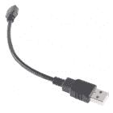
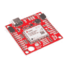
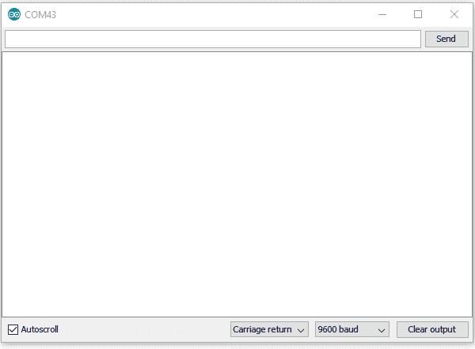

# LTE 卡特彼勒 M1/NB-IoT 屏蔽连接指南

> 原文：<https://learn.sparkfun.com/tutorials/lte-cat-m1nb-iot-shield-hookup-guide>

## 介绍

[spark fun LTE Cat M1/n b-IoT Shield](https://www.sparkfun.com/products/14997)使您的 Arduino 或 Arduino 兼容微控制器能够接入全球数据网络。它为您的物联网项目增加了无线、高带宽蜂窝功能，同时保持低功耗和小尺寸。

[](https://www.sparkfun.com/products/14997) 

将**添加到您的[购物车](https://www.sparkfun.com/cart)中！**

 **### [SparkFun LTE 猫 M1/n b-物联网盾-萨拉-R4](https://www.sparkfun.com/products/14997)

[Out of stock](https://learn.sparkfun.com/static/bubbles/ "out of stock") CEL-14997

SparkFun LTE CAT M1/NB-IoT Shield 为您的 Arduino 或 Arduino 兼容型微控制器配备了数据网络接入功能…

$90.957[Favorited Favorite](# "Add to favorites") 10[Wish List](# "Add to wish list")** **你可以像上面的链接一样单独购买 SparkFun LTE Cat M1/NB-IoT Shield，也可以打包购买一张**全息 SIM 卡**。[全息图](https://hologram.io/) SIM 卡以极其合理的价格模式提供全球连接。他们还提供软件工具，如云数据、短信和 webhooks，用于将数据从你的 cell shield 路由到流行的 web 服务。

[](https://www.sparkfun.com/products/15087) 

将**添加到您的[购物车](https://www.sparkfun.com/cart)中！**

 **### [【spark fun LTE 猫 M1/n b-物联网盾-萨拉-R4(带全息 SIM 卡)](https://www.sparkfun.com/products/15087)

[19 available](https://learn.sparkfun.com/static/bubbles/ "19 available") CEL-15087

spark fun LTE CAT M1/n b-IoT Shield with Hologram SIM 卡可让您基于 Arduino 的设备接入数据网络

$96.505[Favorited Favorite](# "Add to favorites") 10[Wish List](# "Add to wish list")** **LTE Cat M1/NB-IoT 屏蔽的核心是一个[u-blox SARA-R410M-02B](https://www.u-blox.com/en/product/sara-r4n4-series)LTE Cat M1/n b-IoT 调制解调器。卡特彼勒 M1(M1 类别)和 NB-IoT(窄带物联网)都是低功耗广域网(LPWAN)技术，旨在为小型物联网设备提供蜂窝通信。它们像大多数智能手机一样工作在 LTE 网络频段上，应该得到大多数蜂窝网络运营商的支持。

u-blox 模块通过简单的 AT 命令集在 UART 上通信。我们提供了一个库来帮助你开始从**发送 SMS 文本消息**到通过 **TCP/IP 连接与服务器通信**的一切。

该模块和库都支持 I ² C GPS 接口，因此您可以插入 u-blox GPS 模块并开始远程跟踪您的项目。

### 所需材料

除了盾牌本身之外，我们还建议在本教程中遵循以下内容。你可能不需要所有的东西，这取决于你拥有什么。将它添加到您的购物车，通读指南，并根据需要调整购物车。

**Arduino 或 Arduino 兼容开发板**-LTE Cat M1/n b-IoT Shield 主要用于...盾牌。它应该兼容大多数 Arduino 类型的开发板，包括 [Arduino Uno](https://www.sparkfun.com/products/11224) 、 [SparkFun RedBoard](https://www.sparkfun.com/products/13975) 、 [SparkFun BlackBoard](https://www.sparkfun.com/products/14669) 和 [SAMD21 Dev Breakout](https://www.sparkfun.com/products/13672) 。

[](https://www.sparkfun.com/products/13975) 

将**添加到您的[购物车](https://www.sparkfun.com/cart)中！**

 **### [spark fun red board——用 Arduino 编程 T3](https://www.sparkfun.com/products/13975)

[In stock](https://learn.sparkfun.com/static/bubbles/ "in stock") DEV-13975

SparkFun RedBoard 结合了 UNO 的 Optiboot 引导程序的简单性、FTDI 的稳定性和 shield com…

$21.5049[Favorited Favorite](# "Add to favorites") 89[Wish List](# "Add to wish list")****[](https://www.sparkfun.com/products/11224) 

将**添加到您的[购物车](https://www.sparkfun.com/cart)中！**

 **### [Arduino Uno - R3 贴片](https://www.sparkfun.com/products/11224)

[In stock](https://learn.sparkfun.com/static/bubbles/ "in stock") DEV-11224

这是新的 Arduino Uno R3。除了以前主板的所有功能外，Uno 现在使用 ATmega16U2 代替…

$26.9525[Favorited Favorite](# "Add to favorites") 31[Wish List](# "Add to wish list")****[](https://www.sparkfun.com/products/13672) 

将**添加到您的[购物车](https://www.sparkfun.com/cart)中！**

 **### [SparkFun SAMD21 开发突破](https://www.sparkfun.com/products/13672)

[In stock](https://learn.sparkfun.com/static/bubbles/ "in stock") DEV-13672

如果您准备从旧的 8 位/16MHz 微控制器升级您的 Arduino 游戏，SparkFun SAMD21 Dev Breakout 是一个…

$29.507[Favorited Favorite](# "Add to favorites") 13[Wish List](# "Add to wish list")****[](https://www.sparkfun.com/products/retired/14669) 

### [SparkFun 黑板](https://www.sparkfun.com/products/retired/14669)

[Retired](https://learn.sparkfun.com/static/bubbles/ "Retired") SPX-14669

这是一个伟大的董事会，但我们使它更好！检出新版本，[BlackBoard C](https://www . spark fun . com/products/1509…

5 **Retired**[Favorited Favorite](# "Add to favorites") 6[Wish List](# "Add to wish list")****** ******shield 还可以用作 u-blox SARA-R4 模块的分线板，在这种情况下，几乎任何带有免费 UART 的微控制器开发板都可以工作。你甚至可以将 shield 的 **USB 接口**与[树莓派](https://www.sparkfun.com/products/13825)、[树莓派 Zero](https://www.sparkfun.com/products/14277) 或者任何带有免费 USB 端口的 Windows/Mac/Linux 设备配合使用。

**接头** -要将屏蔽连接到 Arduino，您需要将接头焊接到屏蔽上。我们推荐[可堆叠 R3 接头](https://www.sparkfun.com/products/11417)，但[公接头](https://www.sparkfun.com/products/115)也能做到。

[](https://www.sparkfun.com/products/115) 

将**添加到您的[购物车](https://www.sparkfun.com/cart)中！**

 **### [女标题](https://www.sparkfun.com/products/115)

[In stock](https://learn.sparkfun.com/static/bubbles/ "in stock") PRT-00115

单排 40 孔，内螺纹接头。可以用一把钢丝钳切割成合适的尺寸。标准 0.1 英寸间距。我们广泛使用它们…

$1.758[Favorited Favorite](# "Add to favorites") 71[Wish List](# "Add to wish list")****[](https://www.sparkfun.com/products/11417) 

将**添加到您的[购物车](https://www.sparkfun.com/cart)中！**

 **### [Arduino 可堆叠接头套件- R3](https://www.sparkfun.com/products/11417)

[In stock](https://learn.sparkfun.com/static/bubbles/ "in stock") PRT-11417

这些接头适用于 Arduino Uno R3、Leonardo 和新的 Arduino 板。他们是完美的 h…

$1.7512[Favorited Favorite](# "Add to favorites") 68[Wish List](# "Add to wish list")**** ****焊接工具 -你还需要焊接工具将接头连接到屏蔽层上。一个[基本烙铁](https://www.sparkfun.com/products/14456)和[焊锡](https://www.sparkfun.com/products/9163)应该够了。

[](https://www.sparkfun.com/products/14456) 

将**添加到您的[购物车](https://www.sparkfun.com/cart)中！**

 **### [【烙铁- 60W(可调温度)](https://www.sparkfun.com/products/14456)

[In stock](https://learn.sparkfun.com/static/bubbles/ "in stock") TOL-14456

当你不想倾家荡产，但又需要一个可靠的烙铁时，这个可调节温度的烙铁是一个很好的工具…

$16.5016[Favorited Favorite](# "Add to favorites") 43[Wish List](# "Add to wish list")****[](https://www.sparkfun.com/products/9163) 

将**添加到您的[购物车](https://www.sparkfun.com/cart)中！**

 **### [无铅焊料- 15 克管](https://www.sparkfun.com/products/9163)

[In stock](https://learn.sparkfun.com/static/bubbles/ "in stock") TOL-09163

这是你的无铅焊料的基本管，带有不干净的水溶性树脂芯。0.031 英寸规格，15 克

$3.954[Favorited Favorite](# "Add to favorites") 14[Wish List](# "Add to wish list")**** ******SIM 卡** -需要一张 **nano SIM 卡**为 LTE CAT-M1 盾的 u-blox 模块提供连接。如果你已经购买了[全息图/SparkFun LTE 盾牌组合](https://www.sparkfun.com/products/15087)，那么你就一切就绪了。此外，还有各种各样的连接供应商，包括& T 的[、](https://marketplace.att.com/products?tags=connectivity&tags=lte-m&tags=lte-na&tags=lte-intl) [T-Mobile](https://iot.t-mobile.com/pricing/) 和[威瑞森](https://www.verizonwireless.com/biz/plans/m2m-business-plans/)。

#### 可选材料

除了这些必需的项目，这些零碎的东西可以帮助您为 LTE Shield 添加功能，因此您可以更进一步:

**LiPo 电池**-LTE Shield 包括一个 LiPo 电池充电器。这种油脂可以用来同时为你的 Arduino 和盾牌提供能量。以下任何一种电池都可以与屏蔽一起使用:

[](https://www.sparkfun.com/products/13813) 

将**添加到您的[购物车](https://www.sparkfun.com/cart)中！**

 **### [锂离子电池-1Ah](https://www.sparkfun.com/products/13813)

[In stock](https://learn.sparkfun.com/static/bubbles/ "in stock") PRT-13813

基于锂离子化学的超薄超轻电池。每个电池在 1000 毫安时输出 3.7V 的标称电压！

$10.958[Favorited Favorite](# "Add to favorites") 75[Wish List](# "Add to wish list")****[](https://www.sparkfun.com/products/13854) 

将**添加到您的[购物车](https://www.sparkfun.com/cart)中！**

 **### [锂离子电池- 850mAh](https://www.sparkfun.com/products/13854)

[In stock](https://learn.sparkfun.com/static/bubbles/ "in stock") PRT-13854

这是基于锂离子化学的非常薄、非常轻的电池。每个电池在 850℃时输出 3.7V 的标称电压…

$10.952[Favorited Favorite](# "Add to favorites") 17[Wish List](# "Add to wish list")****[](https://www.sparkfun.com/products/13855) 

将**添加到您的[购物车](https://www.sparkfun.com/cart)中！**

 **### [锂离子电池- 2Ah](https://www.sparkfun.com/products/13855)

[In stock](https://learn.sparkfun.com/static/bubbles/ "in stock") PRT-13855

这是基于锂离子化学的非常薄、非常轻的电池。每个电池在 200 伏时输出一个标称的 3.7 伏电压…

$13.959[Favorited Favorite](# "Add to favorites") 43[Wish List](# "Add to wish list")****[](https://www.sparkfun.com/products/13856) 

将**添加到您的[购物车](https://www.sparkfun.com/cart)中！**

 **### [锂离子电池- 6Ah](https://www.sparkfun.com/products/13856)

[In stock](https://learn.sparkfun.com/static/bubbles/ "in stock") PRT-13856

如果你需要一些果汁，这 6Ah 锂离子电池是给你的。这些是基于锂离子化学电池的非常紧凑的电池…

$32.507[Favorited Favorite](# "Add to favorites") 40[Wish List](# "Add to wish list")******** **********Micro-B USB 线**-shield 的萨拉-R4 模块支持 USB 接口，既可用于电源，也可用于通信接口。一根 [micro-B USB 线](https://www.sparkfun.com/products/10215)不是必需的，但如果你想通过 USB 为你的项目供电或给萨拉-R4 模块的 USB 接口一个旋转，它可能会有帮助。

[](https://www.sparkfun.com/products/10215) 

将**添加到您的[购物车](https://www.sparkfun.com/cart)中！**

 **### [USB micro-B 线- 6 脚](https://www.sparkfun.com/products/10215)

[In stock](https://learn.sparkfun.com/static/bubbles/ "in stock") CAB-10215

USB 2.0 型到微型 USB 5 针。这是一种新的、更小的 USB 设备连接器。微型 USB 连接器大约是…

$5.5014[Favorited Favorite](# "Add to favorites") 21[Wish List](# "Add to wish list")****[](https://www.sparkfun.com/products/13244) 

将**添加到您的[购物车](https://www.sparkfun.com/cart)中！**

 **### [【USB Micro-B 线缆-6】](https://www.sparkfun.com/products/13244)

[In stock](https://learn.sparkfun.com/static/bubbles/ "in stock") CAB-13244

这是一根 USB 2.0 型转 Micro-B 型 5 针黑色电缆。你知道，通常配在手机上的迷你 B 连接器，可以…

$2.103[Favorited Favorite](# "Add to favorites") 7[Wish List](# "Add to wish list")****[](https://www.sparkfun.com/products/retired/14741) 

### [spark fun Traveler microB Cable-1m](https://www.sparkfun.com/products/retired/14741)

[Retired](https://learn.sparkfun.com/static/bubbles/ "Retired") CAB-14741

你是旅行者吗？你会从你的装备上去掉每一盎司多余的重量吗？SparkFun 1 米旅行者微型电缆是 d…

**Retired**[Favorited Favorite](# "Add to favorites") 0[Wish List](# "Add to wish list")[](https://www.sparkfun.com/products/retired/14742) 

### [SparkFun Rugged microB 线缆- 1m](https://www.sparkfun.com/products/retired/14742)

[Retired](https://learn.sparkfun.com/static/bubbles/ "Retired") CAB-14742

你的笔记本电脑是否贴满了隐藏凹痕的贴纸？你测试过你的设备吗？SparkFun 1 米地毯…

**Retired**[Favorited Favorite](# "Add to favorites") 0[Wish List](# "Add to wish list")**** ****### 建议观看

[https://www.youtube.com/embed/Eb6Ld0QAdj4/?autohide=1&border=0&wmode=opaque&enablejsapi=1](https://www.youtube.com/embed/Eb6Ld0QAdj4/?autohide=1&border=0&wmode=opaque&enablejsapi=1)

### 推荐阅读

本教程建立在各种电子、编程和工程概念的基础上。如果这些教程的任何主题对您来说听起来很陌生，请考虑在继续之前检查一下:

[](https://learn.sparkfun.com/tutorials/serial-communication) [### 串行通信](https://learn.sparkfun.com/tutorials/serial-communication) Asynchronous serial communication concepts: packets, signal levels, baud rates, UARTs and more 100[](https://learn.sparkfun.com/tutorials/installing-an-arduino-library) [### 安装 Arduino 库](https://learn.sparkfun.com/tutorials/installing-an-arduino-library) How do I install a custom Arduino library? It's easy! This tutorial will go over how to install an Arduino library using the Arduino Library Manager. For libraries not linked with the Arduino IDE, we will also go over manually installing an Arduino library.[Favorited Favorite](# "Add to favorites") 22[](https://learn.sparkfun.com/tutorials/logic-levels) [### 逻辑电平](https://learn.sparkfun.com/tutorials/logic-levels) Learn the difference between 3.3V and 5V devices and logic levels.[Favorited Favorite](# "Add to favorites") 82[](https://learn.sparkfun.com/tutorials/three-quick-tips-about-using-ufl) [### 关于使用 U.FL 的三个快速提示](https://learn.sparkfun.com/tutorials/three-quick-tips-about-using-ufl) Quick tips regarding how to connect, protect, and disconnect U.FL connectors.[Favorited Favorite](# "Add to favorites") 14

如果你不熟悉 Qwiic 系统，我们也推荐你在这里阅读[以获得概述](https://www.sparkfun.com/qwiic)。

| [](https://www.sparkfun.com/qwiic) |
| *[Qwiic 连接系统](https://www.sparkfun.com/qwiic)* |

## 硬件概述

它可能看起来不像，但在 LTE 猫 M1/NB-IoT 盾上发生了很多事情。本页涵盖主板上包含的所有硬件特性。快速浏览一下，确保不会被 UART 或电源选择开关、电源/复位按钮或外部 USB 和 GPS 接口绊倒。

糟糕！我们不小心把**的 AREF** 别针绑到了**的 GND** 上。这不应该影响屏蔽的整体功能；但是，它确实会影响微控制器板上模拟引脚的使用( **A0** - **A5** )。

### 电源

u-blox SARA-R410M-02B 模块的耗电量相对较低。在 **3.3V** 的电压供应下，峰值电流消耗约为 **200mA** (与过去偶尔拉高 2A 的蜂窝屏蔽相差甚远)。模块上的逻辑都是 1.8V，但不要担心——我们已经包括了板载逻辑电平转换(更多信息参见[逻辑电平选择部分](https://learn.sparkfun.com/tutorials/lte-cat-m1nb-iot-shield-hookup-guide#logiclevel))。

[](https://cdn.sparkfun.com/assets/learn_tutorials/8/1/6/hardware-power-02.jpg)

防护罩被设计成从三个来源之一获取能量:

1.  **Arduino** -屏蔽从 Arduino 的 5V 电源引脚接收电源。
2.  **LiPo 电池** -一个 3.7-4.2V 的 LiPo 电池可以连接到黑色的 2 针 JST 连接器。
3.  **板载 micro-B USB 连接器** - A [micro-B USB 线缆](https://www.sparkfun.com/products/10215)可从您的电脑或 USB 壁式电源插座连接，为屏蔽罩供电。如果您更多地将盾牌用作“分线板”，这可能会很有用(该连接器也可用于为 u-blox 模块提供 USB 接口-参见下面的 [USB 接口部分](https://learn.sparkfun.com/tutorials/lte-cat-m1nb-iot-shield-hookup-guide#USB-interface))。

应该使用 **PWR_SEL** 开关来选择电源。在 **Arduino** 位置，盾牌**将从 Arduino** 接收能量。在**屏蔽**位置，**屏蔽将向 Arduino** 供电。

#### 脂肪充电

该屏蔽包括一个 MCP73831 LiPo 充电器，该充电器被配置为以高达 **500mA** 的功率为单个单元 LiPo 电池供电。

可以通过将 micro-B USB 电缆连接到防护罩，或将防护罩连接到通电的 ARDUINO 并将 PWR_SEL 开关设置为 Arduino 来为电池充电。

### 电源和复位按钮

LTE Cat M1/NB-IoT 屏蔽包括一对 SPST 按钮，分别标有**重置**和**电源**。这些引脚直接连接到萨拉-R4 模块的 PWR_ON 和 RESET_N 引脚。

[](https://cdn.sparkfun.com/assets/learn_tutorials/8/1/6/hardware-buttons.jpg)

默认情况下，萨拉-R4 模块是关闭的，要打开它——就像你可以打开任何其他手机一样——你需要**按住电源按钮大约 3 秒钟**。

重置按钮将萨拉-R4 模块重置为默认配置。在大多数情况下，您应该不需要使用此按钮。如果这样做，请在模块打开时按住它至少 10 秒钟。注意这个按钮对 Arduino 没有影响——它不会重置你的草图。

这两个引脚也连接到 Arduino:

| 引脚功能 | 按钮标签 | Arduino 引脚 | 描述 |
| 通电 | 力量 | five | 打开或关闭萨拉-R4 模块的电源。保持大约 3 秒钟。 |
| 重置 | 重置 | six | 将萨拉-R4 模块配置重置为默认值。保持 10 秒钟以上 |

库被设计为在屏蔽不通信时切换电源引脚，因此您可以完全避免按下此按钮。

### UART 接口

Arduino 和 SARA-R4 模块之间的所有通信都将通过一个简单的 UART - RX 和 TX 引脚上的 AT 命令接口进行。

[](https://cdn.sparkfun.com/assets/learn_tutorials/8/1/6/hardware-serial.jpg)

设计时考虑了简单的 Arduino Uno，这个屏蔽可以通过硬件或软件串行接口与萨拉-R4 模块通信。**串行**开关可以设置为**硬**用于引脚 0/1 上的硬件串行或者**软**用于引脚 8/9 上的软件串行。

|  | Arduino 接收(单元发送) | Arduino 传输(单元接收) |
| 软件序列 | eight | nine |
| 硬件串行 | Zero | one |

#### FTDI 标题

UART 信号也被分解到一个 6 引脚“FTDI”串行接口。如果你不是用盾牌作为盾牌，更多的是作为突破，这个标题可能会有用。您可以将任何 3.3V 或 5V USB 到串行转换器(如[串行基本](https://www.sparkfun.com/products/14050))连接到该接头，并直接与萨拉-R4 的 UART 通信。

此割台不受串行选择开关的影响。必须通过 USB 或 LiPo 电池向 LTE 护罩提供外部电源。

### LED 指示灯

USB 和 GPS 连接器之间有三个发光二极管。下表记录了每个指示灯的颜色和指示:

| LED 标签 | LED 颜色 | LED 指示 |
| 压水反应堆 | 红色 | 向萨拉-R4 模块供电 |
| CHG | 黄色 | LiPo 电池充电(如果没有连接电池，可能会亮起) |
| 网 | 蓝色 | 蜂窝网络状态。当萨拉-R4 模块连接到蜂窝网络时点亮。(必须在软件中配置。) |

这些 led 中最重要的是蓝色的“网”指示器。当您的萨拉-R4 模块正确配置、连接到 SIM 卡并与蜂窝网络通信时，此 LED 将亮起。默认情况下，连接到该 LED 的引脚萨拉-R4 是未配置的，但是库应该在初始化时处理该问题。

### [逻辑电平选择](#logiclevel)

萨拉-R4 模块的 GPIO 引脚都工作在 **1.8V 逻辑电平**。幸运的是，该屏蔽包括电平转换，可以将 3.3V 或 5V 信号转换为 1.8V。

在大多数 Arduino 上，选择逻辑电平转换的高端应该是自动的。从 Arduino 的 **IOREF** 引脚提供的电压应该设置它。如果是这样，忽略接下来发生的事情。

[](https://cdn.sparkfun.com/assets/learn_tutorials/8/1/6/hardware-ioref.jpg)

如果你的 Arduino **没有 IOREF 引脚**，或者没有在该引脚上提供有效的逻辑电平，你应该使用 **IOREF** 跳线来选择你的 Arduino 的逻辑电平。

### GPS 端口

如果您想轻松地将位置跟踪添加到您的项目中，LTE Shield 的 Qwiic GPS 端口可以连接到一些 u-blox GPS 模块。我们将很快添加更多兼容模块。目前，支持的模块有:

[](https://www.sparkfun.com/products/15136) 

将**添加到您的[购物车](https://www.sparkfun.com/cart)中！**

 **### [【spark fun GPS-RTK 2 Board-ZED-F9P(Qwiic)](https://www.sparkfun.com/products/15136)

[In stock](https://learn.sparkfun.com/static/bubbles/ "in stock") GPS-15136

SparkFun GPS-RTK2 是 ZED-F9P 模块的一个强大突破。ZED-F9P 是 GNSS 和 GPS 系统的顶级模块

$274.9521[Favorited Favorite](# "Add to favorites") 61[Wish List](# "Add to wish list")****[](https://www.sparkfun.com/products/15005) 

将**添加到您的[购物车](https://www.sparkfun.com/cart)中！**

 **### [【spark fun GPS-RTK 板- NEO-M8P-2 (Qwiic)](https://www.sparkfun.com/products/15005)

[In stock](https://learn.sparkfun.com/static/bubbles/ "in stock") GPS-15005

SparkFun GPS-RTK 板是 u-blox NEO-M8P-2 模块的一个强大突破。NEO-M8P-2 是一款顶级的移动…

$264.956[Favorited Favorite](# "Add to favorites") 22[Wish List](# "Add to wish list")****[](https://www.sparkfun.com/products/15210) 

将**添加到您的[购物车](https://www.sparkfun.com/cart)中！**

 **### [【spark fun】GPS 分线芯片天线，SAM-M8Q (Qwiic)](https://www.sparkfun.com/products/15210)

[In stock](https://learn.sparkfun.com/static/bubbles/ "in stock") GPS-15210

SparkFun SAM-M8Q GPS Breakout 是一款高质量的 GPS 板，具有同样令人印象深刻的配置选项。

$42.954[Favorited Favorite](# "Add to favorites") 17[Wish List](# "Add to wish list")****** ******LTE Shield Arduino 库支持通过萨拉-R4 的 AT 命令集读取该 GPS 模块。

请注意，该 Qwiic 连接器仅设计用于支持基于 u-blox 的 GPS 模块。它不支持任何其他 GPS 模块或传感器。

### LTE 天线

LTE 屏蔽包括一个陶瓷 SMD 天线- a [Molex 1462000001](https://cdn.sparkfun.com/assets/learn_tutorials/8/1/6/1462000001-PS.pdf) 。该天线在 1.7GHz 至 2.7GHz 附近具有 3.8dBi 的增益

如果您的项目需要外置天线，可以断开车载天线，使用内置的 U.FL 天线。要断开板载陶瓷天线，拿起一把[业余爱好刀](https://www.sparkfun.com/products/9200),切开 U.FL 连接器附近的大金属垫——如下图中沿着黑线突出显示的两个白色丝网印刷点之间。

[](https://cdn.sparkfun.com/assets/learn_tutorials/8/1/6/14997-SparkFun_LTE_CAT_M1_NB-IoT_Shield_-_SARA-R4-04_Antenna_Jumper.jpg)

一旦[跳线被切断](https://learn.sparkfun.com/tutorials/how-to-work-with-jumper-pads-and-pcb-traces)，添加一个焊接跳线将中心焊盘连接到位于 u.FL 连接器正上方的焊盘，并且[小心地连接外部天线的 u.FL 部分](https://learn.sparkfun.com/tutorials/three-quick-tips-about-using-ufl)。您的设置应该如下图所示。

[](https://cdn.sparkfun.com/assets/learn_tutorials/8/1/6/hardware-overview-antenna-ufl.jpg)

一旦你调整好跳线，就可以安全地通过 U.FL 连接器添加你自己的天线了。几个选项包括 [LTE 天线 175 毫米 Duck SMA Male - VT4GLTE-R-10](https://www.sparkfun.com/products/15054) 和 [LTE 天线 100 毫米 FPC u.FL - VT4GFIA-6](https://www.sparkfun.com/products/15053) 。

[](https://www.sparkfun.com/products/15054) 

将**添加到您的[购物车](https://www.sparkfun.com/cart)中！**

 **### [LTE 天线 175mm 鸭 SMA Male - VT4GLTE-R-10](https://www.sparkfun.com/products/15054)

[Out of stock](https://learn.sparkfun.com/static/bubbles/ "out of stock") CEL-15054

这款高增益鸭式天线专为工作在 690-960MHz 和 1710-2690 MHz 频段的 LTE 设备而设计。组合 w…

$8.95[Favorited Favorite](# "Add to favorites") 1[Wish List](# "Add to wish list")****[](https://www.sparkfun.com/products/9145) 

将**添加到您的[购物车](https://www.sparkfun.com/cart)中！**

 **### [接口电缆 SMA 到 U . FL](https://www.sparkfun.com/products/9145)

[Out of stock](https://learn.sparkfun.com/static/bubbles/ "out of stock") WRL-09145

这是一条 4 英寸的连接器电缆，可将 U.FL 射频连接器连接到常规 SMA 连接器。这种电缆通常用于连接…

$5.503[Favorited Favorite](# "Add to favorites") 19[Wish List](# "Add to wish list")****[](https://www.sparkfun.com/products/retired/15053) 

### [LTE 天线 100mm FPC U.FL - VT4GFIA-6](https://www.sparkfun.com/products/retired/15053)

[Retired](https://learn.sparkfun.com/static/bubbles/ "Retired") CEL-15053

这种高增益 FPC(柔性 PC)天线专为工作在 690-960MHz 和 1710-2690 MHz 频段的 LTE 设备而设计。…

**Retired**[Favorited Favorite](# "Add to favorites") 1[Wish List](# "Add to wish list")**** ****### [USB 接口](#USB-interface)

萨拉-R4 配备了 USB 接口，安装了适当的驱动程序，可以为您的 Raspberry Pi 或任何其他带有 USB 接口的机器提供与卡特彼勒 M1/NB-IoT 的连接。使用 LTE Shield 的 USB 接口几乎就像将 USB 电缆插入计算机的 USB 端口一样简单。

不幸的是，UART 和 USB 接口不能同时使用。要使用 USB 接口，**关闭电路板背面的 VUSB_DET** 跳线。

[](https://cdn.sparkfun.com/assets/learn_tutorials/8/1/6/14997-SparkFun_LTE_CAT_M1_NB-IoT_Shield_-_SARA-R4-03_VUSB-DET_Jumper.jpg)

## 硬件连接

要组装 LTE 护罩，您需要基本的焊接工具和技能。焊接新手？别担心！查看我们的通孔焊接教程。

[](https://learn.sparkfun.com/tutorials/how-to-solder-through-hole-soldering) [### 如何焊接:通孔焊接

#### 2013 年 9 月 19 日](https://learn.sparkfun.com/tutorials/how-to-solder-through-hole-soldering) This tutorial covers everything you need to know about through-hole soldering.[Favorited Favorite](# "Add to favorites") 70

### 头部焊接

要将 SparkFun LTE Shield 连接到您的 Arduino，您需要将接头焊接到通孔 Arduino 引脚中。我们推荐[可堆叠接头](https://www.sparkfun.com/products/11417) -如果你想在顶部堆叠更多屏蔽罩-或者[公接头](https://www.sparkfun.com/products/115)。

焊接到两个 8 针、一个 6 针和一个 10 针接头应该足以让您的屏蔽贴身安装和电气连接。

[](https://cdn.sparkfun.com/assets/learn_tutorials/8/1/6/hardware-hookup-headers.jpg)**Heads up!** The AREF pin is currently tied to GND. If you are going to read the analog pins using a microcontroller, you will want to bend the pin out of the socket or cut the header.

[](https://cdn.sparkfun.com/assets/learn_tutorials/8/1/6/LTE_Shield_tutorial-09.jpg)

### 插上 SIM 卡

你还需要将一张激活的 SIM 卡插入你的保护罩。当您插入 SIM 卡时，它的“凹口”应该与电路板丝印上的图案以及 SIM 卡支架上的图案相匹配。

[](https://cdn.sparkfun.com/assets/learn_tutorials/8/1/6/hardware-hookup-sim.jpg)

如果您的网络提供商要求，请不要忘记激活您的 SIM 卡！

#### 激活你的全息 SIM 卡

如果您使用的是全息 SIM 卡，您需要遵循几个快速步骤来激活您的 SIM 卡。

1.  [登录](https://dashboard.hologram.io/)你的全息账户，或者[创建一个](https://dashboard.hologram.io/account/register)
2.  点击仪表盘右上角的蓝色 **+激活 SIM 卡**按钮。

[](https://cdn.sparkfun.com/assets/learn_tutorials/8/1/6/hologram-activate-sim.png)

6.  选择您的计划——在大多数情况下,“Maker Flexible”是可行的方法，但是您可以升级。
7.  输入您的 SIM 卡的 CCID。这个号码印在你的 nano-SIM 卡上和条形码下面的大数字里。然后选择继续。
8.  接下来，您可以决定是否启用自动续杯并继续。最后，你会看到一个摘要页面——点击“激活”,你就可以开始了！

要获得激活全息 SIM 卡的更多帮助，请查看他们的[连接您的设备](https://hologram.io/docs/guide/connect/connect-device/)文档。

### 电源

一旦你焊接了插头，并插入了至少一张 SIM 卡。是时候供电并开始供电了！

防护罩可以通过 Arduino 或板载 USB 或 LiPo 电池连接器供电。出于本教程的目的，我们建议通过 Arduino 供电。

将 PWR_SEL 开关设置为 ARDUINO。将 shield 插入 Arduino，然后通过 USB 将 Arduino 插入电脑。

[](https://cdn.sparkfun.com/assets/learn_tutorials/8/1/6/hardware-hookup-power-via-Arduino.jpg)

一旦插上电源，你应该会看到盾牌的红色 PWR LED 亮起(你也可能会看到黄色的 CHG LED 打开-即使没有电池插入-不用担心。)蓝网 LED 很可能还不会亮。为此，我们需要配置防护罩。为此，我们需要 SparkFun LTE Shield Arduino 库。请继续阅读！

## LTE Shield Arduino 库

**Note:** This example assumes you are using the latest version of the Arduino IDE on your desktop. If this is your first time using Arduino, please review our tutorial on [installing the Arduino IDE.](https://learn.sparkfun.com/tutorials/installing-arduino-ide) If you have not previously installed an Arduino library, please check out our [installation guide.](https://learn.sparkfun.com/tutorials/installing-an-arduino-library)

SparkFun LTE Shield Arduino 库旨在简单地将您的 Arduino 连接到卡特彼勒 M1/NB-IoT Shield。shield 处理从初始化(打开萨拉-R4 模块，配置您的网络，设置 GPIO 模式)到发送/接收 SMS 和通过 TCP 网络接口通信的所有事情。

SparkFun LTE Shield 库在 Arduino 库管理器中可用。在 Arduino IDE 中，导航到**草图** > **包含库** > **管理库**。然后在搜索框中，开始搜索“SparkFun LTE Shield”缩小搜索范围后，选择 SparkFun LTE Shield 库并点击“安装”

[](https://cdn.sparkfun.com/assets/learn_tutorials/8/1/6/lte-shield-library-manager.png)

否则，您可以手动下载该库，导航到 [GitHub 存储库](https://github.com/sparkfun/SparkFun_LTE_Shield_Arduino_Library)，并以 ZIP 文件夹的形式下载该存储库(或单击下面的链接):

[Download the SparkFun LTE Shield Arduino Library (ZIP)](https://github.com/sparkfun/SparkFun_LTE_Shield_Arduino_Library/archive/master.zip)

要通过 ZIP 文件夹手动安装库，打开 Arduino，导航到**草图** > **包含库** > **添加。ZIP 库**，选择刚刚下载的 ZIP 文件夹。

## 示例 0:网络注册

本教程中的第一个例子是最关键的。在这里，我们将演示如何配置您的 LTE Shield 的萨拉-R4 模块，以便与您选择的网络进行通信。这种配置通常只需要进行一次。成功运行这个草图后，您的 Arduino 应该已经为 SMS 和 TCP/IP 消息设置好了。

首先，通过进入**文件** > **示例**>**spark fun _ LTE _ Shield _ Arduino _ Library**>**00 _ Register _ Operator**来加载这个示例。

[](https://cdn.sparkfun.com/assets/learn_tutorials/8/1/6/example_00_open_via_Arduino.png)

在上传草图之前，您可能需要调整`MOBILE_NETWORK_OPERATOR`和`APN`的值。第一个变量作为参数发送给`lte.setNetwork`，定义你的 LTE shield 应该配置自己与之通信的移动网络运营商。它应该是下列值之一:

```
language:c
// Network operator can be set to either:
// MNO_SW_DEFAULT -- DEFAULT
// MNO_ATT -- AT&T 
// MNO_VERIZON -- Verizon
// MNO_TELSTRA -- Telstra
// MNO_TMO -- T-Mobile
const mobile_network_operator_t MOBILE_NETWORK_OPERATOR = MNO_SW_DEFAULT;
const String MOBILE_NETWORK_STRINGS[] = {"Default", "SIM_ICCD", "AT&T", "VERIZON", 
  "TELSTRA", "T-Mobile", "CT"}; 
```

您的接入点名称(APN)由您的 SIM 卡提供商提供。如果你使用的是全息 SIM，这应该是一个字符串。该值被提供给`lte.setAPN()`功能。

```
language:c
// APN -- Access Point Name. Gateway between GPRS MNO
// and another computer network. E.g. \"hologram\"
const String APN = "hologram"; 
```

上传草图后，打开你的[串行监视器](https://learn.sparkfun.com/tutorials/terminal-basics/arduino-serial-monitor-windows-mac-linux)来检查你的盾的注册状态。这个例子就是**互动**。扫描完可能的网络运营商后，您需要输入几个选项之一来尝试连接到该运营商。

[](https://cdn.sparkfun.com/assets/learn_tutorials/8/1/6/registering-operator-serial-terminal.gif)

上传完这张草图后，你需要有点耐心。根据你的盾的状态，草图可能需要 30 秒来初始化你的盾。盾牌扫描其区域内的网络运营商也可能需要长达三分钟的时间。

有时，您对网络运营商的选择将仅限于一组数字选项——由**移动国家代码(MMC)** 和**移动网络代码(MNC)** 组合而成。例如，上例中的 AT & T 分别是 310 和 410 的 MCC/MNC 组合——这就是我们选择的运营商。(“313 100”是 AT & T 急救网络，“310 260”是 T-Mobile。)

#### 移动国家代码(MCC)和移动网络代码(MNC)说明

有时，您对网络运营商的选择将仅限于一组数字选项。这将是**移动国家代码(MCC)** 和**移动网络代码(MNC)** 的组合。例如，上例中的 AT & T 分别是 310 和 410 的 MCC/MNC 组合，这就是我们选择的运营商。(“313 100”是 AT & T 急救网络，“310 260”是 T-Mobile。)

如果你需要做一些挖掘来发现哪个 MMC/MNC 是哪个，在[mcc-mnc.com](http://www.mcc-mnc.com/)和/或[漫游区](http://www.roamingzone.com/mnc/)查看可搜索的综合列表。

**注意:**如果您离开了一个由两个国家/网络代码覆盖的区域，您可能需要使用该草图重新配置您的屏蔽。

#### 启动时发生了什么

如果你刚刚插上电源，还没有按下电源按钮，LTE Shield 可能需要几秒钟才能启动。

当 Arduino 库初始化与 shield 的通信时，它必须尝试验证 shield 是否打开，同时将波特率从一个可能未知的波特率(尽管最有可能是 115200 bps)下调到 9600 bps。

启动时，库将通过萨拉-R4 支持的波特率循环，并尝试建立通信。此过程可能需要 5 秒钟。如果防护罩没有反应，图书馆会认为它已经断电。它将循环电源按钮，然后再次启动“自动引导”过程。

这个过程总共需要 30 秒。你应该得到一个配置为 9600 波特的萨拉-R4 模块，并准备好开始 LTE。

**注意:您可以通过手动打开萨拉-R4 的电源(按住电源按钮约 3 秒钟)来缩短首次开机时间。**

### 初始化 LTE 屏蔽库

每个 LTE Shield 库草图中都需要一些声明和函数调用。

#### 全局定义

当然，图书馆包括声明:

```
language:c
#include <SparkFun_LTE_Shield_Arduino_Library.h> 
```

如果您使用的是软件串口——如示例所示——您还需要定义一个`SoftwareSerial`对象，RX 在引脚 8，TX 在引脚 9:

```
language:c
// We need to pass a Serial or SoftwareSerial object to the LTE Shield 
// library. Below creates a SoftwareSerial object on the standard LTE
// Shield RX/TX pins:
SoftwareSerial lteSerial(8, 9); 
```

最后，您需要声明一个`LTE_Shield`对象，我们将在整个草图中使用它进行 SMS 发送和 TCP/IP 交互。这个对象可选地接受两个参数——电源和复位 Arduino 引脚。默认情况下，这些参数应该与屏蔽默认值相匹配，因此通常不需要。

```
language:c
// Create a LTE_Shield object to be used throughout the sketch:
#define POWER_PIN 5
#define RESET_PIN 6
LTE_Shield lte(POWER_PIN, RESET_PIN); 
```

#### 设置要求

声明了全局变量后，初始化 shield 库就像调用`lte.begin(SerialPort)`一样简单。SerialPort 应该是您在 globals 中声明的软件串行端口，或者是硬件串行端口，如果您的 Arduino 板支持的话。

如果成功初始化防护罩，则`begin()`将返回`true`，如果与萨拉-R4 模块的通信失败，则返回`false`。

该库中的所有示例都假设在引脚 8 和 9 上有一个**软件串行端口**。所以下面的 begin 语句应该可以工作。

```
language:c
if ( lte.begin(lteSerial) ) {
  Serial.println("Successfully initialized the LTE shield via software serial!");
} 
```

另一方面，如果您使用一个**硬件串行端口**(在引脚 0/1 上)与屏蔽通信，可以使用下面的 begin 语句:

```
language:c
if ( lte.begin(Serial1) ) {
    Serial.println("Initialied SARA-R4 module on a hardware serial port.");
} 
```

该库将负责你的串口提供的所有`begin()`、`write()`和`read()`函数。

## 示例 1:发送短信

我们在 LTE Shield Arduino 库中的下一个示例演示了如何发送 SMS。请注意，此示例要求您的 SIM 卡计划支持出站 SMS 文本消息，这可能会产生费用，因此请注意您运行该草图的频率。

要加载这个草图，导航到**文件** > **示例**>**spark fun LTE Shield Arduino 库** > **01_SMS_Send** 。

在上传代码之前，将`DESTINATION_NUMBER`的值修改为您想要的文本消息目的地的值。

```
language:c
// Set the cell phone number to be texted
String DESTINATION_NUMBER = "11234567890"; 
```

请注意，SMS 目的地号码应包括国家代码(例如，“T0”代表美国)。例如，要给 SparkFun 发短信(如果 SparkFun 的公司电话可以接收短信),号码是 303-284-0979，你可以将`DESTINATION_NUMBER`字符串设置为`"13032840979"`。

一旦您的目的地电话号码被设置，上传代码并打开您的串行监视器( **9600** 波特)。在串行监视器中，**将行尾下拉菜单设置为“Newline”**。

[](https://cdn.sparkfun.com/assets/learn_tutorials/8/1/6/example_01_serial_monitor.png)

然后输入信息并发送出去。几秒钟后，您应该会看到一条短信出现在您的目标手机上。

### 使用 Arduino 库的短信发送功能

`sendSMS`函数应该很容易使用。该函数有两个参数:一个字符串电话号码和一个要发送的字符串消息。

```
language:c
LTE_Shield_error_t LTE_Shield::sendSMS(String number, String message); 
```

考虑在发送给`sendSMS`函数之前构建一个字符串变量。您可以使用`String()`操作符向字符串添加变量，包括`digitalRead()`和`analogRead()`。强大的[字符串对象](https://www.arduino.cc/reference/en/language/variables/data-types/stringobject)包括与`+=`操作符(或 [`concat()`](https://www.arduino.cc/reference/en/language/variables/data-types/string/functions/concat/) )的简单连接。例如:

```
language:c
String messageToSend;
int time = millis();
messageToSend = "A0 = " + String(analogRead(A0)); // Add A0 to 
messageToSend += "\r\n"; // Create a new line
messageToSend += "Time = " + String(time);
lte.sendSMS(DESTINATION_NUMBER, messageToSend); 
```

`sendSMS`函数返回一个错误/成功响应。如果成功，检查返回值`LTE_SHIELD_SUCCESS`(设置为 0)，如果出错，检查大于 0 的值。

## 示例 2:发送全息信息

我们的下一个例子演示了如何通过萨拉-R4 对 TCP/IP 协议的支持向互联网发送消息。

This example requires a Hologram SIM card and account. If you don't have a Hologram SIM, check out the last section of this example for tips on using the shield's TCP socket capabilities.

打开**文件** > **加载本例**>**spark fun LTE Shield Arduino 库**>**02 _ TCP _ Send _ Hologram**。

在上传这个例子之前，你需要全息设备的**设备密钥**。这可以在你的全息仪表板中找到。导航到您的设备，然后点按左上角的“设备键+”。

[](https://cdn.sparkfun.com/assets/learn_tutorials/8/1/6/example_02_hologram_device_key.png)

有了那套，上传吧！然后在 **9600** 波特打开串行监视器。和前面的例子一样，**将您的行尾设置设为 Newline** 。

打开你的全息仪表板，然后在串行监视器上，输入你想发送给全息信息服务器的信息。

[](https://cdn.sparkfun.com/assets/learn_tutorials/8/1/6/example_02_serial_monitor.png)

几秒钟后，您应该会在设备的全息仪表盘中看到该消息。

[](https://cdn.sparkfun.com/assets/learn_tutorials/8/1/6/example_02_hologram_receive.png)

### 使用 TCP/IP 套接字

这个例子演示了如何使用 LTE Shield 的 TCP/IP 套接字功能。套接字是一种非常常见的进程间通信工具，用于通过各种网络协议发送和/或接收数据。在这种情况下，我们将使用套接字通过 TCP 网络链接发送数据。萨拉-R4 模块支持多达七个并发打开的套接字——通常我们一次只需要一到两个。

首先，用`socketOpen`功能打开一个插座。这个函数接受一个参数——指示您是想要打开 TCP 还是 UDP 套接字。可能的参数是`LTE_SHIELD_TCP`或`LTE_SHIELD_UDP`。

```
language:c
int socket;
socket = lte.socketOpen(LTE_SHIELD_TCP);
if (socket < 0) {
  Serial.println("Unable to open a socket");
} 
```

`socketOpen`应该返回一个 0 到 6 之间的值。这是你的插座，好好保护它！

一旦您的套接字打开，就可以使用它来连接服务器了。为此，有一个`socketConnect`函数。这个函数接受一个套接字、URL 或 IP 地址以及要连接的端口。在这个例子中，我们使用从`socketOpen`接收的套接字，并使用它连接到端口`9999`上的 hologram.io。

```
language:c
const char HOLOGRAM_URL [] = "cloudsocket.hologram.io";
const unsigned int HOLOGRAM_PORT = 9999;
if (lte.socketConnect(socket, HOLOGRAM_URL, HOLOGRAM_PORT) == LTE_SHIELD_SUCCESS) {
  // Send our message to the server:
  Serial.println("Connected to Hologram server!"));
} 
```

一旦连接到服务器，就该发送一些数据了！为此，有一个`socketWrite`函数。这个函数再次接受一个套接字和一个字符串消息。如果你要把信息发送到全息服务器，你需要小心处理。应该是这里描述的格式的 JSON 编码字符串:[https://hologram . io/docs/reference/cloud/embedded/# send-a-message-to-the-hologram-cloud](https://hologram.io/docs/reference/cloud/embedded/#send-a-message-to-the-hologram-cloud)。(请参阅示例代码，了解如何构建兼容的 JSON 字符串。)

```
language:c
String message = "{\"k\": \"a8F8asd4\", \"d\":\"Hello, world!\"}"
if (lte.socketWrite(socket, message) == LTE_SHIELD_SUCCESS) {
  Serial.println("Successfully sent message!");
} 
```

最后，您可以使用`socketClose`函数关闭一个套接字。有时候服务器会关闭它这边的套接字，但是在你关闭套接字的时候先发制人是有帮助的。

```
language:c
if (lte.socketClose(socket) == LTE_SHIELD_SUCCES) {
  Serial.println("Sucessfully closed a socket!");
} 
```

## 例 3:接收全息信息

现在，您已经通过 TCP/IP 服务发送了一条消息，这个示例演示了如何在您的 LTE Shield 上创建一个本地监听套接字来接收数据。

同样，这个例子使用全息图从一个门户网站发送一条消息到盾牌。如果你没有全息 SIM 卡，可以考虑看看图书馆的操作指南。

要加载 TCP 接收示例，请转到**文件** > **示例**>**spark fun LTE Shield Arduino 库**>**03 _ TCP _ Receive _ Hologram**。

在这个例子中，您不需要修改任何东西。上传吧！上传后，打开你的串口显示器。然后打开你的全息仪表盘。

接下来，从您设备的全息仪表盘键入一条消息，通过云数据*发送* *，然后发送该数据消息(保持端口为 4010，协议为 TCP)。

[](https://cdn.sparkfun.com/assets/learn_tutorials/8/1/6/example_03_hologram_send.png)

不久之后，您应该会在您的串行监视器中看到弹出的消息。

[](https://cdn.sparkfun.com/assets/learn_tutorials/8/1/6/example_03_serial_monitor.png)

### 监听、回调和轮询

这个例子建立在使用上一个例子中的套接字的基础上，并且引入了一些新概念。

`socketListen`打开插座后，可用于在萨拉-R4 模块上设置监听端口。这个函数使用一个套接字和一个监听端口，在本例中为`4010`。

```
language:c
if (lte.socketListen(socket, 4010) == LTE_SHIELD_SUCCESS) {
  Serial.println("Listening on socket 4010");
} 
```

当套接字打开并侦听时，数据异步进入萨拉-R4 模块。为了捕捉这些数据，库实现了一个`poll`函数，应该在`loop()`中尽可能频繁地调用这个函数。`poll()`被设计用来监控 UART，如果它看到数据从一个插座传入，就把数据传回 Arduino 草图。

为了从`poll()`函数获取数据，使用了一个回调函数。这个回调应该提供两个参数:一个`int`套接字和一个`String`消息。下面的示例演示了如何声明套接字读取回调、注册它以及轮询数据:

```
language:c

void processSocketRead(int socket, String message) {
  Serial.println("Read: " + message);
  Serial.println("From: " + String(lte.lastRemoteIP()));
  Serial.println("Socket: " + String(socket));
}

void setup() {
  // Provide setSocketReadCallback a pointer to our socket-read callback
  lte.setSocketReadCallback(&processSocketRead);
}

void loop() {
  // Poll as much as possible to catch asynchronous data coming into LTE Shield
  lte.poll();
} 
```

这个示例还演示了一个类似的回调功能，用于在异步关闭的套接字上执行操作。`setSocketCloseCallback()`可用于设置闭套接字回调。回调应该只接受一个参数——套接字关闭。该示例使用这个回调来重新打开一个监听套接字(如果这是关闭的套接字的话)。

## 解决纷争

如果您的 LTE shield 遇到了问题，这里有一些故障排除技巧和指南，可以帮助您找出可能发生的情况:

### 疑难解答资源

*   [SparkFun 故障排除提示](https://learn.sparkfun.com/tutorials/sparkfun-troubleshooting-tips)
*   [全息网页](https://hologram.io/about-us/)
    *   [全息图连接指南](https://hologram.io/docs/guide/connect/connect-device/)
    *   [全息 SIM 卡常见问题解答](https://help.hologram.io/hologram-iot-sim-card)
    *   [全息覆盖图](https://hologram.io/pricing/coverage/)
    *   [全息账户/账单常见问题解答](https://hologram.io/docs/guide/account/faq/)
    *   [全息数据计划](https://hologram.io/pricing/details/)

### 故障排除步骤

1.  要开始对您的屏蔽进行故障排除，请确保您完全按照连接指南进行操作。

    **为什么？**汇编指令和示例代码已经过测试，可以正常工作。缩小问题范围也更容易，因为任何偏离连接指南的情况都可能导致问题。
2.  使用 [SparkFun 故障排除提示](https://learn.sparkfun.com/tutorials/sparkfun-troubleshooting-tips)对您可能遗漏的任何问题进行初步检查。这些包括但不限于:
    *   再次检查你的能量。使用万用表是为了得到正确的电压还是足够的电流？
    *   仔细检查你的焊接。有什么冷关节吗？
    *   仔细检查您的线路或连接，并使用万用表测试所有连接。
    *   您在 Arduino IDE 中选择了正确的主板吗？你用的是正确的通讯端口吗？
    *   仔细检查串行监视器的波特率。
    *   您是否尝试过不同的计算机、USB 电缆或微控制器板？
    *   等等。

4.  验证您的全息 SIM 卡已激活。如果您已达到*免费* 1MB 数据限制，您将需要等待下个月/计费周期或为您的帐户添加支付方式。

6.  检查你的覆盖区域。Hologram 有各种各样的合同运营商，但它们并不覆盖所有地方。如果您或您的项目位于一个蜂窝覆盖较低或最小的区域，您可能会因此遇到问题。

8.  作为我们质量控制过程的一部分，所有的护盾都应该用已知的全息 SIM 卡测试过。不过，这里有一些测试和草图，您可以用来验证电路板的功能。(**这些测试假设您已经解决了前面的 1-4 项，并且您正在美国测试 shield。如果您居住在美国以外的地方，您可能需要为您的运营商信息修改库。* )

    1.  如果没有 LTE shield，上传 Blink 以确保您的微控制器正在工作。
    2.  ##### **There is an LTE shield on the red board:**

     **1.  检查硬件连接的连续性、开关位置，确保 SIM 卡完全插入，并检查 LTE 模块是否通电。(即，当开关处于**串行-[硬]** 位置时，上传代码会导致问题。)

    3.  不要忘记使用按钮给 LTE 模块通电/复位。

    5.  运行 **Serial_Passthrough** 示例代码，验证微控制器可以与 LTE shield 对话。

    7.  运行 [`Ping_SIM_card.ino`](https://cdn.sparkfun.com/assets/learn_tutorials/8/1/6/Ping_SIM_Card.ino) ( *点击链接*)验证您正在读取 SIM 卡。你可能需要运行这个草图几次，有少量的例子给出了假阴性。但是，此处的故障可能表示您的 SIM 卡没有正确安装，或者存在连接问题。

    9.  从库中运行 **00_Register_Operator** 示例草图。这将是测试 LTE 防护罩功能的第一张草图。
        *   您可能需要调整第 45 行的移动网络运营商(MNO)设置。
        *   您可能还需要在第 51 行设置 APN。

    11.  从库中运行 **Network_Info** 示例草图。此草图初始化 LTE 模块，并检查它是否可以连接到移动网络。
        *   您可能需要调整第 83 行的移动网络运营商(MNO)设置。** 

 **### 常见问题

#### LTE Cat M1/NB-IoT Shield 支持全息 eUICC SIM 卡的特殊功能吗？

[全息增强型 eUICC SIM 卡【例如 CEL-17117】](https://www.sparkfun.com/products/17117)将与[spark fun LTE CAT M1/n b-IoT Shield-SARA-R4【例如 CEL-14997】](https://www.sparkfun.com/products/14997)配合使用，但特殊的 eUICC 功能目前无法与 Shield 配合使用。

如果您需要这些关键功能的进一步帮助，请访问全息图支持论坛:

*   [https://community.hologram.io/](https://community.hologram.io/)

## 资源&更进一步

我们希望本教程能够提供丰富的信息，帮助您开始构建一个出色的远程互联项目！

如果您需要更多关于 LTE Cat M1/NB-IoT Shield 或 Arduino 库的信息，请参考以下资源:

*   [spark fun LTE Cat M1//n b-IoT Shield GitHub 资源库](https://github.com/sparkfun/LTE_Cat_M1_Shield)
*   **硬件**
    *   [示意图(PDF)](https://cdn.sparkfun.com/assets/learn_tutorials/8/1/6/lte_cat_m1_shield_sara-r4-schematic.pdf)-LTE 屏蔽示意图的 PDF
    *   [Eagle 文件(ZIP)](https://cdn.sparkfun.com/assets/learn_tutorials/8/1/6/lte_cat_m1_shield_sara-r4-eagle.zip) - v10 Eagle PCB 设计文件
    *   [优信萨拉-R4 数据表(PDF)](https://cdn.sparkfun.com/assets/learn_tutorials/8/1/6/SARA-R4_Data_Sheet.pdf)
    *   [陶瓷天线数据表(PDF)](https://cdn.sparkfun.com/assets/learn_tutorials/8/1/6/1462000001-PS.pdf)
*   **软件**
    *   [SparkFun LTE Shield Arduino 库](https://github.com/sparkfun/SparkFun_LTE_Shield_Arduino_Library)
    *   [u-blox 萨拉-R4 AT 命令集(PDF)](https://cdn.sparkfun.com/assets/learn_tutorials/8/1/6/SARA-R4___SARA-N4_AT_Commands_Manual.pdf)
*   [SFE 产品展示区](https://youtu.be/Eb6Ld0QAdj4)

如果您使用的是全息 SIM 卡，请查看以下资源

*   [全息图](https://hologram.io/)-SIM 卡的全球物联网平台提供商
    *   文档中心 -丰富的指南、常见问题解答和教程，记录了所有全息图的产品和服务。

如需更多教程、更多学习内容和更多项目灵感，请查看以下相关教程:

[](https://learn.sparkfun.com/tutorials/weather-station-wirelessly-connected-to-wunderground) [### 无线连接到地下的气象站](https://learn.sparkfun.com/tutorials/weather-station-wirelessly-connected-to-wunderground) Build your own open-source, official Wunderground weather station that connects over WiFi via an Electric Imp.[Favorited Favorite](# "Add to favorites") 32[](https://learn.sparkfun.com/tutorials/gps-logger-shield-hookup-guide) [### GPS 记录器屏蔽连接指南](https://learn.sparkfun.com/tutorials/gps-logger-shield-hookup-guide) How to assemble and hookup the SparkFun GPS Logger Shield. Never lose track of your Arduino again 6[](https://learn.sparkfun.com/tutorials/internet-of-things-experiment-guide) [### 物联网实验指南](https://learn.sparkfun.com/tutorials/internet-of-things-experiment-guide) The SparkFun ESP8266 Thing Dev Board is a powerful development platform that lets you connect your hardware projects to the Internet. In this guide, we show you how to combine some simple components to remotely log temperature data, send yourself texts and control lights from afar.[Favorited Favorite](# "Add to favorites") 11[](https://learn.sparkfun.com/tutorials/gps-rtk-hookup-guide) [### GPS-RTK 连接指南](https://learn.sparkfun.com/tutorials/gps-rtk-hookup-guide) Find out where you are! Use this easy hook-up guide to get up and running with the SparkFun high precision GPS-RTK NEO-M8P-2 breakout board.[Favorited Favorite](# "Add to favorites") 5******************************************