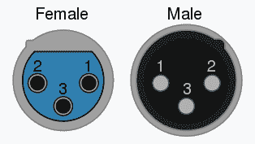
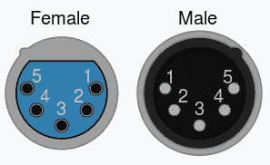

# DMX 简介

> 原文：<https://learn.sparkfun.com/tutorials/introduction-to-dmx>

## 介绍

在本教程中，我们将涵盖 DMX512 ( **D** 数字 **M** 乘 **x** 与 **512** 条信息)。DMX512 最初旨在实现照明调光器之间的标准化通信，现已用于控制各种舞台照明和效果，如[智能灯](https://en.wikipedia.org/wiki/Intelligent_lighting)、[遮光板](https://en.wikipedia.org/wiki/Gobo_(lighting))、[激光器](https://en.wikipedia.org/wiki/Laser_lighting_display)和[烟雾机](https://en.wikipedia.org/wiki/Fog_machine)。DMX512 甚至用于许多建筑照明场景(我看着你拉斯维加斯)。在本教程中，我们将了解如何以及何时实现 DMX。

### 历史

DMX512 由 USITT(美国剧院技术研究所)的工程委员会于 1986 年创建，作为控制灯光调光通道的一种方式。1998 年，ESTA 开始致力于使 DMX 获得 ANSI 的认可，2004 年，DMX-512A 被 ANSI 认可为“用于控制照明设备和附件的异步串行数字数据传输标准”

### 推荐阅读

如果你不熟悉串行通信，可以看看这篇关于串行通信的教程。

 [### 串行通信](https://learn.sparkfun.com/tutorials/serial-communication) Asynchronous serial communication concepts: packets, signal levels, baud rates, UARTs and more 100

## 基本定义

*   **Fixture/Slave** :任何接受 DMX 输入的对象。接收一个完整的 DMX 包，挑选并监听与自己相关的数据([智能灯](https://en.wikipedia.org/wiki/Intelligent_lighting)、[遮光板](https://en.wikipedia.org/wiki/Gobo_(lighting))、[激光](https://en.wikipedia.org/wiki/Laser_lighting_display)、[烟雾机](https://en.wikipedia.org/wiki/Fog_machine))。大多数灯具都有一个输出通道，它只是输入的一个副本。
*   宇宙(Universe):宇宙由一组设备组成，所有这些设备都串在一起，读取相同的数据。一个 universe 包含 512 字节的信息，因此 Universe 中的 fixture 数量将取决于每个 fixture 需要多少字节的数据来寻址。
*   **控制器**:创建并发送 DMX 数据到一个或多个宇宙。通常，这是一个有许多旋钮和滑块的大板，然而，一个简单的 PC 可以用作 DMX 控制器。

## 硬件层

由于灯光棚和舞台之间的距离，DMX512 通常用于相对较长的距离。信号发送得越远，接收周围区域杂散电磁干扰的距离就越长。结合这一事实，DMX 通常用于电气噪声环境，我们必须确定一个相对无噪声的解决方案，所以 DMX 采用 [RS-485。](https://en.wikipedia.org/wiki/RS-485)

通过读取一根导线的数据(D+)和另一根导线的反数据(D-)之间的差异，可以解释类似这样的信号。由于我们正在读取差值，我们称之为**差分信号**。RS485 等差分信号沿两条信号线拾取的噪声几乎相等，这使得两个信号之间的差异相同。由于我们读取了两种信号之间的差异，因此很容易进行长距离通信(DMX 标准建议最大距离为 1000 英尺，尽管 RS-485 的额定距离为 4000 英尺)。

DMX 数据通常通过 XLR-5 电缆传输，尽管偶尔也使用支持 DMX 的 XLR-3 电缆。RS-485 只需要 3 条线，地线，Data+，Data-；在许多应用中，这就是所使用的全部。然而，考虑到未来的增长，增加了一对额外的数据线，需要 XLR-5 电缆。这些连接器及其引出线如下所示。

XLR-3XLR-5

| **引脚** | **XLR-3** | **XLR-5** |
| one | **普通** | **普通** |
| Two | 数据 1 - | 数据 1 - |
| three | 数据 1 + | 数据 1 + |
| four | 不适用的 | 数据 2 - |
| five | 不适用的 | 数据 2 + |

远距离通信带来的一个问题是，DMX 设备的供电距离通常很远。这些距离会导致接地回路；两个设备的地电位之间的电压差，如果足够高，会导致设备之间的电流流动。由于这一距离，DMX512 标准还要求微控制器和 DMX 夹具上电路的 DMX 部分之间进行光隔离。

在 DMX 器件链最末端的两条数据线之间安装一个 120 &ohm;端接电阻也是明智之举，以防止信号反射。有些设备有开关，有些会建议你插入一根带有终端电阻的 XLR 电缆，而有些则根本没有。一条未端接的 DMX 线会导致你的整个宇宙闪烁不定，所以要确保这条线是端接的。

## 数据包结构

DMX 数据是以 250 kbit/s 的速度发送的异步串行数据，有 2 个停止位，没有奇偶校验。这意味着发送的每个时钟脉冲或位需要 4 s。数据包以一个长的**中断**开始，此时发送的所有数据都为低电平。这是继一个标志后休息或 **MAB** ，这是一个短期的高。然后是起始码( **SC** )，由 11 位串行帧(1 个低位、8 位数据字节和 2 个高位)组成，其中发送的数据为 *0x00* 。起始码还可以包含不同的数据，以表示分组中包含什么类型的 DMX 数据； *0x17* 表示一个文本包， *0xCC* 表示一个远程设备管理包(后面会详细介绍)，而 *0xCF* 是一个系统信息包，各种起始码用来表示不同类型的数据。起始代码之后是多达 512 个相同结构的帧，每个帧被称为一个**槽**，包含所有 DMX 数据(RGB 值、CMY 值、伺服位置、雾机压力等...).帧之间有一个可选的标记时间，( **MTBF** )，它可以达到每帧之间的第二个**高电平**。一旦数据帧发送完毕，数据包之间还有一个长达一秒的标记时间( **MTBP** )。然而，这些很少用于保持帧速率。下表显示了 DMX 数据包各部分的计时和常用缩写。

| 小包裹 | **缩写** | **时钟脉冲** | **定时** |
| 破裂 | **突破** | Twenty-two | 88 年代 |
| 休息后标记 | **MAB** | Two | 8 s |
| 起动电码 | **SC** | Eleven | 44 岁 |
| 标记帧之间的时间 | **平均无故障时间** | X | 0-1 秒 |
| 狭槽 | **插槽** | Eleven | 44 岁 |
| 标记数据包之间的时间 | **MTBP** | X | 0-1 秒 |
| 完整的 DMX512 数据包 | **不适用** | Five thousand six hundred and sixty-seven | 23 毫秒 |

请注意传输一个完整的 DMX 数据包所需的时间(23 毫秒)。反相得到的最大帧速率为 44 Hz。

## 解码数据

前面讨论过的 DMX 数据包会沿着设备串向下发送，但是设备如何知道它需要监听数据包的哪个时隙呢？DMX 灯具通常有一个 DIP 开关，位于某处，用于选择要监听的起始数据插槽，然后灯具将监听其固定数量的插槽。例如，一个简单的 RGB 调光器将占用 3 个插槽，每种颜色一个，因此如果我们将起始插槽设置为 12，它将侦听插槽 12、13 和 14 上的数据。DMX 装置应该在第二个停止位上增加它们的时隙计数器，所以当下一帧开始时，微处理器将知道数据应该在哪个时隙。然后，每当检测到中断和标记时，计数器应该复位。这意味着一个 DMX 数据包不需要所有的 512 个数据槽，因为计数器可以在可变的时间间隔重置。但是，这限制了占用单个 Universe 的设备数量，具体取决于每个设备需要多少个插槽。

### 远程设备管理(RDM)

远程设备管理，简称 RDM，是一种使用 DMX 获取照明设备信息的方法。该协议发出一个 DMX512 数据包，该数据包带有一个 RDM 起始码( *0xCC* )，后跟它试图与之通信的灯具的唯一 ID。然后，控制器将释放数据线，并等待响应。经过一段时间后，控制器会认为它失败了，可能会再次尝试。如果您只是插入一个未知的世界，RDM 是一个很好的方式来准确地了解每个设备的能力。

## 资源和更进一步

希望这个指南能让你让你的超级酷和古怪的灯具在 DMX 通信，让任何人都可以轻松控制它，而不必繁琐地编写自己的照明模式。如果你正在寻找一点灵感，看看 DMX 的这些实现。

 [### Enginursday:使用 Resolume 控制自定义照明设备

March 29, 2018](https://www.sparkfun.com/news/2631 "March 29, 2018: ArtNet DMX is an industry standard in wireless lighting control. Let's figure out how to create our own ArtNet node so we can control pixels over the WiFi. We'll also figure out how to set up our custom fixture in Resolume Arena 6.")[Favorited Favorite](# "Add to favorites") 3 [### 发光的吉他，双人舞部分

November 15, 2018](https://www.sparkfun.com/news/2822 "November 15, 2018: I recently figured out how to make a custom-shaped screen using an ESP32 and DMX512 over ArtNet. Let's check it out.")[Favorited Favorite](# "Add to favorites") 7

你的下一个项目需要一些灵感吗？查看一些相关的教程。

 [### 使用 Artnet DMX 和 ESP32 驱动像素](https://learn.sparkfun.com/tutorials/using-artnet-dmx-and-the-esp32-to-drive-pixels) In this tutorial, we'll find out how to use Resolume Arena, a popular video jockey software, to control custom-made ArtNet DMX fixtures.[Favorited Favorite](# "Add to favorites") 10 [### LuMini 环连接指南](https://learn.sparkfun.com/tutorials/lumini-ring-hookup-guide) The LuMini Rings (APA102-2020) are the highest resolution LED rings available.[Favorited Favorite](# "Add to favorites") 6 [### LuMini 8x8 矩阵连接指南](https://learn.sparkfun.com/tutorials/lumini-8x8-matrix-hookup-guide) The LuMini 8x8 Matrix (APA102-2020) are the highest resolution LED matrix available.[Favorited Favorite](# "Add to favorites") 6 [### SparkFun ESP32 DMX 至 LED 盾](https://learn.sparkfun.com/tutorials/sparkfun-esp32-dmx-to-led-shield) Learn how to utilize your DMX to LED Shield in a variety of different ways.[Favorited Favorite](# "Add to favorites") 12