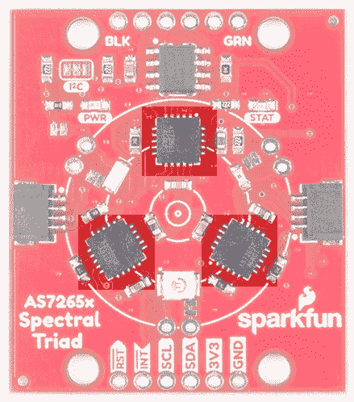
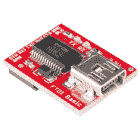

# 光谱三联体(AS7265x)连接指南

> 原文：<https://learn.sparkfun.com/tutorials/spectral-triad-as7265x-hookup-guide>

## 介绍

[SparkFun Triad 光谱传感器](https://www.sparkfun.com/products/15050)是一种功能强大的光学检测传感器。三个 AS7265x 传感器与可见光、紫外和红外发光二极管结合在一起，用于照明和测试各种表面的光谱。

 

将**添加到您的[购物车](https://www.sparkfun.com/cart)中！**

 **### [【spark fun Triad 光谱传感器- AS7265x (Qwiic)](https://www.sparkfun.com/products/15050)

[In stock](https://learn.sparkfun.com/static/bubbles/ "in stock") SEN-15050

SparkFun Triad 光谱传感器是一种功能强大的光学检测传感器，它将三个传感器与 led 结合在一起

$69.956[Favorited Favorite](# "Add to favorites") 47[Wish List](# "Add to wish list")** **[https://www.youtube.com/embed/OXGjBPXu-uc/?autohide=1&border=0&wmode=opaque&enablejsapi=1](https://www.youtube.com/embed/OXGjBPXu-uc/?autohide=1&border=0&wmode=opaque&enablejsapi=1)

AMS 结合了三个传感器的能力，可以测量 18 个波段中从 410 纳米到 940 纳米的光。

### 你能用光谱学做什么？

这是一个令人惊叹的研究领域，SparkFun Triad 将过去极其昂贵的设备带到了桌面上。不应将 AS7265x 与高度复杂的质谱仪相混淆，但传感器阵列确实让用户能够测量和表征不同材料如何吸收和反射 18 种不同频率的光。

### 所需材料

按照这个连接指南，你需要一个带有 Arduino 的 Qwiic 保护罩。你可能不需要所有的东西，这取决于你拥有什么。将它添加到您的购物车，通读指南，并根据需要调整购物车。

 

将**添加到您的[购物车](https://www.sparkfun.com/cart)中！**

 **### [spark fun red board——用 Arduino 编程 T3](https://www.sparkfun.com/products/13975)

[In stock](https://learn.sparkfun.com/static/bubbles/ "in stock") DEV-13975

SparkFun RedBoard 结合了 UNO 的 Optiboot 引导程序的简单性、FTDI 的稳定性和 shield com…

$21.5049[Favorited Favorite](# "Add to favorites") 89[Wish List](# "Add to wish list")**** 

将**添加到您的[购物车](https://www.sparkfun.com/cart)中！**

 **### [ArduinoT3 的 SparkFun Qwiic 盾](https://www.sparkfun.com/products/14352)

[In stock](https://learn.sparkfun.com/static/bubbles/ "in stock") DEV-14352

SparkFun Qwiic Shield 是一种易于组装的板，它提供了一种简单的方法来将 Qwiic Connect 系统与

$7.508[Favorited Favorite](# "Add to favorites") 39[Wish List](# "Add to wish list")**********Note:** If you are looking to reduce the cost and avoid soldering headers to the Qwiic shield, try taking a look at the RedBoard Qwiic. It is essentially a RedBoard with Qwiic connector.

 

将**添加到您的[购物车](https://www.sparkfun.com/cart)中！**

 **### [spark fun RedBoard Qwiic](https://www.sparkfun.com/products/15123)

[In stock](https://learn.sparkfun.com/static/bubbles/ "in stock") DEV-15123

SparkFun RedBoard Qwiic 是一款 Arduino 兼容开发板，内置 Qwiic 连接器，无需…

$21.5014[Favorited Favorite](# "Add to favorites") 49[Wish List](# "Add to wish list")** **您还需要一根 Qwiic 电缆将屏蔽层连接到 AS726X，选择适合您需求的长度。

 

将**添加到您的[购物车](https://www.sparkfun.com/cart)中！**

 **### [Qwiic 线缆- 100mm](https://www.sparkfun.com/products/14427)

[In stock](https://learn.sparkfun.com/static/bubbles/ "in stock") PRT-14427

这是一条 100 毫米长的 4 芯电缆，带有 1 毫米 JST 端接。它旨在将支持 Qwiic 的组件连接在一起…

$1.50[Favorited Favorite](# "Add to favorites") 32[Wish List](# "Add to wish list")**** 

将**添加到您的[购物车](https://www.sparkfun.com/cart)中！**

 **### [Qwiic 线缆- 500mm](https://www.sparkfun.com/products/14429)

[In stock](https://learn.sparkfun.com/static/bubbles/ "in stock") PRT-14429

这是一根 500mm 长的 4 芯电缆，带有 1mm JST 端接。它旨在将支持 Qwiic 的组件连接在一起…

$1.951[Favorited Favorite](# "Add to favorites") 25[Wish List](# "Add to wish list")**** 

将**添加到您的[购物车](https://www.sparkfun.com/cart)中！**

 **### [Qwiic 线缆- 50mm](https://www.sparkfun.com/products/14426)

[In stock](https://learn.sparkfun.com/static/bubbles/ "in stock") PRT-14426

这是一根 50 毫米长的 4 芯电缆，带有 1 毫米 JST 端接。它旨在将支持 Qwiic 的组件连接在一起…

$0.95[Favorited Favorite](# "Add to favorites") 29[Wish List](# "Add to wish list")**** 

### [Qwiic 线缆- 200mm](https://www.sparkfun.com/products/14428)

[Out of stock](https://learn.sparkfun.com/static/bubbles/ "out of stock") PRT-14428

这是一根 200 毫米长的 4 芯电缆，带有 1 毫米 JST 端接。它旨在将支持 Qwiic 的组件连接在一起…

[Favorited Favorite](# "Add to favorites") 21[Wish List](# "Add to wish list")****** ******### 工具

根据您的设置，您可能需要烙铁、焊料和[通用焊接附件](https://www.sparkfun.com/categories/49)。

 

### [威勒 WLC100 焊台](https://www.sparkfun.com/products/14228)

[Out of stock](https://learn.sparkfun.com/static/bubbles/ "out of stock") TOL-14228

Weller 的 WLC100 是一款多功能的 5 瓦至 40 瓦焊台，非常适合业余爱好者、DIY 爱好者和学生。…

2[Favorited Favorite](# "Add to favorites") 17[Wish List](# "Add to wish list") 

将**添加到您的[购物车](https://www.sparkfun.com/cart)中！**

 **### [无铅焊料- 100 克线轴](https://www.sparkfun.com/products/9325)

[In stock](https://learn.sparkfun.com/static/bubbles/ "in stock") TOL-09325

这是带有水溶性树脂芯的无铅焊料的基本线轴。0.031 英寸规格，100 克。这是一个好主意…

$9.957[Favorited Favorite](# "Add to favorites") 33[Wish List](# "Add to wish list")** **### 推荐阅读

如果你不熟悉 Qwiic 系统，我们推荐你在这里阅读[以获得一个概述](https://www.sparkfun.com/qwiic)。

|  |
| *[Qwiic 连接系统](https://www.sparkfun.com/qwiic)* |

我们还建议在继续之前查看这些教程。

 [### 光](https://learn.sparkfun.com/tutorials/light) Light is a useful tool for the electrical engineer. Understanding how light relates to electronics is a fundamental skill for many projects.[Favorited Favorite](# "Add to favorites") 24 [### I2C](https://learn.sparkfun.com/tutorials/i2c) An introduction to I2C, one of the main embedded communications protocols in use today.[Favorited Favorite](# "Add to favorites") 128 [### Arduino 和光子连接指南的 Qwiic 屏蔽](https://learn.sparkfun.com/tutorials/qwiic-shield-for-arduino--photon-hookup-guide) Get started with our Qwiic ecosystem with the Qwiic shield for Arduino or Photon.[Favorited Favorite](# "Add to favorites") 5

## 硬件概述

### 传感器

三元组由三个传感器组成；AS72651(紫外)、AS72652(可见光)和 AS72653(近红外)。AS72651 通过专用的 I ² C 总线与 x2 和 x3 传感器通信(AS72651 是主机，AS72652 和 AS72653 是从机)。AS72651 将其传感器数据与来自 x2 和 x3 传感器的数据相结合，并以单个寄存器阵列的形式向用户展示这些数据。SparkFun AS7265x 光谱库可以无缝读取 18 种感应频率中的任何一种。

#### 电可擦可编程只读存储器

AMS 的这些传感器很有趣，因为它们没有固件。驱动系统的固件加载到一个 4Mbit EEPROM 上，AS72651 在通电时读取该固件。

### 发光二极管/灯泡

Triad 包含一个 5700k 白色 LED、一个 405 纳米 UV LED 和一个 875 纳米 IR LED，安装在传感器旁边。选择这些发光二极管以最大的可见光和不可见光条带照亮目标。led 通过软件可配置的驱动电流单独启用。

该板还提供多种方式照亮您试图测量的物体，以获得更准确的光谱读数。如果你对车载 led 不满意，你可以自己拿一个通孔白炽灯泡。虽然你应该找到一个额定电压为 3.3V 的灯泡，但额定电压更高的灯泡，如 5V，仍然可以工作，但不会像 5V 时那样亮。我们发现 [Mouser](https://www.mouser.com/Optoelectronics/Lamps-Holders/Lamps/_/N-5g6r?P=1yzs1o7Z1z0wtyvZ1z0w0pvZ1yyg4qyZ1yyg4rqZ1z0ws3kZ1z0wa5iZ1yzubgzZ1yyg4r3Z1z0w8xrZ1z0yt45) 是寻找这些的好地方。如果你要走那条路，使用你自己的灯泡，一定要通过移除跳线来禁用板载 LED。[剪断每个灯泡底座旁边的跳线](https://learn.sparkfun.com/tutorials/how-to-work-with-jumper-pads-and-pcb-traces#cutting-a-trace-between-jumper-pads)，断开 LED 与控制器 IC 的连接，并焊接一个灯泡。我们使用“灯泡”一词来表示任何 DC 设备(最大值限于 100mA)，但该信号引脚也可用于激活更大的 MOSFET 或控制设备，以激活更大的电流设备。

除了照明 LED 外，还有一个电源 LED 和一个状态 LED。蓝色状态 LED 指示 AS72651 传感器的各种状态，可以通过 SparkFun 库禁用。红色电源 LED 用于指示主板已正确通电。如果红灯干扰读数，可以通过切断相邻跳线来禁用它。

### I ² C / Qwiic 接口

[Qwiic 连接器](https://www.sparkfun.com/qwiic)提供了一种快速简单的方法来连接 I ² C 上的三合一。或者，您可以[将](https://learn.sparkfun.com/tutorials/how-to-solder-through-hole-soldering)焊接到四个引脚:GND/3.3V/SDA/SCL。传感器是 3.3V 兼容的，所以不要在没有正确转换的情况下使用 5V Arduino Uno(使用 [Qwiic shield](https://www.sparkfun.com/products/14352) 代替！).如果您使用的是没有 Qwiic 连接器的 3.3V 开发平台，请考虑使用 [Qwiic 试验板电缆](https://www.sparkfun.com/products/14425)。

### 串行 UART 接口

⚡ **Warning:** You should only use a **3.3V** USB-to-serial converter when connecting to the serial port. Using a 5V USB-to-serial converter may damage the components on the board.

 

将**添加到您的[购物车](https://www.sparkfun.com/cart)中！**

 **### [SparkFun FTDI 基本突破- 3.3V](https://www.sparkfun.com/products/9873)

[In stock](https://learn.sparkfun.com/static/bubbles/ "in stock") DEV-09873

这是我们[FTDI Basic](https://www . spark fun . com/products/retired/8772)的最新修订版。我们现在使用 SMD 6 针头…

$16.9566[Favorited Favorite](# "Add to favorites") 55[Wish List](# "Add to wish list")**** 

将**添加到您的[购物车](https://www.sparkfun.com/cart)中！**

 **### [SparkFun 连载基础突围- CH340G](https://www.sparkfun.com/products/14050)

[In stock](https://learn.sparkfun.com/static/bubbles/ "in stock") DEV-14050

SparkFun Serial Basic Breakout 是一款易于使用的 USB 转串行适配器，基于 WCH 的 CH340G IC。

$8.957[Favorited Favorite](# "Add to favorites") 23[Wish List](# "Add to wish list")**** 

将**添加到您的[购物车](https://www.sparkfun.com/cart)中！**

 **### [SparkFun Beefy 3 - FTDI 基础突围](https://www.sparkfun.com/products/13746)

[In stock](https://learn.sparkfun.com/static/bubbles/ "in stock") DEV-13746

这是为 FTDI FT231X USB 到串行 ic 的 3 FTDI 基本突破。此板的引脚匹配 FTDI …

$17.5012[Favorited Favorite](# "Add to favorites") 22[Wish List](# "Add to wish list")****** ******对于那些喜欢使用 AT 命令的用户，也可以使用串行接口。请参考 [AS7265x 数据表](https://cdn.sparkfun.com/assets/learn_tutorials/8/3/0/AS7265x_Datasheet.pdf)获取完整的命令列表。要启用串行接口(并禁用 I ² C 接口),您必须修改两个跳线:

1.  必须打开电路板前面的 I ² C 跳线，以移除 TX 和 RX 线上的上拉电阻。
2.  电路板背面的 *JP2* 必须用跳线封闭。

接下来，将 6 针[直角公接头](https://www.sparkfun.com/products/553)焊接到串行端口。

SparkFun 系列基本款直接连接到 Triad。默认情况下，串行基本设置为 3.3V，但如果您使用不同的板，请确保它在 VCC 上提供 3.3V 并使用 3.3V 逻辑信号。

串行接口工作在 **115200** 。要测试连接，请打开 [TeraTerm](https://learn.sparkfun.com/tutorials/terminal-basics/tera-term-windows) 或您喜欢的终端，并连接到串行 Basic。发送命令`AT`并寻找`OK`响应。你都准备好了！查看 中 AT 命令的完整列表。

## AS7265x Arduino 库概述

**Note:** This example assumes you are using the latest version of the Arduino IDE on your desktop. If this is your first time using Arduino, please review our tutorial on [installing the Arduino IDE.](https://learn.sparkfun.com/tutorials/installing-arduino-ide) If you have not previously installed an Arduino library, please check out our [installation guide.](https://learn.sparkfun.com/tutorials/installing-an-arduino-library)

我们编写了一个 Arduino 库，让阅读三和弦变得轻而易举。安装这个库最简单的方法是在 Arduino 库管理器中搜索 **SparkFun Spectral Triad** 。您也可以通过下载 zip 文件手动安装 [AS7265x 库](https://github.com/sparkfun/SparkFun_AS7265x_Arduino_Library):

[Download the SparkFun AS7265X Library (ZIP)](https://github.com/sparkfun/SparkFun_AS7265x_Arduino_Library/archive/main.zip)

该库提供的示例 1 演示了如何读取所有 18 个通道。较高的示例演示了 Spectral Triad 上 SparkFun 库提供的所有功能:

*   **例 1** -所有 18 个通道的基本读数
*   **示例 2** -控制车载 led
*   **示例 3** -更改 AS7652x 上的许多设置
*   **示例 4** -输出未经校准调整的原始传感器读数
*   **示例 5** -将传感器设置为最大读取速度
*   **示例 6** -读取三个 IC 的温度
*   **示例 7** -读取各种硬件和固件版本

下面是可以从库中调用的各种函数。这些函数中的大多数都在示例中进行了演示，因此我们建议您先浏览每个示例。

*   **`boolean begin(TwoWire &wirePort = Wire);`** -用默认设置初始化传感器。电线端口的可选通道。
*   **`boolean isConnected();`** -如果在 I2C 总线上检测到传感器，则返回真
*   **`boolean dataAvailable();`** -当数据可用时返回真

*   **`uint8_t getTemperature(uint8_t deviceNumber = 0);`** -获取主 IC 的温度(C)

*   **`float getTemperatureAverage();`** -获得所有三个 IC 的平均值

*   **`void takeMeasurements();`** -告诉传感器进行一次性测量

*   **`void takeMeasurementsWithBulb();`** -在三个 led 全部点亮的情况下进行一次性测量

*   **`float getCalibratedA();`到`getCalibratedW();`** -返回各种校准数据

*   **`uint16_t getA();`到`getW();`** -获取各种原始读数

*   **`void enableIndicator();`** -启用蓝色状态 LED

*   **`void disableIndicator();`** -禁用状态 LED。在读取灵敏读数时方便

*   **`void enableBulb(uint8_t device);`** -打开给定的 LED。0 =白色，1 =红外线，2 =紫外线

*   **`void disableBulb(uint8_t device);`** -关闭给定的 LED

*   **`void setGain(uint8_t gain);`** - 1 到 64x

*   **`void setMeasurementMode(uint8_t mode);`** - 4 通道，其他 4 通道，6 chan，或 6 chan 一拍
*   **`void setIntegrationCycles(uint8_t cycleValue);`**-2.78 毫秒到 711 毫秒

*   **`void setBulbCurrent(uint8_t current, uint8_t device);`**-12.5 毫安到 100 毫安

*   **`void setIndicatorCurrent(uint8_t current);`** - 1 到 8mA

*   **`void enableInterrupt();`** -使能中断引脚(低电平有效)

*   **T2`void disableInterrupt();`**

*   **`void softReset();`** -通过软件重置设备

*   **`uint8_t getDeviceType();`** -应返回 0x41

*   **`uint8_t getHardwareVersion();`** -应该返回 0x40
*   **`uint8_t getMajorFirmwareVersion();`** -返回当前固件版本，当前为 0x0C
*   **T2`uint8_t getPatchFirmwareVersion();`**
*   **T2`uint8_t getBuildFirmwareVersion();`**

## 例如:阅读香蕉

让我们在 Qwiic 上接上三轴仪，并开始照亮一个目标以获取一些读数。使用[黑板](https://www.sparkfun.com/products/14669)和 [Qwiic 电缆](https://www.sparkfun.com/products/14427)我们可以不用焊接就能快速连接到 Triad 上。让我们打开并使用库中的示例 2，这样三元组将在照亮目标时获得所有 18 个读数。

一旦你有了一系列的读数，把它们插入你最喜欢的图表工具。出于我们的目的，我们喜欢使用谷歌电子表格。您可以将草图中逗号分隔的输出直接粘贴到图纸中。在那里，下拉小菜单并选择*分割文本到列*。

您可以在这里访问我们的[数据。18 个频率的图表非常简洁！](https://docs.google.com/spreadsheets/d/1A5W0ep32b5e5qerUcy06DxL7Uc4Sz7UOMYw5aUDT5PM/edit?usp=sharing)

现在我们有了一个基线，我们可以从一个未知的东西(在这种情况下，我们坐在周围的铀矿石用于测试[袖珍盖革计数器](https://www.sparkfun.com/products/14209))中读取数据。请注意，到样品的距离会导致读数的幅度增加或减少。我们在距离目标样品表面大约 **1 英寸**的地方读取读数，但是 3D 打印的护罩会消除背景照明和读取距离变化。

如你所见，未知样本与铀矿石特征非常接近。

*科学！*Triad 是一个神奇的工具，它会让你在家里四处寻找有趣的东西来测量。

## 资源和更进一步

现在您已经成功地建立并运行了您的 Spectral Triad，是时候将它合并到您自己的项目中了！

有关更多信息，请查看以下资源:

*   [SparkFun Triad 示意图(PDF)](https://cdn.sparkfun.com/assets/learn_tutorials/8/3/0/Qwiic_Spectral_Sensor-AS7265x.pdf)
*   [老鹰文件(ZIP)](https://cdn.sparkfun.com/assets/8/6/1/4/1/Qwiic_Spectral_Sensor-AS7265x.zip)
*   数据表
    *   [AS7265x (PDF)](https://cdn.sparkfun.com/assets/learn_tutorials/8/3/0/AS7265x_Datasheet.pdf)
    *   [白色 LED (PDF)](https://cdn.sparkfun.com/assets/9/e/3/f/e/White_LED_DS208.pdf)
    *   [红外发光二极管(PDF)](https://cdn.sparkfun.com/assets/f/a/1/b/5/IR_LED.pdf)
    *   [紫外线发光二极管(PDF)](https://cdn.sparkfun.com/assets/c/4/e/1/7/UV_LED_vlmu3100.pdf)
*   [Qwiic 系统信息](https://www.sparkfun.com/qwiic)
*   开源代码库
    *   [SparkFun Qwiic 光谱传感器报告](https://github.com/sparkfun/Qwiic_Spectral_Sensor_AS7265X) - Eagle 文件、led 数据表、设计考虑等。
    *   [SparkFun AS7265x Arduino 库回购](https://github.com/sparkfun/SparkFun_AS7265x_Arduino_Library)
*   [SFE 产品展示区](https://youtu.be/OXGjBPXu-uc)

你的下一个项目需要一些灵感吗？查看一些相关教程:

 [### 土壤湿度传感器连接指南](https://learn.sparkfun.com/tutorials/soil-moisture-sensor-hookup-guide) A quick hookup guide and project to get you started with the Soil Moisture Sensor from SparkFun.[Favorited Favorite](# "Add to favorites") 34 [### SparkFun GPS 突破- XA1110 (Qwiic)连接指南](https://learn.sparkfun.com/tutorials/sparkfun-gps-breakout---xa1110-qwiic-hookup-guide) Figure out where in the world you are with the Qwiic SparkFun GPS Breakout - XA1110\.[Favorited Favorite](# "Add to favorites") 4 [### 配电板- USB-C (Qwiic)连接指南](https://learn.sparkfun.com/tutorials/power-delivery-board---usb-c-qwiic-hookup-guide) This guide will go over how to use the USB Type-C Power Delivery Board.[Favorited Favorite](# "Add to favorites") 4 [### SparkFun Qwiic 字母数字显示器连接指南](https://learn.sparkfun.com/tutorials/sparkfun-qwiic-alphanumeric-display-hookup-guide) A Hookup Guide to get you started with the Qwiic Alphanumeric Display.[Favorited Favorite](# "Add to favorites") 1**********************