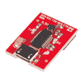
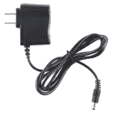
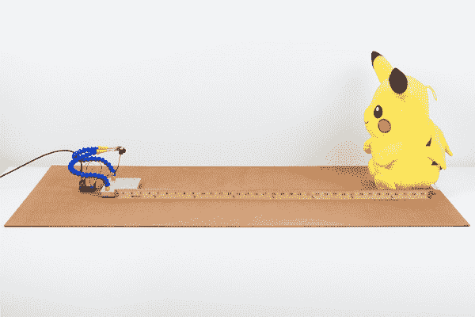

# TF 微型激光雷达模块(Qwiic)连接指南

> 原文：<https://learn.sparkfun.com/tutorials/tfmini---micro-lidar-module-qwiic-hookup-guide>

## 介绍

[](https://www.sparkfun.com/qwiic)
**Heads up!** This tutorial is for the [**Qwiic**](https://www.sparkfun.com/qwiic) enabled TFMini. Serial data is output via I²C. If you are using the TFMini that outputs serial data via UART [ [SEN-14588](https://www.sparkfun.com/products/14588) ], please refer to the [TFMini - Micro LiDAR Module Hookup Guide](https://learn.sparkfun.com/tutorials/tfmini---micro-lidar-module-hookup-guide).

TFMini 是一种 ToF(飞行时间)激光雷达传感器，能够测量距离物体近至 30 厘米远至 12 米的距离！TFMini 允许您将激光雷达集成到传统上为小型传感器保留的应用中，如 SHARP GP 系列红外测距仪。通过增加的 Qwiic 功能，您可以通过 I2C 快速连接到传感器！在本教程中，您将学习如何使用 Arduino 微控制器和 [Qwiic 系统](https://www.sparkfun.com/qwiic)连接到 TFMini。

[](https://www.sparkfun.com/products/14786) 

将**添加到您的[购物车](https://www.sparkfun.com/cart)中！**

 **### [TFMini - Micro 激光雷达模块](https://www.sparkfun.com/products/14786)

[In stock](https://learn.sparkfun.com/static/bubbles/ "in stock") SEN-14786

TFMini 是一款 ToF Qwiic 激光雷达传感器，能够测量到近至 30 厘米的物体的距离

$44.95 $31.475[Favorited Favorite](# "Add to favorites") 21[Wish List](# "Add to wish list")** **### 所需材料

要跟随本教程，您将需要以下材料。你可能不需要所有的东西，这取决于你拥有什么。将它添加到您的购物车，通读指南，并根据需要调整购物车。

[](https://www.sparkfun.com/products/11114) 

将**添加到您的[购物车](https://www.sparkfun.com/cart)中！**

 **### [Arduino Pro Mini 328-3.3V/8 MHz](https://www.sparkfun.com/products/11114)

[In stock](https://learn.sparkfun.com/static/bubbles/ "in stock") DEV-11114

SparkFun 对 Arduino 的极简设计方法。这是一个 3.3V Arduino 运行 8MHz 引导加载程序。

$10.9552[Favorited Favorite](# "Add to favorites") 91[Wish List](# "Add to wish list")****[](https://www.sparkfun.com/products/116) 

将**添加到您的[购物车](https://www.sparkfun.com/cart)中！**

 **### [破开头球——直击](https://www.sparkfun.com/products/116)

[In stock](https://learn.sparkfun.com/static/bubbles/ "in stock") PRT-00116

一排标题-打破适应。40 个引脚，可切割成任何尺寸。用于定制 PCB 或通用定制接头。

$1.7520[Favorited Favorite](# "Add to favorites") 133[Wish List](# "Add to wish list")****[](https://www.sparkfun.com/products/10215) 

将**添加到您的[购物车](https://www.sparkfun.com/cart)中！**

 **### [USB micro-B 线- 6 脚](https://www.sparkfun.com/products/10215)

[In stock](https://learn.sparkfun.com/static/bubbles/ "in stock") CAB-10215

USB 2.0 型到微型 USB 5 针。这是一种新的、更小的 USB 设备连接器。微型 USB 连接器大约是…

$5.5014[Favorited Favorite](# "Add to favorites") 21[Wish List](# "Add to wish list")****[](https://www.sparkfun.com/products/14495) 

将**添加到您的[购物车](https://www.sparkfun.com/cart)中！**

 **### [SparkFun Qwiic 适配器](https://www.sparkfun.com/products/14495)

[In stock](https://learn.sparkfun.com/static/bubbles/ "in stock") DEV-14495

SparkFun Qwiic 适配器提供了将任何旧 I ² C 板改造成支持 Qwiic 的板的完美方法。

$1.601[Favorited Favorite](# "Add to favorites") 53[Wish List](# "Add to wish list")****[](https://www.sparkfun.com/products/13746) 

将**添加到您的[购物车](https://www.sparkfun.com/cart)中！**

 **### [SparkFun Beefy 3 - FTDI 基础突围](https://www.sparkfun.com/products/13746)

[In stock](https://learn.sparkfun.com/static/bubbles/ "in stock") DEV-13746

这是为 FTDI FT231X USB 到串行 ic 的 3 FTDI 基本突破。此板的引脚匹配 FTDI …

$17.5012[Favorited Favorite](# "Add to favorites") 22[Wish List](# "Add to wish list")****[](https://www.sparkfun.com/products/14425) 

将**添加到您的[购物车](https://www.sparkfun.com/cart)中！**

 **### [Qwiic 电缆-试验板跳线(4 针)](https://www.sparkfun.com/products/14425)

[In stock](https://learn.sparkfun.com/static/bubbles/ "in stock") PRT-14425

这是一根跳线适配器电缆，一端带有一个 Qwiic JST 母接头，另一端带有一个试验板连接…

$1.50[Favorited Favorite](# "Add to favorites") 34[Wish List](# "Add to wish list")**************************Tip:** You could also use RedBoard Qwiic. It's basically a RedBoard with additional features. The board includes the same AP2112K 3.3V voltage regulator that is populated on the Beefy 3 and Qwiic connector on the board. This would reduce the amount of components and time soldering headers to the board. Additionally, a USB port can provide up to about 500mA so the TFMini may want to pull more power when auto ranging for longer distances.

[](https://www.sparkfun.com/products/15123) 

将**添加到您的[购物车](https://www.sparkfun.com/cart)中！**

 **### [spark fun RedBoard Qwiic](https://www.sparkfun.com/products/15123)

[In stock](https://learn.sparkfun.com/static/bubbles/ "in stock") DEV-15123

SparkFun RedBoard Qwiic 是一款 Arduino 兼容开发板，内置 Qwiic 连接器，无需…

$21.5014[Favorited Favorite](# "Add to favorites") 49[Wish List](# "Add to wish list")** **#### 工具

根据您的设置，您将需要一个烙铁、焊料和[通用焊接附件](https://www.sparkfun.com/categories/49)。

[](https://www.sparkfun.com/products/14228) 

### [威勒 WLC100 焊台](https://www.sparkfun.com/products/14228)

[Out of stock](https://learn.sparkfun.com/static/bubbles/ "out of stock") TOL-14228

Weller 的 WLC100 是一款多功能的 5 瓦至 40 瓦焊台，非常适合业余爱好者、DIY 爱好者和学生。…

2[Favorited Favorite](# "Add to favorites") 17[Wish List](# "Add to wish list")[](https://www.sparkfun.com/products/9325) 

将**添加到您的[购物车](https://www.sparkfun.com/cart)中！**

 **### [无铅焊料- 100 克线轴](https://www.sparkfun.com/products/9325)

[In stock](https://learn.sparkfun.com/static/bubbles/ "in stock") TOL-09325

这是带有水溶性树脂芯的无铅焊料的基本线轴。0.031 英寸规格，100 克。这是一个好主意…

$9.957[Favorited Favorite](# "Add to favorites") 33[Wish List](# "Add to wish list")** **### 推荐阅读

如果你不熟悉 Qwiic 系统，我们推荐你在这里阅读[以获得一个概述](https://www.sparkfun.com/qwiic)。

| [](https://www.sparkfun.com/qwiic) |
| *[Qwiic 连接系统](https://www.sparkfun.com/qwiic)* |

如果你不熟悉下面的教程，我们也建议你看一看。

[](https://learn.sparkfun.com/tutorials/logic-levels) [### 逻辑电平](https://learn.sparkfun.com/tutorials/logic-levels) Learn the difference between 3.3V and 5V devices and logic levels.[Favorited Favorite](# "Add to favorites") 82[](https://learn.sparkfun.com/tutorials/i2c) [### I2C](https://learn.sparkfun.com/tutorials/i2c) An introduction to I2C, one of the main embedded communications protocols in use today.[Favorited Favorite](# "Add to favorites") 128[](https://learn.sparkfun.com/tutorials/using-the-arduino-pro-mini-33v) [### 使用 Arduino Pro Mini 3.3V](https://learn.sparkfun.com/tutorials/using-the-arduino-pro-mini-33v) This tutorial is your guide to all things Arduino Pro Mini. It explains what it is, what it's not, and how to get started using it.[Favorited Favorite](# "Add to favorites") 16

## 硬件概述

**Note:** This product does not use laser light for ranging. Instead it contains an LED and optics. Many such systems are being marketed under the name "LiDAR," although it may be more appropriate to think of this device as a "Time-of-Flight Infrared Rangefinder". It differs significantly from traditional IR rangefinders in that it uses ToF to determine range and not triangulation — as is performed by the Sharp GP-series devices.

该传感器通过发出调制的近红外光来工作。从物体反射的光返回到传感器的接收器。两者之间的距离可以使用传感器通过计算时间和相位差来转换。测量的距离可能因环境和物体的反射率而异。

### 输入功率

根据[数据表(第 1 页)](https://cdn.sparkfun.com/assets/learn_tutorials/8/2/3/SJ-GU-TFmini-I__C-01__A01_-_V1.pdf)，输入电压为 **5V** 。在本教程中，我们将使用内置的升压转换器，从 Qwiic 端施加 3.3V 输入电压，将 TFMini 端的电源升压至 5V。

[](https://cdn.sparkfun.com/assets/learn_tutorials/8/2/3/TFMini-BoostConverter.jpg)**Current Draw:** According to the datasheet, TFMini may pull up to **~800mA** at peak current. You may want to consider providing a sufficient power supply when using the sensor in a project. Remember, a USB port can only provide up to about 500mA. Data can be observed on the serial monitor when objects are within the "intermediate distance" from the Qwiic TFMini. However, you will need an external power supply as the sensor auto ranges to detect objects after a certain distance.**⚡ Warning:** Since the Qwiic system uses 3.3V for power, the Qwiic enabled TFmini with boost circuit can exceed the maximum output rating of the 3.3V voltage regulator on the RedBoard powered by Arduino. This causes 3.3V voltage regulator to enter thermal shutdown and the RedBoard to restart. As a result, you will not be able to read the TFMini's output on an Arduino serial monitor.

[](https://cdn.sparkfun.com/assets/learn_tutorials/8/2/3/13975-04_RedBoard_3.3V_VoltageRegulator.jpg)

Make sure to use either the [Beefy 3](https://www.sparkfun.com/products/13746) with a 3.3V Arduino Pro Mini, [RedBoard Qwiic](https://www.sparkfun.com/products/15123), or the [LD1117V33 3.3V voltage regulator](https://www.sparkfun.com/products/526) to provide sufficient current for the TFMini. You may need to power the Qwiic TFMini with an external power supply.

### 逻辑电平

虽然传感器可以 5V 供电，但 I2C 引脚只有 **3.3V 逻辑**。使用 5V 微控制器读取传感器时，确保使用逻辑电平转换器。

### 插脚引线图

极化连接器旁边有一个标记，表示极性为“ **J1** ”，如下图所示。这在参考传感器引脚排列时很有用。与最初的 TFMini 相反，Qwiic 启用的 TFMini 的绿色和白色电线使用 I ² C 串行。TFMini 的默认地址是 **0x10** 。

[](https://cdn.sparkfun.com/assets/learn_tutorials/8/2/3/14588-TFMini_-_Micro_Infrared_Module-03_Pinout_Qwiic_I2C.jpg)

| 插脚数 | 电线颜色 | Qwiic TFMini 引脚排列 | 电线颜色 |
| one | 格林（姓氏）；绿色的 | SCL ( **3.3V TTL** ) | 黄色 |
| Two | 怀特（姓氏） | SDA ( **3.3V TTL** ) | 蓝色 |
| three | 红色 | **5V** | 红色 |
| four | 黑色 | GND | 黑色 |

## 硬件连接

如果你还没有[组装好你的 3.3V Pro Mini](https://learn.sparkfun.com/tutorials/using-the-arduino-pro-mini-33v#assembly) ，现在是时候去那个教程[焊接插头引脚](https://learn.sparkfun.com/tutorials/how-to-solder-through-hole-soldering)了。焊接后，在 Arduino Pro Mini 3.3V/8MHz 和 Qwiic 适配器之间连接电源和 I ² C 引脚。

| Arduino 引脚 | Qwiic 适配器引脚 | 电线颜色 |
| A5 号航空母舰 | SCL ( **3.3V TTL** ) | 黄色 |
| A4 (SDA) | SDA ( **3.3V TTL** ) | 蓝色 |
| **3.3V** | **3.3V** | 红色 |
| GND | GND | 黑色 |

然后将包含在**电源输入**侧的 Qwiic 电缆连接到 Qwiic 适配器和升压电路之间。在另一侧，将包含在**功率输出**侧的第二根电缆插入升压电路和 TFMini 之间。升压转换器两侧的连接器是不同的，所以不应该最后，用 micro-B USB 电缆和 Beefy 3 给电路供电。连接应该如下图所示。

[](https://cdn.sparkfun.com/assets/learn_tutorials/8/2/3/TF_Mini_Qwiic_Tutorial_-_Hardware_Hookup_Arduino_Pro_Mini.jpg)**Tip:** Looking to reduce the number of components? Try using the SparkX BlackBoard or RedBoard Qwiic is an alternative to connecting to the Qwiic enabled TFMini. The trade off is that the BlackBoard is larger than the Arduino Pro Mini.

[](https://cdn.sparkfun.com/assets/learn_tutorials/8/2/3/TF_Mini_Qwiic_Tutorial_-_Hardware_Hookup_Arduino_BlackBoard.jpg)**Tip:** Remember, powering from a USB port can only provide about 500mA. When testing this between short and intermediate distances, the Beefy3 was sufficient enough to power both the Arduino Pro Mini 3.3V and Qwiic TFMini. You may need an external power supply when powering both at longer distances.

If you are using a SparkX BlackBoard or RedBoard Qwiic with a USB cable, try powering the boards with a 9V wall adapter in addition to USB. Don't worry, it is acceptable to connect both a barrel jack and a USB connector at the same time. The boards have power-control circuitry to automatically select the best power source.

[](https://www.sparkfun.com/products/retired/298) 

### [墙壁适配器电源- 9VDC 650mA](https://www.sparkfun.com/products/retired/298)

[Retired](https://learn.sparkfun.com/static/bubbles/ "Retired") TOL-00298

专为 Spark Fun Electronics 制造的高质量开关“壁式电源”AC 到 DC 9V 650mA 壁式电源。T…

12 **Retired**[Favorited Favorite](# "Add to favorites") 23[Wish List](# "Add to wish list")

## 示例代码

**注意:**此示例假设您在桌面上使用的是最新版本的 Arduino IDE。如果这是你第一次使用 Arduino，请回顾我们关于[安装 Arduino IDE 的教程。](https://learn.sparkfun.com/tutorials/installing-arduino-ide)

抓住一根 micro-B USB 电缆，将 Arduino 连接到您的计算机。复制、粘贴并上传下面的代码。确保使用正确的 COM 端口和主板选择。

```
language:c
/*
  LidarTest.ino
  Written in collaboration by Nate Seidle and Benewake

  Example sketch for the Qwiic Enabled TFMini
  (https://www.sparkfun.com/products/14786)
*/

#include <Wire.h>

uint16_t distance = 0; //distance
uint16_t strength = 0; // signal strength
uint8_t rangeType = 0; //range scale
/*Value range:
 00 (short distance)
 03 (intermediate distance)
 07 (long distance) */

boolean valid_data = false; //ignore invalid ranging data

const byte sensor1 = 0x10; //TFMini I2C Address

void setup()
{
  Wire.begin();

  Serial.begin(115200);
  Serial.println("TFMini I2C Test");
}

void loop()
{
  if (readDistance(sensor1) == true)
  {
    if (valid_data == true) {
      Serial.print("\tDist[");
      Serial.print(distance);
      Serial.print("]\tstrength[");
      Serial.print(strength);
      Serial.print("]\tmode[");
      Serial.print(rangeType);
      Serial.print("]");
      Serial.println();
    }
    else {
      //don't print invalid data
    }
  }
  else {
    Serial.println("Read fail");
  }
  delay(50); //Delay small amount between readings
}

//Write two bytes to a spot
boolean readDistance(uint8_t deviceAddress)
{
  Wire.beginTransmission(deviceAddress);
  Wire.write(0x01); //MSB
  Wire.write(0x02); //LSB
  Wire.write(7); //Data length: 7 bytes for distance data
  if (Wire.endTransmission(false) != 0) {
    return (false); //Sensor did not ACK
  }
  Wire.requestFrom(deviceAddress, (uint8_t)7); //Ask for 7 bytes

  if (Wire.available())
  {
    for (uint8_t x = 0 ; x < 7 ; x++)
    {
      uint8_t incoming = Wire.read();

      if (x == 0)
      {
        //Trigger done
        if (incoming == 0x00)
        {
          //Serial.print("Data not valid: ");//for debugging
          valid_data = false;
          //return(false);
        }
        else if (incoming == 0x01)
        {
          Serial.print("Data valid:     ");
          valid_data = true;
        }
      }
      else if (x == 2)
        distance = incoming; //LSB of the distance value "Dist_L"
      else if (x == 3)
        distance |= incoming << 8; //MSB of the distance value "Dist_H"
      else if (x == 4)
        strength = incoming; //LSB of signal strength value
      else if (x == 5)
        strength |= incoming << 8; //MSB of signal strength value
      else if (x == 6)
        rangeType = incoming; //range scale
    }
  }
  else
  {
    Serial.println("No wire data avail");
    return (false);
  }

  return (true);
} 
```

上传后，试着在传感器前移动一个物体进行测试。在下面的例子中，当检测到距离传感器一定距离的物体时，第三只手用于握住 TFMini。由于传感器不能检测到距离小于 11.8 英寸(或 30cm = 0.3m)的物体，所以被测物体被放置在 20 英寸和 30 英寸处。

| [](https://cdn.sparkfun.com/assets/learn_tutorials/8/2/3/TF_Mini_Qwiic_Tutorial-Distance-_20_Inches.jpg) | [](https://cdn.sparkfun.com/assets/learn_tutorials/8/2/3/TF_Mini_Qwiic_Tutorial-Distance-_30_Inches.jpg) |
| *Qwiic 启用 TFMini 读取 20 英寸处的物体* | *Qwiic 启用 TFMini 读取 30 英寸处的物体* |

在 **115200** 处打开[串行监视器](https://learn.sparkfun.com/tutorials/terminal-basics/arduino-serial-monitor-windows-mac-linux)，您可能会看到类似于下面打印的值的输出。使用码尺，当移动 30 英寸到 20 英寸之间的物体时，这些值如预期的那样响应。启用 Qwiic 的 TFMini 指示该物体处于“中间距离”。

```
TFMini I2C Test
Data valid:         Dist[72]    strength[274]   mode[3]
Data valid:         Dist[72]    strength[275]   mode[3]
Data valid:         Dist[73]    strength[267]   mode[3]
Data valid:         Dist[72]    strength[265]   mode[3]
Data valid:         Dist[71]    strength[275]   mode[3]
Data valid:         Dist[70]    strength[284]   mode[3]
Data valid:         Dist[68]    strength[305]   mode[3]
Data valid:         Dist[67]    strength[311]   mode[3]
Data valid:         Dist[65]    strength[329]   mode[3]
Data valid:         Dist[65]    strength[335]   mode[3]
Data valid:         Dist[65]    strength[341]   mode[3]
Data valid:         Dist[65]    strength[361]   mode[3]
Data valid:         Dist[64]    strength[367]   mode[3]
Data valid:         Dist[64]    strength[383]   mode[3]
Data valid:         Dist[64]    strength[387]   mode[3]
Data valid:         Dist[64]    strength[386]   mode[3]
Data valid:         Dist[64]    strength[385]   mode[3]
Data valid:         Dist[64]    strength[384]   mode[3]
Data valid:         Dist[64]    strength[386]   mode[3]
Data valid:         Dist[64]    strength[394]   mode[3]
Data valid:         Dist[64]    strength[398]   mode[3]
Data valid:         Dist[64]    strength[400]   mode[3]
Data valid:         Dist[64]    strength[402]   mode[3] 
```

## 资源和更进一步

现在您已经成功地启动并运行了快速启用的 TFMini，是时候将它合并到您自己的项目中了！有关 TFMini 的更多信息，请查看以下链接:

*   [数据表(PDF)](https://cdn.sparkfun.com/assets/5/a/b/1/d/TFmini-I__C-Datasheet_V1.1_EN.pdf)
*   [产品手册(PDF)](https://cdn.sparkfun.com/assets/d/9/e/c/d/TFmini-I__C-Product_Manual_V1.1_EN.pdf)
*   贝内威克
    *   [常见问题解答](http://www.benewake.com/en/questions.html)
    *   [TFMini 下载量](http://www.benewake.com/en/down.html)

你的下一个项目需要一些灵感吗？查看一些相关教程:

[](https://learn.sparkfun.com/tutorials/vl6180-hookup-guide) [### VL6180 连接指南](https://learn.sparkfun.com/tutorials/vl6180-hookup-guide) Get started with your VL6180 based sensor or the VL6180 breakout board.[Favorited Favorite](# "Add to favorites") 6[](https://learn.sparkfun.com/tutorials/building-an-autonomous-vehicle-the-batmobile) [### 建造自主车辆:蝙蝠战车](https://learn.sparkfun.com/tutorials/building-an-autonomous-vehicle-the-batmobile) Documenting a six-month project to race autonomous Power Wheels at the SparkFun Autonomous Vehicle Competition (AVC) in 2016\.[Favorited Favorite](# "Add to favorites") 8[](https://learn.sparkfun.com/tutorials/lidar-lite-v3-hookup-guide) [### LIDAR-Lite v3 连接指南](https://learn.sparkfun.com/tutorials/lidar-lite-v3-hookup-guide) A tutorial for connecting the Garmin LIDAR-Lite v3 or the LIDAR-Lite v3HP to an Arduino to measure distance.[Favorited Favorite](# "Add to favorites") 6[](https://learn.sparkfun.com/tutorials/qwiic-distance-sensor-rfd77402-hookup-guide) [### Qwiic 距离传感器(RFD77402)连接指南](https://learn.sparkfun.com/tutorials/qwiic-distance-sensor-rfd77402-hookup-guide) The RFD77402 uses an infrared VCSEL (Vertical Cavity Surface Emitting Laser) TOF (Time of Flight) module capable of millimeter precision distance readings up to 2 meters. It’s also part of SparkFun’s Qwiic system, so you won’t have to do any soldering to figure out how far away things are.[Favorited Favorite](# "Add to favorites") 2

或者看看这篇相关的博客文章。

[](https://www.sparkfun.com/news/2824 "November 20, 2018: It's time to bounce that old tennis ball out of your garage, and up your game with this simple project that lets you know exactly where to stop when pulling in to your garage.") [### 激光雷达完美停车

November 20, 2018](https://www.sparkfun.com/news/2824 "November 20, 2018: It's time to bounce that old tennis ball out of your garage, and up your game with this simple project that lets you know exactly where to stop when pulling in to your garage.")[Favorited Favorite](# "Add to favorites") 3******************