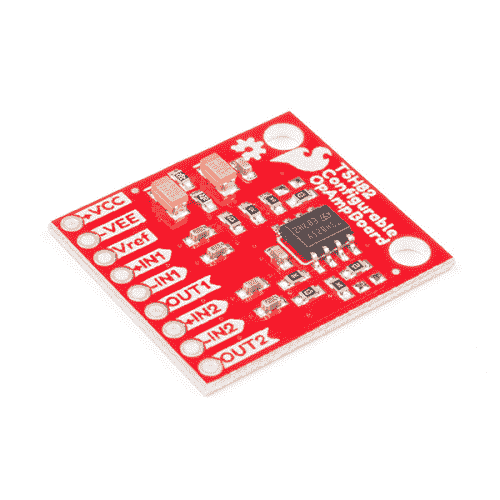

# TSH82 可配置运算放大器连接指南

> 原文：<https://learn.sparkfun.com/tutorials/tsh82-configurable-opamp-hookup-guide>

## 介绍

[TSH82 可配置运算放大器](https://www.sparkfun.com/products/14874)板旨在为您提供我们能够实现的性能和灵活性的最佳组合。TSH82 器件本身有两个增益级，每个增益级都可以通过接头独立访问。每一级本身配置为反相放大器，交流输入耦合时增益为-4.7。将两个阶段串联起来，你将获得大约 22 的增益。但是，利用电路板背面的跳线，您可以额外配置每一级的同相操作、差分输入和 DC 输入耦合。该板还可以使用从 **4.5V** 到 **12V** 的单端 DC 电源，或者从+/- **2.25V** 到+/- **6V** 的双极性电源。

 

将**添加到您的[购物车](https://www.sparkfun.com/cart)中！**

### [SparkFun 可配置运放板- TSH82](https://www.sparkfun.com/products/14874)

[In stock](https://learn.sparkfun.com/static/bubbles/ "in stock") BOB-14874

SparkFun TSH82 可配置运算放大器板提供两个增益级，每个增益级均可通过接头引脚单独访问。确认…

$5.951[Favorited Favorite](# "Add to favorites") 9[Wish List](# "Add to wish list")** **[https://www.youtube.com/embed/btQ94sIKNak/?autohide=1&border=0&wmode=opaque&enablejsapi=1](https://www.youtube.com/embed/btQ94sIKNak/?autohide=1&border=0&wmode=opaque&enablejsapi=1)

### 所需材料

为了让信号进出电路板，你必须将一些材料焊接在一起。你可能不需要清单上的所有东西，这取决于你有什么。将它添加到您的购物车，通读指南，并根据需要调整购物车。**