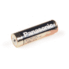
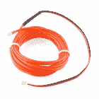
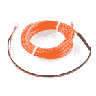
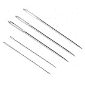
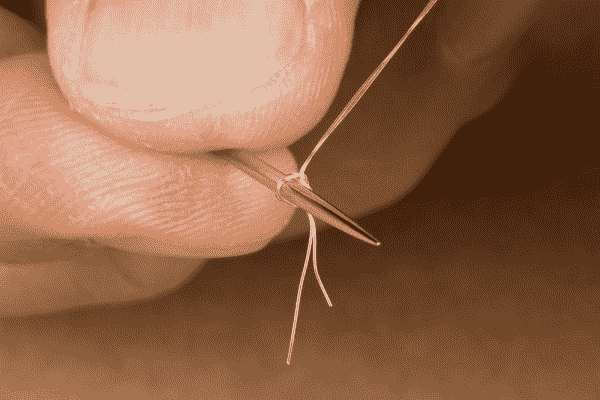
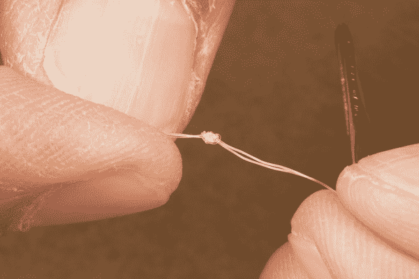
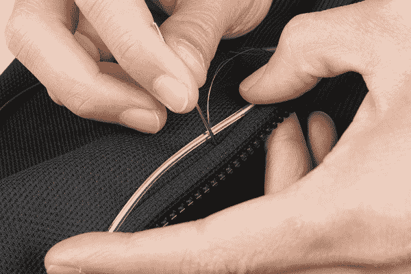

# EL Wire 连帽衫

> 原文：<https://learn.sparkfun.com/tutorials/el-wire-hoodie>

## 介绍

The design and build time of this project depends on your experience manually sewing, the length of EL wire used, and where you are sewing it to. This can take about ~1 - 3 hours if you are following the edges of a hoodie.**Heads up!** The hoodie that was used in this tutorial was a **youth medium sized** hoodie with standard EL wire sewn around the front, hood, and shoulders. The length of wire used was 3 meters. [Depending on the size of the hoodie](https://learn.sparkfun.com/tutorials/el-wire-hoodie#diff_size), you may end up needing more or less EL wire as explained further below. Make sure to plan accordingly.

在本教程中，我们将把标准的 EL 线缝到连帽衫上。

### 所需材料

要跟随本教程，您将需要以下材料。我们将在帽衫上使用标准的 EL 线。你可能不需要所有的东西，这取决于你有什么和你的设置。将它添加到您的购物车，通读指南，并根据需要调整购物车。

 

将**添加到您的[购物车](https://www.sparkfun.com/cart)中！**

 **### [松下碱性电池- AA](https://www.sparkfun.com/products/15201)

[15 available](https://learn.sparkfun.com/static/bubbles/ "15 available") PRT-15201

这些是来自松下的标准 1.5V AA 碱性电池。

$0.55[Favorited Favorite](# "Add to favorites") 2[Wish List](# "Add to wish list")**** 

### [EL 逆变器-电池组](https://www.sparkfun.com/products/retired/11222)

[Retired](https://learn.sparkfun.com/static/bubbles/ "Retired") COM-11222

即使 Tron 电影已经上映一段时间了，电致发光仍然是自切片面包以来最酷的东西。的…

5 **Retired**[Favorited Favorite](# "Add to favorites") 9[Wish List](# "Add to wish list") 

### [EL 丝-白色 3m](https://www.sparkfun.com/products/retired/10197)

[Retired](https://learn.sparkfun.com/static/bubbles/ "Retired") COM-10197

EL 线或电致发光线是一种涂有荧光粉的柔性线。施加适当的电压，它就亮了！我…

**Retired**[Favorited Favorite](# "Add to favorites") 7[Wish List](# "Add to wish list")******Note:** EL comes in many different colors. Below are a few options for standard EL wire.

 

### [EL 丝-红色 3m](https://www.sparkfun.com/products/retired/10191)

[Retired](https://learn.sparkfun.com/static/bubbles/ "Retired") COM-10191

EL 线或电致发光线是一种涂有荧光粉的柔性线。施加适当的电压，它就亮了！我…

1 **Retired**[Favorited Favorite](# "Add to favorites") 8[Wish List](# "Add to wish list") 

### [EL 丝-黄色 3m](https://www.sparkfun.com/products/retired/10192)

[Retired](https://learn.sparkfun.com/static/bubbles/ "Retired") COM-10192

EL 线或电致发光线是一种涂有荧光粉的柔性线。施加适当的电压，它就亮了！我…

2 **Retired**[Favorited Favorite](# "Add to favorites") 5[Wish List](# "Add to wish list") 

### [EL 丝-橙色 3m](https://www.sparkfun.com/products/retired/10193)

[Retired](https://learn.sparkfun.com/static/bubbles/ "Retired") COM-10193

EL 线或电致发光线是一种涂有荧光粉的柔性线。施加适当的电压，它就亮了！我…

1 **Retired**[Favorited Favorite](# "Add to favorites") 4[Wish List](# "Add to wish list") 

### [EL 丝-绿色 3m](https://www.sparkfun.com/products/retired/10194)

[Retired](https://learn.sparkfun.com/static/bubbles/ "Retired") COM-10194

EL 线或电致发光线是一种涂有荧光粉的柔性线。施加适当的电压，它就亮了！我…

2 **Retired**[Favorited Favorite](# "Add to favorites") 7[Wish List](# "Add to wish list") 

### [EL 钢丝蓝 3m](https://www.sparkfun.com/products/retired/10195)

[Retired](https://learn.sparkfun.com/static/bubbles/ "Retired") COM-10195

EL 线或电致发光线是一种涂有荧光粉的柔性线。施加适当的电压，它就亮了！我…

**Retired**[Favorited Favorite](# "Add to favorites") 16[Wish List](# "Add to wish list") 

### [EL 丝-紫色 3m](https://www.sparkfun.com/products/retired/10196)

[Retired](https://learn.sparkfun.com/static/bubbles/ "Retired") COM-10196

EL 线或电致发光线是一种涂有荧光粉的柔性线。施加适当的电压，它就亮了！我…

2 **Retired**[Favorited Favorite](# "Add to favorites") 8[Wish List](# "Add to wish list") 

### [EL 丝-白色 3m](https://www.sparkfun.com/products/retired/10197)

[Retired](https://learn.sparkfun.com/static/bubbles/ "Retired") COM-10197

EL 线或电致发光线是一种涂有荧光粉的柔性线。施加适当的电压，它就亮了！我…

**Retired**[Favorited Favorite](# "Add to favorites") 7[Wish List](# "Add to wish list") 

### [EL 线-蓝-绿 3m](https://www.sparkfun.com/products/retired/10199)

[Retired](https://learn.sparkfun.com/static/bubbles/ "Retired") COM-10199

EL 线或电致发光线是一种涂有荧光粉的柔性线。施加适当的电压，它就亮了！我…

1 **Retired**[Favorited Favorite](# "Add to favorites") 3[Wish List](# "Add to wish list") 

### [EL 线-荧光-绿色 3m](https://www.sparkfun.com/products/retired/10200)

[Retired](https://learn.sparkfun.com/static/bubbles/ "Retired") COM-10200

EL 线或电致发光线是一种涂有荧光粉的柔性线。施加适当的电压，它就亮了！我…

**Retired**[Favorited Favorite](# "Add to favorites") 4[Wish List](# "Add to wish list")Looking for EL chasing or bendable EL wire? Click on the button below for additional options in the catalog!

[Click to Browse More Colors Options for
EL Chasing&comma; Bendable&comma; & Types of EL Products](https://www.sparkfun.com/categories/226)

### 工具

至少，你需要一根针。如果你正在制作一根延长电缆，你将需要一个烙铁、焊料和[通用焊接附件](https://www.sparkfun.com/categories/49)。

 

将**添加到您的[购物车](https://www.sparkfun.com/cart)中！**

 **### [针套](https://www.sparkfun.com/products/10405)

[Out of stock](https://learn.sparkfun.com/static/bubbles/ "out of stock") TOL-10405

这一套缝纫针是缝合你的下一个电子纺织品项目的必备工具。每个信封包含三个 4…

$2.10[Favorited Favorite](# "Add to favorites") 10[Wish List](# "Add to wish list")** **### 你还需要

*   帽衫
*   [清理线](https://www.joann.com/sulky-premium-invisible-thread-440-yards-clear/3076106.html)或钓鱼线
*   活页夹、别针或胶带
*   剪刀

### 推荐阅读

如果您不熟悉以下概念，我们建议您在继续之前查看这些教程。

 [### 电致发光(EL)线入门](https://learn.sparkfun.com/tutorials/getting-started-with-electroluminescent-el-wire) This guide will help you get started with electroluminescent (EL) wire, tape, panel, chasing wire, and bendable wire to let your project glow 14 [### 规划可穿戴电子项目](https://learn.sparkfun.com/tutorials/planning-a-wearable-electronics-project) Tips and tricks for brainstorming and creating a wearables project.[Favorited Favorite](# "Add to favorites") 25 [### 如何制作定制的 EL 电线延长线](https://learn.sparkfun.com/tutorials/how-to-make-a-custom-el-wire-extension-cable) In this tutorial, we will make a custom EL Wire extension cable as an alternative to splicing wire.[Favorited Favorite](# "Add to favorites") 4

## 准备好电线

**Note:** The images below is using standard EL wire with a **youth medium sized hoodie**. The length of wire used was 3 meters. [Depending on the size of the hoodie](https://learn.sparkfun.com/tutorials/el-wire-hoodie#diff_size), you may end up needing more or less EL wire as explained further below. Make sure to plan accordingly.

### 测试 EL 线和 EL 逆变器

在把 EL 线缝到一件衣服上之前，一定要测试一下它是否正常工作。测试时，将 EL 线连接到逆变器。在这种情况下，我们使用 AA 电池和 3V EL 逆变器电池组。

将电池放入 EL 逆变器电池组中，按下按钮进行测试。如果 EL 线亮起，则 EL 线和 EL 逆变器都准备就绪！

### 规划路径

计划在哪里添加 EL 线。虽然您可以[将 EL 线缝在手臂上](https://learn.sparkfun.com/tutorials/el-wire-hoodie#sewing-in-arms)，但由于手臂上有大量可用空间，这将更加困难。最简单的方法是沿着帽衫的边缘走。为了在缝纫时压住电线，我们将使用夹子。根据你所拥有的，你也可以尝试使用大头针或胶带。将 EL 线放入夹子中，并将其夹在织物上。确保不要将 EL 线夹在夹子夹住的地方，因为这样会损坏电晕线。

在这种情况下，使用了所有 3 米长的 EL 线，从口袋下面开始，沿着拉链的一侧向上，绕过肩部，直到兜帽的边缘，绕过肩部，沿着拉链向下，在另一侧的口袋处结束。确保避免急转弯。如果你决定使用较短的长度，你可以切断电线。只要确保用热胶水重新密封切口，否则你可能会得到一个很好的震动..

|  |  |

*Having a hard time seeing the binder clips and EL wire? Click on the images for a closer look***Heads up!** Loose fabric like cotton can be harder to sew unless you have a something to hold the thread down. Make sure to choose your material wisely.

### 准备针线

在本教程中，我们将双头清理线程。准备好你的针和线，将透明线的末端穿过针眼(开口)并拉出。剪下大约一臂长的线(大约 2 英尺长)来使用。把钓鱼线的两端打成一个结。你可能需要用针来帮助引导结靠近线的末端。

再次重复这些步骤，打第二个结。剪掉任何多余的尾巴。

**Tip:** The clear thread is non-conductive. However, try checking out the section on [sewing with conductive thread](https://learn.sparkfun.com/tutorials/lilypad-basics-e-sewing#sewing-with-conductive-thread) for other alternatives to start a knot.

## 缝制 EL 线

**Heads up!** The hoodie that was used in this tutorial was a **youth medium sized** hoodie with standard EL wire sewn around the front, hood, and shoulders. The length of wire used was 3 meters. [Depending on the size of the hoodie](https://learn.sparkfun.com/tutorials/el-wire-hoodie#diff_size), you may end up needing more or less EL wire as explained further below. Make sure to plan accordingly.**⚡ Please note:** While sewing, make sure that your EL wire is disconnected from power. Also, make sure you do not stab yourself or the EL wire while sewing.

在 EL 线的热收缩处开始缝纫，并在 EL 线周围打一个结。继续绕着 EL 线做一个环来压住它。用透明线缝纫时，一定要把线拉到底，因为在某些布料上缝纫时，线很滑。注意不要把帽衫的前后缝在一起。另外，确保每针之间的距离不要太长。大约 0.5”到 1.0”是一个好的针脚。穿 EL 连帽衫时，较长的针脚可能会导致 EL 线钩住或变松。

大约缝了 5 针后，用一个上手结穿过最后一针，锁住线，防止线滑动。

继续缝纫，并拆除将 EL 线固定在布料上的夹子。当沿拉链缝制线头时，避免线头绕在拉链上。

缝制 EL 线时，试着用非惯用手按住 EL 线。用拇指和无名指捏住正在缝纫的部位。然后用食指和中指捏住你要缝纫的地方。这样可以保持中心区域(你要用针工作的地方)绷紧，这样更容易缝纫。

一旦你的线用完了，就把干净的线系在布料上。然后用另一根透明线重复上述步骤。

当您完成缝合 EL 电线时，用 EL 电线电缆的末端做一个环，并缝合电线以消除应力。由于热缩处的连接对弯曲很敏感，请确保该线圈不在热缩处。

将 EL 线插回 EL 逆变器进行测试。如果它亮了，你就可以走了！将 EL 逆变器放入口袋或夹在腰带上，尽情享受吧！如果您使用的是 EL 逆变器电池组，您可能需要[制作一根延长电缆](https://learn.sparkfun.com/tutorials/how-to-make-a-custom-el-wire-extension-cable)。

记住，EL 线在弱光下效果最好。在白天或有光源的房间里可能很难看清。

|  |  |
| *前 EL 钢丝帽衫低光* | *背部 EL 钢丝帽衫低光* |

* * *

### [不同尺码的帽衫](#diff_size)

还记得我说过的帽衫的尺寸吗？不同的帽衫尺寸将需要不同长度的 EL 线-这种变化可能会导致 EL 线不在您预期的位置开始或结束。请注意右下角图像中的差异。

|  |  |
| *带 EL 线的青春介质* | *青年大号带着埃尔丝* |

### [缝进怀里](#sewing-in-arms)

想挑战吗？根据所用的布料和你需要处理的空间大小，把电线缝到手臂上会很困难。三片瓦楞纸板被定制切割成适合帽衫的手臂，以帮助缝纫。组装时，将纸板切成一半，离边缘约 0.5 英寸-1 英寸。它不必是完美的。将纸板滑动到一起，然后用热胶水将接缝粘住。

*Front View of Cardboard Bracket*

根据需要修剪边缘，以便轻松滑入手臂。

|  |  |
| *俯视图* | *前侧视图* |

切割和组装后，将支架插入臂中。

将织物材料压紧在纸板支架上，确保织物材料绷紧。继续在手臂上下缝透明线。

下图显示了标准 EL 线缝制在成人中号连帽衫的手臂上。

|  |  |
| *将 EL 线缝入手臂的前视图* | *将 EL 线缝入手臂的前侧视图* |

## 资源和更进一步

你的下一个项目需要一些灵感吗？查看一些相关教程:

 [### EL 电线发光狗线束](https://learn.sparkfun.com/tutorials/el-wire-light-up-dog-harness) Learn how to create a light-up dog harness using EL wire for when you need to take your four-legged friend for a walk in the dark.[Favorited Favorite](# "Add to favorites") 8 [### 心跳直筒夹克](https://learn.sparkfun.com/tutorials/heartbeat-straight-jacket) An EL project that displays one person's heartbeat on another person's costume.[Favorited Favorite](# "Add to favorites") 9 [### 声音反应 EL 线服装](https://learn.sparkfun.com/tutorials/sound-reactive-el-wire-costume) Learn how to make your EL wire costumes sound reactive in this project tutorial.[Favorited Favorite](# "Add to favorites") 18 [### 原型可穿戴 LED 舞蹈背带](https://learn.sparkfun.com/tutorials/prototype-wearable-led-dance-harness) A project tutorial to add an extra effect for dancers performing a choreographed piece. The harness can be added quickly under a costume.[Favorited Favorite](# "Add to favorites") 4

想了解更多想法，请查看以下相关博文:

 [### SparkFun 现场预览- EL 运动衫

September 24, 2014](https://www.sparkfun.com/news/1607 "September 24, 2014: Get ready for the next episode of "SparkFun Live!"  ")[Favorited Favorite](# "Add to favorites") 0 [### SparkFun 直播-万圣节黑客

October 14, 2014](https://www.sparkfun.com/news/1623 "October 14, 2014: Join us this afternoon for some Halloween-themed projects! ")[Favorited Favorite](# "Add to favorites") 0 [### 电气产品

December 29, 2014](https://www.sparkfun.com/news/1701 "December 29, 2014: Have you always wanted to experiment with electroluminescence? ")[Favorited Favorite](# "Add to favorites") 0 [### 口袋妖怪 go el 项目

August 10, 2016](https://www.sparkfun.com/news/2160 "August 10, 2016: Making illuminated costume items for late-night Pokémon hunting")[Favorited Favorite](# "Add to favorites") 0 [### 硬件驼峰日:3 个简易 EL 线项目

April 12, 2017](https://www.sparkfun.com/news/2358 "April 12, 2017: Add light elements to your projects quickly and easily! ")[Favorited Favorite](# "Add to favorites") 3 [### EL Wire 实验室外套

December 18, 2017](https://www.sparkfun.com/news/2562 "December 18, 2017: I am no expert at soldering, coding or developing, but I know how to plug something in and press a power button.")[Favorited Favorite](# "Add to favorites") 1****