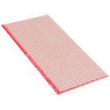
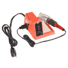
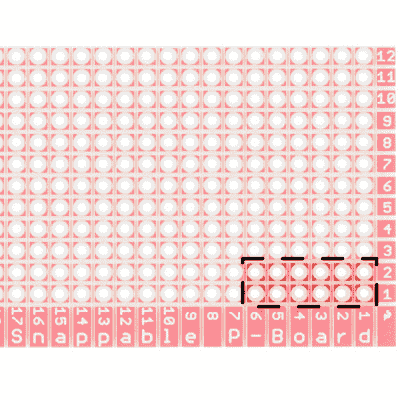
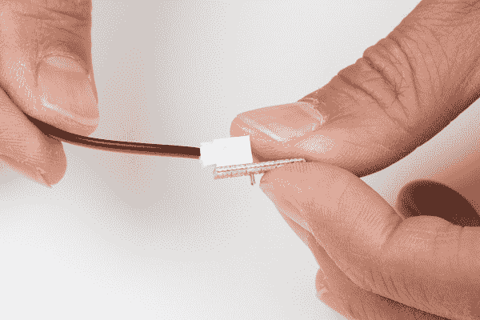
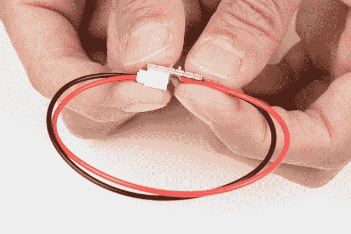
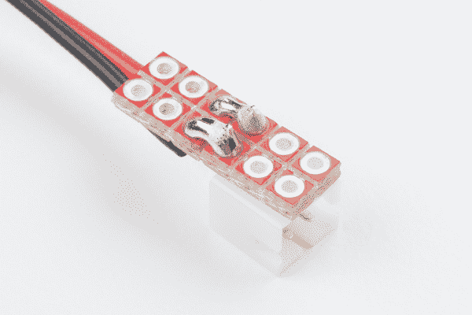
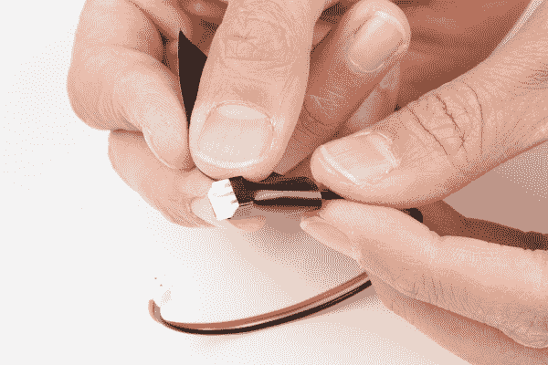
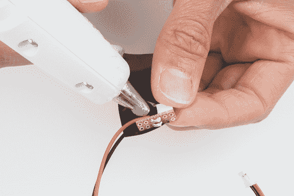
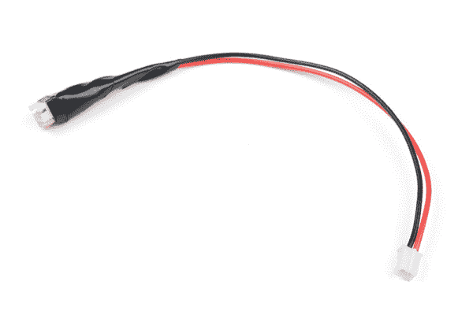

# 如何制作定制的 EL 电线延长线

> 原文：<https://learn.sparkfun.com/tutorials/how-to-make-a-custom-el-wire-extension-cable>

## 介绍

在本教程中，我们将制作一个定制的 EL 电线延长电缆，作为拼接电线的替代方案。

如果您需要:

*   将 EL 线上的电缆延伸至 EL 逆变器
*   如果逆变器在外壳中或连接在单独的衣服上，请轻松断开 EL 线
*   为线缆在可穿戴项目中的移动提供额外的灵活性

### 所需材料

要跟随本项目教程，您将需要以下材料。你可能不需要所有的东西，这取决于你拥有什么。将它添加到您的购物车，通读指南，并根据需要调整购物车。

 

将**添加到您的[购物车](https://www.sparkfun.com/cart)中！**

### [JST 跳线 2 线组装](https://www.sparkfun.com/products/9914)

[In stock](https://learn.sparkfun.com/static/bubbles/ "in stock") PRT-09914

这是一根简单的双线电缆。非常适合从一个板跳到另一个板或者做其他事情。有一个 2 针 JST 连接器…

$1.053[Favorited Favorite](# "Add to favorites") 34[Wish List](# "Add to wish list")**** 

将**添加到您的[购物车](https://www.sparkfun.com/cart)中！**

### [spark fun snap able 原板](https://www.sparkfun.com/products/13268)

[In stock](https://learn.sparkfun.com/static/bubbles/ "in stock") PRT-13268

有时候，拥有一个又长又瘦、超级小或者只有一堆洞的原型板是件好事。SparkFun Sn…

$8.9519[Favorited Favorite](# "Add to favorites") 71[Wish List](# "Add to wish list")**** ****### 工具

你需要一个烙铁、焊料和一般的焊接附件。

 

### [威勒 WLC100 焊台](https://www.sparkfun.com/products/14228)

[Out of stock](https://learn.sparkfun.com/static/bubbles/ "out of stock") TOL-14228

Weller 的 WLC100 是一款多功能的 5 瓦至 40 瓦焊台，非常适合业余爱好者、DIY 爱好者和学生。…

2[Favorited Favorite](# "Add to favorites") 17[Wish List](# "Add to wish list") 

将**添加到您的[购物车](https://www.sparkfun.com/cart)中！**

### [无铅焊料- 100 克线轴](https://www.sparkfun.com/products/9325)

[In stock](https://learn.sparkfun.com/static/bubbles/ "in stock") TOL-09325

这是带有水溶性树脂芯的无铅焊料的基本线轴。0.031 英寸规格，100 克。这是一个好主意…

$9.957[Favorited Favorite](# "Add to favorites") 33[Wish List](# "Add to wish list")** **#### 你还需要

*   电工胶带
*   热熔胶
*   热胶枪
*   剪刀

### 推荐阅读

如果您不熟悉以下概念，我们建议您在继续之前查看这些教程。

 [### 如何焊接:通孔焊接](https://learn.sparkfun.com/tutorials/how-to-solder-through-hole-soldering) This tutorial covers everything you need to know about through-hole soldering.[Favorited Favorite](# "Add to favorites") 70 [### 电致发光(EL)线入门](https://learn.sparkfun.com/tutorials/getting-started-with-electroluminescent-el-wire) This guide will help you get started with electroluminescent (EL) wire, tape, panel, chasing wire, and bendable wire to let your project glow 14 [### 如何使用跳线焊盘和 PCB 走线](https://learn.sparkfun.com/tutorials/how-to-work-with-jumper-pads-and-pcb-traces) Handling PCB jumper pads and traces is an essential skill. Learn how to cut a PCB trace, add a solder jumper between pads to reroute connections, and repair a trace with the green wire method if a trace is damaged.[Favorited Favorite](# "Add to favorites") 11

## 硬件装配

首先，从可咬合的原型板上断开一个 2x6 网格的电镀通孔。

插入连接到跳线组件的 JST 连接器，使插座端与电路板齐平。这应该是 3x 电镀通孔进入网格。

将电线绕成圈，将镀锡电线插入另一端，使其靠近 JST 连接器的引脚。为了保持一致，将红线的端子连接在一起。对黑线重复上述步骤。在原型板的末端留出 4x 通孔的空间，以加强电线连接，并提供一些应变消除。

在红色导线的引脚和导线之间添加一根跨接焊料。对黑线重复上述步骤。完成后，从插座中移除 JST 连接器。

记住，电线是靠交流电运行的。值得一提的是，来自逆变器的交流电不足以伤害或杀死你。然而，这足以给你一个很好的冲击，所以绝缘连接是一个好主意。首先，在 JST 连接器的插座中间缠绕一块绝缘胶带。

在中间加入一滴热胶水，进一步固定胶带和连接。确保 JST 连接器的插座内没有任何热胶。

将剩余的绝缘胶带缠绕在电缆上。当你离开 JST 连接器时，绝缘胶带会变细。

在逆变器和 EL 线之间添加延长电缆。在下图中，EL 电线延长电缆提供了从连帽衫的口袋里轻松访问 EL 逆变器电池组。

## 资源和更进一步

既然您已经成功地制作了一根定制的 EL 电线延长线，是时候将它整合到您自己的项目中了！你的下一个项目需要一些灵感吗？查看一些相关教程:

 [### EL 序列器/Escudo Dos 连接指南](https://learn.sparkfun.com/tutorials/el-sequencerescudo-dos-hookup-guide) A basic guide to getting started with the SparkFun EL Sequencer and Escudo Dos to control electroluminescence (EL) wire, panels, and strips.[Favorited Favorite](# "Add to favorites") 5 [### 心跳直筒夹克](https://learn.sparkfun.com/tutorials/heartbeat-straight-jacket) An EL project that displays one person's heartbeat on another person's costume.[Favorited Favorite](# "Add to favorites") 9 [### EL Wire 连帽衫](https://learn.sparkfun.com/tutorials/el-wire-hoodie) In this tutorial, we will sew standard electroluminescent (EL) wire to a hoodie.[Favorited Favorite](# "Add to favorites") 5 [### 无线控制可穿戴 EL 钢丝舞蹈服](https://learn.sparkfun.com/tutorials/wireless-controlled-wearable-el-wire-dance-suit) In this tutorial, we will build an EL wire dance suit that can be controlled by a wireless glove controller 1******