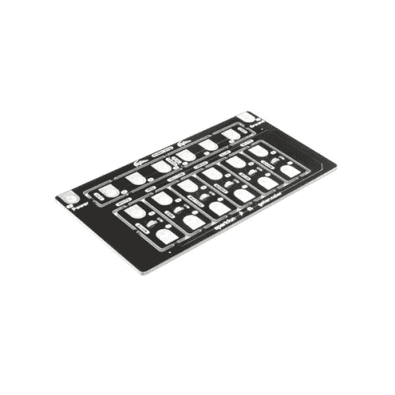
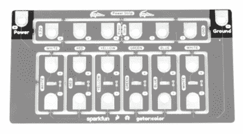
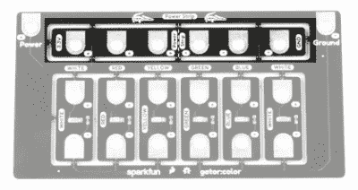
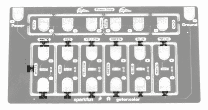
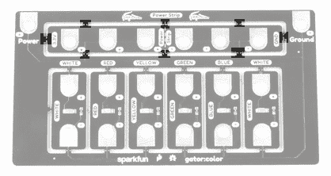
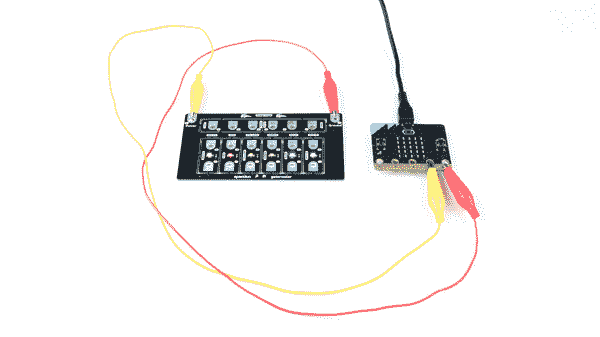
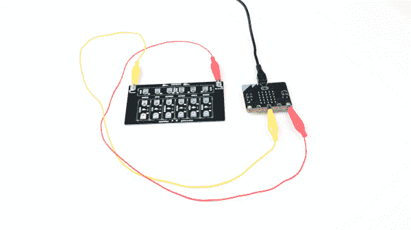

# Gator:彩色 ProtoSnap 连接指南

> 原文：<https://learn.sparkfun.com/tutorials/gatorcolor-protosnap-hookup-guide>

## 介绍

[gator:color](https://www.sparkfun.com/products/14890) 是一系列被称为 gator:boards 的 gator-clipbable 板之一，SparkFun 创建了这些板来与 [micro:bit](https://www.sparkfun.com/products/14208) 和[gator:bit v2](https://www.sparkfun.com/products/15162)micro:bit 扩展接口。gator:color 有少量不同颜色的发光二极管，可以就地使用，也可以从主板上拆下来使用。在这个连接指南中，我们将介绍如何点亮 led，既可以简单地打开它们，也可以使用一种叫做[脉宽调制(PWM)](https://learn.sparkfun.com/tutorials/pulse-width-modulation) 的过程来调暗它们。

 

将**添加到您的[购物车](https://www.sparkfun.com/cart)中！**

 **### [SparkFun gator:color ProtoSnap](https://www.sparkfun.com/products/14890)

[In stock](https://learn.sparkfun.com/static/bubbles/ "in stock") COM-14890

如果您想在项目中添加一个低调的发光组件，gator:color ProtoSnap 是完美的选择。

$11.50[Favorited Favorite](# "Add to favorites") 5[Wish List](# "Add to wish list")** **[https://www.youtube.com/embed/dIEo5w5AkrE/?autohide=1&border=0&wmode=opaque&enablejsapi=1](https://www.youtube.com/embed/dIEo5w5AkrE/?autohide=1&border=0&wmode=opaque&enablejsapi=1)

### 所需材料

对于这个活动，你当然需要一个微型钻头。你还需要一些鳄鱼夹将所有东西连接在一起，一根微型 usb 电缆来编程你的 micro:bit。下面列出了所有这些东西，所以如果你还没有的话，就抓住它们吧。您也可以使用 gator:bit v2 来创建一些更健壮的项目，但是您只需要一个 micro:bit 就可以了。

 

将**添加到您的[购物车](https://www.sparkfun.com/cart)中！**

 **### [【鳄鱼测试引线】多色(10 支装)](https://www.sparkfun.com/products/12978)

[In stock](https://learn.sparkfun.com/static/bubbles/ "in stock") PRT-12978

鳄鱼夹(或者鳄鱼夹，如果你喜欢的话)可能是你工作台上除了工作之外最有用的东西…

$3.504[Favorited Favorite](# "Add to favorites") 51[Wish List](# "Add to wish list")**** 

将**添加到您的[购物车](https://www.sparkfun.com/cart)中！**

 **### [【USB Micro-B 线缆-6】](https://www.sparkfun.com/products/13244)

[In stock](https://learn.sparkfun.com/static/bubbles/ "in stock") CAB-13244

这是一根 USB 2.0 型转 Micro-B 型 5 针黑色电缆。你知道，通常配在手机上的迷你 B 连接器，可以…

$2.103[Favorited Favorite](# "Add to favorites") 7[Wish List](# "Add to wish list")**** 

将**添加到您的[购物车](https://www.sparkfun.com/cart)中！**

 **### [spark fun gator:bit v 2.0-micro:bit 载板](https://www.sparkfun.com/products/15162)

[In stock](https://learn.sparkfun.com/static/bubbles/ "in stock") DEV-15162

SparkFun 鳄鱼:位是一个多合一的载体板为您的微型:位，为您提供一个功能齐全的开发…

$21.502[Favorited Favorite](# "Add to favorites") 10[Wish List](# "Add to wish list")**** 

### [微:位板](https://www.sparkfun.com/products/retired/14208)

[Retired](https://learn.sparkfun.com/static/bubbles/ "Retired") DEV-14208

BBC micro:bit 是一款口袋大小的电脑，可以让你利用数字技术进行创作。

10 **Retired**[Favorited Favorite](# "Add to favorites") 45[Wish List](# "Add to wish list")****** ******### 推荐阅读

如果这是你第一次使用 gator:bit，请查看 [SparkFun gator:bit v2 连接指南](https://learn.sparkfun.com/tutorials/sparkfun-gatorbit-v2-hookup-guide)。

 [### SparkFun gator:bit v2 连接指南

#### 2019 年 1 月 31 日](https://learn.sparkfun.com/tutorials/sparkfun-gatorbit-v2-hookup-guide) The gator:bit v2 is a breakout board for the BBC micro:bit. The gator:bit exposes almost every pin on the micro:bit to clippable pad with circuit protection. It also has as built-in addressable LEDs and a built-in buzzer.[Favorited Favorite](# "Add to favorites") 1

此外，如果您刚开始接触电子产品，并且不熟悉以下概念，我们建议您在继续之前查看这些教程。

 [### 什么是电路？](https://learn.sparkfun.com/tutorials/what-is-a-circuit) Every electrical project starts with a circuit. Don't know what a circuit is? We're here to help.[Favorited Favorite](# "Add to favorites") 82 [### 电压、电流、电阻和欧姆定律](https://learn.sparkfun.com/tutorials/voltage-current-resistance-and-ohms-law) Learn about Ohm's Law, one of the most fundamental equations in all electrical engineering.[Favorited Favorite](# "Add to favorites") 132 [### 什么是电？](https://learn.sparkfun.com/tutorials/what-is-electricity) We can see electricity in action on our computers, lighting our houses, as lightning strikes in thunderstorms, but what is it? This is not an easy question, but this tutorial will shed some light on it 83 [### 发光二极管](https://learn.sparkfun.com/tutorials/light-emitting-diodes-leds) Learn the basics about LEDs as well as some more advanced topics to help you calculate requirements for projects containing many LEDs.[Favorited Favorite](# "Add to favorites") 67 [### 模拟与数字](https://learn.sparkfun.com/tutorials/analog-vs-digital) This tutorial covers the concept of analog and digital signals, as they relate to electronics.[Favorited Favorite](# "Add to favorites") 66 [### micro:bit 入门](https://learn.sparkfun.com/tutorials/getting-started-with-the-microbit) The BBC micro:bit is a compact, powerful programming tool that requires no software installation. Read on to learn how to use it YOUR way 14

## 硬件概述

如果你想给你的项目添加一个低调的发光组件，gator:color 是完美的选择。gator:color 包含 6 个单色 led，这意味着每个灯只发出一种颜色。板上有两个白色 led，以及红色、绿色、蓝色和黄色 led 各一个。电路板边缘有电源接头，这样就不必拆开电路板来点亮 led。

### 为 led 供电

led 可以通过两种方式供电。第一种方法是简单地打开 LED，通过将 LED 的`-`侧箝位到 micro:bit 上的地，并将`+`连接到 micro:bit 上的 3V。控制这些 led 的另一种方法是将 gator:color 的`Power`连接到 micro:bit 上的引脚`0`、`1`或`2`(其中`Ground`连接到`Ground`)。这种方法让您可以更好地控制 led，允许您使用 micro:bit 打开和关闭 led，以及使用[脉宽调制(PWM)](https://learn.sparkfun.com/tutorials/pulse-width-modulation) 改变亮度水平。

*Power Tabs*

如果您选择将 gator:color led 整合到一个项目中，您还可以在电路板顶部使用一个分线电源板。

*Power Strip*

### 拆开你的冲浪板

每个发光二极管都可以从电路板上拆下来单独点亮。为此，从一侧到另一侧轻轻转动 LED 板，直到它弹出。下图中突出显示了连接点。

*Break points for gator:color LED tabs*

电源板的断开方式与 LED 板类似。断点在下面突出显示。

*Break points for gator:color power strip*

## 硬件装配

让我们从简单地打开 led 开始。使用鳄鱼夹，将 LED 的`-`侧连接到 micro:bit 上的地，并将`+`连接到 micro:bit 上的 3.3V。你应该看到所有的鳄鱼:颜色的发光二极管亮起。这种类型的设置显示在下面的照片。

*Click on the image for a closer look*

如果您想调暗 LED 或用 micro:bit 控制它，您可以将 LED 上的`+`连接到`0`、`1`或`2`引脚中的任何一个。led 要么打开要么关闭，中间没有亮度，所以我们通过快速打开和关闭灯来控制亮度，这个过程被称为 [PWM](https://learn.sparkfun.com/tutorials/pulse-width-modulation) 。如下图所示连接您的引脚，我们将在下一节讨论调暗 led 所需的代码。

*Click on the image for a closer look*⚡**Using with the gator:bit** If you are using the [gator:bit v1](https://www.sparkfun.com/products/14484) (with the power switches and JST connector), keep in mind that you'll have to use pins P15, P14 or P13 to drive your LEDs, as the protection circuitry on the rest of the gator:bit pins does not create a high enough voltage to drive some colors of LED.

## 使用生成代码

正如你所看到的，让你的发光二极管点亮是非常简单的；把电源接电源，地接地就行了。然而，如果你想做一些花哨的调光或闪烁效果，你需要上传一些代码到你的 micro:bit。

如果你以前从未使用过 MakeCode，请参考我们的[微:Bit](https://learn.sparkfun.com/tutorials/getting-started-with-the-microbit#using-makecode) 入门的*使用 MakeCode* 部分。

 [### micro:bit 入门

#### 2021 年 9 月 2 日](https://learn.sparkfun.com/tutorials/getting-started-with-the-microbit) The BBC micro:bit is a compact, powerful programming tool that requires no software installation. Read on to learn how to use it YOUR way 14

使用[脉冲宽度调制](https://learn.sparkfun.com/tutorials/pulse-width-modulation)来调光 led。要在 MakeCode 中使用 PWM，进入`Advanced`->-`Pins`并选择**模拟写入**模块，如下所示。

*Analog Write Block*

模拟写入模块的默认值为 1023，即 100%。如果你想把亮度调低到 50%,你可以在模拟写函数中插入一个值 511。当然，您还需要确保在 MakeCode 模块中选择的引脚是夹在 led 上的`+`引脚上的引脚。这可以用任何发光二极管来完成，以创建具有不同亮度或甚至闪烁发光二极管的图案。

### 示例:LED 脉冲

以下示例将逐渐将 led 调至最大亮度，然后再逐渐调低。这将减弱 LED 的开和关。为此，我们将值`LightValue`(在我们的`on start`函数中初始化为 0)写入我们的模拟引脚**P0**(LED 的 3.3V 应连接到此引脚)。然后我们将`lightStep`(我们在`on start`函数中将其设置为 5)添加到`LightValue`中，这将微小地改变亮度。一旦`LightValue`达到最大值(1023)，我们将`lightStep`乘以 **-1** ，将`lightStep`的值改为 **-5** 。这意味着当我们把`lightStep`加到`LightValue`上的时候，`LightValue`会减少。当`LightValue`达到 0 时，我们做同样的事情(乘以 **-1** )再次翻转方向。最后，我们从`Advanced` - > `Control`中添加一个我们选择的延迟来稍微减缓我们的淡入淡出。整个程序如下所示。

[https://makecode.microbit.org/#pub:_AypUcFfPs0H2](https://makecode.microbit.org/#pub:_AypUcFfPs0H2)

*Pulsing LED Code*

## 资源&更进一步

现在你已经掌握了鳄鱼的窍门:颜色，你会点亮什么？看看下面的一些资源，获取更多信息和灵感！

*   [鳄鱼:颜色](https://www.sparkfun.com/products/14890)
    *   [示意图(PDF)](https://cdn.sparkfun.com/assets/5/f/e/7/4/SparkFun_gatorcolor_ProtoSnap.pdf)
    *   [老鹰档案](https://cdn.sparkfun.com/assets/d/f/9/1/c/SparkFun_gatorcolor_ProtoSnap.zip)
    *   [MakeCode](https://makecode.microbit.org/)
    *   [GitHub](https://github.com/sparkfun/gator_color)
        
*   [鳄鱼:v2 位](https://www.sparkfun.com/products/15162)
    *   [gator:bit v2 连接导轨](https://learn.sparkfun.com/tutorials/sparkfun-gatorbit-v2-hookup-guide)
        
*   [microbit.org](http://microbit.org/)
    *   [关于 micro:bit](http://microbit.org/about/) -关于 micro:bit 基金会的信息。
    *   [入门](http://microbit.org/start/)-micro:bit 入门。
    *   [活动](http://microbit.org/ideas/) -来自 micro:bit 网站的创意。
    *   [项目](https://makecode.microbit.org/projects)——你可以用你的 micro:bit 构建的项目。
    *   应用程序(Apps)-micro:bit 应用程序可以让你使用蓝牙无线发送代码到你的 micro:bit。不需要任何线索！
        
*   [SparkFun 微:bit 登陆页面](https://www.sparkfun.com/pages/microbit)
    *   [SparkFun micro:bit 系列](https://www.sparkfun.com/news/2400) -视频教程，开始使用 micro:bit 或使用 MicroPython。

如需更多 SparkFun 教程，请查看以下相关 micro:bit 教程:

 [### 如何在微控制器板上加载 MicroPython](https://learn.sparkfun.com/tutorials/how-to-load-micropython-on-a-microcontroller-board) This tutorial will show you how to load the MicroPython interpreter onto a variety of development boards.[Favorited Favorite](# "Add to favorites") 5 [### 带微比特的无线遥控器](https://learn.sparkfun.com/tutorials/wireless-remote-control-with-microbit) In this tutorial, we will utilize the MakeCode radio blocks to have the one micro:bit transmit a signal to a receiving micro:bit on the same channel. Eventually, we will control a micro:bot wirelessly using parts from the arcade:kit 4 [### SparkFun 鳄鱼:土壤连接指南](https://learn.sparkfun.com/tutorials/sparkfun-gatorsoil-hookup-guide) The gator:soil is analog soil moisture sensor. This tutorial will get you started using the gator:soil with the micro:bit platform.[Favorited Favorite](# "Add to favorites") 2 [### 微型无线远程气象站](https://learn.sparkfun.com/tutorials/wireless-remote-weather-station-with-microbit) Monitor the weather without being exposed to it through wireless communication between two micro:bits using the radio blocks! This is useful if your weather station is installed in a location that is difficult to retrieve data from the OpenLog. We will also explore a few different ways to send and receive data.[Favorited Favorite](# "Add to favorites") 6********