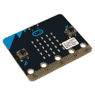
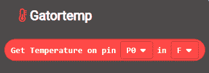

# Gator:starter ProtoSnap 连接指南

> 原文：<https://learn.sparkfun.com/tutorials/gatorstarter-protosnap-hookup-guide>

## 介绍

[gator:starter](https://www.sparkfun.com/products/14891) 是一系列名为 gator:boards 的 gator-clipbable 板之一，SparkFun 创建了这些板来与 [micro:bit](https://www.sparkfun.com/products/14208) 和[gator:bit v2](https://www.sparkfun.com/products/15162)micro:bit 扩展接口。gator:starter 是一个很好的包含温度传感器、RGB LED 和光传感器的包。在本连接指南中，我们将介绍如何连接每个独立的电路板，以及一些将所有电路板连接在一起的示例。

 

将**添加到您的[购物车](https://www.sparkfun.com/cart)中！**

 **### [spark fun gator:starter proto snap](https://www.sparkfun.com/products/14891)

[In stock](https://learn.sparkfun.com/static/bubbles/ "in stock") SEN-14891

gator:starter ProtoSnap 旨在为您提供一个超越 SparkF 功能的起点…

$9.95 $4.95[Favorited Favorite](# "Add to favorites") 4[Wish List](# "Add to wish list")** **[https://www.youtube.com/embed/n8x21T4Mapw/?autohide=1&border=0&wmode=opaque&enablejsapi=1](https://www.youtube.com/embed/n8x21T4Mapw/?autohide=1&border=0&wmode=opaque&enablejsapi=1)

### 所需材料

在这个活动中，你当然会得到一个微比特。你还需要一些鳄鱼夹把所有的东西连接在一起，还有一根 micro-B USB 线给你的 micro:bit 编程。下面列出了所有这些东西，所以如果你还没有的话，就抓住它们吧。如果你想给你的 micro:bit 增加更多的输入和输出，推荐使用 [gator:bit v2](https://www.sparkfun.com/products/15162) ,但是你只需要一个 micro:bit 就可以了。

 

将**添加到您的[购物车](https://www.sparkfun.com/cart)中！**

 **### [【鳄鱼测试引线】多色(10 支装)](https://www.sparkfun.com/products/12978)

[In stock](https://learn.sparkfun.com/static/bubbles/ "in stock") PRT-12978

鳄鱼夹(或者鳄鱼夹，如果你喜欢的话)可能是你工作台上除了工作之外最有用的东西…

$3.504[Favorited Favorite](# "Add to favorites") 51[Wish List](# "Add to wish list")**** 

将**添加到您的[购物车](https://www.sparkfun.com/cart)中！**

 **### [【USB Micro-B 线缆-6】](https://www.sparkfun.com/products/13244)

[In stock](https://learn.sparkfun.com/static/bubbles/ "in stock") CAB-13244

这是一根 USB 2.0 型转 Micro-B 型 5 针黑色电缆。你知道，通常配在手机上的迷你 B 连接器，可以…

$2.103[Favorited Favorite](# "Add to favorites") 7[Wish List](# "Add to wish list")**** 

将**添加到您的[购物车](https://www.sparkfun.com/cart)中！**

 **### [spark fun gator:bit v 2.0-micro:bit 载板](https://www.sparkfun.com/products/15162)

[In stock](https://learn.sparkfun.com/static/bubbles/ "in stock") DEV-15162

SparkFun 鳄鱼:位是一个多合一的载体板为您的微型:位，为您提供一个功能齐全的开发…

$21.502[Favorited Favorite](# "Add to favorites") 10[Wish List](# "Add to wish list")**** 

### [微:位板](https://www.sparkfun.com/products/retired/14208)

[Retired](https://learn.sparkfun.com/static/bubbles/ "Retired") DEV-14208

BBC micro:bit 是一款口袋大小的电脑，可以让你利用数字技术进行创作。

10 **Retired**[Favorited Favorite](# "Add to favorites") 45[Wish List](# "Add to wish list")****** ******### 推荐阅读

如果您决定使用 gator:bit v2，并且这是您第一次使用该板，请查看 [gator:bit v2 连接指南](https://learn.sparkfun.com/tutorials/sparkfun-gatorbit-v2-hookup-guide)。

 [### SparkFun gator:bit v2 连接指南

#### 2019 年 1 月 31 日](https://learn.sparkfun.com/tutorials/sparkfun-gatorbit-v2-hookup-guide) The gator:bit v2 is a breakout board for the BBC micro:bit. The gator:bit exposes almost every pin on the micro:bit to clippable pad with circuit protection. It also has as built-in addressable LEDs and a built-in buzzer.[Favorited Favorite](# "Add to favorites") 1

此外，如果您刚开始接触电子产品，并且不熟悉以下概念，我们建议您在继续之前查看这些教程。

 [### 什么是电路？](https://learn.sparkfun.com/tutorials/what-is-a-circuit) Every electrical project starts with a circuit. Don't know what a circuit is? We're here to help.[Favorited Favorite](# "Add to favorites") 82 [### 电压、电流、电阻和欧姆定律](https://learn.sparkfun.com/tutorials/voltage-current-resistance-and-ohms-law) Learn about Ohm's Law, one of the most fundamental equations in all electrical engineering.[Favorited Favorite](# "Add to favorites") 132 [### 什么是电？](https://learn.sparkfun.com/tutorials/what-is-electricity) We can see electricity in action on our computers, lighting our houses, as lightning strikes in thunderstorms, but what is it? This is not an easy question, but this tutorial will shed some light on it 83 [### 发光二极管](https://learn.sparkfun.com/tutorials/light-emitting-diodes-leds) Learn the basics about LEDs as well as some more advanced topics to help you calculate requirements for projects containing many LEDs.[Favorited Favorite](# "Add to favorites") 67 [### 模拟与数字](https://learn.sparkfun.com/tutorials/analog-vs-digital) This tutorial covers the concept of analog and digital signals, as they relate to electronics.[Favorited Favorite](# "Add to favorites") 66 [### micro:bit 入门](https://learn.sparkfun.com/tutorials/getting-started-with-the-microbit) The BBC micro:bit is a compact, powerful programming tool that requires no software installation. Read on to learn how to use it YOUR way 14

## 硬件概述

gator:starter 包含 3 块板，只需反复来回扭转，即可从主组件中取出。可用的电路板有:

*   温度传感器(MCP9700)
*   共阴极 RGB LED
*   光传感器(TEMT6000)

### 温度

温度传感器(MCP9700)是一种模拟传感器。只需以 3.3V 和 GND 为传感器供电。要进行读取，需要将 TEMP 引脚连接到 micro:bit 的模拟输入端。

### 共阴极 RGB LED

中央组件是一个公共阴极 RGB LED。每个单独的 LED 都连接到 GND 引脚。每种颜色都需要一个 I/O 引脚来点亮。

### 光敏感元件

光传感器也是模拟传感器。只需通过 3.3V 和 GND 引脚向传感器供电。为了阅读，你可以将 LIGHT 引脚连接到 micro:bit 的模拟输入端。

### 电源标签

我们断开了电源(3.3V 和 GND)，因此它可以夹在板的边缘供电，而不会将每个板从主板上断开。下图显示了这些电源引脚的轮廓。

*Power Tabs*

如果您选择将 gator:starter 分解为基本组件，每个板上还提供了电源选项卡。尽量不要反向连接电源！然而，如果你不把电路板拆开，你仍然能够与所有的传感器和灯引脚连接。

## 硬件装配

将 gator:starter 连接到 gator:bit v2 是一个相对简单的过程，甚至不涉及任何焊接，您所要做的就是夹住标签进行连接。让我们从启动 gator:starter 开始。

### 力量

连接电源时，您应该习惯做一些练习。第一条是始终首先接地(GND)。第二，你要确保你没有用错误的电压给你的器件供电，因为用 5V 电压给 3.3V 器件供电可能会损坏器件。记住这些事情，继续夹你的鳄鱼的地面:板到鳄鱼的地面:位。完成后，继续对 3.3V 进行同样的操作。现在电源已连接，我们可以开始连接传感器了。

*Connected Power*

### 信号

#### 温度传感器

板载温度传感器是一个 MCP9700 模拟温度传感器，温度范围为-40°C 至 125°C。该传感器输出一个[模拟信号](https://learn.sparkfun.com/tutorials/analog-vs-digital)，因此您需要将其连接到 gator:bit 上的一个引脚，该引脚能够读取模拟信号。模拟使能引脚是引脚 **0** 、 **1** 和 **2** 。继续将 **TEMP** 引脚夹到这三个引脚中的任何一个。

#### RGB LED

RGB LED 是三个[LED](https://learn.sparkfun.com/tutorials/light-emitting-diodes-leds)(红色、绿色和蓝色)全部组合到一个封装中。这是一个[共阴极 LED](https://learn.sparkfun.com/tutorials/light-emitting-diodes-leds#types-of-leds) ，这意味着所有三个 LED 共享同一个接地引脚。要激活任何颜色，只需确保接地，然后将 3.3V 连接到您想要打开的颜色。通过连接多种颜色，可以简单地添加和混合颜色。如果你想创造更多的颜色，你可以将 LED 连接到任何引脚 **0** 、 **1** 和 **2** 上，以实现调光和全色彩控制等功能。

⚡ **Using with the gator:bit:** If you are using the [gator:bit v1](https://www.sparkfun.com/products/14484) (with the power switches and JST connector), keep in mind that you'll have to use pins P15, P14 or P13 to drive your LEDs, as the protection circuitry on the rest of the gator:bit v1 pins does not create a high enough voltage to drive some colors of LED.

#### 光敏感元件

板载光传感器是 TEMT6000 环境光传感器。该传感器也是一个模拟传感器，所以我们再次只能使用引脚 **0** 、 **1** 和 **2** 来使用它。要连接该传感器，只需将**灯**标签夹到三个模拟引脚中的任何一个。

## 使用生成代码

因此，您已经连接了您的传感器，并引导到 gator:bit v2，但我们如何从这些传感器中获得有用的信息呢？幸运的是，SparkFun 编写了一些 MakeCode 扩展，允许 gator:bit 理解来自 MCP9700 温度传感器和 TEMT6000 光传感器的值。

**Heads up!** Previously, these libraries were referred to as MakeCode packages. They are now referred to as MakeCode extensions.

### 为 microsoft make 代码安装 gatortemp 扩展

要下载光传感器的 MakeCode 扩展，请进入**高级**->-**添加扩展**。

*Adding an Extension*

然后搜索`sparkfun`或者`gator-temp`。

点击 **gator-temp** 会将它添加到您在**高级**中的可用扩展列表中。继续打开扩展，您将看到一个块，它允许您获取 gator:temp 所连接的引脚上的温度。

*gator:temp Block*

### RGB LED

有了三原色，我们就能混合颜色，创造出我们喜欢的任何颜色。LED 要么打开要么关闭，中间没有亮度，因此我们通过快速打开和关闭灯来控制亮度，这一过程被称为[脉宽调制(PWM)](https://learn.sparkfun.com/tutorials/pulse-width-modulation) 。公共阴极 LED 不需要任何额外的 MakeCode 扩展。要使用 PWM，进入`Advanced`->-`Pins`并选择**模拟写入**模块，如下所示。

Analog Write Block

你需要三个这样的模块，一个控制 LED 的每种颜色。确保在块中选择的管脚连接到正确的颜色(`P0` =红色，`P1` =绿色，`P2` =蓝色)。模拟写入块默认为值`1023`，即 100%。如果你想把亮度调低到 50%,你可以在模拟写函数中插入一个值 511。这允许创造任何颜色。例如，通过将 100% (1023)写为红色，将 10% (102)写为绿色，可以创建橙色。

### 为 Microsoft MakeCode 安装 Gatorlight 扩展

要下载光传感器的 MakeCode 扩展，请进入**高级**->-**添加扩展**。

*Adding an Extension*

然后搜索`sparkfun`或者`gator-light`。点击 **gator-light** 会将它添加到你在**高级**中的可用扩展列表中。

继续并打开扩展，看看我们现在能够使用的变量块。您可以使用两个下拉菜单来更改光传感器连接到哪个引脚以及测量单位。

*Get Light Block*

光传感器根据照度或勒克斯来测量光线。如果你不熟悉照度，它基本上只是到达某一点的光量的量度。单位可以是来自[模数转换器(ADC](https://learn.sparkfun.com/tutorials/analog-to-digital-conversion) )的原始值，也可以是勒克斯单位。查看下面的图表，了解在一些常见的照明情况下，这个勒克斯值对应的是什么。

*Table of Lux Values Courtesy of [Wikipedia: Lux](https://en.wikipedia.org/wiki/Lux)*

该块可用于修改 MakeCode 中的变量值。

## 例子

### 简易温度计

#### 硬件连接

在这个例子中，我们将使用 Makecode 和 gator:temp 创建一个简单的温度计。目标是从传感器读取温度，然后让 micro:bit 将数字显示为滚动文本。首先，通过夹住 micro:bit 为 gator:temp 供电，然后将`temp`引脚连接到 micro:bit 上的`0`引脚(也可以连接到引脚`1`或`2`)这将允许 micro:bit 读取引脚`0`上的模拟值。

#### 制造商代码

现在我们需要使用 Makecode 对我们的 micro:bit 进行编程，来做我们想要做的事情。在这个例子中，我们只需要显示一次温度值，所以我们不需要创建一个变量来存储这个值。事实上，我们需要做的就是使用`Basic`下的`Show Number`块。我们需要做的是用 gator:temp MakeCode 扩展中的`Get Temperature`块替换`Show Number`块中的`0`。这将使 micro:bit 从引脚`0`读取温度，并在 LED 屏幕上显示温度。在 MakeCode 编辑器中重新创建以下代码，或者通过单击下载按钮下载示例来测试它！

[https://makecode.microbit.org/#pub:_a88RuV6xJ3rh](https://makecode.microbit.org/#pub:_a88RuV6xJ3rh)

将上面的代码上传到你的 micro:bit 会产生类似下面的 gif。

*Temperature Display***Troubleshooting Tip**: If you see a temperature output with a random 5-digit number (i.e. "65525", "65533", "65527", etc.) on the LEDs, the issue might be due to a loose (or possibly shorted) connection between the 3.3V pin and the gator:temperature sensor's voltage input pin. The analog pin will probably start reading random values or there is a slight current draw to the temperature sensor from the micro:bit. Make sure that you check your connections by ensuring that there are no loose connections or pins touching where they should not. When using alligator clips, make sure that the connection is secure as well and that there are no shorts (try sliding the sheath around the alligator clips for more insulation).

### 灯光指示器

#### 硬件连接

在这个例子中，我们将介绍如何结合使用 gator:light 和 gator:RGB 来创建一个简单的灯光指示器。我们在这个例子中的目标是创建一个灯光指示器，在黑暗的时候显示蓝色，在明亮的时候显示红色，在两者之间显示紫色。首先，在上传代码之前，让我们将所有的组件连接起来。首先给 gator:temp 通电，并将`light`引脚连接到`0`引脚。然后我们将 gator:RGB 接地，并将红色和蓝色分别连接到引脚`1`和`2`。这将允许 gator:bit 控制 gator:RGB 上的红色和蓝色。

#### 制造商代码

现在让我们转到 Makecode 部分，它将告诉我们的 micro:bit 如何工作。首先，我们需要创建一个变量来存储来自**变量**类别的光线值。为了简单起见，我们姑且称之为`lightValue`。然后，让我们将`lightValue`变量设置为从引脚`0`上的光传感器读取的值。使用`Gatorlight`中的挡块读取销`P0`。由于我们要将这个值直接写入 LED，我们可以从第二个下拉菜单中选择`adcVal`的单位。作为一个 [ADC(模数转换)](https://learn.sparkfun.com/tutorials/analog-to-digital-conversion)值具有与我们可以写入 LED 的值相同的可能值范围(范围都是从 0 到 1023)。在 MakeCode 编辑器中重新创建以下代码，或者通过单击下载按钮下载示例来测试它！

[https://makecode.microbit.org/#pub:_YTaMMETL8aey](https://makecode.microbit.org/#pub:_YTaMMETL8aey)

如果外面很亮，这个值会更接近于`1023`。因此，您最终将向引脚 2 上的 LED 写入一个接近 100%亮度的值(蓝色，如果您连接正确的话)，并在引脚 1 上写入一个更接近`0`的值(红色)。将光传感器移动到黑暗中应该会给你更多的红色，而明亮的光应该会产生蓝色。实验一下，看看手电筒之类的东西是如何影响传感器的。

*Light Indicator***Tip:** Looking for more examples using the common cathode RGB LED? Try editing the example used in the [micro:bit breakout board to cyle through the colors with the common cathode RGB LED.](https://learn.sparkfun.com/tutorials/microbit-breakout-board-hookup-guide#example-cycling-colors-on-an-rgb-led) In this case, you'll be connecting to pin 0, 1, and 2 to control the colors. Or try creating [tertiary colors](https://en.wikipedia.org/wiki/Tertiary_color) by combining one color at 100% with another at 50%. The LED will be very bright so try covering it with a translucent material to diffuse the light or turning the intensity down.

## 资源&更进一步

现在您已经成功地启动并运行了 gator:starter，是时候将它合并到您自己的项目中了！如欲了解有关该主板的更多信息，请查看以下资源:

*   [示意图(PDF)](https://cdn.sparkfun.com/assets/4/6/1/1/c/SparkFun_gatorstarter_ProtoSnap.pdf)
*   [老鹰文件(ZIP)](https://cdn.sparkfun.com/assets/4/8/e/2/5/SparkFun_gatorstarter_ProtoSnap.zip)
*   [关于微:位页面](https://www.sparkfun.com/pages/microbit)
*   [微:位编程器](http://microbit.org/code/)
*   [GitHub 产品回购](https://github.com/sparkfun/gator_starter)
*   [SFE 产品展示区](https://www.youtube.com/watch?v=n8x21T4Mapw)

你的下一个项目需要一些灵感吗？查看一些相关教程:

 [### 微:bot Kit 实验指南](https://learn.sparkfun.com/tutorials/microbot-kit-experiment-guide) Get started with the moto:bit, a carrier board for the micro:bit that allows you to control motors, and create your own robot using this experiment guide for the micro:bot kit.[Favorited Favorite](# "Add to favorites") 5 [### 带微比特的无线遥控器](https://learn.sparkfun.com/tutorials/wireless-remote-control-with-microbit) In this tutorial, we will utilize the MakeCode radio blocks to have the one micro:bit transmit a signal to a receiving micro:bit on the same channel. Eventually, we will control a micro:bot wirelessly using parts from the arcade:kit 4 [### 如何为 Micro:Bit 创建 MakeCode 包](https://learn.sparkfun.com/tutorials/how-to-create-a-makecode-package-for-microbit) Learn how to develop code blocks for the Micro:bit in Microsoft MakeCode 2 [### 火花短吻鳄:日志连接指南](https://learn.sparkfun.com/tutorials/sparkfun-gatorlog-hookup-guide) The gator:log is a serial communication based data logger. This tutorial will get you started using the gator:log with the micro:bit platform.[Favorited Favorite](# "Add to favorites") 1********