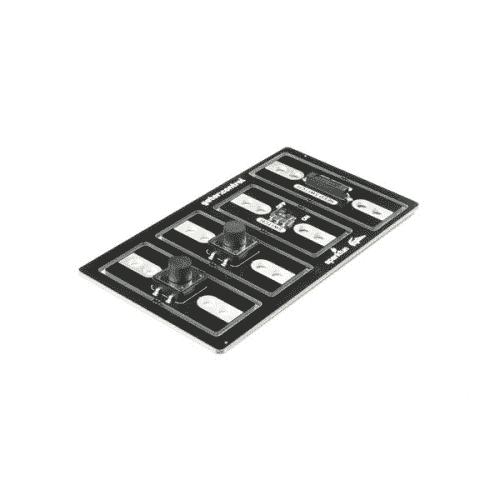
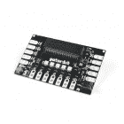
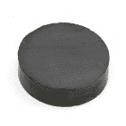
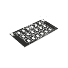
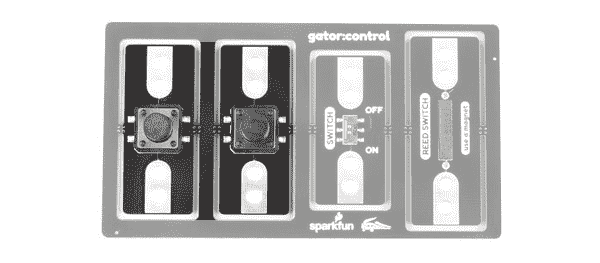
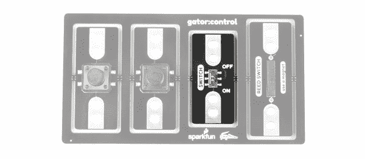
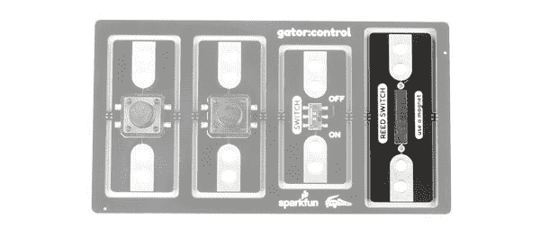
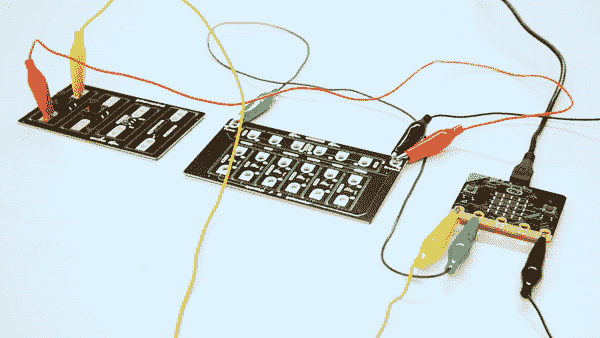

# Gator:控制 ProtoSnap 连接指南

> 原文：<https://learn.sparkfun.com/tutorials/gatorcontrol-protosnap-hookup-guide>

## 介绍

[gator:control](https://www.sparkfun.com/products/14968) 是一系列被称为 gator:boards 的 gator-clipbable 板之一，SparkFun 创建了这些板来与 [micro:bit](https://www.sparkfun.com/products/14208) 和[gator:bit v2](https://www.sparkfun.com/products/15162)micro:bit 扩展接口。gator:control 包含两个按钮，一个开/关滑动开关和一个由磁铁激活的簧片开关。在本连接指南中，我们将介绍如何连接每个独立的电路板，以及一些将所有电路板连接在一起的示例。

 

将**添加到您的[购物车](https://www.sparkfun.com/cart)中！**

### [火花鳄鱼:控制原快照](https://www.sparkfun.com/products/14968)

[In stock](https://learn.sparkfun.com/static/bubbles/ "in stock") COM-14968

gator:control ProtoSnap 为您提供了几种不同的方式来与您仅使用 gat 创建的项目进行交互…

$11.50 $4.03[Favorited Favorite](# "Add to favorites") 6[Wish List](# "Add to wish list")** **[https://www.youtube.com/embed/SGKvX5l-VXE/?autohide=1&border=0&wmode=opaque&enablejsapi=1](https://www.youtube.com/embed/SGKvX5l-VXE/?autohide=1&border=0&wmode=opaque&enablejsapi=1)

### 所需材料

对于这个活动，你当然需要一个微型钻头。你还需要一些鳄鱼夹把所有的东西连接在一起，还有一根 micro-b USB 线给你的 micro:bit 编程。磁铁也是一个很好的组合，因为这是激活簧片开关的唯一方法。下面列出了所有这些东西，所以如果你还没有的话，就抓住它们吧。您也可以使用 gator:bit v2 来创建一些更健壮的项目，但是您只需要一个 micro:bit 就可以了。

 

将**添加到您的[购物车](https://www.sparkfun.com/cart)中！**

### [【鳄鱼测试引线】多色(10 支装)](https://www.sparkfun.com/products/12978)

[In stock](https://learn.sparkfun.com/static/bubbles/ "in stock") PRT-12978

鳄鱼夹(或者鳄鱼夹，如果你喜欢的话)可能是你工作台上除了工作之外最有用的东西…

$3.504[Favorited Favorite](# "Add to favorites") 51[Wish List](# "Add to wish list")**** 

将**添加到您的[购物车](https://www.sparkfun.com/cart)中！**

### [【USB Micro-B 线缆-6】](https://www.sparkfun.com/products/13244)

[In stock](https://learn.sparkfun.com/static/bubbles/ "in stock") CAB-13244

这是一根 USB 2.0 型转 Micro-B 型 5 针黑色电缆。你知道，通常配在手机上的迷你 B 连接器，可以…

$2.103[Favorited Favorite](# "Add to favorites") 7[Wish List](# "Add to wish list")**** 

将**添加到您的[购物车](https://www.sparkfun.com/cart)中！**

### [spark fun gator:bit v 2.0-micro:bit 载板](https://www.sparkfun.com/products/15162)

[In stock](https://learn.sparkfun.com/static/bubbles/ "in stock") DEV-15162

SparkFun 鳄鱼:位是一个多合一的载体板为您的微型:位，为您提供一个功能齐全的开发…

$21.502[Favorited Favorite](# "Add to favorites") 10[Wish List](# "Add to wish list")**** 

将**添加到您的[购物车](https://www.sparkfun.com/cart)中！**

### [【0.709】](https://www.sparkfun.com/products/8890)

[In stock](https://learn.sparkfun.com/static/bubbles/ "in stock") COM-08890

这是你的标准冰箱贴，非常适合承受相当大的重量。C8 级，陶瓷圆盘磁铁。磁化强度…

$1.05[Favorited Favorite](# "Add to favorites") 4[Wish List](# "Add to wish list")**** 

将**添加到您的[购物车](https://www.sparkfun.com/cart)中！**

### [SparkFun gator:color ProtoSnap](https://www.sparkfun.com/products/14890)

[In stock](https://learn.sparkfun.com/static/bubbles/ "in stock") COM-14890

如果您想在项目中添加一个低调的发光组件，gator:color ProtoSnap 是完美的选择。

$11.50[Favorited Favorite](# "Add to favorites") 5[Wish List](# "Add to wish list")**** 

### [微:位板](https://www.sparkfun.com/products/retired/14208)

[Retired](https://learn.sparkfun.com/static/bubbles/ "Retired") DEV-14208

BBC micro:bit 是一款口袋大小的电脑，可以让你利用数字技术进行创作。

10 **Retired**[Favorited Favorite](# "Add to favorites") 45[Wish List](# "Add to wish list")********** **********### 推荐阅读

如果您决定使用 gator:bit，并且是第一次使用该板，请查看 [gator:bit v2 连接指南](https://learn.sparkfun.com/tutorials/sparkfun-gatorbit-v2-hookup-guide)。

 [### SparkFun gator:bit v2 连接指南

#### 2019 年 1 月 31 日](https://learn.sparkfun.com/tutorials/sparkfun-gatorbit-v2-hookup-guide) The gator:bit v2 is a breakout board for the BBC micro:bit. The gator:bit exposes almost every pin on the micro:bit to clippable pad with circuit protection. It also has as built-in addressable LEDs and a built-in buzzer.[Favorited Favorite](# "Add to favorites") 1

此外，如果您刚开始接触电子产品，并且不熟悉以下概念，我们建议您在继续之前查看这些教程。

 [### 什么是电路？](https://learn.sparkfun.com/tutorials/what-is-a-circuit) Every electrical project starts with a circuit. Don't know what a circuit is? We're here to help.[Favorited Favorite](# "Add to favorites") 82 [### 电压、电流、电阻和欧姆定律](https://learn.sparkfun.com/tutorials/voltage-current-resistance-and-ohms-law) Learn about Ohm's Law, one of the most fundamental equations in all electrical engineering.[Favorited Favorite](# "Add to favorites") 132 [### 什么是电？](https://learn.sparkfun.com/tutorials/what-is-electricity) We can see electricity in action on our computers, lighting our houses, as lightning strikes in thunderstorms, but what is it? This is not an easy question, but this tutorial will shed some light on it 83 [### 发光二极管](https://learn.sparkfun.com/tutorials/light-emitting-diodes-leds) Learn the basics about LEDs as well as some more advanced topics to help you calculate requirements for projects containing many LEDs.[Favorited Favorite](# "Add to favorites") 67 [### 模拟与数字](https://learn.sparkfun.com/tutorials/analog-vs-digital) This tutorial covers the concept of analog and digital signals, as they relate to electronics.[Favorited Favorite](# "Add to favorites") 66 [### micro:bit 入门](https://learn.sparkfun.com/tutorials/getting-started-with-the-microbit) The BBC micro:bit is a compact, powerful programming tool that requires no software installation. Read on to learn how to use it YOUR way 14

## 硬件概述

gator:control 在主组件中包含四块板，所有这些板都可以从主板中分离出来单独使用。按钮或开关允许您在回路中创建一个可以闭合(连接)或断开(断开)的点。大多数按钮，包括 gator:control 上的按钮，只有在被按下时才会闭合。gator:控件上的这些按钮在下面突出显示。

*Buttons*

gator 上的第二种控制元件是滑动开关。当开关处于 **ON** 位置时，这将是一个闭合电路，当开关处于 **OFF** 位置时，这将是一个开路电路。滑动开关在下面的 gator:control 上突出显示。

*Slide Switch*

最后一种控制元件是由磁铁控制的[簧片开关](https://en.wikipedia.org/wiki/Reed_switch)。当你把一块磁铁放在离开关足够近的地方时，簧片开关将作为一个闭合电路。下图中突出显示了簧片开关。

*Reed Switch*

## 例子

有两种方法可以在电路中使用这些按钮或开关。一种是作为简单电路的一部分，允许按钮或开关完成和闭合电路，另一种是使用按钮或开关作为数字输入来控制已经完成和闭合的电路。我们将通过打开 LED 来演示这两种使用按钮和开关的方法。对于这个例子，我们推荐使用来自 [gator:color](https://www.sparkfun.com/products/14890) 的 gator:LED，因为你不必担心电阻。

### 简单按钮

在第一个电路中，我们将连接一个按钮，使其成为 LED 电路的一部分。我们将通过按下按钮接通电路。这将闭合电路，使电流流过我们的按钮，为 LED 供电。一旦停止按下按钮，电路就会断开，导致 led 不亮。要设置这个电路，将 micro:bit 上的`3V`引脚连接到按钮的一侧，将按钮的另一侧连接到 gator:LED 的`+`侧，然后将 gator:LED 的`-`侧连接到 micro:bit 上的接地引脚。电路应该如下图所示。通过搭配鳄鱼夹的颜色可以看出它们之间的联系。

*Simple Button Circuit*

如果你已经设置好了，点击这个按钮应该会打开灯。尝试使用滑动开关来控制 led，而不是使用按钮。将开关拨到 ON 位置等同于按下按钮。当我们把开关转到 ON 位置时，我们通过闭合来接通电路。将开关拨到关闭位置将会打开电路，导致 led 不亮。用簧片开关代替按钮，您应该会看到同样的效果。为了接通电路，在簧片开关上方放置一块磁铁来闭合电路。移除磁铁将会打开电路。

### 数字按钮

在第二个电路中，我们将按钮连接到数字输入，LED 电路连接到数字输出。然后，当我们单击该按钮时，micro:bit 将看到一个数字信号，它将触发 LED 电路的引脚。要连接该电路，将按钮或开关的一端连接到`ground`引脚，按钮的另一端连接到`0`引脚。现在将引脚`1`连接到 gator:LED 的`+`端；gator:LED 的`-`端连接到 micro:bit 上的`ground`引脚。你的电路应该看起来像下图。

*Digital Button Circuit*

你可能已经注意到了，我们把按钮的一端连接到`ground`。这意味着当我们按下按钮时，引脚`0`将接地，micro:bit 将读取数字`low`或`0`信号。然而，当这些数字引脚处于静止状态时，它们为低电平，因此我们需要配置 micro:bit，使该引脚处于高电平状态。为了用代码做到这一点，我们使用下面的代码块给引脚`0`添加一个[上拉电阻](https://learn.sparkfun.com/tutorials/pull-up-resistors)，位于**引脚** - > **下更多** - > `set pull pin P0 to up`。

*Set Pull-Up*

该模块将使引脚`0`成为逻辑电平`high`，直到我们按下按钮，将引脚拉低。现在我们需要让 micro:bit 读取按钮 pin 来查看按钮是否被按下，然后使用该信息来决定是否开灯。为此，我们将引脚`P0`的值读入一个名为`button_pin`的变量。从**变量**和**引脚**类别中，将代码块设置为`set button_pin to`T5。

然后我们使用一个`If...Else...`循环来检查`button_pin`的值。如果值是`0`，那么这意味着按钮被按下，所以我们写引脚`P1`高。否则，我们向`P1`写入一个`low`值。在 MakeCode 编辑器中重新创建以下代码，或者通过单击下载按钮下载示例来测试它！

[https://makecode.microbit.org/#pub:_82Uf25TWx0x0](https://makecode.microbit.org/#pub:_82Uf25TWx0x0)

**Note:** You may need to disable your ad/pop-up blocker to interact with the MakeCode programming environment and simulated circuit!

继续点击你的按钮。灯仍然会亮，但与上一个例子不同的是，我们用数字方式完成了这个动作！示例代码也适用于滑动开关和簧片开关。尝试用任一开关替换连接来控制 led。

## 资源&更进一步

现在您已经成功地获得了 gator:control 并开始运行，是时候将它合并到您自己的项目中了！有关 gator:control board 的更多信息，请查看以下资源:

*   [示意图(PDF)](https://cdn.sparkfun.com/assets/0/e/9/8/d/SparkFun_gatorcontrol_ProtoSnap.pdf)
*   [老鹰文件(ZIP)](https://cdn.sparkfun.com/assets/1/e/a/5/e/SparkFun_gatorcontrol_ProtoSnap.zip)
*   [关于微:位页面](https://www.sparkfun.com/pages/microbit)
*   [微:位编程器](http://microbit.org/code/)
*   [GitHub 产品回购](https://github.com/sparkfun/gator_control)
*   [SFE 产品展示区](https://youtu.be/SGKvX5l-VXE)

你的下一个项目需要一些灵感吗？查看一些相关教程:

 [### micro:bit 教育家实验包实验指南](https://learn.sparkfun.com/tutorials/microbit-educator-lab-pack-experiment-guide) A quickstart guide for the micro:bit educator lab pack.[Favorited Favorite](# "Add to favorites") 1 [### micro:气候工具包实验指南](https://learn.sparkfun.com/tutorials/microclimate-kit-experiment-guide) A weather station kit that is built on top of the inexpensive, easy-to-use micro:bit and Microsoft MakeCode.[Favorited Favorite](# "Add to favorites") 11 [### 微:bot Kit 实验指南](https://learn.sparkfun.com/tutorials/microbot-kit-experiment-guide) Get started with the moto:bit, a carrier board for the micro:bit that allows you to control motors, and create your own robot using this experiment guide for the micro:bot kit.[Favorited Favorite](# "Add to favorites") 5 [### 火花短吻鳄:日志连接指南](https://learn.sparkfun.com/tutorials/sparkfun-gatorlog-hookup-guide) The gator:log is a serial communication based data logger. This tutorial will get you started using the gator:log with the micro:bit platform.[Favorited Favorite](# "Add to favorites") 1************