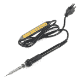
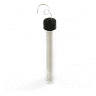
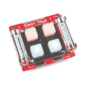
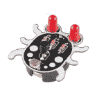
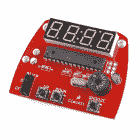

# 手电筒套件

> 原文：<https://learn.sparkfun.com/tutorials/flashlight-kit>

## 介绍

[手电筒焊接套件](https://www.sparkfun.com/products/14877)是一个基本的焊接套件，旨在帮助教授通孔焊接和电路设计的基础知识。本教程将介绍电路的基本知识，如何焊接，并向您展示如何制作自己的手电筒。

 

将**添加到您的[购物车](https://www.sparkfun.com/cart)中！**

 **### [SparkFun 基础手电筒焊接套件](https://www.sparkfun.com/products/14877)

[In stock](https://learn.sparkfun.com/static/bubbles/ "in stock") KIT-14877

这款手电筒焊接套件是一款易于组装的焊接套件，旨在帮助教授通孔焊接的基础知识

$5.508[Favorited Favorite](# "Add to favorites") 23[Wish List](# "Add to wish list")** **[https://www.youtube.com/embed/ABzP8A4rSHA/?autohide=1&border=0&wmode=opaque&enablejsapi=1](https://www.youtube.com/embed/ABzP8A4rSHA/?autohide=1&border=0&wmode=opaque&enablejsapi=1)

### 所需工具

要做到这一点，你需要一些基本的工具，如烙铁、焊料和剪刀。如果你以前从未焊接过，正在寻找一个基本的设置，[初学者工具包](https://www.sparkfun.com/products/14681)是一个很好的起点。

 

将**添加到您的[购物车](https://www.sparkfun.com/cart)中！**

 **### [斜切刀](https://www.sparkfun.com/products/8794)

[In stock](https://learn.sparkfun.com/static/bubbles/ "in stock") TOL-08794

迷你斜切刀。这些是很棒的小刀具！这是夹住引线和额外焊尾的必备工具。4 英寸长。

$2.753[Favorited Favorite](# "Add to favorites") 15[Wish List](# "Add to wish list")**** 

将**添加到您的[购物车](https://www.sparkfun.com/cart)中！**

 **### [SparkFun 初学者工具包](https://www.sparkfun.com/products/14681)

[Out of stock](https://learn.sparkfun.com/static/bubbles/ "out of stock") TOL-14681

这些工具非常适合那些需要一套坚实的工具来启动工作台的人！

$62.50[Favorited Favorite](# "Add to favorites") 14[Wish List](# "Add to wish list")**** 

将**添加到您的[购物车](https://www.sparkfun.com/cart)中！**

 **### [【烙铁- 60W(可调温度)](https://www.sparkfun.com/products/14456)

[In stock](https://learn.sparkfun.com/static/bubbles/ "in stock") TOL-14456

当你不想倾家荡产，但又需要一个可靠的烙铁时，这个可调节温度的烙铁是一个很好的工具…

$16.5016[Favorited Favorite](# "Add to favorites") 43[Wish List](# "Add to wish list")**** 

将**添加到您的[购物车](https://www.sparkfun.com/cart)中！**

 **### [无铅焊料- 15 克管](https://www.sparkfun.com/products/9163)

[In stock](https://learn.sparkfun.com/static/bubbles/ "in stock") TOL-09163

这是你的无铅焊料的基本管，带有不干净的水溶性树脂芯。0.031 英寸规格，15 克

$3.954[Favorited Favorite](# "Add to favorites") 14[Wish List](# "Add to wish list")******** ********### 推荐阅读

这里有一些关于我们将要涉及的一些概念的基础教程。如果您感到困惑或者只是想了解更多，本教程中还有一些链接可以为您提供关于某个主题的更多信息。

 [### 如何焊接:通孔焊接](https://learn.sparkfun.com/tutorials/how-to-solder-through-hole-soldering) This tutorial covers everything you need to know about through-hole soldering.[Favorited Favorite](# "Add to favorites") 70 [### 电阻](https://learn.sparkfun.com/tutorials/resistors) A tutorial on all things resistors. What is a resistor, how do they behave in parallel/series, decoding the resistor color codes, and resistor applications.[Favorited Favorite](# "Add to favorites") 57 [### 发光二极管](https://learn.sparkfun.com/tutorials/light-emitting-diodes-leds) Learn the basics about LEDs as well as some more advanced topics to help you calculate requirements for projects containing many LEDs.[Favorited Favorite](# "Add to favorites") 67 [### 极性](https://learn.sparkfun.com/tutorials/polarity) An introduction to polarity in electronic components. Discover what polarity is, which parts have it, and how to identify it.[Favorited Favorite](# "Add to favorites") 52

## 硬件概述

### 内容

在你的工具箱里，你会找到一些零件。应该有一个 PCB，一个小硬币电池，一个电池座，一个 LED，一个电阻和一个开关。在下一节中，我们将深入了解这些组件的外观和功能。丢了什么零件吗？有时候这些微小的部件可能会放错地方。如果您丢失了任何零件，请联系我们的[客户服务团队](mailto:customerservice@sparkfun.com)，我们会马上为您找到丢失的零件。

开始之前，我们先来看看 PCB 的基本情况。在正面，您可以看到 4 个不同组件的标记和轮廓，以及一些标签。你还可以看到电路板上的轨迹，以及它们如何从一个元件到另一个元件形成一个完整的圆圈。在背面，你可以看到孔周围有一个铜环，这样你就可以焊接它们。您还会看到显示所有 4 个元件的电路原理图(每个元件都有标签)。我们一会儿将讨论每个组件的作用。

|  |  |
| *板的前面* | *电路板背面* |

## 闪光灯电路

### 该电路

那么，我们的电路是做什么的？一个完整的[电路](https://learn.sparkfun.com/tutorials/what-is-a-circuit)是电子可以流动的路径。考虑一下我们的电子来源[电池](https://learn.sparkfun.com/tutorials/what-is-a-battery)。[电流](https://learn.sparkfun.com/tutorials/alternating-current-ac-vs-direct-current-dc)是我们测量这些电子流动的方式。从电池的正极开始，你可以看到它沿着 PCB 左侧一直到电阻的路径。电池基本上是我们的动力室，它储存能量，并以电流(电子移动的速度)和电压(推动电子通过电路的压力)的形式输出[能量](https://learn.sparkfun.com/tutorials/electric-power)。

|  |  |
| *电池座* | *电池示意图* |

### 电阻器

[电阻](https://learn.sparkfun.com/tutorials/resistors)就像一根管子，限制着可以通过的电流量。该电阻可最大限度地减少流向 LED 的电流，因此我们不会给 LED 提供过多的电流而将其损坏。如果你好奇这是如何工作的，你可以看看我们的 [LED 教程](https://learn.sparkfun.com/tutorials/light-emitting-diodes-leds)，看看如何正确地确定电阻的大小。如果你仔细观察你的电阻器，你会注意到一些[色带](https://learn.sparkfun.com/tutorials/resistors/decoding-resistor-markings)。在这个套件中，我们使用 5 波段电阻器(棕色、黑色、黑色、金色、棕色)；这是一个 10 欧姆的电阻，容差为 1%。电阻没有方向性，这意味着它们可以正向配置(棕色、黑色、黑色、金色、棕色)或反向配置(棕色、金色、黑色、黑色、棕色)用于电路中，但仍能正常工作。

|  |  |
| *电阻器* | *电阻器*的示意符号 |

### 剧终

接下来我们有 [LED](https://learn.sparkfun.com/tutorials/light-emitting-diodes-leds) 。LED 代表发光二极管。一个[二极管](https://learn.sparkfun.com/tutorials/diodes)是两块放在一起的半导体，只允许电流单向流动。这是你的 LED 灯被[极化](https://learn.sparkfun.com/tutorials/polarity)的原因之一(意味着你用什么方式连接它很重要)。电流只能从正极(阳极)流向负极(阴极)。在这种情况下，我们使用的是一个发光二极管，它的功能就像它听起来一样。它是一个发光的二极管，对于手电筒来说非常方便。在二极管中使用不同的物质允许不同的颜色；对于我们的手电筒，我们选择了白色 LED。

|  |  |
| *LED* | *LED 的示意符号* |

### 开关

最后我们有我们的[开关](https://learn.sparkfun.com/tutorials/switch-basics)。开关实际上是一个机械部件，这意味着您必须实际移动开关。实际移动开关会将 LED 的负极引脚连接到电池的负极引脚，从而完成电路。向另一个方向翻转开关，开关会物理断开这两个组件。

|  |  |
| *开关* | *开关的示意符号* |

### 示意图

一旦你把所有东西放在一起，我们的电子流就会流动(当开关在位置的*时)，我们的手电筒就会打开。这是完整电路板的图片和完整原理图(也可在 PCB 背面找到)。*

|  |  |
| *完成手电筒* | *完整电路的示意符号* |

## 如何焊接

[焊接](https://learn.sparkfun.com/tutorials/how-to-solder-through-hole-soldering)基本就是熔化金属。焊料是一种特殊配方的金属，熔点相对较低。例如，焊料的熔点通常约为 370 华氏度(188 摄氏度)至 428 华氏度(220 摄氏度)，而铜的熔点为 1984 华氏度(1085 摄氏度)。我们可以用烙铁熔化焊料来连接两块金属。这种连接既有机械连接(将部件物理连接在一起)也有电气连接(允许电流在它们之间流动)。如果你看你的 PCB 的正面，你会看到铜走线就在表面下，暴露在我们要焊接的孔中。

### 关于小费的小贴士

那么，你如何焊接？目标是加热金属焊盘和元件，然后让它们熔化焊料。不要试图熔化焊料，然后擦拭你想要的地方，因为这将导致不良连接，并变得相当混乱。烙铁有许多不同的尖端。虽然较细的尖端可能更好地用于较细的工作，但较粗的尖端更好地保持热量，因此可以比较细的尖端更快更有效地使用。最终这是个人的选择，但是你的熨斗附带的小贴士是一个很好的开始。

### 位置决定一切

焊接时，你要避免试图用烙铁头加热东西。使用靠近顶端的一侧以获得最有效的热传递。将烙铁放在电路板和元件之间的接头旁边，等待大约 1 秒钟，然后将大约 1/2 英寸(大约 1 厘米)的焊料注入接头。它应该会立即融化，形成一座闪亮的焊料山。一旦你有足够的焊料，去除焊料，然后铁。如果你先把烙铁拿掉，你的焊料卷就会粘在你的接头上。如果发生这种情况，不要担心，只要加热接头，移除焊料(然后是铁)，就可以了。如果它没有马上融化，你可能需要等待一段时间，检查你的熨斗位置，清洁你的尖端，或者提高你的熨斗温度。

[//www.youtube.com/embed/f95i88OSWB4](//www.youtube.com/embed/f95i88OSWB4)

点击查看 Vimeo 版本[。](http://vimeo.com/51538354)

### 正派

不要忘记定期清理您的小费！我通常会在每次将熨斗放回支架时尝试这样做。无论你做什么，你都有可能在你的熨斗上糊上糊。其中大部分将是助焊剂(一种用于使焊料流动更好的物质，实际上是你购买的许多焊料的一部分)，或旧的烧焦的焊料。大多数烙铁架上都有一块海绵可以用来擦拭烙铁尖。你需要用一块黄铜海绵或者一块普通的湿海绵来擦拭你的鼻尖。欲了解更多焊接技巧和信息，请查看我们的[焊接教程](https://learn.sparkfun.com/tutorials/how-to-solder-through-hole-soldering)。

点击查看大图。

## 装配指南

我们将从最小的组件开始，随着组件变大，我们会添加更多的组件。这使得在焊接部件时，更容易将它们固定住。

### 连接电阻器

首先，我们将添加电阻。将两端弯成直角，这样看起来就像一个 U 形。就我个人而言，我喜欢把它们弯在我的手指上，但这取决于你手指的大小，可能会也可能不会工作得很好。然后，我们将两端插入电路板上标记为“电阻”的位置。把板子翻过来，把导线拉过来。您的电阻应该与 PCB 齐平。不一定要完美，但越接近，看起来就越整齐。现在你可以把腿弯过来一点，帮助固定好所有东西。然后焊接两个接头(正确的焊接方法见上文)。

|  |  |
| *塑造电阻器* | *电阻器引脚的焊点* |

### 连接电池座

接下来，我们将焊接电池座。确保你把它放在正确的方式！黑板上会有一个轮廓，显示它的走向。将 2 个引脚焊接在电路板的底部。电池座应该与电路板齐平。虽然它不需要完全齐平，但需要足够齐平，以便双脚穿过电路板并可以焊接。如果你焊接第一个引脚，发现它不是平齐的，不要担心。一只手压住板子，另一只手加热接头。一旦焊料熔化，该部分应迅速到位。

### 连接开关

接下来是开关。插入开关(任何方向都可以)，翻转电路板，将 3 个开关引脚焊接到位。同样，开关应该与电路板齐平。看看，你正在成为这方面的专家！

|  |  |
| *电路板正面的开关位置* | *电路板背面开关的焊点* |

### 连接 LED

最后的焊接步骤是 LED。LED 是极化的，这意味着**你插入 LED 的方向很重要**。如果你看看你的 LED，你会发现一条腿比另一条长。将 LED 的长腿放在标有“长腿”的一侧。将 LED 几乎插入电路板，并将其弯曲，使其位于 PCB 顶部的插槽中。不一定要精确，但是这样可以让你的手电筒向前照，而不是直直地照在你的眼睛里。然后，您可以在 PCB 背面向后弯曲支腿，以帮助将其固定到位，并焊接支腿。

|  |  |
| *LED - Note 一条腿更长！* | *LED 的放置和形状* |

### 打扫

接下来是一点清理工作。剪掉电路板背面所有多余的引线；你不希望事物产生不应该产生的连接，如果你不小心，开关引脚可能会戳到你。找一把好的剪刀把那些引线剪下来！最后一步是把你的电池放进去，确保开关在“开”的位置，让你的灯发光！

|  |  |
| *成品板的前面* | *成品板的背面* |

## 解决纷争

### 手电筒没有打开

*   确保你把开关转到了开的位置
*   确保您插入了新的 CR2032 电池(并且电池的+面朝上)
*   仔细检查所有焊点，确保它们连接良好
*   确保您以正确的方式焊接 LED
*   确保你剪下了你的引线，这样你就没有短裤了

### 手电筒闪烁

*   确保所有部件都焊接到位
*   确保电池安装牢固
*   确保开关一直向上推
*   确保没有“额外”的连接-电路板背面的引线应整齐地夹住。

### 手电筒很暗

*   确保电阻值为 10ω(棕色-黑色-黑色-金色-棕色)
*   根据需要更换电池

## 资源和更进一步

现在你的手电筒照亮了一切，你将何去何从？查看我们的一些不同工具以及一些可以焊接在一起的附加套件。此外，查看我们的其他焊接教程，或者开始构建自己的项目。

### 该工具包的资源:

有关更多信息，请查看以下资源:

*   [示意图](https://cdn.sparkfun.com/assets/6/6/7/d/d/SparkFun_Basic_Flashlight.pdf)
*   [老鹰档案](https://cdn.sparkfun.com/assets/e/c/5/e/0/SparkFun_Basic_Flashlight.zip)
*   [GitHub](https://github.com/sparkfun/Flashlight)
*   [SFE 产品展示区](https://youtu.be/ABzP8A4rSHA)

### 焊接套件

 

将**添加到您的[购物车](https://www.sparkfun.com/cart)中！**

 **### [斯帕克芬西蒙说——通孔焊接套件](https://www.sparkfun.com/products/10547)

[Only 14 left!](https://learn.sparkfun.com/static/bubbles/ "only 14 left!") KIT-10547

这是我们广受欢迎的通孔西蒙说套件的最新版本。我们已经对董事会做了一些更改，应该会使…

$28.9542[Favorited Favorite](# "Add to favorites") 19[Wish List](# "Add to wish list")**** 

将**添加到您的[购物车](https://www.sparkfun.com/cart)中！**

 **### [灯塔初学者焊接工具包](https://www.sparkfun.com/products/14635)

[Out of stock](https://learn.sparkfun.com/static/bubbles/ "out of stock") KIT-14635

有了这个 Lighthouse 工具包，你将能够通过组装来学习焊接的基础和中级技能…

$9.953[Favorited Favorite](# "Add to favorites") 20[Wish List](# "Add to wish list")**** 

将**添加到您的[购物车](https://www.sparkfun.com/cart)中！**

 **### [SparkFun 象鼻虫-初学者焊接工具包](https://www.sparkfun.com/products/10723)

[In stock](https://learn.sparkfun.com/static/bubbles/ "in stock") KIT-10723

你见过一只【Weevil】(https://en . Wikipedia . org/wiki/Weevil)吗？这是一只被低估的甲虫，所以我们认为它…

$10.9514[Favorited Favorite](# "Add to favorites") 33[Wish List](# "Add to wish list")**** 

将**添加到您的[购物车](https://www.sparkfun.com/cart)中！**

 **### [【极客之日——焊接徽章套装(黑色)](https://www.sparkfun.com/products/14637)

[Out of stock](https://learn.sparkfun.com/static/bubbles/ "out of stock") KIT-14637

这一天的极客焊接工具包的黑色版本，你将能够学习焊接的基础知识，能够作为…

$7.503[Favorited Favorite](# "Add to favorites") 18[Wish List](# "Add to wish list")**** 

将**添加到您的[购物车](https://www.sparkfun.com/cart)中！**

 **### [【极客之日——焊接徽章套装(白色)](https://www.sparkfun.com/products/14636)

[Out of stock](https://learn.sparkfun.com/static/bubbles/ "out of stock") KIT-14636

这一天的极客焊接工具包的白色版本，你将能够学习焊接的基础知识，能够作为…

$7.502[Favorited Favorite](# "Add to favorites") 6[Wish List](# "Add to wish list")**** 

将**添加到您的[购物车](https://www.sparkfun.com/cart)中！**

 **### [Unigeek - Unicorn 焊接徽章套件](https://www.sparkfun.com/products/14639)

[Only 12 left!](https://learn.sparkfun.com/static/bubbles/ "only 12 left!") KIT-14639

Unigeek 是一个焊接工具包，教你 PTH 和 SMD 焊接的基础知识，同时组装一个 light up unicorn 徽章…

$11.951[Favorited Favorite](# "Add to favorites") 12[Wish List](# "Add to wish list")**** [Retired](https://learn.sparkfun.com/static/bubbles/ "Retired") KIT-10930

这是一个学习焊接基础知识的好工具。SparkFun ClockIt 是一个基本的带蜂鸣器的闹钟，基于 ev…

4 **Retired**[Favorited Favorite](# "Add to favorites") 12[Wish List](# "Add to wish list") 

### [SparkFun Roshamglo 徽章套装](https://www.sparkfun.com/products/retired/14130)

[Retired](https://learn.sparkfun.com/static/bubbles/ "Retired") KIT-14130

SparkFun Roshamglo 是一种新的和有趣的方式来和你的朋友玩石头剪刀布！主板使用 ATtiny84，并且…

**Retired**[Favorited Favorite](# "Add to favorites") 4[Wish List](# "Add to wish list")************ **********### 焊接工具和套件

 

将**添加到您的[购物车](https://www.sparkfun.com/cart)中！**

 **### [SparkFun 豪华工具包](https://www.sparkfun.com/products/11805)

[Only 4 left!](https://learn.sparkfun.com/static/bubbles/ "only 4 left!") TOL-11805

这些工具非常适合那些有工具使用经验但需要一套新零件的人…

$246.50[Favorited Favorite](# "Add to favorites") 21[Wish List](# "Add to wish list")**** 

将**添加到您的[购物车](https://www.sparkfun.com/cart)中！**

 **### [绝缘硅胶焊垫](https://www.sparkfun.com/products/14672)

[In stock](https://learn.sparkfun.com/static/bubbles/ "in stock") TOL-14672

有了这种绝缘硅胶焊接垫，您将能够保护您的桌面、焊接站或…

$10.959[Favorited Favorite](# "Add to favorites") 93[Wish List](# "Add to wish list")**** 

将**添加到您的[购物车](https://www.sparkfun.com/cart)中！**

 **### [SparkFun 初学者工具包](https://www.sparkfun.com/products/14681)

[Out of stock](https://learn.sparkfun.com/static/bubbles/ "out of stock") TOL-14681

这些工具非常适合那些需要一套坚实的工具来启动工作台的人！

$62.50[Favorited Favorite](# "Add to favorites") 14[Wish List](# "Add to wish list")**** 

### [威勒 WLC100 焊台](https://www.sparkfun.com/products/14228)

[Out of stock](https://learn.sparkfun.com/static/bubbles/ "out of stock") TOL-14228

Weller 的 WLC100 是一款多功能的 5 瓦至 40 瓦焊台，非常适合业余爱好者、DIY 爱好者和学生。…

2[Favorited Favorite](# "Add to favorites") 17[Wish List](# "Add to wish list") 

将**添加到您的[购物车](https://www.sparkfun.com/cart)中！**

 **### [【烙铁- 60W(可调温度)](https://www.sparkfun.com/products/14456)

[In stock](https://learn.sparkfun.com/static/bubbles/ "in stock") TOL-14456

当你不想倾家荡产，但又需要一个可靠的烙铁时，这个可调节温度的烙铁是一个很好的工具…

$16.5016[Favorited Favorite](# "Add to favorites") 43[Wish List](# "Add to wish list")**** 

将**添加到您的[购物车](https://www.sparkfun.com/cart)中！**

 **### [无铅焊料- 15 克管](https://www.sparkfun.com/products/9163)

[In stock](https://learn.sparkfun.com/static/bubbles/ "in stock") TOL-09163

这是你的无铅焊料的基本管，带有不干净的水溶性树脂芯。0.031 英寸规格，15 克

$3.954[Favorited Favorite](# "Add to favorites") 14[Wish List](# "Add to wish list")**** 

将**添加到您的[购物车](https://www.sparkfun.com/cart)中！**

 **### 

[34 available](https://learn.sparkfun.com/static/bubbles/ "34 available") TOL-13246

在你的焊接供应品中，尖罐是一个好东西。由一种温和的酸组成，它有助于去除烘烤的残留物。

$10.956[Favorited Favorite](# "Add to favorites") 53[Wish List](# "Add to wish list")**** 

### [SparkFun 工具包](https://www.sparkfun.com/products/retired/14683)

[Retired](https://learn.sparkfun.com/static/bubbles/ "Retired") TOL-14683

这种工具组合非常适合那些需要便携式工具组件的人，并且有足够的空间来添加自己的工具。

**Retired**[Favorited Favorite](# "Add to favorites") 11[Wish List](# "Add to wish list")************ **********### 更多焊接教程

想要更多的挑战吗？尝试将相同的电路焊接在一起，而不使用像 [3D 打印发光棒道具](https://learn.sparkfun.com/tutorials/3d-printed-illuminated-wand-prop)这样的 PCB！

 [### 3D 打印照明棒道具](https://learn.sparkfun.com/tutorials/3d-printed-illuminated-wand-prop) In this tutorial, we will learn about how to create a theatrical prop for a performance by 3D printing a wand and adding an LED.[Favorited Favorite](# "Add to favorites") 2

寻找更多焊接教程？查看一些相关教程:

 [### 大型可焊接试验板连接指南](https://learn.sparkfun.com/tutorials/large-solderable-breadboard-hookup-guide) This breadboard has a couple of tricks up it's sleeve 4 [### 如何焊接:堞形安装孔](https://learn.sparkfun.com/tutorials/how-to-solder-castellated-mounting-holes) Tutorial showing how to solder castellated holes (or castellations). This might come in handy if you need to solder a module or PCB to another PCB. These castellations are becoming popular with integrated WiFi and Bluetooth modules.[Favorited Favorite](# "Add to favorites") 19 [### 如何使用热风返工站](https://learn.sparkfun.com/tutorials/how-to-use-a-hot-air-rework-station) Hot-air stations or heat guns are very useful tools and are essential for any electronics workbench. When working with or building printed circuit boards, there is a lot of room for errors to be made. Have no fear though, there are ways to remedy this with a hot air rework station 10 [### 如何使用跳线焊盘和 PCB 走线](https://learn.sparkfun.com/tutorials/how-to-work-with-jumper-pads-and-pcb-traces) Handling PCB jumper pads and traces is an essential skill. Learn how to cut a PCB trace, add a solder jumper between pads to reroute connections, and repair a trace with the green wire method if a trace is damaged.[Favorited Favorite](# "Add to favorites") 11******************************