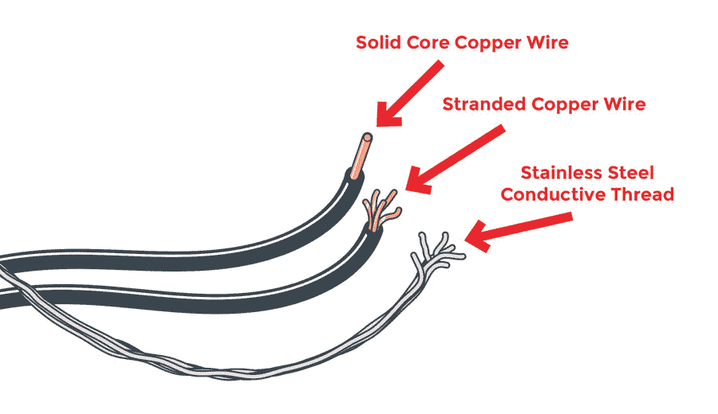

# LilyPad 基础:为您的项目提供动力

> 原文：<https://learn.sparkfun.com/tutorials/lilypad-basics-powering-your-project>

## 介绍

在本指南中，我们将讨论为您的 LilyPad 项目(包括电子缝纫和基于 Arduino 的项目)供电的选项、电池安全和维护，以及如何计算和考虑项目的电力限制。创建可穿戴和织物项目有其自身的考虑因素，我们还将介绍何时从导电线连接切换到有线连接是有意义的。

LilyPad 项目通常是可穿戴或便携式的，这意味着使用电池在旅途中完成最终项目。然而，除了插上电池，还有一些选项可以为您的项目供电。请继续阅读，了解详细介绍系统可用的不同电源和选项的章节。

**Warning:** The LilyPad ecosystem was designed to run on 3.3V, and most of the power boards you will find in the line will accommodate either a 3V CR2032 coin cell battery or 3.7V Lithium Polymer battery. Some LilyPad boards have voltage regulators on board and have more flexibility in the power source you use with them. Details on alternative power options are covered throughout the guide.

我们为您整理了一些提示，以帮助您决定使用什么电源、电池供电可以持续多长时间以及其他注意事项。了解项目所需的电压、项目中使用的 LilyPad 板的总电流消耗以及电池容量，将有助于您选择最佳操作方案。

### 推荐阅读

如果您不熟悉以下概念，我们建议您在继续之前查看这些教程。

 [### 电压、电流、电阻和欧姆定律](https://learn.sparkfun.com/tutorials/voltage-current-resistance-and-ohms-law) Learn about Ohm's Law, one of the most fundamental equations in all electrical engineering.[Favorited Favorite](# "Add to favorites") 132 [### 电池技术](https://learn.sparkfun.com/tutorials/battery-technologies) The basics behind the batteries used in portable electronic devices: LiPo, NiMH, coin cells, and alkaline.[Favorited Favorite](# "Add to favorites") 50 [### 如何为项目提供动力](https://learn.sparkfun.com/tutorials/how-to-power-a-project) A tutorial to help figure out the power requirements of your project.[Favorited Favorite](# "Add to favorites") 67 [### 电力](https://learn.sparkfun.com/tutorials/electric-power) An overview of electric power, the rate of energy transfer. We'll talk definition of power, watts, equations, and power ratings. 1.21 gigawatts of tutorial fun 54 [### 什么是电池？](https://learn.sparkfun.com/tutorials/what-is-a-battery) An overview of the inner workings of a battery and how it was invented.[Favorited Favorite](# "Add to favorites") 23

## 计算功率需求:工作电压

大多数 LilyPad 项目可以轻松地使用 3.7V 可充电锂聚合物电池。每个 LilyPad 板所围绕的微控制器或主传感器或元件在其数据手册中记录了其特定的工作电压需求。您可以在 SparkFun.com 目录页面的*文档*选项卡中找到产品的数据表。

*Example of the documents tab for the [LilyPad Arduino USB - ATmega32U4 Board](https://www.sparkfun.com/products/12049).*

阅读数据手册时，寻找**工作电压**——该文档通常会提供最小和最大电压范围。如果产品没有附带数据表，您也可以查看原理图。

如果您没有给电路板足够大的电压，它可能无法正常工作(您可能会看到代码在 LilyPad Arduino 上运行的奇怪行为，串行端口中传感器的奇怪读数，或者暗淡的 led)。如果您的项目接收的电压高于其建议范围，您可能会损坏电路板或大大减少工作时间。确保您为项目选择的电源在电路板的推荐范围内。

这里列出了常见的 LilyPad 板及其需求。中间一栏显示电路板上来自输入电压的调节电压。如果您选择的主板不包含内置稳压器，您需要密切关注您的电源，以确保它与您的项目兼容。最后一列显示了每个板可以接受的输入电压，请注意，这可能高于 3.3V，这是 LilyPad 项目的建议工作电压。

| 板 | 电压调整 | 输入电压 |
| [LilyTiny](https://www.sparkfun.com/products/11364) | 不 | 1.8V - 5.5V |
| [LilyTwinkle](https://www.sparkfun.com/products/11364)/[LilyTwinkle proto snap](https://www.sparkfun.com/products/11590) | 不 | 1.8V - 5.5V |
| [原始捕捉](https://www.sparkfun.com/products/14063) | 3.3V | 1.62 伏至 3.63 伏，通过 USB 为 5.0 伏 |
| [LilyPad Arduino 简单](https://www.sparkfun.com/products/10274) | 不 | 2.7V - 5.5V |
| [【lilypad arduino 简单捕捉】](https://www.sparkfun.com/products/10941) | 3.3V | 2.7V - 5.5V |
| [lily pad Arduino USB-atmega 32 u 4 板卡](https://www.sparkfun.com/products/12049) | 3.3V | 2.7V - 5.5V |
| [Lilypad USB Plus](https://www.sparkfun.com/products/14631) | 3.3V | 1.8V - 5.5V |
| [LilyPad Arduino 328 主板](https://www.sparkfun.com/products/13342) | 不 | 2.7V - 5.5V |
| [LilyPad XBee](https://www.sparkfun.com/products/12921) | 3.3V | 1.8V - 9V |
| [LilyPad Simblee BLE 电路板- RFD77101](https://www.sparkfun.com/products/13633) | 3.3V | 1.8V–3.6V |
| [LilyPad MP3](https://www.sparkfun.com/products/11013) | 3.3V | 3.7V - 6V |

**Some components in my project need more than 3.3V to operate, can I still use them with a LilyPad Arduino?**

Most boards in the LilyPad system are designed to operate at the system voltage (3.3V), but if you are mixing and matching from other sewable or non-sewable product lines you may encounter a sensor or board that needs 5V. In this case, first try to find a 3.3V version of the board. If needed, you can hook up a [Bi-Directional Logic Level Converter](https://learn.sparkfun.com/tutorials/bi-directional-logic-level-converter-hookup-guide).

## 计算功率需求:电流消耗

除了检查项目中 LilyPad 板的工作电压之外，您还需要查看项目消耗的电流，并与微控制器或电池电源提供的电流进行比较。

项目的电流取决于您选择在项目中使用的 LilyPad 电路板的总数，适用于 LilyPad Arduino 控制的电路和电子缝纫项目。如果您的电源或电池不提供项目所需的电流，电路可能会开始以奇怪或不可预测的方式运行。

与电压一样，您可以查看各个 LilyPad 板的数据手册，以评估您的项目将使用什么。

对于使用 LilyPad Arduino 的项目，检查每个单独的 I/O(输入/输出)sew 选项卡可以提供多少电流——lily pad 板(如 led)的数量将受此数量的限制。对于大多数 LilyPad Arduinos，每个 I/O sew 选项卡的电流为 40mA。

更好的做法是总结并假设电路需要更多的电流，而不是不提供足够的电流。

如果您的项目使用需要大量电流的组件，如电机或大量 led，您可能需要重新调整电源选择，甚至为 LilyPad Arduino 和电流密集型电路板使用单独的电源。

随着您获得使用 LilyPad 板的经验，通过查看板的数据手册并做一些数学计算，就可以很容易地估算出项目所需的电流量。你也可以通过用数字万用表或者有电流读数的可变 DC 电源来测量，准确地找出你的项目使用了多少电流。

[https://www.youtube.com/embed/SLkPtmnglOI/?autohide=1&border=0&wmode=opaque&enablejsapi=1](https://www.youtube.com/embed/SLkPtmnglOI/?autohide=1&border=0&wmode=opaque&enablejsapi=1)

#### 阅读世界示例:LilyPad LEDs 和 LilyTiny

让我们探讨一个关于 LilyPad 项目的常见问题的例子:*我可以将多少个 led 连接到 LilyTiny(或 LilyTwinkle)板上？*

典型的 **LilyPad LED** 在全亮度下使用 20mA 的电流。将它乘以你使用的 led 数量，再加上运行所有功能的 LilyPad 的 10mA 电流，你就可以估算出你的平均电流消耗。

**Example:**

A project with 10 LilyPad LEDs connected to a LilyTiny Board

***20mA * 10 + 10mA = 210mA***

*有关 LilyPad LED 的更多详细信息，请查看我们的[lily pad LED 供电项目](https://learn.sparkfun.com/tutorials/powering-lilypad-led-projects)。*

 [### 为 LilyPad LED 项目供电

#### 2016 . 12 . 17](https://learn.sparkfun.com/tutorials/powering-lilypad-led-projects) Learn how to calculate how many LEDs your LilyPad project can power and how long it will last.[Favorited Favorite](# "Add to favorites") 8

## 考虑导电线电阻

现在你已经完成了计算，还有一个因素需要考虑:导电线电阻。与电阻很小的铜线不同，导电线的电阻会根据制造线的金属和线的厚度而变化。许多导电线以欧姆/英尺为单位列出电阻。这个数字越低越好，因为电阻越小意味着更多的电可以通过你的项目中使用的组件。

您可能希望您的项目能够完美运行，但是远距离连接的电阻可能会导致电路出现一些额外的复杂情况。

基本电气特性[欧姆定律](https://learn.sparkfun.com/tutorials/voltage-current-resistance-and-ohms-law#ohms-law)指出，电流通过高电阻材料会导致电压下降。电流越大，电压降越大。这意味着，即使为你的 LilyPad 供电的[脂电池](https://www.sparkfun.com/products/13112)可能会输出 3.7 伏，但当它通过线到达你的组件时，它可能会降至 3.0 伏或更低。许多电子元件，如发光二极管，需要一定的电压才能正常工作。为了最小化电压降，我们需要降低电源连接的电阻。有几种方法可以做到这一点:

*   **尽可能缩短电源连接的长度**。因为阻力随着长度增加，如果你减少长度，你就会减少阻力。

*   **减少线本身的阻力**。较粗的线比较细的线具有较低的阻力，一次使用多股线可以进一步降低阻力。

**Tip:**

Use a non conductive thread to stitch bundled thread (either placed together or braided) to your base fabric. Leave enough open spaces in the stitching so you are able to stitch conductive thread to the larger thread bundle when connecting components. This video from e-textile expert Lynne Bruning shows this technique at around the 4:10 mark:

[https://www.youtube.com/embed/G33nkPVcZRA?t=4m9s/?autohide=1&border=0&wmode=opaque&enablejsapi=1](https://www.youtube.com/embed/G33nkPVcZRA?t=4m9s/?autohide=1&border=0&wmode=opaque&enablejsapi=1)

### 导电线替代品

对于需要线程长距离传输的大型项目，具有大量耗电部件的项目，如大量的 LilyPad 像素板，或者在线程可能因压力而断裂的地方，以下是一些适用于可穿戴设备的替代方案:

#### 导电带

编织有柔性绞线的特种尼龙丝带是低电阻导电线的绝佳替代品。为了在项目中使用，你需要将焊接到丝带内的金属丝上。

 

### [【导电丝带-3-导体(1 码)](https://www.sparkfun.com/products/retired/10172)

[Retired](https://learn.sparkfun.com/static/bubbles/ "Retired") DEV-10172

这里我们有一些导电丝带。本质上，它是一种由 3 根导线织成的织物。它大致测量…

**Retired**[Favorited Favorite](# "Add to favorites") 25[Wish List](# "Add to wish list")

#### 导电织物迹线

您可以使用导电织物细条创建自己的低电阻走线。我们建议使用烫印粘合剂附着到织物或丝带上，然后使用导电线将元件手工缝合到走线上。

不要忘记像处理导线一样对织物迹线进行绝缘处理。

#### 绞线

另一种选择是从导电线切换到传统线。电线的电阻比线低得多，这使得你可以使用比导电线电路更多的发光二极管。你将不得不从缝纫切换到焊接，但很容易将电线焊接到你通常会连接线的同一缝纫片上。

 

将**添加到您的[购物车](https://www.sparkfun.com/cart)中！**

 **### 带状电缆- 6 线(15 英尺)

[In stock](https://learn.sparkfun.com/static/bubbles/ "in stock") CAB-10646

当你需要在没有大量电线的情况下进行大量连接时，带状电缆非常有用。没什么…

$3.503[Favorited Favorite](# "Add to favorites") 19[Wish List](# "Add to wish list")** **如果反复弯曲，金属丝容易断裂。对于需要最大灵活性的可穿戴项目，使用绞合线(非实心线)，并寻找特别柔软的硅树脂外套线。对于将被清洗的项目，水可能会渗入暴露的绞合线中，被截留并随着时间的推移可能会腐蚀它。在电线的切割端涂上少量硅酮密封胶，以防止这种情况发生。

When soldering, be careful not to melt or burn nearby fabric. Elevate or insulate the back of the LilyPad board from any backing fabric before applying heat.

如果你以前从未焊接或使用过导线，我们建议你访问以下教程。

 [### 如何焊接:通孔焊接](https://learn.sparkfun.com/tutorials/how-to-solder-through-hole-soldering) This tutorial covers everything you need to know about through-hole soldering.[Favorited Favorite](# "Add to favorites") 70 [### 使用导线](https://learn.sparkfun.com/tutorials/working-with-wire) How to strip, crimp, and work with wire.[Favorited Favorite](# "Add to favorites") 50

一旦确定了项目的电源需求和考虑因素，就该为项目选择电源了。

## 电源选项:使用内置 USB 连接器

在对 LilyPad Arduino 项目进行编程时，您可以使用将 LilyPad Arduino 连接到电脑的 USB 电缆提供的电源。确保 LilyPad Arduino 上的滑动开关设置在 on 位置，以便在制作原型时上传代码并启动您的电路板。

这种方法适用于带有内置微型 USB 端口的 LilyPad Arduinos 以及那些带有编程头和 [LilyPad FTDI 基本分支](https://www.sparkfun.com/products/10275)的 Arduinos。

带有微型 USB 连接器的 LilyPad 板可以由 5V 锂离子电池组供电，例如用于[眼镜](https://www.sparkfun.com/spectacle)系列的电池或用于手机充电的备用电池。

 

### [锂离子电池组- 2.5Ah (USB)](https://www.sparkfun.com/products/retired/14367)

[Retired](https://learn.sparkfun.com/static/bubbles/ "Retired") PRT-14367

我们采用了经典的便携式可充电锂离子电池组，并对设计进行了调整，使其适合低成本使用

2 **Retired**[Favorited Favorite](# "Add to favorites") 2[Wish List](# "Add to wish list")

如果您的项目不是便携式或可穿戴式的(例如壁挂式或永久安装)，您可以选择为您的项目使用 5V 墙壁适配器电源。插入专用电源将消除项目中不断更换电池或给电池充电的需要。

 

将**添加到您的[购物车](https://www.sparkfun.com/cart)中！**

 **### [【墙上适配器电源- 5VDC，2A (USB Micro-B)](https://www.sparkfun.com/products/15311)

[In stock](https://learn.sparkfun.com/static/bubbles/ "in stock") TOL-15311

这是一个高品质的开关“壁式电源”AC 到 DC 5V 2000mA USB 微型 B 壁式电源，专为 S…

$6.50[Favorited Favorite](# "Add to favorites") 2[Wish List](# "Add to wish list")**** 

将**添加到您的[购物车](https://www.sparkfun.com/cart)中！**

 **### [壁式适配器电源- 5.1V DC 2.5A (USB Micro-B)](https://www.sparkfun.com/products/13831)

[In stock](https://learn.sparkfun.com/static/bubbles/ "in stock") TOL-13831

这是一个高品质的开关“壁式”交流到 DC 5.1V 2500ma USB 微型 B 壁式电源，专为…

$8.9521[Favorited Favorite](# "Add to favorites") 47[Wish List](# "Add to wish list")**********I found a wall adapter or battery pack with a micro USB connector on it - can I use it to power my LilyPad project?**

Micro USB does not necessarily mean the battery pack is right for your project. When sourcing battery packs outside the SparkFun catalog make sure to double check the labeling on the packaging and the product to verify it is a 5V supply.

LilyPad Simple Power 是一种为您提供一定灵活性的板，它可以容纳可充电电池或连接到墙上适配器的微型 USB 电缆，用于没有内置电池连接器的 LilyPad 项目。

 

将**添加到您的[购物车](https://www.sparkfun.com/cart)中！**

 **### [LilyPad 简单动力](https://www.sparkfun.com/products/11893)

[In stock](https://learn.sparkfun.com/static/bubbles/ "in stock") DEV-11893

LilyPad Simple Power 是一个简单的 e-textile 板，充电速率为 500mA，可让您连接和充电 lipo 电池…

$11.50[Favorited Favorite](# "Add to favorites") 18[Wish List](# "Add to wish list")** **## 电源选项:可充电锂聚合物电池

Only use 3.7V LiPo batteries connected to LilyPad JST ports. Do not use non-LiPo or other batteries in these JST ports, even if they have the same connector. The charging circuit could damage the battery. Always double check the orientation of the power and ground wires on the battery, depending on the manufacturer they may be reversed. All LiPo batteries carried by SparkFun have a standard configuration.

许多 LilyPad 产品都配备了 JST 连接器，用于连接 3.7V 锂聚合物(LiPo)电池。这些主板包括一个内置的电池充电电路，当通过 USB 连接连接到计算机或壁式电源插座时，可以为 LiPo 充电。

 

将**添加到您的[购物车](https://www.sparkfun.com/cart)中！**

 **### [LilyPad ProtoSnap 加](https://www.sparkfun.com/products/14346)

[In stock](https://learn.sparkfun.com/static/bubbles/ "in stock") DEV-14346

LilyPad ProtoSnap Plus 是一个可缝合的电子原型板，您可以使用它来探索电路和编程，测试

$42.95[Favorited Favorite](# "Add to favorites") 10[Wish List](# "Add to wish list")**** 

将**添加到您的[购物车](https://www.sparkfun.com/cart)中！**

 **### [lily pad Arduino USB-atmega 32 u 4 板卡](https://www.sparkfun.com/products/12049)

[Out of stock](https://learn.sparkfun.com/static/bubbles/ "out of stock") DEV-12049

LilyPad 是一种可穿戴的电子纺织技术，设计有大型连接垫，允许它们缝进衣服和公司

$27.957[Favorited Favorite](# "Add to favorites") 39[Wish List](# "Add to wish list")**** 

将**添加到您的[购物车](https://www.sparkfun.com/cart)中！**

 **### [LilyPad MP3](https://www.sparkfun.com/products/11013)

[Out of stock](https://learn.sparkfun.com/static/bubbles/ "out of stock") DEV-11013

LilyPad MP3 播放器是您的一体化音频解决方案，包含兼容 Arduino 的微控制器、MP3(以及许多其他……

$56.505[Favorited Favorite](# "Add to favorites") 28[Wish List](# "Add to wish list")**** 

将**添加到您的[购物车](https://www.sparkfun.com/cart)中！**

 **### [LilyPad 简单动力](https://www.sparkfun.com/products/11893)

[In stock](https://learn.sparkfun.com/static/bubbles/ "in stock") DEV-11893

LilyPad Simple Power 是一个简单的 e-textile 板，充电速率为 500mA，可让您连接和充电 lipo 电池…

$11.50[Favorited Favorite](# "Add to favorites") 18[Wish List](# "Add to wish list")**** 

### [LilyPad Arduino 简易棋盘](https://www.sparkfun.com/products/retired/10274)

[Retired](https://learn.sparkfun.com/static/bubbles/ "Retired") DEV-10274

这是 LilyPad Arduino 简易板。它由带有 Arduino 引导程序的 ATmega328 控制。它的针脚比…少

**Retired**[Favorited Favorite](# "Add to favorites") 12[Wish List](# "Add to wish list") 

### [LilyPad Simblee BLE 板- RFD77101](https://www.sparkfun.com/products/retired/13633)

[Retired](https://learn.sparkfun.com/static/bubbles/ "Retired") DEV-13633

LilyPad Simblee BLE 板是一款可穿戴式开发板，允许您通过 Blu……

2 **Retired**[Favorited Favorite](# "Add to favorites") 14[Wish List](# "Add to wish list")******** ********SparkFun 搭载了多种与 LilyPad 系统兼容的 3.7V 锂聚合物电池。电池的容量取决于项目的预期运行时间、尺寸限制和其他因素。

 

将**添加到您的[购物车](https://www.sparkfun.com/cart)中！**

 **### [锂离子电池-1Ah](https://www.sparkfun.com/products/13813)

[In stock](https://learn.sparkfun.com/static/bubbles/ "in stock") PRT-13813

基于锂离子化学的超薄超轻电池。每个电池在 1000 毫安时输出 3.7V 的标称电压！

$10.958[Favorited Favorite](# "Add to favorites") 75[Wish List](# "Add to wish list")**** 

将**添加到您的[购物车](https://www.sparkfun.com/cart)中！**

 **### [锂离子电池- 850mAh](https://www.sparkfun.com/products/13854)

[In stock](https://learn.sparkfun.com/static/bubbles/ "in stock") PRT-13854

这是基于锂离子化学的非常薄、非常轻的电池。每个电池在 850℃时输出 3.7V 的标称电压…

$10.952[Favorited Favorite](# "Add to favorites") 17[Wish List](# "Add to wish list")**** 

将**添加到您的[购物车](https://www.sparkfun.com/cart)中！**

 **### [锂离子电池- 400mAh](https://www.sparkfun.com/products/13851)

[In stock](https://learn.sparkfun.com/static/bubbles/ "in stock") PRT-13851

这是一种基于锂离子化学的非常小、非常轻的电池，具有目前最高的能量密度…

$5.5010[Favorited Favorite](# "Add to favorites") 41[Wish List](# "Add to wish list")**** 

将**添加到您的[购物车](https://www.sparkfun.com/cart)中！**

 **### [锂离子电池- 2Ah](https://www.sparkfun.com/products/13855)

[In stock](https://learn.sparkfun.com/static/bubbles/ "in stock") PRT-13855

这是基于锂离子化学的非常薄、非常轻的电池。每个电池在 200 伏时输出一个标称的 3.7 伏电压…

$13.959[Favorited Favorite](# "Add to favorites") 43[Wish List](# "Add to wish list")**** 

将**添加到您的[购物车](https://www.sparkfun.com/cart)中！**

 **### [锂离子电池- 6Ah](https://www.sparkfun.com/products/13856)

[In stock](https://learn.sparkfun.com/static/bubbles/ "in stock") PRT-13856

如果你需要一些果汁，这 6Ah 锂离子电池是给你的。这些是基于锂离子化学电池的非常紧凑的电池…

$32.507[Favorited Favorite](# "Add to favorites") 40[Wish List](# "Add to wish list")**** 

将**添加到您的[购物车](https://www.sparkfun.com/cart)中！**

 **### [锂离子电池- 110mAh](https://www.sparkfun.com/products/13853)

[In stock](https://learn.sparkfun.com/static/bubbles/ "in stock") PRT-13853

这是一种基于锂离子化学的非常小、非常轻的电池。这是最高的能量密度电流…

$5.503[Favorited Favorite](# "Add to favorites") 22[Wish List](# "Add to wish list")**** 

### [【E-Textiles 电池- 110mAh (2C 放电)](https://www.sparkfun.com/products/13112)

[Out of stock](https://learn.sparkfun.com/static/bubbles/ "out of stock") PRT-13112

这是一种基于聚合物锂离子化学的非常小、非常轻的电池。这是最高的能量密度…

6[Favorited Favorite](# "Add to favorites") 26[Wish List](# "Add to wish list")************ ************### [使用脂电池和电池充电](#battery)

LilyPad projects are hand-washable, but **always remove the battery before washing your project** and air-dry your project for several days before replacing the battery.

每个具有充电功能的 LilyPad 板都有一个默认的充电速率。如果这个默认充电电流设置为 **100mA** ，那么 100mAh 的电池将在 1 小时内充电，1000mAh 的电池在 10 小时内充电，以此类推。由于主板被设置为以 100 毫安的速率充电，我们不建议连接低容量的 LiPo 电池(即 40 毫安的 LiPo 电池)进行充电。

Most LilyPad products with an onboard charging circuit are set at 100mA, however, the [LilyPad MP3](https://www.sparkfun.com/products/11013) and [LilyPad Simple Power](https://www.sparkfun.com/products/11893) have a default charge rate of 500mA. If using a LiPo battery with capacity below the set charge rate, we recommend charging separately using a [SparkFun Adjustable LiPo Charger](https://www.sparkfun.com/products/14380).

 

将**添加到您的[购物车](https://www.sparkfun.com/cart)中！**

 **### [SparkFun 可调脂肪充电器](https://www.sparkfun.com/products/14380)

[In stock](https://learn.sparkfun.com/static/bubbles/ "in stock") PRT-14380

SparkFun 可调 LiPo 充电器是一款单电池锂聚合物(LiPo)和锂离子电池充电器。因为这是…

$13.504[Favorited Favorite](# "Add to favorites") 22[Wish List](# "Add to wish list")** **要给连接的电池充电，请将主板插入 USB 电源。电池充电时,“CHG”LED 会亮起。当电池充满电时，LED 将关闭。

*Inserting a LiPo battery into the JST port on a LilyPad ProtoSnap Plus*

即使使用 USB 电源，将 LiPo 电池永久连接到主板上也是安全的。电池不会被过度充电。我们建议您不要让正在充电的电池无人看管。

Always turn the LilyPad board off before inserting or removing a battery.

电池连接器可能是紧配合的，难以移除；断开电池时，切勿拉扯电线。用一把尖嘴钳或剪刀沿着塑料轻轻将插头从连接器中拔出。

*Tip: there are two small "nubs" on the top of the plastic battery connector that can be shaved off with a hobby knife to make the battery easier to remove.***I found this cool battery pack with a JST connector on it - can I use it in my LilyPad project?**

JST connectors are a common type of connector, just because a product has it does not mean it is LilyPad-compatible.When sourcing batteries outside the SparkFun catalog make sure to double check:

     Is it 3.7V?
     Is it a rechargeable Lithium Polymer/Lithium Ion battery? 

### [LiPo 电池安全与保养](#lipo_safety_care)

**Warning:** LiPo batteries can explode or catch fire if mishandled or damaged. They can become unstable and dangerous if punctured or exposed to high temperatures.

虽然 LiPo 电池是为您的项目提供可充电电源的一个很好的选择，但它们确实有一些安全问题。这一部分将涵盖安全处理和在你的项目中使用 LiPos 的技巧。

#### 储存；储备

*   请务必将电池存放在没有尖锐物体的环境中。在您的项目中安装电池时，请注意不要让它接触项目中可能挤压、戳伤或挤压电池的部分。

*   请勿将 LiPo 电池与金属物品(如发夹、项链或任何其他导电物品或材料)一起运输或存放。

*   在项目中安装或储存时，将电池保存或储存在阴凉干燥的地方/环境中。如果您不打算长时间使用您的项目，请取出电池并单独存放。

#### 远离热源和湿气

*   让你的脂肪电池远离会损坏它的环境。不要将 LiPo 电池浸入液体中。如果需要清洗，请将电池从项目中取出。

*   不要在任何热源附近使用或存放电池。为了将电池固定在你的项目上，velcro 是一个临时的选择，或者缝在一个袋子里或者放在一个塑料盒子里。切勿直接在 LiPo 电池上或周围熨烫或使用热胶水。

#### 应变消除

使用这些脂肪电池的一个缺点是它们脆弱的电源连接。这些类型的电池是为永久安装在设备中而制造的，不像可穿戴设备有时会发生的那样经常被移除。很容易从内置于电池中的安全电路的端子上意外拉出或折断电源线。

您可以通过将电线放在一边并用绝缘胶带固定来减轻电线的张力，这将有助于在拉动电线进行拆卸时减轻电池连接处的张力。

#### 每次使用前检查电池

*   LiPo 电池的短路或损坏可能并不总是显而易见——检查电池是否有膨胀、发热或其他变化。如果电池看起来损坏，请立即取出。

*   如果电池在使用、充电或储存过程中发出异味、发热、变色或变形，或以任何方式出现异常，请立即将其从项目或电池充电器中取出并停止使用。确保妥善处理您的电池，不要扔进垃圾桶！请联系您当地的电子垃圾处理机构，了解如何在您所在的地区丢弃电池的详细信息。

## 电源选项:纽扣电池

LilyPad 系统包括容纳单个 [3V CR2032 纽扣电池](https://www.sparkfun.com/products/338)的电路板。这些电池通常是一次性使用的，但一些可充电的硬币电池可能在支架中工作。

 

将**添加到您的[购物车](https://www.sparkfun.com/cart)中！**

 **### [纽扣电池- 20mm (CR2032)](https://www.sparkfun.com/products/338)

[In stock](https://learn.sparkfun.com/static/bubbles/ "in stock") PRT-00338

CR2032 锂金属 3V 250mAh 纽扣电池。非常适合为低功耗处理器供电或连续几周闪烁 LED 灯…

$2.10[Favorited Favorite](# "Add to favorites") 33[Wish List](# "Add to wish list")******The name of the battery CR2032 has some important information contained in it:**

*   c 表示锂电池类型
*   r 表示圆形(圆柱形)电池形状
*   20 以毫米为单位指定包装尺寸(直径)
*   32 以毫米为单位指定高度。注意这是 3.2 毫米而不是 32 毫米

*In addition to confirming the voltage when selecting a battery (3V), pay special attention to the last two numbers of the part name as you may find batteries that appear to be compatible but are just slightly too large or small to fit into the LilyPad battery holders.*

LilyPad 产品线包括一个带开关的独立电池座，可以连接到定制项目，也可以内置在 LilyMini 板中，在一些 ProtoSnap 产品中也有提供。SparkFun 还为需要小尺寸的项目或想要焊接的用户提供了一个无缝标签的非 LilyPad 硬币电池座。

 

将**添加到您的[购物车](https://www.sparkfun.com/cart)中！**

 **### [LilyPad 硬币电池座-开关式- 20mm](https://www.sparkfun.com/products/13883)

[In stock](https://learn.sparkfun.com/static/bubbles/ "in stock") DEV-13883

当然，你那闪烁的、带有芯片曲调的 T 恤衫在聚会上真的很酷...但是在某些时候你需要关掉它。还有…

$2.1012[Favorited Favorite](# "Add to favorites") 49[Wish List](# "Add to wish list")**** 

将**添加到您的[购物车](https://www.sparkfun.com/cart)中！**

 **### 20mm 纽扣电池座(可缝)

[In stock](https://learn.sparkfun.com/static/bubbles/ "in stock") DEV-08822

这是普通 CR2032 型电池的硬币电池座。持有人有一个整洁的插入，弹出功能，使改变…

$1.504[Favorited Favorite](# "Add to favorites") 13[Wish List](# "Add to wish list")**** 

将**添加到您的[购物车](https://www.sparkfun.com/cart)中！**

 **### [LilyPad LilyMini 原声](https://www.sparkfun.com/products/14063)

[In stock](https://learn.sparkfun.com/static/bubbles/ "in stock") DEV-14063

LilyMini ProtoSnap 是开始学习创建交互式电子纺织品电路的好方法，在您开始之前…

$17.503[Favorited Favorite](# "Add to favorites") 15[Wish List](# "Add to wish list")**** 

将**添加到您的[购物车](https://www.sparkfun.com/cart)中！**

 **### 

[In stock](https://learn.sparkfun.com/static/bubbles/ "in stock") DEV-11590

ProtoSnap 系列是一种无需试验板即可构建项目原型的新方法。所有东西都连接在一个单独的业务对象上…

$19.501[Favorited Favorite](# "Add to favorites") 18[Wish List](# "Add to wish list")******************Can I use two LilyPad battery holders in series or a two battery pack I found for my LilyPad project?**

This depends on the LilyPad board you are powering. Two 3V batteries in series will supply 6V - some LilyPad boards do not have onboard regulation circuits and can be damaged by supplying them with more than 3V. For example, the LilyTiny and LilyTwinkle boards operate best between 2.4 and 5.5V. In these cases, a Lithium Ion/Lithium Polymer battery may be a better choice for your project.

Check out the [Calculating Power Needs](https://learn.sparkfun.com/tutorials/lilypad-basics-powering-your-project#calculating-power-needs-operating-voltage) section for more tips on selecting the right battery for your project's unique needs.

### 电池安全和维护

Lithium metal batteries can explode or catch fire if mishandled or damaged. They can become unstable and dangerous if punctured or exposed to high temperatures.

这一部分将涵盖安全处理和在您的项目中使用纽扣电池的技巧。

#### 储存；储备

*   请勿将硬币电池与金属物品(如发夹、项链或任何其他导电物品或材料)一起运输或存放。不要将松散的纽扣电池存放在一起，它们会相互接触，造成短路和放电。

*   在项目中安装或储存时，将电池保存或储存在阴凉干燥的地方/环境中。如果您不打算长时间使用您的项目，请取出电池并单独存放。

#### 远离热源和湿气

*   让你的硬币电池远离会损坏它的环境。不要将纽扣电池浸入液体中。如果需要清洗，请将电池从项目中取出。

*   不要在任何热源附近使用或存放电池。要将电池固定到您的项目中，请使用特制的电池盒、缝袋或放在塑料外壳中。切勿直接焊接到纽扣电池上；如果你需要将一个焊接到一个项目中，使用一个特殊的电池座或购买一个带有焊片的电池。

#### 每次使用前检查电池

*   硬币电池的短路或损坏可能并不总是显而易见-检查电池是否有膨胀、发热或其他变化。如果电池看起来损坏，请立即取出。

*   如果电池在使用、充电或储存过程中发出异味、发热、变色或变形，或以任何方式出现异常，请立即将其从项目或电池充电器中取出并停止使用。确保妥善处理您的电池，不要扔进垃圾桶！请联系您当地的电子垃圾处理机构，了解如何在您所在的地区丢弃电池的详细信息。

## 我的项目将在电池供电下运行多长时间？

要想知道您的项目将在电池供电下运行多长时间，您需要知道两件事:

*   您的项目使用多少电流
*   你的电池容量

电池容量以**毫安-小时** (mAh)为单位。这个数字告诉你一个充满电的电池在一个小时内可以提供多少毫安。大多数 LilyPad Arduino 套件附带的[电子纺织品电池](https://www.sparkfun.com/products/13112)容量为 110 毫安时。对于许多项目，尤其是有大量组件的项目，如 led，您可能希望使用更高容量的电池来延长运行时间。

To find out how long a battery will last, use this formula:

**Hours = Battery mAh / Project mA**

因此，电子纺织品电池只能为该项目供电大约半小时。这里有一个例子，如果项目需要长时间运行，例如在活动或展示期间，更大容量的电池是有意义的。代价是更高容量的电池也更大——确保为您的项目制定相应的电池存储/连接计划，以减少电线和织物的压力。

***以下是各种 SparkFun 电池和 lily pad led/lily pixels 数量的一些典型运行时间:***

| **发光二极管数量** | one | Two | five | Ten | Twenty |
| 电池名称 | 电池毫安时 | 工作时间 |
| [聚合物锂离子电池- 40mAh](https://www.sparkfun.com/products/11316) | Forty | One point three | Zero point eight | Zero point four | Zero point two | Zero point one |
| [电子纺织品电池-110 毫安时(2C 放电)](https://www.sparkfun.com/products/13112) | One hundred and ten | Three point seven | Two point two | One | Zero point five | Zero point three |
| [纽扣电池-20 毫米(CR2032) *](https://www.sparkfun.com/products/338) | Two hundred and fifty | Eight point three | Five | Two point three | One point two | .61 |
| [聚合物锂离子电池- 400mAh](https://www.sparkfun.com/products/10718) | four hundred | Thirteen point three | Eight | Three point six | One point nine | One |
| [聚合物锂离子电池- 850mAh](https://www.sparkfun.com/products/341) | Eight hundred and fifty | Twenty-eight point three | Seventeen | Seven point seven | Four | Two point one |
| [聚合物锂离子电池- 1000mAh](https://www.sparkfun.com/products/339) | One thousand | Thirty-three point three | Twenty | Nine point one | Four point eight | Two point four |
| [聚合物锂离子电池- 2000mAh](https://www.sparkfun.com/products/8483) | Two thousand | Sixty-six point seven | Forty | Eighteen point two | Nine point five | Four point nine |
| [聚合物锂离子电池- 6Ah](https://www.sparkfun.com/products/8484) | Six thousand | Two hundred | One hundred and twenty | Fifty-four point five | Twenty-eight point six | Fourteen point six |

`*`注意:纽扣电池是不可充电的。

**Caution:** The other [batteries](https://www.sparkfun.com/categories/54) in our catalog are not created especially for e-Textiles. Use caution to avoid shorting out conductive thread traces when using alternative batteries.

## 资源和更进一步

需要更多关于 LiPo 电池和可穿戴项目的信息？查看一些相关教程:

 [### 锂聚合物电池是如何制造的](https://learn.sparkfun.com/tutorials/how-lithium-polymer-batteries-are-made) We got the opportunity to tour the Great Power Battery factory. Checkout how LiPos are made 7 [### LilyPad 简易电源连接指南](https://learn.sparkfun.com/tutorials/lilypad-simple-power-hookup-guide) A basic guide for getting started using the LilyPad Simple Power with LiPo batteries.[Favorited Favorite](# "Add to favorites") 9 [### 电子纺织品的绝缘技术](https://learn.sparkfun.com/tutorials/insulation-techniques-for-e-textiles) Learn a few different ways to protect your conductive thread and LilyPad components in your next wearables project.[Favorited Favorite](# "Add to favorites") 16 [### 规划可穿戴电子项目](https://learn.sparkfun.com/tutorials/planning-a-wearable-electronics-project) Tips and tricks for brainstorming and creating a wearables project.[Favorited Favorite](# "Add to favorites") 25****************************************